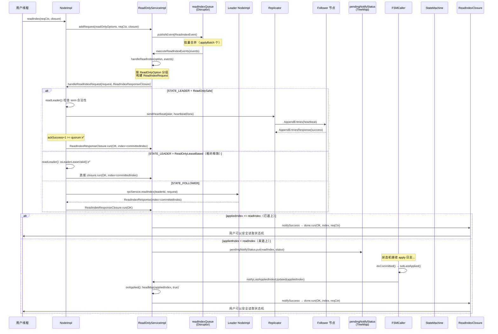
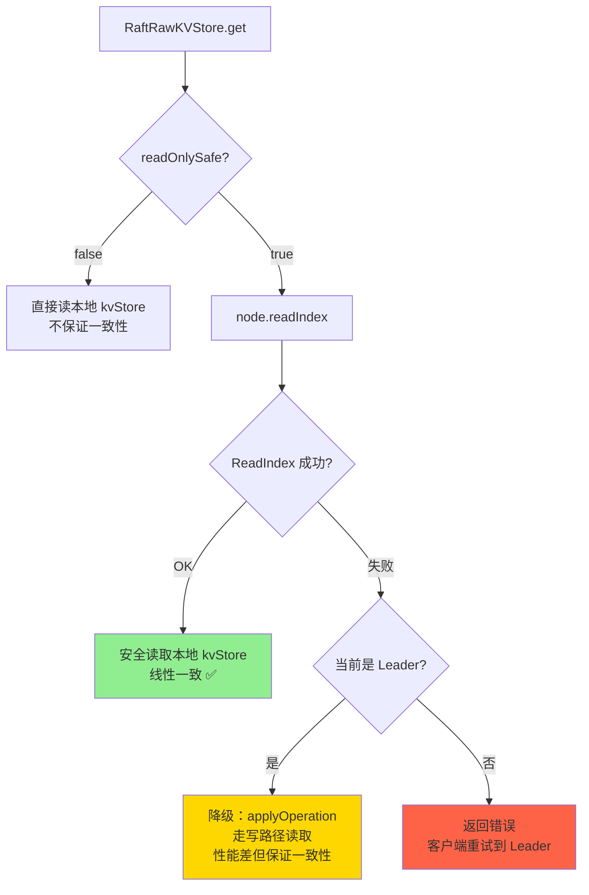
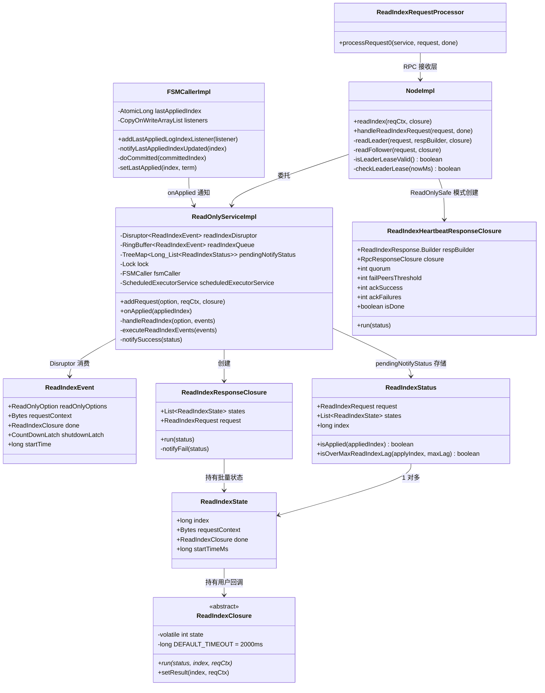

# S21：端到端读取链路 — Node.readIndex() → ReadIndexClosure 回调

> 本文档串联一次线性一致读请求的**完整生命周期**，与 S14（端到端写入链路）对称，横跨 5 个核心组件（NodeImpl → ReadOnlyServiceImpl → Replicator(heartbeat) → FSMCaller → ReadIndexClosure），是理解 JRaft 读路径的"脊柱"。
>
> 涉及源码文件：`NodeImpl.java`（3622 行）、`ReadOnlyServiceImpl.java`（475 行）、`ReadIndexRequestProcessor.java`（74 行）、`FSMCallerImpl.java`（788 行）、`RaftRawKVStore.java`（425 行）、`ReadIndexClosure.java`（167 行）
>
> **与 S14 写路径的对称关系**：
> - 写路径：`apply()` → applyQueue(Disruptor#1) → LogManager(Disruptor#2) → Replicator → BallotBox → FSMCaller(Disruptor#3) → StateMachine.onApply()
> - 读路径：`readIndex()` → readIndexQueue(Disruptor) → NodeImpl → Replicator(heartbeat) → pendingNotifyStatus → FSMCaller.onApplied → ReadIndexClosure.run()

---

## 目录

1. [问题推导](#1-问题推导)
2. [完整时序图](#2-完整时序图)
3. [阶段一：用户发起读请求（Node.readIndex）](#3-阶段一用户发起读请求nodereadindex)
4. [阶段二：ReadOnlyServiceImpl — Disruptor 批量处理](#4-阶段二readonlyserviceimpl--disruptor-批量处理)
5. [阶段三：NodeImpl — Leader/Follower 分发](#5-阶段三nodeimpl--leaderfollower-分发)
6. [阶段四：Leader 确认身份](#6-阶段四leader-确认身份)
7. [阶段五：等待 Apply 追上 ReadIndex](#7-阶段五等待-apply-追上-readindex)
8. [阶段六：回调通知用户](#8-阶段六回调通知用户)
9. [读路径 vs 写路径对比](#9-读路径-vs-写路径对比)
10. [RheaKV 中的读操作实践](#10-rheakv-中的读操作实践)
11. [数据结构关系图](#11-数据结构关系图)
12. [面试高频考点 📌](#12-面试高频考点-)
13. [生产踩坑 ⚠️](#13-生产踩坑-️)

---

## 1. 问题推导

### 1.1 核心问题

> 用户调用 `Node.readIndex(reqCtx, closure)` 发起一次线性一致读后，请求经过了哪些组件？每个阶段做了什么？最终怎么确认"可以安全读取"并回调通知用户？

### 1.2 如果让我设计

一次线性一致读请求必须解决三个核心问题：
1. **确认 Leader 身份** — 防止脑裂场景下旧 Leader 响应过期数据
2. **获取 readIndex** — 记录当前 committedIndex 作为"安全读取点"
3. **等待 Apply 追上** — 状态机必须已经应用到 readIndex 对应的日志，才能安全读取

### 1.3 关键洞察：读路径只有一次 Disruptor

> 📌 **面试高频考点**：与写路径经过**三次 Disruptor** 不同，读路径只经过**一次 Disruptor**（`ReadOnlyServiceImpl.readIndexQueue`），且**不涉及任何磁盘 I/O**。
>
> 读路径的延迟主要来自两部分：
> - **Leader 身份确认**（ReadOnlySafe 模式）：一次心跳 RTT
> - **等待 Apply 追上**：如果 `appliedIndex < readIndex`，需要等待状态机追上

### 1.4 两种模式的延迟对比

| 模式 | Leader 身份确认 | 等待 Apply | 总延迟 |
|------|---------------|-----------|--------|
| **ReadOnlySafe**（默认） | 1 次心跳 RTT（~ms） | 取决于 apply 速度 | RTT + apply 延迟 |
| **ReadOnlyLeaseBased** | 0（依赖租约） | 取决于 apply 速度 | apply 延迟 |

---

## 2. 完整时序图



---

## 3. 阶段一：用户发起读请求（Node.readIndex）

### 3.1 入口方法 — `NodeImpl.readIndex()`（`NodeImpl.java:1483-1494`）

```java
// NodeImpl.java:1483-1494
@Override
public void readIndex(final byte[] requestContext, final ReadIndexClosure done) {
    readIndex(this.raftOptions.getReadOnlyOptions(), requestContext, done);
}

@Override
public void readIndex(ReadOnlyOption readOnlyOptions, byte[] requestContext, ReadIndexClosure done) {
    if (this.shutdownLatch != null) {
        ThreadPoolsFactory.runClosureInThread(this.groupId, done,
            new Status(RaftError.ENODESHUTDOWN, "Node is shutting down."));
        throw new IllegalStateException("Node is shutting down");
    }
    Requires.requireNonNull(done, "Null closure");
    this.readOnlyService.addRequest(readOnlyOptions, requestContext, done);
}
```

**分支穷举清单**：
- □ `shutdownLatch != null` → 回调 `ENODESHUTDOWN` + 抛 `IllegalStateException`
- □ `done == null` → 抛 `NullPointerException`
- □ 正常 → 委托给 `ReadOnlyServiceImpl.addRequest()`

**与写路径 `apply()` 的对比**：

| 维度 | `apply(Task)` | `readIndex(reqCtx, closure)` |
|------|--------------|------------------------------|
| 入口检查 | `shutdownLatch` + 封装 LogEntry | `shutdownLatch` + `done != null` |
| 提交目标 | `NodeImpl.applyQueue`（Disruptor） | `ReadOnlyServiceImpl.readIndexQueue`（Disruptor） |
| 写磁盘 | ✅ 需要持久化日志 | ❌ 不涉及磁盘 I/O |
| closure 可为 null | ✅ done 可以为 null | ❌ `Requires.requireNonNull(done)` |

> ⚠️ **注意**：`readIndex()` 要求 `done` 不为 null（`Requires.requireNonNull`），而 `apply()` 允许 `done` 为 null。这是因为读请求的结果必须通过 closure 回调获取，而写请求可以"发了就忘"。

### 3.2 ReadOnlyServiceImpl.addRequest() — 入队（`ReadOnlyServiceImpl.java:341-377`）

```java
// ReadOnlyServiceImpl.java:341-377
@Override
public void addRequest(final ReadOnlyOption readOnlyOptions, final byte[] reqCtx,
                       final ReadIndexClosure closure) {
    if (this.shutdownLatch != null) {
        ThreadPoolsFactory.runClosureInThread(this.node.getGroupId(), closure,
            new Status(RaftError.EHOSTDOWN, "Was stopped"));
        throw new IllegalStateException("Service already shutdown.");
    }
    try {
        EventTranslator<ReadIndexEvent> translator = (event, sequence) -> {
            event.readOnlyOptions = readOnlyOptions;   // Safe 或 LeaseBased
            event.done = closure;                       // 用户回调
            event.requestContext = new Bytes(reqCtx);   // 用户上下文（原样透传）
            event.startTime = Utils.monotonicMs();      // 入队时间（延迟统计用）
        };

        switch (this.node.getOptions().getApplyTaskMode()) {
            case Blocking:
                this.readIndexQueue.publishEvent(translator);   // 阻塞等待
                break;
            case NonBlocking:
            default:
                if (!this.readIndexQueue.tryPublishEvent(translator)) {
                    // 队列满，快速失败
                    final String errorMsg = "Node is busy, has too many read-index requests...";
                    ThreadPoolsFactory.runClosureInThread(this.node.getGroupId(), closure,
                        new Status(RaftError.EBUSY, errorMsg));
                    this.nodeMetrics.recordTimes("read-index-overload-times", 1);
                    if (closure == null) {
                        throw new OverloadException(errorMsg);
                    }
                }
                break;
        }
    } catch (final Exception e) {
        ThreadPoolsFactory.runClosureInThread(this.node.getGroupId(), closure,
            new Status(RaftError.EPERM, "Node is down."));
    }
}
```

**分支穷举清单**：
- □ `shutdownLatch != null` → `EHOSTDOWN` + throw
- □ `Blocking` → `publishEvent()` 阻塞
- □ `NonBlocking` + 队列有空间 → 正常入队
- □ `NonBlocking` + 队列满 → `EBUSY` + `read-index-overload-times` 指标
- □ catch(Exception) → `EPERM, "Node is down."`

---

## 4. 阶段二：ReadOnlyServiceImpl — Disruptor 批量处理

### 4.1 ReadIndexEventHandler — 攒批（`ReadOnlyServiceImpl.java:121-150`）

```java
// ReadOnlyServiceImpl.java:121-150
private class ReadIndexEventHandler implements EventHandler<ReadIndexEvent> {
    private final List<ReadIndexEvent> events =
        new ArrayList<>(ReadOnlyServiceImpl.this.raftOptions.getApplyBatch()); // 默认 32

    @Override
    public void onEvent(final ReadIndexEvent newEvent, final long sequence, final boolean endOfBatch) {
        if (newEvent.shutdownLatch != null) {
            executeReadIndexEvents(this.events);   // flush 剩余
            reset();
            newEvent.shutdownLatch.countDown();     // 通知 shutdown 完成
            return;
        }
        this.events.add(newEvent);
        if (this.events.size() >= ReadOnlyServiceImpl.this.raftOptions.getApplyBatch() || endOfBatch) {
            executeReadIndexEvents(this.events);   // ★ 触发批量处理
            reset();
        }
    }
}
```

**批量合并设计**：多个 ReadIndex 请求被合并为一个 `ReadIndexRequest`（`entries` 列表），一次心跳确认多个请求的 readIndex，大幅减少心跳次数。

### 4.2 executeReadIndexEvents() — 按模式分组（`ReadOnlyServiceImpl.java:252-258`）

```java
// ReadOnlyServiceImpl.java:252-258
private void executeReadIndexEvents(final List<ReadIndexEvent> events) {
    if (events.isEmpty()) { return; }
    handleReadIndex(ReadOnlyOption.ReadOnlySafe, events);       // ① 先处理 Safe 模式
    handleReadIndex(ReadOnlyOption.ReadOnlyLeaseBased, events); // ② 再处理 Lease 模式
}
```

**设计要点**：同一批 events 中可能混有两种模式的请求，`handleReadIndex()` 内部用 `filter(it -> option.equals(it.readOnlyOptions))` 过滤。

### 4.3 handleReadIndex() — 构建批量请求（`ReadOnlyServiceImpl.java:230-250`）

```java
// ReadOnlyServiceImpl.java:230-250
private void handleReadIndex(final ReadOnlyOption option, final List<ReadIndexEvent> events) {
    final ReadIndexRequest.Builder rb = ReadIndexRequest.newBuilder()
        .setGroupId(this.node.getGroupId())
        .setServerId(this.node.getServerId().toString())
        .setReadOnlyOptions(ReadOnlyOption.convertMsgType(option));

    // ★ 按模式过滤，将每个 event 转换为 ReadIndexState
    final List<ReadIndexState> states = events.stream()
        .filter(it -> option.equals(it.readOnlyOptions))
        .map(it -> {
            byte[] bytes = it.requestContext.get();
            rb.addEntries(ZeroByteStringHelper.wrap(bytes == null ? new byte[0] : bytes));
            return new ReadIndexState(it.requestContext, it.done, it.startTime);
        })
        .collect(Collectors.toList());

    if (states.isEmpty()) { return; }

    final ReadIndexRequest request = rb.build();
    // ★ 提交给 NodeImpl 处理，附带 ReadIndexResponseClosure 等待回调
    this.node.handleReadIndexRequest(request, new ReadIndexResponseClosure(states, request));
}
```

**关键数据流**：
```
N 个 ReadIndexEvent → 按模式过滤 → M 个 ReadIndexState（M ≤ N）
                    → 1 个 ReadIndexRequest（entries 有 M 个条目）
                    → 1 个 ReadIndexResponseClosure（持有 M 个 states）
```

> 📌 **面试高频考点**：**批量合并的好处**——假设同一批有 20 个 ReadOnlySafe 请求，它们会被合并为 1 个 `ReadIndexRequest`，Leader 只需发一轮心跳确认，而不是 20 轮。这将心跳次数从 O(N) 降到 O(1)。

---

## 5. 阶段三：NodeImpl — Leader/Follower 分发

### 5.1 RPC 接收层（Follower 转发场景）

当 Follower 将 ReadIndex 请求转发给 Leader 时，Leader 通过 `ReadIndexRequestProcessor` 接收：

```java
// ReadIndexRequestProcessor.java:54-68
public Message processRequest0(final RaftServerService service, final ReadIndexRequest request,
                               final RpcRequestClosure done) {
    service.handleReadIndexRequest(request, new RpcResponseClosureAdapter<ReadIndexResponse>() {
        @Override
        public void run(final Status status) {
            if (getResponse() != null) {
                done.sendResponse(getResponse());    // 正常响应
            } else {
                done.run(status);                     // 错误响应
            }
        }
    });
    return null;  // ★ 异步处理，返回 null 表示不立即响应
}
```

### 5.2 handleReadIndexRequest() — 状态分发（`NodeImpl.java:1551-1577`）

```java
// NodeImpl.java:1551-1577
@Override
public void handleReadIndexRequest(final ReadIndexRequest request,
                                   final RpcResponseClosure<ReadIndexResponse> done) {
    final long startMs = Utils.monotonicMs();
    this.readLock.lock();                              // ★ 读锁（不需要写锁，不改变状态）
    try {
        switch (this.state) {
            case STATE_LEADER:
                readLeader(request, ReadIndexResponse.newBuilder(), done);
                break;
            case STATE_FOLLOWER:
                readFollower(request, done);            // 转发给 Leader
                break;
            case STATE_TRANSFERRING:
                done.run(new Status(RaftError.EBUSY, "Is transferring leadership."));
                break;
            default:
                done.run(new Status(RaftError.EPERM, "Invalid state for readIndex: %s.", this.state));
                break;
        }
    } finally {
        this.readLock.unlock();
        this.metrics.recordLatency("handle-read-index", Utils.monotonicMs() - startMs);
        this.metrics.recordSize("handle-read-index-entries", request.getEntriesCount());
    }
}
```

**分支穷举清单**：
- □ `STATE_LEADER` → `readLeader()`
- □ `STATE_FOLLOWER` → `readFollower()`（转发给 Leader）
- □ `STATE_TRANSFERRING` → `EBUSY`（正在转移领导权，拒绝读请求）
- □ 其他（`CANDIDATE` / `ERROR` / `SHUTTING` 等）→ `EPERM`

### 5.3 readFollower() — 转发给 Leader（`NodeImpl.java:1584-1595`）

```java
// NodeImpl.java:1584-1595
private void readFollower(final ReadIndexRequest request,
                          final RpcResponseClosure<ReadIndexResponse> closure) {
    if (this.leaderId == null || this.leaderId.isEmpty()) {
        closure.run(new Status(RaftError.EPERM, "No leader at term %d.", this.currTerm));
        return;
    }
    // ★ 将请求转发给 Leader，附加 peerId 标识来源
    final ReadIndexRequest newRequest = ReadIndexRequest.newBuilder()
        .mergeFrom(request)
        .setPeerId(this.leaderId.toString())
        .build();
    this.rpcService.readIndex(this.leaderId.getEndpoint(), newRequest, -1, closure);
}
```

**Follower 读路径特点**：
- 需要 **2 次网络 RTT**：Follower → Leader（ReadIndex RPC）+ Leader 心跳确认（ReadOnlySafe 模式）
- 如果 `leaderId` 为空，直接返回 `EPERM`，客户端需要重试

---

## 6. 阶段四：Leader 确认身份

### 6.1 readLeader() — Leader 处理读请求（`NodeImpl.java:1597-1660`）

这是读路径最关键的方法，负责确认 Leader 身份的合法性：

```java
// NodeImpl.java:1597-1660（关键片段）
private void readLeader(final ReadIndexRequest request, final ReadIndexResponse.Builder respBuilder,
                        final RpcResponseClosure<ReadIndexResponse> closure) {
    final int quorum = getQuorum();

    // ① 单节点快速路径：无需心跳确认
    if (quorum <= 1) {
        respBuilder.setSuccess(true).setIndex(this.ballotBox.getLastCommittedIndex());
        closure.setResponse(respBuilder.build());
        closure.run(Status.OK());
        return;
    }

    // ② 获取 readIndex = lastCommittedIndex
    final long lastCommittedIndex = this.ballotBox.getLastCommittedIndex();

    // ③ ★ 新 Leader 保护：本任期必须有已提交的日志
    if (this.logManager.getTerm(lastCommittedIndex) != this.currTerm) {
        closure.run(new Status(RaftError.EAGAIN,
            "ReadIndex request rejected because leader has not committed any log entry at its term, "
            + "logIndex=%d, currTerm=%d.", lastCommittedIndex, this.currTerm));
        return;
    }
    respBuilder.setIndex(lastCommittedIndex);  // ★ readIndex = lastCommittedIndex

    // ④ 如果请求来自 Follower/Learner，检查是否在配置中
    if (request.getPeerId() != null) {
        final PeerId peer = new PeerId();
        peer.parse(request.getServerId());
        if (!this.conf.contains(peer) && !this.conf.containsLearner(peer)) {
            closure.run(new Status(RaftError.EPERM,
                "Peer %s is not in current configuration: %s.", peer, this.conf));
            return;
        }
    }

    // ⑤ 确定读模式（租约失效时自动降级）
    ReadOnlyOption readOnlyOpt = ReadOnlyOption.valueOfWithDefault(
        request.getReadOnlyOptions(), this.raftOptions.getReadOnlyOptions());
    if (readOnlyOpt == ReadOnlyOption.ReadOnlyLeaseBased && !isLeaderLeaseValid()) {
        readOnlyOpt = ReadOnlyOption.ReadOnlySafe;  // ★ 租约失效 → 自动降级为 Safe
    }

    // ⑥ 按模式处理
    switch (readOnlyOpt) {
        case ReadOnlySafe:
            // 向所有 Follower 发送心跳，等待 Quorum 确认
            final List<PeerId> peers = this.conf.getConf().getPeers();
            final ReadIndexHeartbeatResponseClosure heartbeatDone =
                new ReadIndexHeartbeatResponseClosure(closure, respBuilder, quorum, peers.size());
            for (final PeerId peer : peers) {
                if (peer.equals(this.serverId)) { continue; }  // 跳过自己
                this.replicatorGroup.sendHeartbeat(peer, heartbeatDone);
            }
            break;
        case ReadOnlyLeaseBased:
            // 租约有效，直接返回
            respBuilder.setSuccess(true);
            closure.setResponse(respBuilder.build());
            closure.run(Status.OK());
            break;
    }
}
```

**分支穷举清单**：
- □ `quorum <= 1` → 单节点快速路径，直接返回 `committedIndex`
- □ `logManager.getTerm(lastCommittedIndex) != currTerm` → `EAGAIN`（新 Leader 保护）
- □ Follower 来源请求 + `peer not in conf` → `EPERM`
- □ `ReadOnlyLeaseBased` + `!isLeaderLeaseValid()` → 降级为 `ReadOnlySafe`
- □ `ReadOnlySafe` → 发送心跳等待 Quorum
- □ `ReadOnlyLeaseBased`（租约有效）→ 直接返回

### 6.2 新 Leader 保护机制详解

```
新 Leader 刚当选（currTerm = 5）：
  lastCommittedIndex = 100，logManager.getTerm(100) = 4（旧 Leader 的日志）
  → 拒绝读请求（EAGAIN）

新 Leader 提交了本任期的 noop 日志后：
  lastCommittedIndex = 101，logManager.getTerm(101) = 5（本任期日志）
  → 允许读请求 ✅
```

> 📌 **为什么需要这个保护？** 新 Leader 当选时，它不确定 `lastCommittedIndex` 对应的日志是否真的被多数节点持久化。只有本任期有日志提交后，才能确认 Leader 已掌握完整的已提交日志。这就是 Raft 论文中"Leader 当选后提交 noop 日志"的工程实现。

### 6.3 LeaseRead 租约校验（`NodeImpl.java`）

```java
// NodeImpl.java — isLeaderLeaseValid()
private boolean isLeaderLeaseValid() {
    final long monotonicNowMs = Utils.monotonicMs();
    if (checkLeaderLease(monotonicNowMs)) {
        return true;                    // 租约有效
    }
    // 租约过期，尝试刷新（检查一次心跳响应时间）
    checkDeadNodes0(this.conf.getConf().getPeers(), monotonicNowMs, false, null);
    return checkLeaderLease(monotonicNowMs);  // 再次检查
}

// NodeImpl.java — checkLeaderLease()
private boolean checkLeaderLease(final long monotonicNowMs) {
    return monotonicNowMs - this.lastLeaderTimestamp < this.options.getLeaderLeaseTimeoutMs();
    // leaderLeaseTimeoutMs = electionTimeoutMs * leaderLeaseTimeRatio / 100
    // 默认 leaderLeaseTimeRatio = 90，即 electionTimeout * 90%
}
```

**租约时间计算**：
```
leaderLeaseTimeoutMs = electionTimeoutMs × leaderLeaseTimeRatio / 100
                     = 1000 × 90 / 100 = 900ms（默认值）
```

> 留 10% 的安全余量：即使 Follower 在 `electionTimeout`（1000ms）时发起选举，Leader 在 900ms 时已经认为租约过期，不会再响应 LeaseRead。

### 6.4 ReadIndexHeartbeatResponseClosure — Quorum 计数（`NodeImpl.java:1500-1545`）

```java
// NodeImpl.java:1500-1545
private class ReadIndexHeartbeatResponseClosure
    extends RpcResponseClosureAdapter<AppendEntriesResponse> {

    final ReadIndexResponse.Builder             respBuilder;
    final RpcResponseClosure<ReadIndexResponse> closure;
    final int                                   quorum;
    final int                                   failPeersThreshold;
    int                                         ackSuccess;
    int                                         ackFailures;
    boolean                                     isDone;

    // failPeersThreshold 计算：
    // peers 偶数时 = quorum - 1（如 4 节点：quorum=3，fail=2）
    // peers 奇数时 = quorum    （如 5 节点：quorum=3，fail=3）

    @Override
    public synchronized void run(final Status status) {
        if (this.isDone) { return; }                // 幂等保护

        if (status.isOk() && getResponse().getSuccess()) {
            this.ackSuccess++;
        } else {
            this.ackFailures++;
        }

        // ★ Leader 自己也算一票（+1）
        if (this.ackSuccess + 1 >= this.quorum) {
            this.respBuilder.setSuccess(true);
            this.closure.setResponse(this.respBuilder.build());
            this.closure.run(Status.OK());           // ★ 心跳确认成功
            this.isDone = true;
        } else if (this.ackFailures >= this.failPeersThreshold) {
            this.respBuilder.setSuccess(false);
            this.closure.setResponse(this.respBuilder.build());
            this.closure.run(Status.OK());           // 心跳确认失败
            this.isDone = true;
        }
    }
}
```

**Quorum 计算示例**（3 节点集群）：
```
peers = [A(Leader), B, C]
quorum = 3/2 + 1 = 2
发送心跳给 B 和 C
只需 B 或 C 中的 1 个回复成功：ackSuccess(1) + 1(Leader 自己) = 2 >= quorum ✅
```

---

## 7. 阶段五：等待 Apply 追上 ReadIndex

### 7.1 ReadIndexResponseClosure.run() — 响应处理（`ReadOnlyServiceImpl.java:156-226`）

当 Leader 确认身份成功（心跳 Quorum / 租约有效）后，回调 `ReadIndexResponseClosure`：

```java
// ReadOnlyServiceImpl.java:172-226
@Override
public void run(final Status status) {
    // ① RPC 失败
    if (!status.isOk()) {
        notifyFail(status);
        return;
    }
    final ReadIndexResponse readIndexResponse = getResponse();
    // ② Leader 降级或心跳 Quorum 失败
    if (!readIndexResponse.getSuccess()) {
        notifyFail(new Status(-1,
            "Fail to run ReadIndex task, maybe the leader stepped down."));
        return;
    }

    // ③ 构建 ReadIndexStatus，记录 readIndex
    final ReadIndexStatus readIndexStatus = new ReadIndexStatus(
        this.states, this.request, readIndexResponse.getIndex());
    for (final ReadIndexState state : this.states) {
        state.setIndex(readIndexResponse.getIndex());  // 每个 state 记录 readIndex
    }

    boolean doUnlock = true;
    ReadOnlyServiceImpl.this.lock.lock();
    try {
        long lastApplied = ReadOnlyServiceImpl.this.fsmCaller.getLastAppliedIndex();

        // ④ ★ 已追上 → 直接回调
        if (readIndexStatus.isApplied(lastApplied)) {
            ReadOnlyServiceImpl.this.lock.unlock();
            doUnlock = false;
            notifySuccess(readIndexStatus);
        } else {
            // ⑤ 检查滞后是否超过阈值
            if (readIndexStatus.isOverMaxReadIndexLag(lastApplied,
                    ReadOnlyServiceImpl.this.raftOptions.getMaxReadIndexLag())) {
                ReadOnlyServiceImpl.this.lock.unlock();
                doUnlock = false;
                notifyFail(new Status(-1,
                    "...the gap of current node's apply index between leader's commit index over maxReadIndexLag"));
            } else {
                // ⑥ ★ 未追上 → 加入等待队列
                ReadOnlyServiceImpl.this.pendingNotifyStatus
                    .computeIfAbsent(readIndexStatus.getIndex(), k -> new ArrayList<>(10))
                    .add(readIndexStatus);
            }
        }
    } finally {
        if (doUnlock) {
            ReadOnlyServiceImpl.this.lock.unlock();
        }
    }
}
```

**分支穷举清单**：
- □ `!status.isOk()` → `notifyFail(status)`（RPC 失败）
- □ `!readIndexResponse.getSuccess()` → `notifyFail`（Leader 降级）
- □ `isApplied(lastApplied)` → `notifySuccess`（已追上，直接回调）
- □ `isOverMaxReadIndexLag(...)` → `notifyFail`（滞后过大，快速失败）
- □ 其他 → `pendingNotifyStatus.put()`（加入等待队列）

### 7.2 pendingNotifyStatus — TreeMap 等待队列

```
pendingNotifyStatus (TreeMap<Long, List<ReadIndexStatus>>):

  Key (readIndex)    Value (等待的请求列表)
  ┌──────────┐       ┌──────────────────┐
  │   100    │ ──→   │ [status_A, status_B] │  ← 2 个请求等待 index=100
  │   105    │ ──→   │ [status_C]           │  ← 1 个请求等待 index=105
  │   110    │ ──→   │ [status_D, status_E] │  ← 2 个请求等待 index=110
  └──────────┘       └──────────────────┘

  当 appliedIndex 推进到 107 时：
  headMap(107, true) → 取出 key=100 和 key=105 的所有请求
  → notifySuccess(status_A), notifySuccess(status_B), notifySuccess(status_C)
  key=110 的请求继续等待
```

**为什么用 TreeMap 而不是 HashMap？** 因为 `onApplied()` 需要**一次性取出所有 `readIndex ≤ appliedIndex` 的请求**。TreeMap 的 `headMap(key, inclusive)` 方法在 O(log n) 时间内完成这个操作，而 HashMap 需要遍历所有 key O(n)。

### 7.3 onApplied() — Apply 推进触发（`ReadOnlyServiceImpl.java:384-428`）

```java
// ReadOnlyServiceImpl.java:384-428
@Override
public void onApplied(final long appliedIndex) {
    List<ReadIndexStatus> pendingStatuses = null;
    this.lock.lock();
    try {
        if (this.pendingNotifyStatus.isEmpty()) { return; }

        // ★ 取出所有 readIndex <= appliedIndex 的请求
        final Map<Long, List<ReadIndexStatus>> statuses =
            this.pendingNotifyStatus.headMap(appliedIndex, true);
        if (statuses != null) {
            pendingStatuses = new ArrayList<>(statuses.size() << 1);
            final Iterator<Map.Entry<Long, List<ReadIndexStatus>>> it =
                statuses.entrySet().iterator();
            while (it.hasNext()) {
                final Map.Entry<Long, List<ReadIndexStatus>> entry = it.next();
                pendingStatuses.addAll(entry.getValue());
                it.remove();  // ★ 从 TreeMap 中移除已处理的条目
            }
        }

        // 如果节点已进入错误状态，清空所有剩余等待
        if (this.error != null) {
            resetPendingStatusError(this.error.getStatus());
        }
    } finally {
        this.lock.unlock();
        // ★ 在锁外执行回调（避免持锁调用用户代码）
        if (pendingStatuses != null && !pendingStatuses.isEmpty()) {
            for (final ReadIndexStatus status : pendingStatuses) {
                notifySuccess(status);
            }
        }
    }
}
```

**触发 `onApplied()` 的两个来源**：

| 来源 | 触发时机 | 说明 |
|------|---------|------|
| `FSMCaller.notifyLastAppliedIndexUpdated()` | 每次 `doCommitted()` 完成后 | 主要路径，实时触发 |
| `ScheduledExecutorService` 定时扫描 | 每 `maxElectionDelayMs` ms | 兜底路径，防止事件丢失 |

### 7.4 FSMCaller — Apply 完成后的通知链

```java
// FSMCallerImpl.java:570-584（doCommitted 末尾）
void setLastApplied(long lastIndex, final long lastTerm) {
    final LogId lastAppliedId = new LogId(lastIndex, lastTerm);
    this.lastAppliedIndex.set(lastIndex);                 // ① 更新 lastAppliedIndex
    this.lastAppliedTerm = lastTerm;
    this.logManager.setAppliedId(lastAppliedId);           // ② 通知 LogManager（用于日志截断）
    notifyLastAppliedIndexUpdated(lastIndex);              // ③ ★ 通知所有 listener
}

// FSMCallerImpl.java:514-518
private void notifyLastAppliedIndexUpdated(final long lastAppliedIndex) {
    for (final LastAppliedLogIndexListener listener : this.lastAppliedLogIndexListeners) {
        listener.onApplied(lastAppliedIndex);  // ★ ReadOnlyServiceImpl 就是 listener 之一
    }
}
```

**通知链全景**：
```
FSMCaller.doCommitted()
  → doApplyTasks() → fsm.onApply(iterator)   // 用户状态机处理
  → setLastApplied(lastIndex, lastTerm)
    → lastAppliedIndex.set(lastIndex)
    → logManager.setAppliedId(lastAppliedId)
    → notifyLastAppliedIndexUpdated(lastIndex)
      → ReadOnlyServiceImpl.onApplied(lastIndex)   // ★ 触发读请求回调
        → headMap(lastIndex, true)
        → notifySuccess(...)
          → ReadIndexClosure.run(OK, index, reqCtx)
```

---

## 8. 阶段六：回调通知用户

### 8.1 notifySuccess() — 成功回调（`ReadOnlyServiceImpl.java:461-474`）

```java
// ReadOnlyServiceImpl.java:461-474
private void notifySuccess(final ReadIndexStatus status) {
    final long nowMs = Utils.monotonicMs();
    final List<ReadIndexState> states = status.getStates();
    final int taskCount = states.size();
    for (int i = 0; i < taskCount; i++) {
        final ReadIndexState task = states.get(i);
        final ReadIndexClosure done = task.getDone();
        if (done != null) {
            this.nodeMetrics.recordLatency("read-index", nowMs - task.getStartTimeMs());
            done.setResult(task.getIndex(), task.getRequestContext().get()); // ★ 先设置结果
            done.run(Status.OK());                                           // ★ 再触发回调
        }
    }
}
```

**关键细节**：
- `done.setResult()` 必须先于 `done.run()`，否则用户在 `run()` 中调用 `getIndex()` 会得到 -1
- 延迟统计：`recordLatency("read-index", nowMs - startTimeMs)` — 从入队到回调的完整延迟

### 8.2 ReadIndexClosure 的超时保护（`ReadIndexClosure.java:115-150`）

```java
// ReadIndexClosure.java:115-130
@Override
public void run(final Status status) {
    // ★ CAS 保证只执行一次：正常完成 vs 超时互斥
    if (!STATE_UPDATER.compareAndSet(this, PENDING, COMPLETE)) {
        LOG.warn("A timeout read-index response finally returned: {}.", status);
        return;  // 已超时，忽略正常回调
    }
    try {
        run(status, this.index, this.requestContext);  // 调用用户实现
    } catch (final Throwable t) {
        LOG.error("Fail to run ReadIndexClosure with status: {}.", status, t);
    }
}

// ReadIndexClosure.java:138-150（超时触发）
// TimeoutTask.run()
public void run(final Timeout timeout) throws Exception {
    if (!STATE_UPDATER.compareAndSet(this.closure, PENDING, TIMEOUT)) {
        return;  // 已完成，忽略超时
    }
    final Status status = new Status(RaftError.ETIMEDOUT, "read-index request timeout");
    this.closure.run(status, INVALID_LOG_INDEX, null);
}
```

**CAS 状态机**：
```
PENDING ──CAS──→ COMPLETE（正常完成 → 调用 run(OK, index, reqCtx)）
    │
    └──CAS──→ TIMEOUT （超时 → 调用 run(ETIMEDOUT, -1, null)）

两条路径互斥，保证 closure 只执行一次。
```

**默认超时**：`2000ms`（可通过 `-Djraft.read-index.timeout=xxx` 配置）

---

## 9. 读路径 vs 写路径对比

### 9.1 六维度对比表

| 维度 | 写路径（S14） | 读路径（S21） |
|------|-------------|-------------|
| **入口** | `Node.apply(Task)` | `Node.readIndex(reqCtx, closure)` |
| **Disruptor 次数** | 3 次（applyQueue + diskQueue + fsmQueue） | 1 次（readIndexQueue） |
| **磁盘 I/O** | ✅ 需要持久化日志到 LogStorage | ❌ 不涉及任何磁盘 I/O |
| **网络 I/O** | 日志复制（AppendEntries，可能多轮） | 心跳确认（ReadOnlySafe 模式，1 轮） |
| **Quorum 判定** | BallotBox 投票箱（日志复制 Quorum） | 心跳 Quorum（ReadIndexHeartbeatResponseClosure） |
| **结果通知** | FSMCaller → StateMachine.onApply() → done.run() | appliedIndex 追上 → ReadIndexClosure.run() |
| **等待条件** | 多数派复制 + apply 到状态机 | Leader 身份确认 + apply 追上 readIndex |
| **超时机制** | 无内置超时（依赖 RPC 超时） | 内置 `ReadIndexClosure` CAS 超时（默认 2s） |
| **closure 可为 null** | ✅ | ❌ |
| **幂等性** | 取决于状态机实现 | 天然幂等（读操作） |

### 9.2 延迟组成对比

```
写路径延迟 = Disruptor#1(~μs) + Disruptor#2(~μs) + 磁盘I/O(~ms)
           + 网络RTT(~ms) + Disruptor#3(~μs) + onApply(取决于用户)
           ≈ 磁盘I/O + 网络RTT + onApply

读路径延迟 = Disruptor(~μs) + 心跳RTT(~ms, Safe模式) + 等待Apply(可能为0)
           ≈ 心跳RTT（通常情况下 appliedIndex 已经追上）
```

### 9.3 核心组件参与对比

```mermaid
graph TD
    subgraph 写路径组件
        W1[NodeImpl] --> W2[applyQueue<br/>Disruptor#1]
        W2 --> W3[LogManager]
        W3 --> W4[diskQueue<br/>Disruptor#2]
        W4 --> W5[LogStorage<br/>RocksDB]
        W3 --> W6[Replicator<br/>日志复制]
        W6 --> W7[BallotBox<br/>Quorum投票]
        W7 --> W8[FSMCaller<br/>Disruptor#3]
        W8 --> W9[StateMachine<br/>onApply]
    end

    subgraph 读路径组件
        R1[NodeImpl] --> R2[ReadOnlyServiceImpl]
        R2 --> R3[readIndexQueue<br/>Disruptor]
        R3 --> R4[NodeImpl<br/>handleReadIndexRequest]
        R4 --> R5[Replicator<br/>心跳确认]
        R5 --> R6[ReadIndexResponseClosure]
        R6 --> R7[pendingNotifyStatus<br/>TreeMap]
        R7 --> R8[FSMCaller<br/>onApplied通知]
        R8 --> R9[ReadIndexClosure<br/>用户回调]
    end

    style W5 fill:#ff9999
    style R7 fill:#99ccff
```



---

## 10. RheaKV 中的读操作实践

### 10.1 RaftRawKVStore.get() — 典型使用模式（`RaftRawKVStore.java:67-93`）

```java
// RaftRawKVStore.java:67-93
@Override
public void get(final byte[] key, final boolean readOnlySafe, final KVStoreClosure closure) {
    if (!readOnlySafe) {
        this.kvStore.get(key, false, closure);  // ★ 非安全读：直接读本地（可能读到旧数据）
        return;
    }
    // ★ 安全读：通过 ReadIndex 确认后再读
    this.node.readIndex(BytesUtil.EMPTY_BYTES, new ReadIndexClosure() {
        @Override
        public void run(final Status status, final long index, final byte[] reqCtx) {
            if (status.isOk()) {
                // ReadIndex 确认成功 → 安全读取本地状态机
                RaftRawKVStore.this.kvStore.get(key, true, closure);
                return;
            }
            // ReadIndex 失败的降级策略
            RaftRawKVStore.this.readIndexExecutor.execute(() -> {
                if (isLeader()) {
                    // Leader 上 ReadIndex 失败 → 降级为 apply 方式读
                    applyOperation(KVOperation.createGet(key), closure);
                } else {
                    // Follower 上失败 → 返回错误，客户端重试
                    new KVClosureAdapter(closure, null).run(status);
                }
            });
        }
    });
}
```

### 10.2 RheaKV 读操作的降级策略



**三层降级策略**：
1. **正常路径**：ReadIndex 成功 → 直接读本地（最优性能 + 线性一致）
2. **Leader 降级**：ReadIndex 失败但仍是 Leader → `applyOperation()` 走写路径（通过状态机读取，性能差但保证一致性）
3. **Follower 失败**：返回错误，客户端重试到 Leader 节点

---

## 11. 数据结构关系图



---

## 12. 面试高频考点 📌

### Q1：读路径和写路径的核心区别是什么？

写路径涉及 3 次 Disruptor + 磁盘 I/O + 日志复制网络传输；读路径只有 1 次 Disruptor + 心跳确认网络传输（ReadOnlySafe）或 0 次网络传输（LeaseRead），**不涉及任何磁盘 I/O**。读路径的延迟通常远低于写路径。

### Q2：ReadIndex 为什么需要发心跳确认 Leader 身份？

防止**脑裂**：旧 Leader 可能因为网络分区而被隔离，新 Leader 已经在另一个分区当选。如果旧 Leader 不经过心跳确认就响应读请求，可能返回过期数据，违反线性一致性。心跳确认本质是"我还能联系到多数节点"的证明。

### Q3：新 Leader 为什么拒绝读请求？如何恢复？

新 Leader 的 `lastCommittedIndex` 可能是旧任期的日志，无法确定这些日志是否被多数节点持久化。必须等到本任期有日志提交后（`logManager.getTerm(lastCommittedIndex) == currTerm`），才能安全响应读请求。JRaft 中 Leader 当选后会自动提交一个 noop 配置日志，所以这个"拒绝窗口"通常很短（一个心跳周期内）。

### Q4：`pendingNotifyStatus` 为什么用 TreeMap？

需要 `headMap(appliedIndex, true)` 操作——一次性取出所有 `readIndex ≤ appliedIndex` 的请求。TreeMap 的有序性使这个操作 O(log n)，HashMap 则需要 O(n) 遍历。

### Q5：ReadIndexClosure 的超时机制如何保证只执行一次？

使用 `AtomicIntegerFieldUpdater` 做 CAS：`PENDING→COMPLETE`（正常完成）和 `PENDING→TIMEOUT`（超时）互斥，只有一个能成功。先到的赢，后到的被忽略。

### Q6：LeaseRead 的租约怎么计算？有什么风险？

`leaderLeaseTimeoutMs = electionTimeoutMs × leaderLeaseTimeRatio / 100`（默认 `1000 × 90% = 900ms`）。风险：如果时钟发生偏移（VM 暂停、NTP 跳变），租约判断可能失效——Leader 认为租约有效但实际已过期，此时可能有新 Leader 已当选，旧 Leader 仍响应读请求导致读到旧数据。

### Q7：Follower 发起读请求需要几次网络 RTT？

**ReadOnlySafe 模式下 2 次 RTT**：Follower→Leader（ReadIndex RPC）+ Leader→Followers（心跳确认）。**LeaseRead 模式下 1 次 RTT**：Follower→Leader（ReadIndex RPC），Leader 不需要额外心跳确认。

### Q8：批量合并是怎么减少心跳次数的？

多个 ReadIndex 请求被 Disruptor 合并为一个 `ReadIndexRequest`（`entries` 列表有多个条目），Leader 只需发一轮心跳确认。假设批量大小为 32，最多可将心跳次数从 32 次降到 1 次。

---

## 13. 生产踩坑 ⚠️

### 踩坑 1：ReadIndex 超时设置过短

**现象**：Leader 切换期间大量 ReadIndex 请求超时失败（`ETIMEDOUT`）。

**原因**：默认超时 `2000ms`。Leader 切换可能需要 1-2 个 `electionTimeout`（默认 1000ms），期间新 Leader 还需要提交 noop 日志才能接受 ReadIndex 请求。

**解决**：`-Djraft.read-index.timeout=5000`（设置为 `electionTimeout` 的 3-5 倍）。

### 踩坑 2：LeaseRead 在容器/虚拟机环境中不安全

**现象**：偶发读到旧数据。

**原因**：VM 暂停（GC、Live Migration）或容器 CPU 限流导致时钟漂移。Leader 的 `checkLeaderLease()` 认为租约有效，但实际上已经过了 `electionTimeout`，新 Leader 可能已经当选。

**解决**：生产环境中如果使用容器/VM，使用 `ReadOnlySafe` 模式（默认值），不要切换为 `ReadOnlyLeaseBased`。

### 踩坑 3：Apply 严重落后导致读请求积压

**现象**：`pendingNotifyStatus` 内存持续增长，读延迟越来越大。

**原因**：状态机 `onApply()` 太慢（如同步写数据库），`appliedIndex` 远落后于 `committedIndex`，大量读请求堆积在 `pendingNotifyStatus` 中等待。

**解决**：
1. 设置 `maxReadIndexLag`（默认 -1 不限制）为合理值（如 10000），超过阈值直接返回失败
2. 确保 `onApply()` 中只做内存操作，异步刷盘
3. 监控 `committed-index - applied-index` 差值

### 踩坑 4：Follower ReadIndex 时 Leader 未知

**现象**：Follower 上的读请求返回 `EPERM, "No leader at term X"`。

**原因**：节点刚启动或 Leader 刚崩溃，`leaderId` 尚未更新。`readFollower()` 直接返回错误。

**解决**：客户端实现重试逻辑，等待新 Leader 选出后重试。建议最大重试 `electionTimeout × 3` 的时间。

### 踩坑 5：notifySuccess 在回调中执行耗时操作

**现象**：部分读请求延迟突然飙高。

**原因**：`notifySuccess()` 在 FSMCaller 线程（`notifyLastAppliedIndexUpdated` 触发）或定时扫描线程中执行。如果用户的 `ReadIndexClosure.run()` 中有耗时操作（如网络调用），会阻塞后续 pending 请求的通知。

**解决**：在 `ReadIndexClosure.run()` 中只做轻量操作，耗时逻辑提交到业务线程池异步执行。

---

## 总结

### 数据结构层面

| 结构 | 核心特征 |
|------|---------|
| `ReadIndexEvent` | Disruptor 事件载体，含 `readOnlyOptions` / `requestContext` / `closure` / `startTime` |
| `ReadIndexState` | 单个读请求状态，`index` 初始为 -1，Leader 确认后设置为 `committedIndex` |
| `ReadIndexStatus` | 批量请求聚合，含 `isApplied()` 和 `isOverMaxReadIndexLag()` 判断方法 |
| `pendingNotifyStatus` (TreeMap) | 按 readIndex 有序的等待队列，`headMap()` 批量取出已追上的请求 |
| `ReadIndexClosure` | 用户回调，CAS 状态机保证只执行一次（PENDING/COMPLETE/TIMEOUT 三态互斥） |

### 算法层面

| 算法/机制 | 核心设计决策 |
|-----------|------------|
| **批量合并** | Disruptor 攒批 + 按 ReadOnlyOption 分组，N 个请求共享 1 次心跳确认 |
| **Leader 身份确认** | ReadOnlySafe：心跳 Quorum（ackSuccess + 1 >= quorum）；LeaseRead：`checkLeaderLease()`（monotonicMs - lastLeaderTimestamp < leaseTimeout） |
| **新 Leader 保护** | `logManager.getTerm(lastCommittedIndex) != currTerm` → 拒绝（EAGAIN） |
| **Apply 等待** | TreeMap `headMap()` + `onApplied()` 监听 + 定时扫描兜底 |
| **超时保护** | `ReadIndexClosure` CAS 状态机，默认 2000ms，正常完成 vs 超时互斥 |
| **降级策略** | LeaseRead 租约失效 → 自动降级为 ReadOnlySafe；RheaKV ReadIndex 失败 → 降级为 apply 方式读 |
