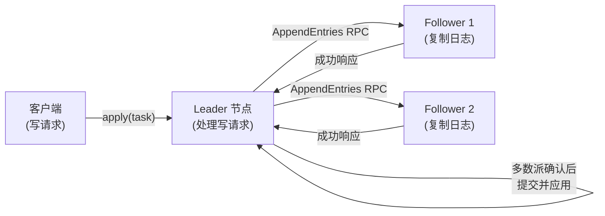
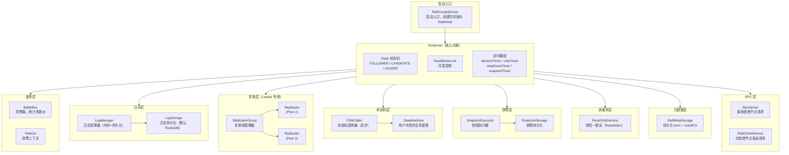
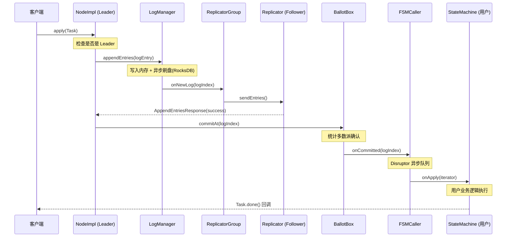
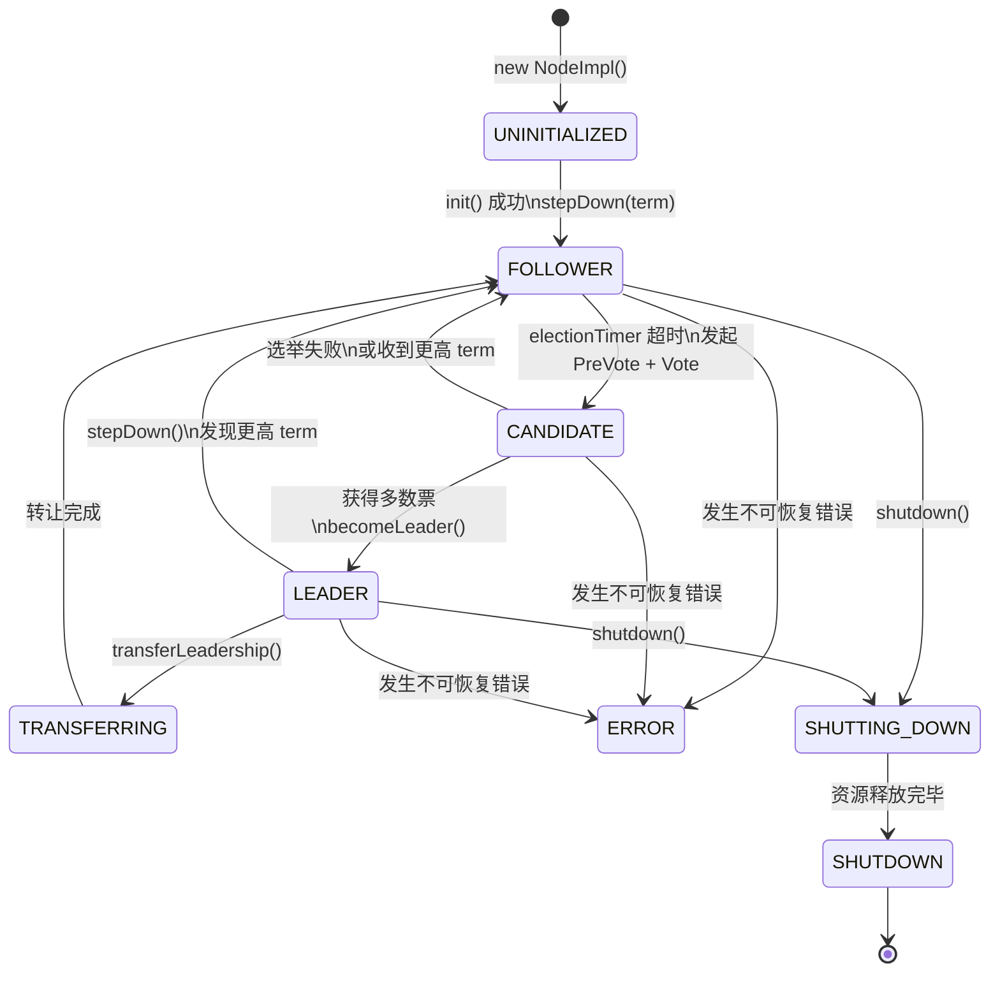
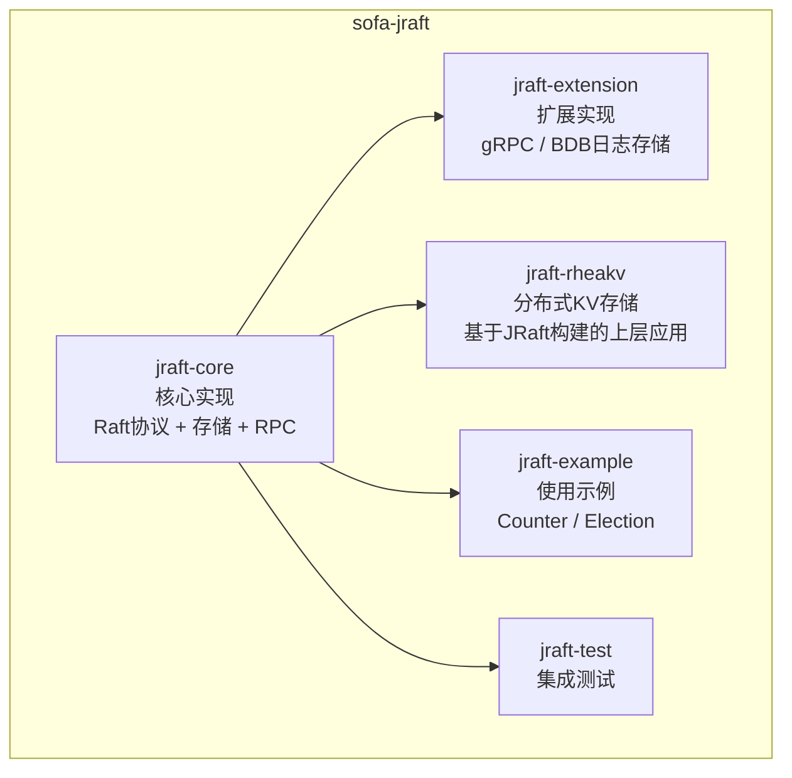
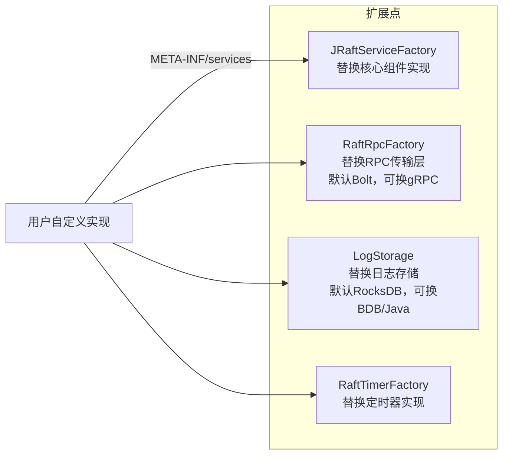

# 01 - JRaft 全局架构概览：在看源码之前，先建立这张地图

> **本篇目标**：在深入任何一行源码之前，先在脑子里建立一张完整的"地图"。
> 后续每一篇文章，都会在这张地图上标注"我们今天在哪里"。

---

## 一、为什么要先看全局？

很多人学框架源码，上来就找 `NodeImpl`，翻到第 200 行，看到一个 `fsmCaller`，不知道是什么；
翻到第 500 行，看到一个 `replicatorGroup`，还是不知道是什么；
最后越看越乱，放弃了。

**根本原因：没有地图，不知道自己在哪里。**

正确的姿势是：**先建地图，再看细节**。

---

## 二、JRaft 是什么？解决什么问题？

JRaft 是蚂蚁集团开源的**工业级 Raft 共识算法框架**（Java 实现），对标 C++ 版的 braft。

它解决的核心问题是：**如何让一组服务器对某个值（或一系列操作）达成一致？**

**一句话总结**：客户端只写 Leader，Leader 把操作复制给多数 Follower，多数派确认后提交，保证集群数据一致。

---

## 三、整体架构图（全局地图）

这是整个系列最重要的一张图，**请务必记住它**。

---

## 四、核心组件一览表

| 组件 | 类名 | 一句话职责 | 对应章节 |
|------|------|-----------|---------|
| 节点 | `NodeImpl` | 整个框架的核心大脑，持有所有组件 | 02 |
| 投票箱 | `BallotBox` | 统计日志复制的多数派确认 | 03 |
| 日志管理器 | `LogManagerImpl` | 管理日志的写入、读取、截断 | 04 |
| 日志存储 | `RocksDBLogStorage` | 日志的 RocksDB 持久化实现 | 05 |
| 复制组 | `ReplicatorGroupImpl` | 管理所有 Follower 的 Replicator | 04 |
| 复制器 | `Replicator` | 负责向单个 Follower 复制日志 | 04 |
| 状态机调用器 | `FSMCallerImpl` | 异步驱动用户状态机执行 | 07 |
| 用户状态机 | `StateMachine` | 用户实现的业务逻辑（接口） | 07 |
| 快照执行器 | `SnapshotExecutorImpl` | 触发快照生成和安装 | 06 |
| 线性一致读 | `ReadOnlyServiceImpl` | 实现 ReadIndex 协议 | 08 |
| 元数据存储 | `RaftMetaStorageImpl` | 持久化 term 和 votedFor | 02 |
| RPC 服务端 | `RpcServer` (Bolt) | 接收 RequestVote/AppendEntries 等 | 10 |
| RPC 客户端 | `RaftClientService` | 发送 RPC 请求给其他节点 | 10 |

---

## 五、一个写请求的完整生命周期

这是理解整个框架最好的主线。**跟着一个写请求走一遍，所有组件都会出现。**

**关键路径总结**：
1. `apply()` → `LogManager` 写日志
2. `Replicator` 复制给 Follower
3. `BallotBox` 统计多数派
4. `FSMCaller` 异步驱动状态机
5. `StateMachine.onApply()` 执行用户逻辑

---

## 六、节点状态机（Node 的一生）

一个 Raft 节点在运行过程中，会在这几个状态之间流转：

**关键状态说明**：
- `FOLLOWER`：正常工作状态，接收 Leader 的日志复制
- `CANDIDATE`：选举中，正在拉票
- `LEADER`：集群主节点，处理所有写请求
- `TRANSFERRING`：主动让出 Leader 身份（优雅转让）
- `ERROR`：不可恢复错误，节点停止服务

---

## 七、模块划分（Maven 结构）

**我们的重点**：`jraft-core`，这里有 Raft 协议的全部实现。

---

## 八、SPI 扩展点（可插拔设计）

JRaft 通过 `JRaftServiceLoader`（仿 Java SPI）实现核心组件可替换：

**为什么这样设计？**
- 存储层可替换：测试环境用内存存储，生产用 RocksDB，不改业务代码
- RPC 层可替换：默认 Bolt（蚂蚁自研），可换 gRPC 适配云原生场景
- 这是**开闭原则**的典型应用：对扩展开放，对修改关闭

---

## 九、关键配置类速查

| 配置类 | 作用 | 常用参数 |
|--------|------|---------|
| `NodeOptions` | 节点级别配置 | `electionTimeoutMs`（选举超时）、`snapshotIntervalSecs`（快照间隔）、`logUri`（日志路径） |
| `RaftOptions` | Raft 协议参数 | `maxAppendBufferSize`（批量复制大小）、`maxReplicatorInflightMsgs`（Pipeline 窗口） |
| `RpcOptions` | RPC 配置 | `rpcConnectTimeoutMs`、`rpcDefaultTimeout` |

---

## 十、面试高频考点 📌

1. **JRaft 和 braft 是什么关系？**
   > JRaft 是 braft（C++ 版）的 Java 移植版，由蚂蚁集团开源，核心算法和设计思路一致，但 Java 版做了很多工程化优化（如 Disruptor 异步化、SPI 扩展等）。

2. **NodeImpl 为什么是一个超大类（145KB）？**
   > 因为 Raft 协议的核心不变式（Invariant）必须在同一个锁保护下维护，拆分会引入跨类的锁协调问题，反而更复杂。这是**一致性优先于代码整洁**的设计取舍。

3. **SPI 机制如何实现存储层可插拔？**
   > `JRaftServiceLoader` 扫描 `META-INF/services/` 下的配置文件，加载用户自定义实现类，替换默认的 `RocksDBLogStorage`。

4. **Raft 中 Leader 为什么只有一个？**
   > 多 Leader 会导致日志冲突，无法保证线性一致性。单 Leader 是 Raft 相比 Paxos 最大的简化点。

---

## 十一、生产踩坑 ⚠️

- **`snapshotIntervalSecs` 设置过小**：频繁快照会导致 RocksDB 大量 I/O，影响写性能。建议生产环境 ≥ 3600 秒，配合日志压缩策略使用。
- **忘记调用 `RaftGroupService.shutdown()`**：会导致 RocksDB 文件句柄泄漏，进程退出后数据目录可能损坏。
- **`NodeOptions.setLogUri()` 路径权限问题**：RocksDB 需要对目录有读写权限，容器环境中挂载卷时需特别注意。
- **多节点部署在同一台机器**：`logUri` 和 `raftMetaUri` 必须使用不同路径，否则会互相覆盖元数据。

---

## 十二、本篇小结 & 下一篇预告

**本篇建立了整个系列的"地图"**：
- ✅ 知道了 JRaft 解决什么问题
- ✅ 知道了有哪些核心组件，各自职责是什么
- ✅ 知道了一个写请求的完整路径
- ✅ 知道了节点的状态流转

**下一篇：[02 - Node 生命周期与初始化流程](../02-node-lifecycle/README.md)**

我们将深入 `NodeImpl.init()` 方法，逐行分析 13 个组件的初始化顺序，搞清楚：
- 为什么 `metaStorage` 要在 `logManager` 之前初始化？
- `electionTimer` 是什么时候启动的？
- `stepDown()` 在 `init()` 里被调用，这是为什么？

---

*源码版本：sofa-jraft 1.3.12*
*参考资料：[SOFAJRaft 官方文档](https://www.sofastack.tech/projects/sofa-jraft/overview/)*
