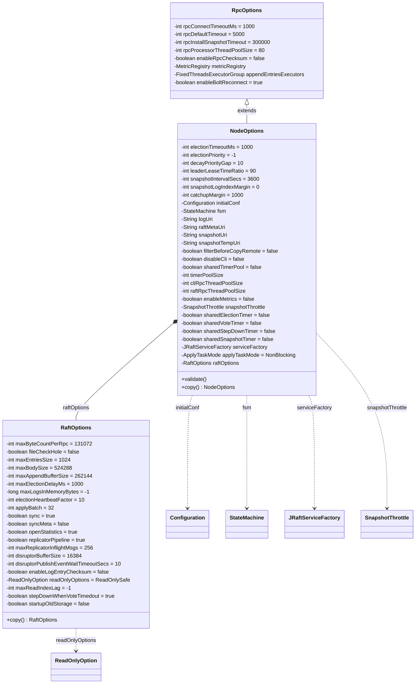
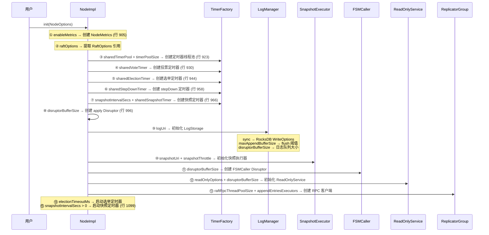
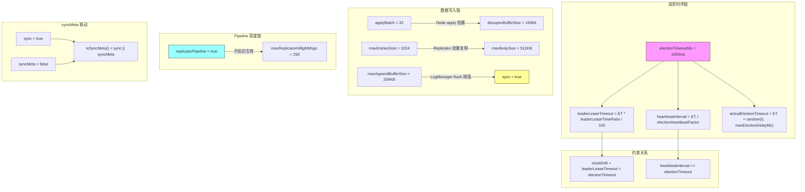

# S16：NodeOptions / RaftOptions 配置项全解

> **核心问题**：JRaft 有哪些可调配置项？每个配置项的含义、默认值、影响范围和调优建议是什么？
>
> 涉及源码文件：`RpcOptions.java`（145 行）、`NodeOptions.java`（478 行）、`RaftOptions.java`（326 行）、`ReadOnlyOption.java`（52 行）、`ApplyTaskMode.java`（27 行）、`ElectionPriority.java`（41 行）
>
> **分析对象**：3 个配置类（继承体系）+ 3 个枚举/常量类 = 共 **1,069 行**源码

---

## 目录

1. [问题推导：为什么需要系统性理解配置项？](#1-问题推导为什么需要系统性理解配置项)
2. [配置类继承体系](#2-配置类继承体系)
3. [RpcOptions：RPC 通信层配置（7 个字段）](#3-rpcoptionsrpc-通信层配置7-个字段)
4. [NodeOptions：节点级配置（26 个字段）](#4-nodeoptionsnodeoptions-节点级配置26-个字段)
5. [RaftOptions：Raft 协议级配置（19 个字段）](#5-raftoptionsraft-协议级配置19-个字段)
6. [配置项在 NodeImpl.init() 中的使用全景图](#6-配置项在-nodeimplinit-中的使用全景图)
7. [validate() 校验逻辑](#7-validate-校验逻辑)
8. [生产调优速查表](#8-生产调优速查表)
9. [配置项间的联动关系](#9-配置项间的联动关系)
10. [Counter 示例中的最小配置](#10-counter-示例中的最小配置)
11. [面试高频考点 📌](#11-面试高频考点-)
12. [生产踩坑 ⚠️](#12-生产踩坑-️)

---

## 1. 问题推导：为什么需要系统性理解配置项？

### 【问题】

一个 JRaft 节点启动时，用户需要传入什么配置？这些配置影响哪些组件的行为？

### 【需要什么信息】

- **选举相关**：选举超时多久？心跳间隔多少？选举优先级怎么设？
- **存储路径**：日志存在哪？元数据存在哪？快照存在哪？
- **性能参数**：批量大小、缓冲区大小、线程池大小各是多少？
- **安全参数**：数据是否需要 fsync？是否校验 checksum？
- **网络参数**：RPC 超时、连接超时、快照传输超时各多久？

### 【推导出的结构】

一个 JRaft 节点的配置需要分三层：
1. **网络层**（RpcOptions）：RPC 框架的通信参数
2. **节点层**（NodeOptions）：节点级别的集群配置、存储路径、定时器参数
3. **协议层**（RaftOptions）：Raft 协议内部的性能调优参数

### 【真实数据结构】

```
RpcOptions                      ← 网络层（7 个字段）
  ↑ 继承
NodeOptions extends RpcOptions  ← 节点层（26 个字段，其中包含一个 raftOptions 字段）
  │
  └── RaftOptions raftOptions   ← 协议层（19 个字段，组合关系）
```

> 📌 **面试常考**：NodeOptions 和 RaftOptions 的区别是什么？
> - **NodeOptions** = 节点维度的配置（集群地址、存储路径、线程池大小）—— **启动时配置，运行时基本不变**
> - **RaftOptions** = 协议维度的配置（批量大小、Pipeline 深度、同步策略）—— **影响运行时性能**

---

## 2. 配置类继承体系



> **配置项总数**：RpcOptions（7）+ NodeOptions（26）+ RaftOptions（19）= **52 个配置项**

---

## 3. RpcOptions：RPC 通信层配置（7 个字段）

> 源码位置：`RpcOptions.java:1-145`

NodeOptions 继承自 RpcOptions，所有 RPC 相关配置在此定义。

| # | 字段名 | 类型 | 默认值 | 行号 | 含义 | 使用位置 |
|---|--------|------|--------|------|------|---------|
| 1 | `rpcConnectTimeoutMs` | int | **1000**（1s） | :30 | RPC 连接超时 | `AbstractClientService.java:150` — 建立连接时的超时 |
| 2 | `rpcDefaultTimeout` | int | **5000**（5s） | :36 | RPC 请求默认超时 | `AbstractClientService.java:267` — 作为 fallback 超时 |
| 3 | `rpcInstallSnapshotTimeout` | int | **300000**（5min） | :42 | 安装快照 RPC 超时 | `DefaultRaftClientService.java:141` — 快照传输可能很慢 |
| 4 | `rpcProcessorThreadPoolSize` | int | **80** | :48 | RPC 请求处理线程池大小 | `AbstractClientService.java:99` — 初始化 RPC Client 时 |
| 5 | `enableRpcChecksum` | boolean | **false** | :54 | 是否开启 RPC CRC 校验 | `BoltRpcClient.java:144` — 放入 InvokeContext |
| 6 | `appendEntriesExecutors` | FixedThreadsExecutorGroup | **null** | :63 | 自定义 AppendEntries 发送线程组 | `NodeImpl.java:919,1059` — 传给 ReplicatorGroup |
| 7 | `enableBoltReconnect` | boolean | **true** | :70 | 是否开启 Bolt 自动重连 | `BoltRpcClient.java:63` — 配置 Bolt 选项 |

### 字段详解

#### 3.1 `rpcInstallSnapshotTimeout`（`RpcOptions.java:42`）

快照文件可能达到数 GB，默认 5 分钟超时。如果快照较大，需要调大此值。

```java
// DefaultRaftClientService.java:141
return invokeWithDone(endpoint, request, done, this.rpcOptions.getRpcInstallSnapshotTimeout());
```

> ⚠️ **生产踩坑**：快照传输超时导致新节点永远无法加入集群。排查方向：检查 `rpcInstallSnapshotTimeout` 是否足够大、网络带宽是否充足。

#### 3.2 `appendEntriesExecutors`（`RpcOptions.java:63`）

默认为 null，此时 NodeImpl 会自动创建。如果用户想自定义 AppendEntries 的发送线程（例如绑定到特定 CPU 核），可以传入自定义实现。

```java
// NodeImpl.java:919-920
if (this.options.getAppendEntriesExecutors() == null) {
    // 自动创建默认线程组
```

---

## 4. NodeOptions：节点级配置（26 个字段）

> 源码位置：`NodeOptions.java:1-478`，继承自 `RpcOptions`

NodeOptions 按功能分为 **6 大类**：

### 4.1 选举与任期（5 个字段）

| # | 字段名 | 类型 | 默认值 | 行号 | 含义 |
|---|--------|------|--------|------|------|
| 1 | `electionTimeoutMs` | int | **1000**（1s） | :46 | Follower → Candidate 超时时间 |
| 2 | `electionPriority` | int | **-1**（Disabled） | :52 | 选举优先级 |
| 3 | `decayPriorityGap` | int | **10** | :57 | 优先级衰减步长 |
| 4 | `leaderLeaseTimeRatio` | int | **90**（最大 100） | :62 | Leader 租约时间占选举超时的比例 |
| 5 | `catchupMargin` | int | **1000** | :83 | 新节点追赶到何种程度算"已追上" |

#### `electionTimeoutMs`（`NodeOptions.java:46`）— **最核心的配置项**

这个参数决定了 Raft 集群的**选举灵敏度**：
- Follower 超过 `electionTimeoutMs` 没收到 Leader 心跳 → 发起 PreVote → 选举
- **心跳间隔** = `electionTimeoutMs / electionHeartbeatFactor`（默认 = 1000/10 = **100ms**）
- **Leader 租约时长** = `electionTimeoutMs * leaderLeaseTimeRatio / 100`（默认 = 1000*90/100 = **900ms**）
- 选举的实际超时 = `electionTimeoutMs` + 随机延迟（0 ~ `maxElectionDelayMs`）

```java
// NodeImpl.java:890 — 心跳间隔计算
return Math.max(electionTimeout / this.raftOptions.getElectionHeartbeatFactor(), 10);

// NodeImpl.java:894 — 选举随机化
return ThreadLocalRandom.current().nextInt(timeoutMs, timeoutMs + this.raftOptions.getMaxElectionDelayMs());
```

> 📌 **面试常考**：`electionTimeoutMs` 设置过大/过小各有什么问题？
> - **过小**（如 100ms）：网络抖动容易触发不必要的选举，导致集群频繁换主
> - **过大**（如 30s）：Leader 宕机后集群长时间不可用

#### `electionPriority`（`NodeOptions.java:52`）

选举优先级，通过 `ElectionPriority.java:1-41` 定义了三个常量：

```java
// ElectionPriority.java:31-41
public static final int Disabled   = -1;  // 禁用优先级选举（所有节点平等）
public static final int NotElected = 0;   // 永远不参与选举（纯 Learner 行为）
public static final int MinValue   = 1;   // 优先级最低值
```

- **-1**（默认）：禁用优先级选举，退化为标准 Raft 选举
- **0**：节点永远不会成为 Leader（可用于跨机房部署中的只读副本）
- **正整数**：数值越大优先级越高，优先级高的节点优先当选

#### `decayPriorityGap`（`NodeOptions.java:57`）

当目标 Leader 选举超时未当选时，指数衰减其本地目标优先级：

```java
// NodeImpl.java:704-705
final int decayPriorityGap = Math.max(this.options.getDecayPriorityGap(), 10);
final int gap = Math.max(decayPriorityGap, (this.targetPriority / 5));
```

每次衰减 `max(decayPriorityGap, targetPriority/5)`，确保优先级逐步降低，避免死锁。

#### `leaderLeaseTimeRatio`（`NodeOptions.java:62`）

Leader 租约时间 = `electionTimeoutMs * leaderLeaseTimeRatio / 100`：

```java
// NodeOptions.java:254 — 计算租约超时
public int getLeaderLeaseTimeoutMs() {
    return this.electionTimeoutMs * this.leaderLeaseTimeRatio / 100;
}

// NodeImpl.java:1784 — 判断租约是否有效
return monotonicNowMs - this.lastLeaderTimestamp < this.options.getLeaderLeaseTimeoutMs();
```

> ⚠️ **注意**：为了最小化时钟漂移影响，必须保证 `clockDrift + leaderLeaseTimeout < electionTimeout`。默认 90% 意味着只有 10% 的容错空间。

#### `catchupMargin`（`NodeOptions.java:83`）

新节点加入集群时（`addPeer`），Leader 需要先将日志复制到新节点。当新节点的 `lastLogIndex` 与 Leader 的 `lastLogIndex` 差距小于 `catchupMargin`（默认 1000 条），才认为"已追上"：

```java
// NodeImpl.java:411 — 判断新节点是否追上
this.node.options.getCatchupMargin(), dueTime, caughtUp)
// NodeImpl.java:2238 — 同理
this.replicatorGroup.waitCaughtUp(this.groupId, peer, this.options.getCatchupMargin(), dueTime, ...)
```

### 4.2 快照相关（5 个字段）

| # | 字段名 | 类型 | 默认值 | 行号 | 含义 |
|---|--------|------|--------|------|------|
| 6 | `snapshotIntervalSecs` | int | **3600**（1h） | :68 | 快照定时触发间隔 |
| 7 | `snapshotLogIndexMargin` | int | **0**（禁用） | :77 | 快照触发的最小日志距离 |
| 8 | `snapshotUri` | String | **null** | :100 | 快照存储路径 |
| 9 | `snapshotTempUri` | String | **null** | :103 | 快照临时写入目录 |
| 10 | `snapshotThrottle` | SnapshotThrottle | **null** | :135 | 快照传输限流器 |

#### `snapshotIntervalSecs`（`NodeOptions.java:68`）

```java
// NodeImpl.java:966-967 — 创建快照定时器
this.snapshotTimer = new RepeatedTimer(name, this.options.getSnapshotIntervalSecs() * 1000, ...);

// NodeImpl.java:1099 — 启动定时器（仅当 > 0 时启动）
if (this.snapshotExecutor != null && this.options.getSnapshotIntervalSecs() > 0) {
    this.snapshotTimer.start();
}
```

- **<=0**：禁用基于时间的自动快照
- **>0**：每隔 N 秒触发一次快照尝试

#### `snapshotLogIndexMargin`（`NodeOptions.java:77`）

与 `snapshotIntervalSecs` 配合使用：即使到了快照时间，如果上次快照到现在的日志条目数不超过 `snapshotLogIndexMargin`，则跳过本次快照。

```java
// SnapshotExecutorImpl.java:354-360
if (distance < this.node.getOptions().getSnapshotLogIndexMargin()) {
    LOG.debug("Node {} snapshotLogIndexMargin={}, distance={}, so ignore this time of snapshot...",
        this.node.getNodeId(), distance, this.node.getOptions().getSnapshotLogIndexMargin());
}
```

> ⚠️ **生产建议**：在写入量波动大的场景，设置 `snapshotLogIndexMargin = 10000`，避免空闲期频繁做无意义的快照。

#### `filterBeforeCopyRemote`（`NodeOptions.java:107`）

```
默认 false。若设为 true，在拷贝远程快照前先比对本地和远程文件的文件名+checksum，跳过重复文件，减少网络传输。
```

### 4.3 存储路径（3 个字段）

| # | 字段名 | 类型 | 默认值 | 行号 | 含义 |
|---|--------|------|--------|------|------|
| 11 | `logUri` | String | **null**（必填） | :95 | 日志存储路径，格式 `${type}://${path}` |
| 12 | `raftMetaUri` | String | **null**（必填） | :98 | Raft 元数据路径（term/votedFor） |
| 13 | `snapshotUri` | String | **null**（可选） | :100 | 快照存储路径（不设则不开启快照） |

> ⚠️ **强制要求**：`logUri` 和 `raftMetaUri` 是**必填项**，`validate()` 方法会检查它们不能为空白（`NodeOptions.java:213-218`）。`snapshotUri` 可选，不设则不启用快照功能。

### 4.4 线程池与定时器共享（10 个字段）

| # | 字段名 | 类型 | 默认值 | 行号 | 含义 |
|---|--------|------|--------|------|------|
| 14 | `sharedTimerPool` | boolean | **false** | :117 | 是否使用全局定时器线程池 |
| 15 | `timerPoolSize` | int | **min(cpus*3, 20)** | :121 | 定时器线程池大小 |
| 16 | `cliRpcThreadPoolSize` | int | **cpus** | :126 | CLI 请求处理线程池大小 |
| 17 | `raftRpcThreadPoolSize` | int | **cpus*6** | :131 | Raft RPC 请求处理线程池大小 |
| 18 | `sharedElectionTimer` | boolean | **false** | :142 | 是否共享选举定时器 |
| 19 | `sharedVoteTimer` | boolean | **false** | :146 | 是否共享投票定时器 |
| 20 | `sharedStepDownTimer` | boolean | **false** | :150 | 是否共享 stepDown 定时器 |
| 21 | `sharedSnapshotTimer` | boolean | **false** | :154 | 是否共享快照定时器 |
| 22 | `enableMetrics` | boolean | **false** | :133 | 是否启用 Metrics 度量 |
| 23 | `disableCli` | boolean | **false** | :113 | 是否禁用 CLI 管理接口 |

#### 定时器共享机制

```java
// NodeImpl.java:923-924 — 定时器创建
this.timerManager = TIMER_FACTORY.getRaftScheduler(
    this.options.isSharedTimerPool(), this.options.getTimerPoolSize(), ...);

// NodeImpl.java:930 — 投票定时器
TIMER_FACTORY.getElectionTimer(this.options.isSharedElectionTimer(), name)

// NodeImpl.java:944 — 选举定时器
// NodeImpl.java:958 — stepDown 定时器
// NodeImpl.java:966 — 快照定时器
```

> 📌 **多 Raft Group 场景**：当一个进程中运行多个 Raft Group 时，设置 `sharedTimerPool = true` + 各 `sharedXxxTimer = true` 可以**显著减少线程数**。

### 4.5 扩展与模式（3 个字段）

| # | 字段名 | 类型 | 默认值 | 行号 | 含义 |
|---|--------|------|--------|------|------|
| 24 | `serviceFactory` | JRaftServiceFactory | **SPI 加载** | :159 | 组件工厂（SPI 扩展点） |
| 25 | `applyTaskMode` | ApplyTaskMode | **NonBlocking** | :164 | apply 任务提交模式 |
| 26 | `fsm` | StateMachine | **null**（必填） | :92 | 用户状态机实现 |

#### `applyTaskMode`（`NodeOptions.java:164`）

两种模式由 `ApplyTaskMode.java:1-27` 定义：

```java
public enum ApplyTaskMode {
    Blocking,      // 提交到 Disruptor 时，如果缓冲区满则阻塞等待
    NonBlocking    // 提交到 Disruptor 时，如果缓冲区满则直接返回失败（默认）
}
```

- **NonBlocking**（默认）：高吞吐场景推荐，缓冲区满时快速失败，由客户端重试
- **Blocking**：低延迟场景，保证提交不丢失，但可能阻塞调用线程

### 4.6 其他（1 个字段）

| # | 字段名 | 类型 | 默认值 | 行号 | 含义 |
|---|--------|------|--------|------|------|
| — | `raftOptions` | RaftOptions | **new RaftOptions()** | :175 | 协议级配置（组合关系） |

NodeOptions 内嵌了一个 RaftOptions 实例，通过 `getRaftOptions()` 获取。

---

## 5. RaftOptions：Raft 协议级配置（19 个字段）

> 源码位置：`RaftOptions.java:1-326`

RaftOptions 按功能分为 **5 大类**：

### 5.1 日志复制参数（5 个字段）

| # | 字段名 | 类型 | 默认值 | 行号 | 含义 | 使用位置 |
|---|--------|------|--------|------|------|---------|
| 1 | `maxByteCountPerRpc` | int | **131072**（128KB） | :35 | 单次 RPC 最大传输字节数 | `CopySession.java:281` — 快照分块大小 |
| 2 | `maxEntriesSize` | int | **1024** | :39 | AppendEntries 单次最大条目数 | `Replicator.java:1638` — 批量复制上限 |
| 3 | `maxBodySize` | int | **524288**（512KB） | :41 | AppendEntries 单次最大字节数 | `Replicator.java:844` — 按大小截断 |
| 4 | `maxAppendBufferSize` | int | **262144**（256KB） | :43 | LogManager 写缓冲区刷新阈值 | `LogManagerImpl.java:509` — 触发 flush |
| 5 | `maxLogsInMemoryBytes` | long | **-1**（无限制） | :49 | 内存中缓存日志的最大字节数（软限制） | `LogManagerImpl.java:199` — 内存日志缓存上限 |

#### `maxEntriesSize` 与 `maxBodySize` 的配合

Replicator 在填充 AppendEntriesRequest 时，同时受两个限制：

```java
// Replicator.java:1638 — 条目数限制
final int maxEntriesSize = this.raftOptions.getMaxEntriesSize();

// Replicator.java:844 — 字节数限制
if (dateBuffer.getCapacity() >= this.raftOptions.getMaxBodySize()) {
    break;  // 已达字节上限，停止填充
}
```

**先触发的限制生效**：即实际每次 AppendEntries 的大小 = `min(maxEntriesSize 条, maxBodySize 字节)`。

#### `maxLogsInMemoryBytes`（`RaftOptions.java:49`）

这是 v1.3.14+ 新增的配置项，用于限制 `LogManagerImpl` 内存中缓存日志条目的总字节数。默认 -1 表示不限制。

> ⚠️ **生产踩坑**：不设限制时，如果 Follower 长时间落后，Leader 的 `logsInMemory` 会持续增长导致 OOM。建议生产环境设为 256MB ~ 1GB。

### 5.2 选举与心跳参数（3 个字段）

| # | 字段名 | 类型 | 默认值 | 行号 | 含义 | 使用位置 |
|---|--------|------|--------|------|------|---------|
| 6 | `electionHeartbeatFactor` | int | **10** | :51 | 心跳间隔 = electionTimeout / factor | `NodeImpl.java:890` |
| 7 | `maxElectionDelayMs` | int | **1000** | :47 | 选举超时的随机延迟上界 | `NodeImpl.java:894` |
| 8 | `stepDownWhenVoteTimedout` | boolean | **true** | :108 | 投票超时时是否 stepDown | `NodeImpl.java:2778` |

#### 心跳间隔的计算公式

```
heartbeatIntervalMs = max(electionTimeoutMs / electionHeartbeatFactor, 10)
```

默认情况下：`max(1000/10, 10) = 100ms`。

#### 选举超时的随机化

```
actualElectionTimeout = electionTimeoutMs + random(0, maxElectionDelayMs)
```

默认情况下：`1000 + random(0, 1000) = [1000, 2000)ms`。随机化是 Raft 避免**活锁**（多个 Candidate 同时选举）的关键。

### 5.3 持久化策略（3 个字段）

| # | 字段名 | 类型 | 默认值 | 行号 | 含义 | 使用位置 |
|---|--------|------|--------|------|------|---------|
| 9 | `sync` | boolean | **true** | :53 | 写日志时是否 fsync | `RocksDBLogStorage.java:161` |
| 10 | `syncMeta` | boolean | **false** | :55 | 写元数据/快照元信息时是否 fsync | `LocalRaftMetaStorage.java:118`，`LocalSnapshotMetaTable.java:123` |
| 11 | `openStatistics` | boolean | **true** | :57 | 是否开启 RocksDB 统计信息 | `RocksDBLogStorage.java:162,200` |

#### `sync` — 数据安全性的核心开关

```java
// RocksDBLogStorage.java:161
this.sync = raftOptions.isSync();
```

- **true**（默认）：每次写入日志都 fsync 到磁盘。**数据最安全，但写入延迟较高**
- **false**：依赖 OS 的 page cache flush。**性能提升显著（10x+），但断电可能丢失最近的日志**

> ⚠️ **生产建议**：
> - 金融场景：`sync = true`（默认），绝不能丢数据
> - 缓存场景：可以设 `sync = false`，用性能换容错

#### `syncMeta` 的特殊行为

```java
// RaftOptions.java:252 — getter 的隐式联动
public boolean isSyncMeta() {
    return this.sync || this.syncMeta;  // sync=true 时，syncMeta 自动为 true
}
```

> 📌 **注意**：如果 `sync = true`，则 `syncMeta` **必然也是 true**。只有 `sync = false` 时，`syncMeta` 才有独立意义。

### 5.4 Disruptor 与批量参数（3 个字段）

| # | 字段名 | 类型 | 默认值 | 行号 | 含义 | 使用位置 |
|---|--------|------|--------|------|------|---------|
| 12 | `applyBatch` | int | **32** | :52 | 批量 apply 的最大任务数 | `NodeImpl.java:294,311`，`ReadOnlyServiceImpl.java:124,137` |
| 13 | `disruptorBufferSize` | int | **16384** | :61 | Disruptor 环形缓冲区大小 | `NodeImpl.java:589,775,996`，`LogManagerImpl.java:216`，`FSMCallerImpl.java:203`，`ReadOnlyServiceImpl.java:286` |
| 14 | `disruptorPublishEventWaitTimeoutSecs` | int | **10**（秒） | :67 | 事件发布等待超时 | `LogManagerImpl.java:223` |

#### `applyBatch` — 批量合并的粒度

```java
// NodeImpl.java:311 — LogEntryAndClosureHandler
if (this.tasks.size() >= NodeImpl.this.raftOptions.getApplyBatch() || endOfBatch) {
    this.nodeImpl.executeApplyingTasks(this.tasks);  // 批量执行
}
```

每次从 Disruptor 中取出最多 `applyBatch` 个 Task 合并处理。增大此值可以提高吞吐量，但会增加单个 Task 的延迟。

#### `disruptorBufferSize` — 全局共享的缓冲区大小

这个参数被 **5 个组件**共同使用：
1. **NodeImpl** — apply 任务队列（`NodeImpl.java:996`）
2. **LogManagerImpl** — 日志写入队列（`LogManagerImpl.java:216`）
3. **FSMCallerImpl** — 状态机调用队列（`FSMCallerImpl.java:203`）
4. **ReadOnlyServiceImpl** — ReadIndex 请求队列（`ReadOnlyServiceImpl.java:286`）
5. **SnapshotExecutorImpl** — 快照执行器（通过 opts 传递）

> 📌 **面试常考**：JRaft 中一次写入请求经过几个 Disruptor？
> 答：**至少 3 个**——NodeImpl（apply）→ LogManagerImpl（日志持久化）→ FSMCallerImpl（状态机应用）

### 5.5 Pipeline 与 ReadIndex（4 个字段）

| # | 字段名 | 类型 | 默认值 | 行号 | 含义 | 使用位置 |
|---|--------|------|--------|------|------|---------|
| 15 | `replicatorPipeline` | boolean | **true** | :59 | 是否开启 Replicator Pipeline | `Replicator.java`，`AppendEntriesRequestProcessor.java:84,451` |
| 16 | `maxReplicatorInflightMsgs` | int | **256** | :61 | Pipeline 模式下最大 in-flight 请求数 | `Replicator.java:597,1285`，`AppendEntriesRequestProcessor.java:375` |
| 17 | `readOnlyOptions` | ReadOnlyOption | **ReadOnlySafe** | :80 | ReadIndex 的一致性模式 | `ReadOnlyServiceImpl.java` |
| 18 | `maxReadIndexLag` | int | **-1**（无限制） | :98 | ReadIndex 最大允许落后距离 | `ReadOnlyServiceImpl.java:199` |

#### `replicatorPipeline`（`RaftOptions.java:59`）

Pipeline 模式允许 Leader 不等待上一个 AppendEntries 响应就发送下一个，大幅提升高延迟网络下的吞吐量。

```java
// RaftOptions.java:167-168 — getter 有额外判断
public boolean isReplicatorPipeline() {
    return this.replicatorPipeline && RpcFactoryHelper.rpcFactory().isReplicatorPipelineEnabled();
}
```

> **注意**：即使配置了 `replicatorPipeline = true`，如果底层 RPC 工厂不支持（如某些自定义实现），仍然会退化为非 Pipeline 模式。

#### `readOnlyOptions`（`RaftOptions.java:80`）

两种线性一致读模式由 `ReadOnlyOption.java:1-52` 定义：

```java
public enum ReadOnlyOption {
    ReadOnlySafe,        // 通过 Quorum 确认 Leader 身份（安全，但需一轮 RPC）
    ReadOnlyLeaseBased   // 基于 Leader 租约（高性能，但受时钟漂移影响）
}
```

#### `maxReadIndexLag`（`RaftOptions.java:98`）

当 Follower 的 `applyIndex` 落后 Leader 的 `commitIndex` 超过此值时，ReadIndex 请求直接**快速失败**：

```java
// ReadOnlyServiceImpl.java:199
if (readIndexStatus.isOverMaxReadIndexLag(lastApplied, this.raftOptions.getMaxReadIndexLag())) {
    // 快速失败：落后太多，等不起
}
```

- **-1**（默认）：不限制，即使落后很多也等待
- **正整数**：落后超过此值就立即返回失败

> ⚠️ **生产建议**：设置 `maxReadIndexLag = 10000`，防止慢节点的 ReadIndex 请求长时间阻塞。

### 5.6 安全与兼容性（2 个字段）

| # | 字段名 | 类型 | 默认值 | 行号 | 含义 | 使用位置 |
|---|--------|------|--------|------|------|---------|
| 19 | `enableLogEntryChecksum` | boolean | **false** | :73 | 是否校验日志条目 checksum | `NodeImpl.java:2061`，`LogManagerImpl.java:346,789,827` |
| 20 | `fileCheckHole` | boolean | **false** | :37 | 文件服务空洞检查（**预留未用**） | 无实际使用位置 |
| 21 | `startupOldStorage` | boolean | **false** | :112 | 迁移新日志引擎时是否检查旧存储（**预留未用**） | 无实际使用位置 |

> **注意**：`fileCheckHole` 和 `startupOldStorage` 在当前源码中**没有任何实际使用**，仅作为预留配置。

#### `enableLogEntryChecksum`（`RaftOptions.java:73`）

开启后，日志条目在磁盘读取和网络传输时都会校验 checksum：

```java
// LogManagerImpl.java:346 — 写入时计算 checksum
if (this.raftOptions.isEnableLogEntryChecksum()) {
    entry.setChecksum(entry.checksum());  // 计算并设置
}

// NodeImpl.java:2061 — 接收 AppendEntries 时校验
if (this.raftOptions.isEnableLogEntryChecksum() && logEntry.isCorrupted()) {
    // 校验失败：数据损坏
}
```

> ⚠️ **Trade-off**：开启 checksum 会**降低性能**（每个日志条目需要额外计算），但能**及时发现数据损坏**。金融场景建议开启。

---

## 6. 配置项在 NodeImpl.init() 中的使用全景图

以下时序图展示了 `NodeImpl.init()` 中各配置项的使用顺序：



---

## 7. validate() 校验逻辑

```java
// NodeOptions.java:213-218
public void validate() {
    if (StringUtils.isBlank(this.logUri)) {
        throw new IllegalArgumentException("Blank logUri");
    }
    if (StringUtils.isBlank(this.raftMetaUri)) {
        throw new IllegalArgumentException("Blank raftMetaUri");
    }
    if (this.fsm == null) {
        throw new IllegalArgumentException("Null stateMachine");
    }
}
```

**必填项**（3 个）：
1. `logUri` — 日志存储路径
2. `raftMetaUri` — 元数据存储路径
3. `fsm` — 用户状态机实例

> **注意**：`snapshotUri` 不是必填项。如果不设，则不启用快照功能——但这意味着日志永远不会被截断，磁盘会无限增长。生产环境**强烈建议设置** `snapshotUri`。

`leaderLeaseTimeRatio` 的 setter 也有校验（`NodeOptions.java:248-251`）：

```java
if (leaderLeaseTimeRatio <= 0 || leaderLeaseTimeRatio > 100) {
    throw new IllegalArgumentException("leaderLeaseTimeRatio: " + leaderLeaseTimeRatio
                                       + " (expected: 0 < leaderLeaseTimeRatio <= 100)");
}
```

---

## 8. 生产调优速查表

### 8.1 NodeOptions 调优

| 参数 | 默认值 | 低延迟场景 | 高吞吐场景 | 跨机房场景 | 说明 |
|------|--------|-----------|-----------|-----------|------|
| `electionTimeoutMs` | 1000ms | 500ms | 1000ms | **3000-5000ms** | 跨机房 RTT 大，需增大 |
| `snapshotIntervalSecs` | 3600s | 1800s | 3600s | 3600s | 低延迟场景缩短快照间隔减少重放 |
| `snapshotLogIndexMargin` | 0 | 5000 | 10000 | 10000 | 避免无意义快照 |
| `catchupMargin` | 1000 | 500 | 1000 | **5000** | 跨机房追赶余量增大 |
| `timerPoolSize` | min(cpus*3,20) | 不变 | 不变 | 不变 | 通常无需调整 |
| `raftRpcThreadPoolSize` | cpus*6 | cpus*4 | **cpus*8** | cpus*6 | 高吞吐增大 |
| `enableMetrics` | false | false | **true** | **true** | 生产必开 |

### 8.2 RaftOptions 调优

| 参数 | 默认值 | 低延迟场景 | 高吞吐场景 | 跨机房场景 | 说明 |
|------|--------|-----------|-----------|-----------|------|
| `sync` | true | true | 看业务容忍度 | true | **金融场景必须 true** |
| `applyBatch` | 32 | **16** | **64-128** | 32 | 低延迟减小，高吞吐增大 |
| `disruptorBufferSize` | 16384 | 8192 | **65536** | 16384 | 高吞吐增大缓冲区 |
| `maxEntriesSize` | 1024 | 512 | **2048** | 1024 | 高吞吐增大批量 |
| `maxBodySize` | 512KB | 256KB | **1MB** | 512KB | 配合 maxEntriesSize |
| `maxReplicatorInflightMsgs` | 256 | 128 | 256 | **512-1024** | **跨机房关键参数** |
| `replicatorPipeline` | true | true | true | **true（必须）** | 跨机房必须开启 |
| `readOnlyOptions` | ReadOnlySafe | ReadOnlySafe | ReadOnlySafe | **ReadOnlyLeaseBased** | 跨机房 Quorum 读太慢 |
| `maxReadIndexLag` | -1 | 5000 | 10000 | 10000 | 防止慢节点阻塞 |
| `enableLogEntryChecksum` | false | false | false | **true** | 跨机房网络不可靠 |
| `maxLogsInMemoryBytes` | -1 | 128MB | **512MB-1GB** | 256MB | **生产必设** |
| `maxAppendBufferSize` | 256KB | 128KB | **512KB** | 256KB | 高吞吐增大 flush 阈值 |

### 8.3 RpcOptions 调优

| 参数 | 默认值 | 低延迟场景 | 高吞吐场景 | 跨机房场景 | 说明 |
|------|--------|-----------|-----------|-----------|------|
| `rpcConnectTimeoutMs` | 1000ms | 500ms | 1000ms | **3000ms** | 跨机房连接建立慢 |
| `rpcDefaultTimeout` | 5000ms | 3000ms | 5000ms | **10000ms** | 跨机房响应慢 |
| `rpcInstallSnapshotTimeout` | 5min | 5min | **10min** | **30min** | 大快照+跨机房 |
| `rpcProcessorThreadPoolSize` | 80 | 40 | **120** | 80 | 高吞吐增大 |
| `enableRpcChecksum` | false | false | false | **true** | 跨机房网络不可靠 |

---

## 9. 配置项间的联动关系



### 关键联动公式

```
heartbeatInterval = max(electionTimeoutMs / electionHeartbeatFactor, 10)
                  = max(1000 / 10, 10) = 100ms

leaderLeaseTimeout = electionTimeoutMs * leaderLeaseTimeRatio / 100
                   = 1000 * 90 / 100 = 900ms

actualElectionTimeout = electionTimeoutMs + random(0, maxElectionDelayMs)
                      = 1000 + random(0, 1000) ∈ [1000, 2000)ms

isSyncMeta = sync || syncMeta
           = true || false = true（当 sync=true 时，syncMeta 被强制为 true）
```

---

## 10. Counter 示例中的最小配置

```java
// CounterServer.java:119-137
final NodeOptions nodeOptions = new NodeOptions();

// 选举超时：1s
nodeOptions.setElectionTimeoutMs(1000);

// 快照间隔：30s（示例值，生产通常用 3600）
nodeOptions.setSnapshotIntervalSecs(30);

// 初始集群配置
nodeOptions.setInitialConf(initConf);

// 必填三件套
nodeOptions.setFsm(this.fsm);                                  // 状态机
nodeOptions.setLogUri(dataPath + File.separator + "log");       // 日志路径
nodeOptions.setRaftMetaUri(dataPath + File.separator + "raft_meta"); // 元数据路径
nodeOptions.setSnapshotUri(dataPath + File.separator + "snapshot");  // 快照路径
```

> 📌 **最小配置清单**（只需设 5 个参数即可启动）：
> 1. `fsm` — 用户状态机
> 2. `logUri` — 日志路径
> 3. `raftMetaUri` — 元数据路径
> 4. `initialConf` — 初始集群成员
> 5. `electionTimeoutMs`（可选，有默认值）

其余 47 个参数全部使用默认值。

---

## 11. 面试高频考点 📌

### 考点 1：NodeOptions 和 RaftOptions 的区别？

**NodeOptions** 是节点维度的配置，包含集群地址、存储路径、线程池大小等**启动时配置**；
**RaftOptions** 是协议维度的配置，包含批量大小、Pipeline 深度、同步策略等**运行时性能参数**。
两者是**组合关系**：NodeOptions 内嵌了一个 RaftOptions 实例。

### 考点 2：`electionTimeoutMs` 设置过大/过小的影响？

- **过小**（如 100ms）：网络抖动容易触发不必要的选举 → 频繁换主 → 短暂不可用 → 写入延迟抖动
- **过大**（如 30s）：Leader 宕机后集群长时间无主 → 不可用时间过长
- **经验值**：同机房 1-3s，跨机房 3-5s

### 考点 3：`sync = false` 会丢数据吗？

**会**。`sync = false` 时日志写入依赖 OS page cache，断电会丢失 cache 中未 flush 的数据。
但 Raft 的多副本机制可以一定程度弥补：只要不是所有节点同时断电，理论上可以从其他节点恢复。
**金融场景必须 `sync = true`**。

### 考点 4：`disruptorBufferSize` 影响哪些组件？

**5 个组件**共享此参数：NodeImpl（apply 队列）、LogManagerImpl（日志队列）、FSMCallerImpl（状态机队列）、ReadOnlyServiceImpl（ReadIndex 队列）、SnapshotExecutorImpl。

### 考点 5：`maxReplicatorInflightMsgs` 的含义和调优？

Pipeline 模式下，Leader 不等上一个 AppendEntries 响应就发送下一个。`maxReplicatorInflightMsgs` 限制了最多允许多少个"in-flight"（已发出但未收到响应）的请求。
- **太小**：Pipeline 效率低，退化为逐个发送
- **太大**：消耗过多内存，Follower 处理不过来可能导致超时
- **跨机房场景**：因为 RTT 大，需要增大到 512-1024 才能充分利用 Pipeline

---

## 12. 生产踩坑 ⚠️

### 踩坑 1：`snapshotUri` 不设导致磁盘爆满

**现象**：日志文件无限增长，最终磁盘满导致节点宕机。
**原因**：不设 `snapshotUri` 则不启用快照，日志永远不会被截断（`truncatePrefix` 不会触发）。
**解决**：生产环境**必须设置** `snapshotUri` 并配置合理的 `snapshotIntervalSecs`。

### 踩坑 2：`maxLogsInMemoryBytes` 不设导致 OOM

**现象**：Follower 长时间宕机后恢复，Leader 的内存使用急剧飙升直到 OOM。
**原因**：默认 `maxLogsInMemoryBytes = -1`（无限制），Leader 为落后的 Follower 在内存中缓存大量日志。
**解决**：设置 `maxLogsInMemoryBytes = 256 * 1024 * 1024`（256MB）。

### 踩坑 3：跨机房 `electionTimeoutMs` 过小导致频繁选举

**现象**：跨机房部署后集群不断换主，写入超时增多。
**原因**：跨机房 RTT 通常 50-200ms，默认 `electionTimeoutMs = 1000ms`，而心跳间隔 100ms，网络抖动容易导致心跳超时。
**解决**：跨机房场景增大 `electionTimeoutMs` 到 3000-5000ms，同时增大 `maxReplicatorInflightMsgs` 到 512+。

### 踩坑 4：`applyTaskMode = Blocking` 导致调用线程被阻塞

**现象**：高并发场景下，`Node.apply()` 调用线程被长时间阻塞，业务线程池打满。
**原因**：`Blocking` 模式下 Disruptor 缓冲区满时会阻塞调用线程。
**解决**：使用默认的 `NonBlocking` 模式，配合客户端重试机制。

---

> **总结**：52 个配置项中，生产环境**必须关注的 Top 10**：
> 1. `electionTimeoutMs` — 选举灵敏度
> 2. `sync` — 数据安全性
> 3. `disruptorBufferSize` — 缓冲区容量
> 4. `maxReplicatorInflightMsgs` — Pipeline 深度
> 5. `snapshotIntervalSecs` — 快照频率
> 6. `maxLogsInMemoryBytes` — 内存日志上限
> 7. `applyBatch` — 批量合并粒度
> 8. `rpcInstallSnapshotTimeout` — 快照传输超时
> 9. `readOnlyOptions` — 读模式选择
> 10. `enableMetrics` — 可观测性
