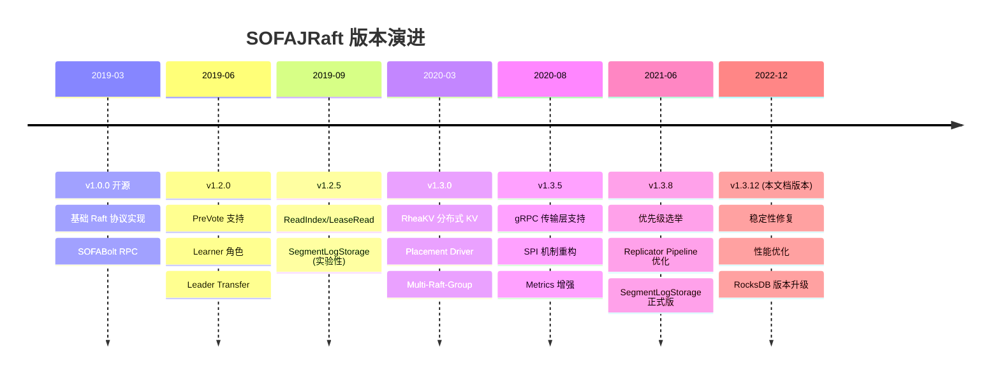

# 版本演进时间线：JRaft 的成长史

> 本文档梳理 SOFAJRaft 从开源到当前版本的关键演进节点，帮助读者理解"为什么现在的代码长这样"。

---

## 一、整体时间线

---

## 二、关键特性的引入版本

| 特性 | 引入版本 | 说明 |
|------|---------|------|
| 基础 Raft（选举/日志复制/快照） | v1.0.0 | 核心协议，对标 braft |
| RocksDBLogStorage | v1.0.0 | 默认日志存储，稳定可靠 |
| SOFABolt RPC | v1.0.0 | 默认 RPC 传输层 |
| PreVote（预投票） | v1.2.0 | 防止网络隔离节点无效涨 term |
| Learner 角色 | v1.2.0 | 只读副本，不参与 quorum |
| Leader Transfer | v1.2.0 | Leader 主动让位 |
| ReadIndex / LeaseRead | v1.2.5 | 线性一致读优化 |
| SegmentLogStorage | v1.2.5 → v1.3.8 | 实验性 → 正式，纯 Java 替代 RocksDB |
| RheaKV | v1.3.0 | 基于 JRaft 的分布式 KV 存储 |
| Placement Driver | v1.3.0 | RheaKV 的调度中心 |
| Multi-Raft-Group | v1.3.0 | 同一进程管理多个 Raft Group |
| gRPC 传输层 | v1.3.5 | 通过 SPI 切换，支持跨语言 |
| SPI 机制（JRaftServiceLoader） | v1.3.5 | 核心组件可插拔 |
| Metrics 增强（Dropwizard） | v1.3.5 | Timer/Counter/Histogram 全覆盖 |
| 优先级选举 | v1.3.8 | 高优先级节点优先当选 Leader |
| Replicator Pipeline 优化 | v1.3.8 | 连续发送不等 ACK，提升吞吐 |

---

## 三、存储层演进：RocksDB → SegmentLog

### RocksDBLogStorage（v1.0.0，默认）

- 底层用 RocksDB（C++ LSM-Tree 存储引擎）
- 优点：成熟、稳定、压缩率高
- 缺点：依赖 JNI（跨平台问题）、GC 不友好、调参复杂

### SegmentLogStorage（v1.2.5 实验 → v1.3.8 正式）

- 纯 Java 实现，日志按 Segment 文件分段存储
- 优点：无 JNI 依赖、GC 友好、代码可控
- 缺点：不支持压缩、大量小文件管理

### 演进原因

RocksDB JNI 在某些环境（ARM、Alpine Linux、容器）中编译困难，且 RocksDB 的 LSM-Tree 压缩会导致写放大，对 Raft 这种"顺序写 + 顺序读 + 前缀删"的访问模式不是最优解。SegmentLogStorage 针对 Raft 日志的访问模式做了专门优化。

---

## 四、RPC 层演进：Bolt → gRPC

### SOFABolt（v1.0.0，默认）

- 蚂蚁自研的高性能 RPC 框架
- 基于 Netty，自定义二进制协议
- 极致性能，但仅支持 Java

### gRPC 支持（v1.3.5，SPI 可选）

- Google 的通用 RPC 框架
- 基于 HTTP/2 + Protobuf
- 跨语言支持，适配云原生生态

### 演进原因

社区用户希望 JRaft 能与非 Java 系统互通。gRPC 的引入让 JRaft 可以被其他语言的客户端访问。通过 SPI 机制，Bolt 和 gRPC 可以无缝切换。

---

## 五、对文档阅读的影响

本系列文档基于 **v1.3.12** 版本分析，这是截至撰写时的最新稳定版。以下几点需要注意：

1. **PreVote 是默认开启的**：v1.2.0 引入后就是默认行为，源码中 `preVote()` 在 `electSelf()` 之前调用
2. **SegmentLogStorage 和 RocksDBLogStorage 并存**：两者都可用，通过 `NodeOptions.setLogUri()` 的 scheme 选择
3. **gRPC 相关代码在 `jraft-extension` 模块**：核心协议不受影响
4. **RheaKV/PD 在 `jraft-rheakv` 模块**：独立于核心 Raft 协议

---

*源码版本：sofa-jraft 1.3.12*
