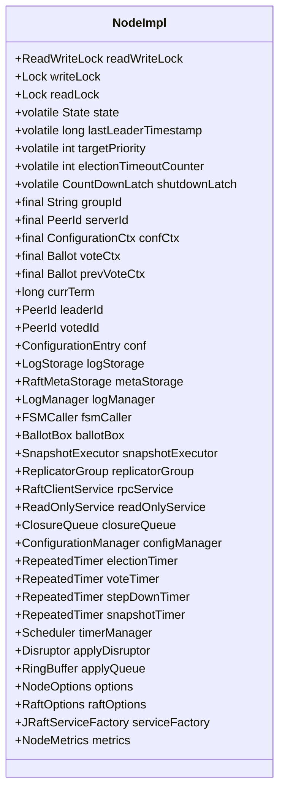
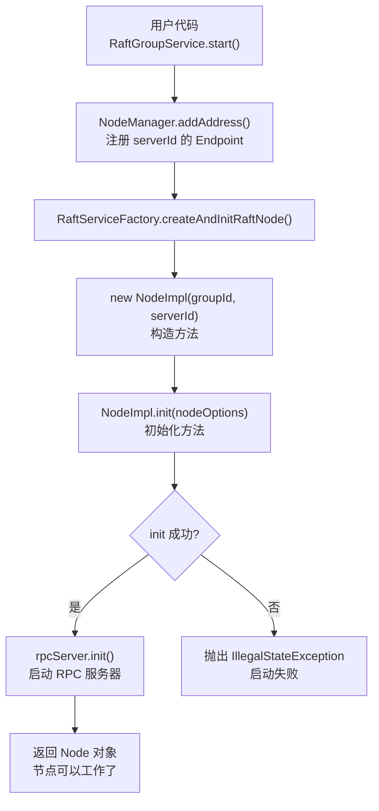
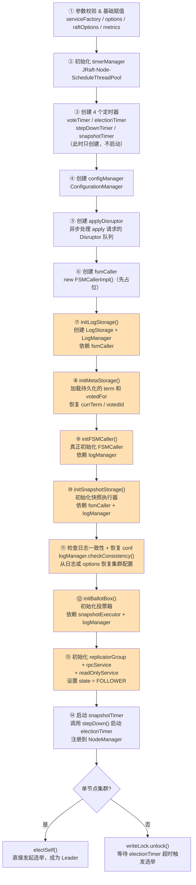
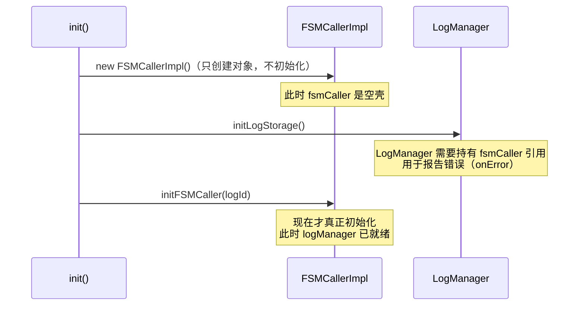
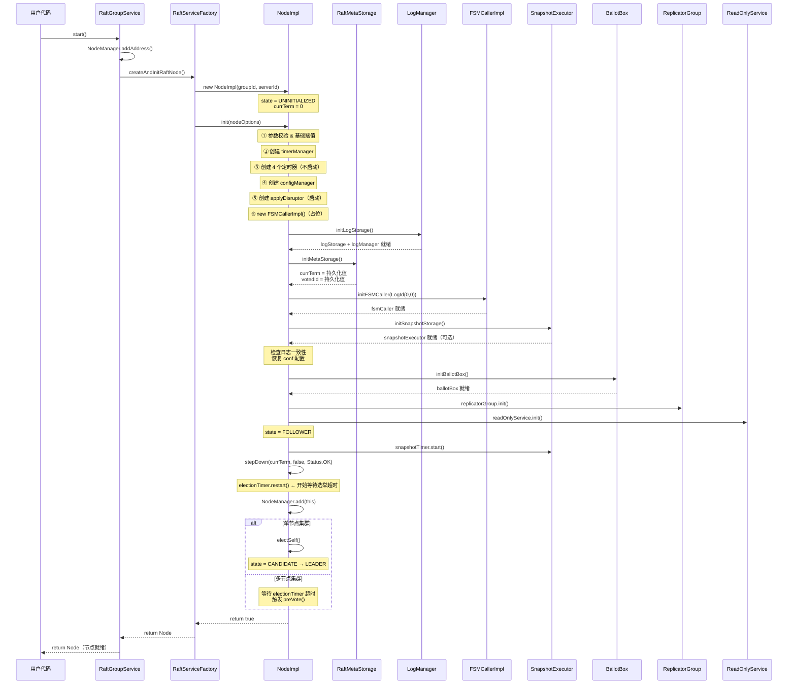
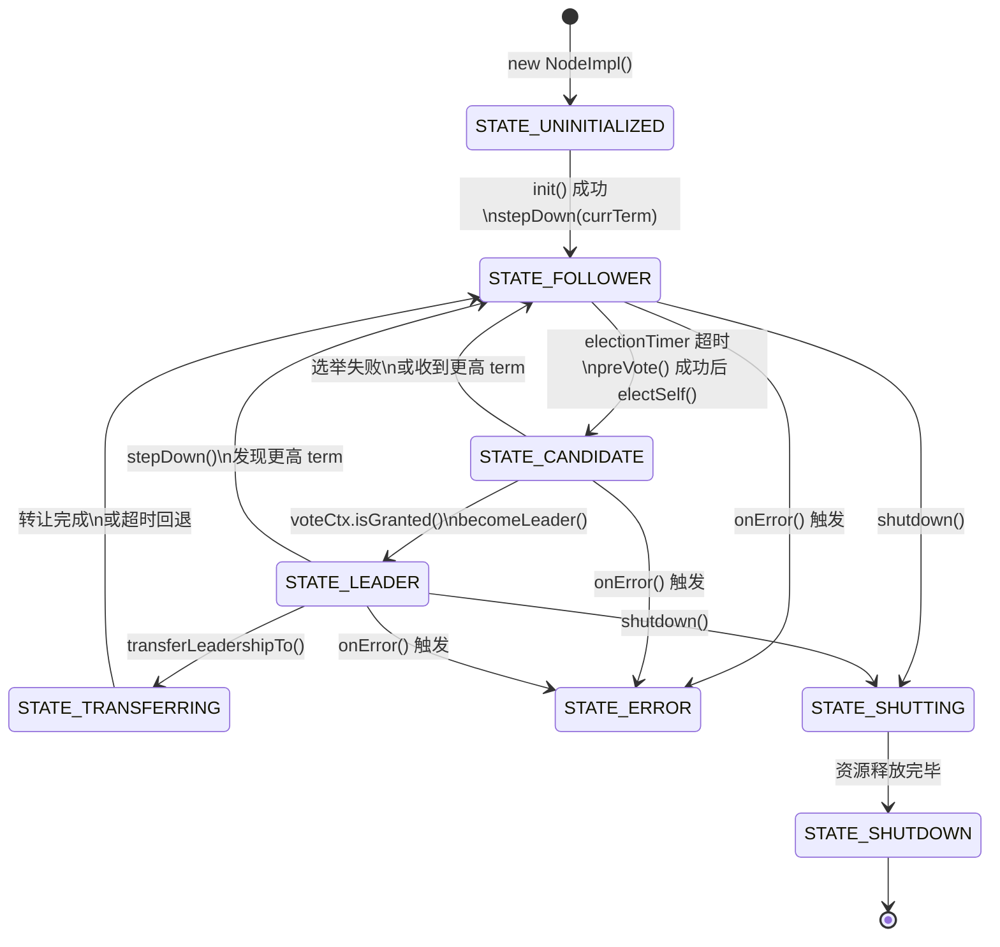

# 02 - Node 生命周期与初始化流程：`NodeImpl.init()` 的 14 步拆解

## ☕ 想先用人话了解节点启动？请看通俗解读

> **👉 [点击阅读：用人话聊聊节点启动——NodeImpl.init() 到底在干什么？（通俗解读完整版）](./通俗解读.md)**
>
> 通俗解读版用"新兵入伍"的比喻，一步步带你理解 `init()` 的 14 个步骤为什么是这个顺序、循环依赖怎么解决、`stepDown()` 为什么在 `init()` 里被调用、以及那些藏在初始化流程里的并发设计。**如果你觉得直接看源码分析太硬核，建议先读通俗解读版。**

---

> **本篇在全局地图中的位置**：
> ```
> RaftGroupService.start()
>       └── RaftServiceFactory.createAndInitRaftNode()
>               └── NodeImpl.init()   ← 我们今天在这里
> ```
>
> **本篇目标**：彻底搞清楚一个 Raft 节点从"被创建"到"可以工作"的完整过程。
> 读完本篇，你应该能回答：
> - `init()` 按什么顺序初始化了哪些组件？为什么是这个顺序？
> - `stepDown()` 为什么在 `init()` 里被调用？
> - 单节点集群为什么会直接调用 `electSelf()`？
> - `volatile` 和 `final` 字段分别保护了什么？

---

## 一、解决什么问题

一个 Raft 节点启动时，需要完成以下几件事：

1. **恢复持久化状态**：从磁盘加载上次的 `term` 和 `votedFor`，防止宕机重启后重复投票
2. **初始化各个子系统**：日志、状态机、快照、投票箱、复制组……每个子系统都有依赖关系，顺序不能乱
3. **启动定时器**：选举超时定时器、快照定时器等，驱动节点进入工作状态
4. **处理特殊情况**：单节点集群直接成为 Leader；多节点集群进入 Follower 状态等待选举

`NodeImpl.init()` 就是完成上述所有工作的入口方法。

---

## 二、核心数据结构

### 2.1 NodeImpl 字段全景图

> 以下字段均来自本地源码 `NodeImpl.java` 第 169-228 行，逐一确认。



### 2.2 字段设计的并发意图

| 字段 | 修饰符 | 并发保护方式 | 设计意图 |
|------|--------|------------|---------|
| `state` | `volatile` | 读不加锁，写加 `writeLock` | 快速读取节点状态，避免每次读都加锁 |
| `lastLeaderTimestamp` | `volatile` | 无锁读写 | 心跳更新频繁，volatile 保证可见性即可 |
| `currTerm` | 无修饰 | `writeLock` 保护 | 只在持锁时修改，不需要 volatile |
| `groupId` | `final` | 不可变 | 节点创建后集群 ID 永不改变 |
| `serverId` | `final` | 不可变 | 节点自身地址永不改变 |
| `voteCtx` | `final` | `writeLock` 保护内部状态 | 对象引用不变，内部状态受锁保护 |

**核心不变式 ⭐**：
1. `currTerm` 只增不减（由 `writeLock` 保证）
2. 同一 `term` 内，`votedId` 一旦设置就不再改变（持久化到 `metaStorage`）
3. `state` 的转换路径是单向的（不能从 `SHUTDOWN` 回到 `FOLLOWER`）

---

## 三、启动入口：从 `RaftGroupService` 到 `NodeImpl`

在看 `init()` 之前，先看看节点是怎么被创建的。



**构造方法做了什么？**（源码 `NodeImpl(String, PeerId)` 构造方法）

```java
public NodeImpl(final String groupId, final PeerId serverId) {
    super();
    this.groupId = groupId;
    this.serverId = serverId != null ? serverId.copy() : null;
    this.state = State.STATE_UNINITIALIZED;  // 初始状态：未初始化
    this.currTerm = 0;
    updateLastLeaderTimestamp(Utils.monotonicMs());  // 记录启动时间
    this.confCtx = new ConfigurationCtx(this);
    this.wakingCandidate = null;
    GLOBAL_NUM_NODES.incrementAndGet();  // 全局节点计数 +1
}
```

构造方法非常轻量：只设置了不可变字段和初始状态，**所有子系统的初始化都在 `init()` 中完成**。

---

## 四、`init()` 的 14 步全流程

这是本篇的核心。`NodeImpl.init()` 方法约 150 行，按顺序完成以下 14 个步骤：



> 橙色步骤（⑦~⑬）是有严格依赖顺序的核心初始化链。

---

## 五、关键步骤深度解析

### 5.1 步骤③：4 个定时器的职责

`init()` 中创建了 4 个 `RepeatedTimer`，它们的职责各不相同：

| 定时器 | 触发方法 | 超时时间 | 职责 |
|--------|---------|---------|------|
| `electionTimer` | `handleElectionTimeout()` | `electionTimeoutMs`（随机化） | Follower 超时触发预投票 |
| `voteTimer` | `handleVoteTimeout()` | `electionTimeoutMs`（随机化） | Candidate 投票超时重试 |
| `stepDownTimer` | `handleStepDownTimeout()` | `electionTimeoutMs / 2` | Leader 检查多数派存活 |
| `snapshotTimer` | `handleSnapshotTimeout()` | `snapshotIntervalSecs * 1000` | 定期触发快照生成 |

**关键细节**：定时器在 `init()` 中只是**创建**，并不立即启动。真正启动是在后面的 `stepDown()` 调用中（`electionTimer.restart()`）。

**超时随机化**（源码 `randomTimeout` 方法）：
```java
private int randomTimeout(final int timeoutMs) {
    return ThreadLocalRandom.current().nextInt(timeoutMs, timeoutMs + this.raftOptions.getMaxElectionDelayMs());
}
```
随机范围是 `[electionTimeoutMs, electionTimeoutMs + maxElectionDelayMs)`，避免多个节点同时触发选举（选举风暴）。

### 5.2 步骤⑤：applyDisruptor 的作用

`init()` 中创建了一个 Disruptor，专门用于处理 `Node.apply(Task)` 请求：

```java
this.applyDisruptor = DisruptorBuilder.<LogEntryAndClosure>newInstance()
    .setRingBufferSize(this.raftOptions.getDisruptorBufferSize())
    .setEventFactory(new LogEntryAndClosureFactory())
    .setThreadFactory(new NamedThreadFactory("JRaft-NodeImpl-Disruptor-", true))
    .setProducerType(ProducerType.MULTI)   // 多生产者（多个客户端线程并发 apply）
    .setWaitStrategy(new BlockingWaitStrategy())
    .build();
this.applyDisruptor.handleEventsWith(new LogEntryAndClosureHandler());
```

**为什么用 Disruptor？**
- 客户端调用 `apply()` 是多线程并发的（`ProducerType.MULTI`）
- 日志写入需要串行化（保证日志 index 单调递增）
- Disruptor 的无锁队列比 `BlockingQueue` 吞吐量高 5-10 倍

### 5.3 步骤⑦⑧⑨：为什么 fsmCaller 要在 logStorage 之前创建？

这是一个**先占位，后初始化**的设计：



**原因**：`LogManager` 初始化时需要传入 `fsmCaller` 引用（用于在日志出错时回调 `fsmCaller.onError()`）。但 `FSMCallerImpl` 初始化时又需要 `logManager`。这是一个**循环依赖**，解决方案是：先 `new FSMCallerImpl()`（只创建对象），再初始化 `LogManager`，最后再调用 `fsmCaller.init()`。

### 5.4 步骤⑧：initMetaStorage 恢复持久化状态

```java
private boolean initMetaStorage() {
    this.metaStorage = this.serviceFactory.createRaftMetaStorage(
        this.options.getRaftMetaUri(), this.raftOptions);
    RaftMetaStorageOptions opts = new RaftMetaStorageOptions();
    opts.setNode(this);
    if (!this.metaStorage.init(opts)) {
        return false;
    }
    this.currTerm = this.metaStorage.getTerm();       // 恢复 term
    this.votedId = this.metaStorage.getVotedFor().copy(); // 恢复投票记录
    return true;
}
```

**为什么必须持久化 term 和 votedFor？**

假设节点在投票后立即宕机，重启后如果不恢复 `votedFor`，可能在同一个 `term` 内给两个不同的候选者投票，破坏 Raft 的安全性（每个 term 只能投一票）。

### 5.5 步骤⑪：日志一致性检查与配置恢复

```java
// if have log using conf in log, else using conf in options
if (this.logManager.getLastLogIndex() > 0) {
    checkAndSetConfiguration(false);  // 从日志中恢复配置
} else {
    this.conf.setConf(this.options.getInitialConf());  // 使用初始配置
    this.targetPriority = getMaxPriorityOfNodes(this.conf.getConf().getPeers());
}
```

**两种情况**：
- **首次启动**（`lastLogIndex == 0`）：使用 `NodeOptions.initialConf` 中配置的初始集群成员
- **重启恢复**（`lastLogIndex > 0`）：从日志中读取最新的配置变更记录，恢复到最新的集群配置

### 5.6 步骤⑫：initBallotBox 的初始化时机

```java
// It must be initialized after initializing conf and log storage.
if (!initBallotBox()) { ... }
```

源码注释明确说明：**BallotBox 必须在 conf 和 logStorage 初始化之后才能初始化**。`initBallotBox()` 的核心逻辑（源码）：

```java
private boolean initBallotBox() {
    this.ballotBox = new BallotBox();
    final BallotBoxOptions ballotBoxOpts = new BallotBoxOptions();
    ballotBoxOpts.setWaiter(this.fsmCaller);
    ballotBoxOpts.setClosureQueue(this.closureQueue);
    ballotBoxOpts.setNodeId(getNodeId());
    // 优先取快照的 lastSnapshotIndex 作为 lastCommittedIndex
    long lastCommittedIndex = 0;
    if (this.snapshotExecutor != null) {
        lastCommittedIndex = this.snapshotExecutor.getLastSnapshotIndex();
    }
    // 单节点集群（quorum==1）时，取 max(snapshotIndex, lastLogIndex)
    // 因为单节点不会在选举时丢弃日志，所以可以安全地将 lastLogIndex 作为已提交索引
    if (this.getQuorum() == 1) {
        lastCommittedIndex = Math.max(lastCommittedIndex, this.logManager.getLastLogIndex());
    }
    ballotBoxOpts.setLastCommittedIndex(lastCommittedIndex);
    return this.ballotBox.init(ballotBoxOpts);
}
```

**关键点**：
- `lastCommittedIndex` 默认从 `snapshotExecutor.getLastSnapshotIndex()` 获取
- 当 `getQuorum() == 1`（集群只有 1 个投票节点）时，取 `max(snapshotIndex, lastLogIndex)`
- 这依赖 `snapshotExecutor`（步骤⑩）和 `logManager`（步骤⑦）已就绪，所以必须在它们之后初始化

### 5.7 步骤⑭：为什么 init() 里要调用 stepDown()？

这是最容易让人困惑的地方。`init()` 末尾有这样一段代码：

```java
// set state to follower
this.state = State.STATE_FOLLOWER;

if (this.snapshotExecutor != null && this.options.getSnapshotIntervalSecs() > 0) {
    this.snapshotTimer.start();  // 启动快照定时器
}

if (!this.conf.isEmpty()) {
    stepDown(this.currTerm, false, new Status());  // ← 为什么这里调用 stepDown？
}
```

看 `stepDown()` 的源码，它在 `init()` 场景下做了什么：

```java
private void stepDown(final long term, final boolean wakeupCandidate, final Status status) {
    // ...
    this.state = State.STATE_FOLLOWER;  // 确保状态是 FOLLOWER
    this.confCtx.reset();               // 重置配置变更上下文
    updateLastLeaderTimestamp(Utils.monotonicMs());  // 更新"最后收到 Leader 消息"时间戳
    // ...
    // Learner node will not trigger the election timer.
    if (!isLearner()) {
        this.electionTimer.restart();  // ← 启动选举超时定时器！
    }
}
```

**真相**：`init()` 调用 `stepDown()` 的核心目的是**启动 `electionTimer`**！

`stepDown()` 是一个多用途方法，在 `init()` 场景下，它的作用是：
1. 确保节点状态为 `FOLLOWER`
2. 更新 `lastLeaderTimestamp`（避免刚启动就立即触发选举）
3. **启动 `electionTimer`**，让节点开始等待 Leader 心跳

---

## 六、特殊情况：单节点集群直接成为 Leader

`init()` 的最后几行有一个特殊处理：

```java
this.writeLock.lock();
if (this.conf.isStable() && this.conf.getConf().size() == 1
        && this.conf.getConf().contains(this.serverId)) {
    // The group contains only this server which must be the LEADER, trigger
    // the timer immediately.
    electSelf();  // 直接发起选举，给自己投票，成为 Leader
} else {
    this.writeLock.unlock();
}
```

**条件**：集群配置稳定（非联合共识状态）、只有 1 个节点、且该节点就是自己。

**为什么单节点可以直接 `electSelf()`？**
- 单节点集群中，自己就是多数派（1/1 = 100%）
- 不需要等待选举超时，直接给自己投票即可成为 Leader
- 这是一个性能优化：避免单节点集群等待 `electionTimeoutMs` 才能开始工作

---

## 七、完整初始化时序图



---

## 八、Node 状态机

`State` 枚举定义在 `State.java`，共 9 个状态：



**`isActive()` 方法**（源码 `State.java`）：
```java
public enum State {
    STATE_LEADER,        // ordinal=0
    STATE_TRANSFERRING,  // ordinal=1
    STATE_CANDIDATE,     // ordinal=2
    STATE_FOLLOWER,      // ordinal=3
    STATE_ERROR,         // ordinal=4
    STATE_UNINITIALIZED, // ordinal=5
    STATE_SHUTTING,      // ordinal=6
    STATE_SHUTDOWN,      // ordinal=7
    STATE_END;           // ordinal=8

    public boolean isActive() {
        return this.ordinal() < STATE_ERROR.ordinal(); // ordinal < 4
    }
}
```
只有 ordinal < 4 的 4 个状态是 active 的：`LEADER`、`TRANSFERRING`、`CANDIDATE`、`FOLLOWER`。
`ERROR`、`UNINITIALIZED`、`SHUTTING`、`SHUTDOWN`、`END` 均不是 active 状态。

---

## 九、异常路径分析 ⭐

`init()` 中每个子系统初始化失败都会立即返回 `false`，调用方 `RaftServiceFactory.createAndInitRaftNode()` 会抛出 `IllegalStateException`。

**各步骤失败的常见原因**：

| 步骤 | 失败原因 | 现象 |
|------|---------|------|
| 参数校验 | `serverId` 是 `0.0.0.0`，或未调用 `addService()` | 启动时报错 |
| `initLogStorage` | `logUri` 路径不存在或无权限 | RocksDB 打开失败 |
| `initMetaStorage` | `raftMetaUri` 路径问题 | 元数据加载失败 |
| `initFSMCaller` | `fsmCaller == null`（理论上不会发生） | 断言失败 |
| `initSnapshotStorage` | `snapshotUri` 未配置 | **不报错，直接跳过**（快照是可选的） |
| `logManager.checkConsistency()` | 日志文件损坏 | 节点拒绝启动，需要手动清理数据 |
| `initBallotBox` | 内部初始化失败 | 极少见 |
| `rpcService.init()` | 网络连接问题 | RPC 初始化失败 |
| `readOnlyService.init()` | 内部初始化失败 | 极少见 |

**特别注意**：`initSnapshotStorage()` 中，如果 `snapshotUri` 为空，会直接返回 `true`（跳过），不报错：
```java
private boolean initSnapshotStorage() {
    if (StringUtils.isEmpty(this.options.getSnapshotUri())) {
        LOG.warn("Do not set snapshot uri, ignore initSnapshotStorage.");
        return true;  // 快照是可选的！
    }
    // ...
}
```

---

## 十、为什么这样设计？（trade-off 分析）

### 10.1 为什么 NodeImpl 是一个超大类（3600+ 行）？

`NodeImpl` 持有所有子系统的引用，并且大量操作需要在同一个 `writeLock` 下原子执行（比如 `stepDown` 需要同时修改 `state`、`currTerm`、`votedId`、启动/停止定时器）。

如果拆分成多个类，就需要跨类的锁协调，反而更复杂、更容易出 bug。这是**一致性优先于代码整洁**的设计取舍。

### 10.2 为什么用 `ReadWriteLock` 而不是 `synchronized`？

Raft 节点的读操作（如 `isLeader()`、`getLeaderId()`）远多于写操作（状态变更）。`ReadWriteLock` 允许多个读线程并发，只有写操作才互斥，比 `synchronized` 吞吐量更高。

### 10.3 为什么 `snapshotTimer` 的第一次触发要随机化？

```java
protected int adjustTimeout(final int timeoutMs) {
    if (!this.firstSchedule) {
        return timeoutMs;
    }
    this.firstSchedule = false;
    if (timeoutMs > 0) {
        int half = timeoutMs / 2;
        return half + ThreadLocalRandom.current().nextInt(half);  // [half, timeoutMs)
    }
    return timeoutMs;
}
```

如果集群中所有节点同时启动，且快照间隔相同，它们会在同一时刻触发快照，造成 I/O 峰值。随机化第一次触发时间，可以错开各节点的快照时间。

---

## 十一、面试高频考点 📌

1. **`NodeImpl.init()` 的初始化顺序是什么？为什么 `fsmCaller` 要在 `logStorage` 之前创建？**
   > 先 `new FSMCallerImpl()`（占位），再 `initLogStorage()`（LogManager 需要 fsmCaller 引用），再 `initFSMCaller()`（此时 logManager 已就绪）。解决循环依赖。

2. **`init()` 里为什么调用 `stepDown()`？**
   > `stepDown()` 是多用途方法，在 `init()` 场景下的核心作用是启动 `electionTimer`，让节点开始等待 Leader 心跳，进入正常工作状态。

3. **单节点集群为什么可以直接 `electSelf()`？**
   > 单节点集群中自己就是多数派（1/1），不需要等待选举超时，直接给自己投票即可成为 Leader，是一个性能优化。

4. **`currTerm` 为什么不加 `volatile`？**
   > `currTerm` 的所有修改都在 `writeLock` 保护下进行，`writeLock` 本身包含 `happens-before` 语义，保证了可见性，不需要额外的 `volatile`。

5. **节点重启后如何恢复状态？**
   > `initMetaStorage()` 从磁盘加载 `term` 和 `votedFor`；`initLogStorage()` 恢复日志；`initSnapshotStorage()` 恢复快照；`checkAndSetConfiguration()` 从日志中恢复最新的集群配置。

---

## 十二、生产踩坑 ⚠️

- **`logUri` 和 `raftMetaUri` 使用同一路径**：两个存储会互相干扰，导致启动失败或数据损坏。必须使用不同的子目录。

- **忘记配置 `snapshotUri`**：节点不会生成快照，日志会无限增长，最终导致磁盘耗尽。建议生产环境必须配置。

- **`electionTimeoutMs` 设置过小**：网络抖动时频繁触发选举，集群不稳定。建议不低于 1000ms，生产环境通常 3000-5000ms。

- **多节点部署在同一台机器**：`logUri`、`raftMetaUri`、`snapshotUri` 必须使用不同路径，否则节点间会互相覆盖数据。

- **`NodeManager.addAddress()` 未调用**：`init()` 中会检查 `NodeManager.serverExists()`，如果未注册 RPC 地址，节点启动失败，报错 `"No RPC server attached to, did you forget to call addService?"`。

---

## 十三、本篇小结 & 下一篇预告

**本篇搞清楚了**：
- ✅ `NodeImpl` 的核心字段及其并发设计意图（`volatile` vs `final` vs `writeLock`）
- ✅ `init()` 的 13 步初始化顺序及每步的依赖关系
- ✅ `fsmCaller` 先占位后初始化的循环依赖解法
- ✅ `stepDown()` 在 `init()` 中的真实作用：启动 `electionTimer`
- ✅ 单节点集群直接 `electSelf()` 的原因
- ✅ 各步骤的异常路径和生产踩坑

**下一篇：[03 - Leader 选举：从 PreVote 到 BecomeLeader](../03-leader-election/README.md)**

`electionTimer` 已经启动了，超时后会触发 `handleElectionTimeout()` → `preVote()` → `electSelf()` → `becomeLeader()`。下一篇我们将深入这条完整的选举路径，搞清楚：
- PreVote（预投票）解决什么问题？为什么不直接投票？
- `Ballot` 投票箱如何统计多数派？
- `becomeLeader()` 做了哪些事？
- 网络分区后重新选举的完整路径是什么？

---

*源码版本：sofa-jraft 1.3.12*
*分析基于本地源码：`jraft-core/src/main/java/com/alipay/sofa/jraft/core/NodeImpl.java`*