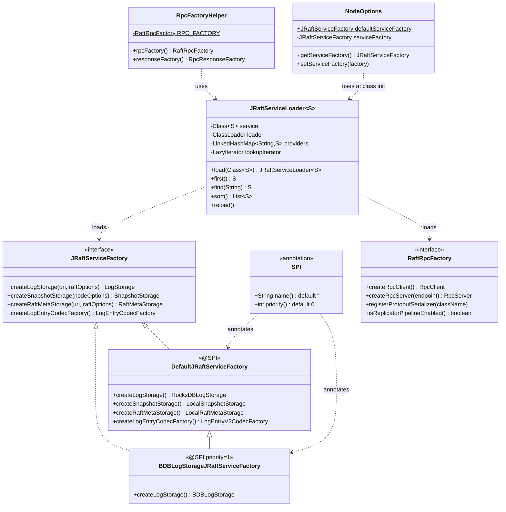

# S11：SPI 扩展机制 + JRaftServiceFactory 体系

> **归属**：补入 `02-node-lifecycle/` 章节
> **核心源码**：`JRaftServiceLoader.java`（12.7KB）+ `JRaftServiceFactory.java`（2.3KB）+ `DefaultJRaftServiceFactory.java`（2.9KB）+ `RaftRpcFactory.java`（3.1KB）+ `RpcFactoryHelper.java`（1.3KB）+ `StorageOptionsFactory.java`（17.5KB）+ `SPI.java`（1.2KB）

---

## 1. 问题推导：为什么需要 SPI？

### 1.1 问题

JRaft 是一个通用的 Raft 框架，不同用户有不同的需求：

- 有人想用 **RocksDB** 存日志（默认），有人想用 **BerkeleyDB**，有人想用 **Java 原生文件**
- 有人想用 **Bolt** 做 RPC（默认），有人想用 **gRPC**（云原生环境）
- 有人想用 **V2（Protobuf）** 编码日志，有人需要兼容旧版 **V1** 格式

如果把这些实现都硬编码在框架里，会导致：
1. 框架依赖膨胀（引入 gRPC 就必须依赖 gRPC 的所有 jar）
2. 用户无法替换实现（无法自定义存储引擎）
3. 版本升级困难（改一个实现影响所有用户）

### 1.2 推导出的设计

**需要什么信息**：
- 一个"接口 → 实现类"的映射关系
- 运行时动态发现实现类（不在代码里硬编码）
- 支持多个实现类时按优先级选择

**推导出的结构**：
- 接口定义（`JRaftServiceFactory`、`RaftRpcFactory`）
- 注册文件（`META-INF/services/接口全限定名`，每行一个实现类）
- 加载器（`JRaftServiceLoader`，读取注册文件 + 实例化）
- 优先级注解（`@SPI(priority=N)`，数字越大优先级越高）

这就是 **Java SPI（Service Provider Interface）** 的增强版。

---

## 2. 核心类关系图



---

## 3. `@SPI` 注解 — 优先级标记

**源码**：`SPI.java:29-37`

```java
// SPI.java:29-37
@Documented
@Retention(RetentionPolicy.RUNTIME)
@Target({ ElementType.TYPE })
public @interface SPI {
    String name() default "";   // 实现类的名称（用于 find(name) 查找）
    int priority() default 0;   // 优先级，数字越大越优先（用于 first() 选择）
}
```

**两个属性的用途**：
- `name`：用于 `JRaftServiceLoader.find("bolt")` 按名称查找特定实现
- `priority`：用于 `JRaftServiceLoader.first()` 在多个实现中选优先级最高的

---

## 4. `JRaftServiceLoader` — 增强版 SPI 加载器

**源码**：`JRaftServiceLoader.java:1-358`

### 4.1 与 Java 原生 `ServiceLoader` 的对比

| 维度 | Java `ServiceLoader` | `JRaftServiceLoader` |
|------|---------------------|---------------------|
| 注册文件路径 | `META-INF/services/接口名` | `META-INF/services/接口名`（相同）|
| 优先级支持 | ❌ 无 | ✅ `@SPI(priority=N)` |
| 按名称查找 | ❌ 无 | ✅ `find(name)` |
| 懒加载 | ✅ | ✅ `LazyIterator` |
| 缓存 | ❌ 每次 `load()` 重新扫描 | ✅ `providers` 缓存已实例化的对象 |
| 排序 | ❌ 无 | ✅ `sort()` 按 priority 降序 |

### 4.2 核心字段分析

**源码**：`JRaftServiceLoader.java:49-58`

| 字段 | 类型 | 作用 | 源码行 |
|------|------|------|--------|
| `service` | `Class<S>` | 要加载的接口类型 | `JRaftServiceLoader.java:49` |
| `loader` | `ClassLoader` | 用于加载实现类的类加载器 | `JRaftServiceLoader.java:52` |
| `providers` | `LinkedHashMap<String, S>` | 已实例化的实现类缓存（key=类全限定名）| `JRaftServiceLoader.java:55` |
| `lookupIterator` | `LazyIterator` | 懒加载迭代器（按需扫描注册文件）| `JRaftServiceLoader.java:58` |

**为什么用 `LinkedHashMap`**：保持插入顺序（即注册文件中的声明顺序），确保 `sort()` 的结果稳定。

### 4.3 `first()` — 选优先级最高的实现

**源码**：`JRaftServiceLoader.java:92-121`

**分支穷举清单**：

| 条件 | 结果 | 源码行 |
|------|------|--------|
| □ 遍历完所有实现，`first == null` | `throw ServiceConfigurationError("could not find any implementation")` | `JRaftServiceLoader.java:112-113` |
| □ `providers.get(first.getName()) != null`（已缓存）| 直接返回缓存实例 | `JRaftServiceLoader.java:116-117` |
| □ `providers.get(first.getName()) == null`（未缓存）| `newProvider(first)` 实例化并缓存 | `JRaftServiceLoader.java:120-121` |

```java
// JRaftServiceLoader.java:92-121（first() 核心逻辑）
public S first() {
    final Iterator<Class<S>> it = classIterator();
    Class<S> first = null;
    while (it.hasNext()) {
        final Class<S> cls = it.next();
        if (first == null) {
            first = cls;
        } else {
            final SPI currSpi = first.getAnnotation(SPI.class);
            final SPI nextSpi = cls.getAnnotation(SPI.class);
            final int currPriority = currSpi == null ? 0 : currSpi.priority();
            final int nextPriority = nextSpi == null ? 0 : nextSpi.priority();
            if (nextPriority > currPriority) {
                first = cls;  // ← 发现更高优先级的实现，替换
            }
        }
    }
    if (first == null) {
        throw fail(this.service, "could not find any implementation for class");
    }
    // 先查缓存，再实例化
    final S ins = this.providers.get(first.getName());
    if (ins != null) {
        return ins;
    }
    return newProvider(first);
}
```

⚠️ **注意**：`first()` 遍历的是 `classIterator()`（只加载 Class，不实例化），然后找到最高优先级的 Class 后，才调用 `newProvider()` 实例化。这意味着**所有注册的实现类都会被 `Class.forName()` 加载**（但不实例化），只有最终选中的那个才会被实例化。

### 4.4 `find(implName)` — 按名称查找

**源码**：`JRaftServiceLoader.java:124-142`

**分支穷举清单**：

| 条件 | 结果 | 源码行 |
|------|------|--------|
| □ 在 `providers` 中找到匹配的 `@SPI(name=implName)` | 直接返回缓存实例 | `JRaftServiceLoader.java:124-129` |
| □ 在 `lookupIterator` 中找到匹配的 `@SPI(name=implName)` | `newProvider(cls)` 实例化 | `JRaftServiceLoader.java:131-136` |
| □ catch(Throwable)（`newProvider` 抛出异常）| `throw ServiceConfigurationError("could not be instantiated")` | `JRaftServiceLoader.java:137-139` |
| □ 遍历完都没找到 | `throw ServiceConfigurationError("provider not found")` | `JRaftServiceLoader.java:142` |

### 4.5 `newProvider(cls)` — 实例化并缓存

**源码**：`JRaftServiceLoader.java:274-283`

**分支穷举清单**：

| 条件 | 结果 | 源码行 |
|------|------|--------|
| □ `cls.newInstance()` 成功 | 放入 `providers` 缓存，打印 INFO 日志，返回实例 | `JRaftServiceLoader.java:277-279` |
| □ catch(Throwable) | `throw ServiceConfigurationError("could not be instantiated")` | `JRaftServiceLoader.java:280-281` |

```java
// JRaftServiceLoader.java:274-282（newProvider）
private S newProvider(final Class<S> cls) {
    LOG.info("SPI service [{} - {}] loading.", this.service.getName(), cls.getName());  // 275
    try {  // 276
        final S provider = this.service.cast(cls.newInstance());  // 277
        this.providers.put(cls.getName(), provider);  // 278 ← 放入缓存
        return provider;  // 279
    } catch (final Throwable x) {  // 280
        throw fail(this.service, "provider " + cls.getName() + " could not be instantiated", x);  // 281
    }
}
```

### 4.6 `LazyIterator` — 懒加载迭代器

**源码**：`JRaftServiceLoader.java:285-342`

`LazyIterator` 是真正读取 `META-INF/services/` 文件的地方，采用**懒加载**策略：只有在调用 `hasNext()` 时才真正扫描文件系统。

**`hasNext()` 分支穷举清单**：

| 条件 | 结果 | 源码行 |
|------|------|--------|
| □ `nextName != null`（已预读下一个类名）| 直接返回 true | `JRaftServiceLoader.java:299` |
| □ `configs == null`（首次调用，未加载文件列表）| 加载 `META-INF/services/接口名` 的所有 URL | `JRaftServiceLoader.java:301-309` |
| □ catch(IOException) | `throw ServiceConfigurationError("error locating configuration files")` | `JRaftServiceLoader.java:310-312` |
| □ `pending == null \|\| !pending.hasNext()`（当前文件读完）| 切换到下一个 URL，调用 `parse()` | `JRaftServiceLoader.java:313-317` |
| □ `!configs.hasMoreElements()`（所有 URL 都读完）| 返回 false | `JRaftServiceLoader.java:314-315` |
| □ 正常读到下一个类名 | `nextName = pending.next()`，返回 true | `JRaftServiceLoader.java:318-319` |

**`next()` 分支穷举清单**：

| 条件 | 结果 | 源码行 |
|------|------|--------|
| □ `!hasNext()` | `throw NoSuchElementException` | `JRaftServiceLoader.java:327-328` |
| □ catch(ClassNotFoundException)（`Class.forName` 失败）| `throw ServiceConfigurationError("provider not found")` | `JRaftServiceLoader.java:333-334` |
| □ `!service.isAssignableFrom(cls)`（类型不匹配）| `throw ServiceConfigurationError("not a subtype")` | `JRaftServiceLoader.java:336-337` |
| □ 正常 | 返回 `Class<S>` | `JRaftServiceLoader.java:339` |

---

## 5. `JRaftServiceFactory` — 核心组件工厂接口

**源码**：`JRaftServiceFactory.java:31-62`

```java
// JRaftServiceFactory.java:31-62
public interface JRaftServiceFactory {
    // 创建日志存储（默认：RocksDBLogStorage）
    LogStorage createLogStorage(String uri, RaftOptions raftOptions);

    // 创建快照存储（默认：LocalSnapshotStorage）
    SnapshotStorage createSnapshotStorage(NodeOptions nodeOptions);

    // 创建元数据存储（默认：LocalRaftMetaStorage）
    RaftMetaStorage createRaftMetaStorage(String uri, RaftOptions raftOptions);

    // 创建日志编解码工厂（默认：LogEntryV2CodecFactory）
    LogEntryCodecFactory createLogEntryCodecFactory();
}
```

**四个工厂方法覆盖了 JRaft 的四大可插拔组件**：

| 工厂方法 | 默认实现 | 可替换为 |
|---------|---------|---------|
| `createLogStorage()` | `RocksDBLogStorage` | `BDBLogStorage`、`HybridLogStorage`、自定义 |
| `createSnapshotStorage()` | `LocalSnapshotStorage` | 自定义（如对象存储） |
| `createRaftMetaStorage()` | `LocalRaftMetaStorage` | 自定义（如分布式存储） |
| `createLogEntryCodecFactory()` | `LogEntryV2CodecFactory` | `LogEntryV1CodecFactory`（兼容旧版）|

### 5.1 `DefaultJRaftServiceFactory` — 默认实现

**源码**：`DefaultJRaftServiceFactory.java:1-73`

```java
// DefaultJRaftServiceFactory.java:41-71
@SPI  // 41 ← 无 priority，默认 priority=0
public class DefaultJRaftServiceFactory implements JRaftServiceFactory {  // 42

    @Override
    public LogStorage createLogStorage(final String uri, final RaftOptions raftOptions) {  // 49
        Requires.requireTrue(StringUtils.isNotBlank(uri), "Blank log storage uri.");  // 50
        return new RocksDBLogStorage(uri, raftOptions);  // 51 ← 默认 RocksDB
    }

    @Override
    public SnapshotStorage createSnapshotStorage(final NodeOptions nodeOptions) {  // 55
        String uri = nodeOptions.getSnapshotUri();
        String tempUri = nodeOptions.getSnapshotTempUri();
        Requires.requireTrue(!StringUtils.isBlank(uri), "Blank snapshot storage uri.");
        return new LocalSnapshotStorage(uri, tempUri, nodeOptions.getRaftOptions());  // 59 ← 本地文件
    }

    @Override
    public RaftMetaStorage createRaftMetaStorage(final String uri, final RaftOptions raftOptions) {  // 63
        Requires.requireTrue(!StringUtils.isBlank(uri), "Blank raft meta storage uri.");
        return new LocalRaftMetaStorage(uri, raftOptions);  // 65 ← 本地 Protobuf 文件
    }

    @Override
    public LogEntryCodecFactory createLogEntryCodecFactory() {  // 69
        return LogEntryV2CodecFactory.getInstance();  // 70 ← V2 Protobuf 编码
    }
}
```

### 5.2 `BDBLogStorageJRaftServiceFactory` — BDB 存储引擎接入示例

**源码**：`BDBLogStorageJRaftServiceFactory.java:1-38`

```java
// BDBLogStorageJRaftServiceFactory.java:30-38
@SPI(priority = 1)  // ← priority=1，高于 DefaultJRaftServiceFactory 的 priority=0
public class BDBLogStorageJRaftServiceFactory extends DefaultJRaftServiceFactory {

    @Override
    public LogStorage createLogStorage(String uri, RaftOptions raftOptions) {
        return new BDBLogStorage(uri, raftOptions);  // ← 只替换 LogStorage，其他保持默认
    }
}
```

**这是 JRaft SPI 扩展的标准模式**：
1. 继承 `DefaultJRaftServiceFactory`（复用其他方法的默认实现）
2. 只覆盖需要替换的方法
3. 标注 `@SPI(priority=N)`，N > 0 确保优先级高于默认实现
4. 在 `META-INF/services/com.alipay.sofa.jraft.JRaftServiceFactory` 中注册

---

## 6. `NodeOptions` 中的 SPI 加载时机

**源码**：`NodeOptions.java:38-40`

```java
// NodeOptions.java:38-40（类静态初始化）
public static final JRaftServiceFactory defaultServiceFactory  // 38
    = JRaftServiceLoader.load(JRaftServiceFactory.class)       // 38
        .first();  // 39 ← 类加载时立即执行，选优先级最高的实现
```

**关键设计**：`defaultServiceFactory` 是 `static final` 字段，在 `NodeOptions` 类加载时就执行 SPI 扫描。这意味着：

1. **JVM 启动时就确定了默认工厂**：不是懒加载，而是类加载时立即扫描
2. **优先级决定默认实现**：如果 classpath 中有 `BDBLogStorageJRaftServiceFactory`（priority=1），它会自动成为默认工厂
3. **用户可以覆盖**：通过 `nodeOptions.setServiceFactory(customFactory)` 显式指定

```java
// NodeOptions.java:172（默认值）
private JRaftServiceFactory serviceFactory = defaultServiceFactory;  // 172

// NodeOptions.java:187-193（getter/setter）
public JRaftServiceFactory getServiceFactory() {  // 187
    return this.serviceFactory;
}

public void setServiceFactory(final JRaftServiceFactory serviceFactory) {  // 191
    this.serviceFactory = serviceFactory;
}
```

### 6.1 `NodeImpl.init()` 中的使用

**源码**：`NodeImpl.java:808`、`NodeImpl.java:578-595`

```java
// NodeImpl.java:808（init 中赋值）
this.serviceFactory = opts.getServiceFactory();  // 808

// NodeImpl.java:578-595（initLogStorage 中使用）
private boolean initLogStorage() {  // 578
    // 通过工厂创建 LogStorage
    this.logStorage = this.serviceFactory.createLogStorage(
        this.options.getLogUri(), this.raftOptions);  // NodeImpl.java:580

    this.logManager = new LogManagerImpl();
    final LogManagerOptions opts = new LogManagerOptions();
    // 通过工厂创建 LogEntryCodecFactory
    opts.setLogEntryCodecFactory(
        this.serviceFactory.createLogEntryCodecFactory());  // NodeImpl.java:584
    // ...
}

// NodeImpl.java:594-595（initMetaStorage 中使用）
private boolean initMetaStorage() {  // 594
    this.metaStorage = this.serviceFactory.createRaftMetaStorage(
        this.options.getRaftMetaUri(), this.raftOptions);  // NodeImpl.java:595
    // ...
}
```

---

## 7. `RaftRpcFactory` SPI — RPC 框架可插拔

**源码**：`RaftRpcFactory.java:1-109`

`RaftRpcFactory` 是 RPC 框架的 SPI 接口，通过它可以在 Bolt 和 gRPC 之间切换。

### 7.1 注册文件

```
# jraft-core/META-INF/services/com.alipay.sofa.jraft.rpc.RaftRpcFactory
com.alipay.sofa.jraft.rpc.impl.BoltRaftRpcFactory   ← 默认（@SPI，priority=0）

# jraft-extension/rpc-grpc-impl/META-INF/services/com.alipay.sofa.jraft.rpc.RaftRpcFactory
com.alipay.sofa.jraft.rpc.impl.GrpcRaftRpcFactory   ← gRPC 扩展（@SPI(priority=1)）
```

### 7.2 `RpcFactoryHelper` — 静态单例加载

**源码**：`RpcFactoryHelper.java:1-38`

```java
// RpcFactoryHelper.java:25-36
public class RpcFactoryHelper {  // 25

    // 类加载时立即执行 SPI 扫描，选优先级最高的 RaftRpcFactory
    private static final RaftRpcFactory RPC_FACTORY =  // 27
        JRaftServiceLoader.load(RaftRpcFactory.class).first();

    public static RaftRpcFactory rpcFactory() {  // 30
        return RPC_FACTORY;
    }

    public static RpcResponseFactory responseFactory() {  // 34
        return RPC_FACTORY.getRpcResponseFactory();
    }
}
```

**与 `NodeOptions.defaultServiceFactory` 的相同模式**：都是在类加载时通过 `JRaftServiceLoader.first()` 选优先级最高的实现，存为 `static final` 字段。

### 7.3 `RaftRpcFactory` 接口关键方法

**源码**：`RaftRpcFactory.java:33-109`

| 方法 | 作用 | 源码行 |
|------|------|--------|
| `registerProtobufSerializer(className, args)` | 注册 Protobuf 序列化器（不同 RPC 框架的注册方式不同）| `RaftRpcFactory.java:38` |
| `createRpcClient(helper)` | 创建 RPC 客户端 | `RaftRpcFactory.java:55` |
| `createRpcServer(endpoint, helper)` | 创建 RPC 服务端 | `RaftRpcFactory.java:74` |
| `isReplicatorPipelineEnabled()` | 是否支持 Pipeline 复制（默认 true）| `RaftRpcFactory.java:85` |
| `ensurePipeline()` | 确保 RPC 框架支持 Pipeline | `RaftRpcFactory.java:92` |
| `defaultJRaftClientConfigHelper(opts)` | 默认客户端配置辅助（默认返回 null）| `RaftRpcFactory.java:95` |
| `defaultJRaftServerConfigHelper(opts)` | 默认服务端配置辅助（默认返回 null）| `RaftRpcFactory.java:100` |

---

## 8. `StorageOptionsFactory` — RocksDB 配置选项工厂

**源码**：`StorageOptionsFactory.java:1-401`

`StorageOptionsFactory` 不是 SPI，而是一个**全局配置注册表**，用于集中管理 RocksDB 的调优参数。

### 8.1 核心字段

**源码**：`StorageOptionsFactory.java:43-45`

```java
// StorageOptionsFactory.java:43-45（三张配置表，均为 ConcurrentHashMap）
private static final Map<String, DBOptions>             rocksDBOptionsTable      = new ConcurrentHashMap<>();
private static final Map<String, ColumnFamilyOptions>   columnFamilyOptionsTable = new ConcurrentHashMap<>();
private static final Map<String, BlockBasedTableConfig> tableFormatConfigTable   = new ConcurrentHashMap<>();
```

**key 的构成**：`buildKey(groupId, cls)` → `groupId + "-" + cls.getName()`（或仅 `cls.getName()`）

这意味着**不同 Raft Group 可以有不同的 RocksDB 配置**，实现了 Group 级别的配置隔离。

### 8.2 `getRocksDBOptions()` 分支穷举清单

**源码**：`StorageOptionsFactory.java:113-128`

| 条件 | 结果 | 源码行 |
|------|------|--------|
| □ `cls == null`（前置检查）| `throw IllegalArgumentException` | `StorageOptionsFactory.java:114` |
| □ `opts != null`（用户已注册自定义配置）| 直接跳到 128 行返回 `new DBOptions(opts)`（浅拷贝）| `StorageOptionsFactory.java:128` |
| □ `opts == null`（未注册，首次调用）| `getDefaultRocksDBOptions()` 创建默认值 | `StorageOptionsFactory.java:118` |
| □ `putIfAbsent` 返回 null（自己写入成功）| `opts = newOpts`，继续到 128 行返回 | `StorageOptionsFactory.java:119-121` |
| □ `putIfAbsent` 返回非 null（并发竞争，另一个线程已写入）| 关闭新建的 `newOpts`，使用已存在的 | `StorageOptionsFactory.java:122-124` |

```java
// StorageOptionsFactory.java:113-128（getRocksDBOptions 核心逻辑）
public static DBOptions getRocksDBOptions(final String groupId, final Class<?> cls) {
    Requires.requireNonNull(cls, "cls");  // 114 ← cls==null 抛 IllegalArgumentException
    String key = buildKey(groupId, cls);  // 115
    DBOptions opts = rocksDBOptionsTable.get(key);  // 116
    if (opts == null) {  // 117
        final DBOptions newOpts = getDefaultRocksDBOptions();  // 118
        opts = rocksDBOptionsTable.putIfAbsent(key, newOpts);  // 119
        if (opts == null) {  // 120
            opts = newOpts;  // 121 ← 自己写入成功
        } else {
            newOpts.close();  // 123 ← 并发竞争失败，关闭多余的对象（避免 native 内存泄漏）
        }
    }
    // 注意：返回浅拷贝，避免用户修改影响全局配置
    return new DBOptions(checkInvalid(opts));  // 128
}
```

⚠️ **生产踩坑**：`DBOptions` 和 `ColumnFamilyOptions` 持有 native C++ 对象，必须调用 `close()` 释放。`StorageOptionsFactory.releaseAllOptions()` 提供了统一释放入口，但**用户拿到的拷贝对象需要自己 close()**（注释中有说明）。

### 8.3 默认 RocksDB 配置（关键参数）

**源码**：`StorageOptionsFactory.java:131-175`（DBOptions）、`StorageOptionsFactory.java:222-315`（ColumnFamilyOptions）、`StorageOptionsFactory.java:355-370`（BlockBasedTableConfig）

**DBOptions 默认值**：

| 参数 | 默认值 | 含义 |
|------|--------|------|
| `createIfMissing` | true | DB 不存在时自动创建 |
| `createMissingColumnFamilies` | true | 缺失的 CF 自动创建 |
| `maxOpenFiles` | -1 | 不限制打开文件数（需要足够的 fd 限制）|
| `keepLogFileNum` | 100 | 保留最近 100 个 RocksDB LOG 文件 |
| `maxTotalWalSize` | 1GB | WAL 总大小上限 |

**ColumnFamilyOptions 默认值**：

| 参数 | 默认值 | 含义 |
|------|--------|------|
| `writeBufferSize` | 64MB | 单个 MemTable 大小 |
| `maxWriteBufferNumber` | 3 | 最多 3 个 MemTable（含 immutable）|
| `minWriteBufferNumberToMerge` | 1 | 至少 1 个 immutable MemTable 才 flush |
| `level0FileNumCompactionTrigger` | 10 | L0 文件数达到 10 触发 Compaction |
| `level0SlowdownWritesTrigger` | 20 | L0 文件数达到 20 开始限速写入 |
| `level0StopWritesTrigger` | 40 | L0 文件数达到 40 停止写入 |
| `maxBytesForLevelBase` | 512MB | L1 总大小上限 |
| `targetFileSizeBase` | 64MB | L1 单个 SST 文件大小目标 |
| `compressionType` | LZ4（非 Windows）| 压缩算法 |
| `forceConsistencyChecks` | true | 强制一致性检查 |

**BlockBasedTableConfig 默认值**：

| 参数 | 默认值 | 含义 |
|------|--------|------|
| `indexType` | `kTwoLevelIndexSearch` | 分区索引（减少内存占用）|
| `filterPolicy` | BloomFilter(16) | 16 bits/key 的 Bloom 过滤器 |
| `partitionFilters` | true | 分区过滤器 |
| `blockSize` | 4KB | 数据块大小 |

---

## 9. SPI 注册文件全览

JRaft 中所有 SPI 注册文件：

| 注册文件 | 默认实现 | 扩展实现 |
|---------|---------|---------|
| `META-INF/services/com.alipay.sofa.jraft.JRaftServiceFactory` | `DefaultJRaftServiceFactory`（@SPI，priority=0）| `BDBLogStorageJRaftServiceFactory`（@SPI priority=1）、`HybridLogJRaftServiceFactory` |
| `META-INF/services/com.alipay.sofa.jraft.rpc.RaftRpcFactory` | `BoltRaftRpcFactory`（@SPI，priority=0）| `GrpcRaftRpcFactory`（@SPI priority=1）|
| `META-INF/services/com.alipay.sofa.jraft.util.timer.RaftTimerFactory` | `DefaultRaftTimerFactory` | — |
| `META-INF/services/com.alipay.sofa.jraft.util.JRaftSignalHandler` | — | 用户自定义信号处理器 |

---

## 10. 如何自定义存储引擎接入 JRaft

以自定义 `MyLogStorage` 为例，完整接入步骤：

**Step 1：实现 `LogStorage` 接口**
```java
public class MyLogStorage implements LogStorage {
    // 实现所有接口方法
}
```

**Step 2：创建自定义 `JRaftServiceFactory`**
```java
@SPI(priority = 10)  // priority > 1（高于 BDB 的 priority=1）
public class MyJRaftServiceFactory extends DefaultJRaftServiceFactory {
    @Override
    public LogStorage createLogStorage(String uri, RaftOptions raftOptions) {
        return new MyLogStorage(uri, raftOptions);
    }
}
```

**Step 3：注册 SPI**

在 `src/main/resources/META-INF/services/com.alipay.sofa.jraft.JRaftServiceFactory` 中添加：
```
com.example.MyJRaftServiceFactory
```

**Step 4（可选）：显式指定**

如果不想依赖 SPI 自动发现，也可以显式指定：
```java
NodeOptions opts = new NodeOptions();
opts.setServiceFactory(new MyJRaftServiceFactory());
```

---

## 11. 面试高频考点 📌

**Q1：JRaft 如何实现存储引擎的可插拔？**

通过 `JRaftServiceFactory` SPI 接口 + `JRaftServiceLoader` 实现。用户只需：①实现 `JRaftServiceFactory` 接口，②标注 `@SPI(priority=N)`，③在 `META-INF/services/` 中注册，JRaft 启动时会自动选择优先级最高的实现。

**Q2：JRaft 的 SPI 和 Java 原生 `ServiceLoader` 有什么区别？**

JRaft 的 `JRaftServiceLoader` 在 Java `ServiceLoader` 基础上增加了：①`@SPI(priority)` 优先级排序，②`find(name)` 按名称查找，③`providers` 缓存（避免重复实例化）。核心机制（`META-INF/services/` 注册文件）与 Java SPI 相同。

**Q3：如何在不修改代码的情况下将 JRaft 的 RPC 框架从 Bolt 切换到 gRPC？**

只需在 classpath 中引入 `jraft-extension/rpc-grpc-impl` 模块，该模块的 `META-INF/services/com.alipay.sofa.jraft.rpc.RaftRpcFactory` 注册了 `GrpcRaftRpcFactory`。如果其 `@SPI(priority)` 高于 `BoltRaftRpcFactory`，则自动切换。

**Q4：`NodeOptions.defaultServiceFactory` 是什么时候初始化的？**

在 `NodeOptions` 类加载时（`static final` 字段初始化），通过 `JRaftServiceLoader.load(JRaftServiceFactory.class).first()` 扫描 classpath 并选优先级最高的实现。这是**类加载时立即执行**，不是懒加载。

**Q5：`StorageOptionsFactory` 的 key 设计有什么特点？**

key = `groupId + "-" + className`，支持**不同 Raft Group 使用不同的 RocksDB 配置**。如果 `groupId` 为 null，则 key = `className`，所有 Group 共享同一配置。

---

## 12. 生产踩坑 ⚠️

**踩坑1：SPI 优先级冲突**

如果 classpath 中同时存在多个 `JRaftServiceFactory` 实现且 priority 相同，`first()` 的选择取决于注册文件的扫描顺序（ClassLoader 加载 URL 的顺序），**结果不确定**。建议：自定义实现的 priority 设置为明确的正整数，避免与默认实现（priority=0）冲突。

**踩坑2：`DBOptions` native 内存泄漏**

`StorageOptionsFactory.getRocksDBOptions()` 返回的是**浅拷贝**，调用方拿到后必须在使用完毕后调用 `opts.close()` 释放 native C++ 对象。如果忘记 close，会导致 native 内存泄漏，最终 OOM。

**踩坑3：`maxOpenFiles=-1` 导致 fd 耗尽**

默认 `maxOpenFiles=-1`（不限制打开文件数）在文件数量多时可能耗尽系统 fd 限制（`ulimit -n`）。生产环境建议：①调大 `ulimit -n`（推荐 65536+），②或设置合理的 `maxOpenFiles` 值。

**踩坑4：`BDBLogStorageJRaftServiceFactory` 自动生效**

如果项目中引入了 `jraft-extension/bdb-log-storage-impl` 依赖，由于 `BDBLogStorageJRaftServiceFactory` 的 priority=1 高于默认的 priority=0，**会自动替换默认的 RocksDB 存储引擎**！这可能是无意引入的行为。建议：在引入扩展模块时，明确通过 `nodeOptions.setServiceFactory()` 指定工厂，而不是依赖 SPI 自动发现。
