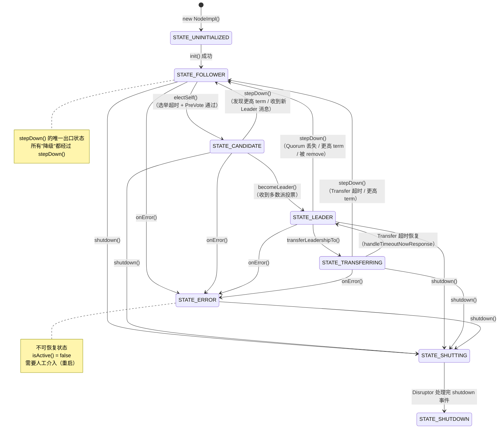
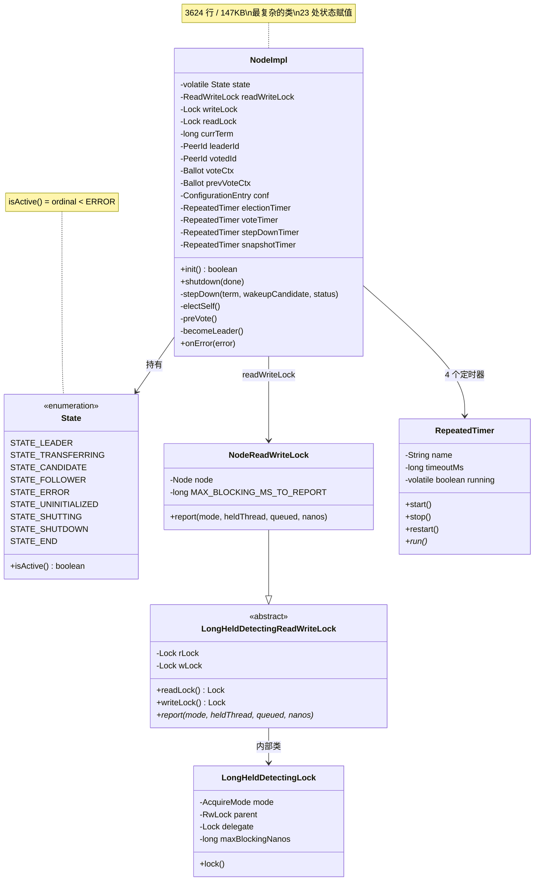

# S20：NodeImpl 状态机与核心锁机制深度分析

> **核心问题**：JRaft 最复杂的类 `NodeImpl`（3624 行 / 147KB）内部维护了一个 9 状态的有限状态机（FSM），几乎所有操作的前提都是"当前处于正确的状态"。理解这个状态机是理解整个 JRaft 的**命门**。
>
> **涉及源码**：
> - `NodeImpl.java`（3624 行）— 节点核心实现
> - `State.java`（40 行）— 状态枚举定义
> - `LongHeldDetectingReadWriteLock.java`（154 行）— 长时间持锁检测读写锁
>
> **方法论**：`Read-TopDown`（状态机总览 → 逐状态分析）+ `Read-DataFlow`（追踪 `this.state` 的全部赋值点）+ `Read-WhyNot`（为什么需要 9 种状态？去掉某个状态会怎样？）

---

## 目录

1. [解决什么问题](#1-解决什么问题)
2. [State 枚举 — 9 种状态](#2-state-枚举--9-种状态)
3. [状态转换矩阵（23 处赋值点全解）](#3-状态转换矩阵23-处赋值点全解)
4. [stepDown() — 状态转换的枢纽方法](#4-stepdown--状态转换的枢纽方法)
5. [核心状态转换路径详解](#5-核心状态转换路径详解)
6. [LongHeldDetectingReadWriteLock — 核心锁机制](#6-longhelddetectingreadwritelock--核心锁机制)
7. [定时器与状态的联动](#7-定时器与状态的联动)
8. [数据结构关系图](#8-数据结构关系图)
9. [核心不变式](#9-核心不变式)
10. [面试高频考点 📌](#10-面试高频考点-)
11. [生产踩坑 ⚠️](#11-生产踩坑-️)

---

## 1. 解决什么问题

### 1.1 问题推导

**问题**：一个 Raft 节点在不同阶段有完全不同的行为——Leader 接受写请求并复制日志，Follower 接受来自 Leader 的日志，Candidate 正在参与选举。如何管理这些差异化行为？

**推导**：
- 需要一个**状态机**来表示节点当前的角色
- 每种状态下允许的操作集不同——例如 `apply()` 只有 `STATE_LEADER` 才能执行
- 状态转换必须是**原子的**、**有序的**——不能在转换过程中被其他线程打断
- 需要一个**全局锁**来保护状态转换的原子性

**NodeImpl 的解决方案**：
- `volatile State state` — 当前状态
- `ReadWriteLock readWriteLock` — 保护状态读写
- `stepDown()` — 几乎所有"降级"都经过这个枢纽方法
- 4 个 `RepeatedTimer` — 与状态联动（不同状态下运行不同的定时器）

---

## 2. State 枚举 — 9 种状态

### 2.1 真实数据结构

```java
// State.java:26-39
public enum State {
    STATE_LEADER,         // 领导者：接受写入，复制日志
    STATE_TRANSFERRING,   // 正在转让领导权（仍是 Leader，但拒绝新的 apply）
    STATE_CANDIDATE,      // 候选人：正在参与选举
    STATE_FOLLOWER,       // 跟随者：接受 Leader 的日志复制
    STATE_ERROR,          // 错误状态：节点遇到不可恢复的错误
    STATE_UNINITIALIZED,  // 未初始化：构造后、init() 前
    STATE_SHUTTING,       // 正在关闭：shutdown() 已调用，组件正在有序关闭
    STATE_SHUTDOWN,       // 已关闭：所有组件已停止
    STATE_END;            // 哨兵值（不使用）

    public boolean isActive() {
        return this.ordinal() < STATE_ERROR.ordinal();
        // 只有 LEADER、TRANSFERRING、CANDIDATE、FOLLOWER 是"活跃"状态
    }
}
```

### 2.2 状态分类

| 类别 | 状态 | `isActive()` | 说明 |
|------|------|-------------|------|
| **活跃状态（参与 Raft 协议）** | `STATE_LEADER` | ✅ | 接受写入，复制日志，发送心跳 |
| | `STATE_TRANSFERRING` | ✅ | 仍是 Leader 但拒绝新 apply，等待目标节点追上 |
| | `STATE_CANDIDATE` | ✅ | 正在选举，发送 RequestVote |
| | `STATE_FOLLOWER` | ✅ | 接受 AppendEntries，可能触发选举超时 |
| **非活跃状态（不参与 Raft 协议）** | `STATE_ERROR` | ❌ | 不可恢复错误，需要人工介入 |
| | `STATE_UNINITIALIZED` | ❌ | 刚构造，还未调用 `init()` |
| | `STATE_SHUTTING` | ❌ | 正在有序关闭中 |
| | `STATE_SHUTDOWN` | ❌ | 完全关闭 |

### 2.3 为什么是 9 种状态？（Read-WhyNot）

| 状态 | 如果去掉会怎样？ |
|------|---------------|
| `STATE_LEADER` / `STATE_CANDIDATE` / `STATE_FOLLOWER` | Raft 论文最基本的三种角色，去掉任何一个协议无法运行 |
| `STATE_TRANSFERRING` | 如果没有它，`transferLeadership` 期间 Leader 仍然接受 `apply()`，可能导致目标节点永远追不上。有了它，可以拒绝新写入（`EBUSY`） |
| `STATE_ERROR` | 如果没有它，节点遇到磁盘 I/O 错误后仍参与选举和投票，可能导致数据不一致。有了它，错误节点被"隔离"出协议 |
| `STATE_UNINITIALIZED` | 如果没有它，无法区分"还没初始化"和"已经初始化但是 Follower"，可能在 `init()` 之前被错误调用 |
| `STATE_SHUTTING` / `STATE_SHUTDOWN` | 如果只有一个"关闭"状态，无法区分"正在关闭中（等待组件有序停止）"和"已经完全关闭"，`join()` 方法无法正确工作 |

---

## 3. 状态转换矩阵（23 处赋值点全解）

### 3.1 `this.state =` 的全部 23 个赋值位置

通过搜索 `this.state = State.` 得到完整列表：

| # | 行号 | 目标状态 | 源方法 | 触发条件 |
|---|------|---------|--------|---------|
| 1 | 551 | `STATE_UNINITIALIZED` | 构造函数 `NodeImpl()` | 对象创建 |
| 2 | 1092 | `STATE_FOLLOWER` | `init()` | 初始化完成 |
| 3 | 1177 | `STATE_CANDIDATE` | `electSelf()` | PreVote 通过后正式选举 |
| 4 | 1267 | `STATE_LEADER` | `becomeLeader()` | 收到多数派投票 |
| 5 | 1321 | `STATE_FOLLOWER` | `stepDown()` | **枢纽方法**：所有降级都经过这里 |
| 6 | 2464 | `STATE_SHUTDOWN` | `LogEntryAndClosureHandler.onEvent()` | 收到 shutdown 信号，Disruptor 处理完毕 |
| 7 | 2577 | `STATE_ERROR` | `onError()` | 不可恢复错误（磁盘 I/O 等） |
| 8 | 2825 | `STATE_SHUTTING` | `shutdown()` | 开始关闭流程 |
| 9 | 2972 | `STATE_LEADER` | `handleTimeoutNowResponse()` | Transfer 超时恢复 |
| 10 | 3288 | `STATE_TRANSFERRING` | `transferLeadershipTo()` | 发起 Leadership 转移 |

**注意**：实际代码中有 23 处 `this.state` 的读/比较操作（如 `if (this.state == State.STATE_LEADER)`），但**写入（赋值）只有上面 10 个位置**。其余 13 处是条件检查（如行 1171、1262、1307、1313、1796、2428、2801、2805、2822、2970、3122、3242），不改变状态。

### 3.2 状态转换图



### 3.3 关键特征

1. **`STATE_FOLLOWER` 是 stepDown() 的唯一出口**：无论从哪个状态调用 `stepDown()`，结果状态都是 `STATE_FOLLOWER`
2. **`STATE_ERROR` 是单向不可逆的**：进入 `STATE_ERROR` 后不能回到任何活跃状态，只能 `shutdown()`
3. **`STATE_UNINITIALIZED` 只出现一次**：构造函数设置，`init()` 后永远不会再回到这个状态
4. **`STATE_TRANSFERRING` 是 `STATE_LEADER` 的子状态**：仍然是 Leader，只是拒绝新的 `apply()`

---

## 4. stepDown() — 状态转换的枢纽方法

### 4.1 问题推导

**问题**：Leader 降级为 Follower 时，需要做哪些清理工作？

**推导**：
- 停止 StepDown 定时器（Leader 专属）
- 清空 BallotBox 的待提交队列（未提交的日志让新 Leader 处理）
- 通知状态机 `onLeaderStop`
- 重置 leaderId
- 如果 term 变了，更新 term 和 votedId 并持久化
- 重启选举定时器（重新变成等待超时的 Follower）
- 如果需要，唤醒下一个 Candidate（`wakeupCandidate`）

### 4.2 真实源码 + 逐行注释

```java
// NodeImpl.java:1301-1392
private void stepDown(final long term, final boolean wakeupCandidate, final Status status) {
    LOG.debug("Node {} stepDown, term={}, newTerm={}, wakeupCandidate={}.",
        getNodeId(), this.currTerm, term, wakeupCandidate);

    // ① 如果已经不在活跃状态，直接返回
    if (!this.state.isActive()) {
        return;
    }

    // ② 根据当前状态做不同的清理
    if (this.state == State.STATE_CANDIDATE) {
        stopVoteTimer();                             // Candidate → 停止投票定时器
    } else if (this.state.compareTo(State.STATE_TRANSFERRING) <= 0) {
        // STATE_LEADER 或 STATE_TRANSFERRING
        stopStepDownTimer();                         // 停止心跳检测定时器
        this.ballotBox.clearPendingTasks();           // ★ 清空投票箱（未提交日志失败）
        if (this.state == State.STATE_LEADER) {
            onLeaderStop(status);                    // 通知状态机 Leader 停止
        }
    }

    // ③ 重置 leaderId（触发 onStopFollowing / onStartFollowing 回调）
    resetLeaderId(PeerId.emptyPeer(), status);

    // ④ ★ 核心状态转换：无论从哪来，都变成 FOLLOWER
    this.state = State.STATE_FOLLOWER;
    this.confCtx.reset();                            // 重置成员变更上下文
    updateLastLeaderTimestamp(Utils.monotonicMs());

    // ⑤ 如果正在安装快照，中断它
    if (this.snapshotExecutor != null) {
        this.snapshotExecutor.interruptDownloadingSnapshots(term);
    }

    // ⑥ 如果发现了更高的 term，更新 term 和 votedFor 并持久化
    if (term > this.currTerm) {
        this.currTerm = term;
        this.votedId = PeerId.emptyPeer();           // 新 term 还没投票
        this.metaStorage.setTermAndVotedFor(term, this.votedId);  // ★ 持久化
    }

    // ⑦ 如果需要唤醒下一个 Candidate（Leader 主动让位场景）
    if (wakeupCandidate) {
        this.wakingCandidate = this.replicatorGroup.stopAllAndFindTheNextCandidate(this.conf);
        if (this.wakingCandidate != null) {
            Replicator.sendTimeoutNowAndStop(this.wakingCandidate, this.options.getElectionTimeoutMs());
        }
    } else {
        this.replicatorGroup.stopAll();              // 停止所有 Replicator
    }

    // ⑧ 清理 Transfer 相关状态
    if (this.stopTransferArg != null) {
        if (this.transferTimer != null) {
            this.transferTimer.cancel(true);
        }
        this.stopTransferArg = null;
    }

    // ⑨ 重启选举定时器（Learner 除外）
    if (!isLearner()) {
        this.electionTimer.restart();                // ★ 重新开始等待选举超时
    }
}
```

### 4.3 stepDown() 的 8 个调用者

| # | 调用位置 | 触发场景 | `term` 参数 | `wakeupCandidate` |
|---|---------|---------|------------|-------------------|
| 1 | `checkStepDown()` | 收到更高 term 的 RPC | `requestTerm` | `false` |
| 2 | `checkDeadNodes()` | Leader 心跳超时（多数派不可达）| `this.currTerm` | `false` |
| 3 | `onError()` | 不可恢复错误 | `this.currTerm` | `state == LEADER` |
| 4 | `shutdown()` | 节点关闭 | `this.currTerm` | `state == LEADER` |
| 5 | `increaseTermTo()` | Replicator 收到更高 term 响应 | `newTerm` | `false` |
| 6 | `ConfigurationCtx.nextStage()` | 成员变更完成后自己被移除 | `this.currTerm` | `true` |
| 7 | `handleTimeoutNowRequest()` | 收到更高 term 的 TimeoutNow | `request.getTerm()` | `false` |
| 8 | `handleStepDownTimeout()` | StepDown 定时器检测到 Quorum 丢失 | `this.currTerm` | `false` |

### 4.4 设计决策

**为什么所有降级都经过 `stepDown()`？** 这是**Template Method 模式**的运用——无论从哪个状态降级，需要做的清理工作是相同的（停止定时器、清空 BallotBox、重置 Leader、持久化 term）。如果每个调用者自己做清理，极容易遗漏步骤导致状态不一致。

---

## 5. 核心状态转换路径详解

### 5.1 初始化路径：UNINITIALIZED → FOLLOWER

```java
// NodeImpl.java:551（构造函数）
this.state = State.STATE_UNINITIALIZED;

// NodeImpl.java:1092（init() 末尾）
this.state = State.STATE_FOLLOWER;
```

**`init()` 中在设置状态前完成的关键初始化**：
1. 初始化 `MetaStorage`（恢复 term 和 votedFor）
2. 初始化 `LogManager`（加载日志索引）
3. 初始化 `FSMCaller`（启动 Disruptor）
4. 初始化 `BallotBox`
5. 初始化 `SnapshotExecutor`
6. 注册到 `NodeManager`
7. 启动 4 个 `RepeatedTimer`
8. **最后**才设置 `state = STATE_FOLLOWER`

**设计决策**：为什么状态赋值在最后？因为一旦变成 `STATE_FOLLOWER`，选举定时器就开始运行了。如果在组件还没初始化完就变成 Follower，选举超时触发后调用的方法可能访问到未初始化的组件（NPE）。

### 5.2 选举路径：FOLLOWER → CANDIDATE → LEADER

```
handleElectionTimeout()
  │
  ▼ 检查 state == FOLLOWER && leader 失联
  │
  ▼ preVote()  ← 不改变 state，仍是 FOLLOWER
  │  发送 PreVote RPC（term+1）
  │  收集多数派 grant
  │
  ▼ electSelf()
  │  this.state = STATE_CANDIDATE  ← ★ FOLLOWER → CANDIDATE
  │  this.currTerm++
  │  this.votedId = self
  │  发送 RequestVote RPC
  │  如果单节点集群：自己 grant 就够了
  │
  ▼ becomeLeader()
     this.state = STATE_LEADER     ← ★ CANDIDATE → LEADER
     启动 Replicators
     重置 BallotBox.pendingIndex
     启动 StepDown 定时器
```

**PreVote 不改变状态**：这是 Raft 论文中 PreVote 优化的关键——PreVote 阶段不递增 term，不改变 state，所以即使 PreVote 失败也不会打断当前的 Raft 运行。只有 PreVote 通过后才调用 `electSelf()` 正式进入 Candidate 状态。

### 5.3 Leadership Transfer 路径：LEADER → TRANSFERRING → FOLLOWER

```java
// NodeImpl.java:3288
this.state = State.STATE_TRANSFERRING;   // LEADER → TRANSFERRING

// 后续两种结局：
// A) 目标节点选举成功，发来更高 term 的 AppendEntries
//    → checkStepDown() → stepDown() → STATE_FOLLOWER
// B) Transfer 超时
//    → handleTimeoutNowResponse() → this.state = STATE_LEADER  // 恢复
//    或 → onTransferTimeout() → stepDown() → STATE_FOLLOWER
```

**`STATE_TRANSFERRING` 期间的行为**：
- `apply()` 返回 `EBUSY`（拒绝新写入）
- `handleAppendEntriesResponse()` 仍然正常处理（复制仍在进行）
- StepDown 定时器仍在运行（如果 Quorum 丢失仍然会 stepDown）

### 5.4 错误路径：ANY → ERROR

```java
// NodeImpl.java:2573-2577（onError 方法）
if (this.state.compareTo(State.STATE_FOLLOWER) <= 0) {
    stepDown(this.currTerm, this.state == State.STATE_LEADER, ...);
}
if (this.state.compareTo(State.STATE_ERROR) < 0) {
    this.state = State.STATE_ERROR;   // ★ 先 stepDown，再进入 ERROR
}
```

**进入 ERROR 前先 stepDown 的原因**：`stepDown()` 会清理 BallotBox、停止 Replicator、通知状态机。如果直接跳到 ERROR 而不做清理，会导致资源泄漏和数据不一致。

**`onError()` 的调用者**（什么情况会触发不可恢复错误？）：
- `FSMCallerImpl.doCommitted()` 中 `StateMachine.onApply()` 抛出未捕获异常
- `LogManagerImpl.appendToStorage()` 磁盘 I/O 失败
- `SnapshotExecutorImpl.loadDownloadingSnapshot()` 快照加载失败且无法恢复

### 5.5 关闭路径：ANY → SHUTTING → SHUTDOWN

```java
// NodeImpl.java:2817-2825（shutdown 方法核心）
if (this.state.compareTo(State.STATE_SHUTTING) < 0) {
    NodeManager.getInstance().remove(this);
    if (this.state.compareTo(State.STATE_FOLLOWER) <= 0) {
        stepDown(this.currTerm, this.state == State.STATE_LEADER, ...);  // ★ 先 stepDown
    }
    this.state = State.STATE_SHUTTING;       // ★ 进入关闭中状态
    // 有序关闭所有组件...
}

// NodeImpl.java:2464（Disruptor 处理完 shutdown 事件后）
this.state = State.STATE_SHUTDOWN;           // ★ 完全关闭
```

**关闭顺序**（在 `STATE_SHUTTING` 中执行）：
1. `readOnlyService.shutdown()`
2. `logManager.shutdown()`
3. `metaStorage.shutdown()`
4. `snapshotExecutor.shutdown()`
5. `fsmCaller.shutdown()`
6. `rpcService.shutdown()`
7. 发送 shutdown 事件到 Disruptor → 处理完毕后进入 `STATE_SHUTDOWN`

---

## 6. LongHeldDetectingReadWriteLock — 核心锁机制

### 6.1 问题推导

**问题**：`NodeImpl` 的状态和核心字段被多个线程并发访问（RPC 线程、定时器线程、Disruptor 线程、用户线程），如何保证并发安全？

**推导**：
- 大部分操作只需要读状态（`isLeader()`、`handleAppendEntriesRequest()` 中的部分检查）→ 读锁
- 状态转换操作（`stepDown()`、`electSelf()`、`becomeLeader()`）需要独占 → 写锁
- 锁持有时间不能太长，否则会阻塞心跳处理导致选举超时 → **需要监控长时间持锁**

### 6.2 真实数据结构

```java
// LongHeldDetectingReadWriteLock.java:33-60
public abstract class LongHeldDetectingReadWriteLock implements ReadWriteLock {
    private final Lock rLock;   // 读锁（可能是增强版或原始版）
    private final Lock wLock;   // 写锁

    public LongHeldDetectingReadWriteLock(boolean fair, long maxBlockingTimeToReport, TimeUnit unit) {
        final RwLock rwLock = new RwLock(fair);              // 内部是 ReentrantReadWriteLock
        final long maxBlockingNanos = unit.toNanos(maxBlockingTimeToReport);
        if (maxBlockingNanos > 0) {
            // ★ 启用长持锁检测：包装 delegate，在 lock() 前后计时
            this.rLock = new LongHeldDetectingLock(AcquireMode.Read, rwLock, maxBlockingNanos);
            this.wLock = new LongHeldDetectingLock(AcquireMode.Write, rwLock, maxBlockingNanos);
        } else {
            // 禁用检测：直接使用原始锁
            this.rLock = rwLock.readLock();
            this.wLock = rwLock.writeLock();
        }
    }
}
```

### 6.3 长持锁检测的原理

```java
// LongHeldDetectingLock.lock() — LongHeldDetectingReadWriteLock.java:107-118
@Override
public void lock() {
    final long start = System.nanoTime();
    final Thread owner = this.parent.getOwner();    // ★ 获取当前持锁线程
    try {
        this.delegate.lock();                        // 实际获取锁（可能阻塞）
    } finally {
        final long elapsed = System.nanoTime() - start;
        if (elapsed > this.maxBlockingNanos) {       // ★ 如果阻塞时间超过阈值
            report(this.mode, owner, this.parent.getQueuedThreads(), elapsed);
        }
    }
}
```

### 6.4 NodeImpl 中的使用

```java
// NodeImpl.java:166-170
private final ReadWriteLock readWriteLock = new NodeReadWriteLock(this);
protected final Lock writeLock = this.readWriteLock.writeLock();
protected final Lock readLock  = this.readWriteLock.readLock();

// NodeReadWriteLock 继承 LongHeldDetectingReadWriteLock
private static class NodeReadWriteLock extends LongHeldDetectingReadWriteLock {
    static final long MAX_BLOCKING_MS_TO_REPORT = SystemPropertyUtil.getLong(
        "jraft.node.detecting.lock.max_blocking_ms_to_report", -1);
    // ★ 默认 -1 = 禁用检测！需要通过 JVM 参数启用
}

// report 实现：记录 metrics + 打印 WARN 日志
@Override
public void report(final AcquireMode acquireMode, final Thread heldThread,
                   final Collection<Thread> queuedThreads, final long blockedNanos) {
    final long blockedMs = TimeUnit.NANOSECONDS.toMillis(blockedNanos);
    LOG.warn("Raft-Node-Lock report: currentThread={}, acquireMode={}, heldThread={}, ..., blockedMs={}.",
        Thread.currentThread(), acquireMode, heldThread, queuedThreads, blockedMs);
    // 记录到 NodeMetrics
    metrics.recordLatency("node-lock-blocked", blockedMs);
}
```

### 6.5 读锁 vs 写锁的使用规则

| 操作类型 | 锁类型 | 示例 |
|---------|--------|------|
| 状态转换 | **写锁** | `stepDown()`、`electSelf()`、`becomeLeader()`、`shutdown()` |
| 接受 RPC 请求（需修改状态） | **写锁** | `handleRequestVoteRequest()`（可能调用 `checkStepDown`） |
| 接受 RPC 请求（只读检查） | **读锁** | `handleAppendEntriesRequest()` 中的 term 检查部分 |
| 获取状态信息 | **读锁** | `isLeader()`、`getLeaderId()` |
| 定时器回调 | **读锁→写锁** | `handleStepDownTimeout()` 先读锁检查，发现问题再升级为写锁 |

**关键设计模式——`doUnlock` 标志**：
```java
// 很多方法使用 doUnlock 模式避免在条件分支中忘记释放锁
boolean doUnlock = true;
this.writeLock.lock();
try {
    // ... 某些条件下需要在持锁状态下调用另一个方法（如 electSelf）
    doUnlock = false;   // 告诉 finally 不要解锁，由被调用方法解锁
    electSelf();        // electSelf() 内部会释放写锁
} finally {
    if (doUnlock) {
        this.writeLock.unlock();
    }
}
```

---

## 7. 定时器与状态的联动

### 7.1 4 个 RepeatedTimer 的状态关联

| 定时器 | 启动条件（状态） | 停止条件 | 超时回调 |
|--------|---------------|---------|---------|
| `electionTimer` | `STATE_FOLLOWER`（`stepDown()` 末尾重启） | `electSelf()` 中停止 | `handleElectionTimeout()` → `preVote()` |
| `voteTimer` | `STATE_CANDIDATE`（`electSelf()` 中启动） | `stepDown()` 中停止 | `handleVoteTimeout()` → 重新 `preVote()` |
| `stepDownTimer` | `STATE_LEADER`（`becomeLeader()` 中启动） | `stepDown()` 中停止 | `handleStepDownTimeout()` → `checkDeadNodes()` |
| `snapshotTimer` | `init()` 中启动，与状态无关 | `shutdown()` 中停止 | `handleSnapshotTimeout()` → `doSnapshot()` |

### 7.2 定时器切换时序

```
FOLLOWER 状态：
  [electionTimer 运行] → 超时 → preVote → electSelf()
                                              │
                                              ▼
CANDIDATE 状态：                         stopElectionTimer
  [voteTimer 运行] → 超时 → 重新选举      startVoteTimer
        │                                    │
        ▼ 收到多数派投票                       │
  becomeLeader()                              │
        │                                    │
        ▼                                    │
LEADER 状态：                            stopVoteTimer
  [stepDownTimer 运行] → 超时             startStepDownTimer
        → checkDeadNodes()
        → 如果多数派不可达 → stepDown()
                                │
                                ▼
回到 FOLLOWER 状态：          stopStepDownTimer
  [electionTimer 重启]        restartElectionTimer
```

### 7.3 选举超时的随机化

```java
// NodeImpl.java — electionTimer 的 adjustTimeout()
private int adjustElectionTimeout(final int electionTimeout) {
    return randomTimeout(electionTimeout);
}

// Utils.java
public static int randomTimeout(final int timeoutMs) {
    return ThreadLocalRandom.current().nextInt(timeoutMs, timeoutMs + (timeoutMs >> 1));
    // 范围：[electionTimeout, electionTimeout * 1.5)
}
```

**为什么要随机化？** 如果所有 Follower 的选举超时完全相同，Leader 崩溃后所有 Follower 会同时发起选举，导致选票分裂（split vote），可能多轮选举都无法选出 Leader。随机化确保不同 Follower 在不同时间点触发选举。

---

## 8. 数据结构关系图



---

## 9. 核心不变式

| # | 不变式 | 保证机制 |
|---|--------|---------| 
| 1 | **状态转换在写锁保护下执行** | 所有 `this.state =` 赋值都在 `writeLock.lock()` 之后 |
| 2 | **stepDown() 的输出状态一定是 FOLLOWER** | `stepDown()` 方法体内固定 `this.state = State.STATE_FOLLOWER` |
| 3 | **STATE_ERROR 不可逆** | `onError()` 中 `if (state < ERROR) state = ERROR`，没有任何方法将 ERROR 转回活跃状态 |
| 4 | **每种活跃状态恰好有一个"专属"定时器在运行** | FOLLOWER→electionTimer，CANDIDATE→voteTimer，LEADER→stepDownTimer |
| 5 | **term 只增不减** | `stepDown()` 中 `if (term > currTerm)` 才更新，`electSelf()` 中 `currTerm++` |
| 6 | **votedFor 在新 term 中被重置** | `stepDown()` 中 `if (term > currTerm)` 时 `votedId = emptyPeer()` |
| 7 | **init() 完成前 state == UNINITIALIZED** | 状态赋值在 `init()` 的最后一行 |
| 8 | **shutdown 前先 stepDown** | `shutdown()` 中 `if (state <= FOLLOWER) stepDown(...)` 在 `state = SHUTTING` 之前 |
| 9 | **PreVote 不改变 state** | `preVote()` 方法内没有 `this.state =` 赋值 |

---

## 10. 面试高频考点 📌

### Q1：JRaft 节点有几种状态？isActive() 包含哪些？

9 种状态。`isActive()` 返回 `true` 的只有 4 种：`STATE_LEADER`、`STATE_TRANSFERRING`、`STATE_CANDIDATE`、`STATE_FOLLOWER`。判断依据是 `ordinal() < STATE_ERROR.ordinal()`——利用枚举的声明顺序，前 4 个是活跃状态。

### Q2：stepDown() 做了哪些事情？为什么它这么重要？

`stepDown()` 是所有"降级"操作的枢纽方法，做 9 件事：①停止对应定时器 ②清空 BallotBox ③通知状态机 onLeaderStop ④重置 leaderId ⑤设置 `state = FOLLOWER` ⑥重置成员变更上下文 ⑦中断快照下载 ⑧更新 term+votedFor 并持久化 ⑨重启选举定时器。重要性在于所有降级复用同一个方法，确保不遗漏清理步骤。

### Q3：PreVote 为什么不改变节点状态？

PreVote 是一种"试探性"投票——先问大家"如果我发起选举，你们会投给我吗？"不递增 term，不改变 state，所以即使 PreVote 失败也不会对集群产生任何影响。只有 PreVote 获得多数派同意后，才调用 `electSelf()` 正式进入 Candidate 状态。

### Q4：STATE_TRANSFERRING 和 STATE_LEADER 有什么区别？

`STATE_TRANSFERRING` 是 `STATE_LEADER` 的"受限子状态"。区别只有一个：`STATE_TRANSFERRING` 拒绝新的 `apply()` 请求（返回 `EBUSY`）。其他行为（日志复制、心跳、StepDown 定时器）与 `STATE_LEADER` 完全相同。Transfer 超时后可以恢复为 `STATE_LEADER`。

### Q5：进入 STATE_ERROR 后能恢复吗？

不能。`STATE_ERROR` 是单向不可逆的终态（只能继续 `shutdown()`）。`isActive()` 返回 `false`，所有 `stepDown()` 调用会被第一行 `if (!state.isActive()) return` 跳过。节点需要**重启进程**才能恢复。

### Q6：NodeImpl 的 ReadWriteLock 为什么要加长持锁检测？

Raft 的心跳和选举超时对延迟非常敏感。如果某个线程长时间持有 NodeImpl 的写锁（例如状态机的 `onApply` 回调太慢），其他线程的 RPC 处理（如 `handleAppendEntriesRequest()`）会被阻塞，可能导致心跳超时和不必要的选举。`LongHeldDetectingReadWriteLock` 在锁阻塞超过阈值时打印 WARN 日志并记录 metrics，帮助定位锁竞争问题。

### Q7：为什么 handleElectionTimeout() 先用读锁检查，再升级为写锁？

`handleElectionTimeout()` 先做两个快速检查（`state != FOLLOWER` 和 `isCurrentLeaderValid()`），这两个检查只需要读状态，不需要写锁。如果检查通过，才获取写锁执行 `preVote()`。这是**读写锁分层优化**——绝大多数超时回调会被快速检查拒绝（因为 Leader 通常是有效的），避免了不必要的写锁竞争。

---

## 11. 生产踩坑 ⚠️

### 踩坑 1：锁竞争导致选举风暴

**现象**：集群频繁选举，日志中大量 `"Raft-Node-Lock report"` 告警。

**原因**：用户的 `StateMachine.onApply()` 实现中有阻塞操作（如同步写数据库），导致 FSMCaller 的 Disruptor 线程长时间持有 NodeImpl 的锁（间接通过某些回调路径），其他线程处理心跳超时。

**解决**：
1. 启用锁检测：`-Djraft.node.detecting.lock.max_blocking_ms_to_report=200`
2. 确保 `onApply()` 中只做内存操作，异步刷盘
3. 开启 `enableMetrics=true`，监控 `node-lock-blocked` 指标

### 踩坑 2：STATE_ERROR 后节点"僵死"

**现象**：节点进入 STATE_ERROR 后不再参与任何操作，但进程还活着，运维不知道。

**原因**：`STATE_ERROR` 是不可逆的，但没有明显的外部表现（不会自动关闭进程）。

**解决**：
1. 实现 `StateMachine.onError()` 回调，在回调中发告警或主动退出进程
2. 监控 `node.describe()` 输出中的 state 字段
3. 使用 `kill -USR2` 信号触发 `NodeDescribeSignalHandler` 打印节点状态

### 踩坑 3：shutdown 未调用 join 导致资源泄漏

**现象**：调用 `shutdown()` 后立即退出，部分组件还在运行，出现诡异错误。

**原因**：`shutdown()` 只是将状态切到 `STATE_SHUTTING` 并开始有序关闭，但关闭过程是异步的（Disruptor 需要处理完 shutdown 事件才到 `STATE_SHUTDOWN`）。必须调用 `join()` 等待完全关闭。

**解决**：始终 `shutdown()` + `join()` 配对使用。

### 踩坑 4：随机超时范围设置不当

**现象**：3 节点集群，Leader 崩溃后需要 5-10 秒才能选出新 Leader。

**原因**：`electionTimeoutMs` 设置过大（如 5000ms），随机化范围 `[5000, 7500)ms`。

**解决**：生产环境建议 `electionTimeoutMs = 1000`（随机化为 1~1.5 秒），心跳间隔 = electionTimeout / 10 = 100ms。

---

## 总结

### 数据结构层面

| 结构 | 核心特征 |
|------|---------| 
| `State` 枚举 | 9 种状态，`isActive()` 基于 ordinal 比较，前 4 个是活跃状态 |
| `NodeImpl.state` | `volatile` 修饰，写操作在写锁保护下，读操作可通过 `volatile` 无锁读取 |
| `LongHeldDetectingReadWriteLock` | 装饰器模式包装 `ReentrantReadWriteLock`，在 `lock()` 后计时超阈值则 `report()` |
| `NodeReadWriteLock` | 默认禁用检测（`-1`），需要通过 JVM 参数 `jraft.node.detecting.lock.max_blocking_ms_to_report` 启用 |

### 算法层面

| 算法/机制 | 核心设计决策 |
|-----------|------------|
| **状态转换** | `stepDown()` 是所有降级的唯一枢纽，确保清理操作不遗漏（Template Method） |
| **选举触发** | 先 PreVote（不改变 state）→ 通过后 electSelf（FOLLOWER→CANDIDATE→LEADER） |
| **错误处理** | `onError()` 先 stepDown 清理，再进入不可逆的 STATE_ERROR |
| **关闭流程** | 先 stepDown → STATE_SHUTTING → 有序关闭组件 → STATE_SHUTDOWN |
| **定时器联动** | 每种活跃状态有且只有一个专属定时器运行，状态转换时切换定时器 |
| **锁策略** | 读写锁分离（读多写少），`doUnlock` 模式处理条件释放，长持锁检测防止选举超时 |
