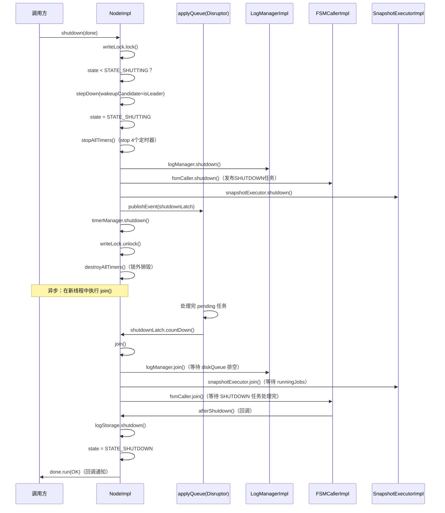
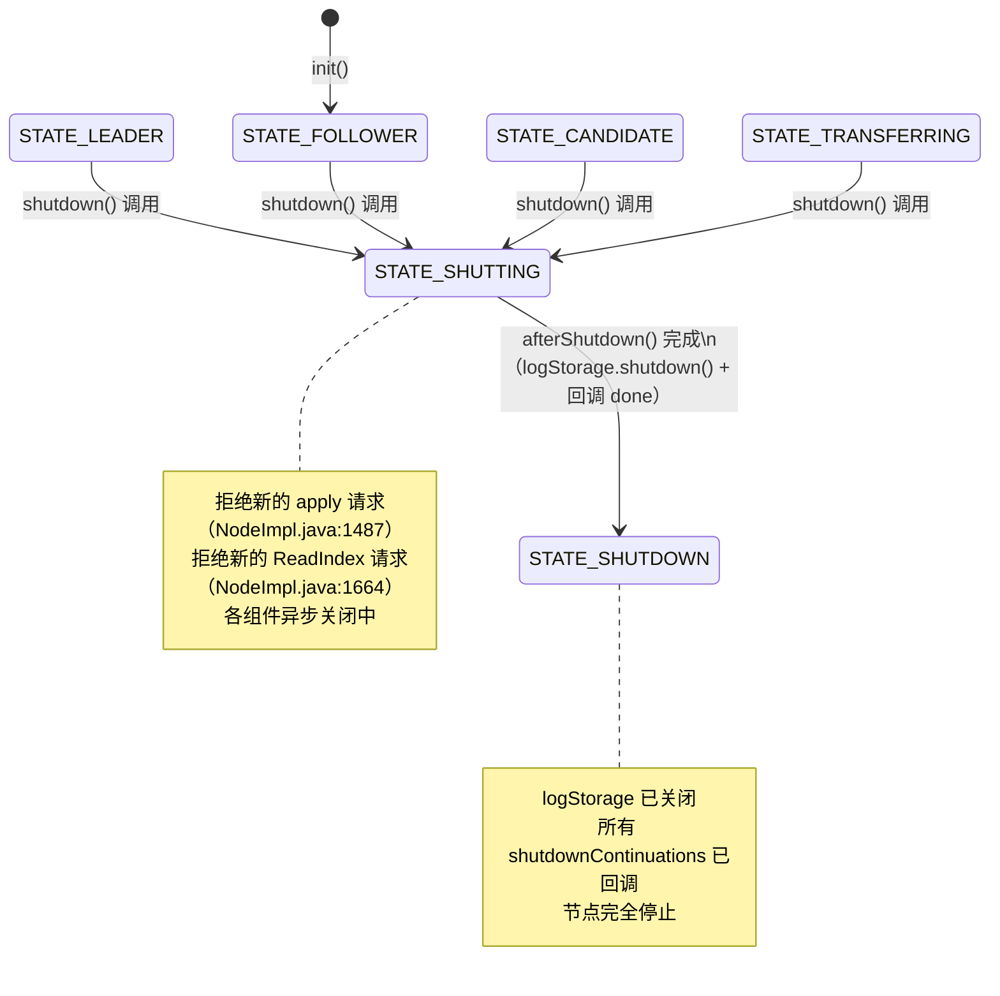
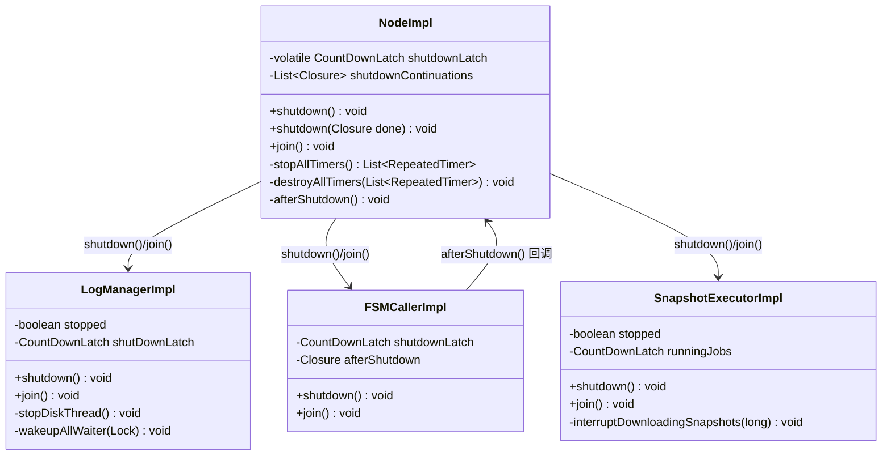

# S9：节点优雅停机（shutdown / join）

> 归属：`02-node-lifecycle/S9-Shutdown.md`  
> 核心源码：`NodeImpl.java:2812`、`NodeImpl.java:2926`、`FSMCallerImpl.java:221`、`LogManagerImpl.java:272`

---

## 1. 问题推导

### 【问题】为什么需要"优雅停机"？

直接 kill 进程会导致：
1. **日志丢失**：Disruptor 中 pending 的日志条目未写入磁盘
2. **快照中断**：正在进行的快照保存/安装被强制中断，文件损坏
3. **Follower 状态不一致**：Leader 未通知 Follower 就消失，Follower 需要等选举超时才能感知
4. **资源泄漏**：定时器、线程池、文件句柄未释放

### 【需要什么信息】

| 需要解决的问题 | 需要的机制 |
|---|---|
| 通知 Leader 主动 stepDown | `stepDown(wakeupCandidate=true)` |
| 等待 Disruptor 中 pending 任务处理完 | `shutdownLatch`（CountDownLatch）|
| 等待各组件异步任务完成 | 各组件的 `join()` 方法 |
| 支持异步回调通知调用方 | `shutdownContinuations`（Closure 列表）|
| 防止重复 shutdown | `state` 状态机（`STATE_SHUTTING`/`STATE_SHUTDOWN`）|

### 【推导出的结构】

```java
// NodeImpl.java:176
private volatile CountDownLatch shutdownLatch;          // applyQueue 排空信号
// NodeImpl.java:201
private final List<Closure> shutdownContinuations = new ArrayList<>();  // 异步回调列表
```

---

## 2. 核心数据结构

### 2.1 NodeImpl 中的 shutdown 相关字段

| 字段 | 类型 | 行号 | 作用 |
|---|---|---|---|
| `shutdownLatch` | `volatile CountDownLatch` | `NodeImpl.java:176` | 等待 applyQueue（Disruptor）排空 |
| `shutdownContinuations` | `List<Closure>` | `NodeImpl.java:201` | 异步回调列表，shutdown 完成后逐一调用 |

### 2.2 State 状态机中的 shutdown 相关状态

```
STATE_LEADER / STATE_FOLLOWER / STATE_CANDIDATE
    ↓ shutdown() 调用
STATE_SHUTTING    ← 正在关闭（拒绝新请求，等待组件关闭）
    ↓ afterShutdown() 调用
STATE_SHUTDOWN    ← 完全关闭（logStorage 已关闭）
```

**关键不变式**：`state.compareTo(STATE_SHUTTING) >= 0` 时，重复调用 `shutdown()` 是幂等的（`NodeImpl.java:2817`）。

---

## 3. 完整时序图



---

## 4. `shutdown(Closure done)` 逐行分析（`NodeImpl.java:2812`）

### 4.1 分支穷举清单（前置）

| # | 条件 | 结果 |
|---|---|---|
| ① | `state.compareTo(STATE_SHUTTING) < 0`（首次调用） | 执行完整 shutdown 流程 |
| ② | `state.compareTo(STATE_SHUTTING) >= 0`（重复调用） | 跳过 shutdown 流程（幂等） |
| ③ | 分支①中：`state.compareTo(STATE_FOLLOWER) <= 0`（Leader/Candidate/Follower） | 先调用 `stepDown(currTerm, isLeader, ESHUTDOWN)` |
| ④ | 分支①中：`applyQueue != null` | 发布 shutdownLatch 事件到 Disruptor |
| ⑤ | 分支①中：`applyQueue == null` | 直接 `GLOBAL_NUM_NODES.decrementAndGet()` |
| ⑥ | `state != STATE_SHUTDOWN`（shutdown 未完成） | 将 done 加入 `shutdownContinuations`，return |
| ⑦ | `state == STATE_SHUTDOWN`（已完成） | 在 finally 中异步调用 `join()` + `done.run(OK)` |
| ⑧ | catch `InterruptedException`（join 被中断） | `Thread.currentThread().interrupt()` |

### 4.2 核心执行路径（分支①）

```java
// NodeImpl.java:2817
if (this.state.compareTo(State.STATE_SHUTTING) < 0) {
    NodeManager.getInstance().remove(this);   // 从全局注册表移除

    // 步骤1：如果是 Leader/Candidate/Follower，先 stepDown
    // wakeupCandidate=true 时会向 Follower 发 TimeoutNow，加速新 Leader 选出
    if (this.state.compareTo(State.STATE_FOLLOWER) <= 0) {
        stepDown(this.currTerm, this.state == State.STATE_LEADER,
                new Status(RaftError.ESHUTDOWN, "Raft node is going to quit."));
    }

    // 步骤2：切换状态
    this.state = State.STATE_SHUTTING;

    // 步骤3：停止所有定时器（stop，不是 destroy）
    timers = stopAllTimers();   // NodeImpl.java:2827

    // 步骤4：逐个关闭各组件（顺序有讲究）
    this.readOnlyService.shutdown();
    this.logManager.shutdown();       // 停止 diskQueue，唤醒等待者
    this.metaStorage.shutdown();
    this.snapshotExecutor.shutdown(); // stopped=true，中断下载中的快照
    if (this.wakingCandidate != null) {
        Replicator.stop(this.wakingCandidate);  // 停止正在唤醒的候选人 Replicator
    }
    this.fsmCaller.shutdown();        // 发布 SHUTDOWN 任务到 FSM Disruptor
    this.rpcService.shutdown();

    // 步骤5：向 applyQueue 发布 shutdownLatch 事件（排空 Disruptor）
    final CountDownLatch latch = new CountDownLatch(1);
    this.shutdownLatch = latch;
    ThreadPoolsFactory.runInThread(this.groupId,
        () -> this.applyQueue.publishEvent((event, sequence) -> event.shutdownLatch = latch));

    this.timerManager.shutdown();
}
```

### 4.3 `stopAllTimers()` vs `destroyAllTimers()`（`NodeImpl.java:2898`）

```java
// NodeImpl.java:2898
private List<RepeatedTimer> stopAllTimers() {
    final List<RepeatedTimer> timers = new ArrayList<>();
    if (this.electionTimer != null) { this.electionTimer.stop(); timers.add(this.electionTimer); }
    if (this.voteTimer != null)     { this.voteTimer.stop();     timers.add(this.voteTimer); }
    if (this.stepDownTimer != null) { this.stepDownTimer.stop(); timers.add(this.stepDownTimer); }
    if (this.snapshotTimer != null) { this.snapshotTimer.stop(); timers.add(this.snapshotTimer); }
    return timers;
}

// NodeImpl.java:2919
private void destroyAllTimers(final List<RepeatedTimer> timers) {
    for (final RepeatedTimer timer : timers) {
        timer.destroy();
    }
}
```

**为什么分两步？**

- `stop()`：在 writeLock 内调用，停止定时器触发（但不销毁底层资源）
- `destroy()`：在 writeLock 外调用，销毁底层 HashedWheelTimer 资源

**注释说明**（`NodeImpl.java:2874`）：
> `// Destroy all timers out of lock`

这是为了避免 `destroy()` 内部可能触发的回调持有 writeLock 导致死锁。

### 4.4 `done` 回调的两种路径

```java
// NodeImpl.java:2863
if (this.state != State.STATE_SHUTDOWN) {
    if (done != null) {
        this.shutdownContinuations.add(done);  // 路径A：shutdown 未完成，加入等待列表
        done = null;
    }
    return;
}
// 路径B：state == STATE_SHUTDOWN（已完成），在 finally 中异步回调
// finally 块中：
ThreadPoolsFactory.runInThread(this.groupId, () -> {
    try {
        join();
    } catch (InterruptedException e) {
        Thread.currentThread().interrupt();
    } finally {
        if (shutdownHook != null) {
            shutdownHook.run(Status.OK());  // 回调 done
        }
    }
});
```

**路径 A 的触发时机**：`shutdown()` 调用时 `state != STATE_SHUTDOWN`（正常情况），`done` 被加入 `shutdownContinuations`，然后 `done = null`，finally 块中 `shutdownHook = null`，**不触发回调**。等 `afterShutdown()` 完成后统一回调所有 `shutdownContinuations`。

**路径 B 的触发时机**：极少数情况下，`shutdown()` 调用时 `state` 已经是 `STATE_SHUTDOWN`（例如重复调用），`done` 不被加入列表，`shutdownHook = done`（非 null），finally 块中异步执行 `join()` + `done.run(OK)`。

**关键实现细节**：finally 块**总是执行**，但只有 `shutdownHook != null` 时才触发回调。`shutdownHook` 是否为 null 取决于 `done` 是否在 `return` 前被置 null（路径A 中 `done = null`）。

**关键实现细节**：finally 块**总是执行**，但只有 `shutdownHook != null` 时才触发回调。`shutdownHook` 是否为 null 取决于 `done` 是否在 `return` 前被置 null（路径A）。

---

## 5. `join()` 逐行分析（`NodeImpl.java:2926`）

```java
// NodeImpl.java:2926
public synchronized void join() throws InterruptedException {
    if (this.shutdownLatch != null) {
        // 等待各组件 join（并行等待）
        if (this.readOnlyService != null) { this.readOnlyService.join(); }
        if (this.logManager != null)      { this.logManager.join(); }      // 等待 diskQueue 排空
        if (this.snapshotExecutor != null){ this.snapshotExecutor.join(); } // 等待 runningJobs
        if (this.wakingCandidate != null) { Replicator.join(this.wakingCandidate); }

        this.shutdownLatch.await();        // 等待 applyQueue（Disruptor）排空
        this.applyDisruptor.shutdown();    // 关闭 Disruptor
        this.applyQueue = null;
        this.applyDisruptor = null;
        this.shutdownLatch = null;
    }
    // 无论 shutdownLatch 是否为 null，都要等 fsmCaller
    if (this.fsmCaller != null) {
        this.fsmCaller.join();             // 等待 FSM Disruptor 处理完 SHUTDOWN 任务
    }
}
```

### 5.1 分支穷举清单

| # | 条件 | 结果 |
|---|---|---|
| ① | `shutdownLatch == null`（applyQueue 为 null） | 跳过 applyQueue 等待，直接等 fsmCaller |
| ② | `shutdownLatch != null` | 等待各组件 join + `shutdownLatch.await()` + `applyDisruptor.shutdown()` |
| ③ | `fsmCaller != null`（无论①②） | 调用 `fsmCaller.join()` |

### 5.2 等待顺序的设计意图

| 等待对象 | 等待内容 | 为什么要等 |
|---|---|---|
| `readOnlyService.join()` | ReadIndex 请求处理完 | 避免 pending 的 ReadIndex 请求丢失 |
| `logManager.join()` | diskQueue 排空（日志刷盘） | 确保所有日志已持久化 |
| `snapshotExecutor.join()` | runningJobs 完成 | 确保快照保存/安装完成 |
| `Replicator.join(wakingCandidate)` | TimeoutNow RPC 发送完 | 确保 wakeup 消息已发出 |
| `shutdownLatch.await()` | applyQueue Disruptor 排空 | 确保所有 apply 任务已处理 |
| `fsmCaller.join()` | FSM Disruptor 处理完 SHUTDOWN | 确保状态机回调完成 |

---

## 6. 各组件 shutdown/join 实现

### 6.1 `LogManagerImpl.shutdown()` + `join()`（`LogManagerImpl.java:272`）

```java
// LogManagerImpl.java:272
public void shutdown() {
    boolean doUnlock = true;
    this.writeLock.lock();
    try {
        if (this.stopped) { return; }   // 幂等
        this.stopped = true;
        // doUnlock=false：writeLock 由 wakeupAllWaiter 内部释放（传入 lock 参数）
        doUnlock = false;
        wakeupAllWaiter(this.writeLock); // 唤醒所有等待 waitForNextIndex 的线程，内部释放 writeLock
    } finally {
        if (doUnlock) { this.writeLock.unlock(); }  // 只有异常路径才在这里 unlock
    }
    stopDiskThread();   // 向 diskQueue 发布 SHUTDOWN 事件（锁外执行）
}

// LogManagerImpl.java:253
private void stopDiskThread() {
    this.shutDownLatch = new CountDownLatch(1);
    ThreadPoolsFactory.runInThread(this.groupId, () -> this.diskQueue.publishEvent((event, sequence) -> {
        event.reset();
        event.type = EventType.SHUTDOWN;
    }));
}

// LogManagerImpl.java:263
public void join() throws InterruptedException {
    if (this.shutDownLatch == null) { return; }
    this.shutDownLatch.await();    // 等待 diskQueue 处理完 SHUTDOWN 事件
    this.disruptor.shutdown();     // 关闭 Disruptor
}
```

**关键设计**：`wakeupAllWaiter()` 唤醒所有在 `waitForNextIndex()` 中阻塞的线程（如 Replicator 等待日志追赶），防止这些线程永久阻塞。

### 6.2 `FSMCallerImpl.shutdown()` + `join()`（`FSMCallerImpl.java:221`）

```java
// FSMCallerImpl.java:221
public synchronized void shutdown() {
    if (this.shutdownLatch != null) { return; }  // 幂等
    LOG.info("Shutting down FSMCaller...");
    if (this.taskQueue != null) {
        final CountDownLatch latch = new CountDownLatch(1);
        this.shutdownLatch = latch;
        // 向 FSM Disruptor 发布 SHUTDOWN 任务
        ThreadPoolsFactory.runInThread(getNode().getGroupId(),
            () -> this.taskQueue.publishEvent((task, sequence) -> {
                task.reset();
                task.type = TaskType.SHUTDOWN;
                task.shutdownLatch = latch;
            }));
    }
}

// FSMCallerImpl.java:385
public synchronized void join() throws InterruptedException {
    if (this.shutdownLatch != null) {
        this.shutdownLatch.await();    // 等待 SHUTDOWN 任务被处理
        this.disruptor.shutdown();
        if (this.afterShutdown != null) {
            this.afterShutdown.run(Status.OK());  // 触发 NodeImpl.afterShutdown()
            this.afterShutdown = null;
        }
        this.shutdownLatch = null;
    }
}
```

**关键设计**：
1. **`doShutdown()` 调用 `fsm.onShutdown()`**：在 FSM Disruptor 线程中处理 `SHUTDOWN` 任务时，`doShutdown()` 会调用 `this.fsm.onShutdown()`（`FSMCallerImpl.java` 中 `doShutdown` 方法），通知用户状态机关闭。这是用户状态机的生命周期回调，用户可以在此释放资源。
2. **`afterShutdown` 回调**：`fsmCaller.join()` 完成后，触发 `afterShutdown` 回调（即 `NodeImpl.afterShutdown()`），这是 `STATE_SHUTDOWN` 状态设置的最终触发点。

### 6.3 `SnapshotExecutorImpl.shutdown()` + `join()`（`SnapshotExecutorImpl.java:287`）

```java
// SnapshotExecutorImpl.java:287
public void shutdown() {
    long savedTerm;
    this.lock.lock();
    try {
        savedTerm = this.term;
        this.stopped = true;
    } finally {
        this.lock.unlock();
    }
    interruptDownloadingSnapshots(savedTerm);  // 中断正在进行的快照下载
}

// SnapshotExecutorImpl.java:744
public void join() throws InterruptedException {
    this.runningJobs.await();  // 等待所有正在运行的快照任务完成
}
```

**`runningJobs`**：`CountDownEvent`（`SnapshotExecutorImpl.java` 字段），每个快照任务（保存/安装）开始时调用 `incrementAndGet()`，完成时调用 `countDown()`。`join()` 调用 `runningJobs.await()` 等待所有任务的 `state` 归零。`CountDownEvent` 是 JRaft 自定义的可重用计数器（`CountDownEvent.java`），与 `CountDownLatch` 不同，它支持 `state` 从 0 再次增加。

### 6.4 `afterShutdown()`（`NodeImpl.java:2454`）

```java
// NodeImpl.java:2454
private void afterShutdown() {
    List<Closure> savedDoneList = null;
    this.writeLock.lock();
    try {
        if (!this.shutdownContinuations.isEmpty()) {
            savedDoneList = new ArrayList<>(this.shutdownContinuations);
        }
        if (this.logStorage != null) {
            this.logStorage.shutdown();   // 关闭底层日志存储（RocksDB）
        }
        this.state = State.STATE_SHUTDOWN;  // 最终状态
    } finally {
        this.writeLock.unlock();
    }
    // 在锁外回调所有 done（避免死锁）
    if (savedDoneList != null) {
        for (final Closure closure : savedDoneList) {
            ThreadPoolsFactory.runClosureInThread(this.groupId, closure);
        }
    }
}
```

**为什么 `logStorage.shutdown()` 在 `afterShutdown()` 中而不是 `shutdown()` 中？**

因为 `logManager.shutdown()` 只是停止了 Disruptor（diskQueue），但 diskQueue 中可能还有 pending 的刷盘任务。必须等 `logManager.join()`（diskQueue 排空）后，才能安全关闭底层 `logStorage`（RocksDB）。

---

## 7. 状态机图



---

## 8. 对象关系图



---

## 9. 关键设计点

### 9.1 为什么 `done` 回调在异步线程中执行？

`shutdown()` 的 finally 块中注释说明（`NodeImpl.java:2882`）：
> `// Don't invoke this in place to avoid the dead writeLock issue when done.Run() is going to acquire a writeLock which is already held by the caller`

如果 `done.run()` 在 finally 块中同步执行，而 `done.run()` 内部又需要获取 writeLock（例如用户在回调中调用了其他 Node 方法），就会死锁。因此必须在新线程中执行。

### 9.2 `stopAllTimers()` 在锁内，`destroyAllTimers()` 在锁外

```java
// NodeImpl.java:2874（finally 块）
// Destroy all timers out of lock
if (timers != null) {
    destroyAllTimers(timers);
}
```

`stop()` 只是标记定时器停止，不会触发回调；`destroy()` 会销毁底层 HashedWheelTimer，可能触发回调，因此必须在锁外执行。

### 9.3 `applyQueue` 的排空机制

`shutdown()` 向 applyQueue 发布一个特殊事件（`event.shutdownLatch = latch`），该事件在 `LogEntryAndClosureHandler.onEvent()` 中被识别（`NodeImpl.java:299`）：

```java
// NodeImpl.java:299
if (event.shutdownLatch != null) {
    if (!this.tasks.isEmpty()) {
        executeApplyingTasks(this.tasks);  // 先处理完 pending 任务
        reset();
    }
    final int num = GLOBAL_NUM_NODES.decrementAndGet();
    LOG.info("The number of active nodes decrement to {}.", num);
    event.shutdownLatch.countDown();  // 通知 join() 可以继续
    return;
}
```

**关键**：先处理完 pending 任务，再 countDown。这保证了 applyQueue 中所有任务都被处理后，`join()` 才能继续。

---

## 10. 核心不变式

1. **幂等性**：`state.compareTo(STATE_SHUTTING) >= 0` 时重复调用 `shutdown()` 是安全的（`NodeImpl.java:2817`）
2. **顺序性**：`logStorage.shutdown()` 必须在 `logManager.join()`（diskQueue 排空）之后（`NodeImpl.java:2460`）
3. **done 回调在锁外**：`shutdownContinuations` 中的回调在 writeLock 外执行（`NodeImpl.java:2468`）
4. **定时器两步关闭**：`stop()` 在锁内，`destroy()` 在锁外（`NodeImpl.java:2827`/`2874`）
5. **STATE_SHUTDOWN 是最终状态**：只有 `afterShutdown()` 能设置此状态，且只设置一次（`NodeImpl.java:2464`）

---

## 11. 面试高频考点 📌

**Q1：`shutdown()` 和 `join()` 的区别是什么？**

- `shutdown()`：**发起**关闭流程（非阻塞），通知各组件开始关闭，返回后关闭可能还未完成
- `join()`：**等待**关闭完成（阻塞），等待所有组件的异步任务完成

`shutdown()` 内部会在新线程中调用 `join()`，然后回调 `done`。

**Q2：为什么 `logStorage.shutdown()` 不在 `shutdown()` 中直接调用？**

因为 `logManager.shutdown()` 只是停止了 Disruptor，diskQueue 中可能还有 pending 的刷盘任务。必须等 `logManager.join()`（diskQueue 排空）后，才能安全关闭底层 RocksDB。如果提前关闭 RocksDB，pending 的写入会失败，导致日志丢失。

**Q3：Leader 节点 shutdown 时会发生什么？**

1. `stepDown(currTerm, wakeupCandidate=true, ESHUTDOWN)` 被调用
2. `wakeupCandidate=true` 时，Leader 会向某个 Follower 发送 `TimeoutNow` 消息，让其立即发起选举
3. 这样可以加速新 Leader 的选出，减少集群不可用时间

**Q4：`shutdown()` 期间新的 `apply()` 请求会怎样？**

`LogEntryAndClosureHandler.onEvent()` 中检查 `state != STATE_LEADER`（`NodeImpl.java:1487`），`STATE_SHUTTING` 时返回 `EPERM("Is not leader.")`。所有 pending 的 apply 请求会收到错误回调。

**Q5：`shutdownContinuations` 的作用是什么？**

当 `shutdown(done)` 被调用时，如果 shutdown 还未完成（`state != STATE_SHUTDOWN`），`done` 会被加入 `shutdownContinuations` 列表。等 `afterShutdown()` 完成后，统一回调所有 done。这支持多个调用方同时等待 shutdown 完成。

---

## 12. 生产踩坑 ⚠️

**踩坑 1：shutdown 后立即调用 join 可能阻塞**

`shutdown()` 是非阻塞的，内部异步执行 `join()`。如果调用方在 `shutdown()` 返回后立即调用 `join()`，可能会阻塞等待各组件完成。**解决方案**：使用 `shutdown(done)` 的回调形式，在 `done.run()` 中执行后续逻辑。

**踩坑 2：快照安装期间 shutdown 可能耗时较长**

`snapshotExecutor.join()` 等待 `runningJobs`，如果正在安装大快照（网络传输），可能需要等待很长时间。**解决方案**：`snapshotExecutor.shutdown()` 会调用 `interruptDownloadingSnapshots()`，中断正在进行的快照下载，加速 join。

**踩坑 3：重复调用 shutdown 是安全的**

`state.compareTo(STATE_SHUTTING) >= 0` 时，`shutdown()` 直接跳过（幂等）。但如果传入了 `done`，第二次调用时 `done` 会被加入 `shutdownContinuations`，等 `afterShutdown()` 完成后回调。

**踩坑 4：done 回调中不能持有 writeLock**

`shutdownContinuations` 中的回调在 `afterShutdown()` 的 writeLock 外执行，但如果回调内部又调用了需要 writeLock 的方法（如 `node.shutdown()`），可能导致死锁。**解决方案**：回调中避免调用 Node 的写操作。
