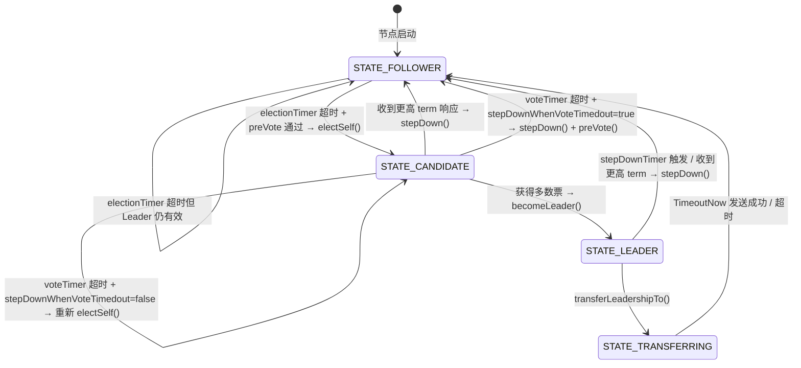
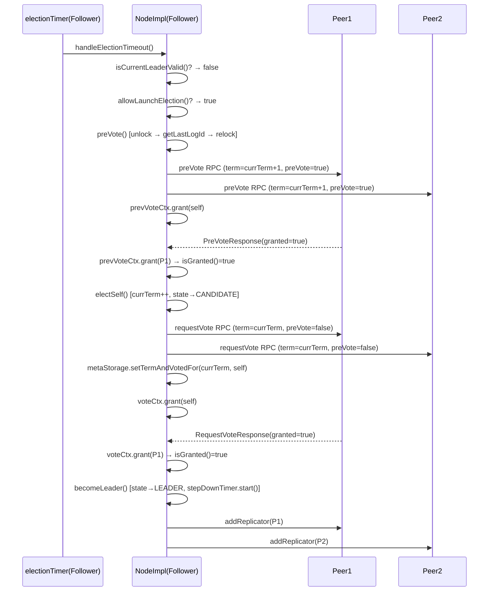

# 03 - Leader 选举：深度精读

## 学习目标

深入理解 JRaft 的选举机制，包括 PreVote（预投票）、RequestVote（正式投票）、选举优先级、以及 Leader Transfer（主动转让）。

---

## 一、问题驱动：选举要解决什么问题？

### 【问题】

Raft 集群中，当 Follower 长时间收不到 Leader 的心跳时，需要发起选举产生新 Leader。但这里有几个核心挑战：

1. **如何防止"无效选举"污染 term？** 网络分区恢复后，被隔离节点的 term 已经很大，重新加入时会强制触发不必要的选举。
2. **如何保证新 Leader 的日志是最新的？** 不能让日志落后的节点当选 Leader，否则会丢数据。
3. **如何防止多个节点同时发起选举导致选票分裂？** 需要随机化超时时间。
4. **如何保证"同一 term 只投一票"的不变式？** 需要持久化 votedFor。
5. **如何支持优先级选举？** 让高优先级节点优先成为 Leader。

### 【需要什么信息】

要解决上述问题，节点需要维护：
- 当前 term（`currTerm`）—— 判断消息新旧
- 当前投票给谁（`votedId`）—— 保证同 term 只投一票
- 当前 Leader 是谁（`leaderId`）—— 判断 Leader 是否活跃
- 当前节点状态（`state`）—— FOLLOWER / CANDIDATE / LEADER
- 上次收到 Leader 消息的时间戳（`lastLeaderTimestamp`）—— 判断 Leader 是否超时
- 预投票计数器（`prevVoteCtx`）和正式投票计数器（`voteCtx`）—— 统计是否获得多数票
- 选举定时器（`electionTimer`）、投票定时器（`voteTimer`）、stepDown 定时器（`stepDownTimer`）

### 【推导出的结构】

由此推导出 `NodeImpl` 需要维护一个"选举状态机"，核心字段如下：

---

## 二、核心数据结构

### 2.1 NodeImpl 选举相关字段（源码验证）

```java
// NodeImpl.java 第 168-230 行

/** 节点状态（volatile 保证可见性） */
private volatile State state;

/** 当前 term（在 writeLock 保护下修改） */
private long currTerm;

/** 上次收到 Leader 消息的时间戳（volatile，用于 isCurrentLeaderValid() 判断） */
private volatile long lastLeaderTimestamp;

/** 当前 Leader 的 PeerId */
private PeerId leaderId = new PeerId();

/** 本轮已投票给谁（持久化到 metaStorage） */
private PeerId votedId;

/** 正式投票计数器 */
private final Ballot voteCtx = new Ballot();

/** 预投票计数器 */
private final Ballot prevVoteCtx = new Ballot();

/** 选举超时定时器（触发 handleElectionTimeout） */
private RepeatedTimer electionTimer;

/** 投票超时定时器（触发 handleVoteTimeout） */
private RepeatedTimer voteTimer;

/** Leader stepDown 检测定时器（触发 handleStepDownTimeout） */
private RepeatedTimer stepDownTimer;

/** Leader Transfer 时唤醒的候选人 */
private ThreadId wakingCandidate;

/** 选举优先级目标值（集群中最高优先级） */
private volatile int targetPriority;

/** 当前节点连续选举超时次数（用于优先级衰减） */
private volatile int electionTimeoutCounter;
```

**字段存在的理由：**
- `lastLeaderTimestamp` 是 `volatile` 而非锁保护：因为它只需要可见性，不需要原子性，读写都是单次操作
- `voteCtx` 和 `prevVoteCtx` 分开：PreVote 和 RequestVote 是两个独立的投票轮次，不能混用
- `targetPriority` 是 `volatile`：`decayTargetPriority()` 可能在定时器线程中修改，需要可见性

### 2.2 State 枚举（源码验证）

```java
// State.java 第 26-38 行
public enum State {
    STATE_LEADER,        // 是 Leader
    STATE_TRANSFERRING,  // 正在转让 Leadership
    STATE_CANDIDATE,     // 是候选人
    STATE_FOLLOWER,      // 是 Follower
    STATE_ERROR,         // 出错
    STATE_UNINITIALIZED, // 未初始化
    STATE_SHUTTING,      // 正在关闭
    STATE_SHUTDOWN,      // 已关闭
    STATE_END;           // 状态结束标记

    public boolean isActive() {
        return this.ordinal() < STATE_ERROR.ordinal();
    }
}
```

**关键设计**：`isActive()` 用 `ordinal()` 比较，`STATE_LEADER`、`STATE_TRANSFERRING`、`STATE_CANDIDATE`、`STATE_FOLLOWER` 的 ordinal 都 < `STATE_ERROR`，所以这 4 个状态都是 active 的。

### 2.3 Ballot 投票计数器（源码验证）

```java
// Ballot.java 核心字段
private final List<UnfoundPeerId> peers;    // 当前配置的节点列表
private int quorum;                          // 还需要多少票才能获胜（初始 = peers.size()/2+1）
private final List<UnfoundPeerId> oldPeers; // 联合共识时旧配置的节点列表
private int oldQuorum;                       // 旧配置还需要多少票
```

**Quorum 计算**（源码 `init()` 方法）：
```java
this.quorum = this.peers.size() / 2 + 1;
this.oldQuorum = this.oldPeers.size() / 2 + 1;
```

**`grant()` 逻辑**：每收到一票，对应节点的 `found` 标记置为 `true`，`quorum--`。

**`isGranted()` 逻辑**：
```java
public boolean isGranted() {
    return this.quorum <= 0 && this.oldQuorum <= 0;
}
```

**联合共识支持**：在配置变更期间，需要同时获得新旧两个配置的多数票，`isGranted()` 要求 `quorum <= 0 && oldQuorum <= 0`。

---

## 三、选举完整流程

### 3.1 整体状态机



### 3.2 完整选举时序图



---

## 四、关键方法逐行分析

### 4.1 handleElectionTimeout()（选举超时入口）

```java
// NodeImpl.java 第 620-651 行
private void handleElectionTimeout() {
    // ① 快速路径：不加锁先判断（减少锁竞争）
    if (this.state != State.STATE_FOLLOWER) {
        return;
    }
    if (isCurrentLeaderValid()) {  // monotonicMs() - lastLeaderTimestamp < electionTimeoutMs
        return;
    }
    boolean doUnlock = true;
    this.writeLock.lock();
    try {
        // ② 加锁后再次检查（防止竞态）
        if (this.state != State.STATE_FOLLOWER) {
            return;
        }
        if (isCurrentLeaderValid()) {
            return;
        }
        // ③ 重置 leaderId（触发 onStopFollowing 回调）
        resetLeaderId(PeerId.emptyPeer(), new Status(RaftError.ERAFTTIMEDOUT, ...));

        // ④ 优先级过滤：低优先级节点可能跳过本轮选举
        if (!allowLaunchElection()) {
            return;
        }

        doUnlock = false;
        preVote();  // ⑤ 发起预投票（preVote 内部会 unlock）
    } finally {
        if (doUnlock) {
            this.writeLock.unlock();
        }
    }
}
```

**关键设计**：`doUnlock` 标志位控制 unlock 时机。`preVote()` 内部会 unlock，所以调用 `preVote()` 前设 `doUnlock=false`，避免 finally 块重复 unlock。

**`isCurrentLeaderValid()` 实现**：
```java
private boolean isCurrentLeaderValid() {
    return Utils.monotonicMs() - this.lastLeaderTimestamp < this.options.getElectionTimeoutMs();
}
```
使用**单调时钟**（`monotonicMs()`），不受系统时钟调整影响。

### 4.2 allowLaunchElection()（选举优先级过滤）

```java
// NodeImpl.java 第 662-697 行
private boolean allowLaunchElection() {
    // priority=0：永不参与选举
    if (this.serverId.isPriorityNotElected()) {
        return false;
    }
    // priority=-1（DISABLED）：禁用优先级，直接参与
    if (this.serverId.isPriorityDisabled()) {
        return true;
    }
    // 当前节点优先级 < 目标优先级：跳过本轮，等待高优先级节点先选
    if (this.serverId.getPriority() < this.targetPriority) {
        this.electionTimeoutCounter++;
        // 连续超时 2 次还没选出 Leader → 衰减 targetPriority
        if (this.electionTimeoutCounter > 1) {
            decayTargetPriority();
            this.electionTimeoutCounter = 0;
        }
        if (this.electionTimeoutCounter == 1) {
            return false;  // 第一次超时：跳过
        }
    }
    return this.serverId.getPriority() >= this.targetPriority;
}
```

**优先级衰减**（`decayTargetPriority()`）：
```java
private void decayTargetPriority() {
    final int decayPriorityGap = Math.max(this.options.getDecayPriorityGap(), 10);
    final int gap = Math.max(decayPriorityGap, (this.targetPriority / 5));
    this.targetPriority = Math.max(ElectionPriority.MinValue, (this.targetPriority - gap));
}
```
每次衰减至少 `max(decayPriorityGap, targetPriority/5)`，防止高优先级节点长期不可用时集群无法选出 Leader。

### 4.3 preVote()（预投票）

```java
// NodeImpl.java 第 2709-2770 行
private void preVote() {
    long oldTerm;
    try {
        // ① 快照安装中：配置可能不准确，跳过
        if (this.snapshotExecutor != null && this.snapshotExecutor.isInstallingSnapshot()) {
            return;
        }
        // ② 自己不在配置中：跳过
        if (!this.conf.contains(this.serverId)) {
            return;
        }
        oldTerm = this.currTerm;
    } finally {
        this.writeLock.unlock();  // ③ 先 unlock，再获取 lastLogId（避免持锁做 IO）
    }

    // ④ 在锁外获取 lastLogId（可能涉及磁盘 IO）
    final LogId lastLogId = this.logManager.getLastLogId(true);

    this.writeLock.lock();
    try {
        // ⑤ ABA 防御：unlock 期间 term 可能已变化
        if (oldTerm != this.currTerm) {
            return;
        }
        this.prevVoteCtx.init(this.conf.getConf(), ...);
        for (final PeerId peer : this.conf.listPeers()) {
            if (peer.equals(this.serverId)) continue;
            // ⑥ 构造 preVote 请求：term=currTerm+1（不真正增加 term）
            final OnPreVoteRpcDone done = new OnPreVoteRpcDone(peer, this.currTerm);
            done.request = RequestVoteRequest.newBuilder()
                .setPreVote(true)          // 标记为 preVote
                .setTerm(this.currTerm + 1) // 用 term+1 探测，但不持久化
                .setLastLogIndex(lastLogId.getIndex())
                .setLastLogTerm(lastLogId.getTerm())
                .build();
            this.rpcService.preVote(peer.getEndpoint(), done.request, done);
        }
        // ⑦ 先给自己投票
        this.prevVoteCtx.grant(this.serverId);
        if (this.prevVoteCtx.isGranted()) {
            // 单节点集群：直接进入 electSelf
            doUnlock = false;
            electSelf();
        }
    } finally {
        if (doUnlock) this.writeLock.unlock();
    }
}
```

**为什么 preVote 的 term 用 `currTerm+1`？**

让对方节点用"如果我发起正式选举，term 会是多少"来判断是否应该授权，而不是用当前 term。这样对方节点可以正确判断：如果我的 term 已经 >= currTerm+1，说明集群已经有更新的 Leader，不应该授权。

**ABA 防御模式**（preVote 和 electSelf 都有）：

```
unlock → getLastLogId（IO）→ relock → if (oldTerm != currTerm) return
```

在 unlock 期间，其他线程可能已经修改了 `currTerm`（例如收到了更高 term 的消息），此时 `lastLogId` 是基于旧 term 获取的，不能继续使用。

### 4.4 handlePreVoteRequest()（处理预投票请求）

```java
// NodeImpl.java 第 1701-1765 行
public Message handlePreVoteRequest(final RequestVoteRequest request) {
    // 使用 do-while(false) 模拟 goto，方便 break 跳出
    do {
        // ① 候选人不在配置中：拒绝
        if (!this.conf.contains(candidateId)) { break; }

        // ② 当前 Leader 仍有效：拒绝（这是 PreVote 的核心防护）
        if (this.leaderId != null && !this.leaderId.isEmpty() && isCurrentLeaderValid()) {
            break;
        }

        // ③ 请求 term < currTerm：拒绝（对方 term 太旧）
        if (request.getTerm() < this.currTerm) {
            checkReplicator(candidateId);  // 如果自己是 Leader，检查 replicator 是否正常
            break;
        }
        // term >= currTerm：无论是否最终授权，都检查 replicator（防止 replicator 未启动）
        checkReplicator(candidateId);

        // ④ 在锁外获取 lastLogId（unlock→IO→relock 模式，注意此处没有像 preVote/electSelf 那样做 oldTerm!=currTerm 的 ABA 检查）
        doUnlock = false;
        this.writeLock.unlock();
        final LogId lastLogId = this.logManager.getLastLogId(true);
        doUnlock = true;
        this.writeLock.lock();

        // ⑤ 日志新旧比较：候选人日志 >= 自己才授权
        final LogId requestLastLogId = new LogId(request.getLastLogIndex(), request.getLastLogTerm());
        granted = requestLastLogId.compareTo(lastLogId) >= 0;
    } while (false);

    return RequestVoteResponse.newBuilder()
        .setTerm(this.currTerm)
        .setGranted(granted)
        .build();
}
```

**PreVote 拒绝条件完整枚举**（源码验证）：

| 条件 | 拒绝原因 |
|------|---------|
| 节点非 active 状态 | 返回 EINVAL 错误 |
| candidateId 格式错误 | 返回 EINVAL 错误 |
| candidateId 不在 conf 中 | 不在集群配置里，不授权 |
| 当前 Leader 仍有效 | Leader 活跃，不需要选举 |
| request.term < currTerm | 对方 term 太旧 |
| 候选人日志比自己旧 | 日志不够新，不授权 |

### 4.5 electSelf()（正式发起选举）

```java
// NodeImpl.java 第 1163-1230 行
private void electSelf() {
    long oldTerm;
    try {
        // ① 前置检查：自己必须在 conf 中（配置变更期间可能已被移除）
        if (!this.conf.contains(this.serverId)) {
            return;
        }
        // ② 停止 electionTimer（已经是 CANDIDATE，不再需要）
        if (this.state == State.STATE_FOLLOWER) {
            this.electionTimer.stop();
        }
        // ③ 重置 leaderId（触发 onStopFollowing 回调）
        resetLeaderId(PeerId.emptyPeer(), ...);
        // ④ 状态变更：FOLLOWER → CANDIDATE
        this.state = State.STATE_CANDIDATE;
        // ⑤ term++（正式增加 term，但还未持久化）
        this.currTerm++;
        // ⑥ 先给自己投票（内存中）
        this.votedId = this.serverId.copy();
        // ⑦ 启动 voteTimer（防止投票超时）
        this.voteTimer.start();
        this.voteCtx.init(this.conf.getConf(), ...);
        oldTerm = this.currTerm;
    } finally {
        this.writeLock.unlock();  // unlock 去获取 lastLogId
    }

    final LogId lastLogId = this.logManager.getLastLogId(true);

    this.writeLock.lock();
    try {
        // ABA 防御
        if (oldTerm != this.currTerm) { return; }

        for (final PeerId peer : this.conf.listPeers()) {
            // 向所有 peer 发送 RequestVote RPC
            done.request = RequestVoteRequest.newBuilder()
                .setPreVote(false)          // 正式投票
                .setTerm(this.currTerm)     // 用真实 term
                .setLastLogIndex(lastLogId.getIndex())
                .setLastLogTerm(lastLogId.getTerm())
                .build();
            this.rpcService.requestVote(peer.getEndpoint(), done.request, done);
        }

        // ⑦ 持久化 term 和 votedFor（崩溃恢复后不会重复投票）
        this.metaStorage.setTermAndVotedFor(this.currTerm, this.serverId);
        this.voteCtx.grant(this.serverId);
        if (this.voteCtx.isGranted()) {
            // 单节点集群：直接成为 Leader
            becomeLeader();
        }
    } finally {
        this.writeLock.unlock();
    }
}
```

**关键时序**：`currTerm++` 在内存中先做，`metaStorage.setTermAndVotedFor()` 在发完 RPC 后才持久化。这是因为持久化是同步 IO，放在锁内会阻塞，但 Raft 协议要求持久化后才能响应投票，所以这里的顺序是：先发 RPC（异步），再持久化，再给自己投票。

### 4.6 handleRequestVoteRequest()（处理正式投票请求）

```java
// NodeImpl.java 第 1802-1870 行
public Message handleRequestVoteRequest(final RequestVoteRequest request) {
    do {
        // ① term 检查
        if (request.getTerm() >= this.currTerm) {
            if (request.getTerm() > this.currTerm) {
                // 对方 term 更大：先 stepDown（更新自己的 term）
                stepDown(request.getTerm(), false, ...);
            }
        } else {
            // 对方 term 更小：直接拒绝
            break;
        }

        // ② 在锁外获取 lastLogId（ABA 防御）
        doUnlock = false;
        this.writeLock.unlock();
        final LogId lastLogId = this.logManager.getLastLogId(true);
        doUnlock = true;
        this.writeLock.lock();

        // ③ ABA 检查
        if (request.getTerm() != this.currTerm) { break; }

        // ④ 日志新旧 + 未投票：才授权
        final boolean logIsOk = new LogId(request.getLastLogIndex(), request.getLastLogTerm())
            .compareTo(lastLogId) >= 0;

        if (logIsOk && (this.votedId == null || this.votedId.isEmpty())) {
            // stepDown 重置 electionTimer，防止自己也发起选举
            stepDown(request.getTerm(), false, new Status(RaftError.EVOTEFORCANDIDATE, ...));
            this.votedId = candidateId.copy();
            this.metaStorage.setVotedFor(candidateId);  // 持久化 votedFor
        }
    } while (false);

    // ⑤ 返回：term 匹配 且 votedId == candidateId 才是 granted=true
    return RequestVoteResponse.newBuilder()
        .setTerm(this.currTerm)
        .setGranted(request.getTerm() == this.currTerm && candidateId.equals(this.votedId))
        .build();
}
```

**RequestVote 拒绝条件完整枚举**（源码验证）：

| 条件 | 拒绝原因 |
|------|---------|
| 节点非 active 状态 | 返回 EINVAL 错误 |
| candidateId 格式错误 | 返回 EINVAL 错误 |
| request.term < currTerm | 对方 term 太旧 |
| 候选人日志比自己旧 | 日志不够新 |
| 本轮已投票给其他人 | `votedId != null && votedId != candidateId` |

**为什么投票前要 `stepDown()`？**

投票给候选人时，调用 `stepDown()` 的目的是：重置 `electionTimer`（`stepDown` 内部会 `electionTimer.restart()`），防止自己也在同一 term 内发起选举，避免选票分裂。

### 4.7 handleRequestVoteResponse()（收到投票响应）

```java
// NodeImpl.java 第 2584-2617 行
public void handleRequestVoteResponse(final PeerId peerId, final long term, final RequestVoteResponse response) {
    this.writeLock.lock();
    try {
        // ① 状态检查：必须还是 CANDIDATE
        if (this.state != State.STATE_CANDIDATE) { return; }
        // ② stale term 检查：响应对应的 term 必须是当前 term
        if (term != this.currTerm) { return; }
        // ③ 对方 term 更大：stepDown
        if (response.getTerm() > this.currTerm) {
            stepDown(response.getTerm(), false, ...);
            return;
        }
        // ④ 统计票数
        if (response.getGranted()) {
            this.voteCtx.grant(peerId);
            if (this.voteCtx.isGranted()) {
                becomeLeader();
            }
        }
    } finally {
        this.writeLock.unlock();
    }
}
```

### 4.8 becomeLeader()（成为 Leader）

```java
// NodeImpl.java 第 1261-1300 行
private void becomeLeader() {
    // 前置断言：必须是 CANDIDATE 才能 becomeLeader
    Requires.requireTrue(this.state == State.STATE_CANDIDATE, "Illegal state: " + this.state);

    // ① 停止 voteTimer
    stopVoteTimer();
    // ② 状态变更：CANDIDATE → LEADER
    this.state = State.STATE_LEADER;
    this.leaderId = this.serverId.copy();
    this.replicatorGroup.resetTerm(this.currTerm);

    // ③ 为每个 Follower 启动 Replicator（日志复制器）
    for (final PeerId peer : this.conf.listPeers()) {
        if (peer.equals(this.serverId)) continue;
        this.replicatorGroup.addReplicator(peer);
    }
    // ④ 为 Learner 启动 Replicator
    for (final PeerId peer : this.conf.listLearners()) {
        this.replicatorGroup.addReplicator(peer, ReplicatorType.Learner);
    }

    // ⑤ 初始化 BallotBox（从 lastLogIndex+1 开始计票）
    this.ballotBox.resetPendingIndex(this.logManager.getLastLogIndex() + 1);

    // ⑥ 断言 confCtx 不在忙碌状态（配置变更未完成时不能成为 Leader）
    if (this.confCtx.isBusy()) {
        throw new IllegalStateException();
    }
    // ⑦ 提交一条空日志（Raft 要求 Leader 在当选后提交一条 no-op 日志）
    this.confCtx.flush(this.conf.getConf(), this.conf.getOldConf());

    // ⑧ 启动 stepDownTimer（定期检查 Leader 是否仍有多数派支持）
    this.stepDownTimer.start();
}
```

**为什么 Leader 当选后要提交 no-op 日志？**

Raft 论文要求：Leader 只能提交自己 term 内的日志（通过计数），不能直接提交前任 Leader 遗留的日志。提交一条当前 term 的 no-op 日志，可以间接提交所有之前 term 的日志。`confCtx.flush()` 在这里起到了 no-op 日志的作用。

### 4.9 stepDown()（降级）

```java
// NodeImpl.java 第 1301-1360 行
private void stepDown(final long term, final boolean wakeupCandidate, final Status status) {
    if (!this.state.isActive()) { return; }

    // ① 根据当前状态做清理
    if (this.state == State.STATE_CANDIDATE) {
        stopVoteTimer();
    } else if (this.state.compareTo(State.STATE_TRANSFERRING) <= 0) {
        // LEADER 或 TRANSFERRING
        stopStepDownTimer();
        this.ballotBox.clearPendingTasks();
        if (this.state == State.STATE_LEADER) {
            onLeaderStop(status);  // 通知 FSM Leader 停止
        }
    }

    // ② 重置 leaderId
    resetLeaderId(PeerId.emptyPeer(), status);

    // ③ 状态变更为 FOLLOWER
    this.state = State.STATE_FOLLOWER;
    this.confCtx.reset();
    updateLastLeaderTimestamp(Utils.monotonicMs());  // 重置时间戳，防止立即再次超时

    // ④ 中断快照下载
    if (this.snapshotExecutor != null) {
        this.snapshotExecutor.interruptDownloadingSnapshots(term);
    }

    // ⑤ 更新 term（如果 term 更大）并持久化
    if (term > this.currTerm) {
        this.currTerm = term;
        this.votedId = PeerId.emptyPeer();
        this.metaStorage.setTermAndVotedFor(term, this.votedId);
    }

    // ⑥ 处理 Leader Transfer 的 wakeupCandidate
    if (wakeupCandidate) {
        this.wakingCandidate = this.replicatorGroup.stopAllAndFindTheNextCandidate(this.conf);
        if (this.wakingCandidate != null) {
            Replicator.sendTimeoutNowAndStop(this.wakingCandidate, this.options.getElectionTimeoutMs());
        }
    } else {
        this.replicatorGroup.stopAll();
    }

    // ⑦ 清理正在进行的 Leader Transfer（取消 transferTimer，防止 stepDown 后继续触发）
    if (this.stopTransferArg != null) {
        if (this.transferTimer != null) {
            this.transferTimer.cancel(true);
        }
        this.stopTransferArg = null;
    }

    // ⑧ 重启 electionTimer（非 Learner 节点）
    if (!isLearner()) {
        this.electionTimer.restart();
    }
}
```

**`stepDown` 的 `wakeupCandidate` 参数**：仅在 Leader Transfer 场景下为 `true`，此时会找到日志最新的 Follower 发送 `TimeoutNow` 请求，让它立即发起选举（跳过 PreVote）。

---

## 五、定时器设计

### 5.1 electionTimer 和 voteTimer（选举/投票超时定时器）

```java
// NodeImpl.java 第 929-954 行
// voteTimer（第 929 行）：投票超时，触发 handleVoteTimeout()
this.voteTimer = new RepeatedTimer(name, this.options.getElectionTimeoutMs(), ...) {
    @Override
    protected void onTrigger() { handleVoteTimeout(); }

    @Override
    protected int adjustTimeout(final int timeoutMs) {
        return randomTimeout(timeoutMs);  // voteTimer 也有随机化
    }
};

// electionTimer（第 943 行）：选举超时，触发 handleElectionTimeout()
this.electionTimer = new RepeatedTimer(name, this.options.getElectionTimeoutMs(), ...) {
    @Override
    protected void onTrigger() { handleElectionTimeout(); }

    @Override
    protected int adjustTimeout(final int timeoutMs) {
        return randomTimeout(timeoutMs);  // 随机化超时时间
    }
};
```

**随机化实现**（`voteTimer` 和 `electionTimer` 共用同一个方法）：
```java
private int randomTimeout(final int timeoutMs) {
    return ThreadLocalRandom.current().nextInt(timeoutMs, timeoutMs + this.raftOptions.getMaxElectionDelayMs());
}
```

实际超时时间 = `[electionTimeoutMs, electionTimeoutMs + maxElectionDelayMs)` 之间的随机值。

**`handleVoteTimeout()` 的两种行为**（取决于 `raftOptions.isStepDownWhenVoteTimedout()`）：
```java
private void handleVoteTimeout() {
    this.writeLock.lock();
    if (this.state != State.STATE_CANDIDATE) {
        this.writeLock.unlock();
        return;
    }
    if (this.raftOptions.isStepDownWhenVoteTimedout()) {
        // 默认行为：先 stepDown 回 FOLLOWER，再重新 preVote
        stepDown(this.currTerm, false, ...);
        preVote();  // unlock in preVote
    } else {
        // 非默认：直接重新 electSelf（不经过 preVote）
        electSelf();  // unlock in electSelf
    }
}
```

### 5.2 stepDownTimer（Leader 健康检测定时器）

```java
// NodeImpl.java 第 957-965 行
this.stepDownTimer = new RepeatedTimer(name, this.options.getElectionTimeoutMs() >> 1, ...) {
    @Override
    protected void onTrigger() {
        handleStepDownTimeout();
    }
};
```

**间隔 = `electionTimeoutMs / 2`**：比选举超时快一倍，确保 Leader 能在 Follower 超时前检测到自己失去多数派支持。

---

## 六、核心不变式

1. **同一 term 内，一个节点只能投票给一个候选人**
   - 保证机制：`votedId` 持久化到 `metaStorage`，崩溃恢复后不会重复投票
   - 源码：`handleRequestVoteRequest()` 中 `this.votedId.isEmpty()` 检查 + `metaStorage.setVotedFor()`

2. **Leader 的日志一定不比任何获得多数票的节点旧**
   - 保证机制：投票条件要求候选人日志 >= 投票者日志（`requestLastLogId.compareTo(lastLogId) >= 0`）
   - 源码：`handlePreVoteRequest()` 和 `handleRequestVoteRequest()` 中的日志比较

3. **PreVote 不增加 term**
   - 保证机制：preVote 请求中 `term=currTerm+1` 只是探测值，不修改 `this.currTerm`，不持久化
   - 源码：`preVote()` 中 `setTerm(this.currTerm + 1)` 但没有 `this.currTerm++`

---

## 七、⑥ 运行验证结论

### 验证方式

在 `preVote()`、`electSelf()`、`becomeLeader()` 三个方法中临时添加 `System.out.println` 埋点，运行 `NodeTest#testTripleNodes` 和 `NodeTest#testNodesWithPriorityElection`，收集真实运行数据。

### 验证 1：正常选举流程（testTripleNodes）

```
[PROBE][preVote] JRaft-ElectionTimer-<unittest/9.134.79.63:5005>0
    getLastLogId done, oldTerm=0, lastLogId=LogId [index=0, term=0]
[PROBE][preVote] ABA check passed, oldTerm==currTerm=0, sending preVote to peers
[PROBE][electSelf] JRaft-RPC-Processor-0
    state→CANDIDATE, currTerm++→1, votedId=9.134.79.63:5005
[PROBE][electSelf] persist term=1, votedFor=9.134.79.63:5005 to metaStorage
[PROBE][becomeLeader] JRaft-RPC-Processor-2
    state→LEADER, term=1, stepDownTimer started
```

**结论验证**：
- ✅ `preVote` 由 `JRaft-ElectionTimer` 线程触发，`electSelf` 和 `becomeLeader` 由 `JRaft-RPC-Processor` 线程执行（收到投票响应后的回调）
- ✅ ABA 防御正常工作：`oldTerm==currTerm=0`，检查通过
- ✅ `currTerm++` 在 `electSelf` 中执行（term: 0→1）
- ✅ `metaStorage.setTermAndVotedFor()` 在发完 RPC 后、`voteCtx.grant(self)` 前执行
- ✅ `becomeLeader` 中 `stepDownTimer` 最后启动

### 验证 2：优先级选举（testNodesWithPriorityElection）

```
[PROBE][preVote] JRaft-ElectionTimer-<unittest/9.134.79.63:5003::100>0
    getLastLogId done, oldTerm=0, lastLogId=LogId [index=0, term=0]
[PROBE][preVote] ABA check passed, oldTerm==currTerm=0, sending preVote to peers
[PROBE][electSelf] JRaft-RPC-Processor-1
    state→CANDIDATE, currTerm++→1, votedId=9.134.79.63:5003::100
[PROBE][electSelf] persist term=1, votedFor=9.134.79.63:5003::100 to metaStorage
[PROBE][becomeLeader] JRaft-RPC-Processor-2
    state→LEADER, term=1, stepDownTimer started
```

**结论验证**：
- ✅ `priority=100` 的节点（5003端口）率先发起 preVote 并成为 Leader
- ✅ `priority=40` 的节点（5005端口）被 `allowLaunchElection()` 过滤，未发起 preVote
- ✅ Leader 的 PeerId 中包含优先级信息：`9.134.79.63:5003::100`

---

## 八、面试高频考点 📌

1. **PreVote 解决了什么问题？没有 PreVote 会怎样？**
   - 解决：网络分区恢复后，被隔离节点（term 已很大）重新加入时，会强制触发不必要的选举，破坏当前稳定的 Leader
   - 没有 PreVote：被隔离节点 term=100，重新加入后发送 RequestVote(term=100)，当前 Leader(term=5) 收到后必须 stepDown，集群短暂无 Leader

2. **为什么投票前要比较日志新旧？**
   - 保证 Leader Completeness 特性：已提交的日志不能丢失
   - 如果允许日志落后的节点当选，它可能覆盖已提交的日志

3. **选举超时为什么要随机化？**
   - 避免多个节点同时超时，同时发起选举，导致选票分裂（split vote），没有节点能获得多数票

4. **JRaft 的选举优先级是如何实现的？**
   - `allowLaunchElection()`：低优先级节点在 `serverId.priority < targetPriority` 时跳过本轮选举
   - `decayTargetPriority()`：如果高优先级节点长期不可用，`targetPriority` 指数衰减，最终允许低优先级节点参与

5. **`stepDown` 的 `wakeupCandidate` 参数什么时候为 true？**
   - 仅在 Leader Transfer 场景：`transferLeadershipTo()` 调用 `stepDown(currTerm, true, ...)`，找到日志最新的 Follower 发送 `TimeoutNow`，让它立即发起选举

6. **为什么 `handleRequestVoteRequest` 中投票前要先 `stepDown`？**
   - `stepDown` 内部会 `electionTimer.restart()`，重置自己的选举超时，防止自己也在同一 term 内发起选举

---

## 九、生产踩坑 ⚠️

1. **时钟漂移导致选举超时不准确**
   - `isCurrentLeaderValid()` 使用 `Utils.monotonicMs()`（单调时钟），不受 NTP 调整影响
   - 但 `RepeatedTimer` 底层使用 `HashedWheelTimer`，在 GC STW 期间可能延迟触发

2. **网络分区恢复后双 Leader 短暂共存**
   - 旧 Leader 的 `stepDownTimer` 检测到失去多数派支持后才 stepDown
   - 在 `stepDownTimer` 触发前（最多 `electionTimeoutMs/2`），旧 Leader 仍会接受写请求，但这些请求无法提交（无法获得多数派 ACK）

3. **`transferLeadershipTo()` 超时后旧 Leader 不会自动 stepDown**
   - 需要业务层处理：检查 `transferTimer` 超时后主动调用 `stepDown`
   - 源码中 `stopTransferArg` 超时后只是取消 transfer，不会强制 stepDown

4. **优先级选举在网络不稳定时可能导致频繁重选**
   - `targetPriority` 衰减后，低优先级节点参与选举，可能当选
   - 高优先级节点恢复后，`targetPriority` 重置为最高值，但不会主动触发重选
