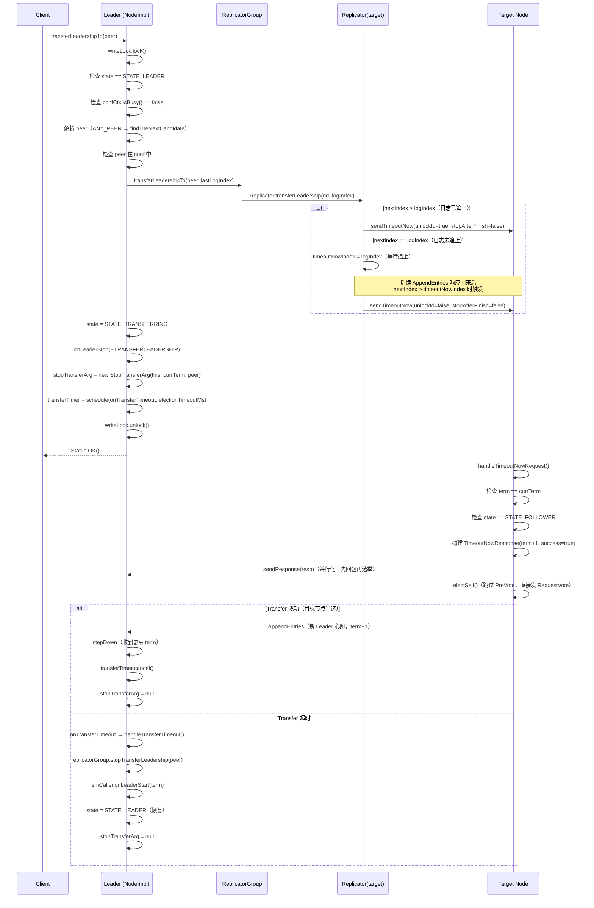
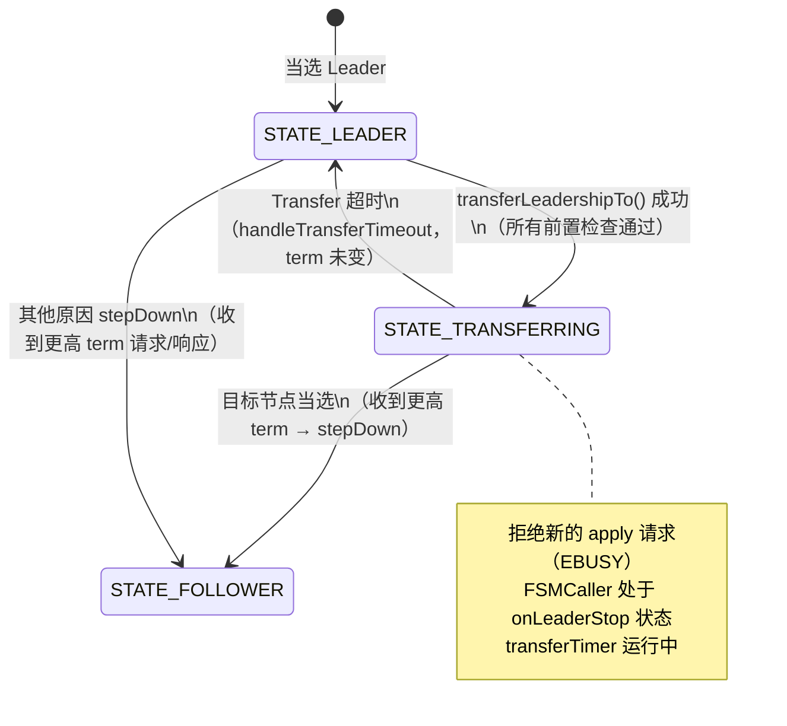
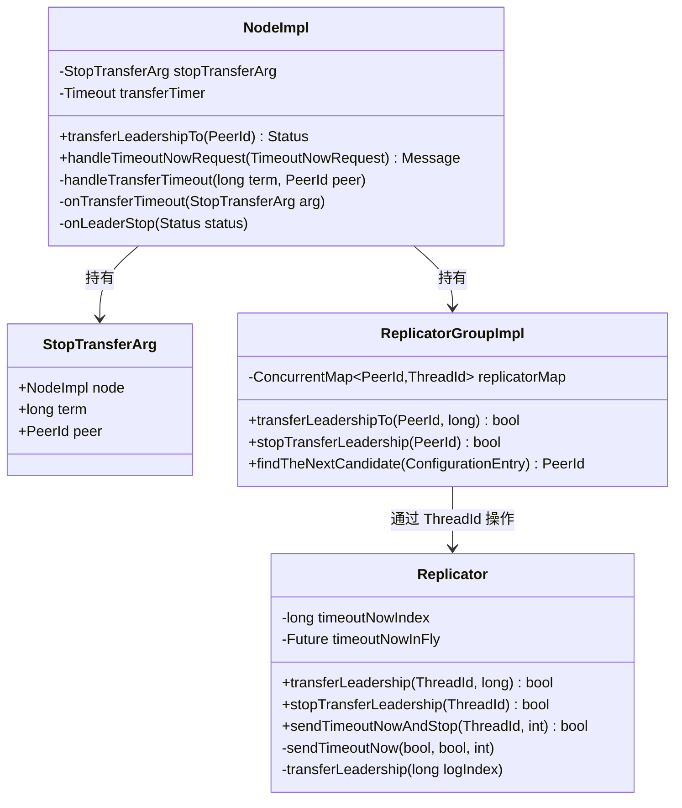

# S4：Transfer Leadership 完整流程

> 归属：`03-leader-election/`
> 核心源码：`NodeImpl.java:3235`、`NodeImpl.java:3310`、`Replicator.java:1735`、`ReplicatorGroupImpl.java:261`

---

## 1. 问题推导

### 【问题】为什么需要 Transfer Leadership？

直接 `stepDown` 让集群重新选举**不行**，原因有两个：

1. **不可控**：stepDown 后谁当选 Leader 完全随机，无法保证目标节点当选
2. **有选举风暴**：所有 Follower 同时超时，可能出现多轮选举失败

**Transfer Leadership 的设计思路**：

```
Leader 停止接受新写入
    → 等目标节点日志追上 Leader
    → 发送 TimeoutNow 消息
    → 目标节点跳过 PreVote，立即发起选举
    → 目标节点以极高概率当选（日志最新 + 立即选举）
```

### 【需要什么信息】

| 需要解决的问题 | 需要的信息 |
|---|---|
| 目标节点是谁？ | `PeerId peer` |
| 超时后如何恢复？ | `term`（防止 term 变化后的误操作）+ `peer` |
| 如何取消超时定时器？ | `Timeout transferTimer` 句柄 |
| 如何通知 Replicator 等日志追上？ | `timeoutNowIndex`（目标 nextIndex 阈值）|

---

## 2. 核心数据结构

### 2.1 StopTransferArg（`NodeImpl.java:2951`）

```java
private static class StopTransferArg {
    final NodeImpl node;   // 节点引用（用于回调）
    final long     term;   // 发起 Transfer 时的 term（防止 term 变化后误操作）
    final PeerId   peer;   // 目标节点
}
```

**为什么需要 `term` 字段？**

超时回调 `handleTransferTimeout` 中会检查 `term == this.currTerm`（`NodeImpl.java:2963`）。

### 2.2 NodeImpl 中的 Transfer 相关字段

```java
// NodeImpl.java:184
private StopTransferArg stopTransferArg;   // 超时恢复参数，非 null 表示正在 Transfer
// NodeImpl.java:210
private ScheduledFuture<?> transferTimer;  // 超时定时器句柄（用于取消）
```

### 2.3 Replicator 中的 Transfer 相关字段（`Replicator.java:95`）

```java
private long timeoutNowIndex;   // 目标 nextIndex 阈值：nextIndex 超过此值时立即发 TimeoutNow
```

**为什么需要 `timeoutNowIndex`？**

目标节点日志可能落后 Leader。`transferLeadership(logIndex)` 调用时，如果 `nextIndex <= logIndex`（日志还没追上），不能立即发 TimeoutNow，而是记录 `timeoutNowIndex = logIndex`，等后续 AppendEntries 响应回来、`nextIndex` 超过阈值时再触发。

---

## 3. 完整时序图



---

## 4. `transferLeadershipTo()` 逐行分析（`NodeImpl.java:3235`）

### 4.1 分支穷举清单（前置）

| # | 条件 | 结果 |
|---|---|---|
| ① | `state != STATE_LEADER` 且 `state == STATE_TRANSFERRING` | 返回 `EBUSY("Not a leader")` |
| ② | `state != STATE_LEADER` 且 `state != STATE_TRANSFERRING` | 返回 `EPERM("Not a leader")` |
| ③ | `confCtx.isBusy() == true` | 返回 `EBUSY("Changing the configuration")` |
| ④ | `peer == ANY_PEER` 且 `findTheNextCandidate == null` | 返回 `-1("Candidate not found for any peer")` |
| ⑤ | `peer == ANY_PEER` 且找到候选人 | `peerId` 替换为候选人，继续 |
| ⑥ | `peerId == serverId`（转给自己） | 返回 `Status.OK()`（no-op） |
| ⑦ | `peerId` 不在 `conf` 中 | 返回 `EINVAL("Not in current configuration")` |
| ⑧ | `replicatorGroup.transferLeadershipTo()` 返回 false（peer 无 Replicator） | 返回 `EINVAL("No such peer %s")` |
| ⑨ | 所有检查通过 | 设置 `STATE_TRANSFERRING`，启动超时定时器，返回 `Status.OK()` |

### 4.2 核心执行路径（分支 ⑨）

```java
// NodeImpl.java:3284
final long lastLogIndex = this.logManager.getLastLogIndex();
if (!this.replicatorGroup.transferLeadershipTo(peerId, lastLogIndex)) {
    // 分支 ⑧：peer 对应的 Replicator 不存在
    return new Status(RaftError.EINVAL, "No such peer %s", peer);
}

// 切换状态：STATE_LEADER → STATE_TRANSFERRING
this.state = State.STATE_TRANSFERRING;

// 通知 FSMCaller：Leader 停止接受新写入
// onLeaderStop 内部：
//   1. replicatorGroup.clearFailureReplicators()（清理失败的 Replicator）
//   2. fsmCaller.onLeaderStop(status)（通知状态机 Leader 停止）
final Status status = new Status(RaftError.ETRANSFERLEADERSHIP,
    "Raft leader is transferring leadership to %s", peerId);
onLeaderStop(status);   // NodeImpl.java:3302

// 创建超时恢复参数
final StopTransferArg stopArg = new StopTransferArg(this, this.currTerm, peerId);
this.stopTransferArg = stopArg;

// 启动超时定时器（超时时间 = electionTimeoutMs）
this.transferTimer = this.timerManager.schedule(
    () -> onTransferTimeout(stopArg),
    this.options.getElectionTimeoutMs(),
    TimeUnit.MILLISECONDS
);
```

**关键设计点**：`onLeaderStop` 调用后，`FSMCaller` 会拒绝新的 `onApply` 请求。而 `LogEntryAndClosureHandler`（Disruptor 处理器）在 `state == STATE_TRANSFERRING` 时会对新的 `apply` 请求返回 `EBUSY`（`NodeImpl.java:1411`）。

---

## 5. `ReplicatorGroup.transferLeadershipTo()` 调用链

### 5.1 ReplicatorGroupImpl（`ReplicatorGroupImpl.java:242`）

```java
@Override
public boolean transferLeadershipTo(final PeerId peer, final long logIndex) {
    final ThreadId rid = this.replicatorMap.get(peer);
    return rid != null && Replicator.transferLeadership(rid, logIndex);
}
```

- `rid == null`：目标 peer 没有对应的 Replicator → 返回 false → `transferLeadershipTo` 返回 `EINVAL`

### 5.2 `Replicator.transferLeadership()`（`Replicator.java:1847`）

```java
public static boolean transferLeadership(final ThreadId id, final long logIndex) {
    final Replicator r = (Replicator) id.lock();
    if (r == null) {
        return false;
    }
    // dummy is unlock in _transfer_leadership
    return r.transferLeadership(logIndex);
}

private boolean transferLeadership(final long logIndex) {
    if (this.hasSucceeded && this.nextIndex > logIndex) {
        // 日志已追上：立即发 TimeoutNow
        // _id is unlock in _send_timeout_now
        sendTimeoutNow(true, false);
        return true;
    }
    // 日志未追上：记录阈值，等待 AppendEntries 响应后触发
    this.timeoutNowIndex = logIndex;
    unlockId();
    return true;
}
```

**两条路径**：

| 条件 | 路径 |
|---|---|
| `hasSucceeded && nextIndex > logIndex`（日志已追上） | 立即调用 `sendTimeoutNow(true, false)` |
| 否则（日志未追上） | 设置 `timeoutNowIndex = logIndex`，等待 |

### 5.3 日志追上后的触发（`Replicator.java:755` 和 `1548`）

`timeoutNowIndex` 在两处成功路径中被检查：

```java
// Replicator.java:755（onInstallSnapshotReturned 成功路径）
// 快照安装成功后，nextIndex 跳跃到 lastIncludedIndex+1，可能直接超过阈值
r.hasSucceeded = true;
r.notifyOnCaughtUp(RaftError.SUCCESS.getNumber(), false);
if (r.timeoutNowIndex > 0 && r.timeoutNowIndex < r.nextIndex) {
    r.sendTimeoutNow(false, false);   // 日志追上，触发 TimeoutNow
}

// Replicator.java:1548（onAppendEntriesReturned 成功路径）
// AppendEntries 成功后 nextIndex 推进，逐步追上阈值
r.nextIndex += entriesSize;
r.hasSucceeded = true;
r.notifyOnCaughtUp(RaftError.SUCCESS.getNumber(), false);
if (r.timeoutNowIndex > 0 && r.timeoutNowIndex < r.nextIndex) {
    r.sendTimeoutNow(false, false);
}
```

**注意**：两处触发条件均为 `timeoutNowIndex > 0 && timeoutNowIndex < nextIndex`（严格小于，即 nextIndex 已超过阈值）。

---

## 6. `sendTimeoutNow()` 详解（`Replicator.java:1735`）

```java
private void sendTimeoutNow(final boolean unlockId, final boolean stopAfterFinish) {
    sendTimeoutNow(unlockId, stopAfterFinish, -1);
}

private void sendTimeoutNow(final boolean unlockId, final boolean stopAfterFinish, final int timeoutMs) {
    final TimeoutNowRequest.Builder rb = TimeoutNowRequest.newBuilder();
    rb.setTerm(this.options.getTerm());
    rb.setGroupId(this.options.getGroupId());
    rb.setServerId(this.options.getServerId().toString());
    rb.setPeerId(this.options.getPeerId().toString());
    try {
        if (!stopAfterFinish) {
            // Transfer Leadership 场景：保存 RPC Future，以便 stop 时取消
            this.timeoutNowInFly = timeoutNow(rb, false, timeoutMs);
            this.timeoutNowIndex = 0;   // 清零，防止重复触发
        } else {
            // stepDown 场景（wakeupCandidate）：发完即销毁 Replicator
            timeoutNow(rb, true, timeoutMs);
        }
    } finally {
        if (unlockId) {
            unlockId();
        }
    }
}
```

**两种调用场景对比**：

| 场景 | `stopAfterFinish` | 调用来源 |
|---|---|---|
| Transfer Leadership | `false` | `transferLeadershipTo()` |
| stepDown 时唤醒候选人 | `true` | `stepDown(wakeupCandidate=true)` |

### 6.1 `onTimeoutNowReturned` 响应处理（`Replicator.java:1779`）

| # | 条件 | 结果 |
|---|---|---|
| ① | `id.lock()` 返回 null（Replicator 已销毁） | 直接 return |
| ② | `status.isOk() == false`（RPC 失败）且 `stopAfterFinish == true` | 通知 ERROR 事件 + `notifyOnCaughtUp(ESTOP)` + `destroy()` |
| ③ | `status.isOk() == false`（RPC 失败）且 `stopAfterFinish == false` | 通知 ERROR 事件 + `id.unlock()` |
| ④ | `response.getTerm() > r.options.getTerm()`（目标 term 更高） | `notifyOnCaughtUp(EPERM)` + `destroy()` + `node.increaseTermTo()` 触发 stepDown |
| ⑤ | 正常响应且 `stopAfterFinish == true`（stepDown 场景） | `notifyOnCaughtUp(ESTOP)` + `destroy()` |
| ⑥ | 正常响应且 `stopAfterFinish == false`（Transfer 场景） | `id.unlock()`，等待目标节点选举结果 |

---

## 7. `handleTimeoutNowRequest()` 逐行分析（`NodeImpl.java:3310`）

### 7.1 分支穷举清单（前置）

| # | 条件 | 结果 |
|---|---|---|
| ① | `request.getTerm() != currTerm` 且 `request.getTerm() > currTerm` | 先 `stepDown(request.getTerm(), false, EHIGHERTERMREQUEST)`，再返回 `success=false`（注意：stepDown 后 currTerm 已更新，响应中的 term 是新 term） |
| ② | `request.getTerm() != currTerm` 且 `request.getTerm() < currTerm` | 直接返回 `success=false`（term 不匹配，stale 请求） |
| ③ | `request.getTerm() == currTerm` 且 `state != STATE_FOLLOWER` | 返回 `success=false`（非 Follower 不处理，如 Candidate/Leader） |
| ④ | `request.getTerm() == currTerm` 且 `state == STATE_FOLLOWER` | 先 `done.sendResponse(success=true)`，再 `electSelf()`，方法返回 `null` |

### 7.2 核心执行路径（分支 ④）

```java
// NodeImpl.java:3336
final long savedTerm = this.currTerm;
final TimeoutNowResponse resp = TimeoutNowResponse.newBuilder()
    .setTerm(this.currTerm + 1)   // 预告下一个 term
    .setSuccess(true)
    .build();

// 关键设计：并行化响应和选举
// 先发响应，再调用 electSelf()
// electSelf() 内部会调用 writeLock.unlock()，所以 doUnlock = false
done.sendResponse(resp);
doUnlock = false;
electSelf();   // 跳过 PreVote，直接发 RequestVote
// 注意：成功路径方法返回 null（响应已通过 done.sendResponse 发出）
// finally 块：if (doUnlock) { writeLock.unlock(); }（doUnlock=false，由 electSelf 内部 unlock）
```

### 7.3 为什么可以跳过 PreVote？📌

PreVote 的目的是**防止网络分区节点重新加入时破坏集群**（分区节点 term 很高，会导致 Leader stepDown）。

Transfer Leadership 场景下：
1. **Leader 主动发起**：Leader 已经确认目标节点日志追上，且 Leader 自己处于 `STATE_TRANSFERRING`（不会拒绝 RequestVote）
2. **term 一致**：`TimeoutNowRequest` 携带的 term 与目标节点 currTerm 相同，说明目标节点没有网络分区
3. **时效性**：Transfer 有超时机制，不会无限等待

因此，跳过 PreVote 是安全的，且能加快 Transfer 速度（少一轮 RPC）。

---

## 8. 超时处理（`NodeImpl.java:2963`）

### 8.1 `onTransferTimeout` → `handleTransferTimeout`

```java
private void onTransferTimeout(final StopTransferArg arg) {
    arg.node.handleTransferTimeout(arg.term, arg.peer);
}

private void handleTransferTimeout(final long term, final PeerId peer) {
    LOG.info("Node {} failed to transfer leadership to peer {}, reached timeout.", getNodeId(), peer);
    this.writeLock.lock();
    try {
        if (term == this.currTerm) {   // 防止 term 变化后的误操作
            this.replicatorGroup.stopTransferLeadership(peer);   // 清零 timeoutNowIndex
            if (this.state == State.STATE_TRANSFERRING) {
                this.fsmCaller.onLeaderStart(term);   // 恢复 FSMCaller 的 Leader 状态
                this.state = State.STATE_LEADER;       // 恢复 Leader 状态
                this.stopTransferArg = null;
            }
        }
    } finally {
        this.writeLock.unlock();
    }
}
```

### 8.2 分支穷举清单

| # | 条件 | 结果 |
|---|---|---|
| ① | `term != this.currTerm`（term 已变化） | 什么都不做（节点已 stepDown，`stopTransferArg` 已在 stepDown 中清空）；finally: `writeLock.unlock()` |
| ② | `term == this.currTerm` 且 `state != STATE_TRANSFERRING` | 调用 `stopTransferLeadership` 清零 `timeoutNowIndex`，但不恢复 Leader 状态，`stopTransferArg` **不清空**（实际上此分支极少触发，因为 stepDown 时已清空）；finally: `writeLock.unlock()` |
| ③ | `term == this.currTerm` 且 `state == STATE_TRANSFERRING` | 完整恢复：`stopTransferLeadership` + `onLeaderStart` + `state = STATE_LEADER` + `stopTransferArg = null`；finally: `writeLock.unlock()` |

### 8.3 `stopTransferLeadership` 的作用（`ReplicatorGroupImpl.java:248`）

```java
@Override
public boolean stopTransferLeadership(final PeerId peer) {
    final ThreadId rid = this.replicatorMap.get(peer);
    return rid != null && Replicator.stopTransferLeadership(rid);
}

// Replicator.java:1870
public static boolean stopTransferLeadership(final ThreadId id) {
    final Replicator r = (Replicator) id.lock();
    if (r == null) { return false; }
    r.timeoutNowIndex = 0;   // 清零，防止后续 AppendEntries 响应再次触发 TimeoutNow
    id.unlock();
    return true;
}
```

---

## 9. Transfer 期间拒绝 apply 的机制（`NodeImpl.java:1410`）

`LogEntryAndClosureHandler`（Disruptor 事件处理器）在批量处理 apply 任务时：

```java
// NodeImpl.java:1410
if (this.state != State.STATE_LEADER) {
    final Status st = new Status();
    if (this.state != State.STATE_TRANSFERRING) {
        st.setError(RaftError.EPERM, "Is not leader.");
    } else {
        st.setError(RaftError.EBUSY, "Is transferring leadership.");
    }
    // 对所有 pending 的 apply 任务回调 EBUSY
    for (final Closure done : dones) {
        done.run(st);
    }
    return;
}
```

**区分两种错误码**：
- `STATE_TRANSFERRING` → `EBUSY`（暂时不可用，可重试）
- 其他非 Leader 状态 → `EPERM`（权限错误，需要找新 Leader）

---

## 10. stepDown 中对 Transfer 的清理（`NodeImpl.java:1343`）

当节点因为收到更高 term 而 stepDown 时，会清理 Transfer 状态：

```java
// NodeImpl.java:1343（stepDown 方法内）
if (this.stopTransferArg != null) {
    if (this.transferTimer != null) {
        this.transferTimer.cancel(true);   // 取消超时定时器
    }
    // mark stopTransferArg to NULL
    this.stopTransferArg = null;
}
```

这保证了：如果目标节点成功当选并发来更高 term 的心跳，Leader 在 stepDown 时会自动清理 Transfer 状态，不会再触发超时恢复。

---

## 11. 状态机图



---

## 12. 对象关系图



---

## 13. 面试高频考点 📌

### Q1：Transfer Leadership 和 stepDown 有什么区别？

| 维度 | Transfer Leadership | stepDown |
|---|---|---|
| 目标 | 指定目标节点当选 | 放弃 Leader，谁当选随机 |
| 机制 | 等日志追上 → TimeoutNow → 目标立即选举 | 直接降为 Follower，等选举超时 |
| 可控性 | 高（可指定目标，可超时恢复） | 低 |
| 写入中断时间 | 短（目标节点立即选举，通常 < 1 个 RTT） | 长（需等选举超时，通常 1-2 个 electionTimeout）|
| 使用场景 | 滚动升级、负载均衡 | 发现更高 term、配置变更 |

### Q2：为什么目标节点可以跳过 PreVote？

PreVote 是为了防止**网络分区节点**重新加入时用高 term 破坏集群。Transfer Leadership 场景下：
1. Leader 主动发起，已确认目标节点日志追上
2. `TimeoutNowRequest` 携带的 term 与目标节点 currTerm 相同（无分区）
3. Leader 处于 `STATE_TRANSFERRING`，不会拒绝 RequestVote

因此跳过 PreVote 是安全的，且减少了一轮 RPC 延迟。

### Q3：Transfer 超时会发生什么？

1. `onTransferTimeout` 被触发（`NodeImpl.java:2981`）
2. 检查 `term == currTerm`（防止 term 变化后误操作）
3. 调用 `replicatorGroup.stopTransferLeadership(peer)` 清零 `timeoutNowIndex`
4. 恢复 `state = STATE_LEADER`，调用 `fsmCaller.onLeaderStart(term)`
5. 集群恢复正常写入

### Q4：Transfer 期间客户端写入会怎样？

`apply()` 请求进入 Disruptor 后，在 `LogEntryAndClosureHandler` 中检测到 `state == STATE_TRANSFERRING`，对所有 pending 任务回调 `EBUSY("Is transferring leadership.")`。客户端应该重试（通常重试到新 Leader 上）。

### Q5：`ANY_PEER` 是什么？如何选择候选人？

`PeerId.ANY_PEER`（`0.0.0.0:0:0`）表示"让系统自动选择最佳候选人"。`findTheNextCandidate()` 的选择策略（`ReplicatorGroupImpl.java:273`）：
1. 过滤掉不在 conf 中的 peer
2. 过滤掉 `priority == NotElected` 的 peer
3. 优先选 `nextIndex` 最大的（日志最新）
4. `nextIndex` 相同时，选 `priority` 最高的

---

## 14. 生产踩坑 ⚠️

### ⚠️ 踩坑 1：目标节点日志落后太多导致 Transfer 超时

**现象**：`transferLeadershipTo()` 返回 OK，但超时后 Leader 自动恢复，Transfer 失败。

**原因**：目标节点 `nextIndex` 远小于 `lastLogIndex`，在 `electionTimeoutMs` 内无法追上。

**解决**：
1. 先调用 `waitCaughtUp()` 等目标节点追上后再发起 Transfer
2. 或增大 `electionTimeoutMs`（不推荐，影响选举稳定性）
3. 或先做快照安装，再发起 Transfer

### ⚠️ 踩坑 2：Transfer 期间集群短暂不可写

**现象**：Transfer 发起后到新 Leader 选出前，所有写入返回 `EBUSY`。

**原因**：`STATE_TRANSFERRING` 期间 Leader 拒绝 apply，新 Leader 选出前集群无主。

**解决**：
1. 在业务低峰期执行 Transfer
2. 客户端实现重试逻辑（捕获 `EBUSY` 后等待并重试）
3. 使用 `ANY_PEER` 让系统选择日志最新的节点，缩短 Transfer 时间

### ⚠️ 踩坑 3：confCtx.isBusy() 导致 Transfer 失败

**现象**：正在进行成员变更（addPeer/removePeer）时，`transferLeadershipTo()` 返回 `EBUSY`。

**原因**：`NodeImpl.java:3246` 检查 `confCtx.isBusy()`，配置变更期间拒绝 Transfer。

**解决**：等待成员变更完成后再发起 Transfer。

### ⚠️ 踩坑 4：重复调用 transferLeadershipTo 返回 EBUSY

**现象**：第一次 Transfer 还未完成，再次调用返回 `EBUSY`。

**原因**：`NodeImpl.java:3239` 检查 `state == STATE_TRANSFERRING` 时返回 `EBUSY`。

**解决**：等待第一次 Transfer 完成（成功或超时恢复）后再重试。
