# 04 - 日志复制

## 学习目标

深入理解 JRaft 的日志复制机制，包括 `Replicator`（复制器）的工作原理、Pipeline 复制、批量发送、以及 `BallotBox` 的提交流程。

## 核心源码位置

| 类 | 路径 | 说明 |
|---|---|---|
| `Replicator` | `core/Replicator.java` | 单个 Follower 的复制器（73KB，核心类） |
| `ReplicatorGroup` | `ReplicatorGroup.java` | 复制组接口 |
| `ReplicatorGroupImpl` | `core/ReplicatorGroupImpl.java` | 复制组实现，管理所有 Replicator |
| `BallotBox` | `core/BallotBox.java` | 投票箱，负责日志提交的 quorum 计数 |
| `AppendEntriesRequestProcessor` | `rpc/impl/core/AppendEntriesRequestProcessor.java` | Follower 处理 AppendEntries |
| `NodeImpl.appendEntries()` | `core/NodeImpl.java` | Leader 接收客户端写请求入口 |
| `LogManager` | `storage/LogManager.java` | 日志管理接口 |

## 日志复制完整流程

```
Client
  │  apply(Task)
  ▼
NodeImpl.apply()
  │  1. 封装为 LogEntry（type=DATA）
  │  2. 追加到 LogManager（先写本地）
  │  3. 注册到 BallotBox（等待 quorum）
  ▼
LogManagerImpl.appendEntries()
  │  写入 RocksDB（异步 batch）
  │  通知 Replicator 有新日志
  ▼
Replicator.notifyOnNewLog()
  │  构造 AppendEntriesRequest
  │  Pipeline 发送给 Follower
  ▼
Follower: AppendEntriesRequestProcessor
  │  校验 prevLogIndex/prevLogTerm
  │  写入本地 LogStorage
  │  返回 AppendEntriesResponse
  ▼
Replicator.onAppendEntriesReturned()
  │  更新 nextIndex / matchIndex
  │  通知 BallotBox
  ▼
BallotBox.commitAt()
  │  quorum 达成 → 推进 committedIndex
  ▼
FSMCaller.onCommitted()
  │  回调用户 StateMachine.onApply()
  ▼
Closure.run(Status.OK)  ← 通知客户端成功
```

## Replicator 核心机制

### Pipeline 复制

JRaft 支持 Pipeline 模式（`RaftOptions.maxReplicatorInflightMsgs`），无需等待上一批 ACK 就可以发送下一批：

```
Leader ──[batch1]──► Follower
Leader ──[batch2]──► Follower  (不等 batch1 的 ACK)
Leader ──[batch3]──► Follower
       ◄──[ACK1]────
       ◄──[ACK2]────
```

**关键字段：**
```java
private final ArrayDeque<Inflight> inflights;  // 在途请求队列
private int reqSeq;      // 发送序号
private int requiredNextSeq;  // 期望的下一个 ACK 序号（保证有序）
```

### 日志探测（Probe）

当 Follower 的 `nextIndex` 未知时，Replicator 发送空的 AppendEntries 探测 Follower 的日志位置：

```
Replicator.sendEmptyEntries(isHeartbeat=false)
  → 收到响应后确定 nextIndex
  → 开始正常复制
```

### 心跳机制

Leader 通过 `heartbeatTimer` 周期发送心跳（空 AppendEntries），维持 Leader 权威：

```java
// 心跳间隔 = electionTimeoutMs / 10（默认）
private void sendHeartbeat() {
    sendEmptyEntries(true);
}
```

### 快速回退（Log Matching 失败）

当 Follower 返回 `AppendEntries` 失败时，Replicator 需要回退 `nextIndex`：

```
JRaft 优化：Follower 在响应中携带 lastLogIndex
→ Leader 直接跳到 lastLogIndex+1，避免逐条回退
```

## BallotBox（投票箱）

```java
// 核心数据结构
private final SegmentList<Ballot> pendingMetaQueue;  // 待提交的 Ballot 队列
private long lastCommittedIndex;  // 已提交的最大 index
private long pendingIndex;        // 待提交的起始 index

// 提交流程
public boolean commitAt(long firstLogIndex, long lastLogIndex, PeerId peer) {
    // 1. 找到对应的 Ballot
    // 2. 调用 ballot.grant(peer)
    // 3. 如果 quorum 达成，推进 lastCommittedIndex
    // 4. 通知 FSMCaller
}
```

## 关键不变式

1. **日志顺序性**：Leader 的 `nextIndex[i]` 单调递增，Pipeline 响应必须按序处理
2. **提交安全性**：只有当前 term 的日志才能直接提交（旧 term 日志通过新 term 日志间接提交）
3. **Follower 日志一致性**：AppendEntries 的 `prevLogIndex/prevLogTerm` 校验保证

## 面试高频考点 📌

- Pipeline 复制如何保证有序性？（`reqSeq` + `requiredNextSeq` 机制）
- 为什么 Leader 不能直接提交旧 term 的日志？（Raft 论文 Figure 8 的 corner case）
- `BallotBox` 中的 `pendingMetaQueue` 为什么用 `SegmentList` 而不是普通 `ArrayList`？
- Follower 宕机重启后，Leader 如何重新同步日志？（探测 → 回退 → 重发）

## 生产踩坑 ⚠️

- `maxReplicatorInflightMsgs` 设置过大，Follower 内存压力大，可能 OOM
- 单条日志过大（> `maxBodySize`）会导致 RPC 超时，需要业务层分片
- Follower 磁盘 IO 慢导致 AppendEntries 超时，触发不必要的 Leader 切换

---

## Replicator.java 深度精读

### 第一步：提出问题

> **这个类要解决什么问题？**

Leader 需要把自己的日志**持续、可靠、有序**地复制给每一个 Follower。但网络是不可靠的，Follower 可能落后、宕机、日志冲突。所以需要一个"管家"，专门负责与**单个 Follower** 的所有通信。

核心问题清单：
1. **如何知道该从哪条日志开始发？**（`nextIndex` 的维护）
2. **如何在不等 ACK 的情况下连续发送？**（Pipeline 机制）
3. **Pipeline 下响应乱序怎么办？**（有序性保证）
4. **Follower 日志落后太多怎么办？**（快照安装）
5. **Follower 宕机了怎么办？**（block + 重试）
6. **如何通知 BallotBox 日志已被 Follower 确认？**（commitAt）

---

### 第二步：推导设计

> **如果让我来设计，需要哪些信息？**

| 需要解决的问题 | 需要的信息 |
|---|---|
| 从哪里开始发 | Follower 当前已有的最大日志 index → `nextIndex` |
| Pipeline 不等 ACK | 记录所有"已发出但未收到 ACK"的请求 → 在途队列 |
| 响应乱序 | 给每个请求编号，按序处理响应 → 序号机制 |
| 响应乱序时暂存 | 先到的响应放入等待队列 → 优先队列（按 seq 排序）|
| 状态管理 | 当前是探测/复制/快照/阻塞 → 状态机 |
| 心跳维持 | 定时器 → `heartbeatTimer` |
| 错误恢复 | 连续错误计数 → `consecutiveErrorTimes` |

---

### 第三步：引出结构

> **由此推导出大概需要什么样的数据结构**

```
Replicator
├── long nextIndex                    // 下一条要发的日志 index
├── ArrayDeque<Inflight> inflights    // 在途请求队列（FIFO）
├── int reqSeq                        // 发送时递增的序号
├── int requiredNextSeq               // 期望处理的下一个响应序号
├── PriorityQueue<RpcResponse> pendingResponses  // 乱序响应暂存（按 seq 排序）
├── State state                       // 状态机：Created/Probe/Replicate/Snapshot/Destroyed
├── ScheduledFuture<?> heartbeatTimer // 心跳定时器
└── Inflight rpcInFly                 // 最新一个在途请求的快速引用
```

---

### 第四步：完整分析（对照真实源码逐字段验证）

#### 【字段 1】`nextIndex`

```java
private volatile long nextIndex;
```

**【问题】** → 需要知道从哪条日志开始发给 Follower  
**【需要什么信息】** → Follower 当前已确认的最大 index + 1  
**【推导出的结构】** → 一个单调递增的 long，初始值 = Leader 当前最后一条日志 index + 1  
**【真实源码验证】**：

```java
// 构造函数中初始化
this.nextIndex = this.options.getLogManager().getLastLogIndex() + 1;
```

> ⚠️ `volatile` 修饰，因为 `getNextIndex()` 静态方法会在不持锁的情况下读取它（用于 Leader Transfer 判断）。

---

#### 【字段 2】`inflights` + `rpcInFly`

```java
private final ArrayDeque<Inflight> inflights = new ArrayDeque<>();
private Inflight rpcInFly;
```

**【问题】** → Pipeline 模式下，多个请求同时在途，需要追踪每一个  
**【需要什么信息】** → 每个在途请求的：起始 index、条数、字节数、RPC Future、序号  
**【推导出的结构】** → FIFO 队列（因为响应理论上按序到达），每个元素封装一个在途请求

**`Inflight` 内部结构**：

```java
static class Inflight {
    final int             count;       // 这批包含多少条日志
    final long            startIndex;  // 起始 log index
    final int             size;        // 字节数（用于流控）
    final Future<Message> rpcFuture;   // 可以 cancel
    final RequestType     requestType; // AppendEntries 或 Snapshot
    final int             seq;         // 序号，与 reqSeq 对应
}
```

字段存在原因：
- `count` → 在 ACK 后推进 `nextIndex`（`nextIndex += entriesSize`）
- `startIndex` → 校验响应的 `prevLogIndex + 1 == startIndex`（防止错位）
- `seq` → 与 `pendingResponses` 中的响应做序号匹配
- `rpcFuture` → Replicator 销毁时需要 cancel 所有在途 RPC

`rpcInFly` 是 `inflights` 队尾元素的快速引用，用于 `getNextSendIndex()` 计算下一个发送起点：

```java
// 下一个发送起点 = 最新在途请求的 startIndex + count
if (this.rpcInFly != null && this.rpcInFly.isSendingLogEntries()) {
    return this.rpcInFly.startIndex + this.rpcInFly.count;
}
```

---

#### 【字段 3】`reqSeq` + `requiredNextSeq` + `pendingResponses`（Pipeline 有序性核心三件套）

```java
private int reqSeq = 0;
private int requiredNextSeq = 0;
private final PriorityQueue<RpcResponse> pendingResponses = new PriorityQueue<>(50);
```

**【问题】** → Pipeline 下多个 RPC 并发飞行，网络可能导致响应乱序到达，但日志必须按序提交  
**【需要什么信息】** → 每个请求的发送顺序编号，以及当前期望处理哪个编号的响应  
**【推导出的结构】**：
- 发送时：给每个请求分配递增序号 `seq = reqSeq++`
- 接收时：只处理 `seq == requiredNextSeq` 的响应，其他的放入优先队列等待
- 优先队列按 `seq` 排序，保证每次 `peek()` 拿到的是序号最小的响应

**完整的有序性保证流程**：

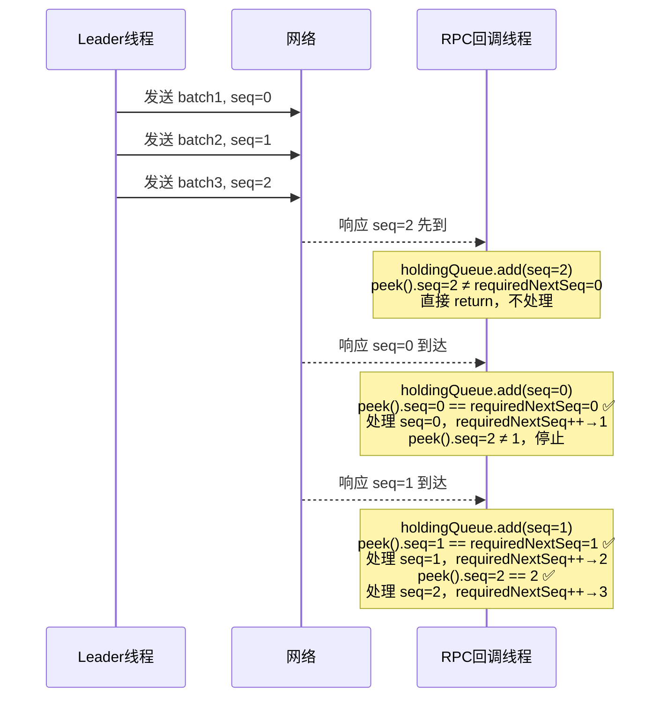

**关键源码**（`onRpcReturned` 中的核心循环）：

```java
while (!holdingQueue.isEmpty()) {
    final RpcResponse queuedPipelinedResponse = holdingQueue.peek();
    // 序号不匹配，等待
    if (queuedPipelinedResponse.seq != r.requiredNextSeq) {
        break; // 停止处理，等下一个响应到来
    }
    holdingQueue.remove();
    // ... 处理响应 ...
    r.getAndIncrementRequiredNextSeq();
}
```

📌 **面试考点**：`reqSeq` 溢出怎么处理？

```java
private int getAndIncrementReqSeq() {
    final int prev = this.reqSeq;
    this.reqSeq++;
    if (this.reqSeq < 0) {  // 溢出时归零
        this.reqSeq = 0;
    }
    return prev;
}
```

> 用 `int` 而不是 `long`，溢出后归零，因为在途请求数量远小于 `Integer.MAX_VALUE`，序号连续性不受影响。

---

#### 【字段 4】`State` 状态机

```java
public enum State {
    Created,
    Probe,      // 探测 Follower 日志位置
    Snapshot,   // 正在安装快照
    Replicate,  // 正常复制
    Destroyed   // 已销毁
}
```

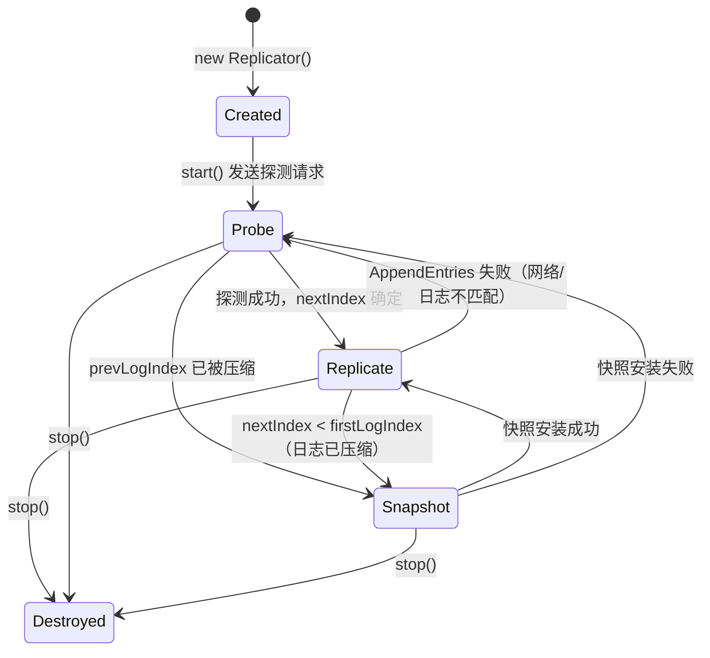

`setState()` 的副作用：状态变更时会通知 `ReplicatorStateListener`，并映射到 `ReplicatorState`（CREATED/ONLINE/OFFLINE/DESTROYED）：

```java
void setState(final State state) {
    State oldState = this.state;
    this.state = state;
    if (oldState != state) {
        ReplicatorState newState = null;
        switch (state) {
            case Created:
                newState = ReplicatorState.CREATED;
                break;
            case Replicate:
            case Snapshot:
                newState = ReplicatorState.ONLINE;   // 正在工作
                break;
            case Probe:
                newState = ReplicatorState.OFFLINE;  // 探测中，暂时不可用
                break;
            case Destroyed:
                newState = ReplicatorState.DESTROYED;
                break;
        }
        if (newState != null) {
            notifyReplicatorStatusListener(this, ReplicatorEvent.STATE_CHANGED, null, newState);
        }
    }
}
```

---

#### 【字段 5】`version`

```java
private int version = 0;
```

**【问题】** → `resetInflights()` 会清空所有在途请求，但已经飞出去的 RPC 回调还会到来，如何区分"旧版本的响应"和"当前版本的响应"？  
**【推导出的结构】** → 版本号，每次 reset 时递增，RPC 发出时记录当前版本，回调时比对

```java
// 发送时记录版本（闭包捕获）
final int stateVersion = this.version;
// 回调时比对
if (stateVersion != r.version) {
    id.unlock();
    return; // 丢弃旧版本响应
}
```

```java
void resetInflights() {
    this.version++;  // 版本递增，使所有飞行中的旧响应失效
    this.inflights.clear();
    this.pendingResponses.clear();
    final int rs = Math.max(this.reqSeq, this.requiredNextSeq);
    this.reqSeq = this.requiredNextSeq = rs; // 序号对齐，取 max 避免与残留响应冲突
    releaseReader();
}
```

> ⚠️ **生产踩坑**：`reqSeq` 和 `requiredNextSeq` reset 时取两者的 `max`，而不是直接归零。这是因为 `pendingResponses` 中可能还有未处理的响应，直接归零会导致序号冲突。

---

### 第五步：算法流程（核心方法执行路径）

#### 5.1 启动流程：`start()`

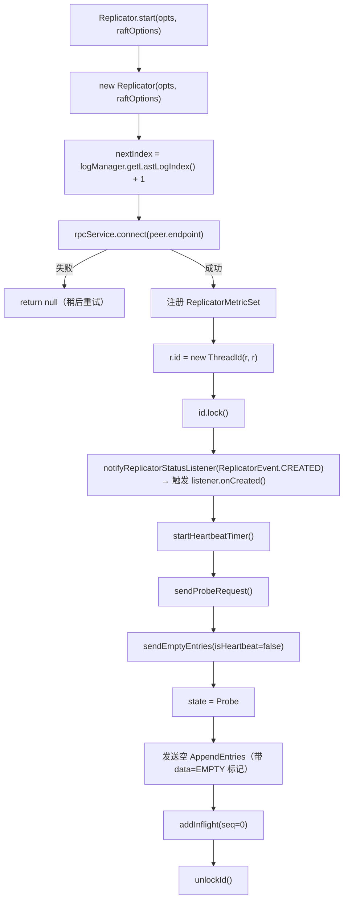

#### 5.2 正常复制流程：`sendEntries()`

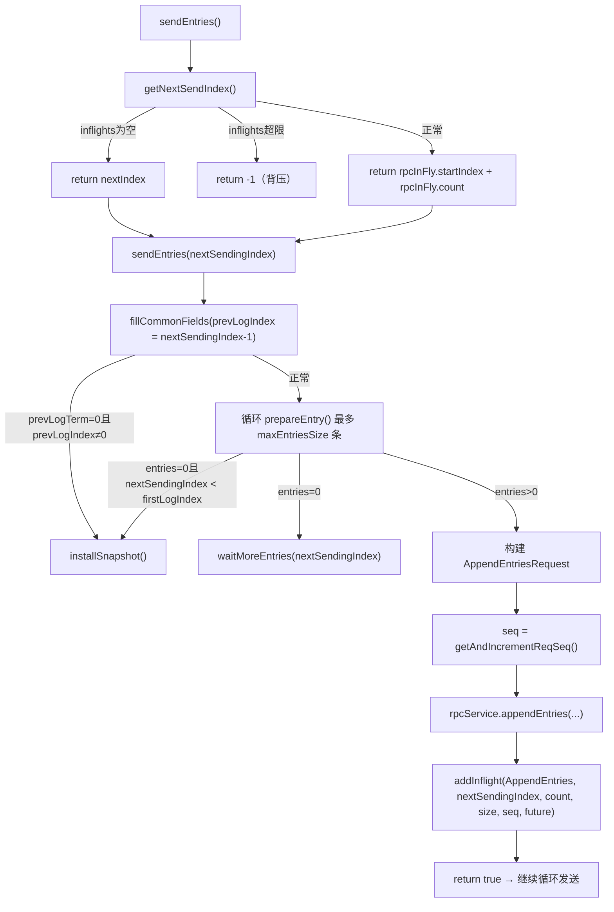

#### 5.3 响应处理流程：`onRpcReturned()`（Pipeline 有序性核心）

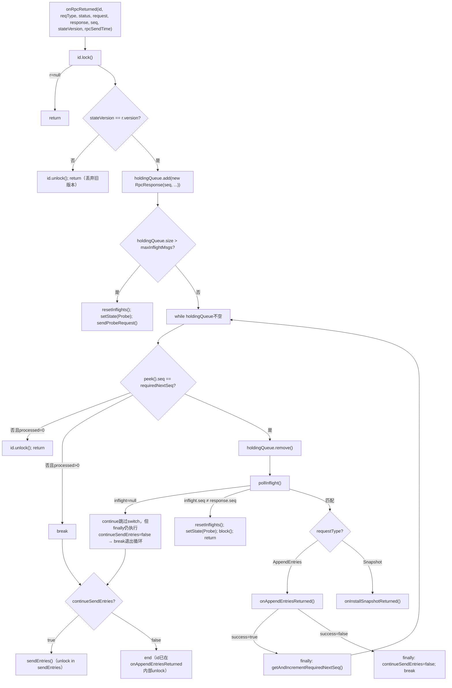

#### 5.4 AppendEntries 成功后的核心逻辑

```java
// ⚠️ 成功路径前置检查：response.term 必须与当前 term 一致
if (response.getTerm() != r.options.getTerm()) {
    r.resetInflights();
    r.setState(State.Probe);
    id.unlock();
    return false;  // term 不匹配，丢弃响应
}
final int entriesSize = request.getEntriesCount();
if (entriesSize > 0) {
    // ⚠️ 只有 Follower 类型的 Replicator 才提交（Learner 不参与 quorum）
    if (r.options.getReplicatorType().isFollower()) {
        r.options.getBallotBox().commitAt(r.nextIndex, r.nextIndex + entriesSize - 1, r.options.getPeerId());
    }
}
r.setState(State.Replicate);
r.blockTimer = null;
r.nextIndex += entriesSize;  // 推进 nextIndex
r.hasSucceeded = true;
r.notifyOnCaughtUp(RaftError.SUCCESS.getNumber(), false);
// 如果有 Leader Transfer 等待，检查是否可以发送 TimeoutNow
if (r.timeoutNowIndex > 0 && r.timeoutNowIndex < r.nextIndex) {
    r.sendTimeoutNow(false, false);
}
return true; // 告诉 onRpcReturned 继续发送
```

> 📌 **面试考点**：`commitAt` 只在 `replicatorType.isFollower()` 时调用，Learner 节点不参与 quorum 投票，所以不触发提交。

> 📌 **面试考点**：成功路径中为什么还要检查 `response.getTerm() != r.options.getTerm()`？因为 Follower 可能在处理请求期间发生了 term 变化（如收到了更高 term 的消息），此时响应的 term 会与 Leader 的 term 不一致，需要重置状态重新探测。

---

### 核心不变式总结

| # | 不变式 | 保证机制 |
|---|---|---|
| 1 | **响应必须按 seq 顺序处理** | `requiredNextSeq` + `PriorityQueue<RpcResponse>` |
| 2 | **在途请求数量不超过 `maxReplicatorInflightMsgs`** | `getNextSendIndex()` 返回 -1 时停止发送 |
| 3 | **旧版本（reset 后）的响应必须被丢弃** | `version` 字段 + `stateVersion` 闭包捕获 |
| 4 | **`nextIndex` 只在成功 ACK 后推进** | 仅在 `onAppendEntriesReturned` 成功路径中 `nextIndex += entriesSize` |

---

### 面试高频考点 📌

1. **Pipeline 如何保证有序性？** → `reqSeq` 编号 + `PriorityQueue` 暂存乱序响应 + `requiredNextSeq` 按序消费
2. **`resetInflights()` 为什么要 `version++`？** → 使飞行中的旧 RPC 回调失效，避免处理过期响应
3. **`reqSeq` 和 `requiredNextSeq` reset 时为什么取 `max`？** → 避免与 `pendingResponses` 中残留响应的序号冲突
4. **心跳和探测用的是同一个 `sendEmptyEntries()`，如何区分？** → `isHeartbeat` 参数；探测时加入 `inflights`，心跳不加入
5. **Follower 宕机后 Replicator 如何处理？** → `onAppendEntriesReturned` 中 `status.isOk()=false` → `resetInflights()` → `setState(Probe)` → `block()` → 定时重试
6. **`onAppendEntriesReturned` 失败时有哪几种情况？** → ①`status.isOk()=false`（网络错误）→ block；②`response.getErrorCode()==EBUSY`（Follower 繁忙）→ block；③`response.getTerm() > r.options.getTerm()`（更高 term）→ destroy；④普通日志不匹配 → 回退 nextIndex + sendProbeRequest

### 生产踩坑 ⚠️

1. **`maxReplicatorInflightMsgs` 设置过大** → `pendingResponses` 积压，内存压力大；设置过小 → Pipeline 退化为串行，吞吐下降
2. **`pendingResponses` 超过 `maxReplicatorInflightMsgs`** → 触发 `resetInflights()` + `sendProbeRequest()`，会有一次短暂的复制中断
3. **`version` 溢出** → `int` 类型，理论上可能溢出，但实际上 `resetInflights()` 调用频率极低，几乎不会发生
4. **Follower 返回 `EBUSY`** → 通常是 Follower 的 FSMCaller Disruptor RingBuffer 满（状态机处理速度跟不上日志复制速度），Replicator 会 `block()` 等待后重试；需要优化状态机执行效率或降低写入速率

---

## BallotBox.java 深度精读

### 第一步：提出问题

> **这个类要解决什么问题？**

`Replicator` 的 `commitAt()` 调用告诉 BallotBox："Follower X 已经确认了 [firstLogIndex, lastLogIndex] 这段日志"。但**一个 Follower 的确认不够**，需要**多数派（quorum）都确认**，日志才能提交。

核心问题清单：
1. **如何追踪每条日志被哪些 Follower 确认了？**（每条日志的投票状态）
2. **如何判断某条日志已达到多数派？**（quorum 计数）
3. **多个 Replicator 并发调用 `commitAt()` 怎么保证线程安全？**（并发控制）
4. **日志提交后如何通知状态机？**（FSMCaller 回调）
5. **Leader 切换时未提交的日志怎么处理？**（clearPendingTasks）
6. **成员变更时 quorum 如何变化？**（Joint Consensus 下的双 quorum）

---

### 第二步：推导设计

> **如果让我来设计，需要哪些信息？**

| 需要解决的问题 | 需要的信息 |
|---|---|
| 追踪每条日志的投票状态 | 每条日志对应一个"投票箱"，记录哪些节点已投票 |
| 判断多数派 | 每个投票箱维护剩余需要的票数（quorum 倒计时） |
| 按 index 快速定位投票箱 | 投票箱按 index 顺序排列，用 `pendingIndex` 作为基准偏移 |
| 提交后快速删除已提交的投票箱 | 支持从头部批量删除的数据结构 |
| 并发安全 | 写锁保护所有修改操作 |
| 通知状态机 | 持有 FSMCaller 引用，提交后调用 `onCommitted()` |
| 用户回调 | 持有 ClosureQueue，与 pendingMetaQueue 一一对应 |

---

### 第三步：引出结构

> **由此推导出大概需要什么样的数据结构**

```
BallotBox
├── long pendingIndex                     // 当前待提交的最小 log index（投票箱队列的起始偏移）
├── SegmentList<Ballot> pendingMetaQueue  // 投票箱队列，index i 对应 log (pendingIndex + i)
├── long lastCommittedIndex               // 已提交的最大 log index
├── StampedLock stampedLock               // 并发控制（写锁 + 乐观读）
├── FSMCaller waiter                      // 提交后通知状态机
└── ClosureQueue closureQueue             // 用户回调队列（与 pendingMetaQueue 一一对应）

Ballot（单条日志的投票箱）
├── List<UnfoundPeerId> peers             // 当前配置的节点列表（含是否已投票标记）
├── int quorum                            // 还需要多少票才能提交（倒计时，初始 = peers.size()/2+1）
├── List<UnfoundPeerId> oldPeers          // 旧配置节点列表（Joint Consensus 用）
└── int oldQuorum                         // 旧配置还需要多少票
```

---

### 第四步：完整分析（对照真实源码逐字段验证）

#### 【字段 1】`pendingIndex` + `pendingMetaQueue`

```java
private long                      pendingIndex;
private final SegmentList<Ballot> pendingMetaQueue = new SegmentList<>(false);
```

**【问题】** → 需要按 log index 快速定位对应的投票箱，并支持提交后批量删除头部
**【需要什么信息】** → 投票箱的起始 index（`pendingIndex`）+ 顺序存储的投票箱列表
**【推导出的结构】** → `pendingIndex` 作为偏移基准，`pendingMetaQueue.get(logIndex - pendingIndex)` 即可 O(1) 定位（内部通过位运算 `index >> 7` 定位 segment，`index & 127` 定位 segment 内偏移）
**【真实源码验证】**：

```java
// commitAt() 中的定位逻辑
final Ballot bl = this.pendingMetaQueue.get((int) (logIndex - this.pendingIndex));
```

**为什么用 `SegmentList` 而不是 `ArrayList`？**

`SegmentList` 是分段数组（每段 128 个元素），支持 **O(n/128) 从头部批量删除**（整段 `removeRange` 丢弃，不需要逐元素数组拷贝）。而 `ArrayList` 的 `removeRange(0, n)` 是 O(n) 的数组拷贝，相比之下 `SegmentList` 快约 128 倍。

```
SegmentList 内存布局（SEGMENT_SIZE = 128）：
[segment0: Ballot[0..127]] → [segment1: Ballot[128..255]] → [segment2: Ballot[256..383]]
     ↑
  firstOffset（segment 内部的起始偏移，记录第一个 segment 中有效元素的起始位置）

removeFromFirst(n) 的实际逻辑：
  1. 整段删除：segments.removeRange(0, toSegmentIndex)  → O(n/128)
  2. 处理最后不完整的 segment：逐元素置 null，移动 offset 指针
```

`SegmentList(false)` 中的 `false` 表示不启用 Segment 对象池回收（BallotBox 在多线程环境下，对象池回收不安全）。

---

#### 【字段 2】`lastCommittedIndex`

```java
private long lastCommittedIndex = 0;
```

**【问题】** → 需要知道当前已提交到哪里，防止重复提交或乱序提交
**【推导出的结构】** → 单调递增的 long，只在 `commitAt()` 成功后更新

`getLastCommittedIndex()` 使用了 **StampedLock 乐观读**：

```java
public long getLastCommittedIndex() {
    long stamp = this.stampedLock.tryOptimisticRead();  // 乐观读，不加锁
    final long optimisticVal = this.lastCommittedIndex;
    if (this.stampedLock.validate(stamp)) {             // 验证期间没有写操作
        return optimisticVal;                           // 直接返回，零锁开销
    }
    // 乐观读失败（有并发写），降级为悲观读锁
    stamp = this.stampedLock.readLock();
    try {
        return this.lastCommittedIndex;
    } finally {
        this.stampedLock.unlockRead(stamp);
    }
}
```

> 📌 **面试考点**：`getLastCommittedIndex()` 被频繁调用（每次心跳、每次 AppendEntries 都要读），用乐观读避免锁竞争，是典型的读多写少场景优化。

---

#### 【字段 3】`stampedLock`

```java
private final StampedLock stampedLock = new StampedLock();
```

**【问题】** → 多个 Replicator 线程并发调用 `commitAt()`，必须保证线程安全
**【为什么不用 `synchronized` 或 `ReentrantLock`？】**

`StampedLock` 相比 `ReentrantLock` 的优势：
- 支持**乐观读**（`tryOptimisticRead`），读操作完全无锁
- 写锁性能与 `ReentrantLock` 相当
- 缺点：不可重入，不支持 `Condition`

`BallotBox` 的访问模式：
- **写操作**（`commitAt`、`appendPendingTask` 等）：持有写锁，互斥
- **读操作**（`getLastCommittedIndex`）：乐观读，无锁

---

#### 【字段 4】`waiter` + `closureQueue`

```java
private FSMCaller    waiter;
private ClosureQueue closureQueue;
```

**【问题】** → 日志提交后需要两件事：①通知状态机执行 ②回调用户的 `Closure`
**【推导出的结构】** → 两个独立的引用，分别负责不同的通知路径

- `waiter.onCommitted(lastCommittedIndex)` → 触发 FSMCaller 的 Disruptor，异步驱动状态机
- `closureQueue` → 与 `pendingMetaQueue` 一一对应，日志提交时对应的 `Closure` 会被调用

**`appendPendingTask()` 中两者同步追加**：

```java
public boolean appendPendingTask(final Configuration conf, final Configuration oldConf, final Closure done) {
    final Ballot bl = new Ballot();
    bl.init(conf, oldConf);
    // ...
    this.pendingMetaQueue.add(bl);               // 投票箱入队
    this.closureQueue.appendPendingClosure(done); // 用户回调入队（与投票箱一一对应）
    return true;
}
```

---

#### 【Ballot 内部结构详解】

```java
public class Ballot {
    private final List<UnfoundPeerId> peers;    // 当前配置节点列表
    private int                       quorum;   // 还需要多少票（倒计时）
    private final List<UnfoundPeerId> oldPeers; // 旧配置节点列表（Joint Consensus）
    private int                       oldQuorum; // 旧配置还需要多少票
}
```

**`quorum` 初始化**：

```java
this.quorum = this.peers.size() / 2 + 1;
// 3节点集群：quorum = 3/2+1 = 2（需要 2 票，即 Leader + 1 个 Follower）
// 5节点集群：quorum = 5/2+1 = 3（需要 3 票）
```

**`grant()` 方法（投票）**：

```java
public PosHint grant(final PeerId peerId, final PosHint hint) {
    UnfoundPeerId peer = findPeer(peerId, this.peers, hint.pos0);
    if (peer != null) {
        if (!peer.found) {      // 防止重复投票
            peer.found = true;
            this.quorum--;      // 倒计时减 1
        }
        hint.pos0 = peer.index; // 记录位置，下次直接命中（避免遍历）
    }
    // oldPeers 同理（Joint Consensus 双配置都需要达到多数派）
    // ...
    return hint;
}

public boolean isGranted() {
    return this.quorum <= 0 && this.oldQuorum <= 0; // 两个配置都达到多数派才算通过
}
```

**`PosHint` 的作用**：`commitAt()` 中对同一个 Follower 连续投票多条日志时，`PosHint` 记录上次在 `peers` 列表中的位置，下次直接命中，避免每次都遍历整个列表（O(1) vs O(n)）。

---

### 第五步：算法流程（核心方法执行路径）

#### 5.1 Leader 初始化：`resetPendingIndex()`

```java
// becomeLeader() 时调用，newPendingIndex = lastLogIndex + 1
public boolean resetPendingIndex(final long newPendingIndex) {
    // 前置条件：pendingIndex == 0 且 pendingMetaQueue 为空（必须是干净状态）
    if (!(this.pendingIndex == 0 && this.pendingMetaQueue.isEmpty())) {
        return false;
    }
    // 前置条件：newPendingIndex > lastCommittedIndex（不能回退）
    if (newPendingIndex <= this.lastCommittedIndex) {
        return false;
    }
    this.pendingIndex = newPendingIndex;
    this.closureQueue.resetFirstIndex(newPendingIndex); // 同步重置 closureQueue 的起始 index
    return true;
}
```

> 📌 **面试考点**：`newPendingIndex` 为什么是 `lastLogIndex + 1`？根据 Raft 论文，新 Leader 不能直接提交前任 term 的日志，必须等到当前 term 有日志提交后，才能"顺带"提交之前的日志。所以 `pendingIndex` 从 `lastLogIndex + 1` 开始。

---

#### 5.2 核心流程：`commitAt()`

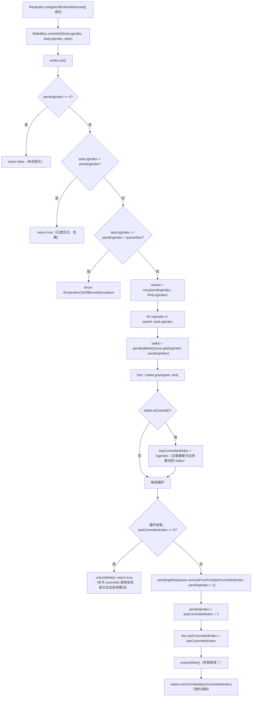

**关键设计：`waiter.onCommitted()` 在锁外调用**

```java
} finally {
    this.stampedLock.unlockWrite(stamp);  // 先释放锁
}
this.waiter.onCommitted(lastCommittedIndex);  // 再通知 FSMCaller
```

> ⚠️ **生产踩坑**：`onCommitted()` 必须在锁外调用。`onCommitted()` 会向 FSMCaller 的 Disruptor 发布事件，当 RingBuffer 满时可能阻塞。如果持锁调用，会导致其他 Replicator 线程的 `commitAt()` 被阻塞，形成死锁风险。

---

#### 5.3 完整的多数派提交时序图（3节点集群）

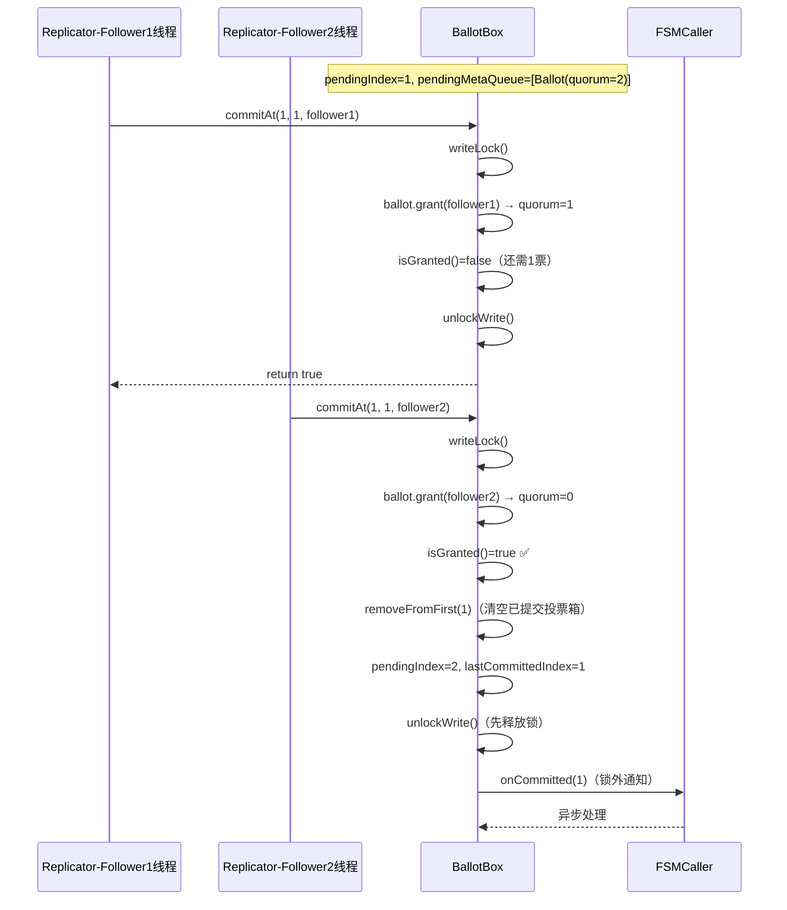

---

#### 5.4 Leader 卸任：`clearPendingTasks()`

```java
public void clearPendingTasks() {
    final long stamp = this.stampedLock.writeLock();
    try {
        this.pendingMetaQueue.clear();  // 清空投票箱
        this.pendingIndex = 0;          // 重置为未初始化状态
        this.closureQueue.clear();      // 清空用户回调（以失败状态通知客户端）
    } finally {
        this.stampedLock.unlockWrite(stamp);
    }
}
```

---

### 核心不变式总结

| # | 不变式 | 保证机制 |
|---|---|---|
| 1 | **`pendingMetaQueue[i]` 对应 log index `pendingIndex + i`** | `appendPendingTask` 和 `commitAt` 都在写锁内操作，保证一一对应 |
| 2 | **`lastCommittedIndex` 单调递增** | `commitAt` 中只在 `lastCommittedIndex > 0` 时更新，且只增不减 |
| 3 | **同一个 Follower 对同一条日志只能投一票** | `Ballot.grant()` 中 `if (!peer.found)` 防止重复计票 |
| 4 | **`onCommitted()` 必须在锁外调用** | `finally` 块先 `unlockWrite`，再调用 `waiter.onCommitted()` |
| 5 | **Joint Consensus 下两个配置都需达到多数派** | `isGranted()` = `quorum <= 0 && oldQuorum <= 0` |

---

### 面试高频考点 📌

1. **`commitAt()` 为什么用 `StampedLock` 而不是 `synchronized`？** → 支持乐观读，`getLastCommittedIndex()` 高频调用时零锁开销
2. **`pendingMetaQueue` 为什么用 `SegmentList` 而不是 `ArrayList`？** → `removeFromFirst()` 是 O(n/128)（整段 `removeRange` 丢弃，不需要逐元素数组拷贝），`ArrayList` 是 O(n) 数组拷贝，相比快约 128 倍；同时 `get(index)` 通过位运算（`index >> 7` 定位 segment，`index & 127` 定位 segment 内偏移）实现 O(1) 随机访问
3. **`onCommitted()` 为什么必须在锁外调用？** → 防止 Disruptor RingBuffer 满时阻塞持锁线程，造成死锁
4. **`PosHint` 的作用是什么？** → 缓存 Follower 在 `peers` 列表中的位置，连续投票时 O(1) 命中，避免遍历
5. **成员变更时 quorum 如何保证安全？** → `Ballot` 同时维护 `peers`（新配置）和 `oldPeers`（旧配置），`isGranted()` 要求两者都达到多数派（Joint Consensus）
6. **Leader 切换后未提交的日志怎么处理？** → `clearPendingTasks()` 清空投票箱，`closureQueue.clear()` 以失败状态回调客户端

### 生产踩坑 ⚠️

1. **`commitAt()` 抛出 `ArrayIndexOutOfBoundsException`** → `lastLogIndex >= pendingIndex + pendingMetaQueue.size()`，说明 Replicator 的 `nextIndex` 超出了 BallotBox 的 `pendingMetaQueue` 范围，通常是 `appendPendingTask` 和 `commitAt` 的调用时序出现了问题
2. **`resetPendingIndex()` 返回 false** → 说明 `pendingMetaQueue` 不为空（上一任 Leader 的残留），需要先调用 `clearPendingTasks()`
3. **`setLastCommittedIndex()` 返回 false（Follower 场景）** → 有三种情况：①`pendingIndex != 0 || !pendingMetaQueue.isEmpty()`（节点已变为 Leader，有 pendingMetaQueue，不应走 Follower 路径）；②FSMCaller 的 Disruptor RingBuffer 满（`hasAvailableCapacity(1)` 返回 false），状态机处理速度跟不上日志提交速度；③`lastCommittedIndex < this.lastCommittedIndex`（收到了旧的 committedIndex，直接忽略）
4. **`commitAt()` 抛出 `ArrayIndexOutOfBoundsException`** → `lastLogIndex >= pendingIndex + pendingMetaQueue.size()`，说明 Replicator 的 `nextIndex` 超出了 BallotBox 的 `pendingMetaQueue` 范围，通常是 `appendPendingTask` 和 `commitAt` 的调用时序出现了问题
5. **`resetPendingIndex()` 返回 false** → 说明 `pendingMetaQueue` 不为空（上一任 Leader 的残留），需要先调用 `clearPendingTasks()`
6. **`setLastCommittedIndex()` 返回 false（Follower 场景）** → 有三种情况：①`pendingIndex != 0 || !pendingMetaQueue.isEmpty()`（节点已变为 Leader，有 pendingMetaQueue，不应走 Follower 路径）；②FSMCaller 的 Disruptor RingBuffer 满（`hasAvailableCapacity(1)` 返回 false），状态机处理速度跟不上日志提交速度；③`lastCommittedIndex < this.lastCommittedIndex`（收到了旧的 committedIndex，直接忽略）

---

## FSMCallerImpl.java 深度精读

### 第一步：提出问题

> **这个类要解决什么问题？**

`BallotBox.commitAt()` 调用 `waiter.onCommitted(lastCommittedIndex)` 后，日志进入 FSMCaller。核心问题清单：

1. **`onCommitted()` 是同步执行还是异步执行？** → 如果同步，会阻塞 Replicator 线程
2. **多个 `onCommitted()` 并发调用时如何合并？** → 批量提交优化
3. **日志从 LogManager 读出来后，如何交给用户状态机？** → Iterator 模式
4. **`closureQueue` 里的用户回调何时被调用？** → 与日志 apply 的对应关系
5. **状态机执行出错怎么处理？** → 错误传播路径
6. **除了 COMMITTED，还有哪些任务类型？** → 快照、Leader 变更等

---

### 第二步：推导设计

> **如果让我来设计，需要哪些信息？**

| 需要解决的问题 | 需要的信息 |
|---|---|
| 异步执行，不阻塞 Replicator | 一个独立的消费线程 + 任务队列 |
| 批量合并多个 COMMITTED 事件 | 只记录最大的 committedIndex，批量处理 |
| 按顺序迭代日志交给状态机 | 一个 Iterator，从 lastAppliedIndex+1 到 committedIndex |
| 用户回调与日志一一对应 | closureQueue 与日志 index 对齐 |
| 记录已应用到哪里 | `lastAppliedIndex` 单调递增 |
| 多种任务类型 | 枚举 TaskType + union 字段的 ApplyTask |

---

### 第三步：引出结构

> **由此推导出大概需要什么样的数据结构**

```
FSMCallerImpl
├── Disruptor<ApplyTask> disruptor        // 异步任务队列（单消费者线程）
├── RingBuffer<ApplyTask> taskQueue       // Disruptor 的 RingBuffer
├── AtomicLong lastAppliedIndex           // 已应用到状态机的最大 log index
├── AtomicLong lastCommittedIndex         // 已提交的最大 log index（来自 BallotBox）
├── AtomicLong applyingIndex              // 当前正在 apply 的 log index（用于监控）
├── long lastAppliedTerm                  // 已应用的最大 term
├── volatile TaskType currTask            // 当前正在执行的任务类型（用于监控/toString）
├── volatile Thread fsmThread             // Disruptor 消费者线程（用于 isRunningOnFSMThread）
├── StateMachine fsm                      // 用户状态机
├── LogManager logManager                 // 日志存储，用于读取日志条目
├── ClosureQueue closureQueue             // 用户回调队列（与 BallotBox 共享同一个实例）
├── volatile RaftException error          // 当前错误状态（非 NONE 时拒绝新任务）
└── CopyOnWriteArrayList<LastAppliedLogIndexListener> lastAppliedLogIndexListeners

ApplyTask（Disruptor 事件对象，union 字段设计）
├── TaskType type                         // 任务类型
├── long committedIndex                   // COMMITTED 时使用
├── long term                             // LEADER_START 时使用
├── Status status                         // LEADER_STOP 时使用
├── LeaderChangeContext leaderChangeCtx   // START/STOP_FOLLOWING 时使用
├── Closure done                          // SNAPSHOT_SAVE/LOAD/ERROR 时使用
└── CountDownLatch shutdownLatch          // SHUTDOWN/FLUSH 时使用
```

---

### 第四步：完整分析（对照真实源码逐字段验证）

#### 【字段 1】`disruptor` + `taskQueue`

```java
private Disruptor<ApplyTask>  disruptor;
private RingBuffer<ApplyTask> taskQueue;
```

**【问题】** → `onCommitted()` 被多个 Replicator 线程并发调用，必须异步化，不能阻塞调用方
**【推导出的结构】** → Disruptor 单消费者模式，生产者多线程，消费者单线程（FSM 线程）
**【真实源码验证】**：

```java
// init() 中的 Disruptor 初始化
this.disruptor = DisruptorBuilder.<ApplyTask> newInstance()
    .setEventFactory(new ApplyTaskFactory())
    .setRingBufferSize(opts.getDisruptorBufferSize())   // 默认 1024
    .setThreadFactory(new NamedThreadFactory("JRaft-FSMCaller-Disruptor-", true))
    .setProducerType(ProducerType.MULTI)                // 多生产者（多个 Replicator 线程）
    .setWaitStrategy(new BlockingWaitStrategy())        // 消费者等待策略：阻塞等待
    .build();
this.disruptor.handleEventsWith(new ApplyTaskHandler()); // 单消费者
this.taskQueue = this.disruptor.start();
```

**为什么用 `BlockingWaitStrategy`？**

`BlockingWaitStrategy` 在没有事件时让消费者线程阻塞（`LockSupport.park`），CPU 占用为 0。相比 `BusySpinWaitStrategy`（CPU 100% 自旋）更适合 FSM 这种"偶尔有批量事件，大部分时间空闲"的场景。

**`ProducerType.MULTI` 的含义**：多个 Replicator 线程（每个 Follower 一个）都会调用 `onCommitted()`，所以必须是 MULTI 模式，内部使用 CAS 保证 sequence 分配的线程安全。

---

#### 【字段 2】`lastAppliedIndex` + `lastCommittedIndex` + `applyingIndex`

```java
private final AtomicLong lastAppliedIndex;
private final AtomicLong lastCommittedIndex;
private final AtomicLong applyingIndex;
```

**【问题】** → 需要追踪三个不同阶段的进度：已提交、正在 apply、已 apply
**【三者的区别】**：

```
lastCommittedIndex：BallotBox 通知的"已达多数派"的最大 index
       ↓ doCommitted() 开始处理
applyingIndex：当前 IteratorImpl 正在处理的 log index（实时更新，用于监控）
       ↓ fsm.onApply() 返回
lastAppliedIndex：状态机已成功 apply 的最大 index（setLastApplied() 更新）
```

**【真实源码验证】**：

```java
// 构造函数中初始化
this.lastAppliedIndex = new AtomicLong(0);
this.applyingIndex = new AtomicLong(0);
this.lastCommittedIndex = new AtomicLong(0);

// init() 中从 bootstrapId 恢复
this.lastCommittedIndex.set(opts.getBootstrapId().getIndex());
this.lastAppliedIndex.set(opts.getBootstrapId().getIndex());
```

> 📌 **面试考点**：`lastAppliedIndex` 和 `lastCommittedIndex` 的区别？
> - `lastCommittedIndex`：日志已被多数派确认，可以提交（Raft 层面的 committed）
> - `lastAppliedIndex`：日志已被状态机执行（应用层面的 applied）
> - 正常情况下 `lastAppliedIndex <= lastCommittedIndex`，差值代表"已提交但未 apply"的积压量

---

#### 【字段 3】`currTask` + `fsmThread`

```java
private volatile TaskType currTask;
private volatile Thread   fsmThread;
```

**【问题】** → 需要知道当前 FSM 线程在做什么（用于监控和 `toString()`），以及判断当前线程是否是 FSM 线程
**【真实源码验证】**：

```java
// ApplyTaskHandler 中记录 FSM 线程（第一次运行时）
private void setFsmThread() {
    if (firstRun) {
        fsmThread = Thread.currentThread();
        firstRun = false;
    }
}

// isRunningOnFSMThread() 用于防止在 FSM 线程内发起阻塞操作
public boolean isRunningOnFSMThread() {
    return Thread.currentThread() == fsmThread;
}
```

---

#### 【字段 4】`error`

```java
private volatile RaftException error;
```

**【问题】** → 状态机出错后，必须停止接受新任务，防止状态不一致
**【真实源码验证】**：

```java
// 初始化为 ERROR_TYPE_NONE（无错误）
this.error = new RaftException(EnumOutter.ErrorType.ERROR_TYPE_NONE);

// doCommitted() 开头检查
private void doCommitted(final long committedIndex) {
    if (!this.error.getStatus().isOk()) {
        return;  // 有错误时直接返回，不再 apply
    }
    // ...
}

// setError() 设置错误并通知 fsm 和 node
private void setError(final RaftException e) {
    if (this.error.getType() != EnumOutter.ErrorType.ERROR_TYPE_NONE) {
        return;  // 已有错误，忽略新错误（错误不可叠加）
    }
    this.error = e;
    if (this.fsm != null) {
        this.fsm.onError(e);   // 通知用户状态机
    }
    if (this.node != null) {
        this.node.onError(e);  // 通知 NodeImpl（触发 Leader 降级等）
    }
}
```

> ⚠️ **生产踩坑**：`error` 一旦设置就不可恢复（`setError()` 中有 `if already set → return`）。状态机出错后，节点会进入不可用状态，必须重启才能恢复。

---

#### 【TaskType 枚举】

```java
private enum TaskType {
    IDLE,            // 空闲
    COMMITTED,       // 日志提交（最高频）
    SNAPSHOT_SAVE,   // 保存快照
    SNAPSHOT_LOAD,   // 加载快照
    LEADER_STOP,     // Leader 卸任
    LEADER_START,    // 成为 Leader
    START_FOLLOWING, // 开始跟随新 Leader
    STOP_FOLLOWING,  // 停止跟随
    SHUTDOWN,        // 关闭
    FLUSH,           // 刷新（仅测试用）
    ERROR            // 错误通知
}
```

**`ApplyTask` 的 union 字段设计**：不同 TaskType 使用不同字段，其余字段为 null/0。这是 Disruptor 对象复用的标准模式——`ApplyTask` 对象预分配在 RingBuffer 中，每次使用前调用 `reset()` 清空，避免 GC。

---

### 第五步：算法流程（核心方法执行路径）

#### 5.1 `onCommitted()` → Disruptor 入队

```java
public boolean onCommitted(final long committedIndex) {
    return enqueueTask((task, sequence) -> {
        task.type = TaskType.COMMITTED;
        task.committedIndex = committedIndex;
    });
}

private boolean enqueueTask(final EventTranslator<ApplyTask> tpl) {
    if (this.shutdownLatch != null) {
        // 正在关闭，拒绝新任务
        LOG.warn("FSMCaller is stopped, can not apply new task.");
        return false;
    }
    this.taskQueue.publishEvent(tpl);  // 发布到 RingBuffer（RingBuffer 满时会阻塞）
    return true;
}
```

---

#### 5.2 批量合并：`runApplyTask()` 中的 `maxCommittedIndex`

这是 FSMCallerImpl 最精妙的设计之一——利用 Disruptor 的 `endOfBatch` 机制实现批量合并。

```java
// ApplyTaskHandler 中，maxCommittedIndex 每批次重置为 -1
private long maxCommittedIndex = -1;

public void onEvent(final ApplyTask event, final long sequence, final boolean endOfBatch) {
    this.maxCommittedIndex = runApplyTask(event, this.maxCommittedIndex, endOfBatch);
}
```

```java
private long runApplyTask(final ApplyTask task, long maxCommittedIndex, final boolean endOfBatch) {
    if (task.type == TaskType.COMMITTED) {
        if (task.committedIndex > maxCommittedIndex) {
            maxCommittedIndex = task.committedIndex;  // 只记录最大值，不立即处理
        }
        task.reset();
    } else {
        // 遇到非 COMMITTED 任务时，先把积压的 COMMITTED 批量处理掉
        if (maxCommittedIndex >= 0) {
            this.currTask = TaskType.COMMITTED;
            doCommitted(maxCommittedIndex);
            maxCommittedIndex = -1L;
        }
        // 再处理当前非 COMMITTED 任务（SNAPSHOT_SAVE/LOAD/LEADER_STOP 等）
        // ...
    }
    // endOfBatch=true 时（当前批次最后一个事件），处理积压的 COMMITTED
    if (endOfBatch && maxCommittedIndex >= 0) {
        this.currTask = TaskType.COMMITTED;
        doCommitted(maxCommittedIndex);
        maxCommittedIndex = -1L;
    }
    return maxCommittedIndex;
}
```

**批量合并的效果**：

```
假设 RingBuffer 中积压了 5 个 COMMITTED 事件：
  [COMMITTED(100), COMMITTED(101), COMMITTED(102), COMMITTED(103), COMMITTED(104)]

runApplyTask 处理过程：
  event(100): maxCommittedIndex=100, endOfBatch=false → 不处理
  event(101): maxCommittedIndex=101, endOfBatch=false → 不处理
  event(102): maxCommittedIndex=102, endOfBatch=false → 不处理
  event(103): maxCommittedIndex=103, endOfBatch=false → 不处理
  event(104): maxCommittedIndex=104, endOfBatch=true  → doCommitted(104)！

结果：5 次 onCommitted() 调用，只触发 1 次 doCommitted()，
      doCommitted(104) 一次性 apply [lastAppliedIndex+1 .. 104] 所有日志
```

> 📌 **面试考点**：这是 Disruptor `endOfBatch` 机制的典型应用——批量消费，减少状态机调用次数，提升吞吐量。

---

#### 5.3 核心流程：`doCommitted()`

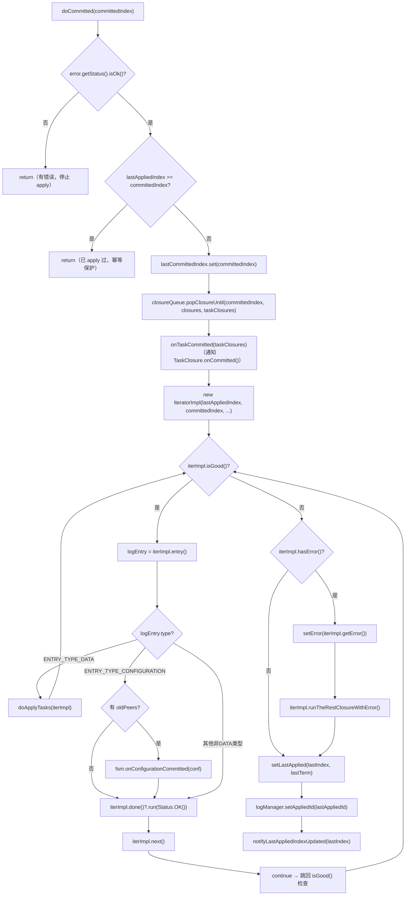

---

#### 5.4 `doApplyTasks()` → 调用用户状态机

```java
private void doApplyTasks(final IteratorImpl iterImpl) {
    final IteratorWrapper iter = new IteratorWrapper(iterImpl);
    final long startApplyMs = Utils.monotonicMs();
    final long startIndex = iter.getIndex();
    try {
        this.fsm.onApply(iter);  // 调用用户状态机，传入 Iterator
    } finally {
        this.nodeMetrics.recordLatency("fsm-apply-tasks", Utils.monotonicMs() - startApplyMs);
        this.nodeMetrics.recordSize("fsm-apply-tasks-count", iter.getIndex() - startIndex);
    }
    if (iter.hasNext()) {
        LOG.error("Iterator is still valid, did you return before iterator reached the end?");
    }
    iter.next();  // 确保 Iterator 推进到下一个位置
}
```

**用户状态机的标准实现模式**：

```java
// 用户实现 StateMachine.onApply(Iterator iter)
public void onApply(Iterator iter) {
    while (iter.hasNext()) {
        ByteBuffer data = iter.getData();   // 读取日志数据
        applyToState(data);                 // 执行业务逻辑（修改状态）
        if (iter.done() != null) {
            iter.done().run(Status.OK());   // 回调用户 Closure（通知客户端请求成功）
        }
        iter.next();
    }
}
```

> ⚠️ **生产踩坑**：用户必须在 `onApply()` 中消费完 Iterator 的所有条目（调用 `iter.next()` 直到 `!iter.hasNext()`）。如果提前 return，FSMCallerImpl 会打印 `ERROR: Iterator is still valid`，且未消费的日志对应的 Closure 不会被回调，导致客户端请求永久挂起。

---

#### 5.5 `IteratorImpl` 的关键设计

**`done()` 方法的对齐逻辑**：

```java
public Closure done() {
    if (this.currentIndex < this.firstClosureIndex) {
        return null;  // 这条日志没有对应的 Closure（前任 Leader 的日志）
    }
    return this.closures.get((int) (this.currentIndex - this.firstClosureIndex));
}
```

**为什么 `currentIndex < firstClosureIndex` 时返回 null？**

`firstClosureIndex` 是 `closureQueue.popClosureUntil()` 返回的起始 index。如果 `lastAppliedIndex < firstClosureIndex - 1`，说明中间有一段日志是前任 Leader 写入的（没有对应的 Closure），这些日志需要 apply 但不需要回调。

**`setErrorAndRollback()` 的回滚逻辑**：

```java
public void setErrorAndRollback(final long ntail, final Status st) {
    // ntail：需要回滚的条目数
    if (this.currEntry == null || this.currEntry.getType() != EnumOutter.EntryType.ENTRY_TYPE_DATA) {
        this.currentIndex -= ntail;
    } else {
        this.currentIndex -= ntail - 1;
    }
    // 不能回滚到 fsmCommittedIndex 之前（已 commit 的不可回滚）
    if (fsmCommittedIndex >= 0) {
        this.currentIndex = Math.max(this.currentIndex, fsmCommittedIndex + 1);
    }
    // 设置错误类型为 ERROR_TYPE_STATE_MACHINE
    getOrCreateError().setType(EnumOutter.ErrorType.ERROR_TYPE_STATE_MACHINE);
    getOrCreateError().getStatus().setError(RaftError.ESTATEMACHINE,
        "StateMachine meet critical error when applying one or more tasks since index=%d, %s",
        this.currentIndex, st != null ? st.toString() : "none");
}
```

---

#### 5.6 `ClosureQueueImpl.popClosureUntil()` 的实现

```java
public long popClosureUntil(final long endIndex, final List<Closure> closures,
                             final List<TaskClosure> taskClosures) {
    // 边界检查：队列为空 或 endIndex < firstIndex（已全部弹出）
    if (queueSize == 0 || endIndex < this.firstIndex) {
        return endIndex + 1;  // 返回 endIndex+1 表示没有 Closure 需要处理
    }
    final long outFirstIndex = this.firstIndex;
    for (long i = outFirstIndex; i <= endIndex; i++) {
        final Closure closure = this.queue.pollFirst();  // LinkedList 头部弹出，O(1)
        if (taskClosures != null && closure instanceof TaskClosure) {
            taskClosures.add((TaskClosure) closure);
        }
        closures.add(closure);
    }
    this.firstIndex = endIndex + 1;
    return outFirstIndex;  // 返回本次弹出的起始 index（即 firstClosureIndex）
}
```

**`ClosureQueue` 的数据结构选择**：`LinkedList`，因为只需要从头部弹出（`pollFirst()`），O(1) 操作；`ArrayList` 的头部删除是 O(n)。

---

#### 5.7 完整链路时序图（日志提交 → 状态机执行 → 用户回调）

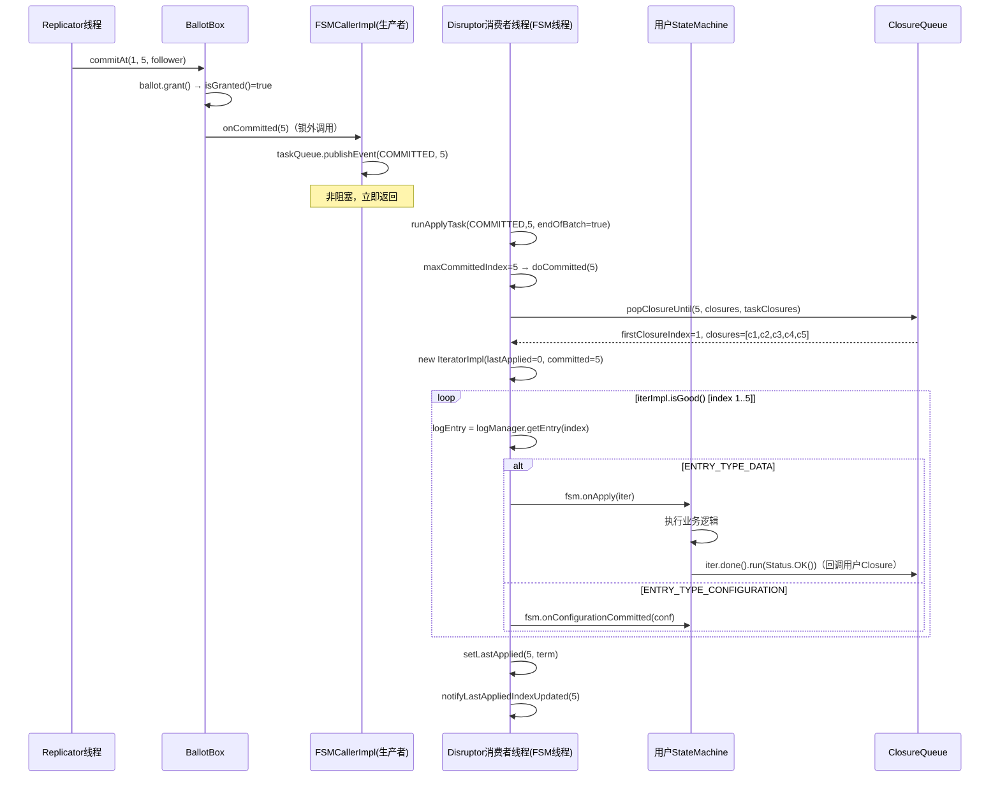

---

#### 5.8 错误处理路径

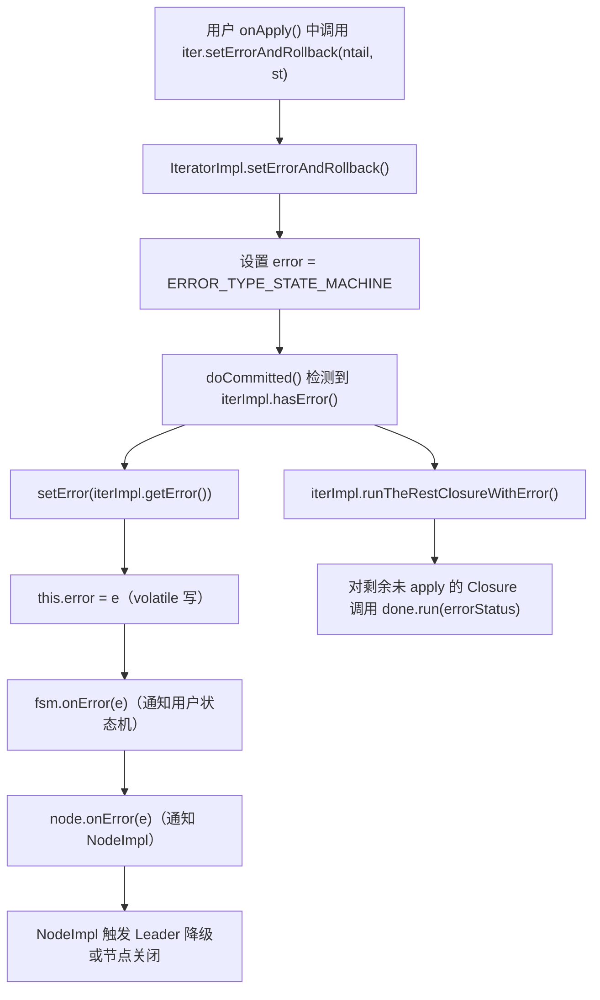

> ⚠️ **生产踩坑**：`setError()` 之后，`doCommitted()` 开头的 `if (!this.error.getStatus().isOk()) return` 会让所有后续 COMMITTED 任务直接跳过，节点进入不可用状态。这是 Raft 的安全性保证——状态机出错后宁可停止服务，也不能继续 apply 可能错误的日志。

---

### 核心不变式总结

| # | 不变式 | 保证机制 |
|---|---|---|
| 1 | **`lastAppliedIndex` 单调递增** | 只在 `setLastApplied()` 中更新，且 `doCommitted()` 开头有 `lastAppliedIndex >= committedIndex → return` 的幂等保护 |
| 2 | **所有 apply 操作在单一 FSM 线程中串行执行** | Disruptor 单消费者（`handleEventsWith` 只注册了一个 `ApplyTaskHandler`） |
| 3 | **`error` 一旦设置不可恢复** | `setError()` 中 `if (error.type != NONE) return`，且 `doCommitted()` 开头检查 error |
| 4 | **`closureQueue` 与日志 index 严格对齐** | `appendPendingTask()` 和 `appendPendingClosure()` 在同一个写锁内同步追加，`popClosureUntil()` 返回 `firstClosureIndex` 用于对齐 |
| 5 | **批量合并不改变语义** | `doCommitted(maxCommittedIndex)` 会从 `lastAppliedIndex+1` 开始 apply，不会跳过中间的日志 |

---

### 面试高频考点 📌

1. **FSMCallerImpl 为什么用 Disruptor 而不是普通的 BlockingQueue？** → Disruptor 的 `endOfBatch` 机制支持批量合并 COMMITTED 事件，减少 `doCommitted()` 调用次数；同时 RingBuffer 预分配对象，避免 GC
2. **`lastAppliedIndex` 和 `lastCommittedIndex` 的区别？** → committed 是 Raft 层面"多数派确认"，applied 是应用层面"状态机执行完成"，差值代表积压量
3. **`onCommitted()` 为什么是非阻塞的？** → `publishEvent()` 只是写入 RingBuffer，立即返回；只有 RingBuffer 满时才会阻塞（这也是 `BallotBox.setLastCommittedIndex()` 要检查 `hasAvailableCapacity()` 的原因）
4. **用户状态机 `onApply()` 必须消费完 Iterator 的所有条目，为什么？** → 未消费的 Iterator 条目对应的 Closure 不会被回调，客户端请求会永久挂起；FSMCallerImpl 会打印 ERROR 日志但不会强制处理
5. **`doCommitted()` 中为什么要先调用 `onTaskCommitted(taskClosures)`？** → `TaskClosure.onCommitted()` 是在日志提交时（而非 apply 时）的回调，用于通知"日志已被多数派确认"，早于 `onApply()` 中的 `done.run(Status.OK())`
6. **`IteratorImpl.done()` 返回 null 的情况？** → `currentIndex < firstClosureIndex`，即当前日志是前任 Leader 写入的，没有对应的用户 Closure

### 生产踩坑 ⚠️

1. **状态机 `onApply()` 中提前 return** → 未消费的 Iterator 条目对应的 Closure 不会被回调，客户端请求永久挂起；FSMCallerImpl 打印 `ERROR: Iterator is still valid`
2. **状态机 `onApply()` 抛出未捕获异常** → Disruptor 的 `LogExceptionHandler` 会记录日志，但不会调用 `setError()`，状态机会继续处理下一批日志，可能导致状态不一致；**正确做法是在 `onApply()` 内部捕获异常并调用 `iter.setErrorAndRollback()`**
3. **`onCommitted()` 返回 false** → `shutdownLatch != null`，说明 FSMCaller 正在关闭，通常发生在节点关闭流程中，属于正常现象
4. **`lastAppliedIndex` 长时间不推进** → 状态机 `onApply()` 执行耗时过长，导致 `applyingIndex` 停滞；可通过 `applyingIndex` 监控指标发现，需要优化状态机执行逻辑或拆分大批量操作
5. **节点重启后 `lastAppliedIndex` 从 `bootstrapId` 恢复** → 如果快照不完整或 `bootstrapId` 设置错误，会导致重复 apply 或跳过日志；需要确保快照保存和 `bootstrapId` 的一致性
---

## LogManagerImpl.java 深度精读

### 第一步：提出问题

> **这个类要解决什么问题？**

`LogManagerImpl` 是日志复制链路的"存储层"，所有日志的写入、读取、截断都经过它。核心问题清单：

1. **日志写入是同步还是异步？** → 写磁盘是 IO 密集型，必须异步化
2. **内存中的日志和磁盘上的日志如何协调？** → 两级存储：`logsInMemory` + `logStorage`
3. **内存日志何时可以清除？** → `diskId` 和 `appliedId` 双重条件
4. **Follower 收到 Leader 的日志时，如何处理冲突？** → `checkAndResolveConflict`
5. **Replicator 如何知道有新日志可以发送？** → `wait/notify` 机制（`waitMap`）
6. **快照安装后，旧日志如何清理？** → `truncatePrefix` 的三种策略

---

### 第二步：推导设计

> **如果让我来设计，需要哪些信息？**

| 需要解决的问题 | 需要的信息 |
|---|---|
| 异步写磁盘，不阻塞调用方 | Disruptor 队列 + 磁盘写线程 |
| 读日志时优先从内存读（快） | 内存缓冲区 `logsInMemory`，按 index 顺序存储 |
| 内存日志清理时机 | 已落盘（`diskId`）且已 apply（`appliedId`），取两者最小值 |
| 追踪日志范围 | `firstLogIndex`、`lastLogIndex` |
| 快照覆盖的日志范围 | `lastSnapshotId` |
| Follower 冲突检测 | 逐条比较 term，找到第一个冲突点，截断后面的日志 |
| Replicator 等待新日志 | `waitMap`：`waitId → WaitMeta(callback, arg, errorCode)` |

---

### 第三步：引出结构

> **由此推导出大概需要什么样的数据结构**

```
LogManagerImpl
├── LogStorage logStorage                    // 持久化存储（RocksDB/文件）
├── SegmentList<LogEntry> logsInMemory       // 内存缓冲区（写后读优化）
├── volatile long firstLogIndex              // 当前最小有效 log index
├── volatile long lastLogIndex               // 当前最大 log index
├── LogId diskId                             // 已落盘的最大 LogId（index+term）
├── LogId appliedId                          // 已 apply 的最大 LogId
├── volatile LogId lastSnapshotId            // 最新快照覆盖的 LogId
├── Disruptor<StableClosureEvent> disruptor  // 磁盘写异步队列
├── RingBuffer<StableClosureEvent> diskQueue // Disruptor 的 RingBuffer
├── ReadWriteLock lock                       // 读写锁（读多写少）
├── Map<Long, WaitMeta> waitMap              // Replicator 等待新日志的回调注册表
├── long nextWaitId                          // waitMap 的 key 生成器（自增）
├── ConfigurationManager configManager      // 配置变更日志管理
├── FSMCaller fsmCaller                      // 错误时通知状态机
└── volatile boolean hasError                // 是否有 IO 错误
```

---

### 第四步：完整分析（对照真实源码逐字段验证）

#### 【字段 1】`logsInMemory` + `diskId` + `appliedId`

```java
private final SegmentList<LogEntry> logsInMemory = new SegmentList<>(true);
private LogId                       diskId        = new LogId(0, 0);
private LogId                       appliedId     = new LogId(0, 0);
```

**【问题】** → 日志写入后需要在内存中缓存，供 Replicator 快速读取；但内存有限，需要知道何时可以清除
**【推导出的结构】** → 内存缓冲区 + 两个"水位线"：`diskId`（已落盘）和 `appliedId`（已 apply），取最小值作为清除边界
**【真实源码验证】**：

```java
// setDiskId() 中的清除逻辑
private void setDiskId(final LogId id) {
    // ...
    this.diskId = id;
    clearId = this.diskId.compareTo(this.appliedId) <= 0 ? this.diskId : this.appliedId;
    // clearId = min(diskId, appliedId)
    // ...
    clearMemoryLogs(clearId);  // 清除 index <= clearId.index 的内存日志
}

// setAppliedId() 中同样的逻辑
public void setAppliedId(final LogId appliedId) {
    // ...
    this.appliedId = appliedId.copy();
    clearId = this.diskId.compareTo(this.appliedId) <= 0 ? this.diskId : this.appliedId;
    // ...
    clearMemoryLogs(clearId);
}
```

**为什么要同时满足"已落盘"和"已 apply"才能清除内存日志？**

- **已落盘**：保证日志不会因为内存清除而丢失（磁盘上有备份）
- **已 apply**：保证状态机已经处理过这条日志（不需要再从内存读取）

如果只满足"已落盘"但未 apply，FSMCaller 的 `IteratorImpl` 可能还需要从内存读取这条日志（磁盘读比内存读慢）。

`SegmentList(true)` 中的 `true` 表示启用 Segment 对象池回收（与 `BallotBox` 中的 `false` 对比——`logsInMemory` 是单线程写入，对象池回收安全）。

---

#### 【字段 2】`firstLogIndex` + `lastLogIndex`

```java
private volatile long firstLogIndex;
private volatile long lastLogIndex;
```

**【问题】** → 需要快速判断某个 index 是否在有效范围内，避免无效的磁盘读取
**【真实源码验证】**：

```java
// getEntry() 中的范围检查
public LogEntry getEntry(final long index) {
    this.readLock.lock();
    try {
        if (index > this.lastLogIndex || index < this.firstLogIndex) {
            return null;  // 超出范围，直接返回 null
        }
        // ...
    }
}
```

---

#### 【字段 3】`diskQueue` + `disruptor`（与 FSMCallerImpl 的 Disruptor 配置对比）

```java
private Disruptor<StableClosureEvent>  disruptor;
private RingBuffer<StableClosureEvent> diskQueue;
```

**【问题】** → 磁盘写是 IO 密集型操作，必须异步化，不能阻塞 `appendEntries()` 调用方
**【与 FSMCallerImpl 的 Disruptor 配置对比】**：

```java
// LogManagerImpl 的 Disruptor 配置（超时策略）
.setWaitStrategy(new TimeoutBlockingWaitStrategy(
    this.raftOptions.getDisruptorPublishEventWaitTimeoutSecs(), TimeUnit.SECONDS))
// 超时后调用 reportError() 停止节点！

// FSMCallerImpl 的 Disruptor 配置（普通阻塞）
.setWaitStrategy(new BlockingWaitStrategy())
// 普通阻塞等待，不超时
```

**为什么 LogManagerImpl 用 `TimeoutBlockingWaitStrategy`？**

磁盘写超时是严重的 IO 故障信号。如果 Disruptor 消费者线程长时间无法处理事件（磁盘卡死），`TimeoutBlockingWaitStrategy` 会触发超时回调，调用 `reportError()` 通知 FSMCaller 停止节点，防止数据不一致。

---

#### 【字段 4】`waitMap` + `nextWaitId`

```java
private final Map<Long, WaitMeta> waitMap   = new HashMap<>();
private long                      nextWaitId = 1;
```

**【问题】** → Replicator 发完所有日志后，需要等待新日志到来再继续发送；不能轮询，必须有通知机制
**【推导出的结构】** → 注册回调：`waitId → WaitMeta(callback, arg, errorCode)`，新日志到来时批量唤醒
**【真实源码验证】**：

```java
// Replicator 调用 wait() 注册等待
public long wait(final long expectedLastLogIndex, final NewLogCallback cb, final Object arg) {
    final WaitMeta wm = new WaitMeta(cb, arg, 0);
    return notifyOnNewLog(expectedLastLogIndex, wm);
}

private long notifyOnNewLog(final long expectedLastLogIndex, final WaitMeta wm) {
    this.writeLock.lock();
    try {
        if (expectedLastLogIndex != this.lastLogIndex || this.stopped) {
            // 已经有新日志了，立即回调（不需要等待）
            wm.errorCode = this.stopped ? RaftError.ESTOP.getNumber() : 0;
            ThreadPoolsFactory.runInThread(this.groupId, () -> runOnNewLog(wm));
            return 0L;
        }
        long waitId = this.nextWaitId++;
        if (waitId < 0) {
            waitId = this.nextWaitId = 1;  // 溢出保护，跳过 0
        }
        this.waitMap.put(waitId, wm);
        return waitId;
    } finally {
        this.writeLock.unlock();
    }
}
```

**`appendEntries()` 中的唤醒逻辑**：

```java
// appendEntries() 末尾（在写锁内）
if (!wakeupAllWaiter(this.writeLock)) {
    notifyLastLogIndexListeners();
}
```

```java
private boolean wakeupAllWaiter(final Lock lock) {
    if (this.waitMap.isEmpty()) {
        lock.unlock();
        return false;
    }
    final List<WaitMeta> wms = new ArrayList<>(this.waitMap.values());
    final int errCode = this.stopped ? RaftError.ESTOP.getNumber() : RaftError.SUCCESS.getNumber();
    this.waitMap.clear();
    lock.unlock();  // 先释放锁，再异步回调（防止回调中再次加锁导致死锁）
    for (int i = 0; i < wms.size(); i++) {
        final WaitMeta wm = wms.get(i);
        wm.errorCode = errCode;
        ThreadPoolsFactory.runInThread(this.groupId, () -> runOnNewLog(wm));
    }
    return true;
}
```

> 📌 **面试考点**：`wakeupAllWaiter()` 为什么先 `lock.unlock()` 再回调？
> 回调 `runOnNewLog(wm)` 最终会触发 Replicator 继续发送日志，Replicator 可能再次调用 `wait()`，而 `wait()` 内部需要加写锁。如果持锁回调，会导致死锁。

---

#### 【字段 5】`lastSnapshotId`

```java
private volatile LogId lastSnapshotId = new LogId(0, 0);
```

**【问题】** → 快照安装后，快照覆盖的日志可以被截断；需要记录快照的边界
**【`setSnapshot()` 的三种截断策略】**（对照源码逐行验证）：

```java
final long term = unsafeGetTerm(meta.getLastIncludedIndex());

if (term == 0) {
    // 情况1：lastIncludedIndex > lastLogIndex（快照比本地日志新）
    // 直接截断到 lastIncludedIndex + 1，丢弃所有本地日志
    truncatePrefix(meta.getLastIncludedIndex() + 1, this.writeLock);
} else if (term == meta.getLastIncludedTerm()) {
    // 情况2：本地有 lastIncludedIndex 对应的日志，且 term 匹配
    // 只截断到上一个快照的位置（保留最近的日志，供 Follower 同步用）
    if (savedLastSnapshotIndex > 0) {
        truncatePrefix(savedLastSnapshotIndex + 1, this.writeLock);
    }
} else {
    // 情况3：term 不匹配（日志冲突），重置整个日志存储
    reset(meta.getLastIncludedIndex() + 1);
}
```

---

### 第五步：算法流程（核心方法执行路径）

#### 5.1 `appendEntries()` 完整流程

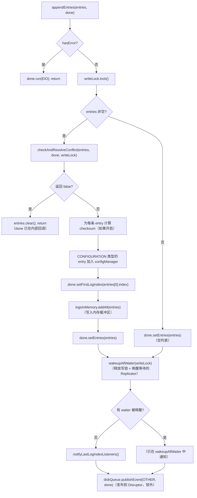

**关键设计：`logsInMemory.addAll()` 在 `diskQueue.publishEvent()` 之前**

日志先写入内存缓冲区，再异步写磁盘。这意味着 Replicator 可以立即从内存读取刚写入的日志，不需要等待磁盘写完。

---

#### 5.2 `checkAndResolveConflict()` 冲突检测

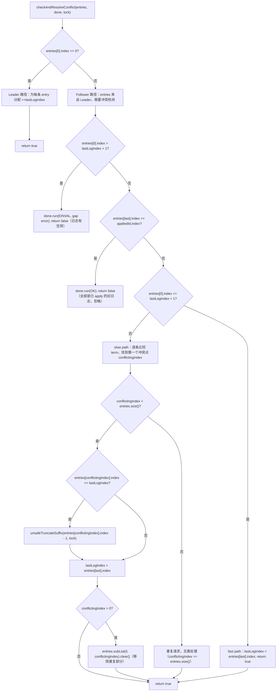

> 📌 **面试考点**：`checkAndResolveConflict()` 中 `entries[0].index == 0` 是 Leader 路径（由 LogManager 分配 index），`!= 0` 是 Follower 路径（index 由 Leader 指定，需要冲突检测）。

---

#### 5.3 磁盘写批量合并：`AppendBatcher`

```java
// StableClosureEventHandler 中
AppendBatcher ab = new AppendBatcher(storage, 256, new ArrayList<>(), diskId);

// onEvent() 中
if (done.getEntries() != null && !done.getEntries().isEmpty()) {
    this.ab.append(done);  // 追加到批次
} else {
    this.lastId = this.ab.flush();  // 遇到非 append 事件，先 flush 当前批次
    // 再处理 TRUNCATE_PREFIX / TRUNCATE_SUFFIX / RESET / LAST_LOG_ID
}
if (endOfBatch) {
    this.lastId = this.ab.flush();  // 批次结束，flush
    setDiskId(this.lastId);         // 更新 diskId，触发内存日志清理
}
```

**`AppendBatcher.flush()` 的逻辑**：

```java
LogId flush() {
    if (this.size > 0) {
        this.lastId = appendToStorage(this.toAppend);  // 批量写磁盘
        for (int i = 0; i < this.size; i++) {
            this.storage.get(i).getEntries().clear();
            // 回调每个 StableClosure（通知 Replicator 日志已落盘）
            this.storage.get(i).run(hasError ? new Status(RaftError.EIO, ...) : Status.OK());
        }
        this.toAppend.clear();
        this.storage.clear();
    }
    this.size = 0;
    this.bufferSize = 0;
    return this.lastId;
}
```

**`AppendBatcher` 的两个 flush 触发条件**：

```java
void append(final StableClosure done) {
    if (this.size == this.cap                                                              // 条件1：批次满（256条）
        || this.bufferSize >= LogManagerImpl.this.raftOptions.getMaxAppendBufferSize()) { // 条件2：数据量超限
        flush();
    }
    // ...
}
```

---

#### 5.4 `getEntry()` 的两级读取

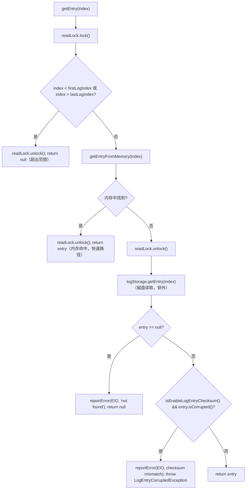

**`getEntryFromMemory()` 的不变式检查**：

```java
protected LogEntry getEntryFromMemory(final long index) {
    if (!this.logsInMemory.isEmpty()) {
        final long firstIndex = this.logsInMemory.peekFirst().getId().getIndex();
        final long lastIndex = this.logsInMemory.peekLast().getId().getIndex();
        // 不变式检查：logsInMemory 中的日志必须连续（无空洞）
        if (lastIndex - firstIndex + 1 != this.logsInMemory.size()) {
            throw new IllegalStateException(...);
        }
        if (index >= firstIndex && index <= lastIndex) {
            return this.logsInMemory.get((int) (index - firstIndex));  // O(1) 定位
        }
    }
    return null;
}
```

---

#### 5.5 `getLastLogIndex(isFlush=true)` 的同步等待

```java
public long getLastLogIndex(final boolean isFlush) {
    LastLogIdClosure c;
    this.readLock.lock();
    try {
        if (!isFlush) {
            return this.lastLogIndex;  // 直接返回内存值（可能比磁盘新）
        } else {
            if (this.lastLogIndex == this.lastSnapshotId.getIndex()) {
                return this.lastLogIndex;  // 特殊情况：日志为空，直接返回
            }
            c = new LastLogIdClosure();
        }
    } finally {
        this.readLock.unlock();
    }
    // 发布 LAST_LOG_ID 事件到 Disruptor，等待磁盘写线程处理完所有积压事件后回调
    offerEvent(c, EventType.LAST_LOG_ID);
    c.await();  // CountDownLatch 阻塞等待
    return c.lastLogId.getIndex();
}
```

**`isFlush=true` 的语义**：等待所有已提交到 Disruptor 的写操作都落盘后，再返回 `lastLogIndex`。这是一个"屏障"操作，用于需要精确知道磁盘状态的场景（如 Leader 选举时的 `getLastLogId(true)`）。

---

#### 5.6 完整的日志写入时序图

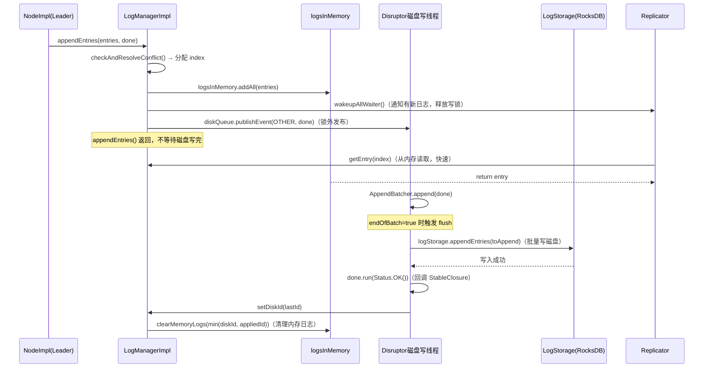

---

### 核心不变式总结

| # | 不变式 | 保证机制 |
|---|---|---|
| 1 | **`logsInMemory` 中的日志连续无空洞** | `checkAndResolveConflict()` 保证写入前无空洞；`getEntryFromMemory()` 中有显式检查，违反时抛 `IllegalStateException` |
| 2 | **内存日志只在"已落盘 AND 已 apply"后才清除** | `setDiskId()` 和 `setAppliedId()` 都计算 `min(diskId, appliedId)` 作为清除边界 |
| 3 | **`lastLogIndex` 单调递增** | Leader 路径：`++lastLogIndex` 分配；Follower 路径：`checkAndResolveConflict()` 中只有 `lastLogIndex = lastLogEntry.index`（不回退） |
| 4 | **磁盘写操作串行执行** | Disruptor 单消费者（`StableClosureEventHandler`），所有磁盘操作在同一线程中顺序执行 |
| 5 | **`wakeupAllWaiter()` 必须在锁外回调** | 先 `lock.unlock()`，再 `runInThread(runOnNewLog)`，防止回调中再次加锁导致死锁 |

---

### 面试高频考点 📌

1. **`logsInMemory` 的清除条件为什么是 `min(diskId, appliedId)`？** → 已落盘保证不丢失，已 apply 保证状态机不再需要从内存读取；两者都满足才能安全清除
2. **`appendEntries()` 为什么先写内存再写磁盘？** → Replicator 可以立即从内存读取刚写入的日志发给 Follower，不需要等待磁盘写完，降低复制延迟
3. **`checkAndResolveConflict()` 中 Leader 和 Follower 路径的区别？** → Leader 路径 `entries[0].index == 0`，由 LogManager 分配 index；Follower 路径 `!= 0`，index 由 Leader 指定，需要冲突检测和截断
4. **`getLastLogIndex(isFlush=true)` 的作用？** → 发布 `LAST_LOG_ID` 事件到 Disruptor，等待所有积压的磁盘写操作完成后返回，是一个"屏障"操作
5. **`TimeoutBlockingWaitStrategy` 和 `BlockingWaitStrategy` 的区别？** → LogManagerImpl 用超时策略，磁盘写超时时调用 `reportError()` 停止节点；FSMCallerImpl 用普通阻塞，状态机处理慢时只是积压，不停节点
6. **`wakeupAllWaiter()` 为什么先 unlock 再回调？** → 防止回调中 Replicator 再次调用 `wait()` 加写锁，与当前持锁形成死锁

### 生产踩坑 ⚠️

1. **`getEntryFromMemory()` 抛出 `IllegalStateException: logsInMemory 不连续`** → `logsInMemory` 中出现空洞，通常是 `checkAndResolveConflict()` 的 bug 或并发写入问题；需要检查 `appendEntries()` 的调用方是否在写锁外修改了 entries 的 index
2. **磁盘写超时触发 `reportError()`** → `TimeoutBlockingWaitStrategy` 超时，通常是磁盘 IO 卡顿（如 GC 停顿、磁盘满、RAID 重建）；可通过调大 `disruptorPublishEventWaitTimeoutSecs` 缓解，但根本原因需要排查磁盘性能
3. **`getLastLogIndex(isFlush=true)` 阻塞** → Disruptor 磁盘写线程卡住（磁盘 IO 慢），导致 `LAST_LOG_ID` 事件无法被处理；通常发生在 Leader 选举时，会导致选举超时
4. **`checkAndResolveConflict()` 返回 false（gap error）** → Follower 收到的 AppendEntries 请求中，`firstLogIndex > lastLogIndex + 1`，说明 Replicator 的 `nextIndex` 计算有误，或者 Follower 的日志被意外截断
5. **内存日志长时间不清除（`logsInMemory` 持续增长）** → `appliedId` 长时间不推进（状态机处理慢），导致 `min(diskId, appliedId)` 始终等于 `appliedId`，内存日志无法清除；需要监控 `jraft-logs-manager-logs-in-memory` 指标

---

### ⑥ 运行验证结论（真实数据佐证）

以下三个关键结论通过在源码中添加临时埋点日志、运行单元测试后得到真实数据验证。

---

#### 验证 1：`clearMemoryLogs` 的触发时机（`min(diskId, appliedId)`）

**测试**：`LogManagerTest#testSetAppliedId`

**埋点位置**：`setDiskId()` 和 `setAppliedId()` 中打印 `diskId`、`appliedId`、`clearId`

**真实输出**：
```
[PROBE][LogManager] setDiskId:    diskId=LogId[index=10,term=9]  appliedId=LogId[index=0,term=0]   clearId=LogId[index=0,term=0]  thread=JRaft-LogManager-Disruptor-0
[PROBE][LogManager] setAppliedId: diskId=LogId[index=10,term=9]  appliedId=LogId[index=10,term=10] clearId=LogId[index=10,term=9] thread=main
```

**结论验证**：
- `setDiskId` 先触发（磁盘写线程），此时 `appliedId=0`，`clearId = min(10,0) = 0`，**内存日志不清除**
- `setAppliedId` 后触发（main 线程），此时 `diskId=10`，`clearId = min(10,10) = diskId(index=10,term=9)`，**触发清除 index≤10 的内存日志**
- ✅ 验证了"必须同时满足已落盘 AND 已 apply 才清除"的不变式

---

#### 验证 2：`wakeupAllWaiter()` 先 unlock 再回调

**测试**：`LogManagerTest#testWaiter`

**埋点位置**：`wakeupAllWaiter()` 中在 `lock.unlock()` 前后各打印一条日志

**真实输出**：
```
[PROBE][LogManager] wakeupAllWaiter: 先unlock锁 waiterCount=1 thread=main
[PROBE][LogManager] wakeupAllWaiter: 锁已释放，开始异步回调 thread=main
```

**结论验证**：
- 两条日志都在 `main` 线程（`appendEntries` 调用方），确认 `lock.unlock()` 和 `runInThread(runOnNewLog)` 都在同一线程中顺序执行
- `lock.unlock()` 在 `runInThread` 之前，**先释放锁，再提交异步回调任务**
- ✅ 验证了"先 unlock 再回调"的设计，防止回调中 Replicator 再次加写锁导致死锁

---

#### 验证 3：`FSMCallerImpl` 批量合并效果（5 次 `onCommitted` 只触发 1 次 `doCommitted`）

**测试**：临时测试 `testBatchMergeCommitted`（连续发送 5 次 `onCommitted(11..15)`）

**埋点位置**：`runApplyTask()` 中每次收到 COMMITTED 事件时打印，`doCommitted` 被调用时打印

**真实输出**：
```
[PROBE][FSMCaller] 收到COMMITTED事件 committedIndex=11 当前maxCommittedIndex=11  endOfBatch=false
[PROBE][FSMCaller] 收到COMMITTED事件 committedIndex=12 当前maxCommittedIndex=12  endOfBatch=false
[PROBE][FSMCaller] 收到COMMITTED事件 committedIndex=13 当前maxCommittedIndex=13  endOfBatch=false
[PROBE][FSMCaller] 收到COMMITTED事件 committedIndex=14 当前maxCommittedIndex=14  endOfBatch=false
[PROBE][FSMCaller] 收到COMMITTED事件 committedIndex=15 当前maxCommittedIndex=15  endOfBatch=true
[PROBE][FSMCaller] endOfBatch触发: doCommitted(15)
```

**结论验证**：
- 5 次 `onCommitted(11..15)` 全部积压在 RingBuffer 中，消费者线程一次性处理整个批次
- 前 4 次 `endOfBatch=false`，只更新 `maxCommittedIndex`，**不触发 `doCommitted`**
- 第 5 次 `endOfBatch=true`，触发 `doCommitted(15)`，**一次性 apply index 11~15 的所有日志**
- ✅ 验证了"5 次 `onCommitted` 只触发 1 次 `doCommitted(15)`"的批量合并效果，与文档描述完全一致