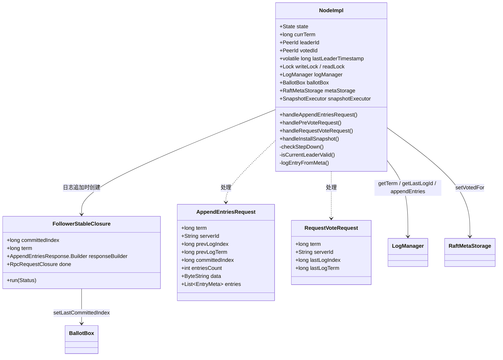

# S17：Follower 端 RPC 处理全景分析

> **核心问题**：Follower/Candidate 收到来自 Leader 或 Candidate 的 RPC 请求时，如何处理？每个分支走向什么逻辑？为什么这样设计？
>
> **涉及源码**：`NodeImpl.handleAppendEntriesRequest()`（第 1944 行）、`handleRequestVoteRequest()`（第 1802 行）、`handlePreVoteRequest()`（第 1701 行）、`handleInstallSnapshot()`（第 3356 行）、`checkStepDown()`（第 1243 行）、`FollowerStableClosure`（第 1875 行）、`logEntryFromMeta()`（第 2102 行）、`isCurrentLeaderValid()`（第 1787 行）
>
> **定位**：现有文档（03-选举、04-日志复制）主要从 **Leader/Candidate 发起端** 分析，本篇补充 **Follower/Candidate 接收端** 的完整处理逻辑。

---

## 目录

1. [解决什么问题](#1-解决什么问题)
2. [核心数据结构](#2-核心数据结构)
3. [handleAppendEntriesRequest — 心跳/探测/日志复制的统一入口](#3-handleappendentriesrequest--心跳探测日志复制的统一入口)
4. [FollowerStableClosure — 日志持久化后的回调](#4-followerstableclosure--日志持久化后的回调)
5. [handlePreVoteRequest — PreVote 请求处理](#5-handleprevoterequest--prevote-请求处理)
6. [handleRequestVoteRequest — 正式投票请求处理](#6-handlerequestvoterequest--正式投票请求处理)
7. [辅助方法深度分析](#7-辅助方法深度分析)
8. [四种 RPC 的横向对比](#8-四种-rpc-的横向对比)
9. [数据结构关系图](#9-数据结构关系图)
10. [核心不变式](#10-核心不变式)
11. [面试高频考点 📌](#11-面试高频考点-)
12. [生产踩坑 ⚠️](#12-生产踩坑-️)

---

## 1. 解决什么问题

Raft 协议中，节点之间通过 RPC 通信。**Follower（以及 Candidate）需要正确处理 4 种核心 RPC**：

| RPC | 发起方 | 目的 | 频率 |
|-----|-------|------|------|
| `AppendEntries`（空） | Leader | 心跳 / 探测 | 高（`electionTimeout / 10`） |
| `AppendEntries`（有日志） | Leader | 日志复制 | 高（写入时实时触发） |
| `PreVote` | Candidate | 预投票（不增加 term） | 低（选举超时后） |
| `RequestVote` | Candidate | 正式投票 | 低（PreVote 通过后） |
| `InstallSnapshot` | Leader | 安装快照（Follower 日志落后太多） | 极低（仅在追赶时） |

**核心挑战**：
1. **安全性**：不能给两个 Candidate 投票（同一 term 内 `votedFor` 唯一）
2. **活性**：不能因为过期请求阻塞正常选举
3. **一致性**：Follower 的日志必须与 Leader 保持一致（冲突时以 Leader 为准）
4. **并发安全**：多个 RPC 可能同时到达，需要正确的加锁策略

---

## 2. 核心数据结构

### 2.1 Follower 端处理 RPC 涉及的状态

| 字段 | 类型 | 位置 | 在 RPC 处理中的作用 |
|------|------|------|-------------------|
| `state` | `volatile State` | `NodeImpl.java:178` | 判断节点是否活跃（`isActive()`） |
| `currTerm` | `long` | `NodeImpl.java:180` | 与请求的 term 比较，决定是否 stepDown |
| `leaderId` | `PeerId` | `NodeImpl.java:181` | 记录当前 Leader，用于 PreVote 的 Leader 租约检查 |
| `votedId` | `PeerId` | `NodeImpl.java:182` | 记录本 term 投给了谁（一旦设置不可改变） |
| `lastLeaderTimestamp` | `volatile long` | `NodeImpl.java:179` | 最近一次收到 Leader 有效消息的时间戳 |
| `logManager` | `LogManager` | `NodeImpl.java:198` | 获取本地日志信息（term、lastLogIndex） |
| `metaStorage` | `RaftMetaStorage` | `NodeImpl.java:196` | 持久化 `votedFor` |
| `ballotBox` | `BallotBox` | `NodeImpl.java:200` | 更新 `lastCommittedIndex` |
| `snapshotExecutor` | `SnapshotExecutor` | `NodeImpl.java:201` | 检查是否正在安装快照 |
| `writeLock` | `Lock` | `NodeImpl.java:173` | **所有 RPC 处理都在 writeLock 保护下** |

### 2.2 `FollowerStableClosure`（`NodeImpl.java:1875-1941`）

**【问题】** Follower 收到日志后，持久化是异步的。持久化完成后如何安全地回复响应？

**【推导】** 需要一个回调对象，携带：① 本次请求的 `committedIndex`（用于推进 Follower 的 commitIndex）；② 响应构建器；③ 发送时的 `term`（用于防止 term 变化后回复错误响应）

```java
// NodeImpl.java 第 1875-1899 行
private static class FollowerStableClosure extends LogManager.StableClosure {

    final long                          committedIndex;     // min(request.committedIndex, prevLogIndex + entriesCount)
    final AppendEntriesResponse.Builder responseBuilder;
    final NodeImpl                      node;
    final RpcRequestClosure             done;               // RPC 响应发送器
    final long                          term;               // 创建时的 currTerm，用于 ABA 检测

    public FollowerStableClosure(final AppendEntriesRequest request,
                                 final AppendEntriesResponse.Builder responseBuilder, final NodeImpl node,
                                 final RpcRequestClosure done, final long term) {
        super(null);
        this.committedIndex = Math.min(
            request.getCommittedIndex(),
            // ★ 关键设计：只能提交到 prevLogIndex + entriesCount，
            // 超出本次追加范围的日志不可信（可能被新 Leader 截断）
            request.getPrevLogIndex() + request.getEntriesCount());
        this.responseBuilder = responseBuilder;
        this.node = node;
        this.done = done;
        this.term = term;
    }
}
```

**`committedIndex` 的计算**：`Math.min(request.getCommittedIndex(), request.getPrevLogIndex() + request.getEntriesCount())`。这是一个关键的安全约束——Follower 不能提交超出本次追加范围的日志。原因在源码注释中说明："The logs after the appended entries can not be trust, so we can't commit them even if their indexes are less than request's committed index."

---

## 3. handleAppendEntriesRequest — 心跳/探测/日志复制的统一入口

**源码位置**：`NodeImpl.java:1944-2099`

**并发保护**：方法入口**加 `writeLock`**，日志追加前释放锁（异步持久化），持久化完成后在 `FollowerStableClosure.run()` 中**加 `readLock`** 做 ABA 检测。

### 3.1 分支穷举清单

| # | 条件 | 结果 | 说明 |
|---|------|------|------|
| 1 | `!state.isActive()` | 返回 `EINVAL` 错误响应 | 节点已 shutdown |
| 2 | `serverId.parse()` 失败 | 返回 `EINVAL` 错误响应 | Leader 的 serverId 格式错误 |
| 3 | `request.getTerm() < currTerm` | 返回 `{success=false, term=currTerm}` | **过期 term 的请求直接拒绝** |
| 4 | `checkStepDown()` 后 `serverId != leaderId` | `stepDown(term+1)`，返回 `{success=false, term=term+1}` | **双 Leader 冲突**，强制双方 stepDown |
| 5 | `entriesCount > 0 && isInstallingSnapshot()` | 返回 `EBUSY` 错误响应 | 正在安装快照，拒绝日志追加 |
| 6 | `localPrevLogTerm != prevLogTerm` | 返回 `{success=false, term=currTerm, lastLogIndex}` | **日志不匹配**，Leader 需要回退 |
| 7 | `entriesCount == 0`（心跳/探测） | 返回 `{success=true, term=currTerm, lastLogIndex}` + `setLastCommittedIndex()` | 心跳成功 |
| 8 | `!logManager.hasAvailableCapacityToAppendEntries(1)` | 返回 `EBUSY` 错误响应 | **日志管理器过载**（背压机制） |
| 9 | 日志解析中 `logEntry.isCorrupted()` | 返回 `EINVAL` 错误响应 | **校验和不匹配**，日志损坏 |
| 10 | 正常日志追加 | 创建 `FollowerStableClosure`，调用 `logManager.appendEntries()`，返回 `null`（异步响应） | 日志持久化后由 closure 回复 |

### 3.2 完整流程（逐段分析）

#### 阶段一：前置检查（第 1944-1976 行）

```java
// NodeImpl.java 第 1944-1976 行
public Message handleAppendEntriesRequest(final AppendEntriesRequest request, final RpcRequestClosure done) {
    boolean doUnlock = true;
    final long startMs = Utils.monotonicMs();
    this.writeLock.lock();                    // ★ 加 writeLock
    final int entriesCount = request.getEntriesCount();
    try {
        // ① 活跃性检查
        if (!this.state.isActive()) {
            return /* EINVAL response */;
        }

        // ② 解析 Leader 的 serverId
        final PeerId serverId = new PeerId();
        if (!serverId.parse(request.getServerId())) {
            return /* EINVAL response */;
        }

        // ③ term 过期检查（Raft 论文 Figure 2: Reply false if term < currentTerm）
        if (request.getTerm() < this.currTerm) {
            return AppendEntriesResponse.newBuilder()
                .setSuccess(false)
                .setTerm(this.currTerm)       // ★ 携带自己的 term，让过期 Leader 发现更高 term 并 stepDown
                .build();
        }
```

**设计决策**：term 过期时返回 `{success=false, term=currTerm}`，而不是简单忽略。这是为了让过期 Leader 尽快发现自己已过期并 stepDown，减少脑裂时间。

#### 阶段二：stepDown + Leader 冲突检测（第 1977-1994 行）

```java
        // ④ 检查是否需要 stepDown（如果请求的 term 更高，或者自己是 Candidate）
        checkStepDown(request.getTerm(), serverId);

        // ⑤ 双 Leader 冲突检测
        if (!serverId.equals(this.leaderId)) {
            // 另一个 peer 声称自己是 Leader，但 leaderId 已经被设置为其他节点
            // → 强制 term + 1，让双方都 stepDown
            stepDown(request.getTerm() + 1, false,
                new Status(RaftError.ELEADERCONFLICT, "More than one leader in the same term."));
            return AppendEntriesResponse.newBuilder()
                .setSuccess(false)
                .setTerm(request.getTerm() + 1)    // ★ term + 1 确保双方都 stepDown
                .build();
        }

        // ⑥ 更新 Leader 时间戳（用于 PreVote 的 Leader 租约检查）
        updateLastLeaderTimestamp(Utils.monotonicMs());
```

**`checkStepDown()` 的三种触发条件**（详见[第 7 节](#7-辅助方法深度分析)）：
1. `requestTerm > currTerm` → 新 Leader 出现，stepDown
2. 自己是 `Candidate` → 有 Leader 了，stepDown 成 Follower
3. 自己是 `Follower` 但 `leaderId` 为空 → 第一次发现 Leader，stepDown（重置选举定时器）

**双 Leader 冲突**：这是一种极端情况——同一 term 内出现两个 Leader（理论上 Raft 协议保证不会发生，但代码做了防御性编程）。处理方式是让 `term + 1`，强迫双方重新选举。

#### 阶段三：日志一致性检查（第 1995-2020 行）

```java
        // ⑦ 正在安装快照时拒绝日志追加
        if (entriesCount > 0 && this.snapshotExecutor != null && this.snapshotExecutor.isInstallingSnapshot()) {
            return /* EBUSY response */;
        }

        // ⑧ prevLog 一致性检查（Raft 论文 Figure 2: Reply false if log doesn't contain entry at prevLogIndex）
        final long prevLogIndex = request.getPrevLogIndex();
        final long prevLogTerm = request.getPrevLogTerm();
        final long localPrevLogTerm = this.logManager.getTerm(prevLogIndex);
        if (localPrevLogTerm != prevLogTerm) {
            final long lastLogIndex = this.logManager.getLastLogIndex();
            return AppendEntriesResponse.newBuilder()
                .setSuccess(false)
                .setTerm(this.currTerm)
                .setLastLogIndex(lastLogIndex)    // ★ JRaft 优化：携带 lastLogIndex 帮助 Leader 快速回退
                .build();
        }
```

**日志不匹配的两种情况**：
1. `localPrevLogTerm == 0`（本地没有 `prevLogIndex` 对应的日志）→ Follower 日志太短
2. `localPrevLogTerm != prevLogTerm`（同一 index 不同 term）→ 日志冲突，需要截断

**JRaft 优化**：论文中 Leader 回退 `nextIndex` 是逐条回退（每次 -1）。JRaft 在响应中携带 `lastLogIndex`，Leader 可以直接跳到 `lastLogIndex + 1`，大幅减少回退次数。

#### 阶段四：心跳/探测处理（第 2021-2033 行）

```java
        // ⑨ entriesCount == 0 → 心跳或探测
        if (entriesCount == 0) {
            final AppendEntriesResponse.Builder respBuilder = AppendEntriesResponse.newBuilder()
                .setSuccess(true)
                .setTerm(this.currTerm)
                .setLastLogIndex(this.logManager.getLastLogIndex());
            doUnlock = false;
            this.writeLock.unlock();                       // ★ 先释放锁
            // 更新 committedIndex（无需持锁，BallotBox 线程安全）
            this.ballotBox.setLastCommittedIndex(Math.min(request.getCommittedIndex(), prevLogIndex));
            return respBuilder.build();
        }
```

**为什么心跳也要更新 `committedIndex`？** 因为 Leader 的 `committedIndex` 可能在两次心跳之间推进了（其他 Follower 的 ACK 让 quorum 达成），Follower 需要通过心跳得知最新的 `committedIndex`。

**`Math.min(request.getCommittedIndex(), prevLogIndex)` 的含义**：心跳的 `prevLogIndex` 是 Leader 认为 Follower 已有的最大日志 index。Follower 不能提交超过 `prevLogIndex` 的日志——因为超出部分可能还没确认。

#### 阶段五：日志解析与追加（第 2034-2089 行）

```java
        // ⑩ 日志管理器背压检查
        if (!this.logManager.hasAvailableCapacityToAppendEntries(1)) {
            return /* EBUSY response */;
        }

        // ⑪ 解析日志条目
        long index = prevLogIndex;
        final List<LogEntry> entries = new ArrayList<>(entriesCount);
        ByteBuffer allData = null;
        if (request.hasData()) {
            allData = request.getData().asReadOnlyByteBuffer();
        }

        for (int i = 0; i < entriesCount; i++) {
            index++;
            final RaftOutter.EntryMeta entry = entriesList.get(i);
            final LogEntry logEntry = logEntryFromMeta(index, allData, entry);

            if (logEntry != null) {
                // ⑫ 校验和验证
                if (this.raftOptions.isEnableLogEntryChecksum() && logEntry.isCorrupted()) {
                    return /* EINVAL response：日志损坏 */;
                }
                entries.add(logEntry);
            }
        }

        // ⑬ 异步追加日志（核心操作）
        final FollowerStableClosure closure = new FollowerStableClosure(
            request,
            AppendEntriesResponse.newBuilder().setTerm(this.currTerm),
            this, done, this.currTerm);
        this.logManager.appendEntries(entries, closure);    // ★ 异步持久化
        // ⑭ 更新配置
        checkAndSetConfiguration(true);
        return null;    // ★ 返回 null 表示异步响应（由 closure 负责发送）
```

**`return null` 的含义**：JRaft 的 RPC 框架约定——返回 `null` 表示不在当前线程回复响应，由 `RpcRequestClosure.sendResponse()` 异步回复。这是与心跳处理的关键区别：心跳是同步返回（`return respBuilder.build()`），日志追加是异步返回。

**`logEntryFromMeta()` 的解析逻辑**：从 `EntryMeta`（元数据）和 `allData`（共享的 ByteBuffer）中重建 `LogEntry`。所有日志的 data 部分被打包成一个 ByteBuffer，每条日志的 `dataLen` 指定从中读取多少字节。这是一个零拷贝优化。

**`checkAndSetConfiguration(true)` 的参数 `true`**：`true` 表示调用者是 Follower（`fromLogManager`），会在日志追加后检查是否有新的配置变更日志需要应用。

---

## 4. FollowerStableClosure — 日志持久化后的回调

**源码位置**：`NodeImpl.java:1875-1941`

### 4.1 分支穷举清单

| # | 条件 | 结果 | 说明 |
|---|------|------|------|
| 1 | `!status.isOk()` | `done.run(status)` — RPC 框架错误回复 | 日志持久化失败 |
| 2 | `term != node.currTerm` | 返回 `{success=false, term=node.currTerm}` | **ABA 问题**：持久化期间 term 变了 |
| 3 | 正常 | 返回 `{success=true, term=term}` + `setLastCommittedIndex()` | 成功 |

### 4.2 源码逐行注释

```java
// NodeImpl.java 第 1902-1941 行
@Override
public void run(final Status status) {
    // ① 持久化失败 → 直接回复错误
    if (!status.isOk()) {
        this.done.run(status);
        return;
    }

    // ② ABA 检测：持久化期间 term 是否变了？
    this.node.readLock.lock();      // ★ 用 readLock 而非 writeLock（只读检测）
    try {
        if (this.term != this.node.currTerm) {
            // term 变了，说明持久化期间 Leader 已经切换。
            // 此时不能返回 success，因为：
            //   - 如果新 Leader 会截断这些日志 → 我们返回 success → 旧 Leader 认为已提交 → 违反安全性
            //   - 如果新 Leader 不会截断 → 我们返回 failure → 也不影响正确性（新 Leader 会重新确认）
            // 所以必须返回 failure（安全第一）
            this.responseBuilder.setSuccess(false).setTerm(this.node.currTerm);
            this.done.sendResponse(this.responseBuilder.build());
            return;
        }
    } finally {
        this.node.readLock.unlock();
    }

    // ③ 正常：日志持久化成功 + term 未变
    this.responseBuilder.setSuccess(true).setTerm(this.term);

    // ④ 推进 commitIndex（BallotBox 线程安全，允许乱序调用）
    this.node.ballotBox.setLastCommittedIndex(this.committedIndex);

    // ⑤ 发送响应
    this.done.sendResponse(this.responseBuilder.build());
}
```

**为什么用 `readLock` 而不是 `writeLock`？** 这里只需要读取 `currTerm` 进行比较，不需要修改任何状态。用 `readLock` 可以与其他读操作并行，提升并发性。

**ABA 问题的详细解释**（源码注释翻译）：
> 如果持久化期间 term 变了，说明 Leader 发生了切换。这些日志可能被新 Leader 截断。如果我们返回 success 给旧 Leader，旧 Leader 可能认为这些日志已被多数派确认（在 3 节点集群中非常可能），进而告诉客户端写入成功。但如果新 Leader 后来截断了这些日志，就违反了"已提交的日志不会被截断"这一 Raft 核心安全性保证。所以必须返回 failure。

---

## 5. handlePreVoteRequest — PreVote 请求处理

**源码位置**：`NodeImpl.java:1701-1786`

**设计目的**：PreVote 是 Raft 的扩展机制（Diego Ongaro 博士论文 §9.6）。Candidate 在正式发起选举之前，先发 PreVote 探测是否能获得多数票。PreVote **不增加 term**，不改变 `votedFor`，不触发 stepDown。

### 5.1 分支穷举清单

| # | 条件 | 结果 | 说明 |
|---|------|------|------|
| 1 | `!state.isActive()` | 返回 `EINVAL` 错误响应 | 节点不活跃 |
| 2 | `candidateId.parse()` 失败 | 返回 `EINVAL` 错误响应 | candidateId 格式错误 |
| 3 | `!conf.contains(candidateId)` | `granted=false` | **不在集群配置中**，忽略 |
| 4 | `leaderId` 非空 **且** `isCurrentLeaderValid()` | `granted=false` | **Leader 租约有效**，拒绝 PreVote（防止被移除节点干扰） |
| 5 | `request.getTerm() < currTerm` | `granted=false` + `checkReplicator()` | term 过期，拒绝 |
| 6 | `requestLastLogId < lastLogId` | `granted=false` | **日志不够新**（Election Restriction） |
| 7 | `requestLastLogId >= lastLogId` | `granted=true` | **同意 PreVote** |

### 5.2 源码逐行注释

```java
// NodeImpl.java 第 1701-1786 行
public Message handlePreVoteRequest(final RequestVoteRequest request) {
    boolean doUnlock = true;
    this.writeLock.lock();
    try {
        // ① 活跃性检查 + candidateId 解析（同上）
        // ...

        boolean granted = false;
        do {
            // ② 集群配置检查：candidate 不在 conf 中 → 拒绝
            if (!this.conf.contains(candidateId)) {
                break;
            }

            // ③ Leader 租约检查（★ PreVote 独有，正式投票没有这个检查）
            if (this.leaderId != null && !this.leaderId.isEmpty() && isCurrentLeaderValid()) {
                // 当前 Leader 的租约仍然有效（最近收到过心跳）
                // → 拒绝 PreVote（论文：disregard RequestVote when believing a leader exists）
                break;
            }

            // ④ term 检查（注意：PreVote 不 stepDown，只检查 term）
            if (request.getTerm() < this.currTerm) {
                checkReplicator(candidateId);    // 确保该节点的 Replicator 存在
                break;
            }
            checkReplicator(candidateId);

            // ⑤ 释放锁获取 lastLogId（可能涉及磁盘 IO）
            doUnlock = false;
            this.writeLock.unlock();
            final LogId lastLogId = this.logManager.getLastLogId(true);
            doUnlock = true;
            this.writeLock.lock();

            // ⑥ 日志新旧度检查（Election Restriction）
            final LogId requestLastLogId = new LogId(request.getLastLogIndex(), request.getLastLogTerm());
            granted = requestLastLogId.compareTo(lastLogId) >= 0;
        } while (false);    // ★ do-while(false) 模式：用 break 代替 if-else 嵌套

        return RequestVoteResponse.newBuilder()
            .setTerm(this.currTerm)
            .setGranted(granted)
            .build();
    } finally {
        if (doUnlock) { this.writeLock.unlock(); }
    }
}
```

**PreVote 与 Vote 的 3 个关键区别**：

| 维度 | PreVote | Vote |
|------|---------|------|
| **term 处理** | 不 stepDown，不增加自己的 term | 如果 `request.term > currTerm`，stepDown 并更新 term |
| **Leader 租约** | 检查 `isCurrentLeaderValid()` | **不检查**（正式投票时已经确认 Leader 不存在） |
| **votedFor** | 不修改 `votedId` | 设置 `votedId = candidateId` 并持久化 |

**`do-while(false)` 模式**：这是 C/C++ 常用的编程模式，在 Java 中较少见。用 `break` 跳出代替多层嵌套 `if-else`，使代码更扁平、可读性更好。

**`checkReplicator(candidateId)` 的作用**：如果当前节点是 Leader，确保 candidate 对应的 Replicator 已启动。这是一个防御性操作——当 Leader 刚当选但还没来得及启动所有 Follower 的 Replicator 时，收到了某个 Follower 的 PreVote，这里确保该 Follower 的 Replicator 被创建。

---

## 6. handleRequestVoteRequest — 正式投票请求处理

**源码位置**：`NodeImpl.java:1802-1874`

### 6.1 分支穷举清单

| # | 条件 | 结果 | 说明 |
|---|------|------|------|
| 1 | `!state.isActive()` | 返回 `EINVAL` 错误响应 | 节点不活跃 |
| 2 | `candidateId.parse()` 失败 | 返回 `EINVAL` 错误响应 | candidateId 格式错误 |
| 3 | `request.getTerm() < currTerm` | `granted=false` | term 过期，拒绝 |
| 4 | `request.getTerm() > currTerm` | `stepDown(requestTerm)` | 发现更高 term，stepDown（重置 votedId） |
| 5 | `request.getTerm() == currTerm` 但 ABA 检测失败（unlock 后 term 变了） | `granted=false` | 并发安全 |
| 6 | `requestLastLogId < lastLogId` | `granted=false` | **日志不够新**（Election Restriction） |
| 7 | `logIsOk && votedId 为空` | `stepDown` + `votedId = candidateId` + 持久化 | **投票成功** |
| 8 | `logIsOk && votedId 不为空` | `granted=false`（因为 `candidateId != votedId`） | 已投给其他 Candidate |

### 6.2 源码逐行注释

```java
// NodeImpl.java 第 1802-1874 行
public Message handleRequestVoteRequest(final RequestVoteRequest request) {
    boolean doUnlock = true;
    this.writeLock.lock();
    try {
        // ① 活跃性检查 + candidateId 解析
        // ...

        do {
            // ② term 检查
            if (request.getTerm() >= this.currTerm) {
                if (request.getTerm() > this.currTerm) {
                    // ★ 发现更高 term → stepDown（重置 votedId 为空）
                    stepDown(request.getTerm(), false,
                        new Status(RaftError.EHIGHERTERMRESPONSE, "..."));
                }
            } else {
                // term 过期 → 直接拒绝
                break;
            }

            // ③ 释放锁获取 lastLogId（可能涉及磁盘 IO）
            doUnlock = false;
            this.writeLock.unlock();
            final LogId lastLogId = this.logManager.getLastLogId(true);
            doUnlock = true;
            this.writeLock.lock();

            // ④ ABA 检测：释放锁期间 term 可能又变了
            if (request.getTerm() != this.currTerm) {
                break;
            }

            // ⑤ Election Restriction 检查
            final boolean logIsOk = new LogId(request.getLastLogIndex(), request.getLastLogTerm())
                .compareTo(lastLogId) >= 0;

            // ⑥ 投票决策
            if (logIsOk && (this.votedId == null || this.votedId.isEmpty())) {
                // 日志够新 + 本 term 还没投票 → 投给 candidate
                stepDown(request.getTerm(), false,
                    new Status(RaftError.EVOTEFORCANDIDATE, "..."));
                this.votedId = candidateId.copy();         // ★ 设置 votedId
                this.metaStorage.setVotedFor(candidateId); // ★ 持久化（crash-safe）
            }
        } while (false);

        // ⑦ 构建响应
        return RequestVoteResponse.newBuilder()
            .setTerm(this.currTerm)
            .setGranted(request.getTerm() == this.currTerm && candidateId.equals(this.votedId))
            .build();
    } finally {
        if (doUnlock) { this.writeLock.unlock(); }
    }
}
```

**`granted` 的计算方式**：不是用一个 `granted` 变量追踪，而是在最终返回时统一计算：`request.getTerm() == currTerm && candidateId.equals(votedId)`。这意味着只有当：① 请求的 term 等于当前 term；② `votedId` 等于这个 candidate。两个条件同时满足才 grant。这种设计避免了在多个分支中手动维护 `granted` 变量。

**为什么投票时还要 `stepDown()`？** 即使当前已经是 Follower，投票时也要 stepDown——其作用是**重置选举定时器**。这样做是合理的：既然刚投了票给某个 Candidate，应该给它足够的时间来赢得选举，而不是自己也超时发起选举。

**ABA 检测的必要性**：获取 `lastLogId` 时需要释放 `writeLock`（因为可能涉及磁盘 IO，不能长时间持锁）。释放期间另一个 RPC 可能已经修改了 `currTerm`。所以重新加锁后必须检查 `request.getTerm() != currTerm`，如果 term 变了就放弃投票。

---

## 7. 辅助方法深度分析

### 7.1 `checkStepDown()` — 收到 Leader 消息时的状态调整

**源码位置**：`NodeImpl.java:1243-1258`

```java
// NodeImpl.java 第 1243-1258 行
private void checkStepDown(final long requestTerm, final PeerId serverId) {
    final Status status = new Status();
    if (requestTerm > this.currTerm) {
        // ① 更高 term → 新 Leader 出现
        status.setError(RaftError.ENEWLEADER, "Raft node receives message from new leader with higher term.");
        stepDown(requestTerm, false, status);
    } else if (this.state != State.STATE_FOLLOWER) {
        // ② 自己是 Candidate，同 term 的 Leader 出现 → 选举失败
        status.setError(RaftError.ENEWLEADER, "Candidate receives message from new leader with the same term.");
        stepDown(requestTerm, false, status);
    } else if (this.leaderId.isEmpty()) {
        // ③ 自己是 Follower 但 leaderId 为空 → 第一次发现 Leader
        status.setError(RaftError.ENEWLEADER, "Follower receives message from new leader with the same term.");
        stepDown(requestTerm, false, status);
    }
    // ④ 设置 leaderId
    if (this.leaderId == null || this.leaderId.isEmpty()) {
        resetLeaderId(serverId, status);
    }
}
```

**三种 stepDown 情况**：

| 条件 | 说明 | stepDown 的效果 |
|------|------|---------------|
| `requestTerm > currTerm` | 发现更高 term | 更新 term + 清除 votedId + 重置选举定时器 |
| `state != FOLLOWER` | 自己是 Candidate/Leader | 变为 Follower + 重置选举定时器 |
| `leaderId.isEmpty()` | 第一次识别 Leader | 重置选举定时器（重要：防止刚启动的 Follower 过早选举） |

### 7.2 `isCurrentLeaderValid()` — Leader 租约检查

**源码位置**：`NodeImpl.java:1787-1789`

```java
// NodeImpl.java 第 1787-1789 行
private boolean isCurrentLeaderValid() {
    return Utils.monotonicMs() - this.lastLeaderTimestamp < this.options.getElectionTimeoutMs();
}
```

**含义**：如果距离上次收到 Leader 的有效消息不超过 `electionTimeoutMs`，则认为 Leader 仍然有效。这个时间窗口与选举超时一致，是 PreVote 的 Leader 租约基础。

**`lastLeaderTimestamp` 的更新时机**：
1. `handleAppendEntriesRequest()` 中通过 `updateLastLeaderTimestamp()`（心跳和日志复制都会更新）
2. `checkStepDown()` 中发现新 Leader 时

### 7.3 `logEntryFromMeta()` — 从请求中解析日志条目

**源码位置**：`NodeImpl.java:2102-2135`

```java
// NodeImpl.java 第 2102-2135 行
private LogEntry logEntryFromMeta(final long index, final ByteBuffer allData, final RaftOutter.EntryMeta entry) {
    if (entry.getType() != EnumOutter.EntryType.ENTRY_TYPE_UNKNOWN) {
        final LogEntry logEntry = new LogEntry();
        logEntry.setId(new LogId(index, entry.getTerm()));
        logEntry.setType(entry.getType());
        if (entry.hasChecksum()) {
            logEntry.setChecksum(entry.getChecksum());    // since 1.2.6
        }
        final long dataLen = entry.getDataLen();
        if (dataLen > 0) {
            final byte[] bs = new byte[(int) dataLen];
            assert allData != null;
            allData.get(bs, 0, bs.length);    // ★ 从共享 ByteBuffer 中顺序读取
            logEntry.setData(ByteBuffer.wrap(bs));
        }

        if (entry.getPeersCount() > 0) {
            // 配置变更日志：解析 peers 和 learners
            if (entry.getType() != EnumOutter.EntryType.ENTRY_TYPE_CONFIGURATION) {
                throw new IllegalStateException("...");
            }
            fillLogEntryPeers(entry, logEntry);
        } else if (entry.getType() == EnumOutter.EntryType.ENTRY_TYPE_CONFIGURATION) {
            throw new IllegalStateException("...");    // 配置日志必须有 peers
        }
        return logEntry;
    }
    return null;    // UNKNOWN 类型 → 跳过
}
```

**共享 ByteBuffer 的设计**：Leader 发送 `AppendEntriesRequest` 时，把所有日志的 data 合并为一个 `ByteString`（`request.data`）。每条日志在 `EntryMeta` 中记录 `dataLen`。Follower 解析时从 `allData` 中顺序读取各条日志的数据。这是一个**零拷贝 + 批量传输**的优化，减少了 Protobuf 消息中的重复字段开销。

---

## 8. 四种 RPC 的横向对比

| 维度 | AppendEntries | PreVote | RequestVote | InstallSnapshot |
|------|--------------|---------|-------------|----------------|
| **加锁** | writeLock（日志追加前释放） | writeLock（获取 lastLogId 时释放） | writeLock（获取 lastLogId 时释放） | writeLock |
| **修改 term** | 通过 checkStepDown | ❌ 不修改 | 通过 stepDown | 通过 checkStepDown |
| **修改 votedId** | ❌ | ❌ | ✅ 持久化 | ❌ |
| **修改 leaderId** | ✅（checkStepDown → resetLeaderId） | ❌ | ❌ | ✅ |
| **更新 Leader 时间戳** | ✅ `updateLastLeaderTimestamp()` | ❌ | ❌ | ✅ |
| **推进 commitIndex** | ✅ `setLastCommittedIndex()` | ❌ | ❌ | ❌ |
| **响应方式** | 心跳同步 / 日志异步 | 同步 | 同步 | 异步 |
| **双 Leader 检测** | ✅ `serverId != leaderId` → term+1 | ❌ | ❌ | ❌ |

---

## 9. 数据结构关系图



---

## 10. 核心不变式

1. **同一 term 内 `votedId` 唯一**：一旦 `votedId` 被设置并持久化，本 term 内不会再投给其他 Candidate（`NodeImpl.java:1857`）
2. **`currTerm` 只增不减**：`stepDown()` 只会将 term 设为 ≥ 当前值（`NodeImpl.java:1243-1258`）
3. **Follower 只接受 `term >= currTerm` 的 AppendEntries**：`term < currTerm` 直接拒绝（`NodeImpl.java:1970`）
4. **日志一致性**：Follower 只在 `prevLogTerm` 匹配时接受新日志（`NodeImpl.java:2004`）
5. **PreVote 不改变状态**：不修改 `term`、`votedId`、`state`（只读判断）
6. **Leader 租约阻止 PreVote**：有效 Leader 存在时拒绝 PreVote（`NodeImpl.java:1728`）
7. **FollowerStableClosure 的 ABA 检测**：持久化完成后检查 term 是否变化，变化则返回 failure（`NodeImpl.java:1910`）

---

## 11. 面试高频考点 📌

1. **Follower 收到 AppendEntries 后的完整处理流程是什么？**
   → ① 检查 term → ② checkStepDown → ③ 双 Leader 检测 → ④ prevLog 一致性检查 → ⑤ 如果是心跳直接回复 → ⑥ 解析日志 → ⑦ 异步追加 + FollowerStableClosure 回调

2. **PreVote 和 Vote 的区别是什么？**
   → PreVote 不增加 term、不修改 votedFor、检查 Leader 租约；Vote 会 stepDown、设置 votedFor 并持久化

3. **为什么 PreVote 要检查 Leader 租约？**
   → 防止被移除的节点不断发起选举干扰集群（论文 §6 的第三个附加问题）。如果 Follower 认为 Leader 仍然有效，就拒绝 PreVote

4. **FollowerStableClosure 中的 ABA 问题是什么？为什么要检测？**
   → 日志持久化是异步的，持久化期间 term 可能变化（新 Leader 当选）。如果返回 success 给旧 Leader，旧 Leader 可能认为日志已被多数派确认，导致已"提交"的日志被新 Leader 截断，违反安全性

5. **`commitIndex = Math.min(request.getCommittedIndex(), prevLogIndex + entriesCount)` 为什么取 min？**
   → 不能提交超出本次追加范围的日志。本次追加范围之后的日志虽然 index 小于 Leader 的 committedIndex，但可能是旧 Leader 残留的、即将被截断的日志

6. **双 Leader 冲突（`serverId != leaderId`）是怎么处理的？**
   → `stepDown(term + 1)`，让 term 增加 1，强迫两个 Leader 都 stepDown，然后重新选举。这是一个理论上不应该发生的情况（Raft 保证同一 term 最多一个 Leader），但做了防御性编程

7. **`handleRequestVoteRequest` 中为什么要释放锁获取 lastLogId？**
   → `logManager.getLastLogId(true)` 的 `true` 参数表示需要 flush 磁盘（确保获取到最新的持久化日志），可能涉及磁盘 IO，不应在持锁时执行。释放后重新加锁需要 ABA 检测

---

## 12. 生产踩坑 ⚠️

1. **日志管理器过载导致 `EBUSY`**：高写入压力下，Follower 的 `logManager.hasAvailableCapacityToAppendEntries(1)` 返回 false，Leader 收到 EBUSY 后会短暂 block 并重试。这会导致日志复制延迟增大，极端情况下可能触发选举超时

2. **校验和不匹配**：网络传输中数据损坏（极罕见），`logEntry.isCorrupted()` 检测到后返回 EINVAL。Leader 会重试发送，但如果问题持续说明网络或硬件有故障

3. **快照安装与日志追加冲突**：Follower 正在安装快照时收到 `AppendEntries`（`entriesCount > 0`），返回 EBUSY。这在新节点加入集群且日志落后很多时经常发生。Leader 需要等待快照安装完成再继续复制日志

4. **PreVote 被 Leader 租约拒绝导致选举延迟**：网络分区恢复后，被隔离的节点的 `lastLeaderTimestamp` 已过期，正常节点的 `lastLeaderTimestamp` 仍然有效（Leader 一直在发心跳）。此时被隔离节点发起 PreVote 会被拒绝，需要等待 Leader 的选举超时窗口过期

5. **`do-while(false)` 模式的陷阱**：JRaft 在 PreVote 和 Vote 处理中大量使用 `do-while(false)` + `break`。这种模式虽然代码扁平，但 `break` 后 `granted` 默认为 `false`，容易漏掉正常路径的赋值。阅读源码时需要特别关注每个 `break` 点的 `granted` 值

---

## 总结

### 数据结构层面

| 结构 | 核心特征 |
|------|---------|
| `FollowerStableClosure` | 日志异步持久化的回调，携带 `term` 用于 ABA 检测，`committedIndex` 限制在本次追加范围内 |
| `AppendEntriesRequest` | 心跳/探测/日志复制的统一载体，`entriesCount == 0` 为心跳 |
| `RequestVoteRequest` | 投票请求，携带 `lastLogIndex/lastLogTerm` 用于 Election Restriction |

### 算法层面

| 算法 | 核心设计决策 |
|------|------------|
| AppendEntries 处理 | 同步前置检查 + 异步日志追加 + 回调发送响应，`writeLock` 在追加前释放 |
| PreVote 处理 | 只读判断（不改状态），Leader 租约检查防止被移除节点干扰 |
| RequestVote 处理 | 发现更高 term 先 stepDown（重置 votedId），然后检查日志新旧度和 votedId |
| ABA 检测 | 释放锁获取磁盘数据后，重新加锁检查 term 是否变化 |
