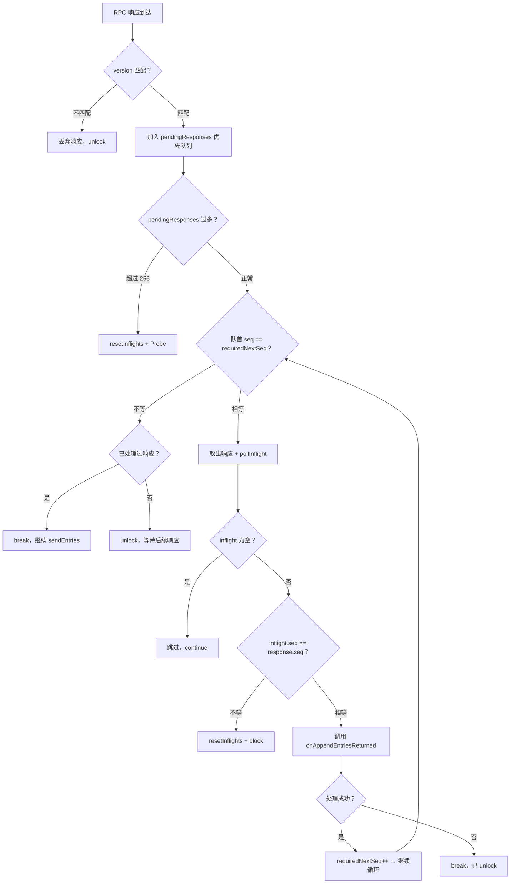
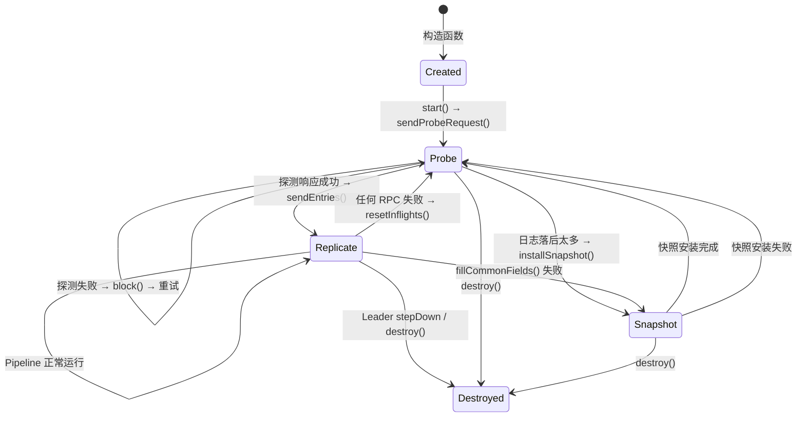
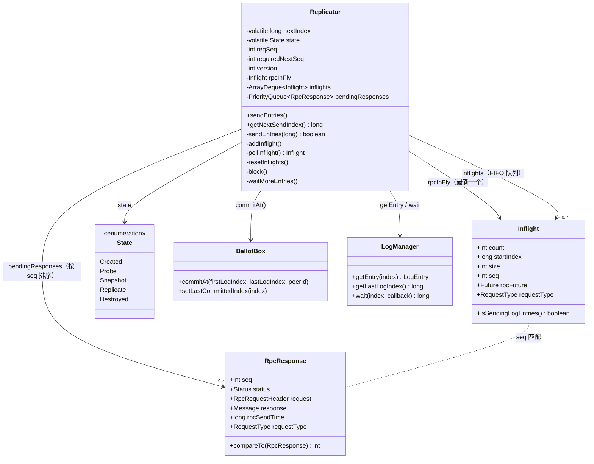

# S18：Replicator Pipeline 深度分析

> **核心问题**：Leader 向 Follower 复制日志时，如何在不等待前一个 RPC 响应的情况下持续发送？乱序到达的响应如何正确处理？如何做流控？
>
> **涉及源码**：`Replicator.java` — `Inflight`（第 388 行）、`RpcResponse`（第 428 行）、`sendEntries()`（第 1597 行）、`sendEntries(long)`（第 1629 行）、`onRpcReturned()`（第 1263 行）、`onAppendEntriesReturned()`、`getNextSendIndex()`、`addInflight()`（第 579 行）、`resetInflights()`、`block()`、`waitMoreEntries()`（第 1580 行）
>
> **前置阅读**：04-Log-Replication（日志复制基础）、S17-Follower-RPC-Handling（Follower 端处理）

---

## 目录

1. [解决什么问题](#1-解决什么问题)
2. [核心数据结构](#2-核心数据结构)
3. [Pipeline 发送循环](#3-pipeline-发送循环)
4. [乱序响应处理 — onRpcReturned](#4-乱序响应处理--onrpcreturned)
5. [AppendEntries 响应处理 — onAppendEntriesReturned](#5-appendentries-响应处理--onappendentriesreturned)
6. [状态机与状态转换](#6-状态机与状态转换)
7. [流控机制全景](#7-流控机制全景)
8. [Pipeline vs 非 Pipeline 对比](#8-pipeline-vs-非-pipeline-对比)
9. [数据结构关系图](#9-数据结构关系图)
10. [核心不变式](#10-核心不变式)
11. [面试高频考点 📌](#11-面试高频考点-)
12. [生产踩坑 ⚠️](#12-生产踩坑-️)

---

## 1. 解决什么问题

### 1.1 本质：消除 RPC 等待时间

**传统方式（Stop-and-Wait）**：
```
Leader                      Follower
  │── AppendEntries(1-10) ──→│
  │     等待...                │
  │←── Response(success) ─────│
  │── AppendEntries(11-20) ──→│    ← 上一个响应回来后才能发下一个
  │     等待...                │
  │←── Response(success) ─────│
```

**Pipeline 方式**：
```
Leader                      Follower
  │── AppendEntries(1-10) ──→│
  │── AppendEntries(11-20) ──→│    ← 不等响应，立即发下一批
  │── AppendEntries(21-30) ──→│
  │←── Response(1-10, ok) ────│    ← 响应可能乱序到达
  │←── Response(21-30, ok) ───│
  │←── Response(11-20, ok) ───│
  │── AppendEntries(31-40) ──→│    ← 收到响应后继续发
```

**性能提升**：假设网络 RTT = 1ms，日志批量大小 = 1024 条。Stop-and-Wait 下 TPS ≤ 1024/1ms = 100 万/秒。Pipeline 下（256 个 inflight 请求并行）理论 TPS 提升 256 倍。

### 1.2 核心挑战

| 挑战 | 说明 |
|------|------|
| **乱序响应** | 网络不保证顺序，响应可能先发后到 |
| **失败回退** | 某个请求失败后，后续的 inflight 请求全部失效 |
| **流控** | 不能无限发送，需要限制 inflight 请求数量 |
| **状态一致性** | 并行请求导致 `nextIndex` 管理变复杂 |
| **版本隔离** | `resetInflights` 后到达的旧版本响应必须丢弃 |

---

## 2. 核心数据结构

### 2.1 数据结构清单

| 结构名 | 源码位置 | 核心作用 |
|--------|----------|---------|
| `Inflight` | `Replicator.java:388` | 记录一个已发出但未收到响应的 RPC 请求 |
| `RpcResponse` | `Replicator.java:428` | 包装一个已收到的 RPC 响应，带序号用于排序 |
| `inflights` | `Replicator.java:112` | `ArrayDeque<Inflight>`，发送顺序队列 |
| `pendingResponses` | `Replicator.java:134` | `PriorityQueue<RpcResponse>`，按序号排序的响应队列 |
| `reqSeq` | `Replicator.java:127` | 发送序号计数器（单调递增） |
| `requiredNextSeq` | `Replicator.java:129` | 期望下一个处理的响应序号 |
| `version` | `Replicator.java:131` | 版本号，`resetInflights()` 时递增，用于丢弃旧版本响应 |

### 2.2 `Inflight` — 已发出请求的飞行记录

**【问题推导】** Pipeline 模式下 Leader 可能同时有多个请求在飞行中。当响应回来时，需要知道：这个响应对应的是哪一批日志？从哪个 index 开始？有多少条？

**【推导出的结构】** 需要一个记录，包含：请求类型（AppendEntries/Snapshot）、起始 index、日志条数、序号（用于排序）、RPC Future（用于取消）。

```java
// Replicator.java 第 388-421 行
static class Inflight {
    final int             count;        // 本次请求携带的日志条目数量
    final long            startIndex;   // 本次请求的起始日志 index
    final int             size;         // 本次请求的字节大小
    final Future<Message> rpcFuture;    // RPC Future，可用于取消请求
    final RequestType     requestType;  // AppendEntries 或 Snapshot
    final int             seq;          // ★ 序号：发送时分配，单调递增

    boolean isSendingLogEntries() {
        return this.requestType == RequestType.AppendEntries && this.count > 0;
        // ★ 心跳/探测的 count == 0，不算"正在发送日志"
    }
}
```

**各字段作用场景**：

| 字段 | 发送时设置 | 响应处理时使用 |
|------|----------|-------------|
| `startIndex` | `nextSendingIndex` | 验证 `request.prevLogIndex + 1 == startIndex` |
| `count` | `request.getEntriesCount()` | 计算 `nextIndex += count` |
| `seq` | `getAndIncrementReqSeq()` | 与 `RpcResponse.seq` 匹配 |
| `rpcFuture` | RPC 发送返回值 | `resetInflights()` 时批量取消 |

### 2.3 `RpcResponse` — 已收到的响应包装

**【问题推导】** 响应可能乱序到达。需要一个机制把乱序的响应重新排成发送顺序。

**【推导出的结构】** 把响应包装成可排序的对象，按 `seq` 排序。用优先队列（小顶堆）自动维护顺序。

```java
// Replicator.java 第 428-462 行
static class RpcResponse implements Comparable<RpcResponse> {
    final Status      status;       // RPC 状态（OK / 网络错误 / 超时）
    final RpcRequestHeader request; // 原始请求（用于获取 prevLogIndex、entriesCount 等）
    final Message     response;     // Protobuf 响应消息体
    final long        rpcSendTime;  // 请求发送时间（用于计算延迟 metrics）
    final int         seq;          // ★ 序号：与 Inflight.seq 匹配
    final RequestType requestType;  // AppendEntries 或 Snapshot

    @Override
    public int compareTo(final RpcResponse o) {
        return Integer.compare(this.seq, o.seq);  // ★ 按 seq 升序排列
    }
}
```

### 2.4 序号系统 — `reqSeq` / `requiredNextSeq` / `version`

**【为什么需要三个计数器？】**

假设没有序号系统：
- 发出请求 A(index=1-10)、B(index=11-20)、C(index=21-30)
- 响应顺序：C → A → B
- 如果不排序直接处理 C 的响应 → `nextIndex` 会跳到 31，跳过了 11-20 的确认 → **安全性问题**

```
reqSeq（发送序号）：        0  →  1  →  2  →  3  →  ...
                           ↑                          ↑
                     每次发送递增              溢出后归零

requiredNextSeq（期望序号）：0  →  1  →  2  →  3  →  ...
                           ↑                          ↑
                     每次成功处理递增          始终 ≤ reqSeq

version（版本号）：         0  →  1  →  ...
                           ↑
                  resetInflights() 时递增
```

```java
// Replicator.java 第 138-155 行
private int getAndIncrementReqSeq() {
    final int prev = this.reqSeq;
    this.reqSeq++;
    if (this.reqSeq < 0) {  // ★ 防止 int 溢出
        this.reqSeq = 0;
    }
    return prev;
}

private int getAndIncrementRequiredNextSeq() {
    final int prev = this.requiredNextSeq;
    this.requiredNextSeq++;
    if (this.requiredNextSeq < 0) {  // ★ 同样防溢出
        this.requiredNextSeq = 0;
    }
    return prev;
}
```

**`version` 的作用**：当 `resetInflights()` 被调用时（请求失败、状态重置），`version` 递增。后续到达的旧版本响应（`stateVersion != r.version`）会被直接丢弃。这解决了"已取消的请求的响应迟到"的问题。

---

## 3. Pipeline 发送循环

### 3.1 `sendEntries()` — 无参版本：Pipeline 循环入口

**源码位置**：`Replicator.java:1597-1622`

```java
// Replicator.java 第 1597-1622 行
void sendEntries() {
    boolean doUnlock = true;
    try {
        long prevSendIndex = -1;
        while (true) {                                  // ★ Pipeline 核心：循环发送，不等响应
            final long nextSendingIndex = getNextSendIndex();
            if (nextSendingIndex > prevSendIndex) {     // 有新的日志要发送
                if (sendEntries(nextSendingIndex)) {    // 发送成功 → 继续循环
                    prevSendIndex = nextSendingIndex;
                } else {
                    doUnlock = false;                   // sendEntries(long) 内部已 unlock
                    break;
                }
            } else {
                break;                                  // 没有更多日志可发 → 退出循环
            }
        }
    } finally {
        if (doUnlock) {
            unlockId();
        }
    }
}
```

**循环退出的 3 种情况**：
1. `getNextSendIndex()` 返回 `-1`（inflight 数量达到上限 或 上一个请求不是日志追加）
2. `sendEntries(nextSendingIndex)` 返回 `false`（需要安装快照 / 没有更多日志 / 等待更多日志）
3. `nextSendingIndex <= prevSendIndex`（没有新的日志可发）

### 3.2 `getNextSendIndex()` — 流控核心

**源码位置**：`Replicator.java` （通过 grep 确认在 sendEntries 附近）

```java
// Replicator.java
long getNextSendIndex() {
    // ① 快路径：没有 inflight 请求 → 直接返回 nextIndex
    if (this.inflights.isEmpty()) {
        return this.nextIndex;
    }
    // ② 流控：inflight 数量超过上限 → 返回 -1（停止发送）
    if (this.inflights.size() > this.raftOptions.getMaxReplicatorInflightMsgs()) {
        return -1L;    // ★ 默认上限 = 256
    }
    // ③ Pipeline 续传：上一个请求的 startIndex + count
    if (this.rpcInFly != null && this.rpcInFly.isSendingLogEntries()) {
        return this.rpcInFly.startIndex + this.rpcInFly.count;
    }
    return -1L;    // ④ 上一个请求不是日志追加（可能是心跳或快照）→ 停止
}
```

**设计解析**：

| 返回值 | 含义 | 后续动作 |
|--------|------|---------|
| `nextIndex` | 无 inflight，从 `nextIndex` 开始发 | 继续发送 |
| `rpcInFly.startIndex + count` | 有 inflight，从上次发送的末尾继续发 | 继续发送（Pipeline） |
| `-1` | 达到流控上限或不适合继续发送 | 退出发送循环 |

**关键洞察**：`nextIndex` 只在**响应成功处理后**才更新（`r.nextIndex += entriesSize`）。而 `getNextSendIndex()` 在 inflight 不为空时通过 `rpcInFly.startIndex + count` 计算，不依赖 `nextIndex`。这意味着 Pipeline 模式下，`nextIndex` 始终代表"已确认的下一个 index"，而不是"已发送的下一个 index"。

### 3.3 `sendEntries(long)` — 单次发送

**源码位置**：`Replicator.java:1629`

**分支穷举清单**：

| # | 条件 | 结果 | 说明 |
|---|------|------|------|
| 1 | `fillCommonFields()` 失败（`prevLogIndex` 对应的日志已被 truncate） | 调用 `installSnapshot()`，返回 `false` | 日志落后太多，需要发快照 |
| 2 | `rb.getEntriesCount() == 0` 且 `nextSendingIndex < firstLogIndex` | 调用 `installSnapshot()`，返回 `false` | 同上 |
| 3 | `rb.getEntriesCount() == 0`（日志还没到达） | 调用 `waitMoreEntries()`，返回 `false` | 等待新日志写入 |
| 4 | 正常发送 | 构建请求 → 发 RPC → `addInflight()` → 返回 `true` | Pipeline 继续 |

```java
// Replicator.java 第 1629-1727 行（精简版，省略日志和 metrics）
private boolean sendEntries(final long nextSendingIndex) {
    final AppendEntriesRequest.Builder rb = AppendEntriesRequest.newBuilder();
    // ① 填充公共字段（term, serverId, committedIndex, prevLogIndex, prevLogTerm）
    if (!fillCommonFields(rb, nextSendingIndex - 1, false)) {
        installSnapshot();    // prevLogIndex 的日志不存在 → 安装快照
        return false;
    }

    // ② 批量读取日志条目（最多 maxEntriesSize=1024 条，最大 maxBodySize=512KB）
    final RecyclableByteBufferList byteBufList = RecyclableByteBufferList.newInstance();
    for (int i = 0; i < this.raftOptions.getMaxEntriesSize(); i++) {
        final RaftOutter.EntryMeta.Builder emb = RaftOutter.EntryMeta.newBuilder();
        if (!prepareEntry(nextSendingIndex, i, emb, byteBufList)) {
            break;    // 读不到更多日志 或 达到 maxBodySize
        }
        rb.addEntries(emb.build());
    }

    if (rb.getEntriesCount() == 0) {
        // 没有日志可发
        if (nextSendingIndex < this.options.getLogManager().getFirstLogIndex()) {
            installSnapshot();
            return false;
        }
        waitMoreEntries(nextSendingIndex);    // ★ 注册 LogManager 的 wait 回调
        return false;
    }

    // ③ 分配序号
    final int seq = getAndIncrementReqSeq();

    // ④ 发送 RPC（异步）
    Future<Message> rpcFuture = this.rpcService.appendEntries(
        this.options.getPeerId().getEndpoint(), request, -1,
        new RpcResponseClosureAdapter<AppendEntriesResponse>() {
            @Override
            public void run(final Status status) {
                // ★ 回调中携带 seq 和 version，用于乱序处理和版本隔离
                onRpcReturned(Replicator.this.id, RequestType.AppendEntries,
                    status, header, getResponse(), seq, v, monotonicSendTimeMs);
            }
        });

    // ⑤ 加入 inflight 队列
    addInflight(RequestType.AppendEntries, nextSendingIndex,
        request.getEntriesCount(), request.getData().size(), seq, rpcFuture);

    return true;    // ★ 返回 true → Pipeline 循环继续
}
```

### 3.4 `addInflight()` — 记录飞行中的请求

```java
// Replicator.java 第 579-585 行
private void addInflight(final RequestType reqType, final long startIndex, final int count,
                         final int size, final int seq, final Future<Message> rpcInfly) {
    this.rpcInFly = new Inflight(reqType, startIndex, count, size, seq, rpcInfly);
    this.inflights.add(this.rpcInFly);    // ★ 入队（ArrayDeque 尾部添加）
    this.nodeMetrics.recordSize(name(this.metricName, "replicate-inflights-count"), this.inflights.size());
}
```

**`rpcInFly` 的双重角色**：
1. 作为 `inflights` 队列的最后一个元素（队尾）
2. 作为 `getNextSendIndex()` 的计算依据（`rpcInFly.startIndex + rpcInFly.count`）

---

## 4. 乱序响应处理 — onRpcReturned

**源码位置**：`Replicator.java:1263-1383`

这是 Pipeline 机制中**最复杂**的方法。它解决的核心问题是：**响应可能乱序到达，但必须按发送顺序处理**。

### 4.1 整体流程



### 4.2 源码逐行注释

```java
// Replicator.java 第 1263-1383 行
static void onRpcReturned(final ThreadId id, final RequestType reqType, final Status status,
                          final RpcRequestHeader request, final Message response,
                          final int seq, final int stateVersion, final long rpcSendTime) {
    if (id == null) { return; }
    final long startTimeMs = Utils.nowMs();
    Replicator r;
    if ((r = (Replicator) id.lock()) == null) { return; }   // ★ 加锁

    // ① 版本隔离：resetInflights 后到达的旧版本响应 → 丢弃
    if (stateVersion != r.version) {
        id.unlock();
        return;
    }

    // ② 将响应加入优先队列（按 seq 自动排序）
    final PriorityQueue<RpcResponse> holdingQueue = r.pendingResponses;
    holdingQueue.add(new RpcResponse(reqType, seq, status, request, response, rpcSendTime));

    // ③ 防护：pendingResponses 过多 → 说明有问题，重置状态
    if (holdingQueue.size() > r.raftOptions.getMaxReplicatorInflightMsgs()) {
        r.resetInflights();
        r.setState(State.Probe);
        r.sendProbeRequest();
        return;
    }

    // ④ 按序处理循环
    boolean continueSendEntries = false;
    int processed = 0;
    while (!holdingQueue.isEmpty()) {
        final RpcResponse queuedPipelinedResponse = holdingQueue.peek();

        // ⑤ 序号检查：队首不是期望的下一个序号 → 等待
        if (queuedPipelinedResponse.seq != r.requiredNextSeq) {
            if (processed > 0) {
                break;           // 已处理了一些，break 后继续 sendEntries
            } else {
                continueSendEntries = false;
                id.unlock();
                return;          // 一个都没处理 → unlock 等待
            }
        }
        holdingQueue.remove();   // ★ 弹出队首
        processed++;

        // ⑥ 从 inflights 队列取出对应的 Inflight 记录
        final Inflight inflight = r.pollInflight();    // ★ 从 ArrayDeque 头部弹出
        if (inflight == null) {
            continue;            // inflights 已被清空（可能是 resetInflights 导致）
        }

        // ⑦ 序号二次验证：Inflight.seq 必须与 RpcResponse.seq 匹配
        if (inflight.seq != queuedPipelinedResponse.seq) {
            r.resetInflights();
            r.setState(State.Probe);
            continueSendEntries = false;
            r.block(Utils.nowMs(), RaftError.EREQUEST.getNumber());
            return;
        }

        // ⑧ 分发处理
        try {
            switch (queuedPipelinedResponse.requestType) {
                case AppendEntries:
                    continueSendEntries = onAppendEntriesReturned(
                        id, inflight, queuedPipelinedResponse.status,
                        queuedPipelinedResponse.request,
                        (AppendEntriesResponse) queuedPipelinedResponse.response,
                        rpcSendTime, startTimeMs, r);
                    break;
                case Snapshot:
                    continueSendEntries = onInstallSnapshotReturned(/* ... */);
                    break;
            }
        } finally {
            if (continueSendEntries) {
                r.getAndIncrementRequiredNextSeq();    // ★ 成功：期望序号 + 1
            } else {
                break;    // 失败：id 已在 handler 中 unlock，退出循环
            }
        }
    }

    // ⑨ 处理完所有可处理的响应后，继续发送
    if (continueSendEntries) {
        r.sendEntries();    // ★ 回到 Pipeline 循环
    }
}
```

### 4.3 核心设计决策

**为什么用 `PriorityQueue` + `ArrayDeque` 双队列？**

| 队列 | 类型 | 排序方式 | 用途 |
|------|------|---------|------|
| `inflights` | `ArrayDeque` | 发送顺序（FIFO） | 记录"发了什么" |
| `pendingResponses` | `PriorityQueue` | 按 `seq` 排序（小顶堆） | 记录"收到了什么" |

处理时：从 `pendingResponses` 中按序号取出响应，同时从 `inflights` 中按 FIFO 取出对应的请求记录，**两者的 seq 必须匹配**。如果不匹配，说明状态已损坏，重置所有状态。

**为什么不直接用 `Map<seq, Response>`？** `PriorityQueue` 的优势在于：可以一次性按顺序处理多个积压的响应（while 循环），且自动保持排序。`Map` 需要手动从 `requiredNextSeq` 开始查找，代码更复杂。

**版本隔离的必要性**：
```
时间线：
  T1: 发送请求 A(seq=5, version=3)
  T2: 请求 A 失败 → resetInflights() → version 变为 4
  T3: 发送请求 B(seq=5, version=4)    // seq 重置后可能复用
  T4: 请求 A 的响应迟到 → stateVersion=3 != r.version=4 → 丢弃 ✅
```
如果没有 version 隔离，A 的旧响应会被当作 B 的响应处理 → **灾难性后果**。

---

## 5. AppendEntries 响应处理 — onAppendEntriesReturned

**源码位置**：`Replicator.java`（`onAppendEntriesReturned` 方法）

### 5.1 分支穷举清单

| # | 条件 | 结果 | 返回值 | 说明 |
|---|------|------|--------|------|
| 1 | `inflight.startIndex != request.prevLogIndex + 1` | `resetInflights` → `Probe` → `sendProbeRequest` | `false` | 请求与 inflight 记录不匹配 |
| 2 | `!status.isOk()`（RPC 失败） | `resetInflights` → `Probe` → `block()` | `false` | 网络错误 / Follower 宕机 |
| 3 | `!response.success` 且 `EBUSY` | `resetInflights` → `Probe` → `block()` | `false` | Follower 过载 |
| 4 | `!response.success` 且 `response.term > options.term` | `destroy()` + `increaseTermTo()` | `false` | Follower 的 term 更高 → Leader stepDown |
| 5 | `!response.success`（日志不匹配） | `resetInflights` → 调整 `nextIndex` → `sendProbeRequest` | `false` | prevLog 不匹配，需要回退 |
| 6 | `response.success` 但 `response.term != options.term` | `resetInflights` → `Probe` | `false` | term 异常 |
| 7 | `response.success` 正常 | `commitAt()` + `nextIndex += count` + `State.Replicate` | `true` | ✅ 成功 |

### 5.2 成功路径详解

```java
// 成功分支（精简后）
if (response.getTerm() != r.options.getTerm()) {
    r.resetInflights();
    r.setState(State.Probe);
    id.unlock();
    return false;
}

// ★ 推进 nextIndex 并通知 BallotBox
final int entriesSize = request.getEntriesCount();
if (entriesSize > 0) {
    if (r.options.getReplicatorType().isFollower()) {
        // ★ 只有 Follower 类型的 Replicator 才参与投票（Learner 不参与）
        r.options.getBallotBox().commitAt(
            r.nextIndex,                          // firstLogIndex
            r.nextIndex + entriesSize - 1,        // lastLogIndex
            r.options.getPeerId());               // 投票者 PeerId
    }
}

r.setState(State.Replicate);        // ★ 确认进入 Pipeline 模式
r.blockTimer = null;                // 清除 block 定时器
r.nextIndex += entriesSize;         // ★ 推进已确认的 nextIndex
r.hasSucceeded = true;
r.notifyOnCaughtUp(RaftError.SUCCESS.getNumber(), false);

// ★ Transfer Leadership 检查
if (r.timeoutNowIndex > 0 && r.timeoutNowIndex < r.nextIndex) {
    r.sendTimeoutNow(false, false);
}
return true;    // 返回 true → Pipeline 继续
```

**`commitAt()` 的含义**：向 `BallotBox` 报告"这个 Follower 已经确认了 `[nextIndex, nextIndex + entriesSize - 1]` 范围内的日志"。BallotBox 内部维护投票计数，当超过半数 Follower 确认时，推进 `lastCommittedIndex`。

### 5.3 nextIndex 回退策略

日志不匹配时（分支 #5），有两种回退策略：

```java
// ① Follower 的日志更短 → 直接跳到 Follower 的 lastLogIndex + 1
if (response.getLastLogIndex() + 1 < r.nextIndex) {
    r.nextIndex = response.getLastLogIndex() + 1;
}
// ② Follower 有旧 term 的冲突日志 → 逐条回退
else {
    if (r.nextIndex > 1) {
        r.nextIndex--;
    }
}
```

**JRaft 的优化**：情况①是 JRaft 的优化——利用 Follower 返回的 `lastLogIndex` 快速回退，避免论文中逐条回退的低效方式。但情况②（冲突日志）仍然是逐条回退，因为无法确定从哪个 index 开始冲突。

---

## 6. 状态机与状态转换

### 6.1 Replicator 的 5 种状态

```java
// Replicator.java 第 161 行
public enum State {
    Created,     // 刚创建，未启动
    Probe,       // 探测模式：发送空 AppendEntries 确认 Follower 状态
    Snapshot,    // 正在安装快照
    Replicate,   // ★ Pipeline 模式：持续复制日志
    Destroyed    // 已销毁
}
```

### 6.2 状态转换图



### 6.3 Pipeline 只在 Replicate 状态运行

| 状态 | 能否 Pipeline | 原因 |
|------|-------------|------|
| `Created` | ❌ | 未启动 |
| `Probe` | ❌ | 需要先确认 Follower 的日志匹配点 |
| `Snapshot` | ❌ | 正在传输快照 |
| **`Replicate`** | **✅** | 日志匹配已确认，可以持续发送 |
| `Destroyed` | ❌ | 已销毁 |

**从 Probe 到 Replicate 的关键转换**：当 Probe 请求（空 AppendEntries）的响应返回 `success=true` 时，`onAppendEntriesReturned()` 将状态设为 `State.Replicate`，然后在 `onRpcReturned()` 的最后调用 `r.sendEntries()` 进入 Pipeline 循环。

---

## 7. 流控机制全景

### 7.1 三层流控

| 层 | 机制 | 默认值 | 控制对象 |
|----|------|--------|---------|
| **L1** | `maxReplicatorInflightMsgs` | 256 | 最大 inflight 请求数量 |
| **L2** | `maxEntriesSize` | 1024 | 单次请求最大日志条目数 |
| **L3** | `maxBodySize` | 512 KB | 单次请求最大字节数 |

### 7.2 L1：Inflight 数量控制

```java
// getNextSendIndex() 中
if (this.inflights.size() > this.raftOptions.getMaxReplicatorInflightMsgs()) {
    return -1L;    // 停止发送
}
```

**触发后果**：`sendEntries()` 循环退出，Leader 暂停向该 Follower 发送日志。等到 `onRpcReturned()` 消费掉一些 inflight 请求后，Pipeline 继续。

### 7.3 L2 + L3：单次请求大小控制

```java
// sendEntries(long) 中
for (int i = 0; i < this.raftOptions.getMaxEntriesSize(); i++) {    // L2: 最多 1024 条
    if (!prepareEntry(nextSendingIndex, i, emb, byteBufList)) { break; }
    rb.addEntries(emb.build());
}

// prepareEntry() 中
if (dateBuffer.getCapacity() >= this.raftOptions.getMaxBodySize()) {  // L3: 最大 512KB
    return false;
}
```

### 7.4 额外流控：pendingResponses 溢出保护

```java
// onRpcReturned() 中
if (holdingQueue.size() > r.raftOptions.getMaxReplicatorInflightMsgs()) {
    r.resetInflights();
    r.setState(State.Probe);
    r.sendProbeRequest();
    return;
}
```

这是一个**防御性检查**：如果 `pendingResponses` 积压超过 256 个，说明响应处理出了问题（可能是序号不连续导致无法消费），强制重置状态。

### 7.5 `waitMoreEntries()` — 无日志可发时的等待机制

```java
// Replicator.java 第 1580-1593 行
private void waitMoreEntries(final long nextWaitIndex) {
    try {
        if (this.waitId >= 0) { return; }    // 已经在等待中
        this.waitId = this.options.getLogManager().wait(
            nextWaitIndex - 1,
            (arg, errorCode) -> continueSending((ThreadId) arg, errorCode),
            this.id);
        this.statInfo.runningState = RunningState.IDLE;
    } finally {
        unlockId();
    }
}
```

**LogManager.wait() 的含义**：注册一个回调——当 `lastLogIndex > nextWaitIndex - 1` 时（有新日志写入），触发 `continueSending()` 回调，重新进入 `sendEntries()` Pipeline 循环。

### 7.6 `block()` — 请求失败后的退避

```java
// Replicator.java
void block(final long startTimeMs, final int errorCode) {
    if (this.blockTimer != null) {
        unlockId();
        return;    // 已经在 block 中
    }
    this.blockCounter++;
    final long dueTime = startTimeMs + this.options.getDynamicHeartBeatTimeoutMs();
    this.blockTimer = this.timerManager.schedule(
        () -> onBlockTimeout(this.id),
        dueTime - Utils.nowMs(), TimeUnit.MILLISECONDS);
    this.statInfo.runningState = RunningState.BLOCKING;
    unlockId();
}
```

**退避时间**：`dynamicHeartBeatTimeoutMs`（默认 = electionTimeoutMs / 10）。block 期间不发送任何请求。超时后触发 `onBlockTimeout()` → `sendProbeRequest()` 重新探测。

---

## 8. Pipeline vs 非 Pipeline 对比

| 维度 | 非 Pipeline（Stop-and-Wait） | Pipeline |
|------|--------------------------|---------|
| **并行度** | 1（等一个回来才发下一个） | 最多 256（`maxReplicatorInflightMsgs`） |
| **nextIndex 管理** | 简单：响应成功后 += count | 复杂：发送用 `rpcInFly.startIndex + count`，确认用 `nextIndex += count` |
| **失败处理** | 只需要重发当前请求 | 必须 `resetInflights()`，清空所有 inflight |
| **乱序处理** | 不存在（只有一个请求） | 需要 `PriorityQueue` + 序号系统 |
| **内存开销** | 低 | 高（256 个 Inflight + 256 个 RpcResponse） |
| **吞吐量** | 受限于 RTT | 不受限于 RTT（受限于带宽/磁盘） |
| **适用场景** | 低延迟网络 / 调试 | 生产环境 |

**JRaft 的选择**：默认启用 Pipeline 模式（`RaftOptions.replicatorPipeline = true`）。可以通过 `setReplicatorPipeline(false)` 关闭 Pipeline，但生产环境强烈建议保持开启。

---

## 9. 数据结构关系图



---

## 10. 核心不变式

1. **序号单调递增**：`reqSeq` 和 `requiredNextSeq` 只增不减（溢出时归零）
2. **requiredNextSeq ≤ reqSeq**：期望的下一个处理序号不会超过已发送的最大序号
3. **inflights 与 pendingResponses 按相同 seq 排列**：`inflights` 头部的 seq 应等于 `pendingResponses` 头部的 seq
4. **resetInflights 后 version 递增**：保证旧版本的响应被丢弃
5. **resetInflights 后 reqSeq 与 requiredNextSeq 对齐**：`rs = max(reqSeq, requiredNextSeq); reqSeq = requiredNextSeq = rs`
6. **Pipeline 只在 Replicate 状态运行**：Probe/Snapshot/Created/Destroyed 状态不会进入 `sendEntries()` 循环
7. **任何 RPC 失败 → resetInflights + Probe**：不会部分重试，全部推倒重来
8. **nextIndex 只在成功响应后推进**：Pipeline 发送使用 `rpcInFly.startIndex + count`，不修改 `nextIndex`

---

## 11. 面试高频考点 📌

1. **JRaft 的 Replicator Pipeline 是什么？解决什么问题？**
   → Pipeline 允许 Leader 向 Follower 同时发送多个 AppendEntries 请求而不等待响应。解决 RTT 限制吞吐量的问题，默认最多 256 个并行请求。

2. **Pipeline 模式下，响应乱序到达怎么处理？**
   → 每个请求分配递增的序号 `seq`。响应到达后放入 `PriorityQueue`（按 seq 排序），只有当队首的 seq == `requiredNextSeq` 时才处理。按序处理后 `requiredNextSeq++`。

3. **`inflights` 和 `pendingResponses` 是什么关系？**
   → `inflights`（ArrayDeque）记录已发送请求（按发送顺序 FIFO），`pendingResponses`（PriorityQueue）记录已收到响应（按 seq 排序）。处理时同时从两个队列取出，seq 必须匹配。

4. **Pipeline 请求失败后怎么办？**
   → 调用 `resetInflights()`：清空 inflights 和 pendingResponses、`version++`（使旧响应失效）、对齐 seq 计数器。然后切换到 Probe 状态，发送探测请求重新确认日志匹配点。

5. **`version` 字段的作用是什么？**
   → 防止 `resetInflights()` 后，旧版本的延迟响应被错误处理。`onRpcReturned()` 会检查 `stateVersion != r.version`，不匹配则丢弃。

6. **Pipeline 的流控机制有哪些？**
   → 三层：①`maxReplicatorInflightMsgs=256`（最大并行请求数）②`maxEntriesSize=1024`（单次最多条目数）③`maxBodySize=512KB`（单次最大字节数）。加上 pendingResponses 溢出保护和 Follower 端的 EBUSY 背压。

7. **`getNextSendIndex()` 是怎么计算的？**
   → 无 inflight 时返回 `nextIndex`；有 inflight 时返回 `rpcInFly.startIndex + rpcInFly.count`（即上一个请求的末尾）；超过流控上限或上一个不是日志请求时返回 -1。

8. **为什么 `nextIndex` 只在成功响应后才推进？**
   → 因为 Pipeline 模式下有多个 inflight 请求。如果在发送时就推进 `nextIndex`，失败回退时需要回退到不确定的位置。保持 `nextIndex` 代表"已确认"可以简化回退逻辑。

---

## 12. 生产踩坑 ⚠️

1. **`maxReplicatorInflightMsgs` 设置过大**：导致内存占用大增（每个 Inflight + RpcResponse 都需要内存），且失败时 resetInflights 的代价更高。建议保持默认 256 或根据实际内存调整。

2. **Follower 持续返回 EBUSY**：说明 Follower 的 LogManager 处理不过来。Pipeline 模式下 Leader 会不断重试 → 进入 Probe → block → 重试循环。需要检查 Follower 的磁盘 IO 性能或增大 `disruptorBufferSize`。

3. **序号溢出**：`reqSeq` 是 int 类型，理论上在 2^31 次请求后溢出。JRaft 通过 `if (this.reqSeq < 0) { this.reqSeq = 0; }` 处理溢出，但在极端情况下（长时间运行 + 高频发送）需要注意 seq 的 `PriorityQueue` 排序是否因为归零而出问题。

4. **跨网络分区恢复**：分区恢复后，大量旧响应可能同时到达。`version` 隔离机制会丢弃这些旧响应，但如果 `pendingResponses` 在 `version` 检查前就积压了过多条目，会触发溢出保护导致频繁 Probe。

5. **日志匹配回退慢**：如果 Follower 有大量旧 term 的冲突日志（情况②），`nextIndex--` 逐条回退可能非常慢。可以考虑在 Follower 端返回冲突 term 的第一条日志 index，让 Leader 快速跳过。

---

## 总结

### 数据结构层面

| 结构 | 核心特征 |
|------|---------|
| `Inflight` | 6 个 final 字段的不可变记录，核心是 `seq`（序号）和 `startIndex`（起始 index） |
| `RpcResponse` | 实现 `Comparable`，按 `seq` 排序，与 `Inflight` 通过 seq 关联 |
| `inflights`（ArrayDeque） | FIFO 发送顺序队列，`addInflight()` 入队 / `pollInflight()` 出队 |
| `pendingResponses`（PriorityQueue） | 小顶堆按 seq 排序，乱序响应的重排序核心 |
| `reqSeq` / `requiredNextSeq` / `version` | 三计数器：发送序号 / 期望序号 / 版本号，构成 Pipeline 的并发安全基础 |

### 算法层面

| 算法 | 核心设计决策 |
|------|------------|
| Pipeline 发送循环 | `while(true)` + `getNextSendIndex()` 实现连续发送，不等响应 |
| 乱序响应处理 | `PriorityQueue` 按 seq 重排 + `requiredNextSeq` 顺序消费 |
| 流控 | 三层控制（inflight 数量 / 条目数 / 字节数），加上 pendingResponses 溢出保护 |
| 失败恢复 | `resetInflights()` 全量清空 + `version++` 隔离旧响应 + 回退到 Probe |
| nextIndex 管理 | 发送时用 `rpcInFly.startIndex + count` 计算，确认时用 `nextIndex += count` 推进 |
