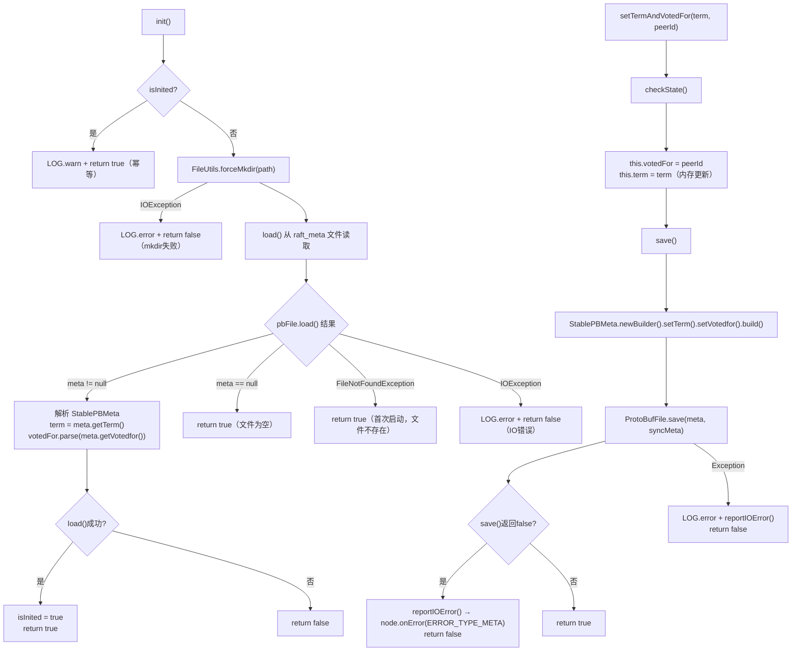

# 05 - 日志存储：深度精读

## 学习目标

深入理解 JRaft 的日志存储层设计，包括 `RocksDBLogStorage`（默认存储实现）、日志编解码机制（V1/V2）、`LocalRaftMetaStorage`（元数据存储），以及 `RocksDBSegmentLogStorage`（大日志优化）的模板方法设计。

---

## 一、问题驱动：日志存储要解决什么问题？

### 【问题】

Raft 协议要求日志必须**持久化**，崩溃重启后能恢复。但日志存储面临以下挑战：

1. **写入性能**：每条日志都同步写磁盘会严重影响吞吐量，需要批量写入
2. **读取性能**：日志复制时需要频繁按 index 随机读，需要 O(1) 的索引查找
3. **空间回收**：已快照的旧日志需要删除（`truncatePrefix`），Leader 切换时需要回滚未提交日志（`truncateSuffix`）
4. **配置日志特殊处理**：配置变更日志需要在启动时快速恢复，不能和普通日志混在一起
5. **大 Value 问题**：RocksDB 对大 Value（> 1MB）的读写性能较差，需要分段存储优化
6. **元数据持久化**：`term` 和 `votedFor` 必须持久化，防止重启后重复投票

### 【需要什么信息】

- 按 index 快速查找 → 需要 **有序 KV 存储**（RocksDB 天然支持）
- 配置日志快速恢复 → 需要 **独立的 Column Family** 存储配置日志
- 批量写入 → 需要 **WriteBatch** 原子批量提交
- 大 Value 优化 → 需要 **模板方法**（`onDataAppend`/`onDataGet`）让子类覆盖存储逻辑
- 元数据持久化 → 需要 **独立的 Protobuf 文件**（不能放在日志 RocksDB 中，避免耦合）

### 【推导出的结构】

由此推导出：
- `LogStorage` 接口：定义存储层 API（SPI 扩展点）
- `RocksDBLogStorage`：基于 RocksDB 的实现，两个 CF（default + conf）
- `RocksDBSegmentLogStorage`：继承 `RocksDBLogStorage`，覆盖模板方法，将大 Value 存到 Segment 文件
- `LocalRaftMetaStorage`：独立的 Protobuf 文件存储 term/votedFor

---

## 二、核心数据结构

### 2.1 LogStorage 接口（源码验证）

```java
// LogStorage.java 第 34-84 行
public interface LogStorage extends Lifecycle<LogStorageOptions>, Storage {
    long getFirstLogIndex();
    long getLastLogIndex();
    LogEntry getEntry(final long index);
    @Deprecated long getTerm(final long index);  // 已废弃，用 getEntry().getId().getTerm() 替代
    boolean appendEntry(final LogEntry entry);
    int appendEntries(final List<LogEntry> entries);  // 返回成功写入的条数
    boolean truncatePrefix(final long firstIndexKept);  // 删除 [firstLogIndex, firstIndexKept) 的日志
    boolean truncateSuffix(final long lastIndexKept);   // 删除 (lastIndexKept, lastLogIndex] 的日志
    boolean reset(final long nextLogIndex);             // 安装快照后重置，清空所有日志
}
```

**关键设计**：`appendEntries` 返回 `int`（成功写入条数），而不是 `boolean`，允许部分成功。

### 2.2 RocksDBLogStorage 核心字段（源码验证）

```java
// RocksDBLogStorage.java 第 130-165 行

private final String path;           // RocksDB 数据目录
private final boolean sync;          // 是否同步刷盘（raftOptions.isSync()）
private RocksDB db;                  // RocksDB 实例
private DBOptions dbOptions;
private WriteOptions writeOptions;   // sync=true 时每次写都 fsync
private ColumnFamilyHandle defaultHandle;  // 普通日志 CF
private ColumnFamilyHandle confHandle;     // 配置日志 CF（独立存储）
private ReadOptions totalOrderReadOptions; // setTotalOrderSeek(true)，禁用前缀优化，全序扫描

private final ReadWriteLock readWriteLock = new ReentrantReadWriteLock();
private final Lock readLock  = this.readWriteLock.readLock();
private final Lock writeLock = this.readWriteLock.writeLock();

private volatile long firstLogIndex = 1;       // 第一条日志的 index（volatile，读多写少）
private volatile boolean hasLoadFirstLogIndex; // 是否已从 RocksDB 加载过 firstLogIndex

private LogEntryEncoder logEntryEncoder;  // 编码器（V2 格式）
private LogEntryDecoder logEntryDecoder;  // 解码器（AutoDetect，兼容 V1/V2）
```

**字段存在的理由：**
- `confHandle` 独立存储配置日志：启动时只需扫描 `confHandle` 就能恢复所有配置变更历史，不需要扫描全量日志
- `totalOrderReadOptions`：RocksDB 默认使用前缀优化，`seekToFirst()`/`seekToLast()` 可能不准确；设置 `setTotalOrderSeek(true)` 保证全序扫描
- `firstLogIndex` 是 `volatile`：`getFirstLogIndex()` 在 `readLock` 下读，`setFirstLogIndex()` 也在 `readLock` 下写（`truncatePrefix` 用 `readLock`），`volatile` 保证可见性。注意：`saveFirstLogIndex()` 内部**自己也加了 `readLock`**（`RocksDBLogStorage.java:280`），`truncatePrefix` 外层已持有 `readLock` 再调用 `saveFirstLogIndex`，发生**可重入**（`ReentrantReadWriteLock` 的 `readLock` 支持重入，不会死锁）
- `hasLoadFirstLogIndex`：避免每次 `getFirstLogIndex()` 都扫描 RocksDB，第一次加载后缓存。注意：`getFirstLogIndex()` 在 DB 非空时，不仅读取 `firstLogIndex`，还会调用 `saveFirstLogIndex(ret)` 将其持久化到 conf CF（`RocksDBLogStorage.java:350`），这是一个重要的副作用——**第一次扫描时顺便持久化，后续重启直接从 conf CF 读取，无需再扫描**

### 2.3 两个 Column Family 的数据组织

```
RocksDB Column Families:
  ├── default CF（defaultHandle）
  │     Key:   8 字节大端序 long（logIndex）
  │     Value: LogEntryEncoder.encode(entry)（V2 格式）
  │     存储：所有日志（DATA + CONFIGURATION）
  │
  └── conf CF（confHandle）
        Key:   8 字节大端序 long（logIndex）或 "meta/firstLogIndex"（特殊 key）
        Value: LogEntryEncoder.encode(entry) 或 8 字节 long（firstLogIndex 值）
        存储：仅配置日志 + firstLogIndex 元数据
```

**为什么配置日志同时写入两个 CF？**（`addConfBatch` 方法，源码第 490-495 行）

```java
private void addConfBatch(final LogEntry entry, final WriteBatch batch) throws RocksDBException {
    final byte[] ks = getKeyBytes(entry.getId().getIndex());
    final byte[] content = this.logEntryEncoder.encode(entry);
    batch.put(this.defaultHandle, ks, content);  // 写 default CF（保证日志连续性）
    batch.put(this.confHandle, ks, content);     // 写 conf CF（便于启动时快速恢复配置）
}
```

配置日志写入两个 CF：`default CF` 保证日志 index 连续（Replicator 按 index 复制时不会跳过），`conf CF` 便于启动时快速恢复集群配置。

### 2.4 LocalRaftMetaStorage 核心字段（源码验证）

```java
// LocalRaftMetaStorage.java 第 50-60 行
private static final String RAFT_META = "raft_meta";  // 文件名

private boolean isInited;
private final String path;
private long term;                              // 当前 term（内存中）
private PeerId votedFor = PeerId.emptyPeer();  // 当前投票给谁（内存中）
private final RaftOptions raftOptions;
private NodeMetrics nodeMetrics;
private NodeImpl node;
```

**关键设计**：`term` 和 `votedFor` 都在内存中维护，每次修改都调用 `save()` 持久化到 `raft_meta` 文件（Protobuf 格式）。**不是每次读都从磁盘读**，而是启动时 `load()` 一次，之后全部走内存。

---

## 三、关键方法逐行分析

### 3.1 init() 和 initAndLoad()（初始化流程）

```java
// RocksDBLogStorage.java 第 175-220 行
@Override
public boolean init(final LogStorageOptions opts) {
    this.writeLock.lock();  // ① 初始化用 writeLock（独占）
    try {
        if (this.db != null) { return true; }  // ② 幂等检查
        this.logEntryDecoder = opts.getLogEntryCodecFactory().decoder();
        this.logEntryEncoder = opts.getLogEntryCodecFactory().encoder();
        this.dbOptions = createDBOptions();
        this.writeOptions = new WriteOptions();
        this.writeOptions.setSync(this.sync);  // ③ 根据配置决定是否同步刷盘
        this.totalOrderReadOptions = new ReadOptions();
        this.totalOrderReadOptions.setTotalOrderSeek(true);
        return initAndLoad(opts.getConfigurationManager());
    } catch (final RocksDBException e) {
        LOG.error("Fail to init RocksDBLogStorage, path={}.", this.path, e);
        return false;  // ④ RocksDB 初始化失败：返回 false
    } finally {
        this.writeLock.unlock();
    }
}

private boolean initAndLoad(final ConfigurationManager confManager) throws RocksDBException {
    this.hasLoadFirstLogIndex = false;
    this.firstLogIndex = 1;
    // ④ 打开两个 CF
    final List<ColumnFamilyDescriptor> columnFamilyDescriptors = new ArrayList<>();
    columnFamilyDescriptors.add(new ColumnFamilyDescriptor("Configuration".getBytes(), cfOption));
    columnFamilyDescriptors.add(new ColumnFamilyDescriptor(RocksDB.DEFAULT_COLUMN_FAMILY, cfOption));
    openDB(columnFamilyDescriptors);
    // ⑤ 扫描 conf CF，恢复配置历史 + firstLogIndex
    load(confManager);
    return onInitLoaded();  // ⑥ 模板方法，子类可覆盖（RocksDBSegmentLogStorage 在此初始化 Segment）
}
```

**`load()` 的两种 key 格式**（源码第 240-275 行）：
- `ks.length == 8`：配置日志，解码后加入 `confManager`
- `Arrays.equals(FIRST_LOG_IDX_KEY, ks)`：`"meta/firstLogIndex"` 特殊 key，读取 `firstLogIndex` 并触发后台清理

### 3.2 appendEntries()（批量写入）

```java
// RocksDBLogStorage.java 第 545-570 行
@Override
public int appendEntries(final List<LogEntry> entries) {
    if (entries == null || entries.isEmpty()) {
        return 0;  // ① 空列表直接返回
    }
    final int entriesCount = entries.size();
    final boolean ret = executeBatch(batch -> {
        final WriteContext writeCtx = newWriteContext();  // ② 创建写上下文（子类可覆盖）
        for (int i = 0; i < entriesCount; i++) {
            final LogEntry entry = entries.get(i);
            if (entry.getType() == EntryType.ENTRY_TYPE_CONFIGURATION) {
                addConfBatch(entry, batch);  // ③ 配置日志：写两个 CF
            } else {
                writeCtx.startJob();
                addDataBatch(entry, batch, writeCtx);  // ④ 数据日志：只写 default CF
            }
        }
        writeCtx.joinAll();  // ⑤ 等待所有子任务完成（RocksDBSegmentLogStorage 的异步写 Segment）
        doSync();            // ⑥ 无条件调用 doSync()（子类覆盖 onSync() 实现额外 sync）
    });
    return ret ? entriesCount : 0;  // ⑦ 全部成功返回 entriesCount，失败返回 0
}
```

> ⚠️ **`appendEntries` vs `appendEntry` 的 `doSync()` 调用差异**：
> - `appendEntries`：**无条件**调用 `doSync()`
> - `appendEntry`（单条写入）：**有条件**调用 `doSync()`，仅当 `newValueBytes != valueBytes`（即子类的 `onDataAppend` 修改了 value，说明有 Segment 文件写入需要 sync）时才调用

**`executeBatch()` 的锁策略**（源码第 330-360 行）：

```java
private boolean executeBatch(final WriteBatchTemplate template) {
    this.readLock.lock();  // ⚠️ 用 readLock 而不是 writeLock！
    if (this.db == null) {
        this.readLock.unlock();
        return false;  // DB 已关闭：快速失败
    }
    try (final WriteBatch batch = new WriteBatch()) {
        template.execute(batch);
        this.db.write(this.writeOptions, batch);  // RocksDB 内部保证原子性
    } catch (final RocksDBException e) {
        return false;
    } catch (final IOException e) {
        return false;
    } catch (final InterruptedException e) {
        Thread.currentThread().interrupt();  // ⚠️ 恢复中断标志，不能吞掉
        return false;
    } finally {
        this.readLock.unlock();
    }
    return true;
}
```

**为什么 `appendEntries` 用 `readLock` 而不是 `writeLock`？**

`readLock` 允许多个线程并发读，但这里用 `readLock` 的目的是：**允许多个 `appendEntries` 并发执行**（RocksDB 的 `WriteBatch` 是线程安全的），同时阻止 `shutdown()`（`shutdown` 用 `writeLock`，独占）。这是一种"读写锁反用"的技巧：`writeLock` 用于独占操作（`shutdown`、`reset`），`readLock` 用于并发操作（`appendEntries`、`getEntry`）。

### 3.3 truncatePrefix()（删除旧日志）

```java
// RocksDBLogStorage.java 第 575-595 行
@Override
public boolean truncatePrefix(final long firstIndexKept) {
    this.readLock.lock();
    try {
        final long startIndex = getFirstLogIndex();
        // ① 先持久化新的 firstLogIndex（写 conf CF 的 "meta/firstLogIndex" key）
        final boolean ret = saveFirstLogIndex(firstIndexKept);
        if (ret) {
            setFirstLogIndex(firstIndexKept);  // ② 更新内存缓存
        }
        // ③ 无论 saveFirstLogIndex 是否成功，都提交后台删除任务
        //    （即使 ret=false，后台删除仍会执行，但 firstLogIndex 未更新）
        truncatePrefixInBackground(startIndex, firstIndexKept);
        return ret;
    } finally {
        this.readLock.unlock();
    }
}
```

**为什么先持久化 `firstLogIndex`，再异步删除？**

如果先删除日志，再持久化 `firstLogIndex`，崩溃后重启时 `firstLogIndex` 还是旧值，但旧日志已经被删除，会导致读取到不存在的日志。先持久化 `firstLogIndex`，即使删除过程中崩溃，重启后也能正确跳过已删除的日志范围。

**后台删除的两步操作**（源码第 560-590 行）：

```java
// 后台线程也加 readLock（防止 shutdown 时 DB 被关闭）
this.readLock.lock();
try {
    onTruncatePrefix(startIndex, firstIndexKept);  // 模板方法（子类清理 Segment 文件）
    // ① deleteRange：删除 [startIndex, firstIndexKept) 范围的 key（写 tombstone，逻辑删除）
    db.deleteRange(this.defaultHandle, startKey, endKey);
    db.deleteRange(this.confHandle, startKey, endKey);
    // ② deleteFilesInRanges：加速磁盘空间回收（直接删除 SST 文件，物理删除）
    db.deleteFilesInRanges(this.defaultHandle, Arrays.asList(startKey, endKey), false);
    db.deleteFilesInRanges(this.confHandle, Arrays.asList(startKey, endKey), false);
} finally {
    this.readLock.unlock();
}
```

**关键并发细节**：后台线程也持有 `readLock`，这意味着：如果 `shutdown()` 在后台删除任务执行期间被调用，`shutdown()` 的 `writeLock` 会**等待**后台任务的 `readLock` 释放，保证关闭时不会有并发的 RocksDB 操作。

`deleteRange` 写 tombstone（逻辑删除），`deleteFilesInRanges` 直接删除 SST 文件（物理删除），两步结合加速磁盘空间回收。

### 3.4 truncateSuffix()（回滚未提交日志）

```java
// RocksDBLogStorage.java 第 630-650 行
@Override
public boolean truncateSuffix(final long lastIndexKept) {
    this.readLock.lock();
    try {
        try {
            onTruncateSuffix(lastIndexKept);  // ① 模板方法（子类清理 Segment 文件）
        } finally {
            // ② 无论 onTruncateSuffix 是否抛异常，都执行 deleteRange
            long lastLogIndex = getLastLogIndex();
            this.db.deleteRange(this.defaultHandle, this.writeOptions,
                getKeyBytes(lastIndexKept + 1), getKeyBytes(lastLogIndex + 1));
            this.db.deleteRange(this.confHandle, this.writeOptions,
                getKeyBytes(lastIndexKept + 1), getKeyBytes(lastLogIndex + 1));
        }
        return true;
    } catch (final RocksDBException | IOException e) {
        LOG.error("Fail to truncateSuffix {} in data path: {}.", lastIndexKept, this.path, e);
    } finally {
        this.readLock.unlock();
    }
    return false;
}
```

**与 `truncatePrefix` 的对比**：
- `truncatePrefix`：异步删除（不阻塞，因为旧日志不影响当前操作）
- `truncateSuffix`：**同步删除**（必须立即完成，因为 Leader 切换后不能让 Follower 读到已回滚的日志）

### 3.5 reset()（安装快照后重置）

```java
// RocksDBLogStorage.java 第 655-695 行
@Override
public boolean reset(final long nextLogIndex) {
    if (nextLogIndex <= 0) {
        throw new IllegalArgumentException("Invalid next log index.");  // ① 参数校验
    }
    this.writeLock.lock();  // ② 用 writeLock（独占，防止并发读写）
    try (final Options opt = new Options()) {  // try-with-resources：Options 自动关闭
        LogEntry entry = getEntry(nextLogIndex);  // ③ 先读出 nextLogIndex 对应的日志
        closeDB();
        try {
            RocksDB.destroyDB(this.path, opt);  // ④ 销毁整个 RocksDB（清空所有日志）
            onReset(nextLogIndex);              // ⑤ 模板方法（子类清理 Segment 文件）
            if (initAndLoad(null)) {
                if (entry == null) {
                    // ⑥ nextLogIndex 对应的日志不存在（快照之前的日志）→ 创建 NO_OP 日志
                    entry = new LogEntry();
                    entry.setType(EntryType.ENTRY_TYPE_NO_OP);
                    entry.setId(new LogId(nextLogIndex, 0));
                }
                return appendEntry(entry);  // ⑦ 写入第一条日志（保证 firstLogIndex 正确）
            } else {
                return false;  // ⑧ initAndLoad 失败：返回 false
            }
        } catch (final RocksDBException e) {
            LOG.error("Fail to reset next log index.", e);
            return false;  // ⑨ destroyDB 或 initAndLoad 抛 RocksDBException：返回 false
        }
    } finally {
        this.writeLock.unlock();
    }
}
```

**为什么 `reset` 后要写入一条日志？**

`reset` 后 RocksDB 是空的，`getFirstLogIndex()` 会返回 1（默认值）。写入一条 `nextLogIndex` 对应的日志，确保 `getFirstLogIndex()` 返回正确的值，Replicator 不会从 index=1 开始复制。

---

## 四、日志编解码机制

### 4.1 编解码工厂体系

```mermaid
classDiagram
    class LogEntryCodecFactory {
        <<interface>>
        +encoder() LogEntryEncoder
        +decoder() LogEntryDecoder
    }
    class DefaultLogEntryCodecFactory {
        +encoder() LogEntry::encode (V1, deprecated)
        +decoder() LogEntry::decode (V1, deprecated)
    }
    class LogEntryV2CodecFactory {
        +MAGIC_BYTES: byte[] = {0xBB, 0xD2}
        +VERSION: byte = 1
        +HEADER_SIZE: int = 6
        +encoder() V2Encoder.INSTANCE
        +decoder() AutoDetectDecoder.INSTANCE
    }
    class AutoDetectDecoder {
        +decode(bs) LogEntry
    }
    class V2Encoder {
        +encode(log) byte[]
    }
    LogEntryCodecFactory <|.. DefaultLogEntryCodecFactory
    LogEntryCodecFactory <|.. LogEntryV2CodecFactory
    LogEntryV2CodecFactory --> V2Encoder
    LogEntryV2CodecFactory --> AutoDetectDecoder
```

### 4.2 V2 编码格式（源码验证）

```java
// LogEntryV2CodecFactory.java 第 38-46 行
public static final byte[] MAGIC_BYTES = new byte[] { (byte) 0xBB, (byte) 0xD2 };
public static final byte   VERSION     = 1;
public static final byte[] RESERVED    = new byte[3];
public static final int    HEADER_SIZE = MAGIC_BYTES.length + 1 + RESERVED.length;  // = 6
```

**V2 字节布局**（HEADER_SIZE = 6）：

```
字节偏移:  0    1    2    3    4    5    6 ... N
内容:    [0xBB][0xD2][0x01][0x00][0x00][0x00][Protobuf序列化的PBLogEntry...]
          ←Magic→    ←Ver→ ←────Reserved(3字节)────→ ←──────Body──────────→
```

**V2 Encoder 的编码流程**（`V2Encoder.encode()`，源码第 80-120 行）：

```java
// ① 构建 PBLogEntry（Protobuf 消息）
final PBLogEntry.Builder builder = PBLogEntry.newBuilder()
    .setType(log.getType())
    .setIndex(logId.getIndex())
    .setTerm(logId.getTerm());
// ② 编码 peers/oldPeers/learners/oldLearners（配置日志才有）
// ③ 编码 checksum（如果有）
// ④ 编码 data（业务数据）
builder.setData(log.getData() != null ? ZeroByteStringHelper.wrap(log.getData()) : ByteString.EMPTY);

// ⑤ 分配 byte[]：HEADER_SIZE + Protobuf 序列化大小
final byte[] ret = new byte[LogEntryV2CodecFactory.HEADER_SIZE + bodyLen];
// ⑥ 写 Header（Magic + Version + Reserved）
// ⑦ 写 Body（Protobuf 序列化）
writeToByteArray(pbLogEntry, ret, i, bodyLen);
```

**`ZeroByteStringHelper.wrap()`**：零拷贝包装 `byte[]` 为 `ByteString`，避免 Protobuf 序列化时的内存拷贝。

### 4.3 AutoDetectDecoder（自动检测格式）

```java
// AutoDetectDecoder.java 第 40-50 行
@Override
public LogEntry decode(final byte[] bs) {
    if (bs == null || bs.length < 1) {
        return null;
    }
    if (bs[0] == LogEntryV2CodecFactory.MAGIC_BYTES[0]) {  // bs[0] == 0xBB
        return V2Decoder.INSTANCE.decode(bs);
    } else {
        return V1Decoder.INSTANCE.decode(bs);  // V1 格式（Protobuf）不会以 0xBB 开头（Protobuf 的 field tag 不会是 0xBB），所以只需检查第一个字节就能区分格式。
    }
}
```

**兼容性设计**：V2 格式以 `0xBB` 开头，V1 格式（Protobuf）不会以 `0xBB` 开头（Protobuf 的 field tag 不会是 `0xBB`），所以只需检查第一个字节就能区分格式。

---

## 五、LocalRaftMetaStorage（元数据存储）

### 5.1 核心流程



### 5.2 关键设计

**`setTermAndVotedFor` 是同步 IO**（源码第 170-180 行）：

```java
@Override
public boolean setTermAndVotedFor(final long term, final PeerId peerId) {
    checkState();
    this.votedFor = peerId;
    this.term = term;
    return save();  // 同步写文件，阻塞调用线程
}
```

**为什么元数据存储不用 RocksDB？**

1. 元数据只有两个字段（`term` + `votedFor`），数据量极小，不需要 KV 存储的复杂性
2. 使用独立文件，与日志存储解耦，`reset()` 清空日志时不会影响元数据
3. Protobuf 文件格式简单，便于人工检查和调试

**`syncMeta` 配置**（`raftOptions.isSyncMeta()`）：

- `true`（默认）：每次写元数据都 `fsync`，保证崩溃安全
- `false`：不 `fsync`，性能更好但崩溃后可能丢失最后一次写入（不推荐）

---

## 六、RocksDBSegmentLogStorage（模板方法设计）

### 6.1 模板方法体系

`RocksDBLogStorage` 定义了 6 个模板方法（`protected` 空实现），`RocksDBSegmentLogStorage` 覆盖这些方法，将大 Value 存储到独立的 Segment 文件：

```java
// RocksDBLogStorage.java 第 700-770 行（模板方法）
protected boolean onInitLoaded() { return true; }          // 初始化完成后
protected void onShutdown() {}                             // 关闭时
protected void onReset(final long nextLogIndex) {}         // reset 时
protected void onTruncatePrefix(long startIndex, long firstIndexKept) {}  // truncatePrefix 时
protected void onTruncateSuffix(final long lastIndexKept) {}              // truncateSuffix 时
protected void onSync() {}                                 // 需要额外 sync 时
protected WriteContext newWriteContext() { return EmptyWriteContext.INSTANCE; }  // 创建写上下文
protected byte[] onDataAppend(long logIndex, byte[] value, WriteContext ctx) {  // 写数据前
    ctx.finishJob();
    return value;  // 默认直接返回原始 value
}
protected byte[] onDataGet(long logIndex, byte[] value) { return value; }  // 读数据后
```

### 6.2 RocksDBSegmentLogStorage 的覆盖逻辑

```
RocksDB（default CF）: logIndex → (segmentFileOffset, length)  ← 只存索引
SegmentFile:           顺序写入的日志数据文件                   ← 存实际数据
```

**写入流程**（`onDataAppend` 覆盖）：
1. 将 `value`（日志数据）写入 Segment 文件，获得 `(offset, length)`
2. 将 `(offset, length)` 编码为 `byte[]` 返回，存入 RocksDB

**读取流程**（`onDataGet` 覆盖）：
1. 从 RocksDB 读出 `(offset, length)`
2. 从 Segment 文件的 `offset` 处读取 `length` 字节，返回实际数据

---

## 七、对象关系图

```mermaid
classDiagram
    class LogStorage {
        <<interface>>
        +getFirstLogIndex() long
        +getLastLogIndex() long
        +getEntry(index) LogEntry
        +appendEntries(entries) int
        +truncatePrefix(firstIndexKept) bool
        +truncateSuffix(lastIndexKept) bool
        +reset(nextLogIndex) bool
    }
    class RocksDBLogStorage {
        -path: String
        -sync: boolean
        -db: RocksDB
        -defaultHandle: ColumnFamilyHandle
        -confHandle: ColumnFamilyHandle
        -firstLogIndex: volatile long
        -logEntryEncoder: LogEntryEncoder
        -logEntryDecoder: LogEntryDecoder
        -readWriteLock: ReentrantReadWriteLock
        +appendEntries(entries) int
        +truncatePrefix(firstIndexKept) bool
        +truncateSuffix(lastIndexKept) bool
        +reset(nextLogIndex) bool
        #onDataAppend(logIndex, value, ctx) byte[]
        #onDataGet(logIndex, value) byte[]
        #newWriteContext() WriteContext
    }
    class RocksDBSegmentLogStorage {
        -segmentFiles: List~SegmentFile~
        #onDataAppend(logIndex, value, ctx) byte[]
        #onDataGet(logIndex, value) byte[]
        #onTruncatePrefix(start, kept) void
        #onTruncateSuffix(lastKept) void
    }
    class LocalRaftMetaStorage {
        -path: String
        -term: long
        -votedFor: PeerId
        -raftOptions: RaftOptions
        +setTermAndVotedFor(term, peerId) bool
        +getTerm() long
        +getVotedFor() PeerId
        -save() bool
        -load() bool
    }
    class LogEntryV2CodecFactory {
        +MAGIC_BYTES: byte[] = {0xBB, 0xD2}
        +HEADER_SIZE: int = 6
        +encoder() V2Encoder
        +decoder() AutoDetectDecoder
    }
    class AutoDetectDecoder {
        +decode(bs) LogEntry
    }
    LogStorage <|.. RocksDBLogStorage
    RocksDBLogStorage <|-- RocksDBSegmentLogStorage
    RocksDBLogStorage --> LogEntryV2CodecFactory
    LogEntryV2CodecFactory --> AutoDetectDecoder
```

---

## 七-B、shutdown() 关闭顺序（资源释放路径）

```java
// RocksDBLogStorage.java 第 290-340 行
@Override
public void shutdown() {
    this.writeLock.lock();  // ① 独占锁，阻止所有并发读写（等待后台 truncatePrefix 任务完成）
    try {
        // ② 关闭顺序非常重要（顺序错误会导致 JVM crash）
        closeDB();           // 2a. 先关 CF handles，再关 db
        onShutdown();        // 2b. 模板方法（子类清理 Segment 文件）
        for (final ColumnFamilyOptions opt : this.cfOptions) {
            opt.close();     // 2c. 关 CF options
        }
        this.dbOptions.close();           // 2d. 关 DBOptions
        if (this.statistics != null) {
            this.statistics.close();      // 2e. 关 Statistics（仅 openStatistics=true 时非 null）
        }
        this.writeOptions.close();        // 2f. 关 WriteOptions
        this.totalOrderReadOptions.close(); // 2g. 关 ReadOptions
        // ③ help GC：置 null 帮助垃圾回收
        this.cfOptions.clear();
        this.dbOptions = null;
        this.statistics = null;
        this.writeOptions = null;
        this.totalOrderReadOptions = null;
        this.defaultHandle = null;
        this.confHandle = null;
        this.db = null;
    } finally {
        this.writeLock.unlock();
    }
}

private void closeDB() {
    this.confHandle.close();   // 先关 CF handles
    this.defaultHandle.close();
    this.db.close();           // 再关 db
}
```

**关闭顺序的重要性**：RocksDB 的 JNI 层要求先关闭所有 `ColumnFamilyHandle`，再关闭 `RocksDB` 实例，最后关闭 `Options`。顺序错误会导致 native 层 use-after-free，引发 JVM crash。

---

## 八、核心不变式

1. **`firstLogIndex` 持久化先于日志删除**
   - 保证机制：`truncatePrefix()` 先调用 `saveFirstLogIndex()`，再异步删除
   - 源码：`RocksDBLogStorage.java:575-595`

2. **配置日志同时存在于两个 CF**
   - 保证机制：`addConfBatch()` 同时写 `defaultHandle` 和 `confHandle`
   - 源码：`RocksDBLogStorage.java:490-495`

3. **元数据写入是同步 IO**
   - 保证机制：`setTermAndVotedFor()` 调用 `save()`，`save()` 调用 `ProtoBufFile.save(meta, syncMeta)`
   - 源码：`LocalRaftMetaStorage.java:170-180`

---

## 九、面试高频考点 📌

1. **`RocksDBLogStorage` 为什么用 `readLock` 做 `appendEntries`，而不是 `writeLock`？**
   - `readLock` 允许多个 `appendEntries` 并发执行（RocksDB WriteBatch 线程安全）
   - `writeLock` 用于独占操作（`shutdown`、`reset`），防止关闭时有并发写入

2. **配置日志为什么要写两个 Column Family？**
   - `default CF`：保证日志 index 连续，Replicator 按 index 复制时不会跳过
   - `conf CF`：启动时只扫描 `conf CF` 就能恢复所有配置历史，不需要扫描全量日志

3. **`truncatePrefix` 为什么先持久化 `firstLogIndex`，再异步删除日志？**
   - 防止崩溃后重启时读到已删除的日志（先删后持久化会导致 `firstLogIndex` 指向不存在的日志）

4. **V2 编码格式相比 V1 有什么优势？**
   - V2 有 Magic Bytes（`0xBB 0xD2`），支持格式自动检测（`AutoDetectDecoder`），便于滚动升级
   - V2 使用 `ZeroByteStringHelper.wrap()` 零拷贝，减少内存分配

5. **`LocalRaftMetaStorage` 为什么不用 RocksDB 存储？**
   - 数据量极小（只有 term + votedFor），不需要 KV 存储的复杂性
   - 独立文件与日志存储解耦，`reset()` 清空日志时不影响元数据

6. **`RocksDBSegmentLogStorage` 解决了什么问题？如何实现的？**
   - 解决：RocksDB 对大 Value（> 1MB）读写性能差
   - 实现：模板方法模式，覆盖 `onDataAppend`/`onDataGet`，将大 Value 存到 Segment 文件，RocksDB 只存 `(offset, length)` 索引

---

## 九-B、⑥ 运行验证结论

### 验证：truncatePrefix 的执行顺序（testTruncatePrefix）

在 `truncatePrefix()` 和 `truncatePrefixInBackground()` 中临时添加 `System.out.println` 埋点，运行 `RocksDBLogStorageTest#testTruncatePrefix`，收集真实运行数据：

```
[PROBE][truncatePrefix] main STEP1: saveFirstLogIndex(5) - 持久化新firstLogIndex
[PROBE][truncatePrefix] main STEP2: setFirstLogIndex(5) - 更新内存缓存
[PROBE][truncatePrefix] main STEP3: truncatePrefixInBackground(0, 5) - 提交后台删除任务
[PROBE][truncatePrefix] main STEP4: truncatePrefix返回, ret=true (后台删除任务已提交但未完成)
[PROBE][truncatePrefixBG] JRaft-Group-Default-Executor-0 后台线程开始执行删除 [0, 5)
```

**结论验证**：
- ✅ `saveFirstLogIndex(5)` 在 `main` 线程中同步执行（STEP1），先于后台删除
- ✅ `truncatePrefixInBackground` 提交任务后立即返回（STEP3→STEP4），主线程不等待
- ✅ 后台删除由 `JRaft-Group-Default-Executor-0` 线程执行，在主线程返回**之后**才开始
- ✅ 验证了"先持久化 `firstLogIndex`，再异步删除"的设计不变式

---

## 十、生产踩坑 ⚠️

1. **`sync=true` 时每次写都 `fsync`，吞吐量下降明显**
   - 建议：生产环境可以设置 `sync=false`，依赖 OS 的 page cache 刷盘，配合 `syncMeta=true` 保证元数据安全
   - 风险：`sync=false` 时，节点崩溃可能丢失最近几条日志，但 Raft 协议会通过重新复制恢复

2. **`truncatePrefix` 后磁盘空间不立即释放**
   - 原因：`deleteRange` 写 tombstone，需要等 RocksDB Compaction 才能真正释放
   - `deleteFilesInRanges` 可以加速，但不是立即生效
   - 建议：监控 RocksDB 的 `rocksdb.estimate-live-data-size` 指标

3. **`getFirstLogIndex()` 第一次调用会扫描 RocksDB**
   - 原因：`hasLoadFirstLogIndex=false` 时，`getFirstLogIndex()` 用 `seekToFirst()` 扫描
   - 优化：`truncatePrefix()` 会调用 `saveFirstLogIndex()` 持久化，下次启动直接读缓存
   - 边界情况：`getLastLogIndex()` 在 DB 为空时返回 `0L`，而 `getFirstLogIndex()` 在 DB 为空时返回 `1L`，两者不一致（`lastLogIndex < firstLogIndex` 表示日志为空）

4. **`reset()` 会销毁整个 RocksDB，耗时较长**
   - 场景：安装快照后调用 `reset()`，期间节点不可用
   - 建议：监控快照安装时间，避免频繁触发快照安装（调大 `snapshotIntervalSecs`）

5. **`LocalRaftMetaStorage` 不是线程安全的**
   - 源码注释：`it's not thread-safe`
   - 保证：调用方（`NodeImpl`）在 `writeLock` 保护下调用，不需要 `LocalRaftMetaStorage` 自己加锁
