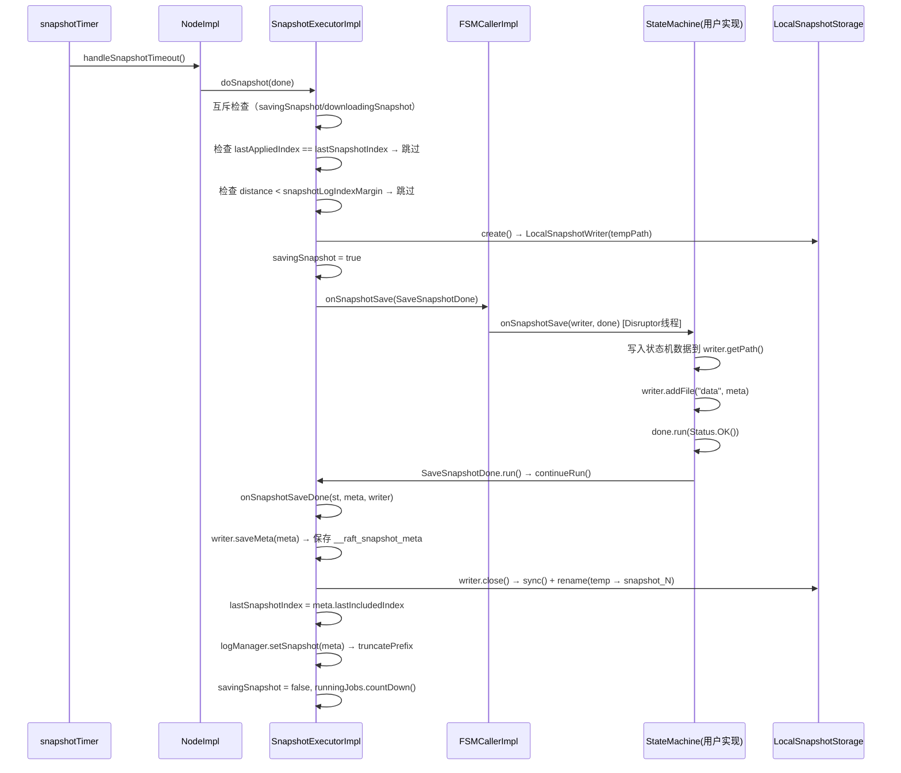
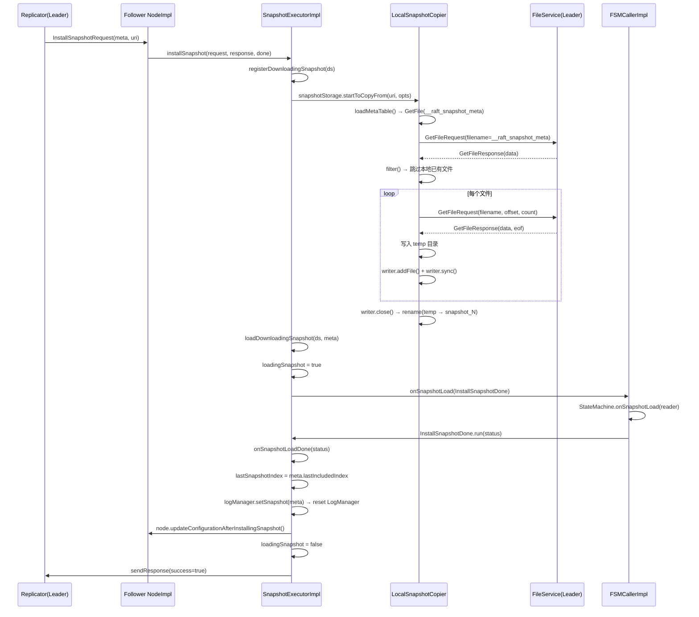
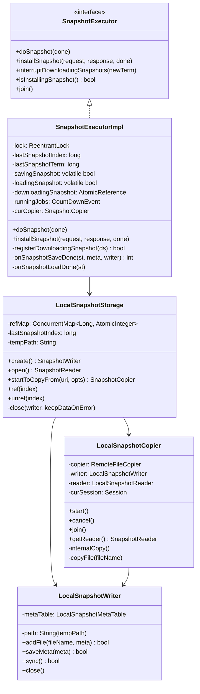

# 06 - 快照（Snapshot）：深度精读

## 学习目标

深入理解 JRaft 的快照机制，包括快照的触发条件、保存流程、安装流程（远程传输）、快照互斥设计，以及 `LocalSnapshotStorage` 的引用计数管理。

---

## 一、问题驱动：快照要解决什么问题？

### 【问题】

Raft 协议中，日志会无限增长。如果不做快照，有以下问题：

1. **磁盘空间耗尽**：日志无限增长，最终耗尽磁盘
2. **重启恢复慢**：重启时需要重放所有日志，日志越多恢复越慢
3. **新节点追赶慢**：新加入的节点需要从头复制所有日志，耗时极长
4. **Follower 落后太多**：Leader 已经删除了 Follower 需要的旧日志，无法通过日志复制追赶

### 【需要什么信息】

- 快照的"时间点"：`lastIncludedIndex` + `lastIncludedTerm`（快照包含到哪条日志）
- 快照的"内容"：用户状态机数据（由用户实现 `onSnapshotSave`）
- 快照的"配置"：`peers`（快照时刻的集群成员，用于配置恢复）
- 快照的"文件列表"：`files`（快照包含哪些文件，用于远程传输）
- 互斥控制：同一时刻只能有一个快照操作（保存或安装）
- 引用计数：快照文件被读取时不能被删除

### 【推导出的结构】

由此推导出：
- `SnapshotExecutorImpl`：快照执行器，维护互斥状态（`savingSnapshot`/`loadingSnapshot`）
- `LocalSnapshotStorage`：本地快照存储，管理快照目录和引用计数（`refMap`）
- `LocalSnapshotWriter`：写入快照到 `temp` 目录，完成后原子重命名
- `LocalSnapshotCopier`：从 Leader 下载快照文件，支持断点续传

---

## 二、核心数据结构

### 2.1 SnapshotExecutorImpl 核心字段（源码验证）

```java
// SnapshotExecutorImpl.java 第 65-90 行
private final Lock lock = new ReentrantLock();  // 普通锁（非读写锁）

private long lastSnapshotTerm;   // 最后一次快照的 term
private long lastSnapshotIndex;  // 最后一次快照的 index

private long term;               // 当前节点的 term（用于 installSnapshot 的 term 校验）

private volatile boolean savingSnapshot;   // 是否正在保存快照
private volatile boolean loadingSnapshot;  // 是否正在加载快照
private volatile boolean stopped;          // 是否已停止

private SnapshotStorage snapshotStorage;   // 快照存储（LocalSnapshotStorage）
private SnapshotCopier curCopier;          // 当前正在进行的快照拷贝器

private FSMCaller fsmCaller;
private NodeImpl node;
private LogManager logManager;

// 当前正在下载的快照（AtomicReference 保证原子替换）
private final AtomicReference<DownloadingSnapshot> downloadingSnapshot = new AtomicReference<>(null);

private SnapshotMeta loadingSnapshotMeta;  // 正在加载的快照元数据

// 运行中的任务计数器（doSnapshot 和 installSnapshot 各占一个）
private final CountDownEvent runningJobs = new CountDownEvent();
```

**字段存在的理由：**
- `savingSnapshot` 和 `loadingSnapshot` 都是 `volatile`：在 `lock` 保护下修改，但 `isInstallingSnapshot()` 不加锁直接读（只需可见性）
- `downloadingSnapshot` 是 `AtomicReference`：`registerDownloadingSnapshot()` 需要 CAS 替换，保证原子性
- `runningJobs` 是 `CountDownEvent`：`join()` 方法等待所有快照任务完成（`shutdown` 时使用）

### 2.2 DownloadingSnapshot 内部类（源码验证）

```java
// SnapshotExecutorImpl.java 第 95-110 行
static class DownloadingSnapshot {
    InstallSnapshotRequest          request;         // 原始 RPC 请求
    InstallSnapshotResponse.Builder responseBuilder; // 响应构建器
    RpcRequestClosure               done;            // RPC 回调（用于发送响应）
}
```

**设计意图**：将一次 `installSnapshot` RPC 的上下文打包，支持"重试替换"——如果同一快照的新 RPC 到来，用新的 `done` 替换旧的，旧 RPC 收到 `EINTR` 响应。

### 2.3 LocalSnapshotStorage 核心字段（源码验证）

```java
// LocalSnapshotStorage.java 第 60-75 行
private static final String TEMP_PATH = "temp";

// 引用计数 Map：key=snapshotIndex，value=引用计数
private final ConcurrentMap<Long, AtomicInteger> refMap = new ConcurrentHashMap<>();

private final String path;      // 快照根目录
private final String tempPath;  // 临时目录（写入中的快照）
private Endpoint addr;          // 本节点地址（用于 FileService 提供下载）
private boolean filterBeforeCopyRemote;  // 是否在拷贝前过滤本地已有文件
private long lastSnapshotIndex;          // 最新快照的 index（lock 保护）
private final Lock lock;
private final RaftOptions raftOptions;
private SnapshotThrottle snapshotThrottle;  // 传输限速
```

**引用计数设计**：
- `ref(index)`：引用计数 +1（`open()` 时调用，防止读取期间被删除）
- `unref(index)`：引用计数 -1，减到 0 时自动删除快照目录
- `refMap` 使用 `ConcurrentHashMap` + `AtomicInteger`，无锁并发安全

---

## 三、快照保存流程

### 3.1 完整时序图



### 3.2 doSnapshot() 逐行分析

```java
// SnapshotExecutorImpl.java 第 310-400 行
private void doSnapshot(final Closure done, boolean sync) {
    boolean doUnlock = true;
    this.lock.lock();
    try {
        // ① 已停止：拒绝
        if (this.stopped) {
            runClosureInThread(done, EPERM);
            return;
        }
        // ② sync 模式但不在 FSM 线程：拒绝（防止死锁）
        if (sync && !this.fsmCaller.isRunningOnFSMThread()) {
            runClosureInThread(done, EACCES);
            throw new IllegalStateException("...");
        }
        // ③ 正在安装快照：拒绝（互斥）
        if (this.downloadingSnapshot.get() != null) {
            runClosureInThread(done, EBUSY "Is loading another snapshot.");
            return;
        }
        // ④ 正在保存快照：拒绝（互斥）
        if (this.savingSnapshot) {
            runClosureInThread(done, EBUSY "Is saving another snapshot.");
            return;
        }
        // ⑤ 没有新日志：跳过（lastAppliedIndex == lastSnapshotIndex）
        if (this.fsmCaller.getLastAppliedIndex() == this.lastSnapshotIndex) {
            doUnlock = false;
            this.lock.unlock();
            this.logManager.clearBufferedLogs();  // 清理内存缓冲
            runClosureInThread(done);  // 成功回调（无需快照）
            return;
        }
        // ⑥ 距离上次快照太近：跳过（snapshotLogIndexMargin 配置）
        final long distance = this.fsmCaller.getLastAppliedIndex() - this.lastSnapshotIndex;
        if (distance < this.node.getOptions().getSnapshotLogIndexMargin()) {
            // 注意：与 ⑤ 一样，先 doUnlock=false 解锁，再调用 runClosureInThread，然后直接 return（不 relock）
            doUnlock = false;
            this.lock.unlock();
            runClosureInThread(done, ECANCELED);
            return;
        }
        // ⑦ 创建 writer（写入 temp 目录）
        final SnapshotWriter writer = this.snapshotStorage.create();
        if (writer == null) {
            runClosureInThread(done, EIO);
            reportError(EIO, "Fail to create snapshot writer.");
            return;
        }
        // ⑧ 标记正在保存
        this.savingSnapshot = true;
        final SaveSnapshotDone saveSnapshotDone = new SaveSnapshotDone(writer, done, null);
        // ⑨ 提交到 FSMCaller（通过 Disruptor 异步执行）
        if (sync) {
            this.fsmCaller.onSnapshotSaveSync(saveSnapshotDone);
        } else {
            if (!this.fsmCaller.onSnapshotSave(saveSnapshotDone)) {
                // ⚠️ 注意：此处 savingSnapshot=true 已设置，但直接 return！
                // savingSnapshot 永远不会被清除，导致节点卡死（后续所有快照请求返回 EBUSY）
                // 这是一个已知的设计缺陷，实际上 onSnapshotSave 几乎不会失败（只有节点 shutdown 时）
                runClosureInThread(done, EHOSTDOWN);
                return;
            }
        }
        this.runningJobs.incrementAndGet();
    } finally {
        if (doUnlock) this.lock.unlock();
    }
}
```

**`snapshotLogIndexMargin` 的作用**：防止频繁快照。如果距离上次快照的日志条数 < `snapshotLogIndexMargin`（默认 0），则跳过本次快照。设置为 0 表示每次都快照（由 `snapshotIntervalSecs` 控制频率）。

### 3.4 SaveSnapshotDone.continueRun() 分析

`onSnapshotSaveDone()` 并不是直接被 FSMCaller 调用的，而是通过 `SaveSnapshotDone.continueRun()` 包装调用：

```java
// SnapshotExecutorImpl.java SaveSnapshotDone 内部类
void continueRun(final Status st) {
    // ① 调用 onSnapshotSaveDone，获取最终 ret
    final int ret = onSnapshotSaveDone(st, this.meta, this.writer);
    // ② 如果 ret != 0 但 st 原本是 OK（如 ESTALE），修改 st 的错误码
    if (ret != 0 && st.isOk()) {
        st.setError(ret, "node call onSnapshotSaveDone failed");
    }
    // ③ 调用用户传入的 done 回调（通知调用方快照完成/失败）
    if (this.done != null) {
        ThreadPoolsFactory.runClosureInThread(getNode().getGroupId(), this.done, st);
    }
}
```

**关键设计**：`done` 回调（用户传入的 `Closure`）是在 `continueRun()` 中被调用的，而不是在 `onSnapshotSaveDone()` 内部。这样设计的原因是：`onSnapshotSaveDone()` 是 package-private 方法，专注于内部状态更新；`continueRun()` 负责将结果通知给外部调用方。

### 3.3 onSnapshotSaveDone() 逐行分析

```java
// SnapshotExecutorImpl.java 第 402-460 行
int onSnapshotSaveDone(final Status st, final SnapshotMeta meta, final SnapshotWriter writer) {
    int ret;
    this.lock.lock();
    try {
        ret = st.getCode();
        // ① 检查是否被 installSnapshot 抢占（ABA 防御）
        if (st.isOk()) {
            if (meta.getLastIncludedIndex() <= this.lastSnapshotIndex) {
                ret = RaftError.ESTALE.getNumber();  // 快照已过时
                writer.setError(ESTALE, "Installing snapshot is older than local snapshot");
            }
        }
    } finally {
        this.lock.unlock();
    }

    if (ret == 0) {
        // ② 保存元数据到 __raft_snapshot_meta
        if (!writer.saveMeta(meta)) {
            ret = RaftError.EIO.getNumber();
        }
    } else {
        if (writer.isOk()) {
            writer.setError(ret, "Fail to do snapshot.");
        }
    }

    // ③ 关闭 writer（触发 sync + rename(temp → snapshot_N)）
    try {
        writer.close();
    } catch (final IOException e) {
        ret = RaftError.EIO.getNumber();
    }

    boolean doUnlock = true;
    this.lock.lock();
    try {
        if (ret == 0) {
            // ④ 更新 lastSnapshotIndex/Term
            this.lastSnapshotIndex = meta.getLastIncludedIndex();
            this.lastSnapshotTerm = meta.getLastIncludedTerm();
            doUnlock = false;
            this.lock.unlock();
            // ⑤ 通知 LogManager 截断旧日志（在锁外调用，防止死锁）
            this.logManager.setSnapshot(meta);
            doUnlock = true;
            this.lock.lock();
        }
        // ⑥ 只有 EIO 才调用 reportError（节点进入 STATE_ERROR）
        // ESTALE 时不调用 reportError，节点不进入 ERROR 状态（ESTALE 是正常情况：被更新的 installSnapshot 抢占）
        if (ret == RaftError.EIO.getNumber()) {
            reportError(EIO, "Fail to save snapshot.");
        }
        // ⑦ 清除互斥标志
        this.savingSnapshot = false;
        this.runningJobs.countDown();
        return ret;
    } finally {
        if (doUnlock) this.lock.unlock();
    }
}
```

**关键设计：`logManager.setSnapshot(meta)` 在锁外调用**

`setSnapshot` 内部会调用 `logManager.truncatePrefix()`，而 `truncatePrefix` 可能触发 `wakeupAllWaiter`，进而回调 Replicator。如果在 `SnapshotExecutorImpl.lock` 内调用，可能与 Replicator 的锁产生死锁。所以用 `doUnlock` 标志位先 unlock，再调用，再 relock。

---

## 四、快照安装流程

### 4.1 完整时序图



### 4.2 registerDownloadingSnapshot() 分支穷举

```java
// SnapshotExecutorImpl.java 第 580-700 行
boolean registerDownloadingSnapshot(final DownloadingSnapshot ds) {
    this.lock.lock();
    try {
        // ① 已停止：拒绝
        if (this.stopped) { sendResponse(EHOSTDOWN); return false; }
        // ② 正在保存快照：拒绝（互斥）
        if (this.savingSnapshot) { sendResponse(EBUSY); return false; }
        // ③ term 不匹配：拒绝
        // 注意：在 term 检查之前，源码先执行了 ds.responseBuilder.setTerm(this.term)
        // 这是 Raft 协议的重要语义：告知 Follower 当前 Leader 的 term，Follower 收到后会更新自己的 term
        ds.responseBuilder.setTerm(this.term);
        if (ds.request.getTerm() != this.term) { sendResponse(success=false); return false; }
        // ④ 快照不比本地新：直接返回成功（已有更新快照）
        if (ds.request.getMeta().getLastIncludedIndex() <= this.lastSnapshotIndex) {
            sendResponse(success=true); return false;
        }

        final DownloadingSnapshot m = this.downloadingSnapshot.get();
        if (m == null) {
            // ⑤ 没有进行中的下载：新建 copier，开始下载
            this.downloadingSnapshot.set(ds);
            this.curCopier = snapshotStorage.startToCopyFrom(uri, opts);
            if (this.curCopier == null) {
                // 注意：startToCopyFrom 失败时，必须先清理 downloadingSnapshot，再发送 EINVAL
                this.downloadingSnapshot.set(null);
                sendResponse(EINVAL);
                return false;
            }
            this.runningJobs.incrementAndGet();
            return true;
        }

        if (m.lastIncludedIndex == ds.lastIncludedIndex) {
            // ⑥ 同一快照的重试：替换 session
            // 注意：saved.done.sendResponse(EINTR) 在锁外执行（finally 块之后），不在此处
            saved = m;
            this.downloadingSnapshot.set(ds);
            return true;  // 锁释放后，在方法末尾发送 EINTR 给旧 session
        } else if (m.lastIncludedIndex > ds.lastIncludedIndex) {
            // ⑦ 正在下载更新的快照：拒绝旧请求
            sendResponse(EINVAL "A newer snapshot is under installing"); return false;
        } else {
            // ⑧ 新快照比正在下载的更新
            if (this.loadingSnapshot) {
                // ⑧a 正在加载旧快照：无法中断，拒绝
                sendResponse(EBUSY "A former snapshot is under loading"); return false;
            }
            // ⑧b 取消旧下载，让调用方重试
            this.curCopier.cancel();
            sendResponse(EBUSY "A former snapshot is under installing, trying to cancel"); return false;
        }
    } finally {
        this.lock.unlock();
    }
}
```

**关键设计：为什么 ⑧b 不直接开始新下载，而是返回 EBUSY 让调用方重试？**

因为 `cancel()` 是异步的，`curCopier` 可能还在运行。如果立即开始新下载，两个 copier 会并发写同一个 `temp` 目录，导致数据损坏。返回 EBUSY 后，Leader 的 Replicator 会在下次心跳时重新发送 `InstallSnapshot`，此时旧 copier 已经被取消，可以安全开始新下载。

### 4.3 loadDownloadingSnapshot() 分支穷举

```java
// SnapshotExecutorImpl.java 第 460-510 行
void loadDownloadingSnapshot(final DownloadingSnapshot ds, final SnapshotMeta meta) {
    this.lock.lock();
    try {
        // ① 被其他请求中断（ds 已被替换）：直接 return，由新请求处理
        if (ds != this.downloadingSnapshot.get()) { return; }

        reader = this.curCopier.getReader();

        // ② copier 失败
        if (!this.curCopier.isOk()) {
            if (this.curCopier.getCode() == RaftError.EIO.getNumber()) {
                reportError(this.curCopier.getCode(), ...);  // EIO → reportError（节点进入 ERROR）
            }
            Utils.closeQuietly(reader);
            ds.done.run(this.curCopier);  // 发送失败响应
            Utils.closeQuietly(this.curCopier);
            this.curCopier = null;
            this.downloadingSnapshot.set(null);
            this.runningJobs.countDown();
            return;
        }

        Utils.closeQuietly(this.curCopier);
        this.curCopier = null;

        // ③ reader 为 null 或 reader 不 ok：EINTERNAL
        if (reader == null || !reader.isOk()) {
            Utils.closeQuietly(reader);
            this.downloadingSnapshot.set(null);
            ds.done.sendResponse(EINTERNAL "Fail to copy snapshot from %s");
            this.runningJobs.countDown();
            return;
        }

        // ④ 正常：设置 loadingSnapshot=true，准备加载
        this.loadingSnapshot = true;
        this.loadingSnapshotMeta = meta;
    } finally {
        this.lock.unlock();
    }

    // ⑤ 提交到 FSMCaller 加载快照
    final InstallSnapshotDone installSnapshotDone = new InstallSnapshotDone(reader);
    if (!this.fsmCaller.onSnapshotLoad(installSnapshotDone)) {
        // ⑥ FSMCaller 已停止：EHOSTDOWN
        installSnapshotDone.run(new Status(RaftError.EHOSTDOWN, "This raft node is down"));
    }
}
```

**关键设计**：`loadDownloadingSnapshot()` 在 `installSnapshot()` 中 `curCopier.join()` 之后调用，此时下载已完成。方法内部先检查 ds 是否仍是当前下载任务（防止被新请求替换），再检查 copier 状态，最后提交到 FSMCaller 加载。

**`installSnapshot()` 中 `curCopier.join()` 的中断处理**：
```java
try {
    this.curCopier.join();
} catch (final InterruptedException e) {
    Thread.currentThread().interrupt();  // 恢复中断标志
    LOG.warn("Install snapshot copy job was canceled.");
    return;  // 直接 return，不调用 loadDownloadingSnapshot
}
```

### 4.4 onSnapshotLoadDone() 分支穷举

`onSnapshotLoadDone()` 是快照安装的最后一步，由 `InstallSnapshotDone.run()` 回调触发（FSMCaller 完成 `onSnapshotLoad` 后）：

```java
// SnapshotExecutorImpl.java onSnapshotLoadDone()
private void onSnapshotLoadDone(final Status st) {
    DownloadingSnapshot m;
    boolean doUnlock = true;
    this.lock.lock();
    try {
        Requires.requireTrue(this.loadingSnapshot, "Not loading snapshot");
        m = this.downloadingSnapshot.get();
        if (st.isOk()) {
            // ① 加载成功：更新 lastSnapshotIndex/Term
            this.lastSnapshotIndex = this.loadingSnapshotMeta.getLastIncludedIndex();
            this.lastSnapshotTerm = this.loadingSnapshotMeta.getLastIncludedTerm();
            doUnlock = false;
            this.lock.unlock();
            // ② 通知 LogManager 截断旧日志（锁外调用，防止死锁，与 onSnapshotSaveDone 相同模式）
            this.logManager.setSnapshot(this.loadingSnapshotMeta);
            doUnlock = true;
            this.lock.lock();
        }
        // ③ 加载失败：不更新 lastSnapshotIndex（节点状态不变）
        doUnlock = false;
        this.lock.unlock();
        if (this.node != null) {
            // ④ 更新集群配置（锁外调用）：从快照元数据中恢复 peers
            this.node.updateConfigurationAfterInstallingSnapshot();
        }
        doUnlock = true;
        this.lock.lock();
        // ⑤ 清除互斥标志
        this.loadingSnapshot = false;
        this.downloadingSnapshot.set(null);
    } finally {
        if (doUnlock) this.lock.unlock();
    }
    if (m != null) {
        // ⑥ 发送 RPC 响应给 Leader
        if (!st.isOk()) {
            m.done.run(st);  // 失败：发送错误响应
        } else {
            m.responseBuilder.setSuccess(true);
            m.done.sendResponse(m.responseBuilder.build());  // 成功：发送 success=true
        }
    }
    // ⑦ 计数器 -1（与 registerDownloadingSnapshot 中的 incrementAndGet 对应）
    this.runningJobs.countDown();
}
```

**关键设计**：
- `updateConfigurationAfterInstallingSnapshot()` 也在锁外调用（与 `setSnapshot` 相同的 `doUnlock` 模式），因为它内部可能触发配置变更回调
- `m` 可能为 null（节点启动时加载本地快照，没有对应的 RPC 请求），此时不发送响应
- `loadingSnapshot=false` 和 `downloadingSnapshot.set(null)` 在锁内清除，保证互斥

### 4.5 interruptDownloadingSnapshots() 分析

```java
// SnapshotExecutorImpl.java 第 720-740 行
public void interruptDownloadingSnapshots(final long newTerm) {
    this.lock.lock();
    try {
        Requires.requireTrue(newTerm >= this.term);
        this.term = newTerm;  // ① 更新 term
        if (this.downloadingSnapshot.get() == null) {
            return;  // ② 没有下载中的快照：直接返回
        }
        if (this.loadingSnapshot) {
            return;  // ③ 正在加载（已下载完，正在应用）：不能中断
        }
        this.curCopier.cancel();  // ④ 取消下载（仅取消下载，不取消加载）
    } finally {
        this.lock.unlock();
    }
}
```

**调用时机**：`NodeImpl.stepDown()` 时调用，当节点收到更高 term 的消息时，中断正在进行的快照下载（因为新 Leader 可能有更新的快照或日志）。

---

## 五、LocalSnapshotStorage 引用计数设计

### 5.1 引用计数的必要性

快照文件在以下场景会被并发访问：
- `open()` 打开 reader 读取快照（Replicator 发送给 Follower）
- `close()` 完成新快照后删除旧快照
- `init()` 启动时清理旧快照

如果没有引用计数，`close()` 可能在 `open()` 读取期间删除文件，导致 Follower 下载失败。

### 5.2 引用计数操作（源码验证）

```java
// LocalSnapshotStorage.java 第 155-175 行

// ref：引用计数 +1（open 时调用）
void ref(final long index) {
    final AtomicInteger refs = getRefs(index);
    refs.incrementAndGet();
}

// unref：引用计数 -1，减到 0 时删除快照目录
void unref(final long index) {
    final AtomicInteger refs = getRefs(index);
    if (refs.decrementAndGet() == 0) {
        if (this.refMap.remove(index, refs)) {  // CAS 删除，防止并发
            destroySnapshot(getSnapshotPath(index));
        }
    }
}

// getRefs：获取或创建引用计数（putIfAbsent 保证原子性）
AtomicInteger getRefs(final long index) {
    AtomicInteger refs = this.refMap.get(index);
    if (refs == null) {
        refs = new AtomicInteger(0);
        final AtomicInteger eRefs = this.refMap.putIfAbsent(index, refs);
        if (eRefs != null) { refs = eRefs; }
    }
    return refs;
}
```

### 5.3 close() 中的原子重命名（源码验证）

```java
// LocalSnapshotStorage.java 第 215-270 行
void close(final LocalSnapshotWriter writer, final boolean keepDataOnError) throws IOException {
    int ret = writer.getCode();  // ← 先读取 writer 已有的错误码
    IOException ioe = null;

    // do-while(false) 模拟 goto
    do {
        // ① writer 已有错误：直接 break（跳过所有步骤）
        if (ret != 0) { break; }

        // ② sync：将 __raft_snapshot_meta 写入 temp 目录
        try {
            if (!writer.sync()) { ret = EIO; break; }
        } catch (final IOException e) {
            ret = EIO; ioe = e; break;  // sync 抛 IOException 也处理
        }

        final long oldIndex = getLastSnapshotIndex();
        final long newIndex = writer.getSnapshotIndex();
        if (oldIndex == newIndex) { ret = EEXISTS; break; }  // ③ 重复快照

        // ④ 删除目标路径（如果已存在）
        if (!destroySnapshot(newPath)) { ret = EIO; ioe = new IOException(...); break; }

        // ⑤ 原子重命名：temp → snapshot_N
        if (!Utils.atomicMoveFile(tempPath, newPath, true)) { ret = EIO; ioe = new IOException(...); break; }

        // ⑥ 新快照引用计数 +1
        ref(newIndex);

        // ⑦ 更新 lastSnapshotIndex（lock 保护）
        this.lock.lock();
        try {
            // 注意：更新前有断言检查，确保没有并发修改（两个 writer 不可能同时 close）
            Requires.requireTrue(oldIndex == this.lastSnapshotIndex);
            this.lastSnapshotIndex = newIndex;
        } finally {
            this.lock.unlock();
        }

        // ⑧ 旧快照引用计数 -1（减到 0 时自动删除）
        unref(oldIndex);
    } while (false);

    if (ret != 0 && !keepDataOnError) {
        destroySnapshot(writer.getPath());  // ⑨ 失败时删除 temp 目录
    }
    if (ioe != null) {
        throw ioe;  // ⑩ 抛出 IOException（调用方需处理）
    }
}
```

**原子重命名的重要性**：`Utils.atomicMoveFile` 使用 `Files.move(ATOMIC_MOVE)` 或 `File.renameTo()`，保证快照目录要么完整存在，要么不存在，不会出现"半写"状态。

---

## 六、LocalSnapshotCopier 下载流程

### 6.1 startCopy() 与 internalCopy() 的异常处理

`internalCopy()` 由 `startCopy()` 包装调用，`startCopy()` 捕获了两种异常：

```java
// LocalSnapshotCopier.java startCopy()
private void startCopy() {
    try {
        internalCopy();
    } catch (final InterruptedException e) {
        Thread.currentThread().interrupt();  // 恢复中断标志
    } catch (final IOException e) {
        // ⚠️ 注意：IOException 只打 error 日志，不调用 setError！
        // 这意味着 copier 的状态仍然是 OK，loadDownloadingSnapshot() 中
        // curCopier.isOk() 返回 true，但 reader 为 null，最终走 reader==null 分支返回 EINTERNAL
        LOG.error("Fail to start copy job", e);
    }
}
```

**关键设计**：`IOException` 被吞掉只打日志，不设置 copier 错误状态。这是一个需要注意的行为：如果 `internalCopy()` 抛出 `IOException`（如磁盘满），copier 状态为 OK 但 reader 为 null，最终 Follower 收到 EINTERNAL 响应，Leader 会重试。

### 6.2 internalCopy() 核心逻辑

```java
// LocalSnapshotCopier.java 第 88-115 行
private void internalCopy() throws IOException, InterruptedException {
    do {
        // ① 下载 __raft_snapshot_meta（快照元数据）
        loadMetaTable();
        if (!isOk()) break;

        // ② 过滤本地已有文件（filterBeforeCopyRemote=true 时）
        filter();
        if (!isOk()) break;

    // ③ 逐个下载文件
        // 注意：循环中没有 isOk() 检查！某个文件下载失败（setError）后，循环仍继续尝试其他文件
        // 这是设计意图：尽量下载更多文件，最终由 do-while 外的 !isOk() 检查统一处理错误
        final Set<String> files = this.remoteSnapshot.listFiles();
        for (final String file : files) {
            copyFile(file);  // 每个文件创建一个 Session
        }
    } while (false);

    // ④ 如果有错误，先将错误传递给 writer（writer.close() 时会据此决定是否 rename）
    if (!isOk() && this.writer != null && this.writer.isOk()) {
        this.writer.setError(getCode(), getErrorMsg());
    }
    // ⑤ 关闭 writer（rename temp → snapshot_N；如果有错误则删除 temp）
    if (this.writer != null) {
        Utils.closeQuietly(this.writer);
        this.writer = null;  // 关闭后置 null，防止重复关闭
    }
    // ⑥ 打开 reader（供 loadDownloadingSnapshot 使用）
    if (isOk()) {
        this.reader = (LocalSnapshotReader) this.storage.open();
    }
}
```

### 6.3 copyFile() 的断点续传设计

```java
// LocalSnapshotCopier.java 第 120-185 行
void copyFile(final String fileName) throws IOException, InterruptedException {
    // ① 已有文件：跳过（断点续传）
    if (this.writer.getFileMeta(fileName) != null) {
        LOG.info("Skipped downloading {}", fileName);
        return;
    }
    // ② 安全检查：防止路径穿越攻击（checkFile 检查路径是否在 writer 目录内）
    if (!checkFile(fileName)) { return; }

    // ③ 子目录创建：如果文件路径包含子目录（如 data/chunk/file.dat），先创建父目录
    final String filePath = this.writer.getPath() + File.separator + fileName;
    final Path subPath = Paths.get(filePath);
    if (!subPath.equals(subPath.getParent()) && !subPath.getParent().getFileName().toString().equals(".")) {
        final File parentDir = subPath.getParent().toFile();
        if (!parentDir.exists() && !parentDir.mkdirs()) {
            setError(RaftError.EIO, "Fail to create directory");
            return;  // mkdirs 失败 → EIO + return
        }
    }

    Session session = null;
    try {
        // ③ 在锁内创建 Session（防止 cancel() 竞争）
        this.lock.lock();
        try {
            if (this.cancelled) { setError(ECANCELED); return; }  // 已取消：直接返回
            session = this.copier.startCopyToFile(fileName, filePath, null);
            if (session == null) { setError(-1, "Fail to copy %s"); return; }  // 创建失败
            this.curSession = session;
        } finally {
            this.lock.unlock();
        }

        // ④ 等待下载完成（在锁外等待，防止 cancel() 死锁）
        session.join();
        this.lock.lock();
        try { this.curSession = null; } finally { this.lock.unlock(); }

        // ⑤ 检查下载结果（session 可能因网络错误失败）
        if (!session.status().isOk() && isOk()) {
            setError(session.status().getCode(), session.status().getErrorMsg());
            return;
        }

        // ⑥ 注册文件 + sync 元数据（断点续传的关键：sync 后崩溃重启可跳过已下载文件）
        if (!this.writer.addFile(fileName, meta)) { setError(EIO); return; }
        if (!this.writer.sync()) { setError(EIO); }
    } finally {
        if (session != null) {
            Utils.closeQuietly(session);  // ⑦ 无论成功失败，都关闭 session 释放资源
        }
    }
}
```

**断点续传**：`writer.getFileMeta(fileName) != null` 检查文件是否已下载。`writer.sync()` 在每个文件下载后立即持久化元数据，崩溃重启后可以跳过已下载的文件。

### 6.4 LocalSnapshotCopier.close() 资源释放

```java
// LocalSnapshotCopier.java close()
@Override
public void close() throws IOException {
    cancel();  // ① 先取消：设置 cancelled=true，cancel curSession，cancel future
    try {
        join();  // ② 再等待：等待下载线程（startCopy）完全退出
    } catch (final InterruptedException e) {
        Thread.currentThread().interrupt();  // 恢复中断标志
    }
}
```

**关键设计**：`close()` = `cancel()` + `join()`，保证调用 `close()` 后下载线程已完全退出，不会有残留的文件写入操作。`loadDownloadingSnapshot()` 中调用 `Utils.closeQuietly(this.curCopier)` 时，会触发这个 `close()`，确保 copier 线程安全退出。

### 6.5 LocalSnapshotStorage.open() 的引用计数管理

```java
// LocalSnapshotStorage.java open()
@Override
public SnapshotReader open() {
    long lsIndex = 0;
    this.lock.lock();
    try {
        if (this.lastSnapshotIndex != 0) {
            lsIndex = this.lastSnapshotIndex;
            ref(lsIndex);  // ① 引用计数 +1（在锁内，防止并发 close 删除快照）
        }
    } finally {
        this.lock.unlock();
    }
    if (lsIndex == 0) { return null; }  // ② 没有快照：返回 null

    final SnapshotReader reader = new LocalSnapshotReader(...);
    if (!reader.init(null)) {
        // ③ reader 初始化失败：必须 unref 归还引用计数！否则引用计数泄漏，快照目录永远不会被删除
        unref(lsIndex);
        return null;
    }
    return reader;
}
```

**关键设计**：`reader.init()` 失败时必须调用 `unref(lsIndex)` 归还引用计数，否则引用计数泄漏，快照目录永远不会被 `unref` 减到 0，导致磁盘空间无法释放。

---

## 七、对象关系图



---

## 八、核心不变式

1. **快照互斥：同一时刻只能有一个快照操作**
   - 保证机制：`doSnapshot()` 检查 `savingSnapshot` 和 `downloadingSnapshot`，`registerDownloadingSnapshot()` 检查 `savingSnapshot`
   - 源码：`SnapshotExecutorImpl.java:330-340`

2. **快照的 `lastIncludedIndex` 一定 ≤ `lastAppliedIndex`**
   - 保证机制：`doSnapshot()` 使用 `fsmCaller.getLastAppliedIndex()` 作为快照 index，而不是 `committedIndex`
   - 源码：`SnapshotExecutorImpl.java:340-360`

3. **`logManager.setSnapshot()` 必须在锁外调用**
   - 保证机制：`doUnlock` 标志位先 unlock，再调用 `setSnapshot`，再 relock
   - 原因：`setSnapshot` 内部调用 `truncatePrefix`，可能触发 Replicator 回调，与 `SnapshotExecutorImpl.lock` 产生死锁
   - 源码：`SnapshotExecutorImpl.java:440-450`

4. **快照文件原子替换：temp → snapshot_N**
   - 保证机制：`Utils.atomicMoveFile` 使用 `Files.move(ATOMIC_MOVE)`，保证快照目录要么完整存在，要么不存在
   - 源码：`LocalSnapshotStorage.java:220-225`

---

## 九、面试高频考点 📌

1. **快照保存期间，新的写请求能否继续处理？**
   - 可以。快照是对某个 `lastAppliedIndex` 时刻的状态做快照，快照保存期间 FSMCaller 继续处理新的 `onApply` 请求（快照和应用日志在同一个 Disruptor 线程中串行执行，但快照是异步的——`onSnapshotSave` 提交任务后立即返回，用户在 `onSnapshotSave` 回调中异步写文件）

2. **为什么快照元数据要包含 `peers`？**
   - 集群成员变更时，快照需要携带当时的配置。安装快照后，`updateConfigurationAfterInstallingSnapshot()` 从快照元数据中恢复集群配置，防止新节点使用过时的配置

3. **`LocalSnapshotStorage` 为什么保留多个快照目录？**
   - 防止新快照保存失败时旧快照被删除。引用计数机制保证：旧快照在被 `open()` 读取期间不会被删除（`unref` 减到 0 才删除）

4. **快照传输失败如何处理？**
   - `copyFile()` 中每个文件下载后立即 `writer.sync()` 持久化元数据，崩溃重启后可以跳过已下载的文件（断点续传）
   - `cancel()` 取消当前 `curSession`，`internalCopy()` 退出循环，`writer.close()` 清理 temp 目录

5. **`registerDownloadingSnapshot()` 中，为什么新快照比正在下载的更新时，不直接开始新下载，而是返回 EBUSY？**
   - `cancel()` 是异步的，旧 copier 可能还在写 temp 目录。立即开始新下载会导致两个 copier 并发写同一个 temp 目录，数据损坏。返回 EBUSY 后，Leader 重试时旧 copier 已取消

6. **`interruptDownloadingSnapshots()` 为什么不能中断正在加载（`loadingSnapshot=true`）的快照？**
   - 加载阶段已经下载完成，正在调用 `StateMachine.onSnapshotLoad()`，状态机正在重置。此时中断会导致状态机处于不一致状态，无法恢复。只能等加载完成后再处理新的 term

7. **`doSnapshotSync()` 和 `doSnapshot()` 的区别？**
   - `doSnapshot()`：异步，通过 Disruptor 提交任务，立即返回
   - `doSnapshotSync()`：同步，必须在 FSM 线程（`StateMachine` 回调方法）中调用，否则抛 `IllegalStateException`。用于在状态机回调中主动触发快照（如 `onApply` 中判断数据量达到阈值）

---

## 十、生产踩坑 ⚠️

1. **`onSnapshotSave()` 中忘记调用 `done.run()`，导致快照永远不完成，节点卡死**
   - 原因：`savingSnapshot=true` 永远不会被清除，后续所有快照请求都返回 EBUSY
   - 排查：检查 `SnapshotExecutorImpl.describe()` 输出，`savingSnapshot=true` 且长时间不变

6. **`fsmCaller.onSnapshotSave()` 返回 false 时，`savingSnapshot=true` 永远不会被清除**
   - 原因：`doSnapshot()` 中 `savingSnapshot=true` 设置后，若 `onSnapshotSave()` 失败直接 return，`savingSnapshot` 永远不会被重置（`SnapshotExecutorImpl.java:370-375`）
   - 触发条件：节点正在 shutdown 时（`FSMCallerImpl` 已停止），此时 `onSnapshotSave()` 返回 false
   - 实际影响：节点 shutdown 时触发，shutdown 后节点不再接受请求，影响有限；但如果在非 shutdown 场景触发，会导致节点永久卡死
   - 排查：同上，检查 `describe()` 输出

2. **快照文件过大（几十 GB），传输时间超过选举超时，导致 Follower 频繁触发选举**
   - 原因：`isInstallingSnapshot()` 返回 `true` 时，`handleElectionTimeout()` 会跳过选举（`preVote()` 中检查 `snapshotExecutor.isInstallingSnapshot()`），但如果快照传输超时，Follower 可能已经 stepDown
   - 建议：配置 `snapshotThrottle` 限速，同时增大 `electionTimeoutMs`

3. **快照目录权限问题导致文件写入失败，节点进入 `STATE_ERROR`**
   - 原因：`reportError(EIO, ...)` 调用 `fsmCaller.onError()`，触发 `StateMachine.onError()`，节点进入 `STATE_ERROR`
   - 排查：检查快照目录权限，确保 JVM 进程有读写权限

4. **未配置 `snapshotThrottle`，快照传输占满带宽，影响正常 Raft 心跳**
   - 建议：生产环境必须配置 `ThroughputSnapshotThrottle`，限制快照传输速率

5. **`snapshotLogIndexMargin` 设置过大，导致快照永远不触发**
   - 原因：`distance < snapshotLogIndexMargin` 时跳过快照，如果 `snapshotLogIndexMargin` 设置为 `Integer.MAX_VALUE`，快照永远不会触发
   - 建议：默认值为 0（每次都快照），根据业务场景合理设置

---

## 十一、⑥ 运行验证结论

### 验证方式

在 `doSnapshot()` 和 `onSnapshotSaveDone()` 中临时添加 `System.out.println` 埋点，运行 `NodeTest#testInstallSnapshotWithThrottle`，收集真实运行数据。

### 验证结果

```
[PROBE][doSnapshot] main savingSnapshot=true, lastSnapshotIndex=0, lastAppliedIndex=21
[PROBE][onSnapshotSaveDone] JRaft-Group-Default-Executor-11 STEP1: lastSnapshotIndex updated to 21 (in lock)
[PROBE][onSnapshotSaveDone] JRaft-Group-Default-Executor-11 STEP2: calling logManager.setSnapshot (OUT OF LOCK)
[PROBE][onSnapshotSaveDone] JRaft-Group-Default-Executor-11 STEP3: logManager.setSnapshot done, re-locking
[PROBE][onSnapshotSaveDone] JRaft-Group-Default-Executor-11 STEP4: savingSnapshot=false, runningJobs.countDown()
[PROBE][doSnapshot] main savingSnapshot=true, lastSnapshotIndex=21, lastAppliedIndex=31
[PROBE][onSnapshotSaveDone] JRaft-Group-Default-Executor-15 STEP1: lastSnapshotIndex updated to 31 (in lock)
[PROBE][onSnapshotSaveDone] JRaft-Group-Default-Executor-15 STEP2: calling logManager.setSnapshot (OUT OF LOCK)
[PROBE][onSnapshotSaveDone] JRaft-Group-Default-Executor-15 STEP3: logManager.setSnapshot done, re-locking
[PROBE][onSnapshotSaveDone] JRaft-Group-Default-Executor-15 STEP4: savingSnapshot=false, runningJobs.countDown()
```

**结论验证**：
- ✅ `doSnapshot` 由 `main` 线程触发（`node.snapshot()` 调用方），`onSnapshotSaveDone` 由 `JRaft-Group-Default-Executor` 线程执行（FSMCaller 的 Disruptor 线程池）
- ✅ `logManager.setSnapshot` 确实在锁外调用（STEP2 在 STEP1 unlock 之后，STEP3 re-lock 之前）
- ✅ `savingSnapshot=false` 在最后（STEP4），保证互斥标志在所有操作完成后才清除
- ✅ 第一次快照：`lastSnapshotIndex=0 → 21`（21 条日志）；第二次快照：`lastSnapshotIndex=21 → 31`（又提交了 10 条日志）
- ✅ 两次快照由不同的 Executor 线程执行（Executor-11 和 Executor-15），说明 FSMCaller 的线程池是多线程的，但快照互斥机制保证了串行执行