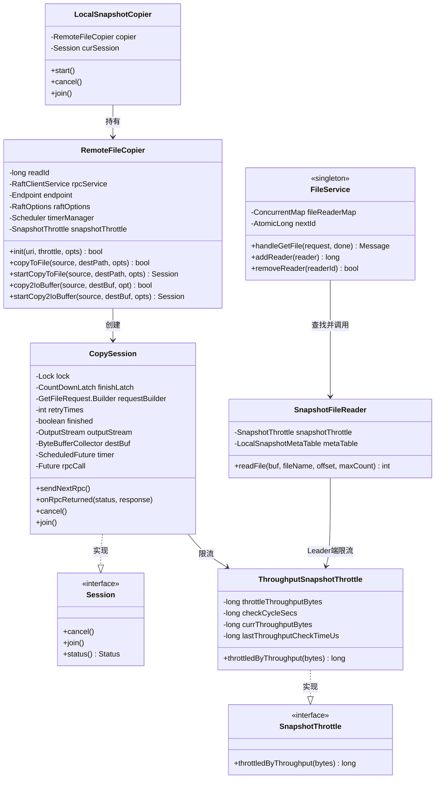
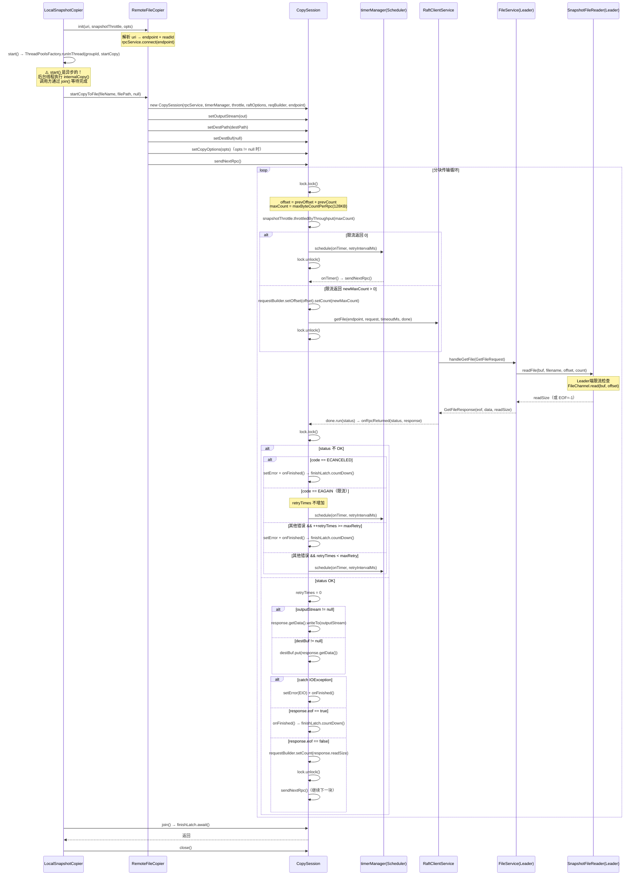

# S10：远程快照拷贝（RemoteFileCopier + CopySession）

> **归属**：补入 `06-snapshot/README.md` 新增第 N 节  
> **优先级**：P1（P1 最后一块，完成后 P1 全部清零）  
> **核心源码**：`RemoteFileCopier.java`（6.8KB）+ `CopySession.java`（10.8KB）+ `ThroughputSnapshotThrottle.java`（3.5KB）+ `FileService.java`（6.1KB）

---

## 1. 问题推导

### 【问题】快照文件可能有数 GB，如何跨网络传输？

Raft 的快照安装流程（`InstallSnapshot`）只传递了一个 URI，真正的文件传输是独立的：

```
InstallSnapshotRequest.uri = "remote://ip:port/readerId"
```

Follower 收到这个 URI 后，需要主动去 Leader 拉取快照文件。面临三个核心挑战：

| 挑战 | 问题 | 解决方案 |
|------|------|---------|
| 文件大 | 快照可能数 GB，不能一次性传输 | **分块传输**（offset + count） |
| 网络抖动 | 传输中途失败怎么办 | **重试机制**（最多 3 次，间隔 1s） |
| 带宽竞争 | 快照传输占满带宽影响 Raft 心跳 | **限流器**（ThroughputSnapshotThrottle） |

### 【需要什么信息】

- 远端地址（Leader 的 ip:port）
- 文件读取会话 ID（readerId，Leader 端注册的 FileReader）
- 当前传输进度（offset）
- 每次传输大小（count）
- 重试次数和间隔
- 限流配额

### 【推导出的结构】

```
RemoteFileCopier（连接管理 + 会话创建）
  └── CopySession（单文件传输状态机）
        ├── requestBuilder（offset + count 的滑动窗口）
        ├── retryTimes（重试计数）
        ├── snapshotThrottle（限流器）
        └── finishLatch（等待完成）
```

---

## 2. 整体架构

### 2.1 组件关系图



### 2.2 双端限流说明

⚠️ **限流在两端都有**：

| 端 | 限流位置 | 代码位置 |
|----|---------|---------|
| **Follower（拉取端）** | `CopySession.sendNextRpc()` 中调用 `snapshotThrottle.throttledByThroughput()` | `CopySession.java:287-295` |
| **Leader（服务端）** | `SnapshotFileReader.readFile()` 中调用 `snapshotThrottle.throttledByThroughput()` | `SnapshotFileReader.java:77-84` |

两端使用**各自独立的** `ThroughputSnapshotThrottle` 实例，互不干扰。

---

## 3. 核心数据结构

### 3.1 RemoteFileCopier 字段分析

**源码**：`RemoteFileCopier.java:51-56`

```java
private long             readId;           // Leader 端注册的 FileReader ID（从 URI 解析）
private RaftClientService rpcService;      // RPC 客户端，用于发送 GetFileRequest
private Endpoint          endpoint;        // Leader 的 ip:port（从 URI 解析）
private RaftOptions       raftOptions;     // 包含 maxByteCountPerRpc（默认 128KB）
private Scheduler         timerManager;   // 定时器，用于重试调度
private SnapshotThrottle  snapshotThrottle; // 限流器（可为 null）
```

**URI 格式解析**（`RemoteFileCopier.java:70-85`）：

```
remote://192.168.1.1:8080/12345678
         └─────────────┘  └──────┘
              endpoint      readId
```

- `Snapshot.REMOTE_SNAPSHOT_URI_SCHEME` = `"remote://"`（`Snapshot.java:42`）
- `readId` 是 `FileService.addReader()` 返回的 ID，用于在 Leader 端查找对应的 `SnapshotFileReader`

### 3.2 CopySession 字段分析

**源码**：`CopySession.java:65-84`（字段定义区域）

```java
private final Lock                   lock;           // 保护所有状态的互斥锁
private final Status                 st;             // 最终状态（OK 或错误码）
private final CountDownLatch         finishLatch;    // join() 等待的门闩，初始值=1
private final GetFileResponseClosure done;           // RPC 回调，调用 onRpcReturned()
private final RaftClientService      rpcService;     // RPC 客户端
private final GetFileRequest.Builder requestBuilder; // 复用的请求构建器（滑动 offset）
private final Endpoint               endpoint;       // Leader 地址
private final Scheduler              timerManager;   // 重试定时器
private final SnapshotThrottle       snapshotThrottle; // 限流器
private final RaftOptions            raftOptions;    // 包含 maxByteCountPerRpc
private int                          retryTimes;     // 当前重试次数（默认 0）
private boolean                      finished;       // 是否已完成（成功/失败/取消）
private ByteBufferCollector          destBuf;        // 目标内存缓冲（copy2IoBuffer 时使用）
private CopyOptions                  copyOptions;    // maxRetry=3, retryIntervalMs=1000, timeoutMs=10000
private OutputStream                 outputStream;   // 目标文件流（copyToFile 时使用）
private ScheduledFuture<?>           timer;          // 当前重试定时器句柄
private String                       destPath;       // 目标文件路径（用于错误日志）
private Future<Message>              rpcCall;        // 当前 RPC 调用句柄（用于 cancel）
```

**关键设计**：`requestBuilder` 是**复用**的，每次 `sendNextRpc()` 都在原有基础上更新 `offset` 和 `count`，不重新创建对象。

### 3.3 GetFileRequest / GetFileResponse 消息结构

**源码**：`rpc.proto:88-100`

```protobuf
message GetFileRequest {
  required int64  reader_id   = 1;  // Leader 端 FileReader 的 ID
  required string filename    = 2;  // 要读取的文件名
  required int64  count       = 3;  // 期望读取的字节数
  required int64  offset      = 4;  // 文件读取起始偏移量
  optional bool   read_partly = 5;  // 是否允许部分读取（始终为 true）
}

message GetFileResponse {
  required bool   eof       = 1;  // 是否已到文件末尾
  required bytes  data      = 2;  // 实际读取的数据
  optional int64  read_size = 3;  // 实际读取的字节数（可能 < count）
  optional ErrorResponse errorResponse = 99;
}
```

### 3.4 CopyOptions 字段

**源码**：`CopyOptions.java:28-30`

```java
private int  maxRetry        = 3;       // 最大重试次数
private long retryIntervalMs = 1000L;   // 重试间隔（毫秒）
private int  timeoutMs       = 10 * 1000; // 单次 RPC 超时（10秒）
```

---

## 4. 完整时序图



---

## 5. RemoteFileCopier 详解

### 5.1 init() — URI 解析与连接建立

**源码**：`RemoteFileCopier.java:68-88`

**分支穷举清单**：（源码行号已对照 `RemoteFileCopier.java` 逐行验证）

| 条件 | 结果 |
|------|------|
| □ uri == null 或不以 `remote://` 开头 | LOG.error + return false |
| □ catch(Exception) 解析 readerId 或 endpoint 失败 | LOG.error("Fail to parse readerId or endpoint.") + return false |
| □ !rpcService.connect(endpoint) | LOG.error("Fail to init channel to {}.") + return false |
| □ 全部通过 | return true |

```java
// RemoteFileCopier.java:68-88
public boolean init(String uri, final SnapshotThrottle snapshotThrottle, final SnapshotCopierOptions opts) {
    this.rpcService = opts.getRaftClientService();
    this.timerManager = opts.getTimerManager();
    this.raftOptions = opts.getRaftOptions();
    this.snapshotThrottle = snapshotThrottle;

    final int prefixSize = Snapshot.REMOTE_SNAPSHOT_URI_SCHEME.length(); // "remote://"
    if (uri == null || !uri.startsWith(Snapshot.REMOTE_SNAPSHOT_URI_SCHEME)) {
        LOG.error("Invalid uri {}.", uri);
        return false;
    }
    uri = uri.substring(prefixSize);          // "192.168.1.1:8080/12345678"
    final int slasPos = uri.indexOf('/');
    final String ipAndPort = uri.substring(0, slasPos);  // "192.168.1.1:8080"
    uri = uri.substring(slasPos + 1);                    // "12345678"

    try {
        this.readId = Long.parseLong(uri);               // readerId = 12345678
        final String[] ipAndPortStrs = ipAndPort.split(":");
        this.endpoint = new Endpoint(ipAndPortStrs[0], Integer.parseInt(ipAndPortStrs[1]));
    } catch (final Exception e) {
        LOG.error("Fail to parse readerId or endpoint.", e);
        return false;
    }
    if (!this.rpcService.connect(this.endpoint)) {
        LOG.error("Fail to init channel to {}.", this.endpoint);
        return false;
    }
    return true;
}
```

### 5.2 两种拷贝模式

`RemoteFileCopier` 提供两种拷贝模式，对应不同的目标：

| 方法 | 目标 | 使用场景 |
|------|------|---------|
| `copyToFile()` / `startCopyToFile()` | 本地文件（`OutputStream`） | 拷贝快照数据文件 |
| `copy2IoBuffer()` / `startCopy2IoBuffer()` | 内存缓冲（`ByteBufferCollector`） | 拷贝快照元数据文件（`__raft_snapshot_meta`） |

**源码**：`RemoteFileCopier.java:100-193`

`startCopyToFile()` 的分支穷举清单（`RemoteFileCopier.java:122-146`）：

| 条件 | 结果 | 源码行 |
|------|------|--------|
| □ file.exists() && !file.delete() | LOG.error + return null | `RemoteFileCopier.java:127-130` |
| □ file.exists() && file.delete() 成功 | 继续创建 OutputStream | `RemoteFileCopier.java:127-130` |
| □ !file.exists() | 直接创建 OutputStream | `RemoteFileCopier.java:132-138` |
| □ new FileOutputStream() 抛出 IOException | **方法签名 throws IOException，由调用方 copyFile() 的 finally 块处理** | `RemoteFileCopier.java:132` |
| □ opts != null | session.setCopyOptions(opts) | `RemoteFileCopier.java:139-141` |
| □ opts == null | 使用默认 CopyOptions（maxRetry=3, retryIntervalMs=1000ms, timeoutMs=10s） | `RemoteFileCopier.java:139-141` |

`startCopyToFile()` 的关键细节（`RemoteFileCopier.java:122-146`）：

```java
// 1. 删除已存在的目标文件
if (file.exists()) {
    if (!file.delete()) {
        LOG.error("Fail to delete destPath: {}.", destPath);
        return null;  // ← 分支：删除失败直接返回 null
    }
}

// 2. 创建带 fsync 的 FileOutputStream
final OutputStream out = new BufferedOutputStream(new FileOutputStream(file, false) {
    @Override
    public void close() throws IOException {
        getFD().sync();   // ← 关闭时强制 fsync，保证数据落盘
        super.close();
    }
});

// 3. 创建 CopySession 并立即发送第一个 RPC
final CopySession session = newCopySession(source);
session.setOutputStream(out);
session.setDestPath(destPath);   // ← 设置目标路径（用于错误日志）
session.setDestBuf(null);        // ← 明确设置 destBuf=null（写文件模式）
if (opts != null) {
    session.setCopyOptions(opts);  // ← 设置拷贝选项（maxRetry/timeout 等）
}
session.sendNextRpc();  // ← 立即开始，不等待
return session;         // ← 返回 Session，调用方通过 join() 等待完成
```

📌 **设计亮点**：`close()` 中调用 `getFD().sync()` 确保文件数据真正落盘，防止 OS 缓存导致的数据丢失。

### 5.3 startCopy2IoBuffer() — 拷贝到内存缓冲

**源码**：`RemoteFileCopier.java:182-190`

**分支穷举清单**：

| 条件 | 结果 | 源码行 |
|------|------|--------|
| □ opts != null | session.setCopyOptions(opts) | `RemoteFileCopier.java:186-188` |
| □ opts == null | 使用默认 CopyOptions | `RemoteFileCopier.java:186-188` |

```java
// RemoteFileCopier.java:182-190
public Session startCopy2IoBuffer(final String source, final ByteBufferCollector destBuf, final CopyOptions opts) {
    final CopySession session = newCopySession(source);
    session.setOutputStream(null);   // ← 明确设置 outputStream=null（内存模式）
    session.setDestBuf(destBuf);     // ← 设置目标内存缓冲
    if (opts != null) {
        session.setCopyOptions(opts);
    }
    session.sendNextRpc();
    return session;
}
```

⚠️ **与 `startCopyToFile()` 的关键差异**：
- `startCopy2IoBuffer()` 设置 `destBuf = ByteBufferCollector`，`outputStream = null`
- `startCopyToFile()` 设置 `outputStream = FileOutputStream`，`destBuf = null`
- 在 `sendNextRpc()` 中，`maxCount = destBuf == null ? 128KB : Integer.MAX_VALUE`，所以内存模式一次性请求全部数据（元数据文件很小，通常 < 1KB）

### 6.1 sendNextRpc() — 发送下一块请求

**源码**：`CopySession.java:276-308`（`sendNextRpc` 方法）

这是整个分块传输的**驱动引擎**，每次调用发送一个 `GetFileRequest`。

**分支穷举清单**（`CopySession.java:276-308`）：

| 条件 | 结果 | 源码行 |
|------|------|--------|
| □ this.finished == true | 直接 return（不再发送） | `CopySession.java:284` |
| □ snapshotThrottle != null && throttledByThroughput() == 0 | requestBuilder.setCount(0) + schedule timer + return | `CopySession.java:289-293` |
| □ snapshotThrottle != null && throttledByThroughput() > 0 | 使用 newMaxCount 发送 RPC | `CopySession.java:287-295` |
| □ snapshotThrottle == null | 使用原始 maxCount 发送 RPC | `CopySession.java:295-299` |
| □ destBuf == null（写文件模式） | maxCount = raftOptions.getMaxByteCountPerRpc()（默认 128KB） | `CopySession.java:281` |
| □ destBuf != null（写内存模式） | maxCount = Integer.MAX_VALUE（一次性全量读取） | `CopySession.java:281` |

```java
void sendNextRpc() {
    this.lock.lock();
    try {
        this.timer = null;
        // 计算下一块的起始偏移量
        // offset = 上次 offset + 上次实际读取的 count
        final long offset = this.requestBuilder.getOffset() + this.requestBuilder.getCount();
        // 分块大小：写文件时用 maxByteCountPerRpc(128KB)，写内存时用 Integer.MAX_VALUE
        final long maxCount = this.destBuf == null ? this.raftOptions.getMaxByteCountPerRpc() : Integer.MAX_VALUE;
        this.requestBuilder.setOffset(offset).setCount(maxCount).setReadPartly(true);

        if (this.finished) {
            return;  // ← 已完成则不再发送（CopySession.java:284）
        }

        // 限流检查
        long newMaxCount = maxCount;
        if (this.snapshotThrottle != null) {
            newMaxCount = this.snapshotThrottle.throttledByThroughput(maxCount);
            if (newMaxCount == 0) {
                // 限流返回 0：本周期配额已耗尽，等待下一周期
                this.requestBuilder.setCount(0);  // ← 重置 count，下次重试时重新计算
                this.timer = this.timerManager.schedule(this::onTimer,
                    this.copyOptions.getRetryIntervalMs(), TimeUnit.MILLISECONDS);
                return;
            }
        }
        this.requestBuilder.setCount(newMaxCount);
        final RpcRequests.GetFileRequest request = this.requestBuilder.build();
        // 发送异步 RPC，回调 done（即 onRpcReturned）
        this.rpcCall = this.rpcService.getFile(this.endpoint, request,
            this.copyOptions.getTimeoutMs(), this.done);
    } finally {
        this.lock.unlock();
    }
}
```

**offset 滑动窗口机制**（`CopySession.java:278-279`）：

```
第1次：offset=0,  count=128KB → 读取 [0, 128KB)
第2次：offset=128KB, count=128KB → 读取 [128KB, 256KB)
第3次：offset=256KB, count=128KB → 读取 [256KB, 384KB)
...
```

⚠️ **注意**：`offset = prevOffset + prevCount`，而不是 `prevOffset + actualReadSize`。但在 `onRpcReturned()` 中，如果 `!response.getEof()`，会将 `count` 更新为 `response.getReadSize()`（实际读取量），确保下次 offset 计算正确。

### 6.2 onRpcReturned() — 处理响应

**源码**：`CopySession.java:215-274`（`onRpcReturned` 方法）

**分支穷举清单**（完整版）：

| 条件 | 结果 | 源码行 |
|------|------|--------|
| □ this.finished == true | 直接 return | `CopySession.java:218` |
| □ !status.isOk() && code == ECANCELED && st.isOk() | setError(ECANCELED) + onFinished() + return | `CopySession.java:223-227` |
| □ !status.isOk() && code == ECANCELED && !st.isOk() | **fall through** 到 retryTimes 检查（ECANCELED != EAGAIN，所以 ++retryTimes） | `CopySession.java:229` |
| □ !status.isOk() && code != EAGAIN && ++retryTimes >= maxRetry && st.isOk() | setError + onFinished() + return | `CopySession.java:229-233` |
| □ !status.isOk() && code != EAGAIN && ++retryTimes >= maxRetry && !st.isOk() | **fall through** 到 schedule timer（st 已有错误不覆盖） | `CopySession.java:235-236` |
| □ !status.isOk() && code != EAGAIN && retryTimes < maxRetry | schedule timer 重试 | `CopySession.java:235-236` |
| □ !status.isOk() && code == EAGAIN | **不增加** retryTimes，schedule timer 重试 | `CopySession.java:235-236` |
| □ status.isOk() && response == null | Requires.requireNonNull 抛出 IllegalArgumentException | `CopySession.java:239` |
| □ status.isOk() && !response.getEof() | **先** requestBuilder.setCount(response.getReadSize())（更新 count 为实际读取量） | `CopySession.java:241` |
| □ status.isOk() && outputStream != null | response.getData().writeTo(outputStream) | `CopySession.java:243-245` |
| □ catch(IOException) 写文件失败 | setError(EIO) + onFinished() + return | `CopySession.java:246-250` |
| □ status.isOk() && outputStream == null | destBuf.put(response.getData()) | `CopySession.java:252` |
| □ status.isOk() && response.eof == true | onFinished() → finishLatch.countDown() + return | `CopySession.java:254-256` |
| □ status.isOk() && response.eof == false | lock.unlock()（finally），sendNextRpc()（继续下一块） | `CopySession.java:274` |

```java
// CopySession.java:215-274（核心逻辑）
void onRpcReturned(final Status status, final GetFileResponse response) {
    this.lock.lock();
    try {
        if (this.finished) { return; }

        if (!status.isOk()) {
            // 失败时重置 count=0，下次重试会重新计算 offset
            this.requestBuilder.setCount(0);

            if (status.getCode() == RaftError.ECANCELED.getNumber()) {
                if (this.st.isOk()) {
                    this.st.setError(status.getCode(), status.getErrorMsg());
                    onFinished();
                    return;
                }
            }

            // EAGAIN（限流）不增加重试次数
            if (status.getCode() != RaftError.EAGAIN.getNumber()
                    && ++this.retryTimes >= this.copyOptions.getMaxRetry()) {
                if (this.st.isOk()) {
                    this.st.setError(status.getCode(), status.getErrorMsg());
                    onFinished();
                    return;
                }
            }
            // 调度重试
            this.timer = this.timerManager.schedule(this::onTimer,
                this.copyOptions.getRetryIntervalMs(), TimeUnit.MILLISECONDS);
            return;
        }

        // 成功：重置重试计数
        this.retryTimes = 0;
        // 更新 count 为实际读取量（非 EOF 时）
        if (!response.getEof()) {
            this.requestBuilder.setCount(response.getReadSize());
        }
        // 写入目标
        if (this.outputStream != null) {
            try {
                response.getData().writeTo(this.outputStream);
            } catch (final IOException e) {
                LOG.error("Fail to write into file {}", this.destPath, e);
                this.st.setError(RaftError.EIO, RaftError.EIO.name());
                onFinished();
                return;
            }
        } else {
            this.destBuf.put(response.getData().asReadOnlyByteBuffer());
        }
        // EOF：传输完成
        if (response.getEof()) {
            onFinished();
            return;
        }
    } finally {
        this.lock.unlock();
    }
    // 非 EOF：继续发送下一块（在锁外调用）
    sendNextRpc();
}
```

📌 **关键设计**：`sendNextRpc()` 在 `lock.unlock()` 之后调用（`finally` 块先执行 unlock，然后方法末尾调用 `sendNextRpc()`），避免持锁期间发起 RPC 调用导致死锁。

### 6.3 onFinished() — 完成清理

**源码**：`CopySession.java:188-208`

```java
private void onFinished() {
    if (!this.finished) {  // ← 幂等保护：防止重复调用
        if (!this.st.isOk()) {
            LOG.error("Fail to copy data, readerId={} fileName={} offset={} status={}",
                this.requestBuilder.getReaderId(), this.requestBuilder.getFilename(),
                this.requestBuilder.getOffset(), this.st);
        }
        if (this.outputStream != null) {
            Utils.closeQuietly(this.outputStream);  // ← 关闭文件流（触发 fsync）
            this.outputStream = null;
        }
        if (this.destBuf != null) {
            final ByteBuffer buf = this.destBuf.getBuffer();
            if (buf != null) {
                BufferUtils.flip(buf);  // ← flip 内存缓冲，准备读取
            }
            this.destBuf = null;
        }
        this.finished = true;
        this.finishLatch.countDown();  // ← 唤醒 join() 等待的线程
    }
}
```

### 6.4 CopySession.join() — 等待单文件传输完成

**源码**：`CopySession.java:179-181`

```java
@Override
public void join() throws InterruptedException {
    this.finishLatch.await();  // ← 简单等待，无 catch，InterruptedException 直接向上抛
}
```

⚠️ **与 `LocalSnapshotCopier.join()` 的关键差异**：`CopySession.join()` 直接 `await()`，`InterruptedException` 不捕获直接向上抛；而 `LocalSnapshotCopier.join()` 调用 `future.get()`，有3个 catch 块（`InterruptedException` 重新抛出、`CancellationException` 静默忽略、`Exception` 包装为 `IllegalStateException`）。

### 6.5 cancel() — 取消传输

**源码**：`CopySession.java:157-173`

```java
public void cancel() {
    this.lock.lock();
    try {
        if (this.finished) { return; }  // 已完成则幂等
        if (this.timer != null) {
            this.timer.cancel(true);    // 取消重试定时器
        }
        if (this.rpcCall != null) {
            this.rpcCall.cancel(true);  // 取消正在进行的 RPC
        }
        if (this.st.isOk()) {
            this.st.setError(RaftError.ECANCELED, RaftError.ECANCELED.name());
        }
        onFinished();  // 触发完成流程（唤醒 join）
    } finally {
        this.lock.unlock();
    }
}
```

### 6.5 close() — 资源回收

**源码**：`CopySession.java:117-126`

```java
public void close() throws IOException {
    this.lock.lock();
    try {
        if (!this.finished) {
            Utils.closeQuietly(this.outputStream);  // ← 只在未完成时关闭（已完成则 onFinished 已关闭）
        }
        if (null != this.destBuf) {
            this.destBuf.recycle();  // ← 回收到内存池（注意：不是 flip！）
            this.destBuf = null;
        }
    } finally {
        this.lock.unlock();
    }
}
```

⚠️ **`close()` vs `onFinished()` 的关键差异**：

| 操作 | `onFinished()` | `close()` |
|------|---------------|-----------|
| `outputStream` | `closeQuietly()` + null | 仅在 `!finished` 时 `closeQuietly()`（避免重复关闭） |
| `destBuf` | `flip(buf)` + null（**保留数据供读取**） | `recycle()` + null（**回收内存池**） |
| 触发时机 | 传输完成/失败/取消时 | 外部调用（`LocalSnapshotCopier.copyFile()` 的 finally 块） |

📌 **设计意图**：`onFinished()` 中 `flip(destBuf)` 是为了让调用方能读取内存中的数据（元数据文件场景）；`close()` 中 `recycle()` 是在调用方读完数据后回收内存池资源。两者不能互换。

---

## 7. FileService（Leader 端）详解

### 7.1 FileService 的单例设计

**源码**：`FileService.java:55-80`（单例定义 + 构造函数）

```java
public final class FileService {
    private static final FileService INSTANCE = new FileService();  // 饿汉式单例

    private final ConcurrentMap<Long, FileReader> fileReaderMap = new ConcurrentHashMap<>();
    private final AtomicLong nextId = new AtomicLong();

    private FileService() {
        // readerId 初始值：基于进程 ID + 纳秒时间戳，避免重启后 ID 冲突
        final long processId = Utils.getProcessId(ThreadLocalRandom.current().nextLong(10000, Integer.MAX_VALUE));
        final long initialValue = Math.abs(processId << 45 | System.nanoTime() << 17 >> 17);
        this.nextId.set(initialValue);
    }
}
```

📌 **readerId 的设计**：初始值基于进程 ID 和纳秒时间戳混合计算，确保节点重启后 readerId 不会与旧的 readerId 冲突（防止 Follower 用旧 readerId 访问新的 FileReader）。构造函数还会打印 `LOG.info("Initial file reader id in FileService is {}", initialValue)` 便于排查问题。

### 7.2 handleGetFile() — 处理文件读取请求

**源码**：`FileService.java:84-132`

**分支穷举清单**：（源码行号已对照 `FileService.java` 逐行验证）

| 条件 | 结果 | 源码行 |
|------|------|--------|
| □ request.getCount() <= 0 \|\| request.getOffset() < 0 | return EREQUEST 错误 | `FileService.java:85-88` |
| □ fileReaderMap.get(readerId) == null | return ENOENT 错误 | `FileService.java:90-94` |
| □ catch(RetryAgainException) | return EAGAIN 错误 | `FileService.java:117-121` |
| □ catch(IOException) | return EIO 错误 | `FileService.java:122-127` |
| □ buf.hasRemaining() == false（读到空数据） | data = ByteString.EMPTY | `FileService.java:111-113` |
| □ 正常读取 | 返回 GetFileResponse(eof, data, readSize) | `FileService.java:114-116` |

```java
// FileService.java:84-132
public Message handleGetFile(final GetFileRequest request, final RpcRequestClosure done) {
    if (request.getCount() <= 0 || request.getOffset() < 0) {
        return RpcFactoryHelper.responseFactory()
            .newResponse(GetFileResponse.getDefaultInstance(), RaftError.EREQUEST, "Invalid request: %s", request);
    }
    final FileReader reader = this.fileReaderMap.get(request.getReaderId());
    if (reader == null) {
        return RpcFactoryHelper.responseFactory()
            .newResponse(GetFileResponse.getDefaultInstance(), RaftError.ENOENT,
                "Fail to find reader=%d", request.getReaderId());
    }

    final ByteBufferCollector dataBuffer = ByteBufferCollector.allocate();
    final GetFileResponse.Builder responseBuilder = GetFileResponse.newBuilder();
    try {
        final int read = reader.readFile(dataBuffer, request.getFilename(),
            request.getOffset(), request.getCount());
        responseBuilder.setReadSize(read);
        responseBuilder.setEof(read == FileReader.EOF);  // EOF = -1
        final ByteBuffer buf = dataBuffer.getBuffer();
        BufferUtils.flip(buf);
        if (!buf.hasRemaining()) {
            responseBuilder.setData(ByteString.EMPTY);
        } else {
            responseBuilder.setData(ZeroByteStringHelper.wrap(buf));  // 零拷贝包装
        }
        return responseBuilder.build();
    } catch (final RetryAgainException e) {
        return RpcFactoryHelper.responseFactory()
            .newResponse(GetFileResponse.getDefaultInstance(), RaftError.EAGAIN, ...);
    } catch (final IOException e) {
        LOG.error("Fail to read file path={} filename={}", reader.getPath(), request.getFilename(), e);
        return RpcFactoryHelper.responseFactory()
            .newResponse(GetFileResponse.getDefaultInstance(), RaftError.EIO, ...);
    }
}
```

📌 **`ZeroByteStringHelper.wrap(buf)`**：零拷贝包装 ByteBuffer 为 Protobuf ByteString，避免大文件传输时的内存复制。

### 7.3 addReader / removeReader — FileReader 生命周期

**源码**：`FileService.java:138-149`

```java
// 注册 FileReader，返回 readerId（用于构造快照 URI）
public long addReader(final FileReader reader) {
    final long readerId = this.nextId.getAndIncrement();
    if (this.fileReaderMap.putIfAbsent(readerId, reader) == null) {
        return readerId;
    } else {
        return -1L;  // 极罕见：ID 冲突（理论上不会发生）
    }
}

// 快照安装完成后移除 FileReader，释放资源
public boolean removeReader(final long readerId) {
    return this.fileReaderMap.remove(readerId) != null;
}
```

**FileReader 的生命周期**：
1. `SnapshotExecutorImpl` 在处理 `InstallSnapshot` 时，调用 `FileService.addReader()` 注册 `SnapshotFileReader`
2. 返回的 `readerId` 被编码进 URI，通过 `InstallSnapshotResponse` 告知 Follower
3. Follower 完成拷贝后，Leader 调用 `FileService.removeReader()` 清理

**`addReader()` 分支穷举清单**（`FileService.java:138-145`）：

| 条件 | 结果 | 源码行 |
|------|------|--------|
| □ putIfAbsent 返回 null（正常情况） | return readerId | `FileService.java:141` |
| □ putIfAbsent 返回非 null（极罕见 ID 冲突） | return -1L | `FileService.java:143` |

---

## 8. SnapshotFileReader（Leader 端文件读取）

### 8.1 readFile() — 元数据文件 vs 数据文件

**源码**：`SnapshotFileReader.java:63-94`

**分支穷举清单**：（源码行号已对照 `SnapshotFileReader.java` 逐行验证）

| 条件 | 结果 | 源码行 |
|------|------|--------|
| □ fileName == JRAFT_SNAPSHOT_META_FILE | 全量读取元数据，return EOF | `SnapshotFileReader.java:65-70` |
| □ fileMeta == null | **throw FileNotFoundException** | `SnapshotFileReader.java:72-74` |
| □ snapshotThrottle != null && throttledByThroughput() == 0 | **throw RetryAgainException** → FileService 返回 EAGAIN | `SnapshotFileReader.java:81-83` |
| □ snapshotThrottle != null && 0 < throttledByThroughput() < maxCount | **部分限流**：使用 newMaxCount 继续读取（本次读取量减少） | `SnapshotFileReader.java:78-84` |
| □ snapshotThrottle != null && throttledByThroughput() == maxCount | 未限流，使用原始 maxCount 读取 | `SnapshotFileReader.java:78-84` |
| □ snapshotThrottle == null | 不限流，使用原始 maxCount 读取 | `SnapshotFileReader.java:86` |

```java
@Override
public int readFile(final ByteBufferCollector metaBufferCollector, final String fileName,
                    final long offset, final long maxCount) throws IOException, RetryAgainException {
    // 特殊处理：元数据文件一次性全量读取
    if (fileName.equals(Snapshot.JRAFT_SNAPSHOT_META_FILE)) {
        final ByteBuffer metaBuf = this.metaTable.saveToByteBufferAsRemote();
        BufferUtils.position(metaBuf, metaBuf.limit());  // 设置 position=limit，供 flip 后读取
        metaBufferCollector.setBuffer(metaBuf);
        return EOF;  // ← 元数据文件直接返回 EOF，一次传完
    }

    // 普通文件：先检查 fileMeta
    final LocalFileMeta fileMeta = this.metaTable.getFileMeta(fileName);
    if (fileMeta == null) {
        throw new FileNotFoundException("LocalFileMeta not found for " + fileName);
    }

    // Leader 端限流
    long newMaxCount = maxCount;
    if (this.snapshotThrottle != null) {
        newMaxCount = this.snapshotThrottle.throttledByThroughput(maxCount);
        if (newMaxCount < maxCount) {
            if (newMaxCount == 0) {
                throw new RetryAgainException("readFile throttled by throughput");
                // ← 抛出 RetryAgainException → FileService 返回 EAGAIN → CopySession 重试
            }
        }
    }

    return readFileWithMeta(metaBufferCollector, fileName, fileMeta, offset, newMaxCount);
}
```

### 8.2 LocalDirReader.readFileWithMeta() — 实际文件读取

**源码**：`LocalDirReader.java:63-95`

```java
// LocalDirReader.java:63-95
protected int readFileWithMeta(final ByteBufferCollector buf, final String fileName,
                               final Message fileMeta, long offset, final long maxCount)
                               throws IOException, RetryAgainException {
    buf.expandIfNecessary();
    final String filePath = this.path + File.separator + fileName;
    final File file = new File(filePath);
    try (final FileInputStream input = new FileInputStream(file);
         final FileChannel fc = input.getChannel()) {
        int totalRead = 0;
        while (true) {
            final int nread = fc.read(buf.getBuffer(), offset);  // FileChannel 随机读
            if (nread <= 0) {
                return EOF;  // 读到文件末尾
            }
            totalRead += nread;
            if (totalRead < maxCount) {
                if (buf.hasRemaining()) {
                    return EOF;  // 缓冲区还有空间但已读完文件
                } else {
                    buf.expandAtMost((int) (maxCount - totalRead));  // 扩展缓冲区继续读
                    offset += nread;
                }
            } else {
                // 已读够 maxCount 字节，判断是否到文件末尾
                final long fsize = file.length();
                if (fsize < 0) {
                    LOG.warn("Invalid file length {}", filePath);  // ← 文件长度异常（极罕见）
                    return EOF;
                }
                if (fsize == offset + nread) {
                    return EOF;  // 恰好读到文件末尾
                } else {
                    return totalRead;  // 还有更多数据，返回实际读取量
                }
            }
        }
    }
}
```

---

## 9. ThroughputSnapshotThrottle 限流器详解

### 9.1 限流算法：固定窗口计数器

**源码**：`ThroughputSnapshotThrottle.java:52-80`

这**不是令牌桶，也不是滑动窗口**，而是**固定窗口计数器**（Fixed Window Counter）。

**核心参数**：
- `throttleThroughputBytes`：总吞吐量上限（字节/秒）
- `checkCycleSecs`：检查周期数（将 1 秒分成 N 个周期）
- `limitPerCycle = throttleThroughputBytes / checkCycleSecs`：每个周期的配额

**分支穷举清单**：

| 条件 | 结果 | 源码行 |
|------|------|--------|
| □ currThroughputBytes + bytes > limitPerCycle && 时间间隔 ≤ 1周期 | 返回剩余配额（limitPerCycle - currThroughputBytes） | `ThroughputSnapshotThrottle.java:60-63` |
| □ currThroughputBytes + bytes > limitPerCycle && 时间间隔 > 1周期 | 进入新周期，返回 min(bytes, limitPerCycle) | `ThroughputSnapshotThrottle.java:64-68` |
| □ currThroughputBytes + bytes ≤ limitPerCycle | 返回 bytes（全部允许） | `ThroughputSnapshotThrottle.java:69-72` |

```java
// ThroughputSnapshotThrottle.java:52-80
@Override
public long throttledByThroughput(final long bytes) {
    long availableSize;
    final long nowUs = Utils.monotonicUs();
    final long limitPerCycle = this.throttleThroughputBytes / this.checkCycleSecs;
    this.lock.lock();
    try {
        if (this.currThroughputBytes + bytes > limitPerCycle) {
            // 超出本周期配额
            if (nowUs - this.lastThroughputCheckTimeUs <= 1000 * 1000 / this.checkCycleSecs) {
                // 仍在当前周期内：返回剩余配额（可能为 0）
                availableSize = limitPerCycle - this.currThroughputBytes;
                this.currThroughputBytes = limitPerCycle;
            } else {
                // 已进入新周期：重置计数器，返回 min(bytes, limitPerCycle)
                availableSize = bytes > limitPerCycle ? limitPerCycle : bytes;
                this.currThroughputBytes = availableSize;
                this.lastThroughputCheckTimeUs = calculateCheckTimeUs(nowUs);
            }
        } else {
            // 未超出配额：全部允许
            availableSize = bytes;
            this.currThroughputBytes += availableSize;
        }
    } finally {
        this.lock.unlock();
    }
    return availableSize;
}
```

### 9.2 时间对齐机制

**源码**：`ThroughputSnapshotThrottle.java:49-51`

```java
private long calculateCheckTimeUs(final long currTimeUs) {
    return currTimeUs / this.baseAligningTimeUs * this.baseAligningTimeUs;
}
```

`baseAligningTimeUs = 1_000_000 / checkCycleSecs`，这个计算将时间戳**对齐到周期边界**，避免浮点误差。

**示例**：`throttleThroughputBytes=100MB/s, checkCycleSecs=10`
- `limitPerCycle = 100MB / 10 = 10MB`（每 100ms 允许 10MB）
- `baseAligningTimeUs = 1_000_000 / 10 = 100_000μs`（100ms）

### 9.3 限流返回 0 时的处理

当 `throttledByThroughput()` 返回 0 时：

- **Follower 端**（`CopySession.sendNextRpc():291`）：设置 `count=0`，调度 `retryIntervalMs`（默认 1s）后重试
- **Leader 端**（`SnapshotFileReader.readFile():81`）：抛出 `RetryAgainException` → `FileService` 返回 `EAGAIN` → `CopySession.onRpcReturned()` 不增加 retryTimes，调度重试

---

## 10. LocalSnapshotCopier 的调用流程

### 10.0 startCopy() — 后台线程入口

**源码**：`LocalSnapshotCopier.java:85-92`

**分支穷举清单**：

| 条件 | 结果 | 源码行 |
|------|------|--------|
| □ internalCopy() 正常返回 | 拷贝完成 | `LocalSnapshotCopier.java:87` |
| □ catch(InterruptedException e) | Thread.currentThread().interrupt()（恢复中断标志） | `LocalSnapshotCopier.java:88-90` |
| □ catch(IOException e) | **LOG.error("Fail to start copy job", e)（只打日志，不调用 setError()！）** | `LocalSnapshotCopier.java:91-92` |

```java
// LocalSnapshotCopier.java:85-92
private void startCopy() {
    try {
        internalCopy();
    } catch (final InterruptedException e) {
        Thread.currentThread().interrupt(); // reset/ignore
    } catch (final IOException e) {
        LOG.error("Fail to start copy job", e);  // ← ⚠️ 只打日志！不调用 setError()！
    }
}
```

⚠️ **重要设计细节**：`catch(IOException)` 只打日志，**不调用 `setError()`**。这意味着如果 `internalCopy()` 抛出 `IOException`（如磁盘满、权限不足），`LocalSnapshotCopier` 的状态仍然是 OK，但实际上拷贝失败了。调用方需要通过 `getReader()` 返回 null 来感知失败，而不是通过 `status()`。

### 10.1 internalCopy() — 完整拷贝流程

**源码**：`LocalSnapshotCopier.java:95-120`

```java
private void internalCopy() throws IOException, InterruptedException {
    do {
        loadMetaTable();   // 第一步：拷贝元数据文件（__raft_snapshot_meta）
        if (!isOk()) { break; }

        filter();          // 第二步：过滤已有文件（filterBeforeCopyRemote 优化）
        if (!isOk()) { break; }

        final Set<String> files = this.remoteSnapshot.listFiles();
        for (final String file : files) {
            copyFile(file); // 第三步：逐个拷贝数据文件
            // ⚠️ 注意：for 循环不检查 isOk()！
            // 即使某个文件拷贝失败，也会继续尝试其他文件
            // 最终在 do-while 结束后统一处理错误状态
        }
    } while (false);
    // 清理 writer
    if (!isOk() && this.writer != null && this.writer.isOk()) {
        this.writer.setError(getCode(), getErrorMsg());
    }
    if (this.writer != null) {
        Utils.closeQuietly(this.writer);
        this.writer = null;
    }
    if (isOk()) {
        this.reader = (LocalSnapshotReader) this.storage.open();
    }
}
```

### 10.2 loadMetaTable() — 拷贝元数据文件

**源码**：`LocalSnapshotCopier.java:211-252`

**分支穷举清单**：

| 条件 | 结果 | 源码行 |
|------|------|--------|
| □ this.cancelled == true | setError(ECANCELED) + return | `LocalSnapshotCopier.java:217-220` |
| □ session.status() 不 OK && isOk() | setError + return | `LocalSnapshotCopier.java:232-235` |
| □ loadFromIoBufferAsRemote() 返回 false | setError(-1, "Bad meta_table format") + return | `LocalSnapshotCopier.java:236-239` |
| □ !metaTable.hasMeta() | Requires.requireTrue 抛出 IllegalArgumentException | `LocalSnapshotCopier.java:240-241` |
| □ 全部成功 | remoteSnapshot 元数据加载完成 | `LocalSnapshotCopier.java:243` |
| □ finally | Utils.closeQuietly(session)（无论成功失败都关闭 session） | `LocalSnapshotCopier.java:248-250` |

```java
// LocalSnapshotCopier.java:211-252（核心逻辑）
private void loadMetaTable() throws InterruptedException {
    final ByteBufferCollector metaBuf = ByteBufferCollector.allocate(0);
    Session session = null;
    try {
        this.lock.lock();
        try {
            if (this.cancelled) {
                if (isOk()) { setError(RaftError.ECANCELED, "ECANCELED"); }
                return;
            }
            // 使用 startCopy2IoBuffer 拷贝元数据到内存
            session = this.copier.startCopy2IoBuffer(Snapshot.JRAFT_SNAPSHOT_META_FILE, metaBuf, null);
            this.curSession = session;
        } finally {
            this.lock.unlock();
        }
        session.join(); // join out of lock（锁外等待，避免 cancel() 死锁）
        this.lock.lock();
        try {
            this.curSession = null;
        } finally {
            this.lock.unlock();
        }
        if (!session.status().isOk() && isOk()) {
            LOG.warn("Fail to copy meta file: {}", session.status());
            setError(session.status().getCode(), session.status().getErrorMsg());
            return;
        }
        if (!this.remoteSnapshot.getMetaTable().loadFromIoBufferAsRemote(metaBuf.getBuffer())) {
            LOG.warn("Bad meta_table format");
            setError(-1, "Bad meta_table format from remote");
            return;
        }
        Requires.requireTrue(this.remoteSnapshot.getMetaTable().hasMeta(), "Invalid remote snapshot meta:%s",
            this.remoteSnapshot.getMetaTable().getMeta());
    } finally {
        if (session != null) {
            Utils.closeQuietly(session); // ← 无论成功失败都关闭 session，触发 close() 回收资源
        }
    }
}
```

### 10.3 copyFile() — 拷贝单个数据文件

**源码**：`LocalSnapshotCopier.java:123-209`

**分支穷举清单**：

| 条件 | 结果 | 源码行 |
|------|------|--------|
| □ writer.getFileMeta(fileName) != null | LOG.info("Skipped") + return（文件已存在，跳过） | `LocalSnapshotCopier.java:124-126` |
| □ !checkFile(fileName)（路径穿越检测失败 或 catch IOException） | **setError(EIO)（checkFile 内部设置）** + return | `LocalSnapshotCopier.java:127-129` |
| □ 父目录不存在 && !parentDir.mkdirs() | LOG.error + setError(EIO) + return | `LocalSnapshotCopier.java:134-138` |
| □ this.cancelled == true | setError(ECANCELED) + return | `LocalSnapshotCopier.java:144-147` |
| □ startCopyToFile() 返回 null | LOG.error + setError(-1) + return | `LocalSnapshotCopier.java:149-153` |
| □ session.status() 不 OK && isOk() | setError + return | `LocalSnapshotCopier.java:164-167` |
| □ !writer.addFile(fileName, meta) | setError(EIO) + return | `LocalSnapshotCopier.java:168-171` |
| □ !writer.sync() | setError(EIO) | `LocalSnapshotCopier.java:172-174` |
| □ 全部成功 | 文件拷贝完成，已写入 writer | `LocalSnapshotCopier.java:168-174` |
| □ finally | Utils.closeQuietly(session)（无论成功失败都关闭 session） | `LocalSnapshotCopier.java:206-208` |

```java
// LocalSnapshotCopier.java:123-209（核心逻辑）
void copyFile(final String fileName) throws IOException, InterruptedException {
    // 1. 跳过已有文件
    if (this.writer.getFileMeta(fileName) != null) {
        LOG.info("Skipped downloading {}", fileName);
        return;
    }
    // 2. 路径安全检查（防止路径穿越攻击）
    if (!checkFile(fileName)) { return; }
    // 3. 创建父目录
    final String filePath = this.writer.getPath() + File.separator + fileName;
    final Path subPath = Paths.get(filePath);
    if (!subPath.equals(subPath.getParent()) && !subPath.getParent().getFileName().toString().equals(".")) {
        final File parentDir = subPath.getParent().toFile();
        if (!parentDir.exists() && !parentDir.mkdirs()) {
            LOG.error("Fail to create directory for {}", filePath);
            setError(RaftError.EIO, "Fail to create directory");
            return;
        }
    }
    // ⚠️ meta 在锁外获取（remoteSnapshot 是只读的，无需加锁）
    // 注意：meta 在 session 之前声明（源码顺序）
    final LocalFileMeta meta = (LocalFileMeta) this.remoteSnapshot.getFileMeta(fileName);
    Session session = null;
    try {
        this.lock.lock();
        try {
            if (this.cancelled) {
                if (isOk()) { setError(RaftError.ECANCELED, "ECANCELED"); }
                return;
            }
            // 4. 启动文件拷贝 session
            session = this.copier.startCopyToFile(fileName, filePath, null);
            if (session == null) {
                LOG.error("Fail to copy {}", fileName);
                setError(-1, "Fail to copy %s", fileName);
                return;
            }
            this.curSession = session;
        } finally {
            this.lock.unlock();
        }
        session.join(); // join out of lock（锁外等待）
        this.lock.lock();
        try {
            this.curSession = null;
        } finally {
            this.lock.unlock();
        }
        // 5. 检查拷贝结果
        if (!session.status().isOk() && isOk()) {
            setError(session.status().getCode(), session.status().getErrorMsg());
            return;
        }
        // 6. 注册到 writer
        if (!this.writer.addFile(fileName, meta)) {
            setError(RaftError.EIO, "Fail to add file to writer");
            return;
        }
        // 7. 持久化 writer 元数据
        if (!this.writer.sync()) {
            setError(RaftError.EIO, "Fail to sync writer");
        }
    } finally {
        if (session != null) {
            Utils.closeQuietly(session); // ← 无论成功失败都关闭 session
        }
    }
}
```

### 10.4 filter() — 创建 writer 并执行过滤

**源码**：`LocalSnapshotCopier.java:330-370`

**分支穷举清单**：

| 条件 | 结果 | 源码行 |
|------|------|--------|
| □ storage.create() 返回 null | setError(EIO) + return | `LocalSnapshotCopier.java:332-334` |
| □ filterBeforeCopyRemote == true && filterBeforeCopy() 返回 false | writer.setError + closeQuietly(writer) + create(true)（重新创建空 writer） | `LocalSnapshotCopier.java:336-340` |
| □ filterBeforeCopyRemote == true（无论 filterBeforeCopy 成功与否） | **closeQuietly(reader)**（无论过滤成功失败都释放 reader） | `LocalSnapshotCopier.java:342` |
| □ filterBeforeCopyRemote == true && 重新 create() 返回 null | setError(EIO) + return | `LocalSnapshotCopier.java:344-346` |
| □ filterBeforeCopyRemote == false | 直接创建空 writer（`create(true)` 表示清空已有内容） | `LocalSnapshotCopier.java:331` |
| □ !writer.sync() | LOG.error + setError(EIO) | `LocalSnapshotCopier.java:350-353` |

```java
// LocalSnapshotCopier.java:330-370
private void filter() throws IOException {
    // filterBeforeCopyRemote=true 时：create(false) 保留已有文件，用于 checksum 对比
    // filterBeforeCopyRemote=false 时：create(true) 清空已有文件，全量重新拷贝
    this.writer = (LocalSnapshotWriter) this.storage.create(!this.filterBeforeCopyRemote);
    if (this.writer == null) {
        setError(RaftError.EIO, "Fail to create snapshot writer");
        return;
    }
    if (this.filterBeforeCopyRemote) {
        final SnapshotReader reader = this.storage.open();
        if (!filterBeforeCopy(this.writer, reader)) {
            LOG.warn("Fail to filter writer before copying, destroy and create a new writer.");
            this.writer.setError(-1, "Fail to filter");
            Utils.closeQuietly(this.writer);
            this.writer = (LocalSnapshotWriter) this.storage.create(true); // 降级：全量重新拷贝
        }
        if (reader != null) {
            Utils.closeQuietly(reader);
        }
        if (this.writer == null) {
            setError(RaftError.EIO, "Fail to create snapshot writer");
            return;
        }
    }
    this.writer.saveMeta(this.remoteSnapshot.getMetaTable().getMeta());
    if (!this.writer.sync()) {
        LOG.error("Fail to sync snapshot writer path={}", this.writer.getPath());
        setError(RaftError.EIO, "Fail to sync snapshot writer");
    }
}
```

### 10.5 filterBeforeCopyRemote 优化

**源码**：`LocalSnapshotCopier.java:254-325`

**分支穷举清单**：

| 条件 | 结果 | 源码行 |
|------|------|--------|
| □ 本地文件在远端不存在（remoteSnapshot.getFileMeta(file) == null） | toRemove + writer.removeFile | `LocalSnapshotCopier.java:260-263` |
| □ remoteMeta.hasChecksum() == false | writer.removeFile + toRemove + continue（强制重新下载） | `LocalSnapshotCopier.java:270-274` |
| □ localMeta != null && checksum 相同 | continue（保留本地文件，无需下载） | `LocalSnapshotCopier.java:276-278` |
| □ localMeta != null && checksum 不同 | writer.removeFile + toRemove（标记重新下载） | `LocalSnapshotCopier.java:280-282` |
| □ lastSnapshot == null | continue（无上一个快照可复用） | `LocalSnapshotCopier.java:285-286` |
| □ lastSnapshot.getFileMeta(fileName) == null | continue（上一个快照中也没有此文件） | `LocalSnapshotCopier.java:288-289` |
| □ lastSnapshot 中 checksum 不匹配 | continue（上一个快照的文件也不能复用） | `LocalSnapshotCopier.java:291-292` |
| □ localMeta.getSource() == FILE_SOURCE_LOCAL | Files.createLink()（硬链接复用，无需网络传输） | `LocalSnapshotCopier.java:297-303` |
| □ catch(IOException) 创建硬链接失败 | LOG.error + continue（**不是 return！** 降级为重新下载） | `LocalSnapshotCopier.java:301-303` |
| □ toRemove.peekLast().equals(fileName) | toRemove.pollLast()（硬链接成功，从删除列表移除） | `LocalSnapshotCopier.java:304-306` |
| □ localMeta.getSource() != FILE_SOURCE_LOCAL（FILE_SOURCE_REFERENCE） | **直接 fall through 到 writer.addFile()**（不创建硬链接，直接注册引用；FILE_SOURCE_LOCAL 硬链接成功后也同样 fall through） | `LocalSnapshotCopier.java:309` |
| □ !writer.sync() | LOG.error + return false | `LocalSnapshotCopier.java:312-314` |

当 `filterBeforeCopyRemote=true` 时，在拷贝前先对比本地已有快照和远端快照的 checksum：
- **checksum 相同**：直接硬链接（`Files.createLink()`），无需网络传输
- **checksum 不同**：标记为需要重新下载
- **硬链接失败**：`catch(IOException)` 后 **continue**（不是 return！），降级为重新从网络下载

⚠️ **关键细节**：`catch(IOException)` 时是 `continue` 而不是 `return false`，这意味着硬链接失败不会中止整个过滤流程，该文件会被重新从远端下载。

这是一个**增量快照传输**优化，避免重复传输未变化的文件。

### 10.6 cancel() — 取消拷贝任务

**源码**：`LocalSnapshotCopier.java:400-420`

**分支穷举清单**：

| 条件 | 结果 | 源码行 |
|------|------|--------|
| □ this.cancelled == true | 直接 return（幂等保护） | `LocalSnapshotCopier.java:403` |
| □ isOk() == true | setError(ECANCELED, "Cancel the copier manually.") | `LocalSnapshotCopier.java:404-406` |
| □ this.curSession != null | curSession.cancel()（取消当前正在进行的 CopySession） | `LocalSnapshotCopier.java:408-410` |
| □ this.future != null | future.cancel(true)（中断后台拷贝线程） | `LocalSnapshotCopier.java:411-413` |
| □ finally | this.lock.unlock()（无论是否 return 都释放锁） | `LocalSnapshotCopier.java:415-417` |

```java
// LocalSnapshotCopier.java:400-420
@Override
public void cancel() {
    this.lock.lock();
    try {
        if (this.cancelled) {
            return;  // ← 幂等：已取消则直接返回
        }
        if (isOk()) {
            setError(RaftError.ECANCELED, "Cancel the copier manually.");
        }
        this.cancelled = true;
        if (this.curSession != null) {
            this.curSession.cancel();  // ← 取消当前 CopySession（触发 finishLatch.countDown()）
        }
        if (this.future != null) {
            this.future.cancel(true);  // ← 中断后台线程（internalCopy 中的 session.join() 会被 InterruptedException 打断）
        }
    } finally {
        this.lock.unlock();
    }
}
```

📌 **cancel() 的级联取消机制**：
1. `cancel()` 调用 `curSession.cancel()` → `CopySession.cancel()` 调用 `finishLatch.countDown()`
2. `internalCopy()` 中的 `session.join()` 被唤醒，检查 `session.status()` 发现 ECANCELED
3. `copyFile()` / `loadMetaTable()` 设置错误状态并 return
4. `internalCopy()` 的 do-while 循环结束，清理 writer

### 10.7 join() — 等待拷贝完成

**源码**：`LocalSnapshotCopier.java:423-438`

**分支穷举清单**：

| 条件 | 结果 | 源码行 |
|------|------|--------|
| □ this.future == null | 直接 return（未启动，无需等待） | `LocalSnapshotCopier.java:425` |
| □ future.get() 正常返回 | 拷贝完成 | `LocalSnapshotCopier.java:427` |
| □ catch(InterruptedException e) | **重新抛出**（保留中断语义） | `LocalSnapshotCopier.java:428-429` |
| □ catch(CancellationException ignored) | **静默忽略**（cancel() 导致的取消是正常流程） | `LocalSnapshotCopier.java:430-431` |
| □ catch(Exception e) | LOG.error + throw IllegalStateException（包装未知异常） | `LocalSnapshotCopier.java:432-435` |

```java
// LocalSnapshotCopier.java:423-438
@Override
public void join() throws InterruptedException {
    if (this.future != null) {
        try {
            this.future.get();
        } catch (final InterruptedException e) {
            throw e;  // ← 重新抛出，保留中断语义
        } catch (final CancellationException ignored) {
            // ← 静默忽略：cancel() 导致的 CancellationException 是正常流程
        } catch (final Exception e) {
            LOG.error("Fail to join on copier", e);
            throw new IllegalStateException(e);  // ← 包装未知异常
        }
    }
}
```

⚠️ **`CancellationException` 被静默忽略**：这是一个重要的设计决策。当 `cancel()` 被调用后，`future.cancel(true)` 会导致 `future.get()` 抛出 `CancellationException`，但这是正常的取消流程，不应该向上传播。

### 10.8 close() — 关闭拷贝器

**源码**：`LocalSnapshotCopier.java:385-395`

**分支穷举清单**：

| 条件 | 结果 | 源码行 |
|------|------|--------|
| □ 正常关闭 | cancel() + join() | `LocalSnapshotCopier.java:387-392` |
| □ catch(InterruptedException e) | Thread.currentThread().interrupt()（**恢复中断标志，不吞掉中断**） | `LocalSnapshotCopier.java:390-392` |

```java
// LocalSnapshotCopier.java:385-395
@Override
public void close() throws IOException {
    cancel();  // ← 先取消（幂等，即使已完成也安全）
    try {
        join();  // ← 等待后台线程真正结束
    } catch (final InterruptedException e) {
        Thread.currentThread().interrupt();  // ← 恢复中断标志（不吞掉中断）
    }
}
```

📌 **`close()` 的设计意图**：`close()` 实现了 `Closeable` 接口，确保无论拷贝是否完成，调用 `close()` 后后台线程一定已经结束，资源已经释放。`cancel()` 是幂等的，即使拷贝已完成也可以安全调用。

### 11.1 CopySession 的锁策略

`CopySession` 标注了 `@ThreadSafe`（`CopySession.java:56`），使用 `ReentrantLock` 保护所有状态。

| 操作 | 是否加锁 | 原因 |
|------|---------|------|
| `sendNextRpc()` | ✅ 加锁 | 修改 requestBuilder、timer、rpcCall |
| `onRpcReturned()` | ✅ 加锁 | 修改 finished、retryTimes、st |
| `cancel()` | ✅ 加锁 | 修改 finished、取消 timer 和 rpcCall |
| `join()` | ❌ 不加锁 | CountDownLatch 本身线程安全 |
| `close()` | ✅ 加锁 | 关闭 outputStream、回收 destBuf |

**关键细节**：`sendNextRpc()` 在 `onRpcReturned()` 的 `finally` 块（unlock）之后调用，避免持锁发起 RPC。

### 11.2 FileService 的并发安全

- `fileReaderMap`：`ConcurrentHashMap`，无锁并发读写
- `nextId`：`AtomicLong`，无锁自增
- `handleGetFile()`：无状态方法，天然线程安全

---

## 12. 面试高频考点 📌

### Q1：快照传输的分块大小如何配置？

**答**：由 `RaftOptions.maxByteCountPerRpc` 控制，默认 **128KB**（`RaftOptions.java:34`）。

写文件时每次请求 128KB；写内存缓冲（元数据文件）时请求 `Integer.MAX_VALUE`（一次性全量读取，因为元数据文件很小）。

### Q2：传输过程中 Leader 宕机怎么办？

**答**：
1. `CopySession` 的 RPC 调用会超时（默认 10s，`CopyOptions.timeoutMs`）
2. 超时后 `onRpcReturned()` 收到非 OK 状态，触发重试（最多 3 次）
3. 3 次重试失败后，`CopySession` 设置错误状态，`LocalSnapshotCopier` 感知到失败
4. `SnapshotExecutorImpl` 会重新触发快照安装流程（从新 Leader 重新拉取）

### Q3：限流器如何平衡快照传输速度和正常 Raft 通信？

**答**：`ThroughputSnapshotThrottle` 使用**固定窗口计数器**限制快照传输的吞吐量。

- 限流在**两端**都有：Follower 端（`CopySession`）和 Leader 端（`SnapshotFileReader`）
- 当配额耗尽时，返回 0，触发等待（`retryIntervalMs=1s`）
- 正常 Raft 通信（AppendEntries）走独立的 RPC 通道，不受快照限流影响

### Q4：EAGAIN 为什么不增加重试次数？

**答**（`CopySession.java:233`）：`EAGAIN` 表示**限流导致的暂时不可用**，不是真正的错误，重试后一定会成功。如果把它计入重试次数，可能导致在限流期间就耗尽重试次数而放弃传输。

### Q5：readId 的初始值为什么要基于进程 ID 和时间戳？

**答**（`FileService.java:75-80`）：防止节点重启后 readerId 从 0 重新开始，导致 Follower 用旧的 readerId 访问新注册的 FileReader（可能读到错误的文件）。基于进程 ID + 纳秒时间戳的混合値，使得每次重启后的初始 readerId 都不同。

---

## 13. 生产踩坑 ⚠️

### ⚠️ 踩坑1：大快照传输时间过长导致选举超时

**现象**：新节点加入集群后，快照传输期间 Leader 频繁发生选举超时。

**原因**：快照传输占用大量网络带宽，导致 AppendEntries 心跳延迟增大，触发 Follower 选举超时。

**解决**：配置 `ThroughputSnapshotThrottle`，限制快照传输速度：
```java
NodeOptions nodeOptions = new NodeOptions();
nodeOptions.setSnapshotThrottle(new ThroughputSnapshotThrottle(
    100 * 1024 * 1024,  // 100MB/s 总限速
    10                   // 分成 10 个周期（每 100ms 限速 10MB）
));
```

### ⚠️ 踩坑2：限流参数设置不当导致新节点加入速度极慢

**现象**：设置了很小的 `throttleThroughputBytes`，新节点需要数小时才能完成快照安装。

**原因**：`limitPerCycle = throttleThroughputBytes / checkCycleSecs`，如果 `checkCycleSecs` 设置过大，每个周期的配额极小，导致大量等待。

**建议**：`checkCycleSecs` 建议设置为 10（每 100ms 一个周期），`throttleThroughputBytes` 根据网络带宽的 30%-50% 设置。

### ⚠️ 踩坑3：FileReader 未及时 removeReader 导致内存泄漏

**现象**：长时间运行后 `FileService.fileReaderMap` 持续增长，内存占用升高。

**原因**：快照安装失败后，`SnapshotExecutorImpl` 没有调用 `FileService.removeReader()` 清理。

**排查**：通过 JMX 或 metrics 监控 `fileReaderMap.size()`，正常情况下应该接近 0。

### ⚠️ 踩坑4：maxByteCountPerRpc 设置过大导致 RPC 超时

**现象**：快照传输频繁超时（`CopyOptions.timeoutMs=10s`），但网络正常。

**原因**：`maxByteCountPerRpc` 设置过大（如 10MB），单次 RPC 传输时间超过 10s。

**解决**：`maxByteCountPerRpc` 建议不超过 1MB，单次 RPC 传输时间应远小于 `timeoutMs`。

---

## 14. 不变式总结

| 不变式 | 保证机制 |
|--------|---------|
| **offset 单调递增** | `sendNextRpc()` 中 `offset = prevOffset + prevCount`，且 `onRpcReturned()` 在非 EOF 时更新 `count = readSize` | 
| **finished 一旦为 true 不可逆** | `onFinished()` 中 `if (!this.finished)` 保护，且 `finishLatch.countDown()` 只调用一次 |
| **retryTimes 不超过 maxRetry** | `onRpcReturned()` 中 `++retryTimes >= maxRetry` 时立即 `onFinished()` |
| **EAGAIN 不消耗重试次数** | `status.getCode() != RaftError.EAGAIN.getNumber()` 条件保护 |
| **传输完成后文件必然 fsync** | `FileOutputStream.close()` 中调用 `getFD().sync()` |
