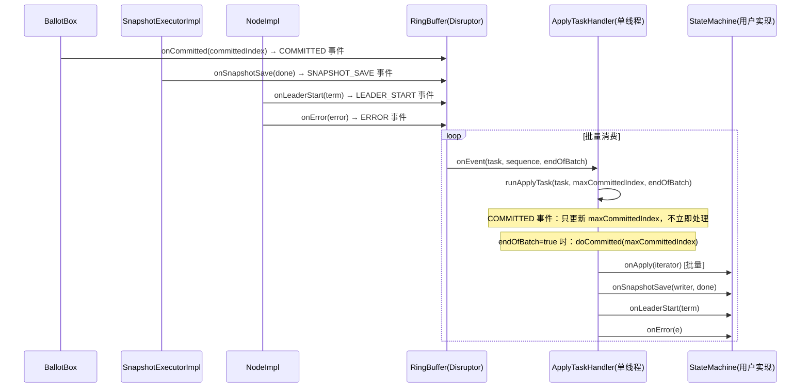
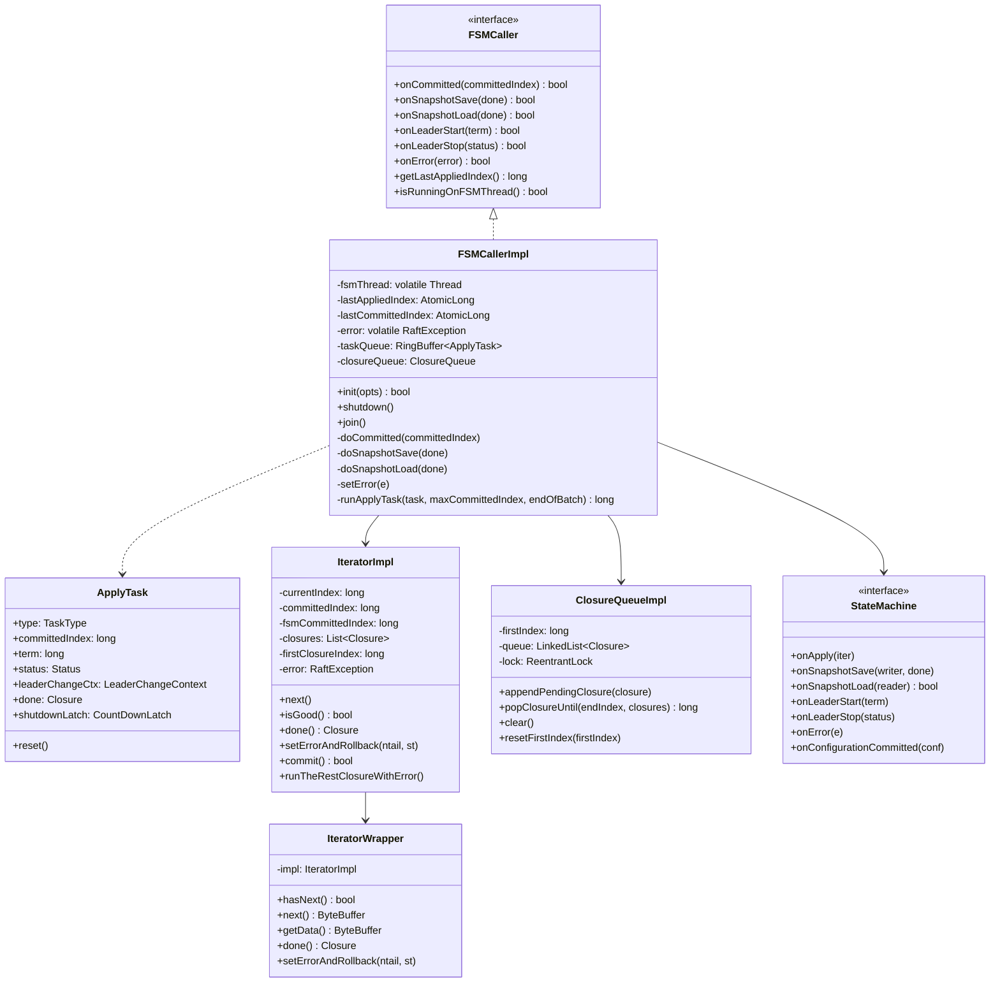

# 07 - 状态机（StateMachine）与 FSMCaller：深度精读

## ☕ 想先用人话了解状态机？请看通俗解读

> **👉 [点击阅读：用人话聊聊状态机（通俗解读完整版）](./通俗解读.md)**
>
> 通俗解读版用"饭店后厨"的比喻，带你理解 FSMCaller 为什么是传菜窗口、Disruptor 批量合并怎么把 5 次通知变成 1 次执行、Iterator 的使用陷阱、以及 onApply 抛异常后的隐藏行为。**建议先读通俗解读版。**

---

## 学习目标

深入理解 JRaft 的状态机驱动机制，包括 `FSMCallerImpl` 的 Disruptor 异步架构、批量提交的合并策略、`IteratorImpl` 的日志迭代设计、`ClosureQueueImpl` 的回调队列，以及错误处理的完整路径。

---

## 一、问题驱动：FSMCaller 要解决什么问题？

### 【问题】

Raft 协议中，日志被多数派确认后需要"应用到状态机"。但这个过程有几个挑战：

1. **顺序性**：日志必须严格按 index 顺序应用，不能乱序
2. **单线程性**：状态机的 `onApply` 不能并发调用（用户实现通常不是线程安全的）
3. **批量性**：高并发下每条日志单独触发 `onApply` 效率太低，需要批量合并
4. **异步性**：`BallotBox.commitAt()` 在 Replicator 线程调用，不能直接调用状态机（会阻塞 Replicator）
5. **多事件类型**：除了日志提交，还有快照保存/加载、Leader 变更、错误通知等事件，都需要在同一个单线程中串行处理（保证与 `onApply` 的顺序一致性）

### 【需要什么信息】

- 事件队列：异步解耦 Replicator 线程和状态机线程
- 事件类型：区分 COMMITTED、SNAPSHOT_SAVE、LEADER_START 等
- 批量合并：多个 COMMITTED 事件合并为一次 `doCommitted(maxCommittedIndex)`
- 迭代器：让用户在 `onApply` 中逐条处理日志，同时支持批量
- 回调队列：按序管理 Closure，保证回调顺序与日志顺序一致
- 错误状态：一旦出错，停止应用新日志，通知用户

### 【推导出的结构】

由此推导出：
- `FSMCallerImpl`：状态机调用器，持有 Disruptor，单线程消费事件
- `ApplyTask`：Disruptor 事件对象，union 字段设计（不同 type 使用不同字段）
- `IteratorImpl`：日志迭代器，持有 `[lastAppliedIndex+1, committedIndex]` 范围的日志
- `IteratorWrapper`：对 `IteratorImpl` 的包装，实现 `Iterator` 接口（用户 API）
- `ClosureQueueImpl`：Closure 队列，`firstIndex` + `LinkedList<Closure>` 实现按序弹出

---

## 二、核心数据结构

### 2.1 FSMCallerImpl 核心字段（源码验证）

```java
// FSMCallerImpl.java 第 162-180 行
private volatile Thread                                         fsmThread;         // FSM 线程（用于 isRunningOnFSMThread 检查）
private LogManager                                              logManager;
private StateMachine                                            fsm;               // 用户实现的状态机
private ClosureQueue                                            closureQueue;      // Closure 回调队列
private final AtomicLong                                        lastAppliedIndex;  // 最后应用的日志 index
private final AtomicLong                                        lastCommittedIndex;// 最后提交的日志 index
private long                                                    lastAppliedTerm;   // 最后应用的日志 term
private Closure                                                 afterShutdown;     // shutdown 完成后的回调
private NodeImpl                                                node;
private volatile TaskType                                       currTask;          // 当前正在执行的任务类型（用于 describe()）
private final AtomicLong                                        applyingIndex;     // 当前正在应用的日志 index（用于 metrics）
private volatile RaftException                                  error;             // 当前错误（非 ERROR_TYPE_NONE 时停止应用）
private Disruptor<ApplyTask>                                    disruptor;
private RingBuffer<ApplyTask>                                   taskQueue;
private volatile CountDownLatch                                 shutdownLatch;     // shutdown 时的同步 latch
private NodeMetrics                                             nodeMetrics;
private final CopyOnWriteArrayList<LastAppliedLogIndexListener> lastAppliedLogIndexListeners; // 监听 lastAppliedIndex 变化
```

**字段存在的理由：**
- `fsmThread` 是 `volatile`：`isRunningOnFSMThread()` 不加锁直接读，需要可见性
- `lastAppliedIndex` 是 `AtomicLong`：`getLastAppliedIndex()` 被多线程读（如 `SnapshotExecutorImpl.doSnapshot()`），需要原子性
- `error` 是 `volatile`：`doCommitted()` 开头检查 `error.getStatus().isOk()`，不加锁，需要可见性
- `lastAppliedLogIndexListeners` 是 `CopyOnWriteArrayList`：支持并发添加监听器，遍历时无需加锁

### 2.2 ApplyTask 字段设计（源码验证）

```java
// FSMCallerImpl.java 第 114-131 行
private static class ApplyTask {
    TaskType            type;
    // union fields（不同 type 使用不同字段，其余字段为默认值）
    long                committedIndex;    // COMMITTED 使用
    long                term;             // LEADER_START 使用
    Status              status;           // LEADER_STOP 使用
    LeaderChangeContext leaderChangeCtx;  // START_FOLLOWING/STOP_FOLLOWING 使用
    Closure             done;             // SNAPSHOT_SAVE/SNAPSHOT_LOAD/ERROR 使用
    CountDownLatch      shutdownLatch;    // SHUTDOWN/FLUSH 使用

    public void reset() { /* 所有字段置为默认值，对象复用 */ }
}
```

**union 字段设计**：Disruptor 使用对象池（`EventFactory`），`ApplyTask` 对象被复用。`reset()` 在每次使用后清空所有字段，防止上一次的数据污染下一次。

### 2.3 IteratorImpl 核心字段（源码验证）

```java
// IteratorImpl.java 第 43-57 行
private final FSMCallerImpl fsmCaller;
private final LogManager    logManager;
private final List<Closure> closures;          // 本批次的 Closure 列表
private final long          firstClosureIndex; // closures[0] 对应的 logIndex
private long                currentIndex;      // 当前迭代位置（从 lastAppliedIndex+1 开始）
private final long          committedIndex;    // 本批次的最大 index（迭代终止条件）
private long                fsmCommittedIndex; // 已通过 commit() 提交的最大 index（回滚下界）
private LogEntry            currEntry        = new LogEntry(); // 当前日志条目（初始化为空白 entry，非 null！）
private final AtomicLong    applyingIndex;     // 共享的 applyingIndex（用于 metrics）
private RaftException       error;             // 迭代过程中的错误
private boolean             autoCommitPerLog;  // 是否每条日志自动 commit（默认 false）
```

**`fsmCommittedIndex` 的作用**：`setErrorAndRollback()` 回滚时，不能回滚到 `fsmCommittedIndex` 之前（已通过 `commit()` 提交的日志不可撤销）。

### 2.4 ClosureQueueImpl 核心字段（源码验证）

```java
// ClosureQueueImpl.java 第 44-48 行
private String              groupId;           // 用于 ThreadPoolsFactory.runInThread（clear() 中异步执行 done.run()）
private final Lock          lock;
private long                firstIndex;        // 队列中第一个 Closure 对应的 logIndex
private LinkedList<Closure> queue;             // Closure 队列（按 logIndex 顺序）
```

**`firstIndex` 的作用**：`popClosureUntil(endIndex)` 时，通过 `endIndex - firstIndex` 计算需要弹出多少个 Closure，保证 Closure 与 logIndex 的对应关系。

**`resetFirstIndex()` 的前置检查**（`ClosureQueueImpl.java:95-102`）：
```java
public void resetFirstIndex(final long firstIndex) {
    this.lock.lock();
    try {
        Requires.requireTrue(this.queue.isEmpty(), "Queue is not empty.");  // ← 必须在队列为空时才能重置
        this.firstIndex = firstIndex;
    } finally {
        this.lock.unlock();
    }
}
```
调用时机：`NodeImpl.becomeLeader()` 时，重置 `firstIndex` 为当前 `lastLogIndex + 1`，确保新 Leader 的 Closure 从正确的 index 开始对应。

---

## 三、Disruptor 架构与批量合并

### 3.1 整体架构图



### 3.2 批量合并策略（关键设计）

```java
// FSMCallerImpl.java 第 399-460 行
@SuppressWarnings("ConstantConditions")
private long runApplyTask(final ApplyTask task, long maxCommittedIndex, final boolean endOfBatch) {
    CountDownLatch shutdown = null;
    if (task.type == TaskType.COMMITTED) {
        // ① COMMITTED 事件：只更新 maxCommittedIndex，不立即处理
        if (task.committedIndex > maxCommittedIndex) {
            maxCommittedIndex = task.committedIndex;
        }
        task.reset();
    } else {
        // ② 非 COMMITTED 事件：先处理积压的 COMMITTED 事件，再处理当前事件
        if (maxCommittedIndex >= 0) {
            this.currTask = TaskType.COMMITTED;
            doCommitted(maxCommittedIndex);
            maxCommittedIndex = -1L;
        }
        final long startMs = Utils.monotonicMs();
        try {
            // ③ 处理当前非 COMMITTED 事件（完整 switch-case）
            switch (task.type) {
                case COMMITTED:
                    Requires.requireTrue(false, "Impossible");  // ← 不可能到达（已在 if 分支处理）
                    break;
                case SNAPSHOT_SAVE:
                    onSnapshotSaveSync(task);  // ← 内部调用 passByStatus
                    break;
                case SNAPSHOT_LOAD:
                    this.currTask = TaskType.SNAPSHOT_LOAD;
                    if (passByStatus(task.done)) {
                        doSnapshotLoad((LoadSnapshotClosure) task.done);
                    }
                    break;
                case LEADER_STOP:
                    this.currTask = TaskType.LEADER_STOP;
                    doLeaderStop(task.status);  // ← fsm.onLeaderStop(status)
                    break;
                case LEADER_START:
                    this.currTask = TaskType.LEADER_START;
                    doLeaderStart(task.term);   // ← fsm.onLeaderStart(term)
                    break;
                case START_FOLLOWING:
                    this.currTask = TaskType.START_FOLLOWING;
                    doStartFollowing(task.leaderChangeCtx);  // ← fsm.onStartFollowing(ctx)
                    break;
                case STOP_FOLLOWING:
                    this.currTask = TaskType.STOP_FOLLOWING;
                    doStopFollowing(task.leaderChangeCtx);   // ← fsm.onStopFollowing(ctx)
                    break;
                case ERROR:
                    this.currTask = TaskType.ERROR;
                    doOnError((OnErrorClosure) task.done);   // ← setError(done.getError())
                    break;
                case IDLE:
                    Requires.requireTrue(false, "Can't reach here");  // ← 不可能到达
                    break;
                case SHUTDOWN:
                    this.currTask = TaskType.SHUTDOWN;
                    shutdown = task.shutdownLatch;  // ← 保存 latch，finally 中 countDown
                    doShutdown();                   // ← fsm.onShutdown()，node = null
                    break;
                case FLUSH:
                    this.currTask = TaskType.FLUSH;
                    shutdown = task.shutdownLatch;  // ← 只保存 latch，不调用 doXxx
                    // ⚠️ FLUSH 与 SHUTDOWN 的差异：FLUSH 不调用 doShutdown()，只是同步点
                    break;
            }
        } finally {
            // ④ 无论成功失败，都记录 metrics 并 reset task（对象复用）
            this.nodeMetrics.recordLatency(task.type.metricName(), Utils.monotonicMs() - startMs);
            task.reset();
        }
    }
    try {
        // ⑤ 批次结束时：处理最后一批积压的 COMMITTED 事件
        if (endOfBatch && maxCommittedIndex >= 0) {
            this.currTask = TaskType.COMMITTED;
            doCommitted(maxCommittedIndex);
            maxCommittedIndex = -1L;
        }
        this.currTask = TaskType.IDLE;
        return maxCommittedIndex;
    } finally {
        // ⑥ SHUTDOWN/FLUSH 事件：释放 latch，通知 join() 可以继续
        if (shutdown != null) {
            shutdown.countDown();
        }
    }
}
```

**批量合并的效果**：假设 RingBuffer 中有 `[COMMITTED(5), COMMITTED(8), COMMITTED(10), SNAPSHOT_SAVE]` 四个事件：
1. 处理 COMMITTED(5)：`maxCommittedIndex = 5`
2. 处理 COMMITTED(8)：`maxCommittedIndex = 8`
3. 处理 COMMITTED(10)：`maxCommittedIndex = 10`
4. 处理 SNAPSHOT_SAVE（非 COMMITTED）：先 `doCommitted(10)`（一次性应用 index 1-10），再处理 SNAPSHOT_SAVE

**为什么 SNAPSHOT_SAVE 不检查 `passByStatus`，而 SNAPSHOT_LOAD 检查？**

对照源码（`FSMCallerImpl.java:415-430`）：
```java
case SNAPSHOT_SAVE:
    onSnapshotSaveSync(task);  // ← 直接调用，不检查 passByStatus
    break;
case SNAPSHOT_LOAD:
    this.currTask = TaskType.SNAPSHOT_LOAD;
    if (passByStatus(task.done)) {  // ← 检查 passByStatus
        doSnapshotLoad((LoadSnapshotClosure) task.done);
    }
    break;
```

原因：`SNAPSHOT_SAVE` 是在私有方法 `onSnapshotSaveSync(ApplyTask)` 内部（`FSMCallerImpl.java:498-510`）调用 `passByStatus`，而 `SNAPSHOT_LOAD` 是在 `runApplyTask` 的 switch-case 中直接检查。两者都有 `passByStatus` 保护，只是检查位置不同。

### 3.3 enqueueTask() 与 shutdown() 的协调

```java
// FSMCallerImpl.java 第 244-251 行
private boolean enqueueTask(final EventTranslator<ApplyTask> tpl) {
    if (this.shutdownLatch != null) {
        // 正在 shutdown：拒绝新任务，返回 false
        LOG.warn("FSMCaller is stopped, can not apply new task.");
        return false;
    }
    this.taskQueue.publishEvent(tpl);
    return true;
}
```

```java
// FSMCallerImpl.java 第 221-240 行
public synchronized void shutdown() {
    if (this.shutdownLatch != null) {
        return;  // ← 幂等：已经在 shutdown 中，直接 return
    }
    LOG.info("Shutting down FSMCaller...");
    if (this.taskQueue != null) {  // ← 只有 taskQueue 非 null（init 成功）才发布事件
        // 异步发布 SHUTDOWN 事件（不在 synchronized 块内等待，防止死锁）
        final CountDownLatch latch = new CountDownLatch(1);
        this.shutdownLatch = latch;
        ThreadPoolsFactory.runInThread(getNode().getGroupId(),
            () -> this.taskQueue.publishEvent((task, sequence) -> {
                task.reset();
                task.type = TaskType.SHUTDOWN;
                task.shutdownLatch = latch;
            }));
    }
    // ⚠️ 若 taskQueue == null（init 失败），shutdownLatch 不会被设置，join() 不会等待
}
```

```java
// FSMCallerImpl.java 第 386-398 行
public synchronized void join() throws InterruptedException {
    if (this.shutdownLatch != null) {
        this.shutdownLatch.await();  // ← 等待 SHUTDOWN 事件被消费
        this.disruptor.shutdown();   // ← 关闭 Disruptor
        if (this.afterShutdown != null) {
            this.afterShutdown.run(Status.OK());  // ← 执行 shutdown 完成回调
            this.afterShutdown = null;
        }
        this.shutdownLatch = null;
    }
}
```

**关键设计**：`shutdown()` 是 `synchronized` 方法，保证幂等（多次调用只发布一次 SHUTDOWN 事件）。`shutdown()` 不等待 SHUTDOWN 事件被消费（异步发布），`join()` 才等待。这样设计避免了 `shutdown()` 在持有锁时等待 FSM 线程，防止死锁。

### 3.4 onError() 公开方法的前置检查

```java
// FSMCallerImpl.java 第 359-371 行
public boolean onError(final RaftException error) {
    // ① 已有错误：直接 return false，不入队（在入队前就拦截，避免无效事件）
    if (!this.error.getStatus().isOk()) {
        LOG.warn("FSMCaller already in error status, ignore new error.", error);
        return false;
    }
    // ② 正常：包装为 OnErrorClosure，入队 ERROR 事件
    final OnErrorClosure c = new OnErrorClosure(error);
    return enqueueTask((task, sequence) -> {
        task.type = TaskType.ERROR;
        task.done = c;
    });
}
```

**两层防重复**：
- 第一层（`onError` 公开方法）：在入队前检查，避免无效事件进入 RingBuffer
- 第二层（`setError` 私有方法）：在执行时检查，防止并发调用（如 `doCommitted` 和 `doSnapshotLoad` 同时触发错误）

---

## 四、doCommitted() 完整分析

### 4.1 完整流程

```java
// FSMCallerImpl.java 第 520-580 行
private void doCommitted(final long committedIndex) {
    // ① 已有错误：停止应用（节点处于 STATE_ERROR）
    if (!this.error.getStatus().isOk()) { return; }

    final long lastAppliedIndex = this.lastAppliedIndex.get();
    // ② 幂等保护：已应用过，跳过
    if (lastAppliedIndex >= committedIndex) { return; }

    this.lastCommittedIndex.set(committedIndex);
    final long startMs = Utils.monotonicMs();
    try {
        // ③ 从 ClosureQueue 弹出 [firstClosureIndex, committedIndex] 的 Closure
        final List<Closure> closures = new ArrayList<>();
        final List<TaskClosure> taskClosures = new ArrayList<>();
        final long firstClosureIndex = this.closureQueue.popClosureUntil(committedIndex, closures, taskClosures);

        // ④ 通知 TaskClosure.onCommitted()（日志已提交但未应用）
        onTaskCommitted(taskClosures);

        // ⑤ Requires.requireTrue(firstClosureIndex >= 0)：popClosureUntil 返回 -1 时抛异常
        Requires.requireTrue(firstClosureIndex >= 0, "Invalid firstClosureIndex");

        // ⑥ 创建 IteratorImpl，从 lastAppliedIndex+1 迭代到 committedIndex
        final IteratorImpl iterImpl = new IteratorImpl(this, this.logManager, closures, firstClosureIndex,
            lastAppliedIndex, committedIndex, this.applyingIndex);

        // ⑦ 逐条处理日志
        while (iterImpl.isGood()) {
            final LogEntry logEntry = iterImpl.entry();
            if (logEntry.getType() != EnumOutter.EntryType.ENTRY_TYPE_DATA) {
                // ⑦a 非 DATA 日志（CONFIGURATION）：通知配置变更
                if (logEntry.getType() == EnumOutter.EntryType.ENTRY_TYPE_CONFIGURATION) {
                    if (logEntry.getOldPeers() != null && !logEntry.getOldPeers().isEmpty()) {
                        // 只有 Joint 阶段结束时（oldPeers 非空）才通知用户
                        this.fsm.onConfigurationCommitted(new Configuration(iterImpl.entry().getPeers()));
                    }
                }
                // ⑦b 非 DATA 日志的 done 回调（如果有）
                if (iterImpl.done() != null) {
                    iterImpl.done().run(Status.OK());
                }
                iterImpl.next();
                continue;
            }
            // ⑦c DATA 日志：调用用户状态机
            doApplyTasks(iterImpl);
        }

        // ⑧ 迭代过程中出错：setError + 通知剩余 Closure 失败
        if (iterImpl.hasError()) {
            setError(iterImpl.getError());
            iterImpl.runTheRestClosureWithError();
        }

        // ⑨ 更新 lastAppliedIndex（注意：iterImpl.getIndex()-1，因为 next() 后 currentIndex 已超出）
        long lastIndex = iterImpl.getIndex() - 1;
        final long lastTerm = this.logManager.getTerm(lastIndex);
        // setLastApplied 内部还做了两件事：
        // - logManager.setAppliedId(lastAppliedId)：通知 LogManager 更新 appliedId（用于 truncatePrefix 的安全边界）
        // - notifyLastAppliedIndexUpdated(lastIndex)：通知所有 LastAppliedLogIndexListener（如 ReadIndexService）
        setLastApplied(lastIndex, lastTerm);
    } finally {
        // ⑩ 无论成功失败，都记录 metrics
        this.nodeMetrics.recordLatency("fsm-commit", Utils.monotonicMs() - startMs);
    }
}
```

### 4.2 为什么 CONFIGURATION 日志只在 `oldPeers 非空` 时通知用户？

Joint Consensus 配置变更分两个阶段：
1. **Joint 阶段**：写入 `{newPeers, oldPeers}` 的 CONFIGURATION 日志（`oldPeers` 非空）
2. **Final 阶段**：写入 `{newPeers}` 的 CONFIGURATION 日志（`oldPeers` 为空）

只有 Joint 阶段结束（`oldPeers` 非空）时才通知用户 `onConfigurationCommitted`，避免用户收到两次通知。

### 4.3 doApplyTasks() 分析

```java
// FSMCallerImpl.java 第 593-609 行
private void doApplyTasks(final IteratorImpl iterImpl) {
    final IteratorWrapper iter = new IteratorWrapper(iterImpl);
    final long startApplyMs = Utils.monotonicMs();
    final long startIndex = iter.getIndex();
    try {
        this.fsm.onApply(iter);  // ← 调用用户状态机
    } finally {
        // 记录 metrics（无论成功失败都记录）
        this.nodeMetrics.recordLatency("fsm-apply-tasks", Utils.monotonicMs() - startApplyMs);
        this.nodeMetrics.recordSize("fsm-apply-tasks-count", iter.getIndex() - startIndex);
    }
    // 检查用户是否提前 return（没有消费完所有日志）
    if (iter.hasNext()) {
        LOG.error("Iterator is still valid, did you return before iterator reached the end?");
    }
    // 强制移动到下一条（防止同一条日志被应用两次）
    iter.next();
}
// ⚠️ 注意：doApplyTasks 中没有 try-catch！
// 如果 fsm.onApply(iter) 抛出未捕获的 RuntimeException，会被 Disruptor 的
// LogExceptionHandler 捕获并打印，但不会触发 setError！
// 节点继续运行，但该批次日志的 Closure 不会被调用（客户端超时）。
// 建议：在 onApply 中捕获所有异常，失败时调用 iter.setErrorAndRollback()。
```

**`iter.next()` 在 `doApplyTasks` 末尾的作用**：用户在 `onApply` 中可能提前 return（没有消费完所有日志），`iter.next()` 确保迭代器至少移动一步，防止 `doCommitted` 的 while 循环在同一条 DATA 日志上无限调用 `doApplyTasks`。

---

## 五、doSnapshotSave() 完整分析

```java
// FSMCallerImpl.java 第 610-660 行
private void doSnapshotSave(final SaveSnapshotClosure done) {
    Requires.requireNonNull(done, "SaveSnapshotClosure is null");
    final long lastAppliedIndex = this.lastAppliedIndex.get();

    // ① 构建快照元数据（lastIncludedIndex = lastAppliedIndex）
    final RaftOutter.SnapshotMeta.Builder metaBuilder = RaftOutter.SnapshotMeta.newBuilder()
        .setLastIncludedIndex(lastAppliedIndex)
        .setLastIncludedTerm(this.lastAppliedTerm);

    // ② 获取 lastAppliedIndex 时刻的集群配置
    final ConfigurationEntry confEntry = this.logManager.getConfiguration(lastAppliedIndex);
    if (confEntry == null || confEntry.isEmpty()) {
    // ③ 配置为空：先打印 LOG.error，再 EINVAL 回调（通常不应发生，除非节点刚启动还没有配置日志）
        LOG.error("Empty conf entry for lastAppliedIndex={}", lastAppliedIndex);
        ThreadPoolsFactory.runClosureInThread(getNode().getGroupId(), done,
            new Status(RaftError.EINVAL, "Empty conf entry for lastAppliedIndex=%s", lastAppliedIndex));
        return;
    }

    // ④ 填充 peers/learners（当前配置）
    for (final PeerId peer : confEntry.getConf()) { metaBuilder.addPeers(peer.toString()); }
    for (final PeerId peer : confEntry.getConf().getLearners()) { metaBuilder.addLearners(peer.toString()); }

    // ⑤ 填充 oldPeers/oldLearners（Joint 阶段才有）
    if (confEntry.getOldConf() != null) {
        for (final PeerId peer : confEntry.getOldConf()) { metaBuilder.addOldPeers(peer.toString()); }
        for (final PeerId peer : confEntry.getOldConf().getLearners()) { metaBuilder.addOldLearners(peer.toString()); }
    }

    // ⑥ 创建 SnapshotWriter（写入 temp 目录）
    final SnapshotWriter writer = done.start(metaBuilder.build());
    if (writer == null) {
        // ⑦ writer 创建失败：EINVAL
        done.run(new Status(RaftError.EINVAL, "snapshot_storage create SnapshotWriter failed"));
        return;
    }

    // ⑧ 调用用户状态机保存快照（用户负责调用 done.run()）
    this.fsm.onSnapshotSave(writer, done);
}
```

**关键设计**：`doSnapshotSave` 负责构建元数据（`lastIncludedIndex/Term/peers`），用户只需要保存状态机数据。元数据由框架保证正确性，用户无需关心。

---

## 六、doSnapshotLoad() 完整分析

```java
// FSMCallerImpl.java 第 685-750 行
private void doSnapshotLoad(final LoadSnapshotClosure done) {
    Requires.requireNonNull(done, "LoadSnapshotClosure is null");

    // ① 打开 SnapshotReader
    final SnapshotReader reader = done.start();
    if (reader == null) {
        done.run(new Status(RaftError.EINVAL, "open SnapshotReader failed"));
        return;
    }

    // ② 加载快照元数据
    final RaftOutter.SnapshotMeta meta = reader.load();
    if (meta == null) {
        done.run(new Status(RaftError.EINVAL, "SnapshotReader load meta failed"));
        // ③ 如果是 EIO（磁盘错误），触发 setError（节点进入 STATE_ERROR）
        if (reader.getRaftError() == RaftError.EIO) {
            final RaftException err = new RaftException(EnumOutter.ErrorType.ERROR_TYPE_SNAPSHOT, RaftError.EIO,
                "Fail to load snapshot meta");
            setError(err);
        }
        return;
    }

    // ④ 过时快照检查：lastAppliedId > snapshotId → ESTALE（本地状态比快照更新）
    final LogId lastAppliedId = new LogId(this.lastAppliedIndex.get(), this.lastAppliedTerm);
    final LogId snapshotId = new LogId(meta.getLastIncludedIndex(), meta.getLastIncludedTerm());
    if (lastAppliedId.compareTo(snapshotId) > 0) {
        done.run(new Status(RaftError.ESTALE, "Loading a stale snapshot ..."));
        return;
    }

    // ⑤ 调用用户状态机加载快照
    if (!this.fsm.onSnapshotLoad(reader)) {
        done.run(new Status(-1, "StateMachine onSnapshotLoad failed"));
        // ⑥ 加载失败：触发 setError（节点进入 STATE_ERROR）
        final RaftException e = new RaftException(EnumOutter.ErrorType.ERROR_TYPE_STATE_MACHINE,
            RaftError.ESTATEMACHINE, "StateMachine onSnapshotLoad failed");
        setError(e);
        return;
    }

    // ⑦ 加载成功：通知配置变更（只在非 Joint 阶段，即 oldPeers 为空时）
    // 注意：与 doCommitted 中的逻辑相反！
    // doCommitted：oldPeers 非空 → 通知（Joint 阶段的配置日志）
    // doSnapshotLoad：oldPeers 为空 → 通知（快照时刻是稳定配置，非 Joint 阶段）
    // 原因：快照只在稳定状态下生成，不会在 Joint 阶段生成快照；
    //       如果快照的 oldPeers 非空，说明快照包含了 Joint 配置，此时不通知用户（避免重复）
    if (meta.getOldPeersCount() == 0) {
        final Configuration conf = new Configuration();
        for (int i = 0; i < meta.getPeersCount(); i++) {
            final PeerId peer = new PeerId();
            Requires.requireTrue(peer.parse(meta.getPeers(i)), "Parse peer failed");
            conf.addPeer(peer);
        }
        this.fsm.onConfigurationCommitted(conf);
    }

    // ⑧ 更新 lastCommittedIndex/lastAppliedIndex/lastAppliedTerm
    this.lastCommittedIndex.set(meta.getLastIncludedIndex());
    this.lastAppliedIndex.set(meta.getLastIncludedIndex());
    this.lastAppliedTerm = meta.getLastIncludedTerm();
    done.run(Status.OK());
}
```

**`meta == null` 时的差异处理**：
- 普通读取失败（如文件不存在）：只调用 `done.run(EINVAL)`，不触发 `setError`
- EIO（磁盘错误）：额外触发 `setError(ERROR_TYPE_SNAPSHOT)`，节点进入 `STATE_ERROR`

---

## 七、IteratorImpl 深度分析

### 7.1 构造函数与初始化

```java
// IteratorImpl.java 第 60-75 行
public IteratorImpl(..., final long lastAppliedIndex, final long committedIndex, ...) {
    this.currentIndex = lastAppliedIndex;  // ← 从 lastAppliedIndex 开始（不是 +1）
    this.committedIndex = committedIndex;
    this.fsmCommittedIndex = -1L;          // ← 初始为 -1，表示还没有通过 commit() 提交
    next();  // ← 构造函数末尾调用 next()，将 currentIndex 移动到 lastAppliedIndex+1
}
```

**为什么构造函数末尾调用 `next()`？**：`currentIndex` 初始化为 `lastAppliedIndex`（已应用的最后一条），调用 `next()` 后移动到 `lastAppliedIndex+1`（第一条待应用的日志），同时加载 `currEntry`。

### 7.2 commit() 与 commitAndSnapshotSync() 分析

```java
// IteratorImpl.java 第 151-170 行
public boolean commit() {
    // ① 条件：isGood() && currEntry != null && type == DATA
    if (isGood() && this.currEntry != null && this.currEntry.getType() == EnumOutter.EntryType.ENTRY_TYPE_DATA) {
        fsmCommittedIndex = this.currentIndex;  // ← 更新回滚下界
        // ← 立即更新 lastAppliedIndex（不等到批次结束！）
        // 同时通知 LogManager.setAppliedId + LastAppliedLogIndexListener
        this.fsmCaller.setLastApplied(currentIndex, this.currEntry.getId().getTerm());
        return true;
    }
    // ② 其他情况（非 DATA、hasError、currentIndex > committedIndex）：return false
    return false;
}

public void commitAndSnapshotSync(Closure done) {
    // ① commit() 成功：触发同步快照
    if (commit()) {
        this.fsmCaller.getNode().snapshotSync(done);
    } else {
        // ② commit() 失败：ECANCELED
        Utils.runClosure(done, new Status(RaftError.ECANCELED, "Fail to commit, logIndex=" + currentIndex
            + ", committedIndex=" + committedIndex));
    }
}
```

**`commit()` 的关键作用**：
- 更新 `fsmCommittedIndex`（`setErrorAndRollback` 的回滚下界，已 commit 的日志不可撤销）
- **立即**调用 `setLastApplied`（不等到批次结束），使 `lastAppliedIndex` 实时更新
- 这是用户在 `onApply` 中主动控制 `lastAppliedIndex` 推进的唯一方式

**`commitAndSnapshotSync()` 的使用场景**：用户在 `onApply` 中处理完某条日志后，希望立即触发快照（如状态机数据量达到阈值），调用此方法可以原子地完成

```java
// IteratorImpl.java 第 105-130 行
public void next() {
    this.currEntry = null;  // 释放当前 entry 引用
    if (this.currentIndex <= this.committedIndex) {
        ++this.currentIndex;
        if (this.currentIndex <= this.committedIndex) {
            try {
                // ① 正常：从 LogManager 获取日志
                this.currEntry = this.logManager.getEntry(this.currentIndex);
                if (this.currEntry == null) {
                    // ② getEntry 返回 null：ERROR_TYPE_LOG（日志被截断或不存在）
                    getOrCreateError().setType(EnumOutter.ErrorType.ERROR_TYPE_LOG);
                    getOrCreateError().getStatus().setError(-1,
                        "Fail to get entry at index=%d while committed_index=%d", ...);
                }
            } catch (final LogEntryCorruptedException e) {
                // ③ catch(LogEntryCorruptedException)：日志损坏，ERROR_TYPE_LOG + EINVAL
                getOrCreateError().setType(EnumOutter.ErrorType.ERROR_TYPE_LOG);
                getOrCreateError().getStatus().setError(RaftError.EINVAL, e.getMessage());
            }
            this.applyingIndex.set(this.currentIndex);
        }
        // ④ currentIndex > committedIndex：已到末尾，currEntry 保持 null
    }
    // ⑤ currentIndex > committedIndex（初始就超出）：不做任何事
}
```

### 7.4 setErrorAndRollback() 分支穷举

```java
// IteratorImpl.java 第 170-195 行
public void setErrorAndRollback(final long ntail, final Status st) {
    Requires.requireTrue(ntail > 0, "Invalid ntail=" + ntail);

    // ① 当前 entry 为 null 或非 DATA 类型：回滚 ntail 步
    if (this.currEntry == null || this.currEntry.getType() != EnumOutter.EntryType.ENTRY_TYPE_DATA) {
        this.currentIndex -= ntail;
    } else {
        // ② 当前 entry 是 DATA 类型：回滚 ntail-1 步（当前条目算一个，不额外减）
        this.currentIndex -= ntail - 1;
    }

    // ③ 不能回滚到 fsmCommittedIndex 之前（已通过 commit() 提交的日志不可撤销）
    if (fsmCommittedIndex >= 0) {
        this.currentIndex = Math.max(this.currentIndex, fsmCommittedIndex + 1);
    }

    this.currEntry = null;
    // ④ 设置错误类型为 ERROR_TYPE_STATE_MACHINE
    getOrCreateError().setType(EnumOutter.ErrorType.ERROR_TYPE_STATE_MACHINE);
    getOrCreateError().getStatus().setError(RaftError.ESTATEMACHINE,
        "StateMachine meet critical error when applying one or more tasks since index=%d, %s",
        this.currentIndex, st != null ? st.toString() : "none");
}
```

**`ntail` 的含义**：用户在 `onApply` 中调用 `iter.setErrorAndRollback(ntail, st)` 时，`ntail` 表示"从当前位置往回回滚几步"。例如 `ntail=1` 表示当前这条日志应用失败，`ntail=3` 表示最近 3 条日志都需要回滚。

### 7.5 done() 的 Closure 对应关系

```java
// IteratorImpl.java 第 132-137 行
public Closure done() {
    if (this.currentIndex < this.firstClosureIndex) {
        return null;  // ← currentIndex 在 firstClosureIndex 之前：没有对应的 Closure
    }
    return this.closures.get((int) (this.currentIndex - this.firstClosureIndex));
}
```

**为什么 `currentIndex < firstClosureIndex` 时返回 null？**

`firstClosureIndex` 是 `popClosureUntil` 返回的第一个有 Closure 的 logIndex。在 `firstClosureIndex` 之前的日志（如 Leader 重启后重放的旧日志）没有对应的 Closure，因为这些日志是在上一个 Leader 任期内提交的，当前 Leader 没有保存它们的 Closure。

---

## 八、ClosureQueueImpl 与 IteratorWrapper 深度分析

### 8.0 IteratorWrapper.next() 完整分析

```java
// IteratorWrapper.java 第 43-52 行
@Override
public ByteBuffer next() {
    // ① autoCommitPerLog 模式：在访问下一条日志前，先 commit 当前日志
    // （autoCommitPerLog 默认 false；注意源码注释写 "Default enabled" 与代码矛盾，以代码为准）
    if (impl.getAutoCommitPerLog() && !impl.hasError()) {
        commit();
    }
    // ② 先获取当前 entry 的 data（在移动前！）
    final ByteBuffer data = getData();
    // ③ 如果还有下一条，移动 impl 到下一条
    if (hasNext()) {
        this.impl.next();
    }
    // ④ 返回移动前的 data（"先取后移"）
    return data;
}
```

**「先取后移」设计**：`next()` 返回的是**当前**条目的 data，然后才移动到下一条。这与 Java `Iterator` 的语义一致：调用 `next()` 返回当前元素并移动游标。

**`autoCommitPerLog` 的作用**：当用户开启此模式时，每次调用 `next()` 都会自动 `commit()` 当前日志（更新 `fsmCommittedIndex` 和 `lastAppliedIndex`），无需用户手动调用 `commit()`。

**`autoCommitPerLog` 注释与代码矛盾**：`IteratorImpl.java:57` 注释写 `// Default enabled`，但字段初始化是 `private boolean autoCommitPerLog = false`。以代码为准：默认 **false**（不自动 commit）。

### 8.1 popClosureUntil() 分支穷举

```java
// ClosureQueueImpl.java 第 121-151 行
public long popClosureUntil(final long endIndex, final List<Closure> closures, final List<TaskClosure> taskClosures) {
    closures.clear();
    if (taskClosures != null) { taskClosures.clear(); }
    this.lock.lock();
    try {
        final int queueSize = this.queue.size();
        // ① 队列为空 或 endIndex < firstIndex：没有 Closure 需要弹出
        // 返回 endIndex+1（表示 firstClosureIndex = endIndex+1，即没有 Closure）
        if (queueSize == 0 || endIndex < this.firstIndex) {
            return endIndex + 1;
        }
        // ② endIndex 超出队列范围：LOG.error + 返回 -1（调用方 Requires.requireTrue 会抛异常）
        if (endIndex > this.firstIndex + queueSize - 1) {
            LOG.error("Invalid endIndex={}, firstIndex={}, closureQueueSize={}", endIndex, this.firstIndex, queueSize);
            return -1;
        }
        // ③ 正常：弹出 [firstIndex, endIndex] 的 Closure
        final long outFirstIndex = this.firstIndex;
        for (long i = outFirstIndex; i <= endIndex; i++) {
            final Closure closure = this.queue.pollFirst();
            if (taskClosures != null && closure instanceof TaskClosure) {
                taskClosures.add((TaskClosure) closure);
            }
            closures.add(closure);
        }
        this.firstIndex = endIndex + 1;
        return outFirstIndex;
    } finally {
        this.lock.unlock();
    }
}
```

**`closures` 中可能包含 null**：`appendPendingClosure(null)` 是合法的（Follower 节点没有 Closure，但 Leader 需要占位保持 index 对应关系）。`done()` 方法返回 null 时，调用方需要判断 `if (done != null)`。

### 8.2 clear() 的设计

```java
// ClosureQueueImpl.java 第 73-93 行
public void clear() {
    List<Closure> savedQueue;
    this.lock.lock();
    try {
        this.firstIndex = 0;
        savedQueue = this.queue;
        this.queue = new LinkedList<>();  // ← 原子替换，不在锁内遍历
    } finally {
        this.lock.unlock();
    }
    // ← 在锁外遍历并调用 done.run(EPERM)（防止锁内执行耗时操作）
    final Status status = new Status(RaftError.EPERM, "Leader stepped down");
    ThreadPoolsFactory.runInThread(this.groupId, () -> {
        for (final Closure done : savedQueue) {
            if (done != null) { done.run(status); }
        }
    });
}
```

**调用时机**：`NodeImpl.stepDown()` 时调用，通知所有等待中的客户端"Leader 已下台，请重试"。在锁外异步执行 `done.run()`，防止锁内执行耗时操作导致死锁。

---

## 九、错误处理完整路径

### 9.1 错误来源

```mermaid
flowchart TD
    A[IteratorImpl.next() 获取日志失败] -->|ERROR_TYPE_LOG| E[setError]
    B[用户 onApply 中调用 setErrorAndRollback] -->|ERROR_TYPE_STATE_MACHINE| E
    C[doSnapshotLoad: fsm.onSnapshotLoad 返回 false] -->|ERROR_TYPE_STATE_MACHINE| E
    D[doSnapshotLoad: meta == null && EIO] -->|ERROR_TYPE_SNAPSHOT| E
    F[SnapshotExecutorImpl.reportError] -->|ERROR_TYPE_SNAPSHOT| E
    E --> G[FSMCallerImpl.setError]
    G --> H[fsm.onError 通知用户]
    G --> I[node.onError 节点进入 STATE_ERROR]
    I --> J[停止接受写请求]
    I --> K[不再参与选举]
```

### 9.2 setError() 防重复设计

```java
// FSMCallerImpl.java 第 754-770 行
private void setError(final RaftException e) {
    // ① 已有错误：直接 return（防止重复报告，避免 onError 被多次调用）
    if (this.error.getType() != EnumOutter.ErrorType.ERROR_TYPE_NONE) {
        return;
    }
    this.error = e;
    // ② 通知用户状态机
    if (this.fsm != null) { this.fsm.onError(e); }
    // ③ 通知节点（节点进入 STATE_ERROR）
    if (this.node != null) { this.node.onError(e); }
}
```

**`error` 字段初始化**：`init()` 中 `this.error = new RaftException(EnumOutter.ErrorType.ERROR_TYPE_NONE)`，`getType() == ERROR_TYPE_NONE` 表示无错误。

### 9.3 runTheRestClosureWithError() 分析

```java
// IteratorImpl.java 第 139-155 行
protected void runTheRestClosureWithError() {
    // 从 max(currentIndex, firstClosureIndex) 到 committedIndex，通知所有剩余 Closure 失败
    for (long i = Math.max(this.currentIndex, this.firstClosureIndex); i <= this.committedIndex; i++) {
        final Closure done = this.closures.get((int) (i - this.firstClosureIndex));
        if (done != null) {
            Requires.requireNonNull(this.error, "error");
            Requires.requireNonNull(this.error.getStatus(), "error.status");
            final Status status = this.error.getStatus();
            ThreadPoolsFactory.runClosureInThread(this.fsmCaller.getNode().getGroupId(), done, status);
        }
    }
}
```

**调用时机**：`doCommitted()` 中 `iterImpl.hasError()` 为 true 时调用，通知所有未被应用的日志的 Closure 失败（客户端收到错误响应，可以重试）。

---

## 十、对象关系图



---

## 十一、核心不变式

1. **顺序性：`onApply` 中的日志严格按 index 顺序应用**
   - 保证机制：Disruptor 单线程消费（`ProducerType.MULTI`，单消费者），`doCommitted` 从 `lastAppliedIndex+1` 开始迭代
   - 源码：`FSMCallerImpl.java:520-580`

2. **单线程性：`onApply` 不会并发调用**
   - 保证机制：`ApplyTaskHandler` 是单线程 EventHandler，所有 `doXxx` 方法都在同一个 FSM 线程中执行
   - 源码：`FSMCallerImpl.java:143-155`（`ApplyTaskHandler.onEvent`）

3. **错误后停止：一旦 `setError`，不再应用新日志**
   - 保证机制：`doCommitted()` 开头检查 `!this.error.getStatus().isOk()`，有错误直接 return
   - 源码：`FSMCallerImpl.java:522-524`

4. **Closure 顺序一致：回调顺序与日志顺序一致**
   - 保证机制：`ClosureQueueImpl` 按 logIndex 顺序弹出，`IteratorImpl.done()` 通过 `currentIndex - firstClosureIndex` 索引
   - 源码：`ClosureQueueImpl.java:121-151`，`IteratorImpl.java:132-137`

---

## 十二、面试高频考点 📌

1. **`onApply` 为什么是批量的？**
   - Disruptor 批量消费：多个 COMMITTED 事件在同一批次中合并为一次 `doCommitted(maxCommittedIndex)`，减少 `onApply` 调用次数，提升吞吐量
   - 源码：`FSMCallerImpl.java:399-420`（`runApplyTask` 中的 `maxCommittedIndex` 合并逻辑）

2. **Leader 和 Follower 的 `onApply` 有什么区别？**
   - Leader：`iter.done()` 非 null（有对应的客户端 Closure），应用成功后调用 `done.run(OK)` 通知客户端
   - Follower：`iter.done()` 为 null（没有客户端 Closure），只应用日志，不需要回调
   - 源码：`IteratorImpl.java:132-137`（`done()` 方法）

3. **状态机应用失败怎么办？**
   - 用户调用 `iter.setErrorAndRollback(ntail, st)` → `IteratorImpl.setErrorAndRollback` 设置错误 → `doCommitted` 检测到 `iterImpl.hasError()` → `setError` → `fsm.onError` + `node.onError` → 节点进入 `STATE_ERROR`
   - 源码：`FSMCallerImpl.java:560-580`

4. **`iter.done()` 为什么可能为 null？**
   - Follower 节点：没有客户端 Closure
   - Leader 重启后重放旧日志：`currentIndex < firstClosureIndex`，旧日志没有对应的 Closure
   - 源码：`IteratorImpl.java:132-137`

5. **`ClosureQueue.clear()` 为什么在锁外调用 `done.run()`？**
   - 防止锁内执行耗时操作（`done.run()` 可能触发网络 IO）导致死锁
   - 源码：`ClosureQueueImpl.java:73-93`

6. **`doSnapshotSave` 和 `doSnapshotLoad` 都在 FSM 线程执行，为什么不会阻塞 `onApply`？**
   - `doSnapshotSave` 调用 `fsm.onSnapshotSave(writer, done)` 后立即返回，用户在回调中异步写文件，不阻塞 FSM 线程
   - `doSnapshotLoad` 是同步的，会阻塞 FSM 线程，但加载快照期间不需要应用日志（`loadingSnapshot=true`）

7. **`setError` 为什么要防重复？**
   - 多个错误来源（日志损坏、状态机失败、快照失败）可能同时触发 `setError`，防重复保证 `fsm.onError` 只被调用一次
   - 源码：`FSMCallerImpl.java:754-760`

---

## 十三、生产踩坑 ⚠️

1. **`onApply` 中执行同步 IO，导致 Disruptor 队列积压**
   - 原因：FSM 线程被阻塞，COMMITTED 事件积压在 RingBuffer 中，最终 `BallotBox.commitAt()` 阻塞（RingBuffer 满），影响整个集群
   - 建议：`onApply` 中只做内存操作，IO 操作异步化

2. **忘记调用 `iter.next()`，导致死循环**
   - 原因：`doApplyTasks` 末尾会调用 `iter.next()`，但如果用户在 `onApply` 中提前 return 且没有消费完所有日志，`doCommitted` 的 while 循环会再次调用 `doApplyTasks`，但 `iter.next()` 已经移动了一步，不会真正死循环
   - 实际风险：部分日志被跳过（没有应用），导致状态机数据不一致

3. **`onSnapshotSave` 中忘记调用 `done.run()`**
   - 原因：`savingSnapshot=true` 永远不会被清除，后续所有快照请求返回 EBUSY，节点卡死
   - 排查：检查 `SnapshotExecutorImpl.describe()` 输出

4. **状态机不幂等，快照恢复后重放日志导致数据错误**
   - 原因：`doSnapshotLoad` 后，`lastAppliedIndex` 被重置为快照的 `lastIncludedIndex`，但 LogManager 中可能还有 `[lastIncludedIndex+1, ...]` 的日志需要重放
   - 建议：状态机操作必须幂等，或使用快照 + 增量日志的方式恢复

5. **`onApply` 中抛出未捕获的 RuntimeException**
   - 原因：`doApplyTasks` 中没有 try-catch，RuntimeException 会被 Disruptor 的 `LogExceptionHandler` 捕获并打印，但**不会触发 `setError`**！节点继续运行，但该批次日志的 Closure 不会被调用（客户端超时）
   - 建议：在 `onApply` 中捕获所有异常，失败时调用 `iter.setErrorAndRollback()`

6. **`onConfigurationCommitted` 被调用两次（Joint 阶段）**
   - 原因：`doCommitted` 中只在 `oldPeers 非空` 时调用 `onConfigurationCommitted`，但如果用户误解了 Joint Consensus 的两阶段，可能在 `onConfigurationCommitted` 中做了不幂等的操作
   - 建议：`onConfigurationCommitted` 的实现必须幂等

---

## 十四、⑥ 运行验证结论

### 验证方式

在 `runApplyTask()` 和 `doCommitted()` 中临时添加 `System.out.println` 埋点，运行 `NodeTest#testTripleNodes`，收集真实运行数据。

### 验证结果

```
[PROBE][runApplyTask] COMMITTED event: committedIndex=1, maxCommittedIndex=1, endOfBatch=true, thread=JRaft-FSMCaller-Disruptor-0
[PROBE][doCommitted] committedIndex=1, lastAppliedIndex=0, thread=JRaft-FSMCaller-Disruptor-0
[PROBE][runApplyTask] COMMITTED event: committedIndex=11, maxCommittedIndex=11, endOfBatch=true, thread=JRaft-FSMCaller-Disruptor-0
[PROBE][doCommitted] committedIndex=11, lastAppliedIndex=1, thread=JRaft-FSMCaller-Disruptor-0
[PROBE][runApplyTask] COMMITTED event: committedIndex=12, maxCommittedIndex=12, endOfBatch=true, thread=JRaft-FSMCaller-Disruptor-0
[PROBE][doCommitted] committedIndex=12, lastAppliedIndex=11, thread=JRaft-FSMCaller-Disruptor-0
[PROBE][runApplyTask] COMMITTED event: committedIndex=13, maxCommittedIndex=13, endOfBatch=true, thread=JRaft-FSMCaller-Disruptor-0
[PROBE][doCommitted] committedIndex=13, lastAppliedIndex=12, thread=JRaft-FSMCaller-Disruptor-0
```

**结论验证**：
- ✅ **单线程**：所有 `runApplyTask` 和 `doCommitted` 都在 `JRaft-FSMCaller-Disruptor-0` 线程执行，确认 FSM 是单线程的
- ✅ **批量合并**：`committedIndex=11` 时 `lastAppliedIndex=1`，说明 index 2-11 共 10 条日志在一次 `doCommitted` 中批量应用（`doCommitted(11)` 从 `lastAppliedIndex+1=2` 迭代到 `committedIndex=11`）
- ✅ **幂等保护**：多个节点（3个节点）各自触发 `doCommitted(11)`，但由于 `lastAppliedIndex >= committedIndex` 检查，只有第一次真正执行
- ✅ **顺序性**：`committedIndex` 严格递增（1 → 11 → 12 → 13），`lastAppliedIndex` 也严格递增（0 → 1 → 11 → 12）
- ✅ **Closure 对应关系**：`IteratorImpl.done()` 通过 `currentIndex - firstClosureIndex` 索引 `closures` 列表（`IteratorImpl.java:132-137`）
- ✅ **错误后停止**：`doCommitted()` 开头 `!this.error.getStatus().isOk()` 检查（`FSMCallerImpl.java:522-524`）
