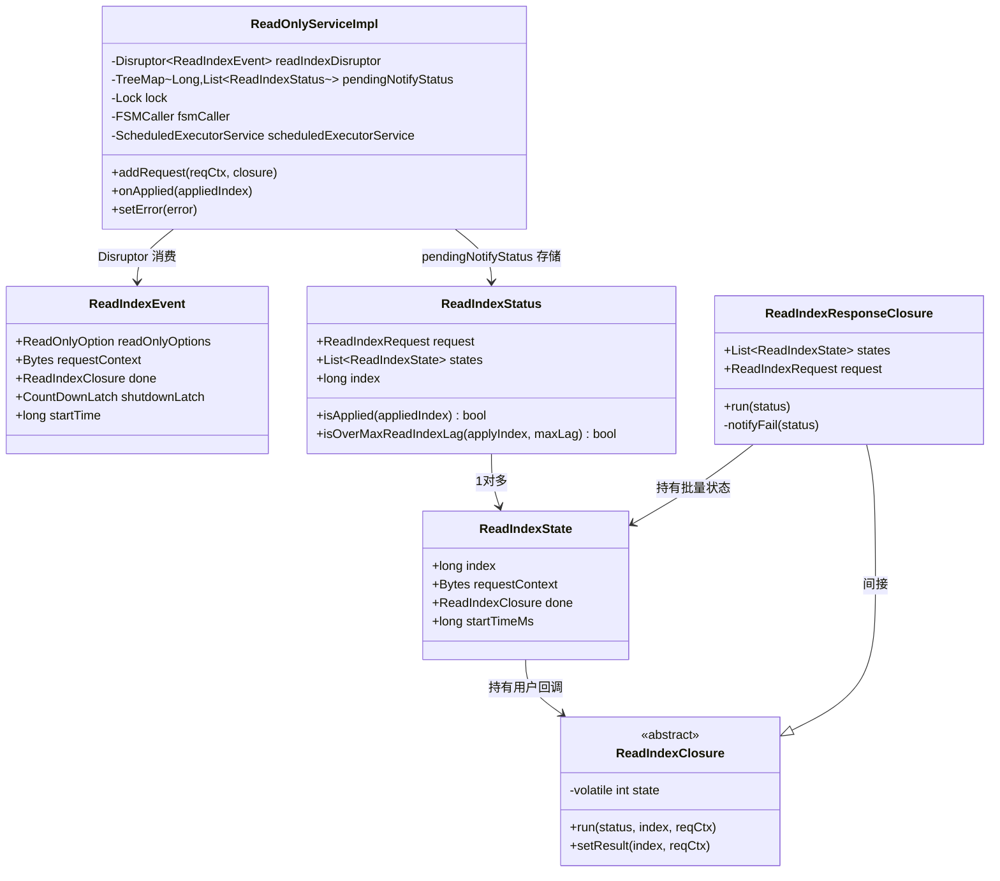
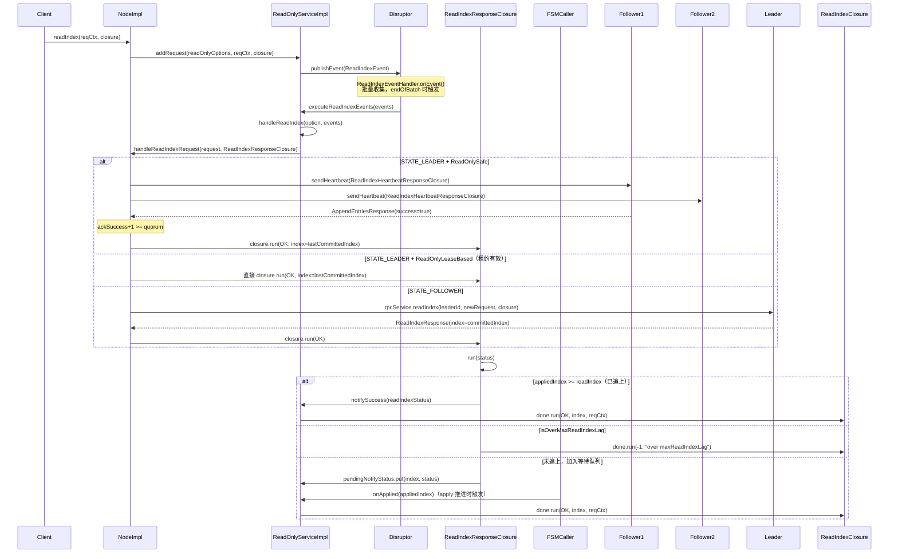

# 08 - 线性一致读（ReadIndex）

## ☕ 想先用人话了解线性一致读？请看通俗解读

> **👉 [点击阅读：用人话聊聊线性一致读（通俗解读完整版）](./通俗解读.md)**
>
> 通俗解读版用"存完钱查余额"的比喻，从"为什么直接读不靠谱"讲起，带你理解 ReadIndex 三步法、LeaseRead 的租约与风险、批量合并的效率提升、新 Leader 拒绝读请求的原因，以及超时保护机制。**建议先读通俗解读版。**

---

## 1. 解决什么问题

**问题**：Raft 集群中，如何保证读操作的线性一致性？

- 直接从 Follower 读：Follower 日志可能落后，读到旧数据 ❌
- 直接从 Leader 读（不加保护）：Leader 刚当选时，可能有旧 Leader 的提交未同步，且 Leader 不确定自己是否仍是合法 Leader（脑裂场景）❌

**线性一致读保证**：读操作能看到在它之前所有已完成的写操作结果。

JRaft 提供两种实现：
- **ReadIndex（默认）**：通过心跳确认 Leader 身份，安全但有一次 RTT 开销
- **LeaseRead**：依赖租约（electionTimeout × 0.9），无额外网络开销，但依赖时钟精度

---

## 2. 核心数据结构

### 2.1 问题推导

【问题】→ 需要追踪"哪些读请求在等待哪个 index 被 apply"  
【需要什么信息】→ 每个读请求的 requestContext、回调 closure、开始时间、等待的 readIndex  
【推导出的结构】→ 一个 `ReadIndexState`（单个请求状态）+ 一个 `ReadIndexStatus`（批量请求 + readIndex）+ 一个 TreeMap 按 index 排序等待

### 2.2 `ReadIndexState`（`ReadIndexState.java:28-66`）

```java
// 单个 ReadIndex 请求的状态
public class ReadIndexState {
    private long                   index = -1;       // 第 30 行：Leader 返回的 committedIndex（readIndex）
    private final Bytes            requestContext;   // 第 32 行：用户传入的请求上下文
    private final ReadIndexClosure done;             // 第 34 行：用户回调
    private final long             startTimeMs;      // 第 36 行：请求开始时间（用于延迟统计）
}
```

**字段存在原因**：
- `index = -1`：初始值 -1 表示尚未从 Leader 获取到 readIndex，对应 `ReadIndexClosure.INVALID_LOG_INDEX`
- `requestContext`：用户自定义上下文，原样透传给 `ReadIndexClosure.run()`
- `startTimeMs`：用于 `nodeMetrics.recordLatency("read-index", ...)` 统计延迟

### 2.3 `ReadIndexStatus`（`ReadIndexStatus.java:29-64`）

```java
// 一批 ReadIndex 请求的聚合状态（批量合并后的单元）
public class ReadIndexStatus {
    private final ReadIndexRequest     request; // 第 31 行：原始 RPC 请求（含所有 entries）
    private final List<ReadIndexState> states;  // 第 32 行：批量合并的多个请求状态
    private final long                 index;   // 第 33 行：Leader 确认的 committedIndex（readIndex）
}
```

**关键方法**（`ReadIndexStatus.java:42-51`）：
```java
// 判断是否已经可以响应（appliedIndex 已追上 readIndex）
public boolean isApplied(long appliedIndex) {
    return appliedIndex >= this.index;
}

// 判断是否超过最大 readIndex 滞后阈值（防止 apply 严重落后时无限等待）
public boolean isOverMaxReadIndexLag(long applyIndex, int maxReadIndexLag) {
    if (maxReadIndexLag < 0) { return false; }  // maxReadIndexLag < 0 表示不限制
    return this.index - applyIndex > maxReadIndexLag;
}
```

### 2.4 `ReadIndexEvent`（`ReadOnlyServiceImpl.java:88-103`）

```java
// Disruptor 事件对象（复用，reset() 清空）
private static class ReadIndexEvent {
    ReadOnlyOption   readOnlyOptions;  // 第 89 行：ReadOnlySafe 或 ReadOnlyLeaseBased
    Bytes            requestContext;   // 第 90 行：用户请求上下文
    ReadIndexClosure done;             // 第 91 行：用户回调
    CountDownLatch   shutdownLatch;    // 第 92 行：非 null 表示这是 shutdown/flush 信号事件
    long             startTime;        // 第 93 行：入队时间戳
}
```

### 2.5 `ReadOnlyServiceImpl` 核心字段（`ReadOnlyServiceImpl.java:72-90`）

```java
public class ReadOnlyServiceImpl implements ReadOnlyService, LastAppliedLogIndexListener {
    private Disruptor<ReadIndexEvent>                  readIndexDisruptor;   // 第 73 行：异步处理队列
    private RingBuffer<ReadIndexEvent>                 readIndexQueue;       // 第 74 行：Disruptor RingBuffer
    private RaftOptions                                raftOptions;          // 第 75 行：配置（applyBatch、maxReadIndexLag 等）
    private NodeImpl                                   node;                 // 第 76 行：持有 Node 引用
    private final Lock                                 lock = new ReentrantLock(); // 第 77 行：保护 pendingNotifyStatus
    private FSMCaller                                  fsmCaller;            // 第 79 行：获取 lastAppliedIndex
    private volatile CountDownLatch                    shutdownLatch;        // 第 81 行：shutdown 信号
    private ScheduledExecutorService                   scheduledExecutorService; // 第 83 行：定时扫描器
    private NodeMetrics                                nodeMetrics;          // 第 85 行：延迟统计
    private volatile RaftException                     error;                // 第 87 行：节点错误状态
    // <logIndex, statusList>：按 readIndex 排序的等待队列
    private final TreeMap<Long, List<ReadIndexStatus>> pendingNotifyStatus = new TreeMap<>(); // 第 90 行
}
```

**关键设计**：
- `pendingNotifyStatus` 用 `TreeMap` 而非 `HashMap`：因为需要 `headMap(appliedIndex, true)` 一次性取出所有 `readIndex ≤ appliedIndex` 的请求，TreeMap 的有序性使这个操作 O(log n)
- `lock` 保护 `pendingNotifyStatus`：`onApplied()` 和 `ReadIndexResponseClosure.run()` 都会并发访问

### 2.6 `ReadIndexClosure`（`ReadIndexClosure.java:40-167`）

```java
public abstract class ReadIndexClosure implements Closure {
    private static final int PENDING  = 0;  // 第 55 行：初始状态
    private static final int COMPLETE = 1;  // 第 56 行：正常完成
    private static final int TIMEOUT  = 2;  // 第 57 行：超时

    private volatile int state = PENDING;   // 第 65 行：CAS 保证只执行一次

    // 默认超时 2000ms（可通过 jraft.read-index.timeout 系统属性配置）
    private static final long DEFAULT_TIMEOUT = SystemPropertyUtil.getInt("jraft.read-index.timeout", 2 * 1000); // 第 51 行
}
```

**超时机制**：构造时立即注册 `TimeoutTask` 到 `TimeoutScanner.TIMER`（懒加载的全局 Timer）。超时触发时 CAS(PENDING→TIMEOUT)，成功则调用 `run(ETIMEDOUT, -1, null)`。

---

## 3. 对象关系图



---

## 4. 完整请求流程

### 4.1 时序图



---

## 5. 核心方法逐行分析

### 5.1 `addRequest()` — 入口（`ReadOnlyServiceImpl.java:289-330`）

> **注意**：`addRequest` 有两个重载版本：
> - `addRequest(byte[] reqCtx, ReadIndexClosure closure)`（第 289 行）：使用节点默认的 `ReadOnlyOptions`，内部直接委托给三参数版本
> - `addRequest(ReadOnlyOption, byte[], ReadIndexClosure)`（第 295 行）：完整版本，支持指定读模式

**分支穷举清单**（三参数版本，`ReadOnlyServiceImpl.java:295-330`）：
- □ `shutdownLatch != null` → `runClosureInThread(EHOSTDOWN)` + throw `IllegalStateException`
- □ `ApplyTaskMode.Blocking` → `readIndexQueue.publishEvent(translator)`（阻塞直到有空位）
- □ `ApplyTaskMode.NonBlocking` + `tryPublishEvent` 成功 → 正常入队
- □ `ApplyTaskMode.NonBlocking` + `tryPublishEvent` 失败 → `runClosureInThread(EBUSY)` + `recordTimes("read-index-overload-times")` + LOG.warn；`closure == null` 时 throw `OverloadException`
- □ catch(Exception) → `runClosureInThread(EPERM, "Node is down.")`

```java
// ReadOnlyServiceImpl.java 第 290-320 行
public void addRequest(final ReadOnlyOption readOnlyOptions, final byte[] reqCtx, final ReadIndexClosure closure) {
    if (this.shutdownLatch != null) {
        ThreadPoolsFactory.runClosureInThread(this.node.getGroupId(), closure,
            new Status(RaftError.EHOSTDOWN, "Was stopped"));
        throw new IllegalStateException("Service already shutdown.");
    }
    try {
        EventTranslator<ReadIndexEvent> translator = (event, sequence) -> {
            event.readOnlyOptions = readOnlyOptions;
            event.done = closure;
            event.requestContext = new Bytes(reqCtx);
            event.startTime = Utils.monotonicMs();
        };
        switch (this.node.getOptions().getApplyTaskMode()) {
            case Blocking:
                this.readIndexQueue.publishEvent(translator);
                break;
            case NonBlocking:
            default:
                if (!this.readIndexQueue.tryPublishEvent(translator)) {
                    // 队列满，直接失败
                    final String errorMsg = "Node is busy, has too many read-index requests...";
                    ThreadPoolsFactory.runClosureInThread(this.node.getGroupId(), closure,
                        new Status(RaftError.EBUSY, errorMsg));
                    this.nodeMetrics.recordTimes("read-index-overload-times", 1);
                    LOG.warn("Node {} ReadOnlyServiceImpl readIndexQueue is overload.", this.node.getNodeId());
                    if (closure == null) {
                        throw new OverloadException(errorMsg);
                    }
                }
                break;
        }
    } catch (final Exception e) {
        ThreadPoolsFactory.runClosureInThread(this.node.getGroupId(), closure,
            new Status(RaftError.EPERM, "Node is down."));
    }
}
```

⚠️ **生产踩坑**：`closure == null` 时才抛 `OverloadException`，有 closure 时只是静默失败（通过 closure 回调错误）。调用方如果不检查 closure 的 status，可能感知不到过载。

### 5.2 `ReadIndexEventHandler.onEvent()` — 批量处理（`ReadOnlyServiceImpl.java:118-135`）

**分支穷举清单**：
- □ `newEvent.shutdownLatch != null` → `executeReadIndexEvents(events)` + `reset()` + `shutdownLatch.countDown()` + return（flush/shutdown 信号）
- □ `events.size() >= applyBatch || endOfBatch` → `executeReadIndexEvents(events)` + `reset()`
- □ 其他 → 仅 `events.add(newEvent)`（继续积累）

```java
// ReadOnlyServiceImpl.java 第 118-135 行
public void onEvent(final ReadIndexEvent newEvent, final long sequence, final boolean endOfBatch) {
    if (newEvent.shutdownLatch != null) {
        executeReadIndexEvents(this.events);
        reset();
        newEvent.shutdownLatch.countDown();
        return;
    }
    this.events.add(newEvent);
    if (this.events.size() >= ReadOnlyServiceImpl.this.raftOptions.getApplyBatch() || endOfBatch) {
        executeReadIndexEvents(this.events);
        reset();
    }
}
```

**批量合并设计**：多个 ReadIndex 请求被合并为一个 `ReadIndexRequest`（`entries` 列表），一次心跳确认多个请求的 readIndex，减少心跳次数。

### 5.3 `executeReadIndexEvents()` — 按模式分组（`ReadOnlyServiceImpl.java:218-224`）

```java
// ReadOnlyServiceImpl.java 第 218-224 行
private void executeReadIndexEvents(final List<ReadIndexEvent> events) {
    if (events.isEmpty()) { return; }
    handleReadIndex(ReadOnlyOption.ReadOnlySafe, events);      // 处理 Safe 模式请求
    handleReadIndex(ReadOnlyOption.ReadOnlyLeaseBased, events); // 处理 Lease 模式请求
}
```

**设计要点**：同一批 events 中可能混有两种模式的请求，`handleReadIndex()` 内部用 `filter(it -> option.equals(it.readOnlyOptions))` 过滤，分别发送不同的 `ReadIndexRequest`。

### 5.4 `handleReadIndexRequest()` — Leader/Follower 分发（`NodeImpl.java:1551-1580`）

**分支穷举清单**：
- □ `STATE_LEADER` → `readLeader(request, respBuilder, done)`
- □ `STATE_FOLLOWER` → `readFollower(request, done)`（转发给 Leader，见下方 `readFollower()` 分析）
- □ `STATE_TRANSFERRING` → `done.run(EBUSY, "Is transferring leadership.")`
- □ default（其他状态）→ `done.run(EPERM, "Invalid state for readIndex: %s.")`
- □ finally → `recordLatency("handle-read-index")` + `recordSize("handle-read-index-entries")`

**`readFollower()` 分支穷举**（`NodeImpl.java:1587-1596`）：
- □ `leaderId == null || leaderId.isEmpty()` → `closure.run(EPERM, "No leader at term %d.")` + return
- □ 正常 → 构造新 `ReadIndexRequest`（附加 `peerId=leaderId`）→ `rpcService.readIndex(leaderId.getEndpoint(), newRequest, -1, closure)`

```java
// NodeImpl.java 第 1551-1580 行
public void handleReadIndexRequest(final ReadIndexRequest request, final RpcResponseClosure<ReadIndexResponse> done) {
    final long startMs = Utils.monotonicMs();
    this.readLock.lock();
    try {
        switch (this.state) {
            case STATE_LEADER:    readLeader(request, ReadIndexResponse.newBuilder(), done); break;
            case STATE_FOLLOWER:  readFollower(request, done); break;
            case STATE_TRANSFERRING: done.run(new Status(RaftError.EBUSY, "Is transferring leadership.")); break;
            default: done.run(new Status(RaftError.EPERM, "Invalid state for readIndex: %s.", this.state)); break;
        }
    } finally {
        this.readLock.unlock();
        this.metrics.recordLatency("handle-read-index", Utils.monotonicMs() - startMs);
        this.metrics.recordSize("handle-read-index-entries", request.getEntriesCount());
    }
}
```

### 5.5 `readLeader()` — Leader 处理（`NodeImpl.java:1597-1660`）

**分支穷举清单**：
- □ `quorum <= 1`（单节点）→ 直接 `success=true`，`index=lastCommittedIndex`，`closure.run(OK)`
- □ `logManager.getTerm(lastCommittedIndex) != currTerm` → `done.run(EAGAIN, "leader has not committed any log entry at its term")`（新 Leader 保护）
- □ `request.getPeerId() != null && !conf.contains(peer) && !conf.containsLearner(peer)` → `done.run(EPERM, "Peer not in current configuration")`
- □ `ReadOnlyLeaseBased && !isLeaderLeaseValid()` → 降级为 `ReadOnlySafe`
- □ `ReadOnlySafe` → 向所有 Follower 发送心跳，等待 quorum 响应
- □ `ReadOnlyLeaseBased`（租约有效）→ 直接 `success=true`，`closure.run(OK)`

```java
// NodeImpl.java 第 1597-1660 行（关键片段）
private void readLeader(final ReadIndexRequest request, ...) {
    final int quorum = getQuorum();
    if (quorum <= 1) {
        // 单节点快速路径
        respBuilder.setSuccess(true).setIndex(this.ballotBox.getLastCommittedIndex());
        closure.setResponse(respBuilder.build());
        closure.run(Status.OK());
        return;
    }
    final long lastCommittedIndex = this.ballotBox.getLastCommittedIndex();
    if (this.logManager.getTerm(lastCommittedIndex) != this.currTerm) {
        // 新 Leader 尚未提交本任期日志，拒绝读请求（防止读到旧 Leader 的数据）
        closure.run(new Status(RaftError.EAGAIN, "ReadIndex request rejected because leader has not committed..."));
        return;
    }
    respBuilder.setIndex(lastCommittedIndex);
    // ... Follower 来源检查 ...
    ReadOnlyOption readOnlyOpt = ReadOnlyOption.valueOfWithDefault(request.getReadOnlyOptions(), ...);
    if (readOnlyOpt == ReadOnlyOption.ReadOnlyLeaseBased && !isLeaderLeaseValid()) {
        readOnlyOpt = ReadOnlyOption.ReadOnlySafe; // 租约失效，自动降级
    }
    switch (readOnlyOpt) {
        case ReadOnlySafe:
            // 向所有 Follower 发送心跳，等待 quorum 确认
            final ReadIndexHeartbeatResponseClosure heartbeatDone = new ReadIndexHeartbeatResponseClosure(...);
            for (final PeerId peer : peers) {
                if (peer.equals(this.serverId)) { continue; }
                this.replicatorGroup.sendHeartbeat(peer, heartbeatDone);
            }
            break;
        case ReadOnlyLeaseBased:
            respBuilder.setSuccess(true);
            closure.setResponse(respBuilder.build());
            closure.run(Status.OK());
            break;
    }
}
```

📌 **面试高频考点**：为什么新 Leader 要拒绝读请求？因为新 Leader 刚当选时，`lastCommittedIndex` 可能是旧 Leader 任期的日志，此时 Leader 不确定这些日志是否真的被多数节点持久化（Raft 的 Leader Completeness 保证只对本任期日志有效）。必须等到本任期有日志提交后，才能安全响应读请求。

### 5.6 `ReadIndexHeartbeatResponseClosure.run()` — 心跳 Quorum 计数（`NodeImpl.java:1501-1548`）

**分支穷举清单**：
- □ `isDone == true` → return（已完成，忽略后续响应）
- □ `status.isOk() && getResponse().getSuccess()` → `ackSuccess++`
- □ 其他 → `ackFailures++`
- □ `ackSuccess + 1 >= quorum`（+1 是 Leader 自己）→ `success=true`，`closure.run(OK)`，`isDone=true`
- □ `ackFailures >= failPeersThreshold` → `success=false`，`closure.run(OK)`，`isDone=true`

```java
// NodeImpl.java 第 1501-1548 行
public synchronized void run(final Status status) {
    if (this.isDone) { return; }
    if (status.isOk() && getResponse().getSuccess()) {
        this.ackSuccess++;
    } else {
        this.ackFailures++;
    }
    // ackSuccess + 1（Leader 自己）>= quorum 时成功
    if (this.ackSuccess + 1 >= this.quorum) {
        this.respBuilder.setSuccess(true);
        this.closure.setResponse(this.respBuilder.build());
        this.closure.run(Status.OK());
        this.isDone = true;
    } else if (this.ackFailures >= this.failPeersThreshold) {
        this.respBuilder.setSuccess(false);
        this.closure.setResponse(this.respBuilder.build());
        this.closure.run(Status.OK());
        this.isDone = true;
    }
}
```

**`failPeersThreshold` 计算**（`NodeImpl.java:1517`）：
```java
// peers 数量为偶数时：failPeersThreshold = quorum - 1
// peers 数量为奇数时：failPeersThreshold = quorum
this.failPeersThreshold = peersCount % 2 == 0 ? (quorum - 1) : quorum;
```

### 5.7 `ReadIndexResponseClosure.run()` — 响应处理（`ReadOnlyServiceImpl.java:155-195`）

**分支穷举清单**：
- □ `!status.isOk()` → `notifyFail(status)`（RPC 失败）
- □ `!readIndexResponse.getSuccess()` → `notifyFail("Fail to run ReadIndex task, maybe the leader stepped down.")`（Leader 降级）
- □ `isApplied(lastAppliedIndex)` → `lock.unlock()` + `notifySuccess(readIndexStatus)`（已追上，直接响应）
- □ `isOverMaxReadIndexLag(lastAppliedIndex, maxReadIndexLag)` → `lock.unlock()` + `notifyFail("...over maxReadIndexLag")`（滞后过大，直接失败）
- □ 其他 → `pendingNotifyStatus.computeIfAbsent(index).add(readIndexStatus)`（加入等待队列）
- □ finally → `if (doUnlock) lock.unlock()`（防止重复 unlock）

```java
// ReadOnlyServiceImpl.java 第 155-195 行
public void run(final Status status) {
    if (!status.isOk()) { notifyFail(status); return; }
    final ReadIndexResponse readIndexResponse = getResponse();
    if (!readIndexResponse.getSuccess()) {
        notifyFail(new Status(-1, "Fail to run ReadIndex task, maybe the leader stepped down."));
        return;
    }
    final ReadIndexStatus readIndexStatus = new ReadIndexStatus(this.states, this.request,
        readIndexResponse.getIndex());
    for (final ReadIndexState state : this.states) {
        state.setIndex(readIndexResponse.getIndex()); // 记录 readIndex
    }
    boolean doUnlock = true;
    ReadOnlyServiceImpl.this.lock.lock();
    try {
        if (readIndexStatus.isApplied(ReadOnlyServiceImpl.this.fsmCaller.getLastAppliedIndex())) {
            ReadOnlyServiceImpl.this.lock.unlock();
            doUnlock = false;
            notifySuccess(readIndexStatus); // 已追上，直接回调
        } else {
            if (readIndexStatus.isOverMaxReadIndexLag(...)) {
                ReadOnlyServiceImpl.this.lock.unlock();
                doUnlock = false;
                notifyFail(new Status(-1, "...over maxReadIndexLag")); // 滞后过大，直接失败
            } else {
                // 加入等待队列，等 onApplied 触发
                ReadOnlyServiceImpl.this.pendingNotifyStatus
                    .computeIfAbsent(readIndexStatus.getIndex(), k -> new ArrayList<>(10))
                    .add(readIndexStatus);
            }
        }
    } finally {
        if (doUnlock) { ReadOnlyServiceImpl.this.lock.unlock(); }
    }
}
```

⚠️ **生产踩坑**：`doUnlock` 标志位是为了防止在 `notifySuccess/notifyFail` 之前已经手动 `unlock()`，再在 `finally` 中重复 `unlock()` 导致 `IllegalMonitorStateException`。这是一种常见的"提前释放锁"模式。

### 5.8 `onApplied()` — apply 推进触发（`ReadOnlyServiceImpl.java:358-400`）

**触发时机**：两个来源：
1. `FSMCaller` 每次 `doCommitted()` 后调用 `notifyLastAppliedIndexUpdated()`，触发所有 `LastAppliedLogIndexListener.onApplied()`
2. `scheduledExecutorService` 定时（每 `maxElectionDelayMs` ms）调用 `onApplied(fsmCaller.getLastAppliedIndex())`（兜底扫描）

**分支穷举清单**：
- □ `pendingNotifyStatus.isEmpty()` → return（无等待请求）
- □ `statuses != null`（headMap 有结果）→ 遍历收集 `pendingStatuses`，`it.remove()` 从 TreeMap 移除
- □ `this.error != null` → `resetPendingStatusError(error.getStatus())`（节点出错，清空所有等待请求）
- □ finally → 遍历 `pendingStatuses` 调用 `notifySuccess(status)`（在锁外执行，避免持锁回调）

```java
// ReadOnlyServiceImpl.java 第 358-400 行
public void onApplied(final long appliedIndex) {
    List<ReadIndexStatus> pendingStatuses = null;
    this.lock.lock();
    try {
        if (this.pendingNotifyStatus.isEmpty()) { return; }
        // headMap(appliedIndex, true)：取出所有 key <= appliedIndex 的条目
        final Map<Long, List<ReadIndexStatus>> statuses = this.pendingNotifyStatus.headMap(appliedIndex, true);
        if (statuses != null) {
            pendingStatuses = new ArrayList<>(statuses.size() << 1);
            final Iterator<Map.Entry<Long, List<ReadIndexStatus>>> it = statuses.entrySet().iterator();
            while (it.hasNext()) {
                final Map.Entry<Long, List<ReadIndexStatus>> entry = it.next();
                pendingStatuses.addAll(entry.getValue());
                it.remove(); // 同时从 pendingNotifyStatus 中移除
            }
        }
        if (this.error != null) {
            resetPendingStatusError(this.error.getStatus()); // 节点出错，清空剩余等待
        }
    } finally {
        this.lock.unlock();
        // 在锁外执行回调，避免持锁时调用用户代码
        if (pendingStatuses != null && !pendingStatuses.isEmpty()) {
            for (final ReadIndexStatus status : pendingStatuses) {
                notifySuccess(status);
            }
        }
    }
}
```

📌 **面试高频考点**：为什么 `notifySuccess` 在 `finally` 中（锁外）执行？因为 `notifySuccess` 会调用用户的 `ReadIndexClosure.run()`，用户代码可能耗时或再次调用 JRaft API，持锁执行会导致死锁或锁竞争。

### 5.9 `ReadIndexClosure.run(Status)` — 超时保护（`ReadIndexClosure.java:115-130`）

**分支穷举清单**：
- □ `CAS(PENDING→COMPLETE)` 失败 → `LOG.warn("A timeout read-index response finally returned")` + return（已超时，忽略）
- □ CAS 成功 → `run(status, this.index, this.requestContext)`
- □ catch(Throwable) → `LOG.error("Fail to run ReadIndexClosure with status: {}.")`

```java
// ReadIndexClosure.java 第 115-130 行
public void run(final Status status) {
    if (!STATE_UPDATER.compareAndSet(this, PENDING, COMPLETE)) {
        LOG.warn("A timeout read-index response finally returned: {}.", status);
        return;
    }
    try {
        run(status, this.index, this.requestContext);
    } catch (final Throwable t) {
        LOG.error("Fail to run ReadIndexClosure with status: {}.", status, t);
    }
}
```

**超时任务**（`ReadIndexClosure.java:138-150`）：
```java
// TimeoutTask.run() 第 138-150 行
public void run(final Timeout timeout) throws Exception {
    if (!STATE_UPDATER.compareAndSet(this.closure, PENDING, TIMEOUT)) {
        return; // 已完成，忽略超时
    }
    final Status status = new Status(RaftError.ETIMEDOUT, "read-index request timeout");
    try {
        this.closure.run(status, INVALID_LOG_INDEX, null);
    } catch (final Throwable t) {
        LOG.error("[Timeout] fail to run ReadIndexClosure with status: {}.", status, t);
    }
}
```

---

## 6. `init()` 初始化流程（`ReadOnlyServiceImpl.java:237-255`）

```java
// ReadOnlyServiceImpl.java 第 237-255 行
public boolean init(final ReadOnlyServiceOptions opts) {
    this.node = opts.getNode();
    this.nodeMetrics = this.node.getNodeMetrics();
    this.fsmCaller = opts.getFsmCaller();
    this.raftOptions = opts.getRaftOptions();

    // 1. 创建定时扫描器（兜底：防止 onApplied 事件丢失）
    this.scheduledExecutorService = Executors.newSingleThreadScheduledExecutor(
        new NamedThreadFactory("ReadOnlyService-PendingNotify-Scanner", true));

    // 2. 创建 Disruptor（MULTI 生产者，BlockingWaitStrategy）
    this.readIndexDisruptor = DisruptorBuilder.<ReadIndexEvent>newInstance()
        .setEventFactory(new ReadIndexEventFactory())
        .setRingBufferSize(this.raftOptions.getDisruptorBufferSize())
        .setThreadFactory(new NamedThreadFactory("JRaft-ReadOnlyService-Disruptor-", true))
        .setWaitStrategy(new BlockingWaitStrategy())
        .setProducerType(ProducerType.MULTI)
        .build();
    this.readIndexDisruptor.handleEventsWith(new ReadIndexEventHandler());
    this.readIndexDisruptor.setDefaultExceptionHandler(new LogExceptionHandler<>(...));
    this.readIndexQueue = this.readIndexDisruptor.start();

    // 3. 注册 Disruptor 指标
    if (this.nodeMetrics.getMetricRegistry() != null) {
        this.nodeMetrics.getMetricRegistry()
            .register("jraft-read-only-service-disruptor", new DisruptorMetricSet(this.readIndexQueue));
    }

    // 4. 注册 LastAppliedLogIndexListener（FSMCaller 每次 apply 后通知）
    this.fsmCaller.addLastAppliedLogIndexListener(this);

    // 5. 启动定时扫描器（每 maxElectionDelayMs ms 扫描一次）
    this.scheduledExecutorService.scheduleAtFixedRate(
        () -> onApplied(this.fsmCaller.getLastAppliedIndex()),
        this.raftOptions.getMaxElectionDelayMs(),
        this.raftOptions.getMaxElectionDelayMs(),
        TimeUnit.MILLISECONDS);
    return true;
}
```

**为什么需要定时扫描器？**  
`FSMCaller.addLastAppliedLogIndexListener()` 是主要触发路径，但如果 apply 事件在极端情况下丢失（如节点刚恢复），定时扫描器作为兜底保证 pending 请求最终被响应。

---

## 7. `shutdown()` 和 `join()` 流程（`ReadOnlyServiceImpl.java:258-278`）

```java
// ReadOnlyServiceImpl.java 第 258-278 行
public synchronized void shutdown() {
    if (this.shutdownLatch != null) { return; } // 幂等
    this.shutdownLatch = new CountDownLatch(1);
    // 向 Disruptor 发送 shutdown 信号事件（shutdownLatch 非 null 的特殊事件）
    ThreadPoolsFactory.runInThread(this.node.getGroupId(),
        () -> this.readIndexQueue.publishEvent((event, sequence) -> event.shutdownLatch = this.shutdownLatch));
    this.scheduledExecutorService.shutdown();
}

public void join() throws InterruptedException {
    if (this.shutdownLatch != null) {
        this.shutdownLatch.await(); // 等待 Disruptor 处理完 shutdown 事件
    }
    this.readIndexDisruptor.shutdown();
    resetPendingStatusError(new Status(RaftError.ESTOP, "Node is quit.")); // 清空所有等待请求
    this.scheduledExecutorService.awaitTermination(5, TimeUnit.SECONDS);
}
```

### 5.10 `setError()` — 错误状态设置（`ReadOnlyServiceImpl.java:254-258`）

```java
// ReadOnlyServiceImpl.java 第 254-258 行
@Override
public synchronized void setError(final RaftException error) {
    if (this.error == null) {  // 幂等保护：只记录第一个错误，不覆盖
        this.error = error;
    }
}
```

**设计要点**：
- `synchronized` 方法：防止并发调用时多次赋值
- `this.error == null` 才赋值：保留第一个错误，后续错误忽略（第一个错误通常是根因）
- 设置后，`onApplied()` 中的 `this.error != null` 分支会触发 `resetPendingStatusError()`，清空所有等待中的读请求

### 5.11 `notifySuccess()` — 成功回调（`ReadOnlyServiceImpl.java:449-462`）

```java
// ReadOnlyServiceImpl.java 第 449-462 行
private void notifySuccess(final ReadIndexStatus status) {
    final long nowMs = Utils.monotonicMs();
    final List<ReadIndexState> states = status.getStates();
    final int taskCount = states.size();
    for (int i = 0; i < taskCount; i++) {
        final ReadIndexState task = states.get(i);
        final ReadIndexClosure done = task.getDone(); // stack copy
        if (done != null) {  // done 可能为 null，此时静默跳过
            this.nodeMetrics.recordLatency("read-index", nowMs - task.getStartTimeMs());
            done.setResult(task.getIndex(), task.getRequestContext().get()); // 先设置结果
            done.run(Status.OK());  // 再触发回调
        }
    }
}
```

**关键细节**：
- **调用顺序**：`done.setResult()` 必须先于 `done.run()`，否则用户在 `run()` 中调用 `getIndex()` 会得到 -1
- **`done == null` 静默跳过**：用户可以传入 null closure（只关心 readIndex 值，不需要回调），此时不报错
- **延迟统计**：`recordLatency("read-index", nowMs - task.getStartTimeMs())` 统计从请求入队到回调的完整延迟

---

## 8. 核心不变式

1. **ReadIndex ≤ CommittedIndex**：`readIndex` 取自 Leader 处理请求时的 `lastCommittedIndex`（`NodeImpl.java:1634`），保证读到的数据不超过已提交的范围
2. **心跳确认 Leader 身份**：`ReadOnlySafe` 模式下，必须收到 quorum 个心跳响应才能确认 readIndex 有效，防止脑裂场景下旧 Leader 响应读请求
3. **等待 Apply 后响应**：`appliedIndex >= readIndex` 才调用 closure，保证状态机已应用到 readIndex 对应的状态

---

## 9. 两种模式对比

| 特性 | ReadOnlySafe（默认） | ReadOnlyLeaseBased |
|---|---|---|
| 安全性 | 强一致，不依赖时钟 | 依赖时钟精度，时钟漂移可能读旧数据 |
| 性能 | 需要一次心跳 RTT | 无额外网络开销 |
| 降级保护 | 无需降级 | 租约失效时自动降级为 ReadOnlySafe（`NodeImpl.java:1648`） |
| 适用场景 | 对一致性要求严格 | 对性能要求高，时钟可靠（物理机） |
| 配置 | `ReadOnlyOption.ReadOnlySafe` | `ReadOnlyOption.ReadOnlyLeaseBased` |

---

## 10. 面试高频考点 📌

1. **ReadIndex 为什么需要发送心跳？**  
   确认自己仍是合法 Leader（防止脑裂：旧 Leader 可能已被隔离，新 Leader 已选出，旧 Leader 不知道）。

2. **新 Leader 为什么要拒绝读请求？**  
   新 Leader 的 `lastCommittedIndex` 可能是旧任期的日志，Raft 的 Leader Completeness 只保证本任期日志的提交，必须等本任期有日志提交后才能安全读。

3. **LeaseRead 的风险是什么？**  
   时钟漂移：如果 Leader 的时钟走慢，租约实际已过期但 Leader 认为仍有效，此时可能有新 Leader 选出，旧 Leader 仍响应读请求，导致读到旧数据。

4. **`appliedIndex` 和 `committedIndex` 的区别？**  
   `committedIndex`：已达成 quorum 写入，但可能尚未应用到状态机；`appliedIndex`：已应用到状态机，用户可以安全读取。

5. **`pendingNotifyStatus` 为什么用 TreeMap？**  
   需要 `headMap(appliedIndex, true)` 一次性取出所有 `readIndex ≤ appliedIndex` 的请求，TreeMap 的有序性使这个操作高效（O(log n)）。

6. **ReadIndexClosure 的超时机制如何工作？**  
   构造时注册 `TimeoutTask`，超时后 CAS(PENDING→TIMEOUT)，成功则调用 `run(ETIMEDOUT, -1, null)`；正常完成时 CAS(PENDING→COMPLETE)，两者互斥，保证 closure 只执行一次。

---

## 11. 生产踩坑 ⚠️

1. **ReadIndex 超时设置过短**：Leader 切换时心跳 RTT 增大，大量请求超时失败。建议 `jraft.read-index.timeout` 设置为 `electionTimeout` 的 2-3 倍。

2. **LeaseRead 在虚拟机/容器环境中不安全**：VM 暂停、容器 CPU 限流都会导致时钟漂移，租约判断失效，读到旧数据。

3. **`ReadIndexClosure.run()` 中执行耗时操作**：`notifySuccess` 在 `onApplied()` 的 finally 块中调用，虽然已在锁外，但仍在 `ReadOnlyService-PendingNotify-Scanner` 线程或 FSMCaller 线程中执行。耗时操作会阻塞后续 pending 请求的响应。

4. **`maxReadIndexLag` 配置不当**：默认值为 -1（不限制）。如果 apply 严重落后（如状态机处理慢），大量读请求会积压在 `pendingNotifyStatus` 中，消耗内存。建议根据业务 SLA 设置合理的 `maxReadIndexLag`。

5. **Follower 转发 ReadIndex 时 Leader 不在配置中**：`readFollower()` 直接转发给 `leaderId`，如果 `leaderId` 为空（刚启动或 Leader 未知），返回 `EPERM`，调用方需要重试。
