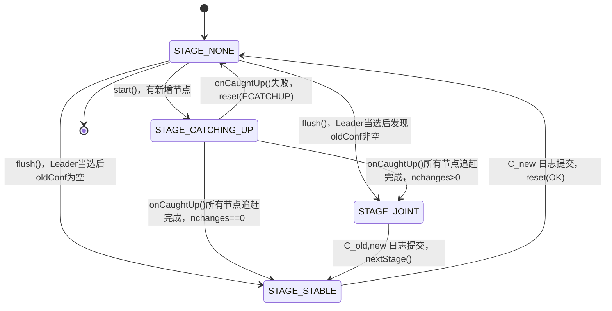
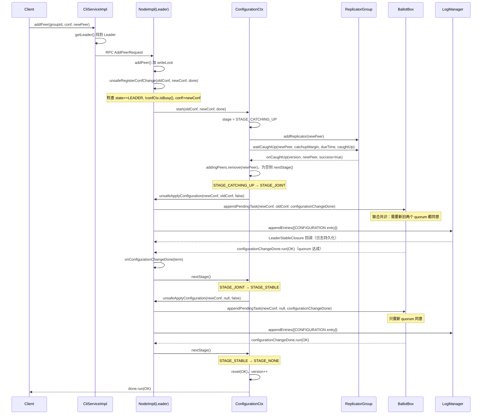

# 09 - 成员变更（Membership Change）

## 1. 解决什么问题

集群在运行过程中需要动态调整成员：扩容（加节点）、缩容（删节点）、替换故障节点、添加只读副本（Learner）。  
核心挑战：**变更过程中不能出现两个 Leader**。

**为什么直接切换配置会出现双 Leader？**

假设 3 节点集群 `{A, B, C}` 要变更为 `{A, B, D}`，如果直接切换：
- 旧配置 `{A, B, C}` 的 quorum = 2，`{A, B}` 可以选出 Leader
- 新配置 `{A, B, D}` 的 quorum = 2，`{A, D}` 也可以选出 Leader
- 两个 quorum 可以同时存在 → 双 Leader

**JRaft 的解法：联合共识（Joint Consensus）**

引入过渡配置 `C_old,new`，在过渡期间**同时需要新旧两个 quorum 都同意**，从根本上消除双 Leader 的可能性。

---

## 2. 核心数据结构

### 2.1 `Configuration`（`Configuration.java:42-325`）

**【问题】** 如何表示一个集群的成员列表？  
**【需要什么信息】** 投票成员列表 + 学习者列表（不参与投票）  
**【推导出的结构】** 两个集合，peers 有序（保证 quorum 计算一致），learners 保持插入顺序

```java
// Configuration.java 第 46-49 行
private List<PeerId>          peers    = new ArrayList<>();
// use LinkedHashSet to keep insertion order.
private LinkedHashSet<PeerId> learners = new LinkedHashSet<>();
```

**关键方法**：
- `isValid()`（第 143 行）：`peers` 不为空 **且** `peers ∩ learners = ∅`（同一节点不能既是 Voter 又是 Learner）
- `diff(rhs, included, excluded)`（第 310 行）：计算两个配置的差集，`included = this - rhs`，`excluded = rhs - this`，用于确定需要新增/删除的节点。**注意：`diff()` 只处理 peers（Voter），不处理 learners**，Learner 的差集由 `addNewLearners()` 单独计算
- `parse(String)`（第 280 行）：解析 `"ip:port,ip:port/learner"` 格式，`/learner` 后缀标识 Learner 节点

### 2.2 `ConfigurationEntry`（`ConfigurationEntry.java:36-130`）

**【问题】** 联合共识需要同时持有新旧两个配置，如何表示？  
**【推导出的结构】** 一个 entry 包含 `conf`（新配置）和 `oldConf`（旧配置），`oldConf` 为空时表示稳定状态

```java
// ConfigurationEntry.java 第 38-40 行
private LogId         id      = new LogId(0, 0);  // 对应的日志 index/term
private Configuration conf    = new Configuration(); // 新配置（C_new）
private Configuration oldConf = new Configuration(); // 旧配置（C_old），空=稳定态
```

**关键方法**：
- `isStable()`（第 73 行）：`oldConf.isEmpty()` → 不在联合共识过渡期
- `listPeers()`（第 82 行）：返回 `Set<PeerId>`（`conf.peers ∪ oldConf.peers`，**无序、去重**），联合共识期间两个配置的所有成员都需要复制日志
- `isValid()`（第 91 行）：`conf.isValid()` **且** `listPeers() ∩ listLearners() = ∅`

### 2.3 `ConfigurationManager`（`ConfigurationManager.java:36-111`）

**【问题】** 节点重启后如何恢复历史配置？日志回放时如何知道某条日志对应哪个配置？  
**【推导出的结构】** 按 logIndex 有序的配置历史链表 + 快照配置（用于截断后的基准）

```java
// ConfigurationManager.java 第 39-40 行
private final LinkedList<ConfigurationEntry> configurations = new LinkedList<>();
private ConfigurationEntry                   snapshot       = new ConfigurationEntry();
```

**关键方法**：
- `add(entry)`（第 44 行）：严格要求 `entry.index > peekLast().index`，保证有序性；**返回 `boolean`，失败时返回 `false` 并打印 error 日志，不抛异常**
- `truncatePrefix(firstIndexKept)`（第 55 行）：快照安装后，丢弃 `index < firstIndexKept` 的历史配置
- `truncateSuffix(lastIndexKept)`（第 63 行）：日志回滚时，丢弃 `index > lastIndexKept` 的配置
- `get(lastIncludedIndex)`（第 88 行）：找到 `index <= lastIncludedIndex` 的最新配置（二分查找语义，O(n) 链表遍历）

**`get()` 分支穷举**（`ConfigurationManager.java:88-110`）：
- □ `configurations.isEmpty()` → 验证 `lastIncludedIndex >= snapshot.index` + return snapshot
- □ 遍历找到 `index > lastIncludedIndex` → `it.previous()` 回退（把迭代器位置退回到该 entry 之前），再调用 `it.previous()` 返回 `<= lastIncludedIndex` 的最后一个 entry
- □ 遍历完所有 entry 都 `<= lastIncludedIndex` → `it.hasPrevious()` 为 true，return 最后一个 entry
- □ 所有 entry 都 `> lastIncludedIndex` → `it.hasPrevious()` 为 false，return snapshot

### 2.4 `ConfigurationCtx`（`NodeImpl.java:332-535`）

**【问题】** 成员变更是一个多阶段异步过程（追赶→联合共识→稳定），如何跟踪当前进度？  
**【推导出的结构】** 状态机 + 版本号（防止过期回调）+ 新旧 peers 列表

```java
// NodeImpl.java 第 332-353 行
private static class ConfigurationCtx {
    enum Stage {
        STAGE_NONE,        // 第 334 行：空闲
        STAGE_CATCHING_UP, // 第 335 行：新节点追赶日志中
        STAGE_JOINT,       // 第 336 行：联合共识日志已提交，等待 C_new 提交
        STAGE_STABLE       // 第 337 行：C_new 已提交，变更完成
    }

    final NodeImpl node;
    Stage          stage;
    int            nchanges;      // 第 343 行：变更节点数（新增+删除），0 表示只变更 Learner
    long           version;       // 第 344 行：版本号，每次 reset() 后递增，防止过期 onCaughtUp 回调
    List<PeerId>   newPeers    = new ArrayList<>();  // 第 346 行：目标配置的 Voter 列表
    List<PeerId>   oldPeers    = new ArrayList<>();  // 第 347 行：当前配置的 Voter 列表
    List<PeerId>   addingPeers = new ArrayList<>();  // 第 348 行：正在追赶的新节点（追赶完成后移除）
    List<PeerId>   newLearners = new ArrayList<>();  // 第 350 行：目标配置的 Learner 列表
    List<PeerId>   oldLearners = new ArrayList<>();  // 第 351 行：当前配置的 Learner 列表
    Closure        done;          // 第 352 行：变更完成后的用户回调
}
```

**`version` 字段的作用**：`onCaughtUp` 是异步回调，如果变更被取消（`reset()`）后又重新开始，旧的 `onCaughtUp` 回调可能延迟到达。`version` 在每次 `reset()` 时递增，回调时检查 `version != this.version` 则忽略，防止过期回调干扰新的变更流程。

---

## 3. 状态机流程



---

## 4. 完整调用链（以 `addPeer` 为例）



---

## 5. 核心方法深度分析

### 5.1 `unsafeRegisterConfChange()` — 变更入口（`NodeImpl.java:2417-2476`）

**分支穷举清单**：
- □ `newConf.isValid()` 失败 → throw `IllegalArgumentException`（peers 为空或 peers∩learners 非空）
- □ `ConfigurationEntry.isValid()` 失败 → throw `IllegalArgumentException`
- □ `state != STATE_LEADER` + `state == STATE_TRANSFERRING` → `done.run(EBUSY, "Is transferring leadership.")`
- □ `state != STATE_LEADER` + 其他 → `done.run(EPERM, "Not leader")`
- □ `confCtx.isBusy()` → `done.run(EBUSY, "Doing another configuration change.")`
- □ `conf.getConf().equals(newConf)` → `done.run(Status.OK())`（幂等，直接返回成功）
- □ 正常 → `confCtx.start(oldConf, newConf, done)`

```java
// NodeImpl.java 第 2417-2476 行
private void unsafeRegisterConfChange(final Configuration oldConf, final Configuration newConf, final Closure done) {
    Requires.requireTrue(newConf.isValid(), "Invalid new conf: %s", newConf);
    Requires.requireTrue(new ConfigurationEntry(null, newConf, oldConf).isValid(), "Invalid conf entry: %s", newConf);

    if (this.state != State.STATE_LEADER) {
        // STATE_TRANSFERRING → EBUSY；其他 → EPERM
        ...
        return;
    }
    if (this.confCtx.isBusy()) {
        // 不允许并发变更
        ...
        return;
    }
    if (this.conf.getConf().equals(newConf)) {
        // 幂等：配置未变化，直接成功
        ThreadPoolsFactory.runClosureInThread(this.groupId, done, Status.OK());
        return;
    }
    this.confCtx.start(oldConf, newConf, done);
}
```

### 5.2 `ConfigurationCtx.start()` — 启动变更（`NodeImpl.java:363-400`）

**分支穷举清单**：
- □ `isBusy()` + `done != null` → `done.run(EBUSY, "Already in busy stage.")` + throw `IllegalStateException`
- □ `isBusy()` + `done == null` → 只 throw `IllegalStateException`，不回调
- □ `this.done != null` + `done != null` → `done.run(EINVAL, "Already have done closure.")` + throw `IllegalArgumentException`
- □ `this.done != null` + `done == null` → 只 throw `IllegalArgumentException`，不回调
- □ `adding.isEmpty()`（无新增 Voter，只有删除或 Learner 变更）→ `addNewLearners()` + `nextStage()`（跳过 CATCHING_UP）
- □ `adding` 不为空 → `addNewLearners()` + `addNewPeers(adding)`（进入 CATCHING_UP）

```java
// NodeImpl.java 第 363-400 行
void start(final Configuration oldConf, final Configuration newConf, final Closure done) {
    // ...
    this.stage = Stage.STAGE_CATCHING_UP;
    this.oldPeers = oldConf.listPeers();
    this.newPeers = newConf.listPeers();
    this.oldLearners = oldConf.listLearners();  // Learner 列表同步赋值
    this.newLearners = newConf.listLearners();
    final Configuration adding = new Configuration();
    final Configuration removing = new Configuration();
    newConf.diff(oldConf, adding, removing);  // 只计算 Voter 差集
    this.nchanges = adding.size() + removing.size();

    addNewLearners();  // 先启动 Learner 复制器（不阻塞）
    if (adding.isEmpty()) {
        nextStage();   // 无新增节点，直接进入 JOINT 或 STABLE
        return;
    }
    addNewPeers(adding);  // 启动新节点复制器，等待追赶
}
```

**关键设计**：`nchanges` 只统计 Voter 的变更数量（`adding.size() + removing.size()`），Learner 变更不计入。当 `nchanges == 0` 时（只变更 Learner），`nextStage()` 会从 `STAGE_CATCHING_UP` 直接 fall-through 到 `STAGE_STABLE`，跳过联合共识阶段。

### 5.3 `ConfigurationCtx.addNewPeers()` — 启动追赶（`NodeImpl.java:402-420`）

**分支穷举清单**：
- □ `replicatorGroup.addReplicator(newPeer)` 失败 → `onCaughtUp(version, newPeer, false)` + return（立即失败）
- □ `replicatorGroup.waitCaughtUp()` 失败 → `onCaughtUp(version, newPeer, false)` + return（立即失败）
- □ 正常 → 等待 `OnCaughtUp` 异步回调

```java
// NodeImpl.java 第 402-420 行
private void addNewPeers(final Configuration adding) {
    this.addingPeers = adding.listPeers();
    for (final PeerId newPeer : this.addingPeers) {
        if (!this.node.replicatorGroup.addReplicator(newPeer)) {
            onCaughtUp(this.version, newPeer, false);  // 立即失败
            return;
        }
        final OnCaughtUp caughtUp = new OnCaughtUp(this.node, this.node.currTerm, newPeer, this.version);
        final long dueTime = Utils.nowMs() + this.node.options.getElectionTimeoutMs();
        if (!this.node.replicatorGroup.waitCaughtUp(this.node.getGroupId(), newPeer,
            this.node.options.getCatchupMargin(), dueTime, caughtUp)) {
            onCaughtUp(this.version, newPeer, false);  // 立即失败
            return;
        }
    }
}
```

**`catchupMargin`**：允许新节点落后 Leader 的最大日志条数（`NodeOptions.catchupMargin`，默认 1000）。新节点的 `lastLogIndex >= leader.lastLogIndex - catchupMargin` 时认为追赶完成。

**`dueTime`**：追赶超时时间 = `nowMs + electionTimeoutMs`。超时后触发 `onCaughtUp(version, peer, false)`，变更失败。

### 5.4 `ConfigurationCtx.onCaughtUp()` — 追赶回调（`NodeImpl.java:430-450`）

**分支穷举清单**：
- □ `version != this.version` → LOG.warn + return（版本不匹配，忽略过期回调）
- □ `stage != STAGE_CATCHING_UP` → throw `IllegalStateException`（断言保护）
- □ `success == true` + `addingPeers` 不为空 → 移除该 peer，继续等待其他节点
- □ `success == true` + `addingPeers` 为空 → `nextStage()`（所有节点追赶完成）
- □ `success == false` → `reset(ECATCHUP, "Peer %s failed to catch up.")`（变更失败）

### 5.5 `ConfigurationCtx.nextStage()` — 推进阶段（`NodeImpl.java:505-530`）

**分支穷举清单**：
- □ `!isBusy()` → throw `IllegalStateException`
- □ `STAGE_CATCHING_UP` + `nchanges > 0` → `stage = STAGE_JOINT`，提交 `C_old,new` 日志
- □ `STAGE_CATCHING_UP` + `nchanges == 0`（fall-through 到 STAGE_JOINT case）→ `stage = STAGE_STABLE`，提交 `C_new` 日志
- □ `STAGE_JOINT` → `stage = STAGE_STABLE`，提交 `C_new` 日志（`oldConf = null`）
- □ `STAGE_STABLE` + `newPeers` 不含 `serverId` → `reset(OK)` + `stepDown(ELEADERREMOVED, "This node was removed.")`
- □ `STAGE_STABLE` + `newPeers` 含 `serverId` → `reset(OK)`
- □ `STAGE_NONE` → throw `IllegalStateException`（不可达）

```java
// NodeImpl.java 第 505-530 行
void nextStage() {
    Requires.requireTrue(isBusy(), "Not in busy stage");
    switch (this.stage) {
    case STAGE_CATCHING_UP:
            if (this.nchanges > 0) {
                this.stage = Stage.STAGE_JOINT;
                this.node.unsafeApplyConfiguration(
                    new Configuration(this.newPeers, this.newLearners),
                    new Configuration(this.oldPeers), false);  // oldConf 只含 oldPeers，不含 oldLearners
                return;
            }
            // fall-through: nchanges == 0，跳过联合共识
        case STAGE_JOINT:
            this.stage = Stage.STAGE_STABLE;
            this.node.unsafeApplyConfiguration(
                new Configuration(this.newPeers, this.newLearners), null, false);  // oldConf=null → 稳定
            break;
        case STAGE_STABLE:
            final boolean shouldStepDown = !this.newPeers.contains(this.node.serverId);
            reset(new Status());  // 先 reset，再 stepDown
            if (shouldStepDown) {
                this.node.stepDown(this.node.currTerm, true,
                    new Status(RaftError.ELEADERREMOVED, "This node was removed."));
            }
            break;
        case STAGE_NONE:
            Requires.requireTrue(false, "Can't reach here");
            break;
    }
}
```

**`STAGE_CATCHING_UP` fall-through 设计**：当 `nchanges == 0`（只变更 Learner），`case STAGE_CATCHING_UP` 没有 `return`，直接 fall-through 到 `case STAGE_JOINT` 的逻辑，提交 `C_new`（`oldConf=null`）。这是 Java switch fall-through 的刻意使用，跳过了联合共识阶段。

### 5.6 `unsafeApplyConfiguration()` — 提交配置日志（`NodeImpl.java:2393-2415`）

**分支穷举清单**：
- □ `!confCtx.isBusy()` → throw `IllegalStateException`（断言保护）
- □ `ballotBox.appendPendingTask()` 失败 → `runClosureInThread(configurationChangeDone, EINTERNAL)` + return
- □ 正常 → `logManager.appendEntries([CONFIGURATION entry])` + `checkAndSetConfiguration(false)`

```java
// NodeImpl.java 第 2393-2415 行
private void unsafeApplyConfiguration(final Configuration newConf, final Configuration oldConf,
                                      final boolean leaderStart) {
    final LogEntry entry = new LogEntry(EnumOutter.EntryType.ENTRY_TYPE_CONFIGURATION);
    entry.setId(new LogId(0, this.currTerm));
    entry.setPeers(newConf.listPeers());
    entry.setLearners(newConf.listLearners());
    if (oldConf != null) {
        entry.setOldPeers(oldConf.listPeers());    // 联合共识：携带旧配置
        entry.setOldLearners(oldConf.listLearners());
    }
    final ConfigurationChangeDone configurationChangeDone = new ConfigurationChangeDone(this.currTerm, leaderStart);
    // 联合共识期间，BallotBox 需要新旧两个 quorum 都同意
    if (!this.ballotBox.appendPendingTask(newConf, oldConf, configurationChangeDone)) {
        ThreadPoolsFactory.runClosureInThread(this.groupId, configurationChangeDone,
            new Status(RaftError.EINTERNAL, "Fail to append task."));
        return;
    }
    final List<LogEntry> entries = new ArrayList<>();  // 方法内部创建 entries 列表
    entries.add(entry);
    this.logManager.appendEntries(entries, new LeaderStableClosure(entries));
    checkAndSetConfiguration(false);  // 立即更新本节点的 conf（不等待提交）
}
```

**`checkAndSetConfiguration(false)` 的时机**：配置日志追加后**立即**调用，不等待 quorum 提交。这是因为 Leader 需要立即知道新配置，以便向新节点发送日志复制。

### 5.7 `onConfigurationChangeDone()` — 配置日志提交回调（`NodeImpl.java:2514-2526`）

**分支穷举清单**：
- □ `term != currTerm || state > STATE_TRANSFERRING` → LOG.warn + return（过期回调，忽略）
- □ 正常 → `confCtx.nextStage()`（推进到下一阶段）

**并发保护**：方法内部**加了 `writeLock`**，`nextStage()` 是在持有 writeLock 的情况下调用的，保证与 `addPeer`/`removePeer` 等写操作的互斥。

### 5.8 `ConfigurationCtx.reset()` — 清理状态（`NodeImpl.java:452-475`）

**分支穷举清单**：
- □ `st != null && st.isOk()` → `stopReplicator(newPeers, oldPeers)` + `stopReplicator(newLearners, oldLearners)`（变更成功，停止旧节点和旧 Learner 的复制器）
- □ `st == null || !st.isOk()` → `stopReplicator(oldPeers, newPeers)` + `stopReplicator(oldLearners, newLearners)`（变更失败，停止新节点和新 Learner 的复制器）
- □ `this.done != null` → `runClosureInThread(done, st != null ? st : EPERM("Leader stepped down."))` + `this.done = null`
- □ `this.done == null` → 不回调（Leader 重启后的 flush 场景）

**`version++` 的位置**：在 `clearPeers()` 之后，`stage = STAGE_NONE` 之前，确保任何在途的 `onCaughtUp` 回调都能检测到版本变化并忽略。

**`reset()` 无参重载**：`reset()` 有无参版本 `void reset()`，直接调用 `reset(null)`，用于 Leader 主动 stepDown 时清理状态（`st=null` → 回调 `EPERM("Leader stepped down.")`）。

### 5.9 `ConfigurationCtx.flush()` — Leader 当选后重放（`NodeImpl.java:490-505`）

当节点当选 Leader 时，如果发现 `conf` 中有未完成的联合共识（`oldConf` 非空），需要重新提交配置日志：

**分支穷举清单**：
- □ `!isBusy()`（空闲时）→ `Requires.requireTrue(!isBusy(), "Flush when busy")` throw `IllegalStateException`（**注意：是空闲时 throw，不是忙碌时 throw**）
- □ `oldConf == null || oldConf.isEmpty()` → `stage = STAGE_STABLE`，`this.oldPeers = this.newPeers`，`this.oldLearners = this.newLearners`，`unsafeApplyConfiguration(conf, null, true)`（`leaderStart=true`，触发 `onLeaderStart`）
- □ `oldConf` 不为空 → `stage = STAGE_JOINT`，`this.oldPeers = oldConf.listPeers()`，`this.oldLearners = oldConf.listLearners()`，`unsafeApplyConfiguration(conf, oldConf, true)`（重新提交联合共识日志）

---

## 6. `CliServiceImpl` — 客户端视角（`CliServiceImpl.java:68-673`）

`CliServiceImpl` 是**客户端工具类**，不直接操作 Raft 状态机，而是通过 RPC 向 Leader 发送请求。

### 6.1 `addPeer()` 分支穷举（`CliServiceImpl.java:131-160`）
- □ `checkLeaderAndConnect()` 失败（找不到 Leader 或连接失败）→ return st
- □ `cliClientService.addPeer().get()` 返回 `AddPeerResponse` → `recordConfigurationChange()` + return OK
- □ `cliClientService.addPeer().get()` 返回 `ErrorResponse` → `statusFromResponse(result)`
- □ catch(Exception) → `new Status(-1, e.getMessage())`

### 6.2 `getLeader()` 实现（`CliServiceImpl.java:450-510`）

遍历 `conf` 中的所有节点，逐个发送 `GetLeaderRequest`，第一个成功返回 `leaderId` 的节点即为 Leader。**不是广播，是顺序尝试**，找到即停止。

**完整分支**：
- □ `conf == null || conf.isEmpty()` → return `EINVAL("Empty group configuration")`
- □ `connect(peer)` 失败 → `LOG.error` + `continue`（跳过该节点，继续尝试下一个）
- □ `result.get()` 返回 `ErrorResponse` → 累积错误信息到 `st`，继续遍历
- □ `result.get()` 返回 `GetLeaderResponse` + `leaderId.parse()` 成功 → `break`（找到 Leader）
- □ catch(Exception) → 累积错误信息到 `st`，继续遍历
- □ 遍历结束 + `leaderId.isEmpty()` → return `st`（所有节点都失败）
- □ 遍历结束 + `leaderId` 非空 → return `Status.OK()`

### 6.3 `resetPeer()` — 紧急恢复（`CliServiceImpl.java:235-257`）

`resetPeer` 不走联合共识，直接强制设置节点的配置。用于集群多数节点宕机、无法通过正常流程恢复的紧急场景。**危险操作**，可能导致数据不一致，需要人工确认。

**与 `addPeer`/`removePeer` 的关键区别**：`resetPeer` 向**指定节点**（`peerId` 参数）发送 RPC，不需要先找 Leader；而 `addPeer`/`removePeer` 必须向 Leader 发送 RPC。这是因为 `resetPeer` 用于多数节点宕机、无法选出 Leader 的场景，此时无法通过正常的 Leader 路由。

### 6.4 `rebalance()` — Leader 均衡（`CliServiceImpl.java:520-580`）

在多 Raft Group 场景下，将各 Group 的 Leader 均匀分布到各节点，避免某个节点承担过多 Leader 压力。

**算法**：`expectedAverage = ceil(groupCount / peerCount)`，遍历所有 Group，如果某个节点的 Leader 数超过 `expectedAverage`，则将该 Group 的 Leader 转移到 Leader 数不足的节点。

---

## 7. Learner 节点

### 7.1 Learner 的本质

Learner 是**只接收日志复制、不参与投票**的节点。在 `Configuration` 中用 `LinkedHashSet<PeerId> learners` 存储，序列化时以 `/learner` 后缀区分（`Configuration.java:44`）。

**Learner 不影响 quorum 计算**：`BallotBox.appendPendingTask()` 只统计 `conf.listPeers()` 的 quorum，Learner 不在其中。

### 7.2 Learner 变更流程

Learner 变更（`addLearners`/`removeLearners`/`resetLearners`）同样走 `unsafeRegisterConfChange()` → `confCtx.start()`，但由于 `nchanges == 0`（Learner 不计入 `nchanges`），会跳过联合共识，直接提交 `C_new` 日志。

### 7.3 Learner 升级为 Voter

```java
// CliServiceImpl.java 第 356-362 行
public Status learner2Follower(final String groupId, final Configuration conf, final PeerId learner) {
    Status status = removeLearners(groupId, conf, Arrays.asList(learner));  // 先移除 Learner
    if (status.isOk()) {
        status = addPeer(groupId, conf, new PeerId(learner.getIp(), learner.getPort()));  // 再添加 Voter
    }
    return status;
}
```

**两步操作**：先 `removeLearners`（提交一条配置日志），再 `addPeer`（触发追赶 + 联合共识）。两步之间如果 Leader 宕机，节点会处于"既不是 Learner 也不是 Voter"的中间状态，需要重试。

---

## 8. 核心不变式

1. **配置变更串行化**：`confCtx.isBusy()` 保证同一时刻只有一个配置变更在进行（`NodeImpl.java:2444`）
2. **联合共识期间需要双 quorum**：`BallotBox.appendPendingTask(newConf, oldConf, ...)` 中 `oldConf != null` 时，需要新旧两个 quorum 都达成（`NodeImpl.java:2406`）
3. **配置变更通过日志提交**：`ENTRY_TYPE_CONFIGURATION` 类型的日志条目，保证所有节点看到相同的配置变更顺序（`NodeImpl.java:2395`）
4. **版本号防止过期回调**：`ConfigurationCtx.version` 在每次 `reset()` 后递增，`onCaughtUp` 回调时检查版本，防止过期回调干扰（`NodeImpl.java:344`）

---

## 9. 面试高频考点 📌

1. **为什么不能直接一次性变更多个节点？**  
   旧配置 `{A,B,C}` 和新配置 `{A,B,D}` 可以各自形成 quorum（`{A,B}` 在两个配置中都是多数），导致同时选出两个 Leader。

2. **联合共识的两个阶段分别解决什么问题？**  
   - 阶段一（`C_old,new`）：过渡期，需要新旧两个 quorum 都同意，防止双 Leader
   - 阶段二（`C_new`）：切换到新配置，只需新 quorum 同意

3. **新节点加入时为什么要先追赶日志？**  
   防止新节点成为 Voter 后立即被选为 Leader，但日志不完整，导致已提交的日志丢失。

4. **`nchanges == 0` 时为什么跳过联合共识？**  
   只变更 Learner 不影响 quorum 计算，不存在双 Leader 风险，无需联合共识。

5. **Leader 被移出集群时如何处理？**  
   `STAGE_STABLE` 阶段，`reset()` 后检查 `!newPeers.contains(serverId)`，若 Leader 不在新配置中，调用 `stepDown(ELEADERREMOVED)`（`NodeImpl.java:521-525`）。

6. **`resetPeer` 和 `changePeers` 的区别？**  
   `changePeers` 走联合共识，安全但需要多数节点存活；`resetPeer` 直接强制设置配置，不走共识，用于多数节点宕机的紧急恢复，有数据不一致风险。

---

## 10. 生产踩坑 ⚠️

1. **成员变更期间 Leader 宕机**：联合共识未完成，新 Leader 当选后会通过 `flush()` 重新提交配置日志，自动恢复。但如果新 Leader 也在变更过程中宕机，可能需要多次重试。

2. **新节点磁盘 IO 慢，追赶超时**：`waitCaughtUp` 的超时时间 = `electionTimeoutMs`，磁盘慢的节点可能在超时前无法追赶完成，导致 `addPeer` 失败。解决方案：增大 `electionTimeoutMs` 或先安装快照再追赶。

3. **并发成员变更被拒绝**：`confCtx.isBusy()` 时，新的变更请求会立即返回 `EBUSY`。客户端需要实现重试逻辑，等待上一次变更完成。

4. **`learner2Follower` 两步操作的中间状态**：`removeLearners` 成功但 `addPeer` 失败时，节点既不是 Learner 也不是 Voter，需要重新执行 `addPeer`。

5. **`RouteTable` 缓存过期**：客户端的 `RouteTable` 缓存了 Leader 信息，成员变更后 Leader 可能转移，需要调用 `refreshLeader()` 刷新，否则请求会发到旧 Leader 并收到重定向响应。

6. **`resetPeer` 的数据风险**：在多数节点宕机时使用 `resetPeer` 强制恢复，如果宕机节点上有未提交的日志，恢复后可能出现日志回滚，导致已"提交"（从客户端视角）的数据丢失。
