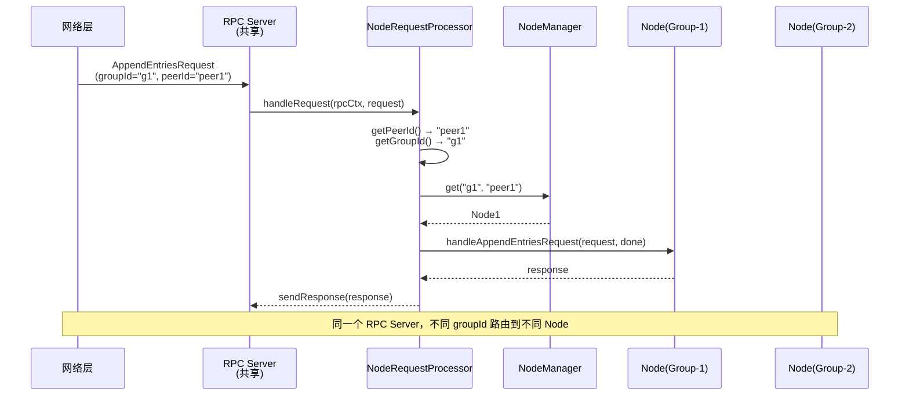
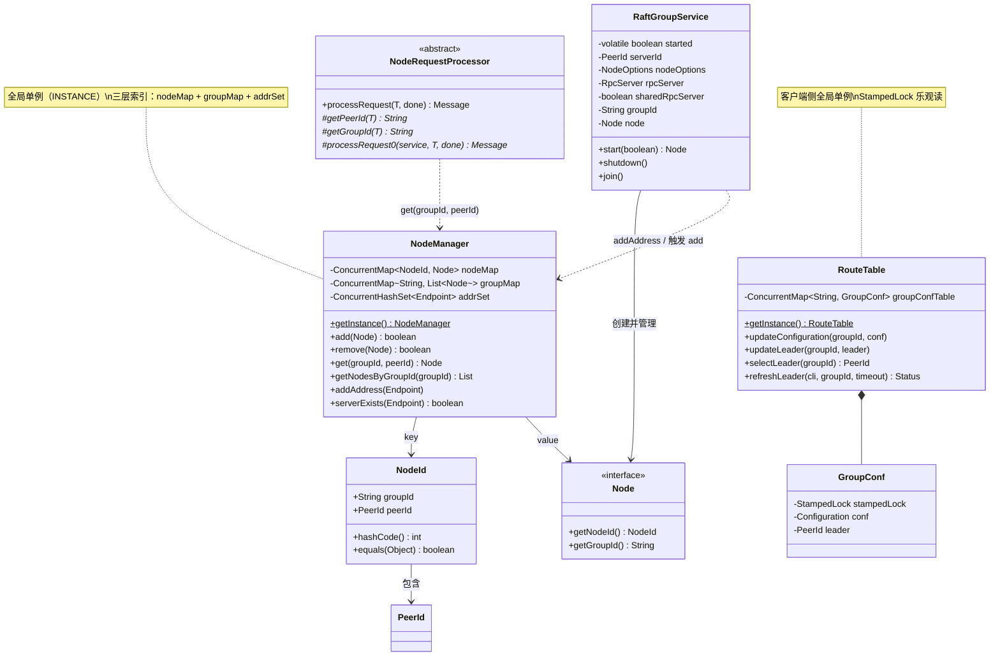

# S19：Multi-Raft Group 架构深度分析

> **核心问题**：如何在一个 JVM 进程中运行多个 Raft Group？它们之间如何隔离又如何共享资源？RPC 请求如何正确路由到目标 Group 的目标 Node？
>
> **涉及源码**：
> - `NodeManager.java`（147 行）— 全局单例节点注册表
> - `RaftGroupService.java`（256 行）— 单个 Raft Group 的生命周期管理
> - `NodeId.java`（94 行）— 节点唯一标识（groupId + peerId）
> - `RouteTable.java`（386 行）— 客户端路由表
> - `NodeRequestProcessor.java`（73 行）— RPC 请求路由分发
> - `DefaultRaftTimerFactory.java`（243 行）— 共享定时器机制
> - `AtomicServer.java`（124 行）— Multi-Raft Group 使用示例
> - `StoreEngine.java`（RheaKV）— 生产级 Multi-Raft 实现
>
> **定位**：S1-S18 聚焦单个 Raft Group 内部机制，本篇分析**多个 Raft Group 并存时的架构设计**。

---

## 目录

1. [解决什么问题](#1-解决什么问题)
2. [核心数据结构](#2-核心数据结构)
3. [RaftGroupService — 单 Group 生命周期管理](#3-raftgroupservice--单-group-生命周期管理)
4. [NodeManager — 全局节点注册表](#4-nodemanager--全局节点注册表)
5. [RPC 请求路由 — 从网络包到正确的 Node](#5-rpc-请求路由--从网络包到正确的-node)
6. [资源共享机制 — 减少线程膨胀](#6-资源共享机制--减少线程膨胀)
7. [RouteTable — 客户端路由](#7-routetable--客户端路由)
8. [真实使用案例分析](#8-真实使用案例分析)
9. [数据结构关系图](#9-数据结构关系图)
10. [核心不变式](#10-核心不变式)
11. [面试高频考点 📌](#11-面试高频考点-)
12. [生产踩坑 ⚠️](#12-生产踩坑-️)

---

## 1. 解决什么问题

### 1.1 单 Raft Group 的局限

一个 Raft Group 的所有写操作都由单一 Leader 串行处理。当数据量或写入吞吐量超过单机极限时：

| 瓶颈 | 表现 | 根因 |
|------|------|------|
| **写吞吐量** | 所有写请求走同一个 Leader | Raft 日志串行复制 |
| **数据容量** | 单机磁盘不够存 | 整个数据集在每个节点上都有完整副本 |
| **Leader 热点** | Leader 节点 CPU/网络打满 | 所有客户端请求都发往 Leader |

### 1.2 Multi-Raft Group 的解决思路

```
单 Raft Group:
  所有数据 → 1个Leader → 瓶颈

Multi-Raft Group:
  数据分片1 → Group1(Leader1) ─┐
  数据分片2 → Group2(Leader2) ─┤ 同一个进程
  数据分片3 → Group3(Leader3) ─┘
```

**核心思想**：将数据按某种规则（如 key range / hash）分成多个分片，每个分片独立运行一个 Raft Group。多个 Group 可以部署在同一个进程中，**共享网络端口、线程池、定时器**，但逻辑上完全独立。

### 1.3 Multi-Raft 带来的新问题

| 问题 | 需要什么 |
|------|---------|
| 同一个 IP:Port 收到的 RPC 请求，怎么分发给正确的 Group？ | 请求中携带 `groupId`，服务端按 `groupId + peerId` 路由 |
| 如何标识"进程 A 上的 Group-1 的 Node"？ | `NodeId = (groupId, peerId)`，全局唯一 |
| 多个 Group 各自创建定时器线程、RPC 线程，线程数爆炸怎么办？ | 共享 RPC Server、共享定时器池、共享线程池 |
| 客户端怎么知道 key 对应哪个 Group 的 Leader 在哪？ | 客户端维护 `RouteTable`（`Map<groupId, (conf, leader)>`） |
| 一个 Group shutdown 时，不能影响其他 Group | `sharedRpcServer` 标记，关闭 Group 时不关闭共享的 RPC Server |

---

## 2. 核心数据结构

### 2.1 数据结构清单

| 结构名 | 源码位置 | 核心作用 |
|--------|----------|----------|
| `NodeId` | `entity/NodeId.java` | 节点唯一标识：`(groupId, peerId)` |
| `NodeManager` | `NodeManager.java` | 全局单例，管理所有 Node 的注册/查询/删除 |
| `RaftGroupService` | `RaftGroupService.java` | 单个 Raft Group 的启动/停机封装 |
| `RouteTable` | `RouteTable.java` | 客户端侧路由表，缓存每个 Group 的 conf 和 leader |
| `NodeRequestProcessor` | `rpc/impl/core/NodeRequestProcessor.java` | RPC 请求路由的关键模板方法 |

### 2.2 NodeId — 节点唯一标识

**源码位置**：`entity/NodeId.java:28-94`

#### 问题推导

**问题**：在 Multi-Raft 场景下，同一个 JVM 中有多个 Node，如何唯一标识一个 Node？

**需要什么信息？**
- `peerId`（`IP:Port`）不够，因为同一个 `IP:Port` 上可能运行多个 Group 的 Node
- 需要 `groupId` + `peerId` 联合才能唯一标识

**推导出的结构**：一个 `(groupId, peerId)` 的组合 key

#### 真实数据结构

```java
// entity/NodeId.java 第 28-41 行
public final class NodeId implements Serializable {
    private final String groupId;    // Raft 组 ID（如 "counter-1", "counter-2"）
    private final PeerId peerId;     // 节点的网络地址（如 "192.168.1.1:8081"）
    private String       str;        // 缓存的 toString 结果：<groupId/peerId>
}
```

**设计决策**：
- **为什么是 `final`？** `NodeId` 是 immutable 的——创建后 `groupId` 和 `peerId` 不可改。这样它可以安全地作为 `ConcurrentHashMap` 的 key。
- **为什么实现 `hashCode/equals`？** `NodeManager` 用 `ConcurrentMap<NodeId, Node>` 存储，必须正确实现 `hashCode/equals`。

### 2.3 NodeManager — 全局节点注册表

**源码位置**：`NodeManager.java:32-147`

#### 问题推导

**问题**：RPC 请求到达服务端后，如何找到请求对应的 Node 实例？

**需要什么信息？**
- 需要一个全局的"电话簿"，用 `(groupId, peerId)` → `Node` 的映射
- 还需要按 `groupId` 批量查询（获取某个 Group 的所有 Node）
- 还需要按 `Endpoint` 判断 RPC Server 是否已注册

**推导出的结构**：三层索引
- `Map<NodeId, Node>` — 精确查找
- `Map<String, List<Node>>` — 按 groupId 查找
- `Set<Endpoint>` — RPC 地址注册表

#### 真实数据结构

```java
// NodeManager.java 第 33-37 行
public class NodeManager {
    private static final NodeManager                INSTANCE = new NodeManager();  // ★ 全局单例

    private final ConcurrentMap<NodeId, Node>       nodeMap  = new ConcurrentHashMap<>();  // NodeId → Node
    private final ConcurrentMap<String, List<Node>> groupMap = new ConcurrentHashMap<>();  // groupId → [Node1, Node2, ...]
    private final ConcurrentHashSet<Endpoint>       addrSet  = new ConcurrentHashSet<>();  // 已注册的 RPC 地址
}
```

**三个索引的用途**：

| 索引 | 数据结构 | 查询场景 | 调用者 |
|------|---------|---------|--------|
| `nodeMap` | `ConcurrentMap<NodeId, Node>` | 根据 `(groupId, peerId)` 精确查找一个 Node | `NodeRequestProcessor.processRequest()` |
| `groupMap` | `ConcurrentMap<String, List<Node>>` | 根据 `groupId` 查找所有 Node（如 `GetLeaderRequestProcessor`） | CLI 请求处理 |
| `addrSet` | `ConcurrentHashSet<Endpoint>` | 判断某个 `Endpoint` 是否已注册 RPC Server | `NodeManager.add()` 前置检查 |

**设计决策**：
- **为什么 `groupMap` 的 value 是 `Collections.synchronizedList(new ArrayList<>())`？** 同一个 `groupId` 下可能有多个 Node（同一个进程部署了同一 Group 的多个副本，虽然不常见），需要线程安全的 List。
- **为什么是全局单例？** 所有 RPC 处理器共享同一个 `NodeManager` 实例，确保请求路由的全局一致性。

### 2.4 RaftGroupService — 单 Group 生命周期管理

**源码位置**：`RaftGroupService.java:39-256`

#### 问题推导

**问题**：如何优雅地管理一个 Raft Group 的启动、运行和停机？特别是在多 Group 共享 RPC Server 时？

**推导**：
- 需要封装 Node 的创建（`RaftServiceFactory.createAndInitRaftNode`）
- 需要管理 RPC Server 的启动（但如果是共享的 RPC Server，不能由单个 Group 去启动/停止）
- 需要向 `NodeManager` 注册/注销地址

#### 真实数据结构

```java
// RaftGroupService.java 第 42-70 行
public class RaftGroupService {
    private volatile boolean    started = false;       // 是否已启动
    private PeerId              serverId;              // 本节点的 PeerId
    private NodeOptions         nodeOptions;           // Node 配置
    private RpcServer           rpcServer;             // RPC 服务器（可能共享）
    private final boolean       sharedRpcServer;       // ★ 是否共享 RPC Server
    private String              groupId;               // Raft Group ID
    private Node                node;                  // 创建的 Node 实例
}
```

**`sharedRpcServer` 的关键作用**：

| `sharedRpcServer` | `shutdown()` 时的行为 | 使用场景 |
|-------------------|-----------------------|---------|
| `false`（默认） | 关闭 `rpcServer` + 关闭 `node` | 单 Raft Group 独占 RPC Server |
| `true` | **不关闭** `rpcServer`，只关闭 `node` | 多 Raft Group 共享 RPC Server |

---

## 3. RaftGroupService — 单 Group 生命周期管理

### 3.1 构造函数（三种重载）

**源码位置**：`RaftGroupService.java:72-97`

```java
// 重载 1：自动创建 RPC Server（独占模式）
public RaftGroupService(String groupId, PeerId serverId, NodeOptions nodeOptions) {
    this(groupId, serverId, nodeOptions,
        RaftRpcServerFactory.createRaftRpcServer(serverId.getEndpoint(),
            JRaftUtils.createExecutor("RAFT-RPC-executor-", nodeOptions.getRaftRpcThreadPoolSize()),
            JRaftUtils.createExecutor("CLI-RPC-executor-", nodeOptions.getCliRpcThreadPoolSize())));
    // ★ 默认 sharedRpcServer = false
}

// 重载 2：传入外部 RPC Server，默认非共享
public RaftGroupService(String groupId, PeerId serverId, NodeOptions nodeOptions, RpcServer rpcServer) {
    this(groupId, serverId, nodeOptions, rpcServer, false);
}

// 重载 3：完整参数，指定是否共享
public RaftGroupService(String groupId, PeerId serverId, NodeOptions nodeOptions,
                        RpcServer rpcServer, boolean sharedRpcServer) {
    this.groupId = groupId;
    this.serverId = serverId;
    this.nodeOptions = nodeOptions;
    this.rpcServer = rpcServer;
    this.sharedRpcServer = sharedRpcServer;
}
```

**设计决策**：为什么要三种构造函数？
- **重载 1**：单 Group 最简用法，什么都不需要自己管
- **重载 2**：多 Group 共享同一个 RPC Server，但第一个 Group 创建 Server
- **重载 3**：完全控制，明确告知是否共享（关键参数 `sharedRpcServer`）

### 3.2 start() — 启动流程

**源码位置**：`RaftGroupService.java:109-140`

```java
// RaftGroupService.java 第 109-140 行
public synchronized Node start(final boolean startRpcServer) {
    if (this.started) {
        return this.node;                          // ① 幂等：重复启动直接返回
    }
    // ② 参数校验
    if (this.serverId == null || this.serverId.getEndpoint() == null
        || this.serverId.getEndpoint().equals(new Endpoint(Utils.IP_ANY, 0))) {
        throw new IllegalArgumentException("Blank serverId:" + this.serverId);
    }
    if (StringUtils.isBlank(this.groupId)) {
        throw new IllegalArgumentException("Blank group id:" + this.groupId);
    }

    // ③ ★ 向 NodeManager 注册 RPC 地址
    NodeManager.getInstance().addAddress(this.serverId.getEndpoint());

    // ④ ★ 创建并初始化 Node（内部会注册到 NodeManager.nodeMap）
    this.node = RaftServiceFactory.createAndInitRaftNode(this.groupId, this.serverId, this.nodeOptions);

    // ⑤ 启动 RPC Server（可选）
    if (startRpcServer) {
        this.rpcServer.init(null);
    } else if (rpcServer == null || !rpcServer.isStarted()) {
        LOG.warn("RPC server is not started in RaftGroupService.");
    }

    this.started = true;
    return this.node;
}
```

**关键时序**：`addAddress` 必须在 `createAndInitRaftNode` **之前**。因为 `NodeImpl.init()` 内部会调用 `NodeManager.getInstance().add(this)`，而 `add()` 内部会检查 `serverExists(endpoint)`——如果地址没注册，`add()` 返回 `false`，Node 启动失败。

### 3.3 shutdown() — 停机流程

**源码位置**：`RaftGroupService.java:153-169`

```java
// RaftGroupService.java 第 153-169 行
public synchronized void shutdown() {
    if (!this.started) {
        return;                                    // ① 幂等
    }
    if (this.rpcServer != null) {
        try {
            if (!this.sharedRpcServer) {           // ② ★ 只有非共享才关闭 RPC Server
                this.rpcServer.shutdown();
            }
        } catch (final Exception ignored) {
        }
        this.rpcServer = null;
    }
    this.node.shutdown();                          // ③ 关闭 Node（触发各组件 shutdown 链）
    NodeManager.getInstance().removeAddress(this.serverId.getEndpoint());  // ④ 注销 RPC 地址
    this.started = false;
}
```

**分支穷举清单**：
- □ `!started` → 直接 return（幂等）
- □ `rpcServer != null && !sharedRpcServer` → 关闭 RPC Server
- □ `rpcServer != null && sharedRpcServer` → **不关闭** RPC Server（只置 null）
- □ `rpcServer == null` → 跳过
- □ 最终：`node.shutdown()` + `removeAddress()`

**⚠️ 注意**：`removeAddress()` 在 `shutdown()` 中被调用，但如果同一个 `Endpoint` 上还有其他 Group 在运行，这会导致新的 `NodeManager.add()` 失败！这是一个**已知的设计缺陷**——`addrSet` 是按 `Endpoint` 粒度管理的，不是按 `(Endpoint, groupId)` 粒度。实际使用中，要么所有 Group 一起 shutdown，要么使用 RheaKV 的 `StoreEngine` 统一管理。

---

## 4. NodeManager — 全局节点注册表

### 4.1 add() — 注册节点

**源码位置**：`NodeManager.java:68-84`

```java
// NodeManager.java 第 68-84 行
public boolean add(final Node node) {
    // ① 前置检查：RPC Server 地址必须已注册
    if (!serverExists(node.getNodeId().getPeerId().getEndpoint())) {
        return false;
    }
    final NodeId nodeId = node.getNodeId();

    // ② 原子注册到 nodeMap
    if (this.nodeMap.putIfAbsent(nodeId, node) == null) {
        // ③ 同时注册到 groupMap
        final String groupId = node.getGroupId();
        List<Node> nodes = this.groupMap.get(groupId);
        if (nodes == null) {
            nodes = Collections.synchronizedList(new ArrayList<>());
            List<Node> existsNode = this.groupMap.putIfAbsent(groupId, nodes);
            if (existsNode != null) {
                nodes = existsNode;    // 并发创建时使用已有的 List
            }
        }
        nodes.add(node);
        return true;
    }
    return false;                      // ④ NodeId 重复 → 注册失败
}
```

**分支穷举清单**：
- □ `!serverExists(endpoint)` → return false（RPC Server 未注册）
- □ `nodeMap.putIfAbsent(nodeId, node) != null` → return false（NodeId 已存在）
- □ `groupMap.get(groupId) == null` → 创建新 List，`putIfAbsent` 防并发
- □ `groupMap.putIfAbsent` 已有值 → 使用已有 List
- □ 正常 → `nodes.add(node)`, return true

### 4.2 get() — 精确查找

```java
// NodeManager.java 第 107-109 行
public Node get(final String groupId, final PeerId peerId) {
    return this.nodeMap.get(new NodeId(groupId, peerId));
}
```

这个方法是 **RPC 请求路由的核心**——所有 `NodeRequestProcessor` 都通过它查找目标 Node。

### 4.3 remove() — 注销节点

```java
// NodeManager.java 第 97-103 行
public boolean remove(final Node node) {
    if (this.nodeMap.remove(node.getNodeId(), node)) {
        final List<Node> nodes = this.groupMap.get(node.getGroupId());
        if (nodes != null) {
            return nodes.remove(node);
        }
    }
    return false;
}
```

**`remove(key, value)` 的使用**：`ConcurrentMap.remove(key, value)` 是 CAS 语义——只有当 key 对应的 value 等于传入的 value 时才删除。防止并发场景下删除了新注册的同名 Node。

---

## 5. RPC 请求路由 — 从网络包到正确的 Node

### 5.1 问题推导

**问题**：多个 Raft Group 共享同一个 RPC Server（同一个 IP:Port）。当一个 `AppendEntriesRequest` 到达时，如何知道它是发给哪个 Group 的哪个 Node 的？

**答案**：每个 RPC 请求都携带了 `groupId` 和 `peerId`（目标节点的 peerId）。服务端通过 `NodeManager.get(groupId, peerId)` 查找对应的 `Node` 实例。

### 5.2 NodeRequestProcessor — 三层模板方法中的关键层

**源码位置**：`rpc/impl/core/NodeRequestProcessor.java:39-73`

```java
// NodeRequestProcessor.java 第 39-73 行
public abstract class NodeRequestProcessor<T extends Message> extends RpcRequestProcessor<T> {

    // ★ 子类必须实现：从请求中提取 peerId 和 groupId
    protected abstract String getPeerId(final T request);
    protected abstract String getGroupId(final T request);

    @Override
    public Message processRequest(final T request, final RpcRequestClosure done) {
        final PeerId peer = new PeerId();
        final String peerIdStr = getPeerId(request);

        if (peer.parse(peerIdStr)) {
            final String groupId = getGroupId(request);
            // ★ 核心：通过 NodeManager 查找目标 Node
            final Node node = NodeManager.getInstance().get(groupId, peer);
            if (node != null) {
                return processRequest0((RaftServerService) node, request, done);
            } else {
                // ★ Node 未找到 → 返回 ENOENT
                return RpcFactoryHelper.responseFactory()
                    .newResponse(defaultResp(), RaftError.ENOENT,
                        "Peer id not found: %s, group: %s", peerIdStr, groupId);
            }
        } else {
            return RpcFactoryHelper.responseFactory()
                .newResponse(defaultResp(), RaftError.EINVAL,
                    "Fail to parse peerId: %s", peerIdStr);
        }
    }
}
```

**三层模板方法的设计**：

```
第 1 层：RpcRequestProcessor.handleRequest()
  └── try-catch Throwable（保证 RPC 不挂）
      └── 调用 processRequest()

第 2 层：NodeRequestProcessor.processRequest()
  └── 解析 peerId → NodeManager.get(groupId, peer) → 找到 Node
      └── 调用 processRequest0()

第 3 层：具体 Processor（如 AppendEntriesRequestProcessor）.processRequest0()
  └── 调用 node.handleXxxRequest()
```

### 5.3 AppendEntries 的特殊处理 — PeerExecutorSelector

`AppendEntriesRequestProcessor` 不仅路由请求到正确的 Node，还为每个 `(groupId, peerPair)` 分配**专属的单线程 Executor**，保证同一个 Peer 对的 AppendEntries 请求按序处理。

```java
// AppendEntriesRequestProcessor.java 第 63-95 行（精简）
final class PeerExecutorSelector implements RpcProcessor.ExecutorSelector {
    @Override
    public Executor select(final String reqClass, final Object reqHeader) {
        final AppendEntriesRequestHeader header = (AppendEntriesRequestHeader) reqHeader;
        final String groupId = header.getGroupId();
        final String peerId = header.getPeerId();
        final String serverId = header.getServerId();

        final PeerId peer = new PeerId();
        if (!peer.parse(peerId)) {
            return executor();                     // 解析失败 → 默认线程池
        }

        final Node node = NodeManager.getInstance().get(groupId, peer);
        if (node == null || !node.getRaftOptions().isReplicatorPipeline()) {
            return executor();                     // Node 不存在或未启用 Pipeline → 默认线程池
        }

        // ★ Pipeline 模式：为每个 (groupId, peerPair) 创建专属单线程 Executor
        final PeerRequestContext ctx = getOrCreatePeerRequestContext(groupId, pairOf(peerId, serverId), null);
        return ctx.executor;
    }
}
```

**为什么需要专属线程？** Pipeline 模式下，同一个 Peer 对的 AppendEntries 请求必须按**发送顺序**处理，否则 seq 会乱序。用专属单线程 Executor 保证了 FIFO 顺序。

### 5.4 请求路由完整流程图



---

## 6. 资源共享机制 — 减少线程膨胀

### 6.1 问题推导

**问题**：如果一个进程运行 100 个 Raft Group，每个 Group 独立创建定时器（4 个 × 每个 1 线程 = 4 线程）+ 调度器（N 线程），仅定时器就需要 400+ 线程。加上 RPC 线程池、Disruptor 线程……线程数爆炸。

**解决**：JRaft 提供了**三层共享机制**：

| 层级 | 共享什么 | 控制方式 | 效果 |
|------|---------|---------|------|
| **RPC Server** | 网络端口 + 请求分发 | `sharedRpcServer = true` | 所有 Group 共用一个端口 |
| **定时器池** | 选举/投票/StepDown/快照定时器 | `NodeOptions.sharedXxxTimer = true` | 从 N×4 线程 → 4 个共享池 |
| **调度器** | `ScheduledExecutorService` | `NodeOptions.sharedTimerPool = true` | 统一调度池 |

### 6.2 RPC Server 共享

**使用模式**（来自 `AtomicServer.java`）：

```java
// AtomicServer.java 第 81-83 行
// ★ 先创建一个共享的 RPC Server
RpcServer rpcServer = RaftRpcServerFactory.createRaftRpcServer(serverId.getEndpoint());
// 注册业务处理器
rpcServer.registerProcessor(new GetCommandProcessor(this));
rpcServer.registerProcessor(new SetCommandProcessor(this));

// ★ 多个 Group 共享同一个 rpcServer
for (int i = 0; i < totalSlots; i++) {
    // 每个 Group 传入同一个 rpcServer
    new AtomicRangeGroup(dataPath, groupId, serverId, min, max, nodeOptions, rpcServer);
    // AtomicRangeGroup 内部：new RaftGroupService(groupId, serverId, nodeOptions, rpcServer)
}
```

**关键点**：`RaftRpcServerFactory.createRaftRpcServer()` 会自动注册所有 Raft 内部处理器（`AppendEntriesRequestProcessor`、`RequestVoteRequestProcessor` 等）。用户只需要额外注册业务处理器。

### 6.3 定时器共享

**5 类全局共享定时器**（`DefaultRaftTimerFactory.java:46-70`）：

| 定时器 | 静态实例 | 默认 Worker 数 | 对应 NodeOptions 开关 |
|--------|---------|---------------|---------------------|
| 选举定时器 | `ELECTION_TIMER_REF` | `cpus` | `sharedElectionTimer` |
| 投票定时器 | `VOTE_TIMER_REF` | `cpus` | `sharedVoteTimer` |
| StepDown 定时器 | `STEP_DOWN_TIMER_REF` | `cpus` | `sharedStepDownTimer` |
| 快照定时器 | `SNAPSHOT_TIMER_REF` | `cpus` | `sharedSnapshotTimer` |
| 调度器 | `SCHEDULER_REF` | `min(cpus*3, 20)` | `sharedTimerPool` |

**共享 vs 独占的底层实现差异**：

| | 共享模式（`shared=true`） | 独占模式（`shared=false`） |
|---|---|---|
| **底层实现** | `DefaultTimer`（`ScheduledExecutorService`） | `HashedWheelTimer` |
| **线程数** | `cpus` 个线程（共享） | 1 个 Worker 线程（独占） |
| **引用计数** | 有（`SharedRef`，最后一个 Group stop 时才真正关闭） | 无 |
| **适用场景** | 同 JVM 多 Raft Group | 单 Raft Group 或需要隔离 |

**引用计数机制**（`SharedRef`）：

```
Group-1 调用 getRef() → refCount = 1
Group-2 调用 getRef() → refCount = 2
Group-1 shutdown → timer.stop() → refCount = 1（不真正关闭）
Group-2 shutdown → timer.stop() → refCount = 0（真正关闭底层 DefaultTimer）
```

### 6.4 线程数对比

| 资源 | 100 个 Group（独占模式） | 100 个 Group（共享模式） |
|------|----------------------|----------------------|
| 选举定时器线程 | 100 | `cpus`（如 8） |
| 投票定时器线程 | 100 | `cpus` |
| StepDown 定时器线程 | 100 | `cpus` |
| 快照定时器线程 | 100 | `cpus` |
| 调度器线程 | 100 × N | `min(cpus*3, 20)` |
| **总计（仅定时器）** | **400+ 线程** | **~36 线程** |

---

## 7. RouteTable — 客户端路由

### 7.1 问题推导

**问题**：客户端要向 Group-1 发送请求，需要知道 Group-1 的 Leader 地址。在 Multi-Raft 场景下，如何管理每个 Group 的路由信息？

**推导**：需要一个 `Map<groupId, (conf, leader)>` 的路由表，支持：
- 更新 Group 的配置（`updateConfiguration`）
- 更新/查询 Group 的 Leader（`updateLeader` / `selectLeader`）
- 从集群刷新 Leader 信息（`refreshLeader`）

### 7.2 真实数据结构

**源码位置**：`RouteTable.java:48-386`

```java
// RouteTable.java 第 48-52 行
public class RouteTable implements Describer {
    private static final RouteTable                INSTANCE       = new RouteTable();  // ★ 全局单例
    private final ConcurrentMap<String, GroupConf> groupConfTable = new ConcurrentHashMap<>();
}

// 内部类：每个 Group 的路由信息
private static class GroupConf {
    private final StampedLock stampedLock = new StampedLock();  // ★ 乐观读锁
    private Configuration     conf;                             // 集群成员列表
    private PeerId            leader;                           // 当前 Leader
}
```

**为什么用 `StampedLock`？** 客户端的读操作（`selectLeader`、`getConfiguration`）远多于写操作（`updateLeader`、`updateConfiguration`）。`StampedLock` 的乐观读（`tryOptimisticRead`）在无竞争时零开销，比 `ReentrantReadWriteLock` 更高效。

### 7.3 核心方法

#### selectLeader() — 查询 Leader（乐观读）

```java
// RouteTable.java 第 90-106 行
public PeerId selectLeader(final String groupId) {
    final GroupConf gc = this.groupConfTable.get(groupId);
    if (gc == null) { return null; }

    final StampedLock stampedLock = gc.stampedLock;
    long stamp = stampedLock.tryOptimisticRead();    // ★ 乐观读：不加锁
    PeerId leader = gc.leader;
    if (!stampedLock.validate(stamp)) {              // 检查是否被写入者修改
        stamp = stampedLock.readLock();              // 降级为悲观读锁
        try {
            leader = gc.leader;
        } finally {
            stampedLock.unlockRead(stamp);
        }
    }
    return leader;
}
```

#### refreshLeader() — 从集群刷新 Leader 信息

```java
// RouteTable.java 第 151-200 行（精简）
public Status refreshLeader(final CliClientService cliClientService, final String groupId, final int timeoutMs)
    throws InterruptedException, TimeoutException {

    final Configuration conf = getConfiguration(groupId);
    // ★ 遍历 conf 中所有节点，逐一发送 GetLeaderRequest
    for (final PeerId peer : conf) {
        // 建连 + 发送 GetLeaderRequest
        final Future<Message> result = cliClientService.getLeader(peer.getEndpoint(), request, null);
        final Message msg = result.get(timeoutMs, TimeUnit.MILLISECONDS);
        if (msg instanceof CliRequests.GetLeaderResponse) {
            // ★ 找到 Leader → 更新缓存
            updateLeader(groupId, response.getLeaderId());
            return Status.OK();
        }
    }
    return st;  // 所有节点都未返回 Leader
}
```

**设计模式**：`refreshLeader()` 采用"逐一探测"策略——遍历 conf 中所有节点，向每个节点发送 `GetLeaderRequest`，第一个返回有效 Leader 的就更新缓存。如果所有节点都失败，返回错误状态。

---

## 8. 真实使用案例分析

### 8.1 AtomicServer — 简单示例

**源码位置**：`jraft-test/.../AtomicServer.java`

**架构**：

```
AtomicServer
├── RpcServer（共享，1 个端口）
├── AtomicRangeGroup[0]（groupId="atomic_0", 负责 slot 0~999）
│   └── RaftGroupService → NodeImpl → AtomicStateMachine
├── AtomicRangeGroup[1]（groupId="atomic_1", 负责 slot 1000~1999）
│   └── RaftGroupService → NodeImpl → AtomicStateMachine
└── AtomicRangeGroup[N]（groupId="atomic_N", 负责 slot N*1000~(N+1)*1000）
    └── RaftGroupService → NodeImpl → AtomicStateMachine
```

**关键代码模式**：

```java
// 1. 创建共享 RPC Server
RpcServer rpcServer = RaftRpcServerFactory.createRaftRpcServer(serverId.getEndpoint());
// 2. 注册业务处理器
rpcServer.registerProcessor(new GetCommandProcessor(this));

// 3. 循环创建多个 Group
for (int i = 0; i < totalSlots; i++) {
    String nodeGroup = conf.getGroupId() + "_" + i;
    // 每个 Group 独立的 dataPath、groupId，共享 rpcServer
    AtomicRangeGroup.start(nodeConf, rpcServer);
}
```

**注意**：这个示例中 `RaftGroupService` 构造函数使用的是**重载 2**（`sharedRpcServer = false`），但传入了共享的 `rpcServer`。这意味着**第一个 shutdown 的 Group 会关闭 RPC Server，影响其他 Group**。这是示例代码的简化处理，生产环境应使用 `sharedRpcServer = true`。

### 8.2 RheaKV StoreEngine — 生产级实现

**源码位置**：`jraft-rheakv/rheakv-core/.../StoreEngine.java`

**架构**：

```
StoreEngine
├── RpcServer（共享）
├── BatchRawKVStore（共享 RocksDB 存储）
├── HeartbeatSender（统一心跳）
├── RegionEngine[region-1]
│   ├── RaftGroupService（sharedRpcServer=true）
│   ├── KVStoreStateMachine
│   └── RaftRawKVStore → MetricsRawKVStore
├── RegionEngine[region-2]
│   ├── RaftGroupService（sharedRpcServer=true）
│   └── ...
└── RegionEngine[region-N]
```

**RheaKV 的额外共享层**：

| 共享资源 | 说明 |
|---------|------|
| `BatchRawKVStore` | 所有 Region 共用同一个 RocksDB 实例 |
| `readIndexExecutor` | ReadIndex 请求线程池共享 |
| `raftStateTrigger` | 状态触发线程池共享 |
| `snapshotExecutor` | 快照线程池共享 |
| RPC 线程池 | `useSharedRpcExecutor` 控制 |
| `HeartbeatSender` | 统一向 PD 发送心跳 |

---

## 9. 数据结构关系图



---

## 10. 核心不变式

| # | 不变式 | 保证机制 |
|---|--------|---------|
| 1 | **同一 JVM 中 `NodeId` 全局唯一** | `NodeManager.add()` 使用 `putIfAbsent`，重复则返回 false |
| 2 | **Node 注册前 Endpoint 必须已注册** | `NodeManager.add()` 先检查 `serverExists(endpoint)` |
| 3 | **`nodeMap` 和 `groupMap` 双索引一致** | `add()` 和 `remove()` 在同一方法中维护两个 Map |
| 4 | **共享 RPC Server 不被单个 Group 关闭** | `RaftGroupService.shutdown()` 检查 `sharedRpcServer` |
| 5 | **RPC 请求必能路由到正确 Node（或返回错误）** | `NodeRequestProcessor.processRequest()` 先解析 `groupId + peerId`，再从 `NodeManager` 查找 |
| 6 | **共享定时器的引用计数保证最后才关闭** | `SharedRef.mayShutdown()` 检查引用计数是否为 0 |
| 7 | **RouteTable 的读操作无锁/轻量** | `StampedLock.tryOptimisticRead()` 乐观读 |

---

## 11. 面试高频考点 📌

### Q1：Multi-Raft Group 的核心设计思想是什么？

将数据按规则分片，每个分片独立运行一个 Raft Group。多个 Group 在同一个进程中共享网络端口、定时器池和线程池，逻辑上完全独立。核心是**分片提升并行度 + 共享降低资源开销**。

### Q2：同一个 IP:Port 上的多个 Group 如何区分请求？

每个 RPC 请求都携带 `groupId` 和 `peerId`。服务端的 `NodeRequestProcessor` 从请求中提取这两个字段，通过 `NodeManager.get(groupId, peerId)` 查找对应的 `Node` 实例，再调用 `processRequest0()` 处理。

### Q3：`NodeId` 和 `PeerId` 有什么区别？

- `PeerId`：标识一个网络节点（`IP:Port:Priority`），同一个 `PeerId` 上可能运行多个 Group
- `NodeId`：标识一个具体的 Raft Node（`groupId + PeerId`），全局唯一

### Q4：多 Group 共享 RPC Server 时，shutdown 需要注意什么？

必须设置 `sharedRpcServer = true`，否则第一个 shutdown 的 Group 会关闭共享的 RPC Server，导致其他 Group 的 RPC 通信中断。此外，`NodeManager.removeAddress()` 是按 `Endpoint` 粒度的，如果不小心在其他 Group 还在运行时调用了 `removeAddress`，会导致新的 `NodeManager.add()` 失败。

### Q5：JRaft 的定时器共享模式和独占模式有什么区别？

- **独占模式**（默认）：每个 Group 创建独立的 `HashedWheelTimer`（单 Worker 线程），适合单 Group 场景
- **共享模式**：所有 Group 共享全局的 `DefaultTimer`（`ScheduledExecutorService`，多线程），通过引用计数管理生命周期，适合多 Group 场景（如 100 个 Group 只需 ~36 线程而非 400+）

### Q6：RouteTable 为什么使用 StampedLock？

`RouteTable` 的读操作（`selectLeader`、`getConfiguration`）远多于写操作（`updateLeader`、`updateConfiguration`）。`StampedLock` 的乐观读（`tryOptimisticRead()`）在无竞争时**零开销**（不获取任何锁），只在检测到并发写时才降级为悲观读锁。比 `ReentrantReadWriteLock` 更适合读多写少场景。

### Q7：RheaKV 的 Multi-Raft 和 AtomicServer 示例的关键区别是什么？

| 维度 | AtomicServer 示例 | RheaKV StoreEngine |
|------|-------------------|-------------------|
| 存储引擎 | 每个 Group 独立状态机 | 所有 Group 共享同一个 RocksDB |
| RPC 共享 | 传入共享 RPC Server | `sharedRpcServer=true` |
| 定时器共享 | 未配置 | 可配置 `sharedTimerPool` |
| 线程池 | 各 Group 独立 | `useSharedRpcExecutor` 共享 |
| 元数据管理 | 无 | PD（PlacementDriver）统一管理 |
| Region 分裂 | 无 | 支持自动分裂 |

---

## 12. 生产踩坑 ⚠️

### 踩坑 1：shutdown 时 removeAddress 导致其他 Group 注册失败

**现象**：滚动升级时，先停掉一个 Group，结果新启动的 Group 注册失败。

**原因**：`RaftGroupService.shutdown()` 调用了 `NodeManager.removeAddress(endpoint)`。如果同一个 Endpoint 上还有其他 Group 在运行，后续新 Group 调用 `NodeManager.add()` 时 `serverExists()` 返回 false，注册失败。

**解决**：使用 `StoreEngine`（RheaKV）统一管理所有 Group 的生命周期，或者自行管理 `addAddress/removeAddress` 的调用时机，确保只在最后一个 Group 停止时才 `removeAddress`。

### 踩坑 2：独占定时器模式下 HashedWheelTimer 实例过多

**现象**：日志中出现 `You are creating too many HashedWheelTimer instances`。

**原因**：每个 Group 独占模式下创建 4 个 `HashedWheelTimer`（选举/投票/StepDown/快照）。超过 64 个 Group 就会触发 256 实例告警。

**解决**：设置 `NodeOptions.sharedElectionTimer = true` / `sharedVoteTimer = true` / `sharedStepDownTimer = true` / `sharedSnapshotTimer = true`，使用共享定时器。

### 踩坑 3：共享定时器被意外关闭

**现象**：一个 Group 停机后，其他 Group 的定时任务不再触发。

**原因**：`RepeatedTimer.destroy()` 中调用了 `timer.stop()`。如果 `SharedRef` 的引用计数管理有问题（如同一个 Group 的 Timer 被创建了多次），会导致引用计数提前降到 0，底层 `DefaultTimer` 被关闭。

**解决**：确保每个 Group 只获取一次共享定时器引用（`getRef()` 只调用一次），避免引用计数不平衡。

### 踩坑 4：Pipeline 模式下跨 Group 请求互相阻塞

**现象**：Group-1 的大量 AppendEntries 请求导致 Group-2 的请求处理延迟。

**原因**：虽然 Pipeline 模式为每个 `(groupId, peerPair)` 创建了独立的 `MpscSingleThreadExecutor`（每个 Peer 对一个单线程），但在进入 `PeerExecutorSelector.select()` **之前**，RPC 请求先经过共享的 RPC 入口线程池（`raftRpcThreadPoolSize` 控制）进行反序列化和初步分发。如果这个共享入口线程池被某个高负载 Group 占满，其他 Group 的请求会在入口处排队。

**解决**：合理设置 `raftRpcThreadPoolSize`（`NodeOptions`），确保入口线程池足以应对所有 Group 的并发量。或在 RheaKV 中使用 `useSharedRpcExecutor = false` 为每个 RegionEngine 分配独立 RPC 线程池。

---

## 总结

### 数据结构层面

| 结构 | 核心特征 |
|------|---------|
| `NodeId` | `(groupId, peerId)` 组合 key，immutable，作为 `ConcurrentHashMap` 的 key |
| `NodeManager` | 全局单例，三层索引（`nodeMap` / `groupMap` / `addrSet`），所有并发安全 |
| `RaftGroupService` | 单 Group 生命周期封装，`sharedRpcServer` 控制 shutdown 行为 |
| `RouteTable` | 客户端侧全局单例，`StampedLock` 乐观读，`Map<groupId, (conf, leader)>` |
| `GroupConf` | `StampedLock` 保护的 `conf + leader` 二元组 |

### 算法层面

| 算法/流程 | 核心设计决策 |
|-----------|------------|
| **RPC 路由** | 三层模板方法：`handleRequest()` → `processRequest(groupId+peerId → NodeManager.get())` → `processRequest0(node.handleXxx())` |
| **Node 注册** | `addAddress` 先于 `createAndInitRaftNode`，`putIfAbsent` 防重复 |
| **定时器共享** | 共享模式用 `DefaultTimer`（多线程），独占模式用 `HashedWheelTimer`（单线程），`SharedRef` 引用计数管理生命周期 |
| **Leader 发现** | `RouteTable.refreshLeader()` 遍历 conf 所有节点发 `GetLeaderRequest`，第一个成功即更新缓存 |
| **Pipeline 隔离** | `PeerExecutorSelector` 为每个 `(groupId, peerPair)` 分配专属单线程 Executor，保证 FIFO 序 |
