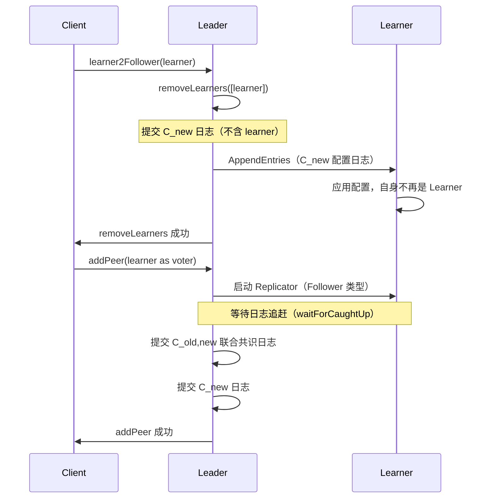
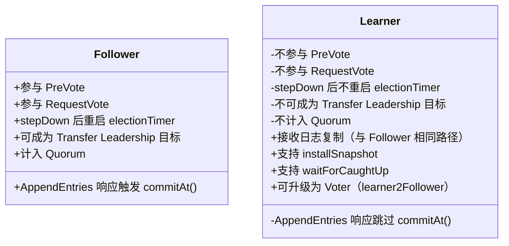

# S5：Learner 角色机制

> 归属：`09-membership-change/S5-Learner.md`  
> 核心源码：`NodeImpl.java:3142`、`ReplicatorGroupImpl.java:113`、`Replicator.java:1532`、`Configuration.java:47`

---

## 1. 问题推导

### 【问题】什么场景需要 Learner？

| 场景 | 说明 |
|---|---|
| **读扩展** | 增加只读副本，分担读压力，不影响写 Quorum |
| **异地数据同步** | 跨机房同步数据，不参与本机房的选举 |
| **新节点预热** | 新节点先以 Learner 身份追赶日志，追上后再升级为 Voter，避免影响集群可用性 |
| **观察者节点** | 监控/审计场景，只需要数据副本，不需要参与决策 |

### 【需要什么信息】

- 需要区分"参与投票的节点"和"只接收日志的节点"
- Learner 的日志复制路径与 Follower 相同（都走 Replicator），但 AppendEntries 响应不能影响 Quorum
- Learner 不参与选举（不启动 electionTimer）
- 需要支持 Learner 升级为 Voter（两步操作：先 removeLearner，再 addPeer）

### 【推导出的结构】

- `Configuration` 中增加 `LinkedHashSet<PeerId> learners` 字段（与 `peers` 分开存储）
- `ReplicatorType` 枚举区分 `Follower` 和 `Learner`
- `Replicator.onAppendEntriesReturned` 中根据 `replicatorType` 决定是否调用 `ballotBox.commitAt()`

---

## 2. 核心数据结构

### 2.1 `Configuration` 中的 Learner 存储（`Configuration.java:47`）

```java
// Configuration.java:47
private List<PeerId>          peers    = new ArrayList<>();
// use LinkedHashSet to keep insertion order.
// Configuration.java:50
private LinkedHashSet<PeerId> learners = new LinkedHashSet<>();
```

**为什么用 `LinkedHashSet`**：保持插入顺序（便于序列化后反序列化结果一致），同时去重（同一节点不能重复添加）。

**序列化格式**（`Configuration.java:259`）：
```
// toString() 输出格式：
// peers 用逗号分隔，learners 追加 /learner 后缀
"127.0.0.1:8081,127.0.0.1:8082,127.0.0.1:8083,192.168.1.1:8081/learner,192.168.1.2:8081/learner"
```

**关键约束**（`Configuration.isValid()`，`Configuration.java:159`）：
- `peers` 不为空
- `peers ∩ learners = ∅`（同一节点不能既是 Voter 又是 Learner）

### 2.2 `ReplicatorType` 枚举（`ReplicatorType.java:24`）

```java
// ReplicatorType.java:24
public enum ReplicatorType {
    Follower, Learner;  // 第 25 行

    // ReplicatorType.java:27
    public final boolean isFollower() { return this == Follower; }
    public final boolean isLearner()  { return this == Learner; }
}
```

`ReplicatorOptions` 中持有 `replicatorType` 字段，在 `ReplicatorGroupImpl.addReplicator()` 时设置（`ReplicatorGroupImpl.java:120`）。

### 2.3 `ConfigurationCtx` 中的 Learner 字段（`NodeImpl.java:350`）

```java
// NodeImpl.java:350
List<PeerId> newLearners = new ArrayList<>();  // 目标配置的 Learner 列表
// NodeImpl.java:351
List<PeerId> oldLearners = new ArrayList<>();  // 当前配置的 Learner 列表
```

`nchanges` 只统计 Voter 的变更数量（`adding.size() + removing.size()`），**Learner 变更不计入 `nchanges`**（`NodeImpl.java:389`）。

---

## 3. Learner 变更流程

### 3.1 `addLearners()` 逐行分析（`NodeImpl.java:3142`）

```java
// NodeImpl.java:3142
public void addLearners(final List<PeerId> learners, final Closure done) {
    checkPeers(learners);                                    // 前置校验：非null、非空、元素非null
    this.writeLock.lock();
    try {
        final Configuration newConf = new Configuration(this.conf.getConf());  // 复制当前配置
        for (final PeerId peer : learners) {
            newConf.addLearner(peer);                        // 逐个添加到 learners 集合
        }
        unsafeRegisterConfChange(this.conf.getConf(), newConf, done);  // 走配置变更流程
    } finally {
        this.writeLock.unlock();
    }
}
```

**分支穷举清单**：

| # | 条件 | 结果 |
|---|---|---|
| ① | `checkPeers()` 失败（null/empty/含null元素） | 抛出 `IllegalArgumentException`，不进入 writeLock |
| ② | 正常 | `writeLock.lock()` + 逐个 `addLearner()` + `unsafeRegisterConfChange()` + `finally: writeLock.unlock()` |

### 3.2 `removeLearners()` 逐行分析（`NodeImpl.java:3166`）

```java
// NodeImpl.java:3166
public void removeLearners(final List<PeerId> learners, final Closure done) {
    checkPeers(learners);
    this.writeLock.lock();
    try {
        final Configuration newConf = new Configuration(this.conf.getConf());
        for (final PeerId peer : learners) {
            newConf.removeLearner(peer);   // 从 learners 集合中移除（不存在时静默忽略）
        }
        unsafeRegisterConfChange(this.conf.getConf(), newConf, done);
    } finally {
        this.writeLock.unlock();
    }
}
```

**分支穷举清单**：

| # | 条件 | 结果 |
|---|---|---|
| ① | `checkPeers()` 失败 | 抛出 `IllegalArgumentException` |
| ② | 正常（peer 不在 learners 中） | `removeLearner()` 静默忽略（`LinkedHashSet.remove()` 返回 false），继续提交配置变更 |
| ③ | 正常（peer 在 learners 中） | 移除成功，提交配置变更 |

### 3.3 `resetLearners()` 逐行分析（`NodeImpl.java:3181`）

```java
// NodeImpl.java:3181
public void resetLearners(final List<PeerId> learners, final Closure done) {
    checkPeers(learners);
    this.writeLock.lock();
    try {
        final Configuration newConf = new Configuration(this.conf.getConf());
        newConf.setLearners(new LinkedHashSet<>(learners));  // 直接替换整个 learners 集合
        unsafeRegisterConfChange(this.conf.getConf(), newConf, done);
    } finally {
        this.writeLock.unlock();
    }
}
```

**与 `addLearners`/`removeLearners` 的区别**：`resetLearners` 是**全量替换**，不是增量操作。适合需要精确控制 Learner 列表的场景。

### 3.4 Learner 变更走 `unsafeRegisterConfChange()` 的关键路径

```
addLearners/removeLearners/resetLearners
  → unsafeRegisterConfChange(oldConf, newConf, done)
    → confCtx.start(oldConf, newConf, done)
      → nchanges = adding.size() + removing.size()  // 只统计 Voter 差集，Learner 不计入
      → addNewLearners()                             // 立即启动新 Learner 的 Replicator
      → if (adding.isEmpty()) nextStage()            // nchanges==0 时调用 nextStage()
        → STAGE_CATCHING_UP: nchanges==0，fall-through 到 STAGE_JOINT 代码块
        → STAGE_JOINT 代码块：stage=STAGE_STABLE，提交 C_new 日志（oldConf=null）
        → STAGE_STABLE：reset，完成
```

**关键设计**：Learner 变更时 `nchanges == 0`，`nextStage()` 中 `STAGE_CATCHING_UP` 的 `if (nchanges > 0)` 分支不成立，**fall-through 到 `STAGE_JOINT` 的代码块**，直接执行 `stage = STAGE_STABLE` + 提交 `C_new` 日志（`oldConf=null`，即不提交联合配置日志）。这是因为 Learner 不参与 Quorum，变更 Learner 不会影响集群安全性，无需联合共识保护。

源码（`NodeImpl.java:506`）：
```java
switch (this.stage) {
    case STAGE_CATCHING_UP:
        if (this.nchanges > 0) {          // Learner 变更时 nchanges==0，不进入此分支
            this.stage = Stage.STAGE_JOINT;
            this.node.unsafeApplyConfiguration(new Configuration(newPeers, newLearners),
                new Configuration(oldPeers), false);  // 提交 C_old,new 联合配置
            return;
        }
        // fall-through ↓（nchanges==0 时直接落入 STAGE_JOINT 代码块）
    case STAGE_JOINT:
        this.stage = Stage.STAGE_STABLE;
        this.node.unsafeApplyConfiguration(new Configuration(newPeers, newLearners),
            null, false);                 // 提交 C_new（oldConf=null，无联合配置）
        break;
    // ...
}
```

---

## 4. Learner 的日志复制路径

### 4.1 Learner Replicator 的创建（`ReplicatorGroupImpl.java:113`）

```java
// NodeImpl.java:419（ConfigurationCtx.addNewLearners）
private void addNewLearners() {
    final Set<PeerId> addingLearners = new HashSet<>(this.newLearners);
    addingLearners.removeAll(this.oldLearners);
    for (final PeerId newLearner : addingLearners) {
        if (!this.node.replicatorGroup.addReplicator(newLearner, ReplicatorType.Learner)) {
            LOG.error("Node {} start the learner replicator failed, peer={}.", ...);
        }
    }
}

// ReplicatorGroupImpl.java:113
public boolean addReplicator(final PeerId peer, final ReplicatorType replicatorType, final boolean sync) {
    this.failureReplicators.remove(peer);
    if (this.replicatorMap.containsKey(peer)) {
        return true;                                    // 幂等：已存在则直接返回
    }
    final ReplicatorOptions opts = this.commonOptions.copy();
    opts.setReplicatorType(replicatorType);             // 设置为 Learner 类型
    opts.setPeerId(peer);
    // ... 连接检查 ...
    final ThreadId rid = Replicator.start(opts, this.raftOptions);
    // ...
    return this.replicatorMap.put(peer, rid) == null;
}
```

**分支穷举清单**（`ReplicatorGroupImpl.addReplicator`）：

| # | 条件 | 结果 |
|---|---|---|
| ① | `replicatorMap.containsKey(peer)` | 直接 return true（幂等） |
| ② | `sync=false` 且 `client.checkConnection()` 返回 false | `failureReplicators.put(peer, replicatorType)` + return false |
| ③ | `sync=true`（`addNewLearners()` 走此分支） | 跳过 `checkConnection`，直接调用 `Replicator.start()` |
| ④ | `Replicator.start()` 返回 null | `failureReplicators.put(peer, replicatorType)` + return false |
| ⑤ | 正常 | `replicatorMap.put(peer, rid)` + return true |

> **`addNewLearners()` 走哪条分支**：调用 `addReplicator(newLearner, ReplicatorType.Learner)`（两参数），接口默认实现 `ReplicatorGroup.java:72` 为 `return addReplicator(peer, replicatorType, true)`，即 **`sync=true`**，走分支 ③，**跳过 `checkConnection`**。

> **注意**：`addNewLearners()` 调用的是 `addReplicator(newLearner, ReplicatorType.Learner)`（两参数重载），该重载定义在接口 `ReplicatorGroup.java:72`：`return addReplicator(peer, replicatorType, true)`，即 **`sync=true`**。因此 `addNewLearners()` 调用时**跳过 `checkConnection` 检查**，直接调用 `Replicator.start()`。

**注意**：`addNewLearners()` 中 Replicator 启动失败只打 ERROR 日志，**不中断配置变更流程**（与 `addNewPeers()` 不同，后者失败会调用 `onCaughtUp(false)` 中断流程）。

### 4.2 Learner 不影响 Quorum 的核心实现（`Replicator.java:1532`）

```java
// Replicator.java:1532（onAppendEntriesReturned 成功路径）
if (entriesSize > 0) {
    if (r.options.getReplicatorType().isFollower()) {  // 第 1532 行
        // Only commit index when the response is from follower.
        r.options.getBallotBox().commitAt(r.nextIndex, r.nextIndex + entriesSize - 1, r.options.getPeerId());  // 第 1533 行
    }
    // Learner 的响应：直接跳过 commitAt，不影响 Quorum
}
```

**这是 Learner 不影响 Quorum 的唯一实现点**：Learner 的 AppendEntries 响应成功后，`commitAt()` 不会被调用，因此 `Ballot.grant()` 不会被触发，Learner 的票不计入 Quorum。

> 注意：`isFollower()` 判断在 `Replicator.java:1532`，`commitAt()` 调用在 `Replicator.java:1533`。

### 4.3 Learner 的日志复制与 Follower 完全相同

除了 `commitAt` 这一处差异，Learner 的日志复制路径与 Follower **完全相同**：
- 同样走 `sendProbeRequest()` → `sendEntries()` → `onAppendEntriesReturned()`
- 同样支持 Pipeline 模式
- 同样支持 `installSnapshot()`
- 同样有 `notifyOnCaughtUp()` 机制（用于 `waitForCaughtUp()`）

---

## 5. Learner 在选举中的行为

### 5.1 Learner 节点不启动 electionTimer（`NodeImpl.java:1352`）

```java
// NodeImpl.java:1352（stepDown 方法末尾）
// Learner node will not trigger the election timer.
if (!isLearner()) {
    this.electionTimer.restart();  // 第 1353 行
} else {
    LOG.info("Node {} is a learner, election timer is not started.", this.nodeId);  // 第 1355 行
}
```

```java
// NodeImpl.java:1360（isLearner 方法）
// Should be in readLock
private boolean isLearner() {
    return this.conf.listLearners().contains(this.serverId);
}
```

**含义**：Learner 节点在 `stepDown` 后不会重启选举定时器，因此**永远不会发起 PreVote 或 RequestVote**。

### 5.2 Learner 节点的 AppendEntries 处理

Learner 节点收到 Leader 的 AppendEntries 请求时，处理逻辑与 Follower **完全相同**（`NodeImpl.handleAppendEntriesRequest()`），包括：
- 更新 `lastLeaderTimestamp`
- 写入日志
- 更新 `committedIndex`
- 触发状态机应用

### 5.3 Learner 能否成为 Transfer Leadership 的目标？

**不能**。`NodeImpl.transferLeadershipTo()` 中调用 `this.conf.contains(peerId)` 检查目标节点（`NodeImpl.java:3277`）：

```java
// NodeImpl.java:3277
if (!this.conf.contains(peerId)) {
    LOG.info("Node {} refused to transfer leadership to peer {} as it is not in {}.", ...);
    return new Status(RaftError.EINVAL, "Not in current configuration");
}
```

`ConfigurationEntry.contains(peer)` 调用 `this.conf.contains(peer) || this.oldConf.contains(peer)`（`ConfigurationEntry.java:121`），而 `Configuration.contains()` 只检查 `peers`（Voter 列表），**不包含 Learner**。因此 Learner **不能**成为 Transfer Leadership 的目标。

---

## 6. Learner 升级为 Voter（`learner2Follower`）

### 6.1 `CliServiceImpl.learner2Follower()` 逐行分析（`CliServiceImpl.java:356`）

```java
// CliServiceImpl.java:356
public Status learner2Follower(final String groupId, final Configuration conf, final PeerId learner) {
    Status status = removeLearners(groupId, conf, Arrays.asList(learner));  // 步骤1：移除 Learner
    if (status.isOk()) {
        status = addPeer(groupId, conf, new PeerId(learner.getIp(), learner.getPort()));  // 步骤2：添加 Voter
    }
    return status;
}
```

**分支穷举清单**：

| # | 条件 | 结果 |
|---|---|---|
| ① | `removeLearners()` 失败 | 直接返回失败 status，节点仍是 Learner |
| ② | `removeLearners()` 成功 + `addPeer()` 失败 | 节点处于"既不是 Learner 也不是 Voter"的中间状态 ⚠️ |
| ③ | 两步都成功 | 节点升级为 Voter，触发追赶 + 联合共识 |

**两步操作的时序**：



**中间状态风险**：步骤 1 和步骤 2 之间如果 Leader 宕机，节点会处于"既不是 Learner 也不是 Voter"的中间状态。此时需要重新调用 `learner2Follower()` 重试。

---

## 7. Learner 与 Follower 横向对比



| 维度 | Follower | Learner |
|---|---|---|
| 参与选举 | ✅ | ❌ |
| 影响 Quorum | ✅ | ❌ |
| 日志复制路径 | Replicator（Follower 类型） | Replicator（Learner 类型） |
| `commitAt()` 调用 | ✅（`Replicator.java:1533`） | ❌（跳过） |
| `electionTimer` | ✅ 重启 | ❌ 不重启 |
| Transfer Leadership 目标 | ✅ | ❌ |
| 升级路径 | — | `learner2Follower()`（两步操作） |
| 配置变更是否需要联合共识 | ✅（addPeer/removePeer） | ❌（直接提交 C_new） |

---

## 8. 核心不变式

1. **Learner 不影响 Quorum**：`Replicator.onAppendEntriesReturned` 中 `replicatorType.isFollower()` 为 false 时跳过 `commitAt()`（`Replicator.java:1532`）
2. **Learner 不参与选举**：`stepDown` 中 `isLearner()` 时不重启 `electionTimer`（`NodeImpl.java:1352`）
3. **Learner 变更不走联合共识**：`nchanges == 0` 时跳过 `STAGE_CATCHING_UP` 和 `STAGE_JOINT`（`NodeImpl.java:389`）
4. **peers ∩ learners = ∅**：`Configuration.isValid()` 保证同一节点不能既是 Voter 又是 Learner（`Configuration.java:159`）
5. **Learner 升级为 Voter 是两步操作**：`learner2Follower()` = `removeLearners()` + `addPeer()`，两步之间存在中间状态（`CliServiceImpl.java:356`）

---

## 9. 面试高频考点 📌

**Q1：Learner 和 Follower 的核心区别是什么？**

核心区别在两处：
1. **Quorum**：Learner 的 AppendEntries 响应不调用 `commitAt()`（`Replicator.java:1532`），不影响日志提交
2. **选举**：Learner 不重启 `electionTimer`（`NodeImpl.java:1352`），永远不发起选举

**Q2：新增 Learner 是否会影响集群可用性？**

**不会**。Learner 变更时 `nchanges == 0`，跳过联合共识，直接提交 `C_new` 日志。整个过程只需要原有 Voter 的 Quorum 确认，不需要等待 Learner 追赶日志。

**Q3：Learner 如何升级为 Voter？**

两步操作：`removeLearners()` + `addPeer()`。`addPeer()` 会触发日志追赶（`waitForCaughtUp`）和联合共识。两步之间存在中间状态，需要保证幂等重试。

**Q4：为什么 Learner 变更不需要联合共识？**

因为 Learner 不参与 Quorum 计算，变更 Learner 不会改变集群的"多数派"定义，因此不存在"双 Leader"的安全性风险，无需联合共识保护。

**Q5：Learner 能否成为 Transfer Leadership 的目标？**

**不能**。`transferLeadershipTo()` 调用 `this.conf.contains(peerId)`（`NodeImpl.java:3277`），最终调用 `Configuration.contains()`，只检查 `peers`（Voter 列表），Learner 不在其中，会返回 `EINVAL`（`"Not in current configuration"`）。

---

## 10. 生产踩坑 ⚠️

**踩坑 1：`learner2Follower` 中间状态 + PeerId 字段丢失**

① `removeLearners()` 成功后 `addPeer()` 失败，节点处于"既不是 Learner 也不是 Voter"的中间状态。此时节点不会收到日志复制（因为 Leader 已停止向其发送），也不参与选举。**解决方案**：重试 `learner2Follower()`。

② `learner2Follower()` 内部调用 `new PeerId(learner.getIp(), learner.getPort())`（`CliServiceImpl.java:358`），**丢弃了 learner 的 `priority` 和 `checksum` 字段**。如果 Learner 节点设置了优先级，升级为 Voter 后优先级会丢失，需要额外调用 `changePeersPriority()` 重新设置。

**踩坑 2：Learner 启动失败不中断配置变更**

`addNewLearners()` 中 Replicator 启动失败只打 ERROR 日志，不中断流程。配置变更会成功提交，但 Learner 实际上没有开始复制日志。**解决方案**：监控 `failureReplicators` 指标，或通过 `checkReplicator()` 定期重试。

**踩坑 3：Learner 节点的 `isLearner()` 依赖配置日志应用**

`isLearner()` 检查的是 `this.conf.listLearners()`，这是内存中的当前配置。配置日志提交后，Learner 节点需要应用该配置日志才能"知道自己是 Learner"。在配置日志应用之前，Learner 节点的 `electionTimer` 仍然在运行。

**踩坑 4：Learner 宕机不影响 Leader stepDown，但 Learner Replicator 会被重连**

Leader 的 `stepDownTimer` 通过 `checkDeadNodes()` 检测存活节点数（`NodeImpl.java:2251`）。该方法分两步：
1. **先遍历 Learner**：`for (peer : conf.getLearners()) checkReplicator(peer)`——对 Learner 调用 `checkReplicator()` 尝试重连失败的 Replicator（`NodeImpl.java:2254`）
2. **再检查 Quorum**：`checkDeadNodes0(conf.listPeers(), ...)`——只用 Voter 列表计算存活多数派（`NodeImpl.java:2258`）

因此：Learner 宕机**不会触发 Leader stepDown**（不计入 Quorum），但 Leader 会持续尝试重连 Learner 的 Replicator。
