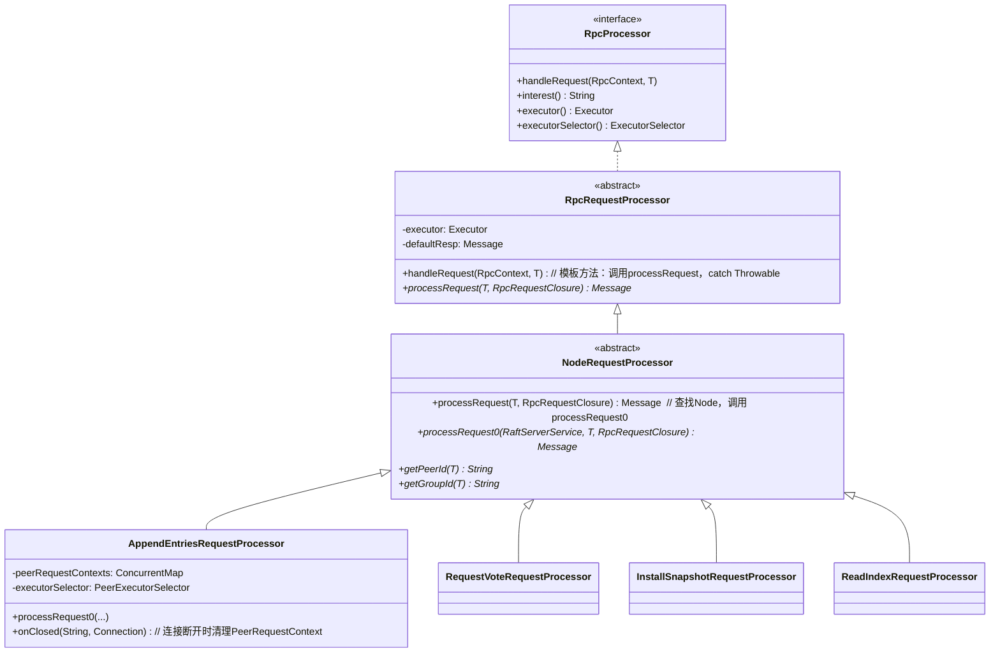
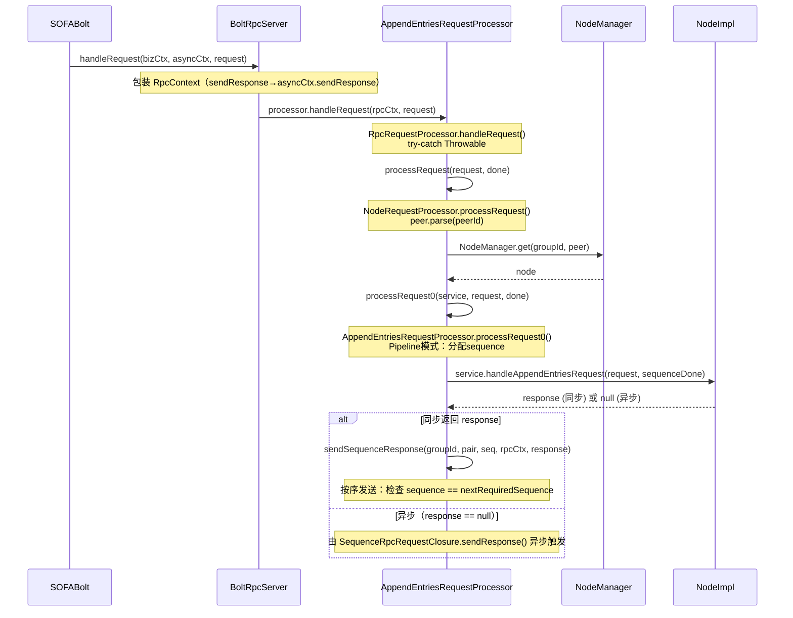
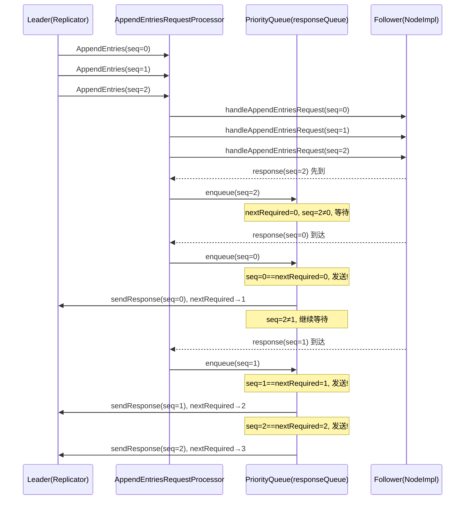
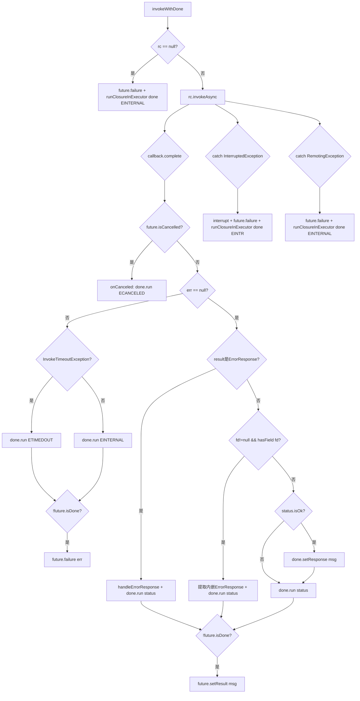

# 10 - RPC 通信层

## ☕ 想先用人话了解 RPC 层？请看通俗解读

> **👉 [点击阅读：用人话聊聊 RPC 通信层（通俗解读完整版）](./通俗解读.md)**
>
> 通俗解读版用"电话系统"的比喻，带你理解 Pipeline 有序响应、SPI 可插拔设计、线程隔离、AppendEntries 特殊优化和连接管理。**建议先读通俗解读版。**

---

## 1. 解决什么问题

Raft 是一个分布式共识协议，节点之间需要频繁通信：Leader 向 Follower 复制日志（AppendEntries）、节点之间互相投票（RequestVote）、Leader 向落后节点安装快照（InstallSnapshot）……这些通信有几个核心需求：

1. **高吞吐、低延迟**：AppendEntries 是热路径，每条日志都要走一次 RPC
2. **有序性**：同一 Peer 的 AppendEntries 请求必须按请求顺序返回（Pipeline 模式）
3. **可插拔**：不同部署环境可能需要不同的传输层（Bolt vs gRPC）
4. **线程隔离**：Raft 核心 RPC 和 CLI 管理 RPC 不能互相阻塞

JRaft 的 RPC 层通过**抽象接口 + SPI 工厂 + Pipeline 有序响应队列**解决了上述问题。

---

## 2. 核心数据结构

### 2.1 接口层（问题推导）

【问题】服务端需要接收请求、注册处理器、监听连接断开；客户端需要发起同步/异步调用、检查连接。

【推导出的结构】：
- 服务端：`RpcServer`（注册处理器 + 监听连接事件）
- 客户端：`RpcClient`（invokeSync + invokeAsync + checkConnection）
- 处理器：`RpcProcessor`（interest 声明 + handleRequest 处理）
- 工厂：`RaftRpcFactory`（SPI 扩展点，创建 RpcServer/RpcClient）

```java
// RpcServer.java 第 27-55 行
public interface RpcServer extends Lifecycle<Void> {
    void registerConnectionClosedEventListener(ConnectionClosedEventListener listener);
    void registerProcessor(RpcProcessor<?> processor);
    int boundPort();
    boolean isStarted();
}
```

**继承关系**：`RpcServer extends Lifecycle<Void>`，`init(Void opts)` 启动，`shutdown()` 停止。

### 2.2 `BoltRpcServer` 字段分析（`BoltRpcServer.java:38-185`）

【问题】JRaft 的 `RpcServer` 接口需要适配 SOFABolt 的 `com.alipay.remoting.rpc.RpcServer`。

【推导出的结构】：只需持有一个 Bolt 的 `RpcServer` 实例，所有方法委托给它。

```java
// BoltRpcServer.java 第 38-42 行
public class BoltRpcServer implements RpcServer {
    private final com.alipay.remoting.rpc.RpcServer rpcServer;  // 委托给 Bolt 实现
}
```

**`init()` 关键配置**（`BoltRpcServer.java:46-52`）：
```java
// BoltRpcServer.java 第 46-52 行
public boolean init(final Void opts) {
    this.rpcServer.option(BoltClientOption.NETTY_FLUSH_CONSOLIDATION, true);  // 开启 Netty flush 合并，减少系统调用
    this.rpcServer.initWriteBufferWaterMark(
        BoltRaftRpcFactory.CHANNEL_WRITE_BUF_LOW_WATER_MARK,   // 默认 256KB
        BoltRaftRpcFactory.CHANNEL_WRITE_BUF_HIGH_WATER_MARK); // 默认 512KB
    this.rpcServer.startup();
    return this.rpcServer.isStarted();
}
```

**`registerProcessor()` 适配层**（`BoltRpcServer.java:90-130`）：

JRaft 的 `RpcProcessor` 接口与 Bolt 的 `AsyncUserProcessor` 接口不同，`registerProcessor()` 内部创建一个匿名 `AsyncUserProcessor` 作为适配器：

```java
// BoltRpcServer.java 第 90-130 行
public void registerProcessor(final RpcProcessor processor) {
    this.rpcServer.registerUserProcessor(new AsyncUserProcessor<Object>() {
        @Override
        public void handleRequest(BizContext bizCtx, AsyncContext asyncCtx, Object request) {
            // 将 Bolt 的 BizContext/AsyncContext 包装为 JRaft 的 RpcContext
            final RpcContext rpcCtx = new RpcContext() {
                @Override public void sendResponse(Object responseObj) { asyncCtx.sendResponse(responseObj); }
                @Override public Connection getConnection() { ... }
                @Override public String getRemoteAddress() { return bizCtx.getRemoteAddress(); }
            };
            processor.handleRequest(rpcCtx, request);
        }

        @Override public String interest() { return processor.interest(); }

        @Override
        public ExecutorSelector getExecutorSelector() {
            final RpcProcessor.ExecutorSelector realSelector = processor.executorSelector();
            if (realSelector == null) { return null; }  // 无 selector → Bolt 使用默认 executor
            return realSelector::select;  // 有 selector → Pipeline 模式按 Peer 路由
        }

        @Override public Executor getExecutor() { return processor.executor(); }
    });
}
```

**分支穷举**（`BoltRpcServer.registerProcessor()`）：
- □ `processor.executorSelector() == null` → `getExecutorSelector()` 返回 null，Bolt 使用默认 executor
- □ `processor.executorSelector() != null` → 返回 `realSelector::select`，Pipeline 模式下按 Peer 路由到专属线程

### 2.3 `BoltRpcClient` 字段分析（`BoltRpcClient.java:46-200`）

```java
// BoltRpcClient.java 第 46-55 行
public class BoltRpcClient implements RpcClient {
    private final com.alipay.remoting.rpc.RpcClient rpcClient;  // 委托给 Bolt 实现
    private RpcOptions opts;  // 保存配置（超时、CRC 开关等）
}
```

**`invokeAsync()` 异常包装**（`BoltRpcClient.java:115-135`）：

```java
// BoltRpcClient.java 第 115-135 行
public void invokeAsync(Endpoint endpoint, Object request, InvokeContext ctx,
                        InvokeCallback callback, long timeoutMs) throws InterruptedException, RemotingException {
    try {
        this.rpcClient.invokeWithCallback(endpoint.toString(), request, getBoltInvokeCtx(ctx),
            getBoltCallback(callback, ctx), (int) timeoutMs);
    } catch (final com.alipay.remoting.rpc.exception.InvokeTimeoutException e) {
        throw new InvokeTimeoutException(e);  // 包装为 JRaft 的超时异常
    } catch (final com.alipay.remoting.exception.RemotingException e) {
        if (ThrowUtil.getRootCause(e) instanceof ConnectException) {
            throw new ConnectionFailureException(e);  // 连接失败单独区分
        }
        throw new RemotingException(e);  // 其他网络异常
    }
}
```

**分支穷举**（`BoltRpcClient.invokeAsync()`）：
- □ `endpoint == null` → throw `NullPointerException`（`Requires.requireNonNull`）
- □ 正常 → `rpcClient.invokeWithCallback()`
- □ catch(`InvokeTimeoutException`) → throw `InvokeTimeoutException`（包装）
- □ catch(`RemotingException`) + `getRootCause() instanceof ConnectException` → throw `ConnectionFailureException`
- □ catch(`RemotingException`) + 其他 → throw `RemotingException`（包装）

**`getFile()` 开启 CRC 校验**（`DefaultRaftClientService.java:130-135`）：
```java
// DefaultRaftClientService.java 第 130-135 行
public Future<Message> getFile(...) {
    final InvokeContext ctx = new InvokeContext();
    ctx.put(InvokeContext.CRC_SWITCH, true);  // 快照文件传输开启 CRC 校验，防止数据损坏
    return invokeWithDone(endpoint, request, ctx, done, timeoutMs);
}
```

### 2.4 `PeerRequestContext` 字段分析（`AppendEntriesRequestProcessor.java:195-250`）

【问题】Pipeline 模式下，Leader 可以并发发送多个 AppendEntries 请求，但响应必须按请求顺序返回（否则 Follower 的 nextIndex 更新会乱序）。

【需要什么信息】：
- 每个 `(groupId, peerId, serverId)` 三元组需要独立的处理队列
- 需要一个序号机制保证响应有序
- 需要一个优先队列缓存乱序到达的响应

【推导出的结构】：

```java
// AppendEntriesRequestProcessor.java 第 195-230 行
static class PeerRequestContext {
    private final String                         groupId;
    private final PeerPair                       pair;
    private SingleThreadExecutor                 executor;           // 专属单线程，保证同一 Peer 的请求串行处理
    private int                                  sequence;           // 请求序号（单调递增）
    private int                                  nextRequiredSequence; // 下一个期望发送的响应序号
    private final PriorityQueue<SequenceMessage> responseQueue;      // 乱序响应缓冲队列（按 sequence 排序）
    private final int                            maxPendingResponses; // 最大待发送响应数（来自 maxReplicatorInflightMsgs）
}
```

**字段存在原因**：
- `executor`：因为需要保证同一 Peer 的 AppendEntries 请求串行处理，所以需要专属单线程（`MpscSingleThreadExecutor`）
- `sequence`：因为需要给每个请求分配唯一序号，所以需要单调递增计数器（溢出时归零：`if (sequence < 0) sequence = 0`）
- `nextRequiredSequence`：因为需要知道下一个应该发送的响应序号，所以需要独立维护（同样有溢出归零保护）
- `responseQueue`：因为响应可能乱序到达（网络抖动），所以需要优先队列缓冲（初始容量 50）
- `maxPendingResponses`：因为需要防止队列无限增长（内存泄漏），所以需要上限（来自 `RaftOptions.maxReplicatorInflightMsgs`）

**`destroy()` 是 `synchronized` 方法**（`AppendEntriesRequestProcessor.java:248-254`）：防止 `onClosed()` 和 `removePeerRequestContext()` 并发调用时重复 destroy（`executor.shutdownGracefully()` 被调用两次）；destroy 后将 `executor` 置为 null，第二次调用时 `executor == null` 直接 return。

### 2.5 `RpcRequestClosure` 字段分析（`RpcRequestClosure.java:36-80`）

【问题】一个 RPC 请求只能发送一次响应，需要防止重复发送。

```java
// RpcRequestClosure.java 第 36-55 行
public class RpcRequestClosure implements InternalClosure {
    private static final AtomicIntegerFieldUpdater<RpcRequestClosure> STATE_UPDATER = ...;
    private static final int PENDING = 0;
    private static final int RESPOND = 1;

    private final RpcContext rpcCtx;       // 持有 RPC 上下文，用于发送响应
    private final Message    defaultResp;  // 默认响应模板（用于构造错误响应）
    private volatile int     state = PENDING;  // CAS 保证只发送一次
}
```

**`sendResponse()` 防重复发送**（`RpcRequestClosure.java:65-72`）：
```java
// RpcRequestClosure.java 第 65-72 行
public void sendResponse(final Message msg) {
    if (!STATE_UPDATER.compareAndSet(this, PENDING, RESPOND)) {
        LOG.warn("A response: {} sent repeatedly!", msg);  // 重复发送，打印警告
        return;
    }
    this.rpcCtx.sendResponse(msg);
}
```

**分支穷举**（`RpcRequestClosure.sendResponse()`）：
- □ `compareAndSet(PENDING, RESPOND)` 成功 → `rpcCtx.sendResponse(msg)`（正常发送）
- □ `compareAndSet` 失败（已发送过）→ `LOG.warn` + return（防重复，不抛异常）

---

## 3. 处理器继承体系



**三层模板方法**：
1. `RpcRequestProcessor.handleRequest()`（`RpcRequestProcessor.java:51-62`）：捕获所有异常，保证 RPC 不会因处理器异常而挂起
2. `NodeRequestProcessor.processRequest()`（`NodeRequestProcessor.java:52-70`）：解析 peerId，从 `NodeManager` 查找 Node
3. `AppendEntriesRequestProcessor.processRequest0()`（`AppendEntriesRequestProcessor.java:390-430`）：Pipeline 模式下分配序号，有序发送响应

**`RpcRequestProcessor.handleRequest()` 分支穷举**（`RpcRequestProcessor.java:51-62`）：
- □ `processRequest()` 正常返回 `msg != null` → `rpcCtx.sendResponse(msg)`
- □ `processRequest()` 正常返回 `msg == null` → 不发送（由 done 异步发送，即 `done.run(status)` → `RpcRequestClosure.run()` → `sendResponse()`）
- □ catch(Throwable t) → `LOG.error` + `rpcCtx.sendResponse(newResponse(defaultResp, -1, "handleRequest internal error"))`

---

## 4. 关键流程

### 4.1 请求处理完整路径（服务端）



### 4.2 Pipeline 有序响应机制



### 4.3 客户端异步调用路径（`AbstractClientService.invokeWithDone()`）



**分支穷举**（`AbstractClientService.invokeWithDone()`，`AbstractClientService.java:175-270`）：
- □ `rc == null` → `future.failure(IllegalStateException)` + `runClosureInExecutor(done, EINTERNAL)` + return
- □ callback: `future.isCancelled()` → `onCanceled(request, done)` + return
- □ callback: `err == null` + result 是 `ErrorResponse` → `handleErrorResponse()` + `msg = (Message) result` + `done.run(status)`
- □ callback: `err == null` + result 是 `Message` + `fd != null && hasField(fd)` → 提取内嵌 ErrorResponse，`msg = eResp`，`done.run(status)`
- □ callback: `err == null` + result 是 `Message` + `fd == null || !hasField(fd)` → `msg = (T) result`，`status.isOk()` 时 `done.setResponse(msg)`，`done.run(OK)`
- □ callback: `err == null` + `!future.isDone()` → `future.setResult(msg)`（有 `!future.isDone()` 保护，防止重复设置）
- □ callback: `err != null` + `InvokeTimeoutException` → `done.run(ETIMEDOUT)`，`!future.isDone()` 时 `future.failure(err)`
- □ callback: `err != null` + 其他异常 → `done.run(EINTERNAL)`，`!future.isDone()` 时 `future.failure(err)`
- □ callback: `done.run()` 抛 Throwable → `LOG.error` + 吞掉（不向上传播）
- □ catch(InterruptedException) → `Thread.currentThread().interrupt()` + `future.failure(e)` + `runClosureInExecutor(done, EINTR)`
- □ catch(RemotingException) → `future.failure(e)` + `runClosureInExecutor(done, EINTERNAL)`

---

## 5. 处理器注册机制（`RaftRpcServerFactory.java:120-155`）

```java
// RaftRpcServerFactory.java 第 120-155 行
public static void addRaftRequestProcessors(final RpcServer rpcServer, final Executor raftExecutor,
                                            final Executor cliExecutor, final Executor pingExecutor) {
    // raft core processors（使用 raftExecutor）
    final AppendEntriesRequestProcessor appendEntriesRequestProcessor =
        new AppendEntriesRequestProcessor(raftExecutor);
    rpcServer.registerConnectionClosedEventListener(appendEntriesRequestProcessor);  // 监听连接断开，清理 PeerRequestContext
    rpcServer.registerProcessor(appendEntriesRequestProcessor);
    rpcServer.registerProcessor(new GetFileRequestProcessor(raftExecutor));
    rpcServer.registerProcessor(new InstallSnapshotRequestProcessor(raftExecutor));
    rpcServer.registerProcessor(new RequestVoteRequestProcessor(raftExecutor));
    rpcServer.registerProcessor(new PingRequestProcessor(pingExecutor));
    rpcServer.registerProcessor(new TimeoutNowRequestProcessor(raftExecutor));
    rpcServer.registerProcessor(new ReadIndexRequestProcessor(raftExecutor));
    // raft cli service（使用 cliExecutor，与 raftExecutor 隔离）
    rpcServer.registerProcessor(new AddPeerRequestProcessor(cliExecutor));
    rpcServer.registerProcessor(new RemovePeerRequestProcessor(cliExecutor));
    rpcServer.registerProcessor(new ResetPeerRequestProcessor(cliExecutor));
    rpcServer.registerProcessor(new ChangePeersRequestProcessor(cliExecutor));
    rpcServer.registerProcessor(new GetLeaderRequestProcessor(cliExecutor));
    rpcServer.registerProcessor(new SnapshotRequestProcessor(cliExecutor));
    rpcServer.registerProcessor(new TransferLeaderRequestProcessor(cliExecutor));
    rpcServer.registerProcessor(new GetPeersRequestProcessor(cliExecutor));
    rpcServer.registerProcessor(new AddLearnersRequestProcessor(cliExecutor));
    rpcServer.registerProcessor(new RemoveLearnersRequestProcessor(cliExecutor));
    rpcServer.registerProcessor(new ResetLearnersRequestProcessor(cliExecutor));
}
```

**关键设计**：`AppendEntriesRequestProcessor` 同时实现了 `ConnectionClosedEventListener`（`AppendEntriesRequestProcessor.java:55`），连接断开时自动清理对应的 `PeerRequestContext`，防止内存泄漏。

---

## 6. `NodeRequestProcessor.processRequest()` 分支穷举（`NodeRequestProcessor.java:52-70`）

```java
// NodeRequestProcessor.java 第 52-70 行
public Message processRequest(final T request, final RpcRequestClosure done) {
    final PeerId peer = new PeerId();
    final String peerIdStr = getPeerId(request);
    if (peer.parse(peerIdStr)) {
        final String groupId = getGroupId(request);
        final Node node = NodeManager.getInstance().get(groupId, peer);
        if (node != null) {
            return processRequest0((RaftServerService) node, request, done);
        } else {
            return RpcFactoryHelper.responseFactory()
                .newResponse(defaultResp(), RaftError.ENOENT, "Peer id not found: %s, group: %s", peerIdStr, groupId);
        }
    } else {
        return RpcFactoryHelper.responseFactory()
            .newResponse(defaultResp(), RaftError.EINVAL, "Fail to parse peerId: %s", peerIdStr);
    }
}
```

**分支穷举**：
- □ `peer.parse(peerIdStr)` 失败 → return `EINVAL("Fail to parse peerId: %s")`
- □ `peer.parse()` 成功 + `NodeManager.get()` 返回 null → return `ENOENT("Peer id not found: %s, group: %s")`
- □ `peer.parse()` 成功 + `NodeManager.get()` 返回 node → `processRequest0(service, request, done)`

---

## 7. `AppendEntriesRequestProcessor` 核心方法分支穷举

### 7.1 `processRequest0()`（`AppendEntriesRequestProcessor.java:390-430`）

```java
// AppendEntriesRequestProcessor.java 第 390-430 行
public Message processRequest0(RaftServerService service, AppendEntriesRequest request, RpcRequestClosure done) {
    final Node node = (Node) service;
    if (node.getRaftOptions().isReplicatorPipeline()) {
        final String groupId = request.getGroupId();
        final PeerPair pair = pairOf(request.getPeerId(), request.getServerId());
        boolean isHeartbeat = isHeartbeatRequest(request);
        int reqSequence = -1;
        if (!isHeartbeat) {
            reqSequence = getAndIncrementSequence(groupId, pair, done.getRpcCtx().getConnection());
        }
        final Message response = service.handleAppendEntriesRequest(request,
            new SequenceRpcRequestClosure(done, defaultResp(), groupId, pair, reqSequence, isHeartbeat));
        if (response != null) {
            if (isHeartbeat) {
                done.getRpcCtx().sendResponse(response);  // 心跳直接发送，不走序号队列
            } else {
                sendSequenceResponse(groupId, pair, reqSequence, done.getRpcCtx(), response);
            }
        }
        return null;  // 返回 null，由 SequenceRpcRequestClosure 异步发送
    } else {
        return service.handleAppendEntriesRequest(request, done);  // 非 Pipeline 模式，同步返回
    }
}
```

**分支穷举**：
- □ `!isReplicatorPipeline()` → 直接 `service.handleAppendEntriesRequest(request, done)` 同步返回
- □ `isReplicatorPipeline()` + `isHeartbeat`（`entriesCount==0 && !hasData()`）→ `reqSequence=-1`，response != null 时直接 `sendResponse()`（心跳不走序号队列）
- □ `isReplicatorPipeline()` + `!isHeartbeat` → `reqSequence = getAndIncrementSequence()`，response != null 时 `sendSequenceResponse()`
- □ `isReplicatorPipeline()` + response == null → return null（由 `SequenceRpcRequestClosure.sendResponse()` 异步触发）

**心跳为什么不走序号队列**：心跳请求（`entriesCount==0 && !hasData()`）不携带日志，不影响 nextIndex，无需保证有序，直接发送可以降低延迟。

### 7.2 `sendSequenceResponse()`（`AppendEntriesRequestProcessor.java:280-320`）

**分支穷举**：
- □ `ctx == null` → return（context 已销毁，忽略响应，防止 NPE）
- □ `ctx != null` + `!hasTooManyPendingResponses()` + `respQueue.peek().sequence == nextRequiredSequence` → 按序发送，`getAndIncrementNextRequiredSequence()`，循环直到队列为空或序号不连续
- □ `ctx != null` + `!hasTooManyPendingResponses()` + `sequence != nextRequiredSequence` → break，等待下一个响应
- □ `ctx != null` + `hasTooManyPendingResponses()`（`responseQueue.size() > maxPendingResponses`）→ `LOG.warn` + `connection.close()` + `removePeerRequestContext()`（主动断开连接，防止内存泄漏）

### 7.3 `onClosed()`（`AppendEntriesRequestProcessor.java:490-515`）

**分支穷举**：
- □ `pairs != null && !pairs.isEmpty()` → 遍历所有 groupContexts，`synchronized(groupCtxs)` 移除并 `destroy()` 对应 ctx（关闭专属线程池）
- □ `pairs == null || pairs.isEmpty()` → `LOG.info("Connection disconnected: {}")`（普通连接断开，无需清理）

---

## 8. SPI 工厂机制（`BoltRaftRpcFactory.java:38-87`）

```java
// BoltRaftRpcFactory.java 第 38-42 行
@SPI
public class BoltRaftRpcFactory implements RaftRpcFactory {
    static final int CHANNEL_WRITE_BUF_LOW_WATER_MARK  = SystemPropertyUtil.getInt(
        "bolt.channel_write_buf_low_water_mark", 256 * 1024);   // 可通过系统属性覆盖
    static final int CHANNEL_WRITE_BUF_HIGH_WATER_MARK = SystemPropertyUtil.getInt(
        "bolt.channel_write_buf_high_water_mark", 512 * 1024);
}
```

**`ensurePipeline()`**（`BoltRaftRpcFactory.java:78-85`）：Pipeline 模式要求 Bolt 不在默认 executor 中分发消息列表，`ensurePipeline()` 检查并强制设置 `DISPATCH_MSG_LIST_IN_DEFAULT_EXECUTOR=false`。

**SPI 切换方式**：
```
META-INF/services/com.alipay.sofa.jraft.rpc.RaftRpcFactory
→ 指向 GrpcRaftRpcFactory（切换为 gRPC 实现）
```

---

## 9. `DefaultRaftClientService` 线程模型（`DefaultRaftClientService.java:60-175`）

```java
// DefaultRaftClientService.java 第 60-75 行
public class DefaultRaftClientService extends AbstractClientService implements RaftClientService {
    private final FixedThreadsExecutorGroup         appendEntriesExecutors;     // 专用线程组，发送 AppendEntries
    private final ConcurrentMap<Endpoint, Executor> appendEntriesExecutorMap;   // Endpoint → 专属 Executor 映射
    private NodeOptions                             nodeOptions;
    private final ReplicatorGroup                   rgGroup;
}
```

**`appendEntries()` 线程绑定**（`DefaultRaftClientService.java:115-125`）：
```java
// DefaultRaftClientService.java 第 115-125 行
public Future<Message> appendEntries(Endpoint endpoint, AppendEntriesRequest request,
                                     int timeoutMs, RpcResponseClosure<AppendEntriesResponse> done) {
    // 每个 Endpoint 绑定到固定的 Executor（computeIfAbsent 保证幂等）
    final Executor executor = this.appendEntriesExecutorMap.computeIfAbsent(
        endpoint, k -> appendEntriesExecutors.next());

    if (!checkConnection(endpoint, true)) {
        return onConnectionFail(endpoint, request, done, executor);  // fail-fast
    }
    return invokeWithDone(endpoint, request, done, timeoutMs, executor);
}
```

**设计意图**：同一 Endpoint 的 AppendEntries 请求始终由同一个 Executor 处理，保证发送顺序与 Pipeline 序号一致。

**`onConnectionFail()` fail-fast**（`DefaultRaftClientService.java:155-170`）：
```java
// DefaultRaftClientService.java 第 155-170 行
private Future<Message> onConnectionFail(Endpoint endpoint, Message request, Closure done, Executor executor) {
    final FutureImpl<Message> future = new FutureImpl<>();
    executor.execute(() -> {
        if (done != null) {
            try {
                done.run(new Status(RaftError.EINTERNAL, "Check connection[%s] fail", endpoint));
            } catch (final Throwable t) {
                LOG.error("Fail to run RpcResponseClosure, the request is {}.", request, t);  // 吞掉异常
            }
        }
        if (!future.isDone()) {
            future.failure(new RemotingException(...));
        }
    });
    return future;
}
```

**分支穷举**（`DefaultRaftClientService.onConnectionFail()`，`DefaultRaftClientService.java:155-168`）：
- □ `done != null` → `done.run(EINTERNAL, "Check connection[%s] fail and try to create new one")` + `!future.isDone()` 时 `future.failure(RemotingException)`
- □ `done == null` → 只 `!future.isDone()` 时 `future.failure(RemotingException)`
- □ `done.run()` 抛 Throwable → `LOG.error` + 吞掉（不向上传播）

---

## 10. `AbstractClientService.connect()` 分支穷举（`AbstractClientService.java:140-165`）

```java
// AbstractClientService.java 第 140-165 行
public boolean connect(final Endpoint endpoint) {
    final RpcClient rc = this.rpcClient;
    if (rc == null) { throw new IllegalStateException("Client service is uninitialized."); }
    if (isConnected(rc, endpoint)) { return true; }  // 已连接，快速返回
    try {
        final PingRequest req = PingRequest.newBuilder()
            .setSendTimestamp(System.currentTimeMillis()).build();
        final ErrorResponse resp = (ErrorResponse) rc.invokeSync(endpoint, req,
            this.rpcOptions.getRpcConnectTimeoutMs());
        return resp.getErrorCode() == 0;
    } catch (final InterruptedException e) {
        Thread.currentThread().interrupt();
        return false;
    } catch (final RemotingException e) {
        LOG.error("Fail to connect {}, remoting exception: {}.", endpoint, e.getMessage());
        return false;
    }
}
```

**分支穷举**：
- □ `rc == null` → throw `IllegalStateException("Client service is uninitialized.")`
- □ `isConnected(rc, endpoint)` → return true（已连接，不发 Ping）
- □ `!isConnected()` → 发送 `PingRequest`，`resp.getErrorCode() == 0` → return true
- □ `!isConnected()` → 发送 `PingRequest`，`resp.getErrorCode() != 0` → return false
- □ catch(InterruptedException) → `Thread.currentThread().interrupt()` + return false
- □ catch(RemotingException) → `LOG.error` + return false

---

## 11. 核心不变式

1. **处理器线程隔离**：Raft 核心 RPC（AppendEntries/Vote/Snapshot）使用 `raftExecutor`，CLI RPC（AddPeer/RemovePeer 等）使用 `cliExecutor`，Ping 使用 `pingExecutor`，三者互不阻塞（`RaftRpcServerFactory.java:120-155`）
2. **Pipeline 响应有序**：同一 `(groupId, peerId, serverId)` 三元组的 AppendEntries 响应严格按请求序号顺序发送，由 `PeerRequestContext.responseQueue`（`PriorityQueue`）保证（`AppendEntriesRequestProcessor.java:195-230`）
3. **响应只发一次**：`RpcRequestClosure` 通过 `AtomicIntegerFieldUpdater` CAS 保证每个请求只发送一次响应，重复调用 `sendResponse()` 只打印 warn 不抛异常（`RpcRequestClosure.java:65-72`）
4. **连接断开自动清理**：`AppendEntriesRequestProcessor` 实现 `ConnectionClosedEventListener`，连接断开时自动销毁对应的 `PeerRequestContext`（关闭专属线程池），防止内存泄漏（`AppendEntriesRequestProcessor.java:490-515`）
5. **fail-fast 连接检查**：`DefaultRaftClientService.appendEntries()` 在发送前先 `checkConnection(endpoint, true)`，连接不可用时立即回调 `done.run(EINTERNAL)`，不等待超时（`DefaultRaftClientService.java:115-125`）

---

## 12. 面试高频考点 📌

- **JRaft 为什么默认使用 Bolt 而不是 gRPC？** Bolt 是蚂蚁金服内部成熟框架，基于 Netty，支持 `NETTY_FLUSH_CONSOLIDATION`（flush 合并减少系统调用）和写缓冲水位线控制，与 JRaft 深度集成；gRPC 作为扩展模块通过 SPI 切换
- **`AppendEntriesRequestProcessor` 为什么要为每个 Peer 维护独立队列？** Pipeline 模式下 Leader 并发发送多个请求，响应可能乱序到达，`PriorityQueue<SequenceMessage>` 按序号排序，保证响应按请求顺序发送给 Leader，否则 Leader 的 nextIndex 更新会乱序
- **心跳为什么不走序号队列？** 心跳（`entriesCount==0 && !hasData()`）不携带日志，不影响 nextIndex，无需保证有序，直接发送降低延迟
- **`RpcRequestClosure` 如何防止重复发送响应？** `AtomicIntegerFieldUpdater` CAS 将 `state` 从 `PENDING` 改为 `RESPOND`，失败则打印 warn 并 return，不抛异常
- **RPC 层如何实现可插拔？** `@SPI` 注解 + `META-INF/services/com.alipay.sofa.jraft.rpc.RaftRpcFactory` 文件，切换为 `GrpcRaftRpcFactory` 即可使用 gRPC
- **`appendEntries()` 为什么要绑定 Endpoint 到固定 Executor？** 保证同一 Endpoint 的请求发送顺序与 Pipeline 序号一致，避免多线程发送导致序号乱序

---

## 13. 生产踩坑 ⚠️

- **Bolt 写缓冲水位线**：默认 `LOW=256KB, HIGH=512KB`，大消息（AppendEntries 携带大量日志）可能触发 Netty 背压，导致写操作阻塞；可通过 `-Dbolt.channel_write_buf_high_water_mark=1048576` 调整（`BoltRaftRpcFactory.java:44-49`）
- **`maxPendingResponses` 过小**：`PeerRequestContext.maxPendingResponses` 来自 `RaftOptions.maxReplicatorInflightMsgs`（默认 256），网络抖动时响应积压超过此值会主动断开连接，触发重连；调大此值可减少断连，但会增加内存占用
- **Pipeline 模式与 Bolt 配置冲突**：Pipeline 模式要求 `DISPATCH_MSG_LIST_IN_DEFAULT_EXECUTOR=false`，`BoltRaftRpcFactory.ensurePipeline()` 会自动设置，但如果应用代码在 JRaft 初始化前设置了该属性为 `true`，会导致 Pipeline 失效（`BoltRaftRpcFactory.java:78-85`）
- **gRPC 和 Bolt 混用**：集群内所有节点必须使用相同的 RPC 实现，混用会导致序列化不兼容（Bolt 使用 `ProtobufSerializer`，gRPC 使用 gRPC 原生序列化）
- **`connect()` 超时配置**：`AbstractClientService.connect()` 使用 `rpcOptions.getRpcConnectTimeoutMs()` 作为 Ping 超时，默认值较小；在高延迟网络中可能导致频繁连接失败，需要调整 `RpcOptions.rpcConnectTimeoutMs`
