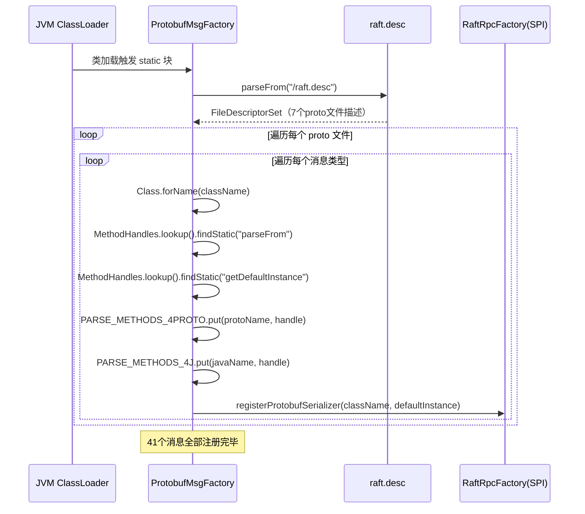
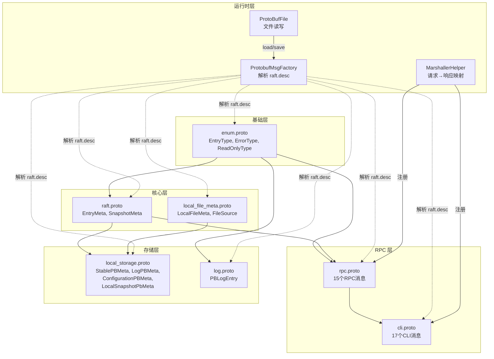

# S13：Protobuf 协议定义与消息结构 — JRaft 的"通信语言"全解

> **归属**：补入 `10-rpc-layer` 章节
>
> **核心问题**：JRaft 中所有 RPC 请求/响应、日志条目、存储元数据使用了哪些 Protobuf 消息？它们是如何定义、编译、注册和使用的？
>
> 涉及源码文件：`enum.proto`（27 行）、`raft.proto`（33 行）、`rpc.proto`（116 行）、`cli.proto`（108 行）、`log.proto`（21 行）、`local_file_meta.proto`（19 行）、`local_storage.proto`（35 行）、`gen.sh`（3 行）、`ProtobufMsgFactory.java`（131 行）、`ProtoBufFile.java`（127 行）、`MarshallerHelper.java`（72 行）

---

## 目录

1. [问题推导：为什么需要 Protobuf？](#1-问题推导)
2. [Proto 文件全景图](#2-proto-文件全景图)
3. [编译工具链：从 .proto 到 Java 类](#3-编译工具链)
4. [枚举定义：enum.proto](#4-枚举定义)
5. [Raft 核心元数据：raft.proto](#5-raft-核心元数据)
6. [RPC 请求/响应：rpc.proto](#6-rpc-请求响应)
7. [CLI 运维消息：cli.proto](#7-cli-运维消息)
8. [日志编码消息：log.proto](#8-日志编码消息)
9. [快照与存储元数据：local_file_meta.proto + local_storage.proto](#9-快照与存储元数据)
10. [消息注册机制：ProtobufMsgFactory](#10-消息注册机制)
11. [消息存储机制：ProtoBufFile](#11-消息存储机制)
12. [请求-响应映射：MarshallerHelper](#12-请求响应映射)
13. [用户扩展示例：counter.proto](#13-用户扩展示例)
14. [Proto 文件间依赖关系图](#14-依赖关系图)
15. [面试高频考点 📌 与生产踩坑 ⚠️](#15-面试与生产)

---

## 1. 问题推导

### 1.1 核心问题

一个分布式共识框架需要在节点间传输大量结构化数据：

- **选举**：谁在请求投票？当前任期是多少？最后一条日志的 term 和 index？
- **日志复制**：Leader 要把什么日志条目发送给 Follower？已提交到哪个 index？
- **快照安装**：快照的元信息是什么？包含哪些文件？
- **集群管理**：添加/移除节点需要传递哪些信息？
- **日志持久化**：日志条目存到磁盘时用什么格式？
- **元数据持久化**：term、votedFor、配置信息用什么格式存储？

### 1.2 推导设计

如果让我来设计，需要：

1. **一种跨语言、高性能的序列化格式** → 选择 Protobuf（proto2 语法）
2. **按功能域划分多个 .proto 文件** → 枚举、Raft 元数据、RPC 消息、CLI 消息、日志、存储分别定义
3. **统一的编译流程** → 一条 `protoc` 命令同时生成 Java 类和描述符集合
4. **自动注册机制** → 运行时通过描述符集合自动发现所有消息类型
5. **通用的文件存储工具** → 支持把任意 Protobuf 消息序列化到文件

### 1.3 真实架构

JRaft 的 Protobuf 体系由 **7 个 proto 文件 + 1 个描述符集合 + 3 个核心 Java 工具类** 组成：

| 层次 | 组件 | 职责 |
|------|------|------|
| 定义层 | 7 个 `.proto` 文件 | 消息结构定义 |
| 编译层 | `gen.sh` + `protoc` | 生成 Java 类 + `raft.desc` 描述符 |
| 注册层 | `ProtobufMsgFactory` | 解析 `raft.desc`，注册所有消息的反序列化方法 |
| 存储层 | `ProtoBufFile` | 通用 Protobuf 文件读写工具 |
| 映射层 | `MarshallerHelper` | 请求类名 → 响应默认实例的映射 |

---

## 2. Proto 文件全景图

### 2.1 七个 proto 文件一览

所有 proto 文件位于 `jraft-core/src/main/resources/` 下（`gen.sh:2`）：

| 文件 | java_package | java_outer_classname | 消息数 | 枚举数 | 生成 Java 类行数 | 用途 |
|------|-------------|---------------------|--------|--------|-----------------|------|
| `enum.proto` | `com.alipay.sofa.jraft.entity` | `EnumOutter` | 0 | 3 | 378 | 全局枚举定义 |
| `raft.proto` | `com.alipay.sofa.jraft.entity` | `RaftOutter` | 2 | 0 | 3,114 | Raft 核心元数据 |
| `rpc.proto` | `com.alipay.sofa.jraft.rpc` | `RpcRequests` | 15 | 0 | 14,935 | RPC 请求/响应 |
| `cli.proto` | `com.alipay.sofa.jraft.rpc` | `CliRequests` | 17 | 0 | 15,793 | CLI 运维消息 |
| `log.proto` | `com.alipay.sofa.jraft.entity.codec.v2` | `LogOutter` | 1 | 0 | 1,604 | V2 日志编码 |
| `local_file_meta.proto` | `com.alipay.sofa.jraft.entity` | `LocalFileMetaOutter` | 1 | 1 | 911 | 快照文件元数据 |
| `local_storage.proto` | `com.alipay.sofa.jraft.entity` | `LocalStorageOutter` | 4 | 0 | 3,805 | 本地存储元数据 |
| `local_storage.proto` 内嵌 | | | +1（`LocalSnapshotPbMeta.File`） | | | |
| **合计** | | | **41 个消息** | **4 个枚举** | **40,540 行** | |

> 📌 **关键观察**：41 个消息 + 4 个枚举的 proto 定义（共 359 行）生成了 40,540 行 Java 代码，**膨胀比约 1:113**。这就是为什么 Protobuf 生成类不适合人工阅读。

### 2.2 proto2 语法特性

JRaft 统一使用 `proto2` 语法（而非 `proto3`），关键区别：

| 特性 | proto2（JRaft 使用） | proto3 |
|------|---------------------|--------|
| 字段修饰符 | `required`/`optional`/`repeated` | 只有 `repeated`，其余隐式 optional |
| 默认值 | 可自定义 | 不可自定义（类型零值） |
| 未知字段 | 保留 | 保留（3.5+）|
| 枚举零值 | 无强制要求 | 必须有零值 |
| has 方法 | `optional`/`required` 均有 | 标量类型无 `has` 方法 |

> ⚠️ **生产踩坑**：`proto2` 的 `required` 字段一旦定义就不能删除（否则旧版本无法反序列化新消息）。JRaft 大量使用 `required`，意味着这些字段的存在是**永久性的协议约定**。

---

## 3. 编译工具链

### 3.1 gen.sh 编译脚本

**源码**：`jraft-core/src/main/resources/gen.sh:1-2`

```bash
#!/bin/bash
protoc -I=./  --descriptor_set_out=raft.desc --java_out=../java/ enum.proto local_file_meta.proto raft.proto local_storage.proto rpc.proto cli.proto log.proto
```

一条 `protoc` 命令完成**两件事**：

| 参数 | 作用 | 输出 |
|------|------|------|
| `--java_out=../java/` | 生成 Java 类 | 7 个 `*Outter.java` / `*Requests.java` 文件 |
| `--descriptor_set_out=raft.desc` | 生成描述符集合（二进制） | `raft.desc`（6,268 字节） |

### 3.2 raft.desc 的作用

`raft.desc` 是所有 proto 文件编译后的 **FileDescriptorSet**（二进制格式），包含：
- 所有 `.proto` 文件的元信息（包名、选项、依赖关系）
- 所有消息类型的字段描述（名称、类型、编号、修饰符）
- 所有枚举的值定义

**运行时用途**：`ProtobufMsgFactory` 在类加载时解析 `raft.desc`，自动发现和注册所有消息类型（`ProtobufMsgFactory.java:55-83`）。

### 3.3 编译输入输出总结

```
输入（7 个 .proto 文件，共 360 行）
    │
    ▼ protoc
    ├── raft.desc（6,268 字节，描述符集合）
    └── 7 个 Java 类文件（共 40,540 行）
         ├── EnumOutter.java（378 行）
         ├── RaftOutter.java（3,114 行）
         ├── RpcRequests.java（14,935 行）
         ├── CliRequests.java（15,793 行）
         ├── LogOutter.java（1,604 行）
         ├── LocalFileMetaOutter.java（911 行）
         └── LocalStorageOutter.java（3,805 行）
```

---

## 4. 枚举定义：enum.proto

**源码**：`jraft-core/src/main/resources/enum.proto:1-27`

```protobuf
syntax="proto2";
package jraft;

option java_package="com.alipay.sofa.jraft.entity";
option java_outer_classname = "EnumOutter";

enum EntryType {                       // enum.proto:7-12
    ENTRY_TYPE_UNKNOWN       = 0;      // 未知类型（不应出现）
    ENTRY_TYPE_NO_OP         = 1;      // Leader 当选后的空操作日志
    ENTRY_TYPE_DATA          = 2;      // 用户数据日志（apply 写入）
    ENTRY_TYPE_CONFIGURATION = 3;      // 配置变更日志（addPeer/removePeer）
};

enum ErrorType {                       // enum.proto:14-21
    ERROR_TYPE_NONE          = 0;      // 无错误
    ERROR_TYPE_LOG           = 1;      // 日志子系统错误
    ERROR_TYPE_STABLE        = 2;      // 元数据存储错误
    ERROR_TYPE_SNAPSHOT      = 3;      // 快照子系统错误
    ERROR_TYPE_STATE_MACHINE = 4;      // 状态机错误
    ERROR_TYPE_META          = 5;      // 元数据错误
};

enum ReadOnlyType {                    // enum.proto:23-26
    READ_ONLY_SAFE        = 0;         // ReadIndex（需确认 Leader 有效性）
    READ_ONLY_LEASE_BASED = 1;         // Lease Read（基于租约，无需网络确认）
};
```

### 4.1 三个枚举的使用场景

| 枚举 | 使用位置 | 说明 |
|------|---------|------|
| `EntryType` | `LogEntry.type`、`EntryMeta.type`、`PBLogEntry.type` | 区分日志类型，决定是否携带 peers 列表 |
| `ErrorType` | `NodeImpl.onError()` | 标识哪个子系统发生了致命错误，触发对应的错误处理 |
| `ReadOnlyType` | `ReadIndexRequest.readOnlyOptions` | 指定线性一致读的实现方式 |

### 4.2 为什么 enum.proto 独立一个文件？

`EntryType` 被 `raft.proto`（`EntryMeta`）、`log.proto`（`PBLogEntry`）和 `rpc.proto`（间接通过 `EntryMeta`）三个文件共同引用。如果把枚举内联到某个文件中，其他文件就会出现循环依赖。独立出来后，所有文件都 `import "enum.proto"` 即可。

---

## 5. Raft 核心元数据：raft.proto

**源码**：`jraft-core/src/main/resources/raft.proto:1-33`

```protobuf
syntax="proto2";
package jraft;
import "enum.proto";

option java_package="com.alipay.sofa.jraft.entity";
option java_outer_classname = "RaftOutter";

message EntryMeta {                    // raft.proto:11-23
    required int64    term      = 1;   // 日志任期
    required EntryType type     = 2;   // 日志类型（DATA/CONFIGURATION/NO_OP）
    repeated string   peers     = 3;   // 当前配置的 Peer 列表
    optional int64    data_len  = 4;   // 日志数据长度（用于 AppendEntries 中 data 与 entries 的拆分）
    repeated string   old_peers = 5;   // 旧配置的 Peer 列表（Joint Consensus 阶段）
    optional int64    checksum  = 6;   // CRC64 校验和（since 1.2.6）
    repeated string   learners  = 7;   // Learner 列表
    repeated string   old_learners = 8; // 旧 Learner 列表
};

message SnapshotMeta {                 // raft.proto:25-32
    required int64  last_included_index = 1; // 快照包含的最后一条日志 index
    required int64  last_included_term  = 2; // 快照包含的最后一条日志 term
    repeated string peers        = 3;  // 快照时刻的配置
    repeated string old_peers    = 4;  // 快照时刻的旧配置
    repeated string learners     = 5;  // 快照时刻的 Learner
    repeated string old_learners = 6;  // 快照时刻的旧 Learner
}
```

### 5.1 EntryMeta 的设计推导

**问题**：`AppendEntriesRequest` 需要携带日志条目的元信息，但日志数据（data）可能很大，如何高效传输？

**推导**：
- 需要知道每条日志的 **term** 和 **type** → `term` + `type` 字段
- 配置变更日志需要知道 **新旧配置** → `peers` + `old_peers` + `learners` + `old_learners`
- 日志数据通过 `AppendEntriesRequest.data` 字段**批量打包**传输，每条日志的数据起止位置通过 `data_len` 计算 → `data_len` 字段
- 需要校验数据完整性 → `checksum` 字段（optional，因为旧版本没有）

**关键设计**：`EntryMeta` **不包含 data**。在 `AppendEntriesRequest` 中，所有日志的 data 被拼接成一个 `bytes data` 字段，而每条日志的 `EntryMeta.data_len` 记录了各自的长度。这样做的好处是：
- 减少 Protobuf 序列化开销（避免为每条日志单独序列化 data）
- 支持零拷贝传输（data 可以直接从 ByteBuffer 切片）

### 5.2 SnapshotMeta 的使用场景

`SnapshotMeta` 出现在两个地方：
1. **`InstallSnapshotRequest.meta`**（`rpc.proto:24`）：Leader 发送快照时携带元信息
2. **`LocalSnapshotPbMeta.meta`**（`local_storage.proto:32`）：本地快照元数据文件中持久化

---

## 6. RPC 请求/响应：rpc.proto

**源码**：`jraft-core/src/main/resources/rpc.proto:1-117`

这是**最核心**的 proto 文件，定义了 Raft 协议中所有节点间通信的消息。

### 6.1 消息总览

| 消息 | 类型 | 字段数 | 用途 | 处理器 |
|------|------|--------|------|--------|
| `PingRequest` | 请求 | 1 | 心跳探测 | `PingRequestProcessor` |
| `ErrorResponse` | 响应 | 2 | 通用错误响应 | — |
| `InstallSnapshotRequest` | 请求 | 6 | Leader→Follower 安装快照 | `InstallSnapshotRequestProcessor` |
| `InstallSnapshotResponse` | 响应 | 3 | 快照安装结果 | — |
| `TimeoutNowRequest` | 请求 | 4 | 强制目标节点立即发起选举 | `TimeoutNowRequestProcessor` |
| `TimeoutNowResponse` | 响应 | 3 | 超时选举结果 | — |
| `RequestVoteRequest` | 请求 | 7 | 请求投票（含 PreVote） | `RequestVoteRequestProcessor` |
| `RequestVoteResponse` | 响应 | 3 | 投票结果 | — |
| `AppendEntriesRequestHeader` | 辅助 | 3 | AE 请求头（用于 ExecutorSelector） | — |
| `AppendEntriesRequest` | 请求 | 9 | 日志复制 + 心跳 | `AppendEntriesRequestProcessor` |
| `AppendEntriesResponse` | 响应 | 4 | 日志复制结果 | — |
| `GetFileRequest` | 请求 | 5 | 远程文件下载（快照拷贝） | `GetFileRequestProcessor` |
| `GetFileResponse` | 响应 | 4 | 文件数据块 | — |
| `ReadIndexRequest` | 请求 | 5 | 线性一致读请求 | `ReadIndexRequestProcessor` |
| `ReadIndexResponse` | 响应 | 3 | 读请求结果 | — |

### 6.2 ErrorResponse 的设计约定

```protobuf
message ErrorResponse {                // rpc.proto:14-17
  required int32  errorCode = 1;       // 错误码（0 = 成功，RaftError 枚举值）
  optional string errorMsg  = 2;       // 错误描述
}
```

**约定**（`RpcResponseFactory.java:35`）：如果一个 Response 消息包含 `ErrorResponse` 字段，**该字段的编号必须是 99**。

```java
// RpcResponseFactory.java:35
int ERROR_RESPONSE_NUM = 99;
```

这个约定使得 `GrpcResponseFactory`（`GrpcResponseFactory.java:46`）可以通过 `parent.getDescriptorForType().findFieldByNumber(99)` 统一定位错误字段，无需为每种 Response 单独处理。

### 6.3 核心 RPC 消息字段分析

#### 6.3.1 RequestVoteRequest — 投票请求

```protobuf
message RequestVoteRequest {           // rpc.proto:47-55
  required string group_id       = 1;  // Raft Group ID
  required string server_id      = 2;  // 候选人地址（发起投票的节点）
  required string peer_id        = 3;  // 目标节点地址（收到投票的节点）
  required int64  term           = 4;  // 候选人的当前任期
  required int64  last_log_term  = 5;  // 候选人最后一条日志的 term
  required int64  last_log_index = 6;  // 候选人最后一条日志的 index
  required bool   pre_vote       = 7;  // 是否为 PreVote（预投票，不增加 term）
};
```

**设计要点**：
- `pre_vote` 字段复用了同一个消息结构，避免为 PreVote 单独定义消息
- `server_id` 和 `peer_id` 使用 `string` 而非独立的 `Endpoint` 消息，格式为 `ip:port`（由 `PeerId.parse()` 解析）

#### 6.3.2 AppendEntriesRequest — 日志复制请求

```protobuf
message AppendEntriesRequest {         // rpc.proto:69-79
  required string    group_id        = 1;  // Raft Group ID
  required string    server_id       = 2;  // Leader 地址
  required string    peer_id         = 3;  // Follower 地址
  required int64     term            = 4;  // Leader 当前任期
  required int64     prev_log_term   = 5;  // 前一条日志的 term
  required int64     prev_log_index  = 6;  // 前一条日志的 index
  repeated EntryMeta entries         = 7;  // 日志条目元信息列表
  required int64     committed_index = 8;  // Leader 已提交的最大 index
  optional bytes     data            = 9;  // 所有日志数据的拼接（零拷贝传输）
};
```

**关键设计** — **元信息与数据分离**：

```
entries[0].data_len = 100    ─┐
entries[1].data_len = 200     │  元信息（Protobuf 序列化）
entries[2].data_len = 150    ─┘

data = [100 bytes][200 bytes][150 bytes]  ← 原始字节拼接
```

`entries` 只存储元信息（term、type、peers 等），数据通过 `data` 字段批量传输，解析时按 `data_len` 切分。

#### 6.3.3 AppendEntriesRequestHeader — Pipeline 辅助

```protobuf
message AppendEntriesRequestHeader {   // rpc.proto:63-67
  required string group_id  = 1;
  required string server_id = 2;
  required string peer_id   = 3;
};
```

这个消息**不在网络中传输**，而是 `AppendEntriesRequestProcessor.PeerExecutorSelector`（`AppendEntriesRequestProcessor.java:63-95`）在服务端从 `AppendEntriesRequest` 中提取 header 信息，用于选择对应 Raft Group 的专属 Pipeline 执行器。

#### 6.3.4 GetFileRequest/GetFileResponse — 远程文件下载

```protobuf
message GetFileRequest {               // rpc.proto:88-94
  required int64  reader_id  = 1;      // 远端 FileReader 的 ID
  required string filename   = 2;      // 文件名
  required int64  count      = 3;      // 期望读取的字节数
  required int64  offset     = 4;      // 文件偏移量
  optional bool   read_partly = 5;     // 是否允许部分读取
}

message GetFileResponse {              // rpc.proto:96-102
  required bool  eof       = 1;        // 是否读到文件末尾
  required bytes data      = 2;        // 读取到的数据
  optional int64 read_size = 3;        // 实际读取的字节数
  optional ErrorResponse errorResponse = 99;
}
```

这组消息用于**远程快照拷贝**（`RemoteFileCopier` + `CopySession`），Follower 通过多次 `GetFileRequest` 分块下载 Leader 的快照文件。

#### 6.3.5 ReadIndexRequest — 线性一致读

```protobuf
message ReadIndexRequest {             // rpc.proto:104-110
  required string       group_id         = 1;
  required string       server_id        = 2;
  repeated bytes        entries          = 3;  // 可携带多个读请求上下文
  optional string       peer_id          = 4;
  optional ReadOnlyType readOnlyOptions  = 5;  // SAFE 或 LEASE_BASED
}
```

**设计要点**：
- `entries` 是 `repeated bytes`，支持**批量读请求**（多个 ReadIndex 请求可以共享一次 Leader 确认）
- `readOnlyOptions` 使用 `enum.proto` 中的 `ReadOnlyType`，支持两种线性一致读实现

---

## 7. CLI 运维消息：cli.proto

**源码**：`jraft-core/src/main/resources/cli.proto:1-108`

CLI 消息用于**集群管理和运维操作**，全部通过 `CliService` 接口暴露。

### 7.1 消息总览

| 消息 | 类型 | 用途 | 处理器 |
|------|------|------|--------|
| `AddPeerRequest/Response` | 请求/响应 | 添加 Peer 节点 | `AddPeerRequestProcessor` |
| `RemovePeerRequest/Response` | 请求/响应 | 移除 Peer 节点 | `RemovePeerRequestProcessor` |
| `ChangePeersRequest/Response` | 请求/响应 | 批量变更配置 | `ChangePeersRequestProcessor` |
| `ResetPeerRequest` | 请求 | 强制重置集群配置（响应为 `ErrorResponse`） | `ResetPeerRequestProcessor` |
| `TransferLeaderRequest` | 请求 | 转移 Leader（响应为 `ErrorResponse`） | `TransferLeaderRequestProcessor` |
| `SnapshotRequest` | 请求 | 触发快照（响应为 `ErrorResponse`） | `SnapshotRequestProcessor` |
| `GetLeaderRequest/Response` | 请求/响应 | 查询当前 Leader | `GetLeaderRequestProcessor` |
| `GetPeersRequest/Response` | 请求/响应 | 查询所有 Peer + Learner | `GetPeersRequestProcessor` |
| `AddLearnersRequest` | 请求 | 添加 Learner | `AddLearnersRequestProcessor` |
| `RemoveLearnersRequest` | 请求 | 移除 Learner | `RemoveLearnersRequestProcessor` |
| `ResetLearnersRequest` | 请求 | 重置 Learner 列表 | `ResetLearnersRequestProcessor` |
| `LearnersOpResponse` | 响应 | Learner 操作统一响应 | — |

### 7.2 设计要点

**1. 三种 Learner 操作共享一个响应类型**：

```protobuf
// cli.proto:103-107
message LearnersOpResponse {
    repeated string old_learners = 1;   // 操作前的 Learner 列表
    repeated string new_learners = 2;   // 操作后的 Learner 列表
    optional ErrorResponse errorResponse = 99;
}
```

`AddLearnersRequest`、`RemoveLearnersRequest`、`ResetLearnersRequest` 都使用 `LearnersOpResponse` 作为响应，因为它们的结果结构相同（旧列表 + 新列表）。

**2. 部分操作没有专用 Response**：

`ResetPeerRequest`、`TransferLeaderRequest`、`SnapshotRequest` 这三个操作的响应直接使用通用的 `ErrorResponse`。原因是这些操作只需要返回成功/失败，无需额外数据。

**3. GetPeersRequest 支持过滤**：

```protobuf
// cli.proto:73-77
message GetPeersRequest {
    required string group_id  = 1;
    optional string leader_id = 2;
    optional bool only_alive  = 3 [default = false]; // 只返回存活节点
}
```

`only_alive` 字段带有 proto2 的默认值 `false`，即不传时返回全部节点（包括已下线的）。

---

## 8. 日志编码消息：log.proto

**源码**：`jraft-core/src/main/resources/log.proto:1-21`

```protobuf
syntax="proto2";
package jraft;
import "enum.proto";

option java_package="com.alipay.sofa.jraft.entity.codec.v2";
option java_outer_classname = "LogOutter";

message PBLogEntry {                   // log.proto:10-20
    required EntryType type  = 1;      // 日志类型
    required int64     term  = 2;      // 任期号
    required int64     index = 3;      // 日志序号
    repeated bytes     peers = 4;      // 当前 Peer 列表（bytes，非 string）
    repeated bytes     old_peers = 5;  // 旧 Peer 列表
    required bytes     data  = 6;      // 用户数据
    optional int64     checksum = 7;   // CRC64 校验和
    repeated bytes     learners = 8;   // Learner 列表
    repeated bytes     old_learners = 9; // 旧 Learner 列表
};
```

### 8.1 PBLogEntry vs EntryMeta 的关键差异

| 维度 | PBLogEntry（log.proto） | EntryMeta（raft.proto） |
|------|------------------------|------------------------|
| 用途 | **日志持久化**（存 RocksDB） | **RPC 传输**（AppendEntries） |
| index 字段 | ✅ 有 | ❌ 没有（从 prev_log_index 推算） |
| data 字段 | ✅ 有（`required bytes`） | ❌ 没有（data 在 AE 请求的顶层字段中） |
| data_len | ❌ 没有 | ✅ 有（用于从拼接数据中切分） |
| peers 类型 | `repeated bytes` | `repeated string` |
| java_package | `entity.codec.v2` | `entity` |

**为什么 peers 类型不同？**
- `PBLogEntry` 使用 `bytes`：`V2Encoder`（`V2Encoder.java:49-58`）通过 `AsciiStringUtil.unsafeEncode()` 将 PeerId 编码为 `byte[]`，再用 `ZeroByteStringHelper.wrap()` 零拷贝包装，**避免 UTF-8 编解码开销**
- `EntryMeta` 使用 `string`：RPC 传输中 string 可读性更好，且不在热路径上（不像日志写入那样频繁）

### 8.2 在 V2 编解码器中的使用

`PBLogEntry` 是 V2 日志编码格式的核心，编码流程：

```
LogEntry → V2Encoder.encode() → [6字节Header][PBLogEntry序列化字节] → RocksDB
```

解码流程：

```
RocksDB → byte[] → AutoDetectDecoder（检测Magic=0xBBD2）→ V2Decoder → PBLogEntry.parseFrom() → LogEntry
```

---

## 9. 快照与存储元数据：local_file_meta.proto + local_storage.proto

### 9.1 local_file_meta.proto

**源码**：`jraft-core/src/main/resources/local_file_meta.proto:1-19`

```protobuf
syntax="proto2";
package jraft;

option java_package="com.alipay.sofa.jraft.entity";
option java_outer_classname = "LocalFileMetaOutter";

enum FileSource {                      // local_file_meta.proto:9-12
    FILE_SOURCE_LOCAL     = 0;         // 本地文件
    FILE_SOURCE_REFERENCE = 1;         // 引用文件（软链接，避免拷贝）
}

message LocalFileMeta {                // local_file_meta.proto:14-18
    optional bytes      user_meta = 1; // 用户自定义元数据
    optional FileSource source    = 2; // 文件来源
    optional string     checksum  = 3; // 文件校验和
}
```

**使用场景**：每个快照文件对应一个 `LocalFileMeta`，记录文件的来源和校验和。`FILE_SOURCE_REFERENCE` 允许快照文件通过**软链接**引用原始数据文件，避免大文件拷贝。

### 9.2 local_storage.proto

**源码**：`jraft-core/src/main/resources/local_storage.proto:1-35`

```protobuf
syntax="proto2";
package jraft;
import "raft.proto";
import "local_file_meta.proto";

option java_package="com.alipay.sofa.jraft.entity";
option java_outer_classname = "LocalStorageOutter";

message ConfigurationPBMeta {          // local_storage.proto:13-16
    repeated string peers     = 1;     // 当前配置
    repeated string old_peers = 2;     // 旧配置
};

message LogPBMeta {                    // local_storage.proto:18-20
    required int64 first_log_index = 1; // 首条日志 index
};

message StablePBMeta {                 // local_storage.proto:22-25
    required int64  term     = 1;      // 当前任期
    required string votedfor = 2;      // 投票给谁
};

message LocalSnapshotPbMeta {          // local_storage.proto:27-34
    message File {                     // 内嵌消息：快照中的单个文件
        required string        name = 1; // 文件名
        optional LocalFileMeta meta = 2; // 文件元数据
    };
    optional SnapshotMeta meta  = 1;   // 快照整体元信息
    repeated File         files = 2;   // 快照包含的所有文件列表
}
```

### 9.3 四个存储消息的使用场景

| 消息 | 存储文件 | 使用组件 | 说明 |
|------|---------|---------|------|
| `StablePBMeta` | `raft_meta`（通过 ProtoBufFile） | `LocalRaftMetaStorage` | 持久化 term + votedFor |
| `LogPBMeta` | `log_meta`（通过 ProtoBufFile） | `RocksDBLogStorage` | 持久化 firstLogIndex |
| `ConfigurationPBMeta` | `conf_meta`（通过 ProtoBufFile） | `ConfigurationManager` | 持久化集群配置 |
| `LocalSnapshotPbMeta` | `__raft_snapshot_meta`（通过 ProtoBufFile） | `LocalSnapshotStorage` | 持久化快照元信息+文件列表 |

---

## 10. 消息注册机制：ProtobufMsgFactory

**源码**：`jraft-core/src/main/java/com/alipay/sofa/jraft/rpc/ProtobufMsgFactory.java:48-131`

> 注：下文注释中的行号标注格式为 `:行号`，对应 `ProtobufMsgFactory.java` 的实际源码行。

### 10.1 问题推导

**问题**：`ProtoBufFile.load()` 从文件中读到的是 `类名 + 字节数组`，如何根据类名创建对应的 Protobuf Message 对象？

**推导**：
- 需要一个**类名 → 反序列化方法**的映射表
- Protobuf 每个消息类都有静态的 `parseFrom(byte[])` 方法
- 运行时通过 `MethodHandle`（比反射更快）调用 `parseFrom`

### 10.2 核心数据结构

```java
// ProtobufMsgFactory.java:48-50
private static Map<String, MethodHandle> PARSE_METHODS_4PROTO        = new HashMap<>();  // proto 类名 → parseFrom
private static Map<String, MethodHandle> PARSE_METHODS_4J            = new HashMap<>();  // Java 类名 → parseFrom
private static Map<String, MethodHandle> DEFAULT_INSTANCE_METHODS_4J = new HashMap<>();  // Java 类名 → getDefaultInstance
```

| 映射表 | Key 格式 | 示例 Key | 用途 |
|--------|---------|---------|------|
| `PARSE_METHODS_4PROTO` | proto 全名 | `jraft.StablePBMeta` | `ProtoBufFile.load()` 使用 |
| `PARSE_METHODS_4J` | Java 类全名 | `com.alipay.sofa.jraft.entity.LocalStorageOutter$StablePBMeta` | Java 代码直接使用 |
| `DEFAULT_INSTANCE_METHODS_4J` | Java 类全名 | 同上 | 获取默认实例（gRPC marshaller 需要） |

### 10.3 静态初始化块（核心注册流程）

```java
// ProtobufMsgFactory.java:52-84
static {
    try {
        // ① 从 classpath 加载 raft.desc（编译好的 FileDescriptorSet）
        final FileDescriptorSet descriptorSet = FileDescriptorSet.parseFrom(
            ProtoBufFile.class.getResourceAsStream("/raft.desc"));       // :54-55

        final List<FileDescriptor> resolveFDs = new ArrayList<>();
        final RaftRpcFactory rpcFactory = RpcFactoryHelper.rpcFactory(); // :57

        // ② 遍历描述符集合中的每个 .proto 文件
        for (final FileDescriptorProto fdp : descriptorSet.getFileList()) { // :58

            // ③ 构建 FileDescriptor（解析依赖关系）
            final FileDescriptor[] dependencies = new FileDescriptor[resolveFDs.size()];
            resolveFDs.toArray(dependencies);
            final FileDescriptor fd = FileDescriptor.buildFrom(fdp, dependencies); // :63
            resolveFDs.add(fd);

            // ④ 遍历每个消息类型
            for (final Descriptor descriptor : fd.getMessageTypes()) {   // :65
                // ⑤ 拼接 Java 类全名：package + OuterClass + $ + MessageName
                final String className = fdp.getOptions().getJavaPackage() + "."
                    + fdp.getOptions().getJavaOuterClassname()
                    + "$" + descriptor.getName();                        // :67-68

                // ⑥ 反射获取 parseFrom 和 getDefaultInstance 的 MethodHandle
                final Class<?> clazz = Class.forName(className);
                final MethodHandle parseFromHandler = MethodHandles.lookup()
                    .findStatic(clazz, "parseFrom", methodType(clazz, byte[].class)); // :70-71
                final MethodHandle getInstanceHandler = MethodHandles.lookup()
                    .findStatic(clazz, "getDefaultInstance", methodType(clazz)); // :72-73

                // ⑦ 注册到三张映射表
                PARSE_METHODS_4PROTO.put(descriptor.getFullName(), parseFromHandler);  // :74
                PARSE_METHODS_4J.put(className, parseFromHandler);                     // :75
                DEFAULT_INSTANCE_METHODS_4J.put(className, getInstanceHandler);        // :76

                // ⑧ 同时注册到 RPC 框架（Bolt/gRPC 共用入口）
                rpcFactory.registerProtobufSerializer(className, getInstanceHandler.invoke()); // :77
            }
        }
    } catch (final Throwable t) {
        t.printStackTrace();  // :82 ← catch 所有异常，打印堆栈但不阻止类加载
    }
}
```

### 10.4 注册流程时序图



### 10.5 三个查询方法

| 方法 | 参数类型 | 使用场景 |
|------|---------|---------|
| `newMessageByProtoClassName(name, bs)` | proto 全名（如 `jraft.StablePBMeta`） | `ProtoBufFile.load()` 使用 |
| `newMessageByJavaClassName(name, bs)` | Java 全名（如 `...LocalStorageOutter$StablePBMeta`） | Java 代码直接使用 |
| `getDefaultInstance(className)` | Java 全名 | 获取默认实例（gRPC marshaller） |

### 10.6 分支穷举清单

**`load()` 方法**（`ProtobufMsgFactory.java:86-90`）：
- □ 三张映射表均非空 → 正常返回
- □ 任一映射表为空 → 抛出 `IllegalStateException("Parse protocol file failed.")`

**`getDefaultInstance()` 方法**（`ProtobufMsgFactory.java:93-103`）：
- □ `handle == null` → 抛出 `MessageClassNotFoundException`
- □ `handle.invoke()` 正常 → 返回默认实例
- □ `handle.invoke()` 抛出 `Throwable` → 包装为 `SerializationException`

**`newMessageByJavaClassName()` 方法**（`ProtobufMsgFactory.java:106-117`）：
- □ `handle == null` → 抛出 `MessageClassNotFoundException`
- □ `handle.invoke(bs)` 正常 → 返回反序列化的消息
- □ `handle.invoke(bs)` 抛出 `Throwable` → 包装为 `SerializationException`

**`newMessageByProtoClassName()` 方法**（`ProtobufMsgFactory.java:120-130`）：分支同上

---

## 11. 消息存储机制：ProtoBufFile

**源码**：`jraft-core/src/main/java/com/alipay/sofa/jraft/storage/io/ProtoBufFile.java:44-127`

### 11.1 文件二进制格式

```
┌─────────────────────────────────────────────────────────────────┐
│ class name length (4 bytes, big-endian int)                     │
├─────────────────────────────────────────────────────────────────┤
│ class name (UTF-8 string, e.g. "jraft.StablePBMeta")           │
├─────────────────────────────────────────────────────────────────┤
│ msg length (4 bytes, big-endian int)                            │
├─────────────────────────────────────────────────────────────────┤
│ msg data (Protobuf 序列化的二进制数据)                            │
└─────────────────────────────────────────────────────────────────┘
```

**存储的是 proto 全名**（如 `jraft.StablePBMeta`），而非 Java 类全名。因此加载时调用 `ProtobufMsgFactory.newMessageByProtoClassName()`。

### 11.2 save() — 原子写入

```java
// ProtoBufFile.java:100-125
public boolean save(final Message msg, final boolean sync) throws IOException {
    // ① 写入临时文件 path + ".tmp"
    final File file = new File(this.path + ".tmp");
    try (final FileOutputStream fOut = new FileOutputStream(file);
            final BufferedOutputStream output = new BufferedOutputStream(fOut)) {
        final byte[] lenBytes = new byte[4];
        // 写 class name length + class name
        final String fullName = msg.getDescriptorForType().getFullName();   // :108
        final int nameLen = fullName.length();
        Bits.putInt(lenBytes, 0, nameLen);       // :110
        output.write(lenBytes);                  // :111
        output.write(fullName.getBytes());       // :112
        // 写 msg length + msg data
        final int msgLen = msg.getSerializedSize(); // :114
        Bits.putInt(lenBytes, 0, msgLen);        // :115
        output.write(lenBytes);                  // :116
        msg.writeTo(output);                     // :117
        output.flush();                          // :118
    }
    // ② 可选 fsync
    if (sync) {
        Utils.fsync(file);                       // :121
    }
    // ③ 原子重命名 .tmp → 目标文件
    return Utils.atomicMoveFile(file, new File(this.path), sync); // :124
}
```

**三步原子性保证**：先写临时文件 → fsync 刷盘 → rename 原子替换。任何时刻宕机，目标文件都是完整的。

### 11.3 load() — 反序列化

```java
// ProtoBufFile.java:60-83
public <T extends Message> T load() throws IOException {
    File file = new File(this.path);
    if (!file.exists()) {
        return null;                             // :64 ← 文件不存在返回 null
    }
    final byte[] lenBytes = new byte[4];
    try (final FileInputStream fin = new FileInputStream(file);
            final BufferedInputStream input = new BufferedInputStream(fin)) {
        readBytes(lenBytes, input);              // :70 ← 读 nameLen
        final int len = Bits.getInt(lenBytes, 0);
        if (len <= 0) {
            throw new IOException("Invalid message fullName."); // :73
        }
        final byte[] nameBytes = new byte[len];
        readBytes(nameBytes, input);             // :76 ← 读 name
        final String name = new String(nameBytes);
        readBytes(lenBytes, input);              // :78 ← 读 msgLen
        final int msgLen = Bits.getInt(lenBytes, 0);
        final byte[] msgBytes = new byte[msgLen];
        readBytes(msgBytes, input);              // :81 ← 读 msg data
        return ProtobufMsgFactory.newMessageByProtoClassName(name, msgBytes); // :82
    }
}
```

### 11.4 分支穷举清单

**`load()` 方法**：
- □ 文件不存在 → return `null`（`ProtoBufFile.java:64`）
- □ nameLen ≤ 0 → 抛出 `IOException("Invalid message fullName.")`（`:73`）
- □ `readBytes()` 读取的字节数 ≠ 期望字节数 → 抛出 `IOException("Read error, expects N bytes, but read M")`（`:88-89`）
- □ `newMessageByProtoClassName()` 找不到类名 → 抛出 `MessageClassNotFoundException`
- □ 正常情况 → 返回反序列化的 Message 对象

**`save()` 方法**：
- □ 创建临时文件失败 → `FileOutputStream` 抛出 `IOException`
- □ `msg.writeTo()` 失败 → `IOException`（由 try-with-resources 自动关闭流）
- □ `sync = true` → 调用 `Utils.fsync(file)`
- □ `sync = false` → 跳过 fsync
- □ `atomicMoveFile()` 失败 → return `false`

---

## 12. 请求-响应映射：MarshallerHelper

**源码**：`jraft-extension/rpc-grpc-impl/src/main/java/com/alipay/sofa/jraft/rpc/impl/MarshallerHelper.java:31-72`

### 12.1 问题推导

**问题**：gRPC 的 `MethodDescriptor` 需要同时知道请求和响应的 Protobuf 类型，而 JRaft 使用**处理器模式**（一个 Processor 处理一种请求），如何让 gRPC 框架在收到字节流时知道该用哪个 Response 类来反序列化？

**推导**：需要一个 `请求类名 → 响应默认实例` 的静态映射表。

### 12.2 完整映射表

```java
// MarshallerHelper.java:36-63（静态初始化块）
```

| 请求 | 响应 |
|------|------|
| `AppendEntriesRequest` | `AppendEntriesResponse` |
| `GetFileRequest` | `GetFileResponse` |
| `InstallSnapshotRequest` | `InstallSnapshotResponse` |
| `RequestVoteRequest` | `RequestVoteResponse` |
| `PingRequest` | `ErrorResponse`（无专用响应） |
| `TimeoutNowRequest` | `TimeoutNowResponse` |
| `ReadIndexRequest` | `ReadIndexResponse` |
| `AddPeerRequest` | `AddPeerResponse` |
| `RemovePeerRequest` | `RemovePeerResponse` |
| `ResetPeerRequest` | `ErrorResponse`（无专用响应） |
| `ChangePeersRequest` | `ChangePeersResponse` |
| `GetLeaderRequest` | `GetLeaderResponse` |
| `SnapshotRequest` | `ErrorResponse`（无专用响应） |
| `TransferLeaderRequest` | `ErrorResponse`（无专用响应） |
| `GetPeersRequest` | `GetPeersResponse` |
| `AddLearnersRequest` | `LearnersOpResponse` |
| `RemoveLearnersRequest` | `LearnersOpResponse` |
| `ResetLearnersRequest` | `LearnersOpResponse` |

> **共 18 对映射**，其中 4 个请求使用通用 `ErrorResponse`，3 个 Learner 操作共享 `LearnersOpResponse`。

### 12.3 与 ProtobufMsgFactory 的协作

`MarshallerHelper` 还提供了 `registerRespInstance()` 方法，允许**用户扩展自定义请求-响应映射**：

```java
// MarshallerHelper.java:69-71
public static void registerRespInstance(final String name, final Message instance) {
    messages.put(name, instance);
}
```

在 `GrpcRaftRpcFactory` 中，`MarshallerRegistry` 接口的默认实现委托给 `MarshallerHelper`（`GrpcRaftRpcFactory.java:58-73`），使得用户通过 `rpcFactory.registerProtobufSerializer()` 注册自定义消息时，也能自动建立请求-响应映射。

---

## 13. 用户扩展示例：counter.proto

**源码**：`jraft-example/src/main/resources/counter.proto:1-25`

```protobuf
syntax = "proto2";
package jraft;

option java_package = "com.alipay.sofa.jraft.example.counter.rpc";
option java_outer_classname = "CounterOutter";

message GetValueRequest {              // counter.proto:9-11
  repeated bool readOnlySafe = 1;      // 是否使用 ReadIndex
}

message IncrementAndGetRequest {       // counter.proto:13-15
  required int64 delta = 1;            // 增量值
}

message ValueResponse {                // counter.proto:17-22
  required int64  value   = 1;         // 当前值
  required bool   success = 2;         // 是否成功
  optional string redirect = 3;        // 重定向地址（非 Leader 时返回）
  optional string errorMsg = 4;        // 错误信息
}
```

这个示例展示了**用户如何扩展 JRaft 的 Protobuf 消息体系**：
1. 定义自己的 `.proto` 文件
2. 用 `protoc` 生成 Java 类
3. 注册到 `ProtobufMsgFactory`（通过 `rpcFactory.registerProtobufSerializer()`）
4. 实现对应的 `RpcProcessor` 处理请求

---

## 14. Proto 文件间依赖关系图



---

## 15. 面试高频考点 📌 与生产踩坑 ⚠️

### 📌 面试高频考点

**Q1：JRaft 为什么选择 proto2 而非 proto3？**

proto2 支持 `required` 字段修饰符，可以在**编译期**（而非运行期）保证关键字段不缺失。对于分布式共识协议，`term`、`index` 等字段是**绝对不能缺失**的，使用 `required` 比 proto3 的隐式 optional 更安全。此外 proto2 支持 `has` 方法，可以区分"字段未设置"和"字段为零值"（如 `checksum = 0` vs 没有 `checksum`）。

**Q2：AppendEntriesRequest 为什么把 data 和 entries 分离？**

将所有日志的 data 拼接成一个 `bytes data` 字段，而 `entries` 只存 `EntryMeta`（不含 data），好处是：
1. **减少 Protobuf 开销**：避免为每条日志单独序列化 data 字段，减少 varint 编码和字段 tag 的开销
2. **支持零拷贝**：data 可以直接从 ByteBuffer 切片，无需逐条解析
3. **批量传输友好**：一次 RPC 携带多条日志时，只有一个大 data 块，网络利用率更高

**Q3：ProtobufMsgFactory 为什么用 MethodHandle 而非反射？**

`MethodHandle`（`java.lang.invoke`）在首次查找后，后续调用几乎等同于直接方法调用（JIT 可以内联），比 `Method.invoke()` 快 5-10 倍。在日志存储的热路径上（每条日志读写都会调用 `parseFrom`），这个性能差异非常显著。

**Q4：raft.desc 的作用是什么？**

`raft.desc` 是 `protoc --descriptor_set_out` 生成的 `FileDescriptorSet` 二进制文件，包含所有 proto 文件的**完整元信息**。`ProtobufMsgFactory` 在类加载时解析它，遍历每个消息类型，自动注册反序列化方法。这样新增消息类型时，只需修改 proto 文件并重新编译，**无需修改注册代码**。

**Q5：ErrorResponse 为什么约定放在字段号 99？**

这是一个**协议级约定**（`RpcResponseFactory.java:35`）：所有包含错误信息的 Response 消息，其 `ErrorResponse` 字段的编号必须是 99。`GrpcResponseFactory.newResponse()` 通过 `findFieldByNumber(99)` 统一定位错误字段，实现了**通用的错误响应构造**，无需为每种 Response 写单独的错误处理逻辑。

### ⚠️ 生产踩坑

**踩坑一：proto2 的 required 字段不可删除**

一旦定义了 `required` 字段，就不能在后续版本中删除或改为 `optional`，否则旧版本节点无法反序列化新版本的消息。JRaft 中 `AppendEntriesRequest` 的 9 个字段有 8 个是 `required`，意味着这些字段是**永久性协议约定**。如果需要扩展，只能添加新的 `optional` 字段。

**踩坑二：自定义消息忘记注册到 raft.desc**

用户自定义的 proto 消息（如 `counter.proto`）不在 `raft.desc` 中，不会被 `ProtobufMsgFactory` 自动注册。必须手动调用 `rpcFactory.registerProtobufSerializer()` 注册，否则：
- Bolt 模式：序列化正常（Bolt 使用 Hessian），但无法通过 `ProtoBufFile` 存储
- gRPC 模式：完全无法通信（gRPC 依赖 `parserClasses` 中的默认实例）

**踩坑三：proto 文件编译顺序影响 raft.desc 依赖解析**

`gen.sh` 中 proto 文件的列举顺序很重要：被依赖的文件必须先列出。例如 `enum.proto` 必须在 `raft.proto` 之前，因为 `raft.proto` import 了 `enum.proto`。如果顺序错误，`ProtobufMsgFactory` 的 `FileDescriptor.buildFrom()` 会因为找不到依赖而失败。当前的顺序是：`enum.proto → local_file_meta.proto → raft.proto → local_storage.proto → rpc.proto → cli.proto → log.proto`。

**踩坑四：ProtobufMsgFactory 静态初始化失败被吞没**

`ProtobufMsgFactory` 的静态块使用 `catch (Throwable t) { t.printStackTrace(); }` 处理异常（`ProtobufMsgFactory.java:82`），不会阻止类加载。如果 `raft.desc` 损坏或缺失，类加载不会失败，但后续调用 `load()` 时才会抛出 `IllegalStateException("Parse protocol file failed.")`。问题排查时需要检查启动日志中是否有被吞没的异常堆栈。
