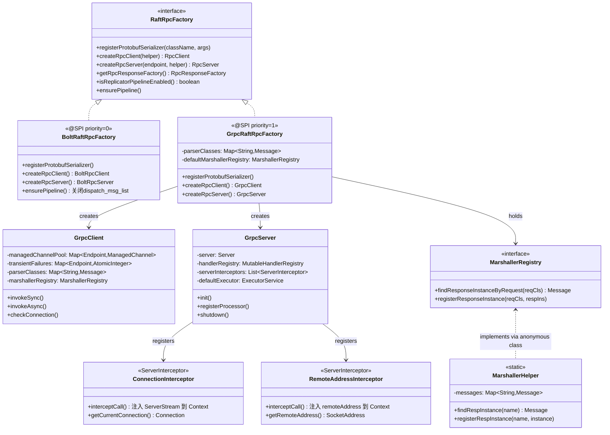
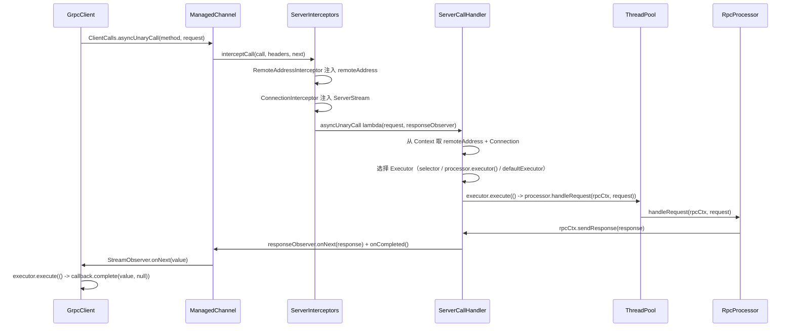

# S6：gRPC RPC 实现（对比 Bolt）

> 归属：补入 `10-rpc-layer/` 目录
>
> 核心源码：`jraft-extension/rpc-grpc-impl/`（~43KB）

---

## 1. 问题推导：为什么需要两套 RPC 框架？

【问题】JRaft 最初基于 SOFABolt 构建 RPC 层，但随着云原生场景的普及，出现了新需求：

- **跨语言互通**：Bolt 是 Java 私有协议，gRPC 基于 HTTP/2 + Protobuf，天然支持多语言
- **云原生兼容**：Kubernetes 生态、Service Mesh（Istio）对 HTTP/2 有原生支持
- **流式传输**：gRPC 支持双向流，Bolt 不支持

【需要什么信息】→ 需要一套抽象层，让上层 Raft 逻辑不感知底层 RPC 框架的差异

【推导出的结构】→ 定义 `RaftRpcFactory` SPI 接口，通过 `JRaftServiceLoader` 按优先级加载实现

【真实设计】：
- `BoltRaftRpcFactory`（`@SPI`，priority=0）：默认实现，基于 SOFABolt
- `GrpcRaftRpcFactory`（`@SPI(priority=1)`）：gRPC 扩展，优先级更高，引入依赖后自动替换 Bolt

**切换方式**：在 `pom.xml` 中引入 `jraft-extension/rpc-grpc-impl` 依赖，SPI 自动选择 `GrpcRaftRpcFactory`（priority=1 > 0）。

---

## 2. 核心类关系图



---

## 3. SPI 加载机制：如何自动切换 RPC 框架

**源码**：`RpcFactoryHelper.java:27`、`META-INF/services/com.alipay.sofa.jraft.rpc.RaftRpcFactory`

```java
// RpcFactoryHelper.java:27
private static final RaftRpcFactory RPC_FACTORY =
    JRaftServiceLoader.load(RaftRpcFactory.class).first();  // 类加载时执行，选 priority 最高的实现
```

两个 `META-INF/services/` 注册文件：

```
# jraft-core/META-INF/services/com.alipay.sofa.jraft.rpc.RaftRpcFactory
com.alipay.sofa.jraft.rpc.impl.BoltRaftRpcFactory   ← @SPI，priority=0

# jraft-extension/rpc-grpc-impl/META-INF/services/com.alipay.sofa.jraft.rpc.RaftRpcFactory
com.alipay.sofa.jraft.rpc.impl.GrpcRaftRpcFactory   ← @SPI(priority=1)
```

**加载逻辑**：`JRaftServiceLoader.first()` 遍历所有实现，按 `@SPI.priority` 降序排列，返回 priority 最高的实例。引入 grpc 模块后，classpath 中同时存在两个注册文件，`GrpcRaftRpcFactory`（priority=1）自动胜出。

---

## 4. 序列化注册机制：Bolt vs gRPC 的根本差异

这是两套框架最核心的差异点。

### 4.1 Bolt 的序列化注册

**源码**：`BoltRaftRpcFactory.java:52`、`ProtobufSerializer.java`

```java
// BoltRaftRpcFactory.java:52
@Override
public void registerProtobufSerializer(final String className, final Object... args) {
    // 向 Bolt 的全局序列化管理器注册：className → ProtobufSerializer 单例
    CustomSerializerManager.registerCustomSerializer(className, ProtobufSerializer.INSTANCE);
}
```

Bolt 的序列化是**全局注册**：`className → 序列化器`，序列化器负责把 Java 对象转成字节流。Bolt 自己管理请求/响应的类型映射（通过消息头中的 className 字段）。

### 4.2 gRPC 的序列化注册

**源码**：`GrpcRaftRpcFactory.java:75`、`MarshallerHelper.java:36-68`

```java
// GrpcRaftRpcFactory.java:75-78
@Override
public void registerProtobufSerializer(final String className, final Object... args) {
    // args[0] 是该消息类的 defaultInstance（Protobuf 的 Message 对象）
    this.parserClasses.put(className, (Message) args[0]);  // 77 ← 存入 parserClasses
}
```

gRPC 的序列化是**双向注册**：
1. `parserClasses`（`Map<String, Message>`）：`请求类名 → 请求的 defaultInstance`，用于构建 `MethodDescriptor` 的 requestMarshaller
2. `MarshallerHelper.messages`（`Map<String, Message>`）：`请求类名 → 响应的 defaultInstance`，用于构建 responseMarshaller

**为什么需要 defaultInstance？** gRPC 的 `ProtoUtils.marshaller(Message)` 需要一个 Protobuf Message 的默认实例来获取 `Parser`，从而反序列化字节流。

### 4.3 注册触发时机

**源码**：`ProtobufMsgFactory.java:55-78`（静态初始化块）

```java
// ProtobufMsgFactory.java:55-78（静态初始化块，类加载时执行）
static {
    final FileDescriptorSet descriptorSet = FileDescriptorSet.parseFrom(
        ProtoBufFile.class.getResourceAsStream("/raft.desc"));  // 56 ← 读取编译好的 proto 描述文件
    final RaftRpcFactory rpcFactory = RpcFactoryHelper.rpcFactory();  // 59 ← 获取当前 SPI 实现
    for (final FileDescriptorProto fdp : descriptorSet.getFileList()) {
        for (final Descriptor descriptor : fd.getMessageTypes()) {
            final String className = fdp.getOptions().getJavaPackage() + "."
                + fdp.getOptions().getJavaOuterClassname() + "$" + descriptor.getName();  // 68
            final MethodHandle getInstanceHandler = MethodHandles.lookup().findStatic(
                clazz, "getDefaultInstance", methodType(clazz));  // 72
            rpcFactory.registerProtobufSerializer(className, getInstanceHandler.invoke());  // 77 ← 触发注册
        }
    }
}
```

**关键设计**：`ProtobufMsgFactory` 的静态初始化块解析 `raft.desc`（所有 proto 文件编译后的描述符集合），遍历每个消息类型，调用 `rpcFactory.registerProtobufSerializer()`。这样无论是 Bolt 还是 gRPC，都通过同一个入口完成注册，上层代码无需感知差异。

---

## 5. GrpcRaftRpcFactory：工厂实现

**源码**：`GrpcRaftRpcFactory.java:41-121`

```java
// GrpcRaftRpcFactory.java:41-55
@SPI(priority = 1)  // 41
public class GrpcRaftRpcFactory implements RaftRpcFactory {  // 42

    static final String  FIXED_METHOD_NAME              = "_call";  // 44 ← 所有方法共用同一个 gRPC 方法名
    static final int     RPC_SERVER_PROCESSOR_POOL_SIZE = SystemPropertyUtil.getInt(
                             "jraft.grpc.default_rpc_server_processor_pool_size", 100);  // 45-48
    static final int     RPC_MAX_INBOUND_MESSAGE_SIZE   = SystemPropertyUtil.getInt(
                             "jraft.grpc.max_inbound_message_size.bytes", 4 * 1024 * 1024);  // 50-53 ← 默认 4MB
    static final RpcResponseFactory RESPONSE_FACTORY    = new GrpcResponseFactory();  // 55
```

**`FIXED_METHOD_NAME = "_call"` 的设计意图**：gRPC 通常每个 RPC 方法对应一个 `ServiceDefinition`，但 JRaft 把**每个请求类型**都注册为一个独立的 `ServiceDefinition`（service name = 请求类全名），方法名统一为 `_call`。这样避免了为每种请求类型单独定义 proto service，实现了动态注册。

### 5.1 createRpcServer()

**源码**：`GrpcRaftRpcFactory.java:89-104`

```java
// GrpcRaftRpcFactory.java:89-104
@Override
public RpcServer createRpcServer(final Endpoint endpoint, final ConfigHelper<RpcServer> helper) {
    final int port = Requires.requireNonNull(endpoint, "endpoint").getPort();  // 90
    Requires.requireTrue(port > 0 && port < 0xFFFF, "port out of range:" + port);  // 91
    final MutableHandlerRegistry handlerRegistry = new MutableHandlerRegistry();  // 92 ← 动态注册表，支持运行时添加 service
    InetSocketAddress address = StringUtils.isNotBlank(endpoint.getIp()) ?
        new InetSocketAddress(endpoint.getIp(), port) : new InetSocketAddress(port);  // 93-94
    final Server server = NettyServerBuilder.forAddress(address)  // 95 ← 基于 Netty 的 gRPC Server
        .fallbackHandlerRegistry(handlerRegistry)  // 96 ← 动态注册表作为 fallback
        .directExecutor()  // 97 ← I/O 线程直接执行（后续由 GrpcServer 内部线程池接管）
        .maxInboundMessageSize(RPC_MAX_INBOUND_MESSAGE_SIZE)  // 98
        .build();
    final RpcServer rpcServer = new GrpcServer(server, handlerRegistry, this.parserClasses, getMarshallerRegistry());  // 100
    if (helper != null) { helper.config(rpcServer); }  // 101-103
    return rpcServer;
}
```

**分支穷举清单**：
- □ `endpoint == null` → `Requires.requireNonNull` 抛 `IllegalArgumentException`（`GrpcRaftRpcFactory.java:90`）
- □ `port <= 0 || port >= 0xFFFF` → `Requires.requireTrue` 抛 `IllegalArgumentException`（`GrpcRaftRpcFactory.java:91`）
- □ `endpoint.getIp()` 非空 → 绑定指定 IP + port（`GrpcRaftRpcFactory.java:93`）
- □ `endpoint.getIp()` 为空 → 绑定所有网卡的 port（`GrpcRaftRpcFactory.java:94`）
- □ `helper != null` → 调用 `helper.config(rpcServer)` 做额外配置（`GrpcRaftRpcFactory.java:101`）
- □ `helper == null` → 跳过配置（`GrpcRaftRpcFactory.java:101`）

### 5.2 createRpcClient()

**源码**：`GrpcRaftRpcFactory.java:80-87`

```java
// GrpcRaftRpcFactory.java:80-88
@Override
public RpcClient createRpcClient(final ConfigHelper<RpcClient> helper) {
    final RpcClient rpcClient = new GrpcClient(this.parserClasses, getMarshallerRegistry());  // 81
    if (helper != null) { helper.config(rpcClient); }  // 83-85
    return rpcClient;  // 87
}
```

注意：`GrpcClient.init()` 是空实现（`return true`），所有初始化在构造函数中完成。

---

## 6. GrpcServer：服务端实现

**源码**：`GrpcServer.java:57-240`

### 6.1 核心字段

**源码**：`GrpcServer.java:67-75`

| 字段 | 类型 | 作用 | 源码行 |
|------|------|------|--------|
| `server` | `io.grpc.Server` | gRPC 底层 Server（Netty 实现）| `GrpcServer.java:67` |
| `handlerRegistry` | `MutableHandlerRegistry` | 动态 ServiceDefinition 注册表 | `GrpcServer.java:68` |
| `parserClasses` | `Map<String, Message>` | 请求类名 → 请求 defaultInstance | `GrpcServer.java:69` |
| `marshallerRegistry` | `MarshallerRegistry` | 请求类名 → 响应 defaultInstance | `GrpcServer.java:70` |
| `serverInterceptors` | `CopyOnWriteArrayList<ServerInterceptor>` | 拦截器链（线程安全）| `GrpcServer.java:71` |
| `closedEventListeners` | `CopyOnWriteArrayList<ConnectionClosedEventListener>` | 连接关闭事件监听器 | `GrpcServer.java:72` |
| `started` | `AtomicBoolean` | 启动状态（保证 init/shutdown 幂等）| `GrpcServer.java:73` |
| `defaultExecutor` | `ExecutorService` | 默认请求处理线程池 | `GrpcServer.java:75` |

### 6.2 init() 启动流程

**源码**：`GrpcServer.java:87-115`

**分支穷举清单**：
- □ `started.compareAndSet(false, true)` 失败（已启动）→ throw `IllegalStateException("grpc server has started")`（`GrpcServer.java:88-90`）
- □ 正常 → 创建 `defaultExecutor`（SynchronousQueue + 拒绝策略抛 `RejectedExecutionException`）（`GrpcServer.java:92-105`）
- □ `server.start()` 抛 `IOException` → `ThrowUtil.throwException(e)` 重新抛出（`GrpcServer.java:109-111`）
- □ `server.start()` 成功 → return true（`GrpcServer.java:113`）

```java
// GrpcServer.java:87-115
@Override
public boolean init(final Void opts) {
    if (!this.started.compareAndSet(false, true)) {  // 88 ← 幂等保护
        throw new IllegalStateException("grpc server has started");  // 89
    }
    this.defaultExecutor = ThreadPoolUtil.newBuilder()
        .poolName(EXECUTOR_NAME)
        .coreThreads(Math.min(20, GrpcRaftRpcFactory.RPC_SERVER_PROCESSOR_POOL_SIZE / 5))  // 94 ← min(20, 100/5)=20
        .maximumThreads(GrpcRaftRpcFactory.RPC_SERVER_PROCESSOR_POOL_SIZE)  // 96 ← 最大 100
        .workQueue(new SynchronousQueue<>())  // 99 ← 无缓冲队列，满了直接拒绝
        .rejectedHandler((r, executor) -> {
            throw new RejectedExecutionException(...);  // 101-103 ← 拒绝时抛异常（不丢任务）
        }).build();
    try {
        this.server.start();  // 107
    } catch (final IOException e) {
        ThrowUtil.throwException(e);  // 109 ← 包装成 RuntimeException 重新抛出
    }
    return true;
}
```

**为什么用 `SynchronousQueue`？** 不缓冲任务，直接交给线程执行。如果所有线程都忙，立即触发拒绝策略（抛异常），让调用方感知到服务端过载，而不是无限堆积任务。

### 6.3 registerProcessor()：核心注册逻辑

**源码**：`GrpcServer.java:131-208`

这是 gRPC 实现中最复杂的方法，将 JRaft 的 `RpcProcessor` 适配为 gRPC 的 `ServerServiceDefinition`。

```java
// GrpcServer.java:131-208
@Override
public void registerProcessor(final RpcProcessor processor) {
    final String interest = processor.interest();  // 132 ← 请求类全名，如 "com.alipay.sofa.jraft.rpc.RpcRequests$AppendEntriesRequest"
    final Message reqIns = Requires.requireNonNull(this.parserClasses.get(interest), ...);  // 133

    // 1. 构建 MethodDescriptor（描述这个 RPC 方法的元数据）
    final MethodDescriptor<Message, Message> method = MethodDescriptor
        .<Message, Message>newBuilder()
        .setType(MethodDescriptor.MethodType.UNARY)  // 115 ← 一元 RPC（请求-响应模式）
        .setFullMethodName(MethodDescriptor.generateFullMethodName(
            processor.interest(), GrpcRaftRpcFactory.FIXED_METHOD_NAME))  // 116-117 ← "请求类名/_call"
        .setRequestMarshaller(ProtoUtils.marshaller(reqIns))  // 118 ← 请求序列化器
        .setResponseMarshaller(ProtoUtils.marshaller(
            this.marshallerRegistry.findResponseInstanceByRequest(interest)))  // 119-120 ← 响应序列化器
        .build();

    // 2. 构建 ServerCallHandler（处理请求的 lambda）
    final ServerCallHandler<Message, Message> handler = ServerCalls.asyncUnaryCall(
        (request, responseObserver) -> {
            final SocketAddress remoteAddress = RemoteAddressInterceptor.getRemoteAddress();  // 145 ← 从 Context 取
            final Connection conn = ConnectionInterceptor.getCurrentConnection(this.closedEventListeners);  // 146

            // 3. 构建 RpcContext（适配层）
            final RpcContext rpcCtx = new RpcContext() {
                @Override
                public void sendResponse(final Object responseObj) {
                    try {
                        responseObserver.onNext((Message) responseObj);  // 153 ← 发送响应
                        responseObserver.onCompleted();  // 154 ← 标记完成
                    } catch (final Throwable t) {
                        LOG.warn("[GRPC] failed to send response.", t);  // 156 ← catch Throwable，吞掉异常
                    }
                }
                // ...
            };

            // 4. 选择执行线程
            final RpcProcessor.ExecutorSelector selector = processor.executorSelector();
            Executor executor;
            if (selector != null && request instanceof RpcRequests.AppendEntriesRequest) {  // 172 ← 只有 AppendEntries 才走 selector
                // 构建 AppendEntriesRequestHeader 用于 selector 选择
                executor = selector.select(interest, header.build());  // 180
            } else {
                executor = processor.executor();  // 182 ← 其他请求用 processor 自己的 executor
            }
            if (executor == null) {
                executor = this.defaultExecutor;  // 185 ← 兜底：用 Server 的默认线程池
            }
            if (executor != null) {
                executor.execute(() -> processor.handleRequest(rpcCtx, request));  // 188
            } else {
                processor.handleRequest(rpcCtx, request);  // 190 ← executor 为 null 时直接在当前线程执行
            }
        });

    // 5. 注册 ServiceDefinition
    final ServerServiceDefinition serviceDef = ServerServiceDefinition
        .builder(interest)  // 200 ← service name = 请求类全名
        .addMethod(method, handler)
        .build();
    this.handlerRegistry.addService(
        ServerInterceptors.intercept(serviceDef, this.serverInterceptors.toArray(...)));  // 204-205
}
```

**分支穷举清单**：
- □ `parserClasses.get(interest) == null` → `Requires.requireNonNull` 抛 `IllegalArgumentException`（`GrpcServer.java:133`）
- □ `selector != null && request instanceof AppendEntriesRequest` → 用 selector 选 executor（`GrpcServer.java:172-180`）
- □ `selector == null || request 不是 AppendEntriesRequest` → 用 `processor.executor()`（`GrpcServer.java:182`）
- □ `executor == null`（两者都为 null）→ 用 `defaultExecutor`（`GrpcServer.java:184-185`）
- □ `executor != null` → `executor.execute(() -> processor.handleRequest(rpcCtx, request))`（`GrpcServer.java:188`）
- □ `executor == null`（defaultExecutor 也为 null，理论上不会发生）→ 直接在当前线程执行（`GrpcServer.java:190`）
- □ `sendResponse` 中 catch `Throwable` → `LOG.warn`，吞掉异常（`GrpcServer.java:156`）

**为什么只有 `AppendEntriesRequest` 走 `ExecutorSelector`？** `AppendEntriesRequest` 携带了 `groupId` 和 `peerId`，`ExecutorSelector` 可以根据这些信息选择对应 Raft Group 的专属线程池，避免不同 Group 的请求互相干扰。其他请求（如 `RequestVoteRequest`）没有这种需求，直接用 processor 的默认 executor。

### 6.4 shutdown() 停机流程

**源码**：`GrpcServer.java:116-122`

**分支穷举清单**：
- □ `started.compareAndSet(true, false)` 失败（已停止）→ return（幂等）（`GrpcServer.java:117-119`）
- □ 正常 → 先关 `defaultExecutor`，再关 `server`（`GrpcServer.java:120-121`）

```java
// GrpcServer.java:116-122
@Override
public void shutdown() {
    if (!this.started.compareAndSet(true, false)) {  // 117 ← 幂等保护
        return;  // 118
    }
    ExecutorServiceHelper.shutdownAndAwaitTermination(this.defaultExecutor);  // 120 ← 先停线程池
    GrpcServerHelper.shutdownAndAwaitTermination(this.server);  // 121 ← 再停 gRPC Server
}
```

---

## 7. GrpcClient：客户端实现

**源码**：`GrpcClient.java:57-359`

### 7.1 核心字段

**源码**：`GrpcClient.java:65-72`

| 字段 | 类型 | 作用 | 源码行 |
|------|------|------|--------|
| `RESET_CONN_THRESHOLD` | `int`（默认 2）| 连续失败多少次后重建 Channel | `GrpcClient.java:65` |
| `managedChannelPool` | `ConcurrentHashMap<Endpoint, ManagedChannel>` | Channel 连接池（每个 Endpoint 一个 Channel）| `GrpcClient.java:68` |
| `transientFailures` | `ConcurrentHashMap<Endpoint, AtomicInteger>` | 连接失败计数器（用于触发 Channel 重建）| `GrpcClient.java:69` |
| `parserClasses` | `Map<String, Message>` | 请求类名 → 请求 defaultInstance | `GrpcClient.java:70` |
| `marshallerRegistry` | `MarshallerRegistry` | 请求类名 → 响应 defaultInstance | `GrpcClient.java:71` |
| `replicatorGroup` | `volatile ReplicatorGroup` | 连接恢复时通知 ReplicatorGroup | `GrpcClient.java:72` |

### 7.2 invokeAsync()：异步调用

**源码**：`GrpcClient.java:138-171`

```java
// GrpcClient.java:138-171
@Override
public void invokeAsync(final Endpoint endpoint, final Object request, final InvokeContext ctx,
                        final InvokeCallback callback, final long timeoutMs) {
    Requires.requireNonNull(endpoint, "endpoint");  // 139
    Requires.requireNonNull(request, "request");  // 140

    final Executor executor = callback.executor() != null ? callback.executor() : DirectExecutor.INSTANCE;  // 143

    final Channel ch = getCheckedChannel(endpoint);  // 145
    if (ch == null) {  // 146 ← 连接不可用
        executor.execute(() -> callback.complete(null, new RemotingException("Fail to connect: " + endpoint)));  // 147
        return;
    }

    final MethodDescriptor<Message, Message> method = getCallMethod(request);  // 151 ← 动态构建 MethodDescriptor
    final CallOptions callOpts = CallOptions.DEFAULT.withDeadlineAfter(timeoutMs, TimeUnit.MILLISECONDS);  // 152

    ClientCalls.asyncUnaryCall(ch.newCall(method, callOpts), (Message) request, new StreamObserver<Message>() {
        @Override
        public void onNext(final Message value) {  // 157 ← 收到响应
            executor.execute(() -> callback.complete(value, null));  // 158
        }
        @Override
        public void onError(final Throwable throwable) {  // 161 ← RPC 失败
            executor.execute(() -> callback.complete(null, throwable));  // 162
        }
        @Override
        public void onCompleted() {}  // 165 ← NO-OP（UNARY 模式下 onNext 后紧跟 onCompleted）
    });
}
```

**分支穷举清单**：
- □ `callback.executor() != null` → 使用 callback 的 executor（`GrpcClient.java:143`）
- □ `callback.executor() == null` → 使用 `DirectExecutor.INSTANCE`（在当前线程执行回调）（`GrpcClient.java:143`）
- □ `getCheckedChannel(endpoint) == null`（连接不可用）→ executor 执行 `callback.complete(null, RemotingException)`（`GrpcClient.java:146-148`）
- □ `getCheckedChannel(endpoint) != null` → 发起 `asyncUnaryCall`（`GrpcClient.java:154`）
- □ `StreamObserver.onNext(value)` → `executor.execute(() -> callback.complete(value, null))`（`GrpcClient.java:158`）
- □ `StreamObserver.onError(throwable)` → `executor.execute(() -> callback.complete(null, throwable))`（`GrpcClient.java:162`）
- □ `StreamObserver.onCompleted()` → NO-OP（`GrpcClient.java:165`）

### 7.3 invokeSync()：同步调用（基于 invokeAsync 封装）

**源码**：`GrpcClient.java:114-137`

```java
// GrpcClient.java:114-137
@Override
public Object invokeSync(final Endpoint endpoint, final Object request, final InvokeContext ctx,
                         final long timeoutMs) throws RemotingException {
    final CompletableFuture<Object> future = new CompletableFuture<>();  // 115

    invokeAsync(endpoint, request, ctx, (result, err) -> {  // 117
        if (err == null) { future.complete(result); }
        else { future.completeExceptionally(err); }
    }, timeoutMs);

    try {
        return future.get(timeoutMs, TimeUnit.MILLISECONDS);  // 124
    } catch (final TimeoutException e) {
        future.cancel(true);  // 126
        throw new InvokeTimeoutException(e);  // 127
    } catch (final Throwable t) {
        future.cancel(true);  // 130
        throw new RemotingException(t);  // 131
    }
}
```

**分支穷举清单**：
- □ `future.get()` 正常返回 → 返回结果（`GrpcClient.java:124`）
- □ catch `TimeoutException` → `future.cancel(true)` + throw `InvokeTimeoutException`（`GrpcClient.java:126-127`）
- □ catch `Throwable`（包括 `ExecutionException`、`InterruptedException`）→ `future.cancel(true)` + throw `RemotingException`（`GrpcClient.java:130-131`）

### 7.4 Channel 连接管理：checkConnectivity()

**源码**：`GrpcClient.java:320-358`

这是 gRPC 客户端最精妙的设计——**基于失败计数的 Channel 自动重建机制**。

```java
// GrpcClient.java:320-358
private boolean checkConnectivity(final Endpoint endpoint, final ManagedChannel ch) {
    final ConnectivityState st = ch.getState(false);  // 321 ← 不触发连接，只查询当前状态

    if (st != ConnectivityState.TRANSIENT_FAILURE && st != ConnectivityState.SHUTDOWN) {
        return true;  // 324 ← 正常状态（IDLE/CONNECTING/READY）直接返回 true
    }

    final int c = incConnFailuresCount(endpoint);  // 327 ← 失败计数 +1
    if (c < RESET_CONN_THRESHOLD) {  // 328 ← 默认阈值 2
        if (c == RESET_CONN_THRESHOLD - 1) {  // 329 ← 第 1 次失败（c=1）
            ch.resetConnectBackoff();  // 332 ← 跳过退避等待，立即重连
        }
        return true;  // 334 ← 还没到阈值，允许继续使用（gRPC 会自动重连）
    }

    // 达到阈值，重建 Channel
    clearConnFailuresCount(endpoint);  // 337
    final ManagedChannel removedCh = removeChannel(endpoint);  // 339 ← 从池中移除

    if (removedCh == null) {
        return false;  // 342 ← 已被其他线程移除，直接返回 false
    }

    LOG.warn("Channel[{}] in [INACTIVE] state {} times, it has been removed from the pool.", endpoint, c);  // 345

    if (removedCh != ch) {
        ManagedChannelHelper.shutdownAndAwaitTermination(removedCh, 100);  // 348 ← 关闭已被替换的旧 Channel
    }
    ManagedChannelHelper.shutdownAndAwaitTermination(ch, 100);  // 351 ← 关闭当前失败的 Channel

    return false;  // 353
}
```

**分支穷举清单**：
- □ `st != TRANSIENT_FAILURE && st != SHUTDOWN` → return true（`GrpcClient.java:323-324`）
- □ `c < RESET_CONN_THRESHOLD` 且 `c == RESET_CONN_THRESHOLD - 1`（第 1 次失败，c=1）→ `ch.resetConnectBackoff()` + return true（`GrpcClient.java:329-334`）
- □ `c < RESET_CONN_THRESHOLD` 且 `c != RESET_CONN_THRESHOLD - 1` → return true（`GrpcClient.java:334`）
- □ `c >= RESET_CONN_THRESHOLD`，`removedCh == null`（已被其他线程移除）→ return false（`GrpcClient.java:341-342`）
- □ `c >= RESET_CONN_THRESHOLD`，`removedCh != ch`（已被替换为新 Channel）→ 关闭 removedCh + 关闭 ch + return false（`GrpcClient.java:347-351`）
- □ `c >= RESET_CONN_THRESHOLD`，`removedCh == ch`（正常情况）→ 关闭 ch + return false（`GrpcClient.java:351`）

### 7.5 Channel 状态机监听：onStateChanged()

**源码**：`GrpcClient.java:228-252`

gRPC 的 `ManagedChannel` 有 5 种状态：`IDLE → CONNECTING → READY → TRANSIENT_FAILURE → SHUTDOWN`。`GrpcClient` 通过 `notifyWhenStateChanged()` 注册回调，实现状态机监听。

```java
// GrpcClient.java:228-252
private void onStateChanged(final Endpoint endpoint, final ManagedChannel ch) {
    final ConnectivityState state = ch.getState(false);  // 229

    switch (state) {
        case READY:  // 233 ← 连接建立成功
            notifyReady(endpoint);  // 234 ← 通知 ReplicatorGroup 检查 Replicator
            notifyWhenStateChanged(ConnectivityState.READY, endpoint, ch);  // 235 ← 继续监听
            break;
        case TRANSIENT_FAILURE:  // 237 ← 连接暂时失败（会自动重试）
            notifyFailure(endpoint);  // 238 ← LOG.warn
            notifyWhenStateChanged(ConnectivityState.TRANSIENT_FAILURE, endpoint, ch);  // 239
            break;
        case SHUTDOWN:  // 241 ← Channel 已关闭（不可恢复）
            notifyShutdown(endpoint);  // 242 ← LOG.warn，不再监听
            break;
        case CONNECTING:  // 244 ← 正在连接中
            notifyWhenStateChanged(ConnectivityState.CONNECTING, endpoint, ch);  // 245
            break;
        case IDLE:  // 247 ← 空闲（无活跃 RPC）
            notifyWhenStateChanged(ConnectivityState.IDLE, endpoint, ch);  // 248
            break;
    }
}
```

**`notifyReady()` 的关键逻辑**（`GrpcClient.java:254-275`）：连接恢复时，通知 `ReplicatorGroup.checkReplicator(peer, true)`，让 Replicator 重新开始日志复制。这是 gRPC 实现中**连接恢复自愈**的核心机制。

---

## 8. 两个 ServerInterceptor：拦截器链

gRPC Server 在构造时注册了两个默认拦截器（`GrpcServer.java:82`，`registerDefaultServerInterceptor()`）：

### 8.1 RemoteAddressInterceptor

**源码**：`RemoteAddressInterceptor.java:36-51`

```java
// RemoteAddressInterceptor.java:36-51
public class RemoteAddressInterceptor implements ServerInterceptor {
    private static final Context.Key<SocketAddress> REMOTE_ADDRESS = Context.key("remote-address");  // 38

    @Override
    public <ReqT, RespT> ServerCall.Listener<ReqT> interceptCall(...) {
        final Context ctx = Context.current()
            .withValue(REMOTE_ADDRESS, call.getAttributes().get(Grpc.TRANSPORT_ATTR_REMOTE_ADDR));  // 44-45
        return Contexts.interceptCall(ctx, call, headers, next);  // 46
    }

    public static SocketAddress getRemoteAddress() {
        return REMOTE_ADDRESS.get();  // 50 ← 在 handler 中调用，从 Context 取出远端地址
    }
}
```

**作用**：把客户端 IP:Port 注入 gRPC Context，让 `registerProcessor()` 中的 `RpcContext.getRemoteAddress()` 能获取到。

### 8.2 ConnectionInterceptor

**源码**：`ConnectionInterceptor.java:40-63`

```java
// ConnectionInterceptor.java:40-63
public class ConnectionInterceptor implements ServerInterceptor {
    static final Context.Key<ServerStream> STREAM = Context.key("current-stream");  // 42

    @Override
    public <ReqT, RespT> ServerCall.Listener<ReqT> interceptCall(...) {
        Context ctx = Context.current();
        final ServerStream stream = ServerStreamHelper.getServerStream(call);  // 47 ← 通过反射获取底层 Netty Stream
        if (stream != null) {
            ctx = ctx.withValue(STREAM, stream);  // 49
        }
        return Contexts.interceptCall(ctx, call, headers, next);
    }

    public static Connection getCurrentConnection(final List<ConnectionClosedEventListener> listeners) {
        final ServerStream stream = ConnectionInterceptor.STREAM.get();  // 57
        if (stream != null) {
            return NettyConnectionHelper.getOrCreateConnection(stream, listeners);  // 59 ← 从 Netty Channel 创建 Connection
        }
        return null;  // 61
    }
}
```

**作用**：把底层 Netty `ServerStream` 注入 Context，让 `RpcContext.getConnection()` 能获取到 `Connection` 对象（用于连接关闭事件通知）。

**为什么需要 `ServerStreamHelper`（反射）？** gRPC 的公开 API 不暴露底层 `ServerStream`，JRaft 通过 `io.grpc.internal.ServerStreamHelper`（内部类）用反射获取，这是一个 hack，依赖 gRPC 内部实现。

---

## 9. ManagedChannelHelper：Channel 优雅关闭

**源码**：`ManagedChannelHelper.java:44-74`

两阶段关闭策略（与 `ExecutorServiceHelper` 完全相同的模式）：

```java
// ManagedChannelHelper.java:44-74
public static boolean shutdownAndAwaitTermination(final ManagedChannel mChannel, final long timeoutMillis) {
    if (mChannel == null) { return true; }  // 45 ← null 安全
    mChannel.shutdown();  // 47 ← 阶段一：拒绝新 RPC，等待进行中的 RPC 完成
    final long phaseOne = timeoutMillis / 5;  // 50 ← 阶段一超时 = 总超时 / 5
    try {
        if (mChannel.awaitTermination(phaseOne, unit)) { return true; }  // 52 ← 阶段一成功
        mChannel.shutdownNow();  // 54 ← 阶段二：强制取消所有进行中的 RPC
        if (mChannel.awaitTermination(timeoutMillis - phaseOne, unit)) { return true; }  // 56 ← 阶段二成功
        LOG.warn("Fail to shutdown managed channel: {}.", mChannel);  // 58
    } catch (final InterruptedException e) {
        mChannel.shutdownNow();  // 61 ← 中断时也强制关闭
        Thread.currentThread().interrupt();  // 62 ← 恢复中断状态
    }
    return false;
}
```

**分支穷举清单**：
- □ `mChannel == null` → return true（`ManagedChannelHelper.java:45`）
- □ `awaitTermination(phaseOne)` 成功 → return true（`ManagedChannelHelper.java:52`）
- □ `awaitTermination(phaseOne)` 超时 → `shutdownNow()` + `awaitTermination(remaining)`（`ManagedChannelHelper.java:54-56`）
- □ `awaitTermination(remaining)` 成功 → return true（`ManagedChannelHelper.java:56`）
- □ `awaitTermination(remaining)` 超时 → LOG.warn + return false（`ManagedChannelHelper.java:58`）
- □ catch `InterruptedException` → `shutdownNow()` + `Thread.currentThread().interrupt()` + return false（`ManagedChannelHelper.java:61-62`）

---

## 10. Bolt vs gRPC 横向对比

| 维度 | Bolt（`BoltRaftRpcFactory`）| gRPC（`GrpcRaftRpcFactory`）|
|------|---------------------------|---------------------------|
| **传输协议** | 自定义二进制协议（基于 Netty）| HTTP/2（基于 Netty）|
| **序列化** | `ProtobufSerializer`（自定义）| `ProtoUtils.marshaller()`（gRPC 原生）|
| **序列化注册** | `CustomSerializerManager.registerCustomSerializer(className, serializer)` | `parserClasses.put(className, defaultInstance)` + `MarshallerHelper.messages` |
| **连接模型** | Bolt 连接池（自动管理）| `ConcurrentHashMap<Endpoint, ManagedChannel>`（每 Endpoint 一个 Channel）|
| **连接恢复** | Bolt 内置重连（`CONN_RECONNECT_SWITCH`）| 状态机监听 + `resetConnectBackoff()` + Channel 重建 |
| **请求路由** | 消息头中的 className 字段 | `MethodDescriptor.fullMethodName = "请求类名/_call"` |
| **服务注册** | `registerUserProcessor(AsyncUserProcessor)` | `handlerRegistry.addService(ServerServiceDefinition)` |
| **ExecutorSelector** | `AsyncUserProcessor.getExecutorSelector()` | 仅 `AppendEntriesRequest` 走 selector，其他走 `processor.executor()` |
| **Pipeline 支持** | 需要 `ensurePipeline()` 关闭 `dispatch_msg_list` | 原生支持，`isReplicatorPipelineEnabled()` 直接返回 true |
| **跨语言** | 不支持 | 支持（HTTP/2 + Protobuf）|
| **云原生兼容** | 差 | 好（Kubernetes/Istio 原生支持 HTTP/2）|
| **内部 hack** | 无 | `ServerStreamHelper`（反射获取 Netty Stream）|
| **SPI priority** | 0（默认）| 1（优先）|

### 关键差异深析：ExecutorSelector 的行为差异

**Bolt**（`BoltRpcServer.java:120-124`）：
```java
// BoltRpcServer.java:120-124
@Override
public ExecutorSelector getExecutorSelector() {
    final RpcProcessor.ExecutorSelector realSelector = processor.executorSelector();
    if (realSelector == null) { return null; }
    return realSelector::select;  // ← 所有请求类型都走 selector
}
```

**gRPC**（`GrpcServer.java:152-162`）：
```java
// GrpcServer.java:152-162
if (selector != null && request instanceof RpcRequests.AppendEntriesRequest) {
    executor = selector.select(interest, header.build());  // ← 只有 AppendEntries 走 selector
} else {
    executor = processor.executor();  // ← 其他请求走 processor 的默认 executor
}
```

**差异原因**：gRPC 版本做了优化——只有 `AppendEntriesRequest` 需要按 Raft Group 路由到专属线程池（因为它是高频请求，需要隔离），其他请求（如 `RequestVoteRequest`、`ReadIndexRequest`）频率低，不需要专属线程池。Bolt 版本没有这个优化，所有请求都走 selector。

---

## 11. 完整请求处理时序图



---

## 12. 面试高频考点 📌

**Q1：JRaft 如何通过 SPI 支持 Bolt 和 gRPC 两种 RPC 框架？**

`RaftRpcFactory` 是 SPI 接口，`BoltRaftRpcFactory`（priority=0）和 `GrpcRaftRpcFactory`（priority=1）分别在各自模块的 `META-INF/services/` 中注册。`RpcFactoryHelper` 类加载时调用 `JRaftServiceLoader.load(RaftRpcFactory.class).first()`，选 priority 最高的实现。引入 `rpc-grpc-impl` 依赖后，classpath 中同时存在两个注册文件，gRPC 自动胜出。

**Q2：gRPC 实现中，每个请求类型是如何映射到 gRPC 方法的？**

每个请求类型注册为一个独立的 `ServerServiceDefinition`，service name = 请求类全名（如 `com.alipay.sofa.jraft.rpc.RpcRequests$AppendEntriesRequest`），方法名统一为 `_call`（`FIXED_METHOD_NAME`）。客户端发请求时，通过 `MethodDescriptor.generateFullMethodName(请求类名, "_call")` 构建方法标识，服务端通过 `MutableHandlerRegistry` 动态查找对应的 handler。

**Q3：gRPC 客户端的 Channel 连接失败后如何自动恢复？**

两层机制：
1. **短期恢复**：`TRANSIENT_FAILURE` 状态下，前 `RESET_CONN_THRESHOLD-1`（默认 1）次失败，调用 `ch.resetConnectBackoff()` 跳过退避等待，让 gRPC 立即重连。
2. **长期重建**：连续失败达到 `RESET_CONN_THRESHOLD`（默认 2）次，从 `managedChannelPool` 中移除并关闭旧 Channel，下次请求时 `computeIfAbsent` 创建新 Channel。连接恢复（READY 状态）时，通知 `ReplicatorGroup.checkReplicator()` 重启日志复制。

**Q4：gRPC 和 Bolt 在 ExecutorSelector 行为上有什么差异？为什么？**

Bolt 对所有请求类型都走 `ExecutorSelector`；gRPC 只对 `AppendEntriesRequest` 走 selector，其他请求直接用 `processor.executor()`。原因：`AppendEntriesRequest` 是高频请求，需要按 Raft Group 路由到专属线程池隔离；其他请求频率低，不需要专属线程池，gRPC 版本做了这个优化。

**Q5：gRPC 实现中如何获取客户端 IP？**

通过 `RemoteAddressInterceptor`：在 `interceptCall()` 中从 `call.getAttributes().get(Grpc.TRANSPORT_ATTR_REMOTE_ADDR)` 获取远端地址，注入 gRPC Context，handler 中通过 `RemoteAddressInterceptor.getRemoteAddress()` 取出。

---

## 13. 生产踩坑 ⚠️

**⚠️ 踩坑一：gRPC 和 Bolt 不能混用**

gRPC 和 Bolt 使用不同的序列化机制（`parserClasses` vs `CustomSerializerManager`），集群中所有节点必须使用同一种 RPC 框架。混用会导致序列化失败，表现为 `null default instance` 异常。

**⚠️ 踩坑二：`maxInboundMessageSize` 默认 4MB 可能不够**

`RPC_MAX_INBOUND_MESSAGE_SIZE` 默认 4MB（`GrpcRaftRpcFactory.java:50-53`）。当 `AppendEntriesRequest` 携带大量日志条目时，单个请求可能超过 4MB，导致 gRPC 抛 `StatusRuntimeException: RESOURCE_EXHAUSTED: gRPC message exceeds maximum size`。需要通过 JVM 参数 `-Djraft.grpc.max_inbound_message_size.bytes=xxx` 调大。

**⚠️ 踩坑三：`ConnectionInterceptor` 依赖 gRPC 内部 API**

`ServerStreamHelper.getServerStream(call)` 通过反射访问 `io.grpc.internal` 包的内部类，升级 gRPC 版本时可能因内部 API 变更而失效，表现为 `Connection` 为 null，连接关闭事件无法触发。

**⚠️ 踩坑四：Channel 重建期间请求失败**

当 Channel 达到 `RESET_CONN_THRESHOLD` 次失败被移除后，下次请求会触发 `computeIfAbsent` 创建新 Channel，但新 Channel 初始状态是 `IDLE`，需要等待连接建立（`CONNECTING → READY`）。在此期间，`checkConnectivity()` 返回 true（IDLE 状态），但实际 RPC 可能因连接未就绪而失败，表现为短暂的请求超时。
