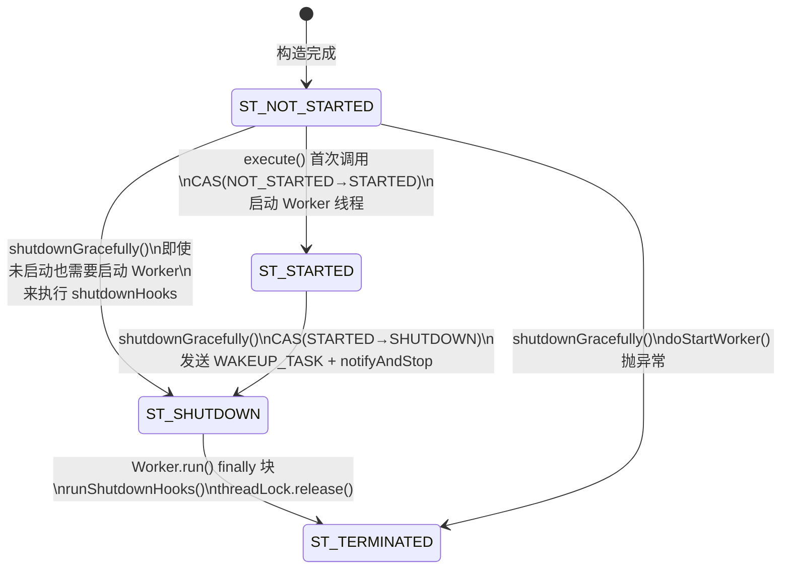
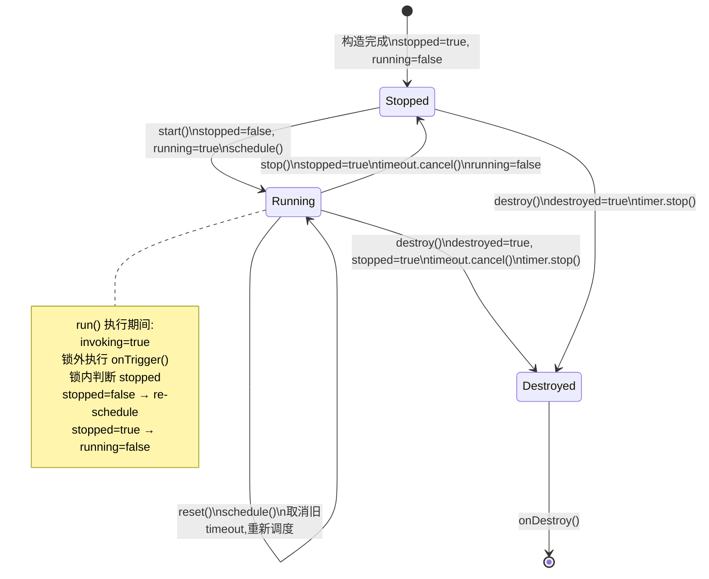
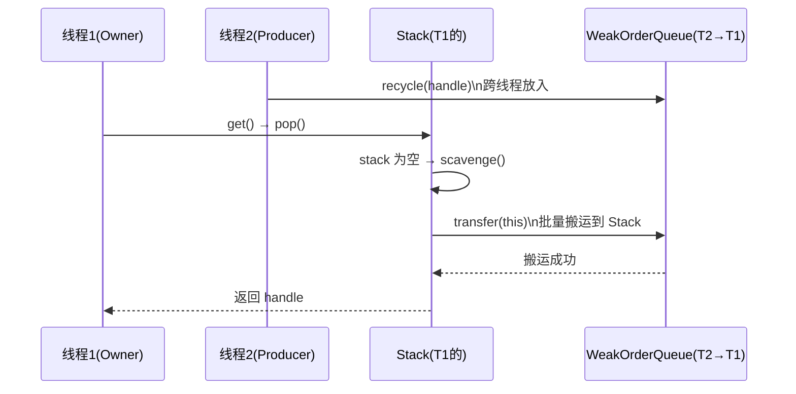
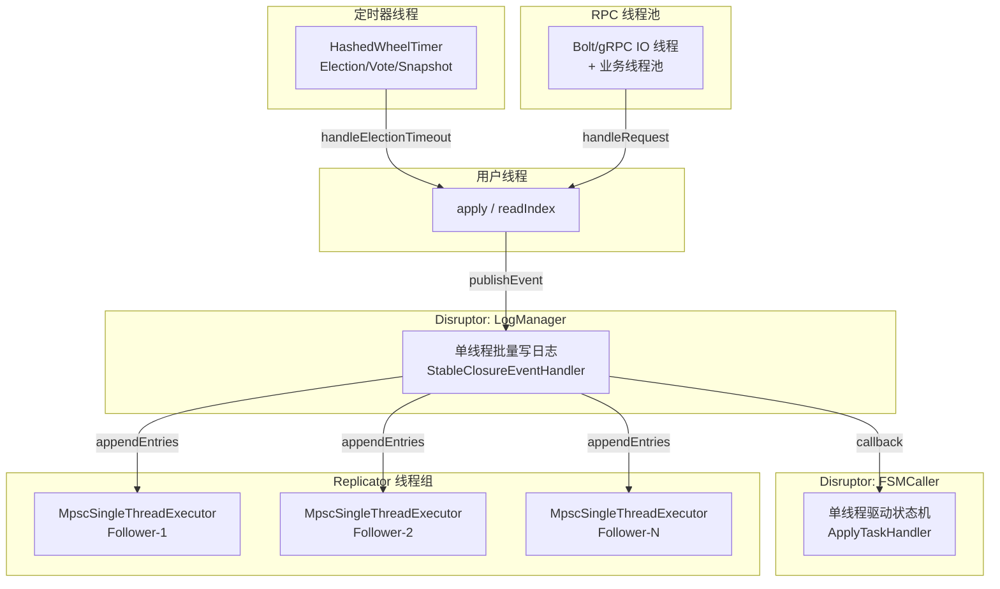

# 11 - Disruptor 与并发基础设施

## 1. 解决什么问题

JRaft 作为高性能 Raft 实现，其内部大量使用自定义并发工具来优化关键路径的吞吐量和延迟。本章分析 12 个核心并发基础设施组件：

| 问题域 | 组件 | 解决的核心问题 |
|---|---|---|
| 异步批量处理 | `DisruptorBuilder` + `LogExceptionHandler` | 封装 Disruptor 配置，统一异常处理 |
| 单线程顺序执行 | `MpscSingleThreadExecutor` | 多生产者无锁提交，单消费者顺序执行 |
| 线程组路由 | `DefaultFixedThreadsExecutorGroup` + `DefaultExecutorChooserFactory` | 按 key 路由到固定线程，保证有序性 |
| 周期定时 | `RepeatedTimer` | 可重置的周期定时器（选举超时/心跳） |
| 内存日志缓存 | `SegmentList` | 分段列表，避免 ArrayList 大内存拷贝 |
| 锁优化 | `NonReentrantLock` + `LongHeldDetectingReadWriteLock` | 不可重入锁（检测误用）+ 长持锁检测 |
| 对象池 | `Recyclers` | ThreadLocal 对象池，减少 GC 压力 |
| 线程池 | `ThreadPoolUtil` | 统一线程池创建（可选 Metric/Log 增强） |

## 2. 核心数据结构

### 2.1 DisruptorBuilder（`DisruptorBuilder.java:35-99`）

【问题】JRaft 在多个关键路径使用 Disruptor（`LogManagerImpl`、`FSMCallerImpl`、`ReadOnlyServiceImpl`、`NodeImpl`），每次构建 Disruptor 需要设置 5 个参数（EventFactory、RingBufferSize、ThreadFactory、ProducerType、WaitStrategy），代码冗长且容易遗漏。

【推导】需要一个 Builder 模式封装这些配置，提供合理默认值。

【真实数据结构】

```java
// DisruptorBuilder.java 第 35-41 行
public class DisruptorBuilder<T> {
    private EventFactory<T> eventFactory;              // 必填：事件工厂
    private Integer         ringBufferSize;            // 必填：RingBuffer 大小（必须是 2 的幂）
    private ThreadFactory   threadFactory = new NamedThreadFactory("Disruptor-", true); // 默认守护线程
    private ProducerType    producerType  = ProducerType.MULTI;   // 默认多生产者
    private WaitStrategy    waitStrategy  = new BlockingWaitStrategy(); // 默认阻塞等待
}
```

**`build()` 方法分支穷举**（`DisruptorBuilder.java:92-97`）：
- □ `ringBufferSize == null` → throw `NullPointerException`（`Requires.requireNonNull`）
- □ `eventFactory == null` → throw `NullPointerException`
- □ 正常 → `new Disruptor<>(eventFactory, ringBufferSize, threadFactory, producerType, waitStrategy)`

### 2.2 LogExceptionHandler（`LogExceptionHandler.java:34-70`）

【问题】Disruptor 的 `EventHandler.onEvent()` 如果抛出未捕获异常，默认行为是 **吞掉异常并停止消费**（取决于 WaitStrategy），这在生产环境中是致命的。

【推导】需要一个统一的 ExceptionHandler，至少做到：①记录日志 ②可选地通知上层。

【真实数据结构】

```java
// LogExceptionHandler.java 第 34-49 行
public final class LogExceptionHandler<T> implements ExceptionHandler<T> {
    private final String              name;               // 第 44 行：Disruptor 名称（用于日志）
    private final OnEventException<T> onEventException;   // 第 45 行：可选回调（null 表示只记日志）
}
```

**三个方法的分支穷举**（`LogExceptionHandler.java:57-69`）：
- □ `handleOnStartException(Throwable)` → `LOG.error("Fail to start {} disruptor", name, ex)`
- □ `handleOnShutdownException(Throwable)` → `LOG.error("Fail to shutdown {} disruptor", name, ex)`
- □ `handleEventException(Throwable, long, T)` → `LOG.error(...)` + `if (onEventException != null)` → `onEventException.onException(event, ex)`
- □ `handleEventException` + `onEventException == null` → 只记日志，不回调

**JRaft 中的实际使用**：

| 使用位置 | Disruptor 名称 | onEventException 回调 |
|---|---|---|
| `LogManagerImpl` | "JRaft-LogManager-Disruptor" | `reportError()`（触发节点 stepDown） |
| `FSMCallerImpl` | "JRaft-FSMCaller-Disruptor" | `null`（只记日志） |
| `ReadOnlyServiceImpl` | "JRaft-ReadOnlyService-Disruptor" | `null` |
| `NodeImpl` | "JRaft-NodeImpl-Disruptor" | `null`（只记日志） |

> ⚠️ **生产踩坑**：只有 `LogManagerImpl` 的 `onEventException` 会触发 `reportError()` → `setError()` → 节点 stepDown，这是 Disruptor 异常处理的**最后一道防线**。`NodeImpl`、`FSMCallerImpl`、`ReadOnlyServiceImpl` 的 `onEventException` 均为 null，异常只会被记录日志。如果用户状态机在 FSMCaller 中抛异常，状态机会 hang 住，表现为 `appliedIndex` 不再推进。

### 2.3 MpscSingleThreadExecutor（`MpscSingleThreadExecutor.java:42-402`）

【问题】JRaft 的 Replicator 需要一个**多生产者-单消费者**的执行器：多个线程（RPC 回调线程、定时线程）并发提交任务，单个消费者线程按序执行。JDK 的 `SingleThreadExecutor` 内部用 `LinkedBlockingQueue`，每次 put/take 都需要加锁，在高并发下成为瓶颈。

【推导】需要：①无锁 MPSC 队列（CAS 入队，单线程出队）②状态机管理（NOT_STARTED→STARTED→SHUTDOWN→TERMINATED）③优雅关闭（清理剩余任务 + 执行 shutdownHooks）

【真实数据结构】

```java
// MpscSingleThreadExecutor.java 第 55-69 行
// 四种状态（AtomicIntegerFieldUpdater 管理）
private static final int ST_NOT_STARTED = 1;  // 第 55 行
private static final int ST_STARTED     = 2;  // 第 56 行
private static final int ST_SHUTDOWN    = 3;  // 第 57 行
private static final int ST_TERMINATED  = 4;  // 第 58 行

private static final Runnable WAKEUP_TASK = () -> {};  // 第 60 行：哨兵任务，唤醒 Worker

private final Queue<Runnable>          taskQueue;                // 第 62 行：MPSC 无锁队列
private final Executor                 executor;                 // 第 63 行：ThreadPerTaskExecutor（创建工作线程）
private final RejectedExecutionHandler rejectedExecutionHandler; // 第 64 行：拒绝策略
private final Set<Runnable>            shutdownHooks;            // 第 65 行：关闭钩子
private final Semaphore                threadLock;               // 第 66 行：awaitTermination 信号量

private volatile int    state  = ST_NOT_STARTED;  // 第 68 行
private volatile Worker worker;                    // 第 69 行
```

**状态机图**：



**Worker 内部类**（`MpscSingleThreadExecutor.java:245-329`）：

```java
// Worker 的核心字段
private class Worker implements Runnable {
    final Thread thread;              // 第 247 行：工作线程引用
    volatile int notifyNeeded = NOT_NEEDED;  // 第 248 行：CAS 标志，避免不必要的 notify
    boolean      stop         = false;       // 第 249 行：stop 标志（由 notifyAndStop 设置）
}
```

**`execute()` 方法分支穷举**（第 127-131 行）：
- □ `task == null` → throw `NullPointerException`（`Requires.requireNonNull`）
- □ `offerTask(task)` 内部 `isShutdown()` → throw `RejectedExecutionException`
- □ `offerTask(task)` 返回 false（队列满）→ `reject(task)` → `rejectedExecutionHandler.rejected()`
- □ 正常 → `addTask` + `startWorker()` + `wakeupForTask()`

**`shutdownGracefully()` 异常细分**（第 106-115 行）：
- □ `doStartWorker()` catch Throwable + `!(t instanceof Exception)`（如 `OutOfMemoryError`）→ `state = ST_TERMINATED` + throw `RuntimeException(t)`（向上抛，调用方可感知）
- □ `doStartWorker()` catch Throwable + `t instanceof Exception` → `state = ST_TERMINATED` + return true（静默消化，认为关闭成功）

**`Worker.run()` 分支穷举**（第 252-301 行）：
- □ `pollTask() != null` → `runTask(task)`
- □ `runTask()` catch Throwable → `LOG.warn("Caught an unknown error while executing a task")`
- □ `pollTask() == null` + `stop == true` → break
- □ `pollTask() == null` + `stop == false` → `notifyNeeded = NEEDED` + `wait(1000, 10)`
- □ `wait` 后 `stop || isShutdown()` → break
- □ catch InterruptedException → ignored, continue
- □ `isShutdown()` → break
- □ 退出主循环后 → `runAllTasks()`（清理剩余队列中的任务）

**`Worker.notifyIfNeeded()` 的 CAS 优化**（第 315-323 行）：

```java
// 先检查 notifyNeeded 标志，避免不必要的 synchronized
private void notifyIfNeeded() {
    if (this.notifyNeeded == NOT_NEEDED) {  // 快速路径：不需要唤醒
        return;
    }
    if (NOTIFY_UPDATER.getAndSet(this, NOT_NEEDED) == NEEDED) {  // CAS 设为 NOT_NEEDED
        synchronized (this) {
            notifyAll();  // 唤醒 Worker
        }
    }
}
```

> 📌 **面试考点**：为什么用 `AtomicIntegerFieldUpdater` + `wait/notifyAll` 而不是 `LockSupport.park/unpark`？因为 `wait(1000, 10)` 带超时，即使没有任务提交，Worker 也会每 1 秒醒来检查状态（防止 shutdown 时 Worker 无法退出），而 `LockSupport.park` 需要额外处理超时逻辑。

**真实运行数据验证**：

| 埋点输出 | 对应分支 | 验证结论 |
|---|---|---|
| `CAS ST_NOT_STARTED→ST_STARTED 成功, thread=main` | `startWorker()` CAS 分支 | ✅ 首次 execute() 触发 Worker 启动 |
| `Worker退出主循环, 开始runAllTasks(), thread=test0` | `isShutdown()` → break → `runAllTasks()` | ✅ shutdown 后 Worker 清理剩余任务 |
| `state→ST_TERMINATED, shutdownHooks已执行, thread=test0` | `doStartWorker()` finally 块 | ✅ 状态正确转换到 TERMINATED |

### 2.4 DefaultFixedThreadsExecutorGroup（`DefaultFixedThreadsExecutorGroup.java:32-116`）

【问题】JRaft 需要将 Replicator 的任务按 PeerId 路由到固定线程，保证同一 Follower 的所有操作在同一线程执行（有序性），避免加锁。

【推导】需要：①一组 `SingleThreadExecutor` ②一个路由策略（Chooser），按 index 选择执行器

【真实数据结构】

```java
// DefaultFixedThreadsExecutorGroup.java 第 34-36 行
private final SingleThreadExecutor[]                 children;          // 第 34 行：执行器数组
private final Set<SingleThreadExecutor>              readonlyChildren;  // 第 35 行：不可变视图（用于迭代）
private final ExecutorChooserFactory.ExecutorChooser chooser;           // 第 36 行：路由策略
```

**`execute(int, Runnable)` 方法**（第 66-68 行）：
```java
public void execute(final int index, final Runnable task) {
    this.chooser.select(index).execute(task);  // 按 index 路由到固定线程
}
```

**`shutdownGracefully()` 分支穷举**（第 71-78 行）：
- □ 所有 children 都关闭成功 → return true
- □ 任一 child 关闭失败 → success = false（但仍继续关闭其他 children）

**`shutdownGracefully(long, TimeUnit)` 分支穷举**（第 81-93 行）：
- □ 正常关闭 → return true
- □ 超时 → `success = false`, break（不再等待剩余 children）

### 2.5 DefaultExecutorChooserFactory（`DefaultExecutorChooserFactory.java:31-82`）

【问题】给定一个 index（如 PeerId 的 hashCode），如何高效地路由到固定线程？

【推导】如果线程数是 2 的幂，可以用位运算 `index & (length - 1)` 代替取模 `index % length`，性能更高。

【真实实现】

```java
// DefaultExecutorChooserFactory.java 第 34-40 行
public ExecutorChooser newChooser(final SingleThreadExecutor[] executors) {
    if (Ints.isPowerOfTwo(executors.length)) {
        return new PowerOfTwoExecutorChooser(executors);   // 位运算：index & (length - 1)
    } else {
        return new GenericExecutorChooser(executors);       // 取模：Math.abs(index % length)
    }
}
```

**`next()` 方法**（第 78 行，`AbstractExecutorChooser` 中，`idx` 字段在第 73 行）：使用 `AtomicInteger idx` 递增来实现**轮询**（Round-Robin）。
```java
public SingleThreadExecutor next() {
    return select(this.idx.getAndIncrement());
}
```

> 📌 **面试考点**：`PowerOfTwoExecutorChooser.select()` 用 `index & (length - 1)` 代替 `index % length`，这是 Netty 的经典优化。JRaft 直接复用了 Netty 的设计。

### 2.6 RepeatedTimer（`RepeatedTimer.java:42-296`）

【问题】Raft 协议需要三种周期定时器：选举超时定时器（ElectionTimer）、心跳定时器（VoteTimer）、快照定时器（SnapshotTimer）。这些定时器有共同需求：①周期触发 ②可随时 reset（收到心跳后重置选举超时）③随机抖动（防止选举风暴）④可安全停止和销毁。

【推导】需要：①一个 `Timer`（HashedWheelTimer）调度底层 TimerTask ②一个 `Timeout` 引用（用于 cancel 旧调度、重新调度）③`stopped/running/destroyed/invoking` 四个状态标志位 ④一把 `Lock` 保护状态转换的原子性

【真实数据结构】

```java
// RepeatedTimer.java 第 46-54 行
private final Lock    lock = new ReentrantLock();  // 第 46 行：保护状态转换
private final Timer   timer;                       // 第 47 行：HashedWheelTimer 实例
private Timeout       timeout;                     // 第 48 行：当前调度的 Timeout（可 cancel）
private boolean       stopped;                     // 第 49 行：停止标志
private volatile boolean running;                  // 第 50 行：运行标志（是否有 onTrigger 在执行或有 schedule 在等待）
private volatile boolean destroyed;                // 第 51 行：销毁标志（不可逆）
private volatile boolean invoking;                 // 第 52 行：onTrigger 是否正在执行中
private volatile int     timeoutMs;                // 第 53 行：超时时间（可动态修改）
private final String     name;                     // 第 54 行：定时器名称
```

**状态机图**：



**`run()` 方法的锁设计**（`RepeatedTimer.java:86-105`）：

```java
public void run() {
    this.invoking = true;     // 标记正在触发（锁外）
    try {
        onTrigger();           // ① 锁外执行用户回调（不持锁，防止死锁）
    } catch (final Throwable t) {
        LOG.error("Run timer failed.", t);  // ② 吞掉异常，不影响后续调度
    }
    boolean invokeDestroyed = false;
    this.lock.lock();          // ③ 获取锁
    try {
        this.invoking = false;
        if (this.stopped) {
            this.running = false;        // ④ 如果被 stop()，不再 re-schedule
            invokeDestroyed = this.destroyed;
        } else {
            this.timeout = null;
            schedule();                  // ⑤ 重新调度下一次触发
        }
    } finally {
        this.lock.unlock();
    }
    if (invokeDestroyed) {
        onDestroy();                     // ⑥ 锁外调用 onDestroy()
    }
}
```

> ⚠️ **关键设计**：`onTrigger()` 在锁外执行，`schedule()` 在锁内执行。如果 `onTrigger()` 在锁内执行，用户回调中调用 `reset()` 或 `stop()` 会导致**死锁**（因为 reset/stop 也需要获取 lock）。

**`reset(int)` 分支穷举**（第 181-193 行）：
- □ `this.stopped == true` → return（只更新 timeoutMs，不调度）
- □ `this.running == true` → `schedule()`（cancel 旧 timeout + 新调度）
- □ `this.running == false` → 不做事

**`reset()` 无参版本**（第 196-202 行）：获取锁后调用 `reset(this.timeoutMs)`。注意它**先获取锁，再调用 `reset(int)`**，而 `reset(int)` 内部也获取锁——这依赖 `ReentrantLock` 的**可重入特性**。

**`runOnceNow()` 方法**（第 108-116 行）：在锁内取消当前 timeout 并立即调用 `run()`。注意 `run()` 内部也会获取锁（第 94 行），同样依赖 `ReentrantLock` 可重入。

**`restart()` 方法**（第 153-165 行）：与 `start()` 的区别——`start()` 在 `!stopped` 时直接 return（不重新 schedule），而 `restart()` 无论 stopped 状态如何，都强制 `stopped=false, running=true, schedule()`。

**`destroy()` 分支穷举**（第 205-233 行）：
- □ `this.destroyed == true` → return（幂等保护）
- □ `!this.running` → `invokeDestroyed = true`
- □ `this.stopped == true` → return（解锁后 `timer.stop()` + 可能 `onDestroy()`）
- □ `this.timeout.cancel()` 成功 → `invokeDestroyed = true`, `running = false`
- □ `this.timeout.cancel()` 失败 → `invokeDestroyed` 取决于 `!this.running`
- □ finally → `this.timer.stop()` + 条件调用 `onDestroy()`

**真实运行数据验证**：

| 埋点输出 | 对应分支 | 验证结论 |
|---|---|---|
| `run() onTrigger开始, stopped=false, running=true` × 20次 | 正常触发路径 | ✅ 50ms 周期，1秒约 20 次 |
| `run() re-schedule完成` × 20次 | `stopped == false` → `schedule()` | ✅ 每次触发后自动重调度 |
| `stop() stopped→true, timeout=true` | `stop()` 正常执行 | ✅ cancel timeout 成功 |
| stop 后无更多 `run()` 输出 | `stopped == true` → `running = false` | ✅ 定时器确实停止 |
| start 后重新输出 `run()` | `start()` 重新 `schedule()` | ✅ 定时器可重启 |

### 2.7 SegmentList（`SegmentList.java:37-460`）

【问题】`LogManagerImpl` 需要在内存中缓存最近的 LogEntry（`logsInMemory`）。ArrayList 的问题：①尾部追加 O(1) 但扩容时需要拷贝整个数组 ②头部删除（日志截断）O(n)，需要移动所有元素。对于百万级日志条目，这两个操作都不可接受。

【推导】需要一个数据结构满足：①尾部追加 O(1) ②头部截断 O(1) ③随机访问 O(1) ④内存占用估算。分段列表（每段固定 128 个元素）可以满足所有需求。

【真实数据结构】

```java
// SegmentList.java 第 48-49 行
private static final int SEGMENT_SHIFT = 7;                        // 第 48 行：2^7 = 128
public static final int  SEGMENT_SIZE  = 2 << (SEGMENT_SHIFT - 1); // 第 49 行：= 128

// SegmentList.java 第 51-59 行
private final ArrayDeque<Segment<T>> segments;     // 第 51 行：Segment 双端队列
private int                          size;          // 第 53 行：总元素数
private int                          firstOffset;   // 第 55 行：第一个 Segment 中的起始偏移
private final boolean                recycleSegment; // 第 57 行：是否回收 Segment
private long                         estimatedBytes; // 第 59 行：估算内存占用（字节）
```

**Segment 内部类**（`SegmentList.java:73-103`）：

```java
// Segment 字段（第 95-98 行）
final Object[] elements;  // 固定 128 元素的数组
int            pos;       // 写入位置（exclusive）
int            offset;    // 读取位置（inclusive）
long           bytes;     // 本段的估算内存
```

**`get(int)` 方法**（第 218 行）— O(1) 随机访问：

```java
public T get(int index) {
    index += this.firstOffset;  // 加上第一段的偏移
    // 两次数组寻址：先定位 Segment，再定位元素
    return this.segments.get(index >> SEGMENT_SHIFT)   // index / 128 → 第几个段
                        .get(index & (SEGMENT_SIZE - 1)); // index % 128 → 段内偏移
}
```

**`removeFromFirst(int)` 方法**（第 362-387 行）— 头部截断：

```java
// 关键算法：
// 1. 计算目标位置跨越了几个完整 Segment（toSegmentIndex = alignedIndex >> SEGMENT_SHIFT）
// 2. 批量移除完整 Segment（segments.removeRange(0, toSegmentIndex)），O(1)
// 3. 在剩余的第一个 Segment 中移除部分元素（firstSeg.removeFromFirst(toIndexInSeg)）
// 4. 如果第一个 Segment 空了，回收它并重置 firstOffset = 0
```

**复杂度对比**：

| 操作 | ArrayList | LinkedList | SegmentList |
|---|---|---|---|
| 随机访问 | O(1) | O(n) | O(1)（两次数组寻址） |
| 尾部追加 | 均摊 O(1)，但扩容时 O(n) | O(1) | O(1)（无大内存拷贝） |
| 头部截断 n 个 | O(size-n) | O(n) | O(n/128)（移除整段） |
| 内存估算 | 不支持 | 不支持 | O(1)（`estimatedBytes` 字段） |

> 📌 **面试考点**：`SegmentList` 的随机访问为什么是 O(1)？因为 `segments` 是 `ArrayDeque`（底层是数组），通过 `index >> 7` 定位段号是 O(1)，段内 `index & 127` 寻址也是 O(1)。

**`EstimatedSize` 接口**（第 41-46 行）：`SegmentList` 的泛型约束 `T extends EstimatedSize`，要求每个元素提供 `estimatedSize()` 方法，用于实时追踪内存占用。

### 2.8 NonReentrantLock（`NonReentrantLock.java:27-93`）

【问题】JRaft 内部某些锁不应该被重入——如果一个线程在持锁的情况下再次获取同一把锁，说明代码有 bug（死循环或递归调用）。`ReentrantLock` 允许重入，无法检测这类错误。

【推导】需要一把**不可重入锁**：同一线程重入时不返回 true，而是返回 false（`tryLock`）或阻塞（`lock`），从而暴露 bug。

【真实实现】

```java
// NonReentrantLock.java 第 27-29 行
// 直接继承 AQS，复用 CLH 队列
public final class NonReentrantLock extends AbstractQueuedSynchronizer implements Lock {
    private Thread owner;  // 第 31 行：持锁线程

    // 第 68-73 行：tryAcquire — 不可重入的关键
    protected boolean tryAcquire(final int acquires) {
        if (compareAndSetState(0, 1)) {  // CAS(0→1) 成功 → 获取锁
            this.owner = Thread.currentThread();
            return true;
        }
        return false;  // CAS 失败 → 不管是否是同一线程，都返回 false → 不可重入！
    }

    // 第 76-83 行：tryRelease — 带 owner 检查
    protected boolean tryRelease(final int releases) {
        if (Thread.currentThread() != this.owner) {
            throw new IllegalMonitorStateException("Owner is " + this.owner);
        }
        this.owner = null;
        setState(0);
        return true;
    }
}
```

**与 ReentrantLock 的对比**：

| 特性 | ReentrantLock | NonReentrantLock |
|---|---|---|
| 同一线程重入 | ✅ state 递增 | ❌ CAS 失败，阻塞（`lock()`）或返回 false（`tryLock()`）|
| 释放次数 | 必须与获取次数匹配 | 固定一次 |
| owner 检查 | `tryRelease` 中检查 | `tryRelease` 中检查 |
| `isHeldExclusively()` | `getState() != 0 && exclusiveOwnerThread == currentThread` | `getState() != 0 && owner == currentThread`（第 85-88 行） |
| 适用场景 | 通用 | 需要检测误用的场景 |

> ⚠️ **生产踩坑**：如果用 `NonReentrantLock` 的 `lock()` 方法在同一线程中重入，会**永久阻塞**（死锁），因为 AQS 会将当前线程放入 CLH 队列等待，但持锁线程就是自己，永远等不到释放。使用 `tryLock()` 可以避免死锁，但需要处理返回 false 的情况。

### 2.9 LongHeldDetectingReadWriteLock（`LongHeldDetectingReadWriteLock.java:33-154`）

【问题】`NodeImpl` 的 `readLock/writeLock` 在高负载下可能被长时间持有，导致其他线程饥饿。需要在锁被持有超过阈值时**报告告警**，帮助定位瓶颈。

【推导】需要一个装饰器模式的 ReadWriteLock：①包装 `ReentrantReadWriteLock` ②在 `lock()` 前后计时 ③超过阈值时调用 `report()` 回调

【真实实现】

```java
// LongHeldDetectingReadWriteLock.java 第 44-57 行
public LongHeldDetectingReadWriteLock(boolean fair, long maxBlockingTimeToReport, TimeUnit unit) {
    final RwLock rwLock = new RwLock(fair);
    final long maxBlockingNanos = unit.toNanos(maxBlockingTimeToReport);
    if (maxBlockingNanos > 0) {
        // 包装模式：用 LongHeldDetectingLock 包装原始 readLock/writeLock
        this.rLock = new LongHeldDetectingLock(AcquireMode.Read, rwLock, maxBlockingNanos);
        this.wLock = new LongHeldDetectingLock(AcquireMode.Write, rwLock, maxBlockingNanos);
    } else {
        // 如果阈值 <= 0，不包装，直接使用原始锁（零开销）
        this.rLock = rwLock.readLock();
        this.wLock = rwLock.writeLock();
    }
}
```

**`LongHeldDetectingLock.lock()` 方法**（第 106-116 行）：

```java
public void lock() {
    final long start = System.nanoTime();
    final Thread owner = this.parent.getOwner();  // 获取锁前记录当前 owner
    try {
        this.delegate.lock();                       // 委托给原始锁
    } finally {
        final long elapsed = System.nanoTime() - start;
        if (elapsed > this.maxBlockingNanos) {
            // 超过阈值 → 调用 report() 回调
            report(this.mode, owner, this.parent.getQueuedThreads(), elapsed);
        }
    }
}
```

**`report()` 方法是抽象的**（第 69 行）：由 `NodeImpl` 实现，打印告警日志。

**`maxBlockingNanos > 0` 的分支**（第 51 行）：
- □ `maxBlockingNanos > 0` → 使用 `LongHeldDetectingLock` 包装（有检测开销）
- □ `maxBlockingNanos <= 0` → 直接使用原始 `ReentrantReadWriteLock`（零开销）

> ⚠️ **生产踩坑**：`report()` 的 `owner` 参数是在 `lock()` **之前**获取的（第 109 行），而不是在超时之后获取的。因为超时之后锁已经被释放，`getOwner()` 可能返回 null 或新的 owner。所以 `owner` 是“导致我等待的那个线程”，而不是“当前持锁的线程”。

**`lockInterruptibly()` 方法**（第 120-130 行）也有完全一致的长持锁检测逻辑。而 `tryLock()` 和 `tryLock(timeout)` **没有**检测逻辑，直接委托给原始锁。

### 2.10 Recyclers（`Recyclers.java:35-415`）

【问题】JRaft 中 `LogEntry`、`RecyclableByteBufferList` 等对象在热路径中被频繁创建和销毁，给 GC 带来压力。

【推导】需要一个轻量级对象池：①ThreadLocal Stack 存储回收的对象 ②跨线程回收时使用 WeakOrderQueue（避免锁竞争）③容量限制防止内存泄漏

【真实数据结构】

```java
// Recyclers.java 第 42-44 行（静态常量）+ 第 46-56 行（static 初始化块）
private static final int DEFAULT_INITIAL_MAX_CAPACITY_PER_THREAD = 4 * 1024;  // 每线程最大 4096 对象
private static final int MAX_CAPACITY_PER_THREAD;  // 可通过 -Djraft.recyclers.maxCapacityPerThread 配置
private static final int INITIAL_CAPACITY;          // min(MAX_CAPACITY, 256)

// Recyclers.java 第 59-62 行
public static final Handle NOOP_HANDLE = new Handle() {};  // 第 59 行：空 Handle（禁用对象池时使用）
private final int maxCapacityPerThread;                      // 第 61 行
private final ThreadLocal<Stack<T>> threadLocal;             // 第 62 行：每线程一个 Stack
```

**`get()` 方法分支穷举**（第 78-88 行）：
- □ `maxCapacityPerThread == 0` → `newObject(NOOP_HANDLE)`（对象池禁用，每次创建新对象）
- □ `stack.pop()` 返回 handle → 复用已有对象
- □ `stack.pop()` 返回 null → `stack.newHandle()` + `newObject(handle)` 创建新对象

**`recycle()` 方法分支穷举**（第 90-108 行）：
- □ `handle == NOOP_HANDLE` → return false（对象池禁用）
- □ `lastRecycledId != recycleId || stack == null` → throw `IllegalStateException("recycled already")`
- □ `stack.parent != this` → return false（跨 Recyclers 实例回收，拒绝）
- □ `o != h.value` → throw `IllegalArgumentException("o does not belong to handle")`
- □ 正常 → `h.recycle()`

**跨线程回收机制**（`DefaultHandle.recycle()` 第 125-140 行）：

```java
public void recycle() {
    Thread thread = Thread.currentThread();
    final Stack<?> stack = this.stack;
    if (thread == stack.thread) {
        stack.push(this);  // 同线程：直接 push 到 Stack
        return;
    }
    // 跨线程：放入 WeakOrderQueue
    Map<Stack<?>, WeakOrderQueue> delayedRecycled = Recyclers.delayedRecycled.get();
    WeakOrderQueue queue = delayedRecycled.get(stack);
    if (queue == null) {
        delayedRecycled.put(stack, queue = new WeakOrderQueue(stack, thread));
    }
    queue.add(this);
}
```

**跨线程回收的 Scavenge 机制**（`Stack.pop()` → `scavenge()` → `scavengeSome()`，第 274-340 行）：

当 `Stack.pop()` 发现栈空时，会调用 `scavengeSome()` 遍历 `WeakOrderQueue` 链表，将跨线程回收的对象 `transfer()` 到当前 Stack。



**WeakOrderQueue 的 Link 链表**（第 146-162 行）：每个 Link 固定 16 个元素，满了就创建新 Link。使用 `lazySet` 保证可见性（`tail.lazySet(writeIndex + 1)`，第 183 行）。

> ⚠️ **生产踩坑**：`WeakOrderQueue` 使用 `WeakReference<Thread>` 持有创建者线程（第 160 行）。如果生产者线程被销毁，`owner.get() == null`，`scavengeSome()` 会将残留数据全部 transfer 到 Stack，并从链表中 unlink（第 311-320 行）。这确保了不会因为线程销毁导致内存泄漏。

### 2.11 ThreadPoolUtil（`ThreadPoolUtil.java:32-284`）

【问题】JRaft 需要统一管理线程池创建，支持两种模式：①带 Metric 的线程池（`MetricThreadPoolExecutor`）②带日志增强的线程池（`LogThreadPoolExecutor`）。

【推导】根据 `enableMetric` 标志选择不同的线程池实现，并提供 Builder 模式简化配置。

**`newThreadPool()` 方法分支穷举**（第 114-126 行，8 参数版本）：
- □ `enableMetric == true` → `new MetricThreadPoolExecutor(..., poolName)`
- □ `enableMetric == false` → `new LogThreadPoolExecutor(..., poolName)`

**`newScheduledThreadPool()` 方法分支穷举**（第 160-170 行，5 参数版本）：
- □ `enableMetric == true` → `new MetricScheduledThreadPoolExecutor(...)`
- □ `enableMetric == false` → `new LogScheduledThreadPoolExecutor(...)`

**PoolBuilder.build()** 方法（第 230-242 行）会对所有 8 个参数做 `Requires.requireNonNull()` 校验（包括 `handler`），任何一个为 null 都会抛 NullPointerException。

## 3. JRaft 中 Disruptor 的使用模式

### 3.1 使用位置一览

| 使用位置 | 事件类型 | ProducerType | WaitStrategy | onEventException |
|---|---|---|---|---|
| `LogManagerImpl` | `StableClosureEvent` | MULTI | BlockingWaitStrategy | `reportError()` |
| `FSMCallerImpl` | `ApplyTask` | MULTI | BlockingWaitStrategy | `null` |
| `ReadOnlyServiceImpl` | `ReadIndexEvent` | MULTI | BlockingWaitStrategy | `null` |
| `NodeImpl` | `LogEntryAndClosure` | MULTI | BlockingWaitStrategy | `reportError()` |

### 3.2 批量消费模式（endOfBatch）

Disruptor 的 `EventHandler.onEvent(event, sequence, endOfBatch)` 中，`endOfBatch` 标志表示当前批次最后一个事件。JRaft 利用这个标志实现**批量合并**：

```java
// LogManagerImpl.StableClosureEventHandler.onEvent() 的核心模式
public void onEvent(StableClosureEvent event, long sequence, boolean endOfBatch) {
    // 1. 累积事件
    entries.addAll(event.entries);
    closures.add(event.done);
    
    // 2. endOfBatch 时批量提交
    if (endOfBatch) {
        logStorage.appendEntries(entries);  // 一次 RocksDB 写入
        for (Closure done : closures) {
            done.run(Status.OK());
        }
        entries.clear();
        closures.clear();
    }
}
```

> 📌 **面试考点**：为什么用 Disruptor 而不是 `BlockingQueue` + 手动攒批？①Disruptor 的 `endOfBatch` 是**零成本**的——底层已经知道 RingBuffer 中有多少连续事件可消费，不需要额外定时或计数 ②RingBuffer 预分配内存，减少 GC ③多生产者场景下 Disruptor 使用 CAS 竞争 sequence，比 `BlockingQueue` 的 `ReentrantLock` 性能更高

## 4. 线程模型总览



## 5. 核心不变式

| # | 不变式 | 保证机制 |
|---|---|---|
| 1 | MpscSingleThreadExecutor 的状态只能单调递增（1→2→3→4） | `AtomicIntegerFieldUpdater` CAS + `>= ST_SHUTDOWN` 判断 |
| 2 | RepeatedTimer 的 `onTrigger()` 在锁外执行 | `run()` 方法先调 `onTrigger()` 再获取 `lock`（`RepeatedTimer.java:87-96`）|
| 3 | SegmentList 的 `get(index)` 是 O(1) | `segments` 是 ArrayDeque（数组），两次数组寻址 |
| 4 | NonReentrantLock 的 `tryAcquire` 不检查 owner | `compareAndSetState(0, 1)` 只关心 state，不关心 Thread（`NonReentrantLock.java:68-73`）|
| 5 | Recyclers 的跨线程回收不加锁 | `WeakOrderQueue.add()` 使用 `lazySet`（`Recyclers.java:183`）|
| 6 | LongHeldDetectingLock 在 `maxBlockingNanos <= 0` 时零开销 | 构造函数中直接使用原始锁，不包装（`LongHeldDetectingReadWriteLock.java:54-56`）|

## 6. 面试高频考点 📌

1. **JRaft 为什么用 Disruptor 而不是 `BlockingQueue`？** — 无锁 RingBuffer + `endOfBatch` 批量消费 + 预分配内存减少 GC
2. **`MpscSingleThreadExecutor` 相比 `SingleThreadExecutor` 的优势？** — 无锁 MPSC 队列（CAS 入队），减少多生产者场景下的锁竞争
3. **`MpscSingleThreadExecutor` 的 `shutdownGracefully()` 为什么在 `ST_NOT_STARTED` 时也要启动 Worker？** — 因为 shutdownHooks 需要在 Worker 线程中执行（第 106-115 行）
4. **`RepeatedTimer` 的 `onTrigger()` 为什么在锁外执行？** — 防止用户回调中调用 `reset()/stop()` 导致死锁
5. **`SegmentList` 的头部截断为什么是 O(n/128)？** — 直接丢弃完整的 Segment 引用，不需要移动元素
6. **`NonReentrantLock` vs `ReentrantLock` 的核心区别？** — `tryAcquire` 不检查 Thread，同一线程重入会阻塞（死锁检测）
7. **`DefaultExecutorChooserFactory` 为什么区分 PowerOfTwo 和 Generic？** — 位运算 `& (n-1)` 比取模 `%` 快
8. **`Recyclers` 的跨线程回收为什么不加锁？** — `WeakOrderQueue.add()` 使用 `lazySet` 保证可见性，`transfer()` 只在 owner 线程执行

## 7. 生产踩坑 ⚠️

1. **Disruptor RingBufferSize 过小**：生产者阻塞（`BlockingWaitStrategy` 下），导致写入延迟飙升。建议至少 16384，根据吞吐量调整
2. **FSMCaller Disruptor 积压**：`onApply()` 执行慢（如用户状态机操作数据库），导致 `committedIndex` 和 `appliedIndex` 差距越来越大，ReadIndex 请求全部 hang 住
3. **`LogExceptionHandler` 的 `onEventException` 为 null**：除了 `LogManagerImpl` 外，`NodeImpl`、`FSMCallerImpl`、`ReadOnlyServiceImpl` 的异常都只记日志不回调。建议生产环境对所有 Disruptor 都设置 `onEventException` 回调
4. **`NonReentrantLock` 误用导致死锁**：如果在持锁的情况下调用了一个方法，该方法内部又尝试获取同一把锁，会永久阻塞。Debug 时 jstack 可以看到线程在 `AbstractQueuedSynchronizer.acquireQueued` 上等待自己
5. **`Recyclers` 在线程池场景下的内存泄漏**：ThreadLocal Stack 绑定到线程，如果线程池的线程不被销毁，Stack 中的对象也不会被回收。建议设置合理的 `maxCapacityPerThread`（默认 4096），或在线程退出时手动清理
6. **`LongHeldDetectingReadWriteLock` 的 `report()` 被频繁调用**：如果 `maxBlockingTimeToReport` 设置过小，正常的锁竞争也会触发告警，导致日志洪水。建议设置为 1 秒以上
7. **`SegmentList` 的 `estimatedBytes` 不精确**：它只统计元素本身的 `estimatedSize()`，不包含 Segment 数组的开销（每个 Segment 约 1KB = 128 × 8 bytes 引用）。在极端场景下，实际内存可能比 `estimatedBytes` 大 10-20%