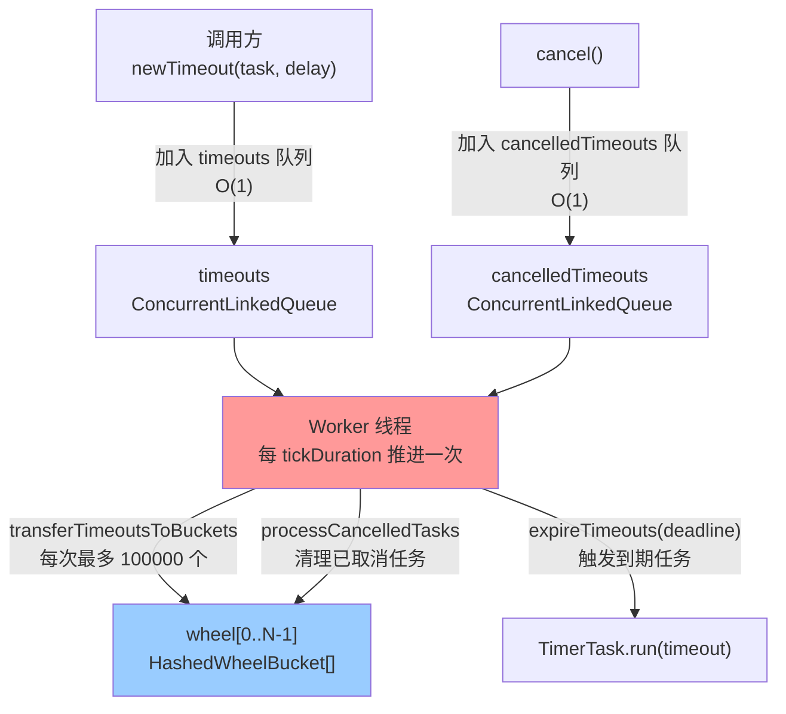
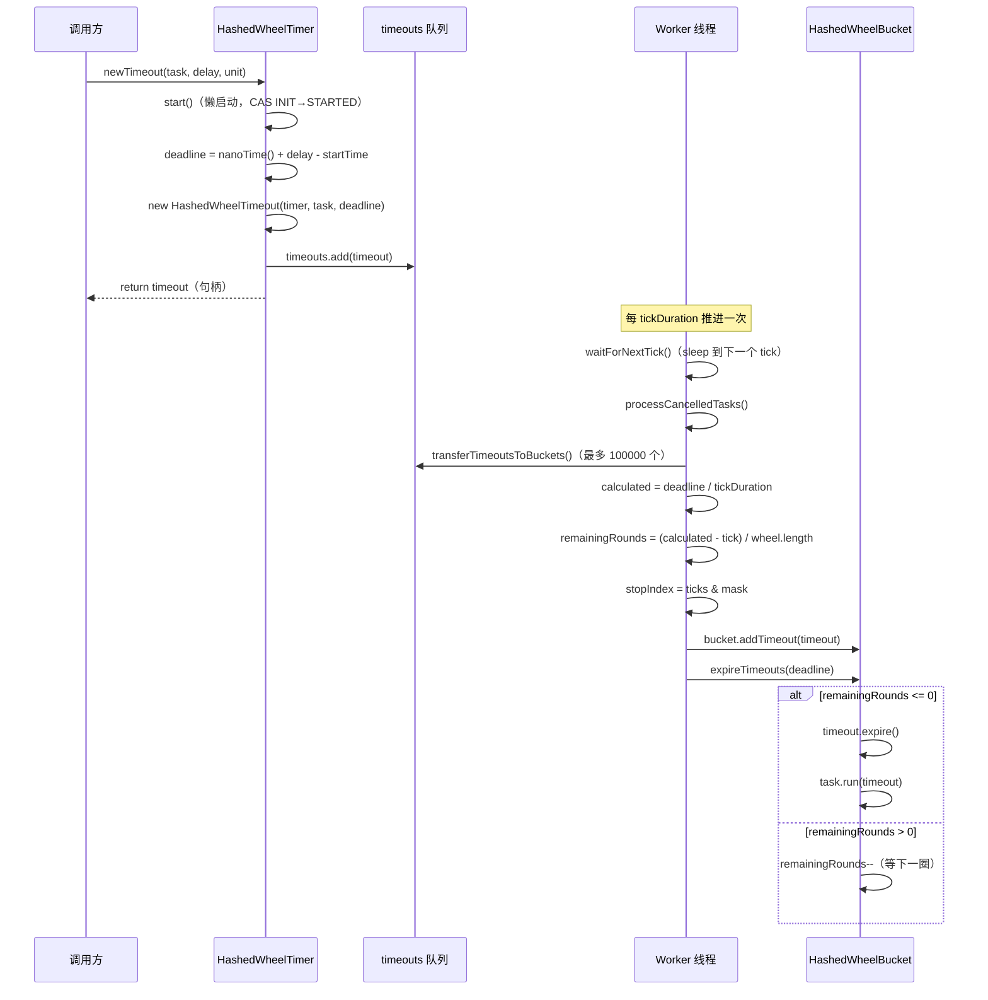
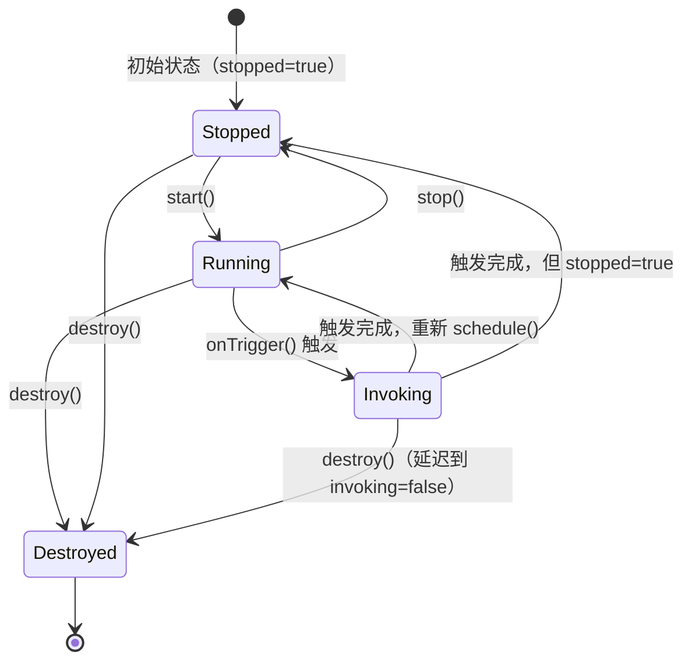
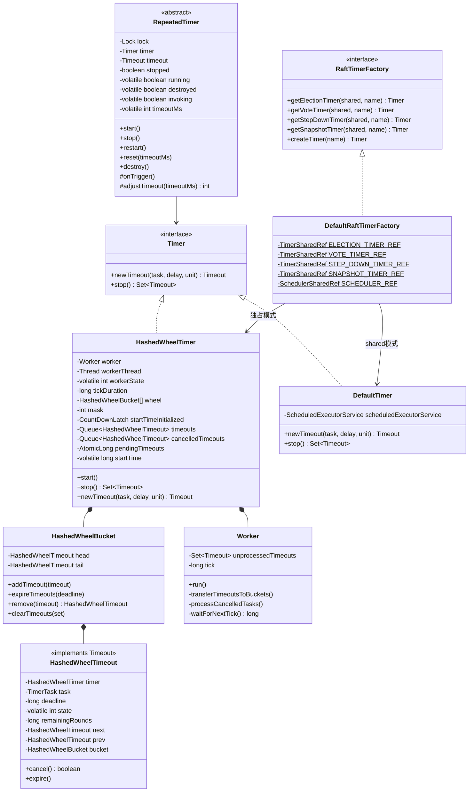

# S12：HashedWheelTimer 时间轮实现

> **归属**：补入 `11-concurrency-infra/` 章节
> **核心源码**：`HashedWheelTimer.java`（31KB/763行）+ `DefaultRaftTimerFactory.java`（9.9KB/243行）+ `RepeatedTimer.java`（7.9KB/296行）
> **关联章节**：11-concurrency-infra（并发基础设施）

---

## 1. 问题推导

### 1.1 Raft 的定时任务需求

Raft 协议依赖大量定时任务：

| 定时任务 | 触发条件 | 典型超时 |
|---------|---------|---------|
| 选举超时（electionTimer） | Follower 未收到心跳 | 1000ms（随机抖动） |
| 投票超时（voteTimer） | Candidate 发起投票后等待 | 1000ms |
| StepDown 超时（stepDownTimer） | Leader 未收到多数派心跳 | 500ms |
| 快照定时器（snapshotTimer） | 定期触发快照 | 3600s |
| 重试定时器（CopySession） | 快照传输重试 | 1000ms |

**问题**：如果用 `ScheduledExecutorService` 管理这些定时任务，会有什么问题？

### 1.2 ScheduledExecutorService 的痛点

`ScheduledExecutorService` 内部使用 `DelayQueue`（基于堆），每次添加/取消任务的时间复杂度是 **O(log N)**。

当集群中有大量节点（如 1000 个 Raft Group），每个节点有 4 个定时器，就有 4000 个定时任务。高频的添加/取消操作（每次心跳都要重置选举超时）会导致：
- 大量的堆操作（O(log N) 的 sift-up/sift-down）
- 线程池中的任务调度竞争

### 1.3 时间轮的解决思路

**核心思想**：用空间换时间。

把时间划分为固定大小的"槽"（bucket），每个槽对应一个时间段。任务按照到期时间哈希到对应的槽中。一个后台线程（Worker）按固定频率推进"指针"，每次只处理当前槽中的任务。

- **添加任务**：O(1)（计算槽位 + 加入链表）
- **取消任务**：O(1)（CAS 状态 + 加入取消队列）
- **触发任务**：O(1)（遍历当前槽的链表）

---

## 2. 接口体系

### 2.1 三个核心接口

**源码**：`timer/` 包下

```
Timer（定时器）
  └── newTimeout(task, delay, unit) → Timeout
  └── stop() → Set<Timeout>

Timeout（任务句柄）
  └── timer() → Timer
  └── task() → TimerTask
  └── isExpired() / isCancelled()
  └── cancel() → boolean

TimerTask（任务体）
  └── run(Timeout timeout) throws Exception
```

**`Timer.java:30-52`**：
```java
public interface Timer {
    // 提交一个延迟任务，返回任务句柄
    Timeout newTimeout(final TimerTask task, final long delay, final TimeUnit unit);
    // 停止定时器，返回所有未执行的任务句柄
    Set<Timeout> stop();
}
```

**`TimerTask.java:28-33`**：
```java
public interface TimerTask {
    // 任务执行体，timeout 是任务句柄（可用于取消）
    void run(final Timeout timeout) throws Exception;
}
```

**`Timeout.java:26-56`**：
```java
public interface Timeout {
    Timer timer();       // 所属定时器
    TimerTask task();    // 关联的任务
    boolean isExpired(); // 是否已触发
    boolean isCancelled(); // 是否已取消
    boolean cancel();    // 取消任务
}
```

### 2.2 两个实现类

| 实现 | 底层机制 | 适用场景 |
|------|---------|---------|
| `HashedWheelTimer` | 时间轮 + 单 Worker 线程 | 大量短期定时任务（Raft 定时器） |
| `DefaultTimer` | `ScheduledExecutorService` | 少量长期定时任务（对比实现） |

---

## 3. HashedWheelTimer 核心数据结构

### 3.1 问题推导

【问题】时间轮需要存储哪些信息？

【需要什么信息】：
1. 时间槽数组（wheel）：存放各个时间段的任务
2. 当前指针位置（tick）：知道现在走到哪个槽了
3. 每个槽的时间跨度（tickDuration）：知道每个槽代表多少时间
4. 待分配队列（timeouts）：新提交的任务先放这里，等 Worker 线程分配到槽
5. 待取消队列（cancelledTimeouts）：已取消的任务等 Worker 线程清理
6. Worker 线程状态（workerState）：控制启动/停止

【推导出的结构】：
- `wheel[]` 数组 + `tick` 游标 + `tickDuration` 时间精度
- 两个无锁队列（`ConcurrentLinkedQueue`）：`timeouts` + `cancelledTimeouts`
- CAS 状态机：`workerState`（INIT → STARTED → SHUTDOWN）

### 3.2 HashedWheelTimer 字段分析

**源码**：`HashedWheelTimer.java:52-82`

| 字段 | 类型 | 作用 | 源码行 |
|------|------|------|--------|
| `worker` | `Worker` | 后台 Worker 线程的 Runnable | `HashedWheelTimer.java:62` |
| `workerThread` | `Thread` | Worker 线程实例 | `HashedWheelTimer.java:63` |
| `workerState` | `volatile int` | 状态机：0=INIT, 1=STARTED, 2=SHUTDOWN | `HashedWheelTimer.java:70` |
| `tickDuration` | `long` | 每个 tick 的纳秒数（默认 100ms） | `HashedWheelTimer.java:72` |
| `wheel` | `HashedWheelBucket[]` | 时间槽数组，长度必须是 2 的幂 | `HashedWheelTimer.java:73` |
| `mask` | `int` | `wheel.length - 1`，用于位运算取模 | `HashedWheelTimer.java:74` |
| `startTimeInitialized` | `CountDownLatch(1)` | 等待 Worker 线程初始化 startTime | `HashedWheelTimer.java:75` |
| `timeouts` | `ConcurrentLinkedQueue` | 新提交的任务暂存队列（多生产者单消费者） | `HashedWheelTimer.java:76` |
| `cancelledTimeouts` | `ConcurrentLinkedQueue` | 已取消任务的清理队列 | `HashedWheelTimer.java:77` |
| `pendingTimeouts` | `AtomicLong` | 当前待执行任务数（用于限流） | `HashedWheelTimer.java:78` |
| `maxPendingTimeouts` | `long` | 最大待执行任务数（-1 表示不限制） | `HashedWheelTimer.java:79` |
| `startTime` | `volatile long` | Worker 线程启动时的纳秒时间戳 | `HashedWheelTimer.java:81` |

⚠️ **为什么 `workerState` 用 `AtomicIntegerFieldUpdater` 而不是 `AtomicInteger`？**

`AtomicIntegerFieldUpdater` 直接操作对象字段，避免了额外的对象分配（`AtomicInteger` 需要一个额外的包装对象）。在高频创建/销毁定时器的场景下，减少 GC 压力。

### 3.3 HashedWheelBucket 字段分析

**源码**：`HashedWheelTimer.java:460-470`

```java
private static final class HashedWheelBucket {
    private HashedWheelTimeout head;  // 链表头
    private HashedWheelTimeout tail;  // 链表尾
}
```

每个 Bucket 是一个**双向链表**，存储该时间槽中的所有任务。

⚠️ **为什么用双向链表而不是单向链表？**

双向链表支持 O(1) 的中间节点删除（取消任务时直接修改 prev/next 指针），单向链表删除中间节点需要 O(N) 遍历。

### 3.4 HashedWheelTimeout 字段分析

**源码**：`HashedWheelTimer.java:445-465`

| 字段 | 类型 | 作用 | 源码行 |
|------|------|------|--------|
| `timer` | `HashedWheelTimer` | 所属定时器（用于取消时访问 cancelledTimeouts） | `HashedWheelTimer.java:449` |
| `task` | `TimerTask` | 任务体 | `HashedWheelTimer.java:450` |
| `deadline` | `long` | 到期时间（相对于 startTime 的纳秒偏移） | `HashedWheelTimer.java:451` |
| `state` | `volatile int` | 状态：0=INIT, 1=CANCELLED, 2=EXPIRED | `HashedWheelTimer.java:454` |
| `remainingRounds` | `long` | 剩余圈数（多圈时间轮的关键字段） | `HashedWheelTimer.java:458` |
| `next` / `prev` | `HashedWheelTimeout` | 双向链表指针 | `HashedWheelTimer.java:461-462` |
| `bucket` | `HashedWheelBucket` | 所在的 Bucket（用于 remove 时直接操作） | `HashedWheelTimer.java:465` |

📌 **`remainingRounds` 是多圈时间轮的核心字段**：当任务的延迟时间超过一圈（`ticksPerWheel * tickDuration`），任务会被放入对应槽，但 `remainingRounds > 0`，每次 Worker 经过该槽时减 1，直到 `remainingRounds == 0` 才真正触发。

---

## 4. 核心流程

### 4.1 整体架构图



### 4.2 时序图：newTimeout → 任务触发



### 4.3 newTimeout() 逐行分析

**源码**：`HashedWheelTimer.java:292-318`

**分支穷举清单**：

| 条件 | 结果 | 源码行 |
|------|------|--------|
| □ task == null | throw NullPointerException | `HashedWheelTimer.java:294` |
| □ unit == null | throw NullPointerException | `HashedWheelTimer.java:297` |
| □ maxPendingTimeouts > 0 && count > max | decrementAndGet + throw RejectedExecutionException | `HashedWheelTimer.java:302-306` |
| □ delay > 0 && deadline < 0（溢出） | deadline = Long.MAX_VALUE | `HashedWheelTimer.java:314-316` |
| □ 正常路径 | 创建 HashedWheelTimeout + timeouts.add() | `HashedWheelTimer.java:317-318` |

```java
// HashedWheelTimer.java:292-318
public Timeout newTimeout(TimerTask task, long delay, TimeUnit unit) {
    // 1. 参数校验
    if (task == null) throw new NullPointerException("task");
    if (unit == null) throw new NullPointerException("unit");

    // 2. 限流检查
    long pendingTimeoutsCount = pendingTimeouts.incrementAndGet();
    if (maxPendingTimeouts > 0 && pendingTimeoutsCount > maxPendingTimeouts) {
        pendingTimeouts.decrementAndGet();
        throw new RejectedExecutionException(...);
    }

    // 3. 懒启动 Worker 线程
    start();

    // 4. 计算 deadline（相对于 startTime 的纳秒偏移）
    long deadline = System.nanoTime() + unit.toNanos(delay) - startTime;
    // 5. 溢出保护
    if (delay > 0 && deadline < 0) {
        deadline = Long.MAX_VALUE;
    }
    // 6. 创建任务句柄，加入待分配队列
    HashedWheelTimeout timeout = new HashedWheelTimeout(this, task, deadline);
    timeouts.add(timeout);
    return timeout;
}
```

⚠️ **为什么 deadline 是相对时间而不是绝对时间？**

使用 `System.nanoTime() - startTime` 作为基准，避免了系统时钟调整（NTP 同步）对定时精度的影响。`System.nanoTime()` 是单调递增的，不受系统时钟影响。

### 4.4 start() 逐行分析

**源码**：`HashedWheelTimer.java:237-256`

**分支穷举清单**：

| 条件 | 结果 | 源码行 |
|------|------|--------|
| □ workerState == WORKER_STATE_INIT → CAS 成功 | workerThread.start() | `HashedWheelTimer.java:241-243` |
| □ workerState == WORKER_STATE_INIT → CAS 失败 | 另一个线程已启动，不做任何事 | `HashedWheelTimer.java:241` |
| □ workerState == WORKER_STATE_STARTED | break（幂等） | `HashedWheelTimer.java:244` |
| □ workerState == WORKER_STATE_SHUTDOWN | throw IllegalStateException | `HashedWheelTimer.java:246` |
| □ default | throw Error | `HashedWheelTimer.java:248` |
| □ while(startTime == 0) → catch(InterruptedException) | ignore（继续等待） | `HashedWheelTimer.java:253-255` |

```java
// HashedWheelTimer.java:237-256
public void start() {
    switch (workerStateUpdater.get(this)) {
        case WORKER_STATE_INIT:
            if (workerStateUpdater.compareAndSet(this, WORKER_STATE_INIT, WORKER_STATE_STARTED)) {
                workerThread.start();  // ← CAS 保证只启动一次
            }
            break;
        case WORKER_STATE_STARTED:
            break;  // ← 幂等
        case WORKER_STATE_SHUTDOWN:
            throw new IllegalStateException("cannot be started once stopped");
        default:
            throw new Error("Invalid WorkerState");
    }
    // 等待 Worker 线程初始化 startTime（CountDownLatch）
    while (startTime == 0) {
        try {
            startTimeInitialized.await();
        } catch (InterruptedException ignore) {
            // 继续等待，不能在 startTime 未初始化时返回
        }
    }
}
```

### 4.5 Worker.run() 逐行分析

**源码**：`HashedWheelTimer.java:330-370`

**分支穷举清单**：

| 条件 | 结果 | 源码行 |
|------|------|--------|
| □ startTime == 0 | startTime = 1（防止 0 被误判为未初始化） | `HashedWheelTimer.java:332-334` |
| □ startTimeInitialized.countDown() | 通知 start() 等待的线程 | `HashedWheelTimer.java:337` |
| □ do-while: deadline > 0 | processCancelledTasks + transferTimeoutsToBuckets + expireTimeouts + tick++ | `HashedWheelTimer.java:339-347` |
| □ do-while: deadline <= 0（Long.MIN_VALUE） | 跳过本次 tick（收到 shutdown 信号） | `HashedWheelTimer.java:339` |
| □ while 退出后 | 遍历所有 bucket.clearTimeouts + 遍历 timeouts 队列 + processCancelledTasks | `HashedWheelTimer.java:350-368` |

```java
// HashedWheelTimer.java:330-370（Worker.run()）
public void run() {
    // 1. 初始化 startTime
    startTime = System.nanoTime();
    if (startTime == 0) startTime = 1;  // ← 0 是"未初始化"标志，不能用 0

    // 2. 通知 start() 等待的线程
    startTimeInitialized.countDown();

    // 3. 主循环：每次 tick 推进一格
    do {
        final long deadline = waitForNextTick();  // ← sleep 到下一个 tick
        if (deadline > 0) {
            int idx = (int) (tick & mask);         // ← 位运算取模（mask = wheel.length - 1）
            processCancelledTasks();               // ← 先清理已取消的任务
            HashedWheelBucket bucket = wheel[idx];
            transferTimeoutsToBuckets();           // ← 从队列分配任务到 bucket
            bucket.expireTimeouts(deadline);       // ← 触发到期任务
            tick++;
        }
    } while (workerStateUpdater.get(HashedWheelTimer.this) == WORKER_STATE_STARTED);

    // 4. shutdown 后清理：收集所有未执行的任务
    for (HashedWheelBucket bucket : wheel) {
        bucket.clearTimeouts(unprocessedTimeouts);
    }
    for (;;) {
        HashedWheelTimeout timeout = timeouts.poll();
        if (timeout == null) break;
        if (!timeout.isCancelled()) unprocessedTimeouts.add(timeout);
    }
    processCancelledTasks();
}
```

### 4.6 transferTimeoutsToBuckets() 逐行分析

**源码**：`HashedWheelTimer.java:372-397`

**分支穷举清单**：

| 条件 | 结果 | 源码行 |
|------|------|--------|
| □ 循环最多 100000 次 | 防止 Worker 线程被饥饿 | `HashedWheelTimer.java:374` |
| □ timeout == null | break（队列已空） | `HashedWheelTimer.java:376-378` |
| □ timeout.state() == ST_CANCELLED | continue（跳过已取消的） | `HashedWheelTimer.java:379-381` |
| □ ticks = Math.max(calculated, tick) | 防止调度到过去的 tick（任务已过期） | `HashedWheelTimer.java:388` |
| □ 正常路径 | 计算 stopIndex + bucket.addTimeout(timeout) | `HashedWheelTimer.java:389-392` |

```java
// HashedWheelTimer.java:372-397（transferTimeoutsToBuckets）
private void transferTimeoutsToBuckets() {
    for (int i = 0; i < 100000; i++) {  // ← 每次最多处理 100000 个，防止饥饿
        HashedWheelTimeout timeout = timeouts.poll();
        if (timeout == null) break;
        if (timeout.state() == HashedWheelTimeout.ST_CANCELLED) continue;

        long calculated = timeout.deadline / tickDuration;  // ← 任务应该在第几个 tick 触发
        timeout.remainingRounds = (calculated - tick) / wheel.length;  // ← 还需要转几圈

        final long ticks = Math.max(calculated, tick);  // ← 如果任务已过期，放到当前 tick
        int stopIndex = (int) (ticks & mask);           // ← 位运算取模

        HashedWheelBucket bucket = wheel[stopIndex];
        bucket.addTimeout(timeout);
    }
}
```

📌 **`remainingRounds` 的计算**：

假设 `ticksPerWheel = 8`，`tickDuration = 100ms`，当前 `tick = 5`，任务延迟 `2000ms`：
- `calculated = 2000ms / 100ms = 20`（第 20 个 tick 触发）
- `remainingRounds = (20 - 5) / 8 = 1`（还需要转 1 圈）
- `stopIndex = 20 & 7 = 4`（放入第 4 个槽）

Worker 线程每次经过第 4 个槽时，`remainingRounds--`，直到 `remainingRounds == 0` 才触发。

### 4.7 waitForNextTick() 逐行分析

**源码**：`HashedWheelTimer.java:399-440`

**分支穷举清单**：

| 条件 | 结果 | 源码行 |
|------|------|--------|
| □ sleepTimeMs <= 0 → currentTime == Long.MIN_VALUE | return -Long.MAX_VALUE（溢出保护） | `HashedWheelTimer.java:409-411` |
| □ sleepTimeMs <= 0 → currentTime != Long.MIN_VALUE | return currentTime（到达 deadline） | `HashedWheelTimer.java:412-414` |
| □ sleepTimeMs > 0 | Thread.sleep(sleepTimeMs) | `HashedWheelTimer.java:430` |
| □ catch(InterruptedException) → workerState == SHUTDOWN | return Long.MIN_VALUE（shutdown 信号） | `HashedWheelTimer.java:432-434` |
| □ catch(InterruptedException) → workerState != SHUTDOWN | continue（忽略中断，继续等待） | `HashedWheelTimer.java:432-434` |

```java
// HashedWheelTimer.java:399-440（waitForNextTick）
private long waitForNextTick() {
    long deadline = tickDuration * (tick + 1);  // ← 下一个 tick 的 deadline（纳秒）

    for (;;) {
        final long currentTime = System.nanoTime() - startTime;
        long sleepTimeMs = (deadline - currentTime + 999999) / 1000000;  // ← 向上取整到毫秒

        if (sleepTimeMs <= 0) {
            if (currentTime == Long.MIN_VALUE) {
                return -Long.MAX_VALUE;  // ← 极罕见的溢出情况
            } else {
                return currentTime;     // ← 到达 deadline，返回当前时间
            }
        }

        try {
            Thread.sleep(sleepTimeMs);
        } catch (InterruptedException ignored) {
            if (workerStateUpdater.get(HashedWheelTimer.this) == WORKER_STATE_SHUTDOWN) {
                return Long.MIN_VALUE;  // ← shutdown 信号，通知 Worker 退出
            }
        }
    }
}
```

⚠️ **JRaft 对 Netty 原版的修改**：Netty 原版在 Windows 上会将 `sleepTimeMs` 取整为 10ms 的倍数（避免 Windows 定时器精度问题），但这会导致 CPU 高占用（spin）。JRaft 移除了这个处理，直接使用精确的 `sleepTimeMs`。详见 `HashedWheelTimer.java:416-428` 的注释。

### 4.8 expireTimeouts() 逐行分析

**源码**：`HashedWheelTimer.java:490-515`

**分支穷举清单**：

| 条件 | 结果 | 源码行 |
|------|------|--------|
| □ remainingRounds <= 0 → deadline <= deadline | timeout.expire()（正常触发） | `HashedWheelTimer.java:496-498` |
| □ remainingRounds <= 0 → deadline > deadline | throw IllegalStateException（不应发生） | `HashedWheelTimer.java:499-502` |
| □ isCancelled() | remove(timeout)（跳过已取消的） | `HashedWheelTimer.java:503-505` |
| □ remainingRounds > 0 | remainingRounds--（还没到时间，减少圈数） | `HashedWheelTimer.java:506-508` |

```java
// HashedWheelTimer.java:490-515（expireTimeouts）
public void expireTimeouts(long deadline) {
    HashedWheelTimeout timeout = head;
    while (timeout != null) {
        HashedWheelTimeout next = timeout.next;
        if (timeout.remainingRounds <= 0) {
            next = remove(timeout);
            if (timeout.deadline <= deadline) {
                timeout.expire();  // ← 触发任务
            } else {
                // 不应该发生：任务被放入了错误的槽
                throw new IllegalStateException(...);
            }
        } else if (timeout.isCancelled()) {
            next = remove(timeout);  // ← 清理已取消的任务
        } else {
            timeout.remainingRounds--;  // ← 还需要再转一圈
        }
        timeout = next;
    }
}
```

### 4.9 HashedWheelTimeout.expire() 逐行分析

**源码**：`HashedWheelTimer.java:600-610`

**分支穷举清单**：

| 条件 | 结果 | 源码行 |
|------|------|--------|
| □ CAS(ST_INIT → ST_EXPIRED) 失败 | return（已取消，不执行） | `HashedWheelTimer.java:601-603` |
| □ CAS 成功 → task.run(this) 正常 | 任务执行完成 | `HashedWheelTimer.java:605` |
| □ catch(Throwable t) | LOG.warn（吞掉异常，不影响 Worker 线程） | `HashedWheelTimer.java:606-609` |

```java
// HashedWheelTimer.java:600-610（expire）
public void expire() {
    if (!compareAndSetState(ST_INIT, ST_EXPIRED)) {
        return;  // ← 已取消（ST_CANCELLED），不执行
    }
    try {
        task.run(this);  // ← 执行任务
    } catch (Throwable t) {
        if (LOG.isWarnEnabled()) {
            LOG.warn("An exception was thrown by " + TimerTask.class.getSimpleName() + '.', t);
        }
        // ← ⚠️ 异常被吞掉！不会影响 Worker 线程继续运行
    }
}
```

⚠️ **重要设计**：`expire()` 中的异常被**完全吞掉**（只打 warn 日志）。这是有意为之——如果任务抛出异常导致 Worker 线程崩溃，整个定时器就失效了。代价是：任务执行失败时调用方无法感知（除非自己在 `run()` 中处理异常）。

### 4.10 stop() 逐行分析

**源码**：`HashedWheelTimer.java:258-290`

**分支穷举清单**：

| 条件 | 结果 | 源码行 |
|------|------|--------|
| □ Thread.currentThread() == workerThread | throw IllegalStateException（防止死锁） | `HashedWheelTimer.java:259-261` |
| □ CAS(STARTED → SHUTDOWN) 失败 → getAndSet != SHUTDOWN | instanceCounter.decrementAndGet() | `HashedWheelTimer.java:264-266` |
| □ CAS(STARTED → SHUTDOWN) 失败 → getAndSet == SHUTDOWN | 已经 shutdown，return emptySet | `HashedWheelTimer.java:264-268` |
| □ CAS(STARTED → SHUTDOWN) 成功 → while(isAlive) | workerThread.interrupt() + join(100) | `HashedWheelTimer.java:273-280` |
| □ catch(InterruptedException) | interrupted = true | `HashedWheelTimer.java:278-280` |
| □ if(interrupted) | Thread.currentThread().interrupt()（恢复中断标志） | `HashedWheelTimer.java:283-285` |
| □ finally | instanceCounter.decrementAndGet() | `HashedWheelTimer.java:286-288` |

---

## 5. RepeatedTimer — Raft 定时器的重复调度封装

### 5.1 为什么需要 RepeatedTimer？

`HashedWheelTimer` 只支持**一次性**定时任务（`newTimeout` 触发一次就结束）。但 Raft 的选举超时、心跳等需要**重复触发**。

`RepeatedTimer` 在每次触发后自动重新调度，实现重复定时器的语义。

### 5.2 RepeatedTimer 字段分析

**源码**：`RepeatedTimer.java:40-55`

| 字段 | 类型 | 作用 | 源码行 |
|------|------|------|--------|
| `lock` | `ReentrantLock` | 保护 stopped/running/destroyed 状态 | `RepeatedTimer.java:42` |
| `timer` | `Timer` | 底层定时器（HashedWheelTimer） | `RepeatedTimer.java:43` |
| `timeout` | `Timeout` | 当前调度的任务句柄 | `RepeatedTimer.java:44` |
| `stopped` | `boolean` | 是否已停止（初始为 true） | `RepeatedTimer.java:45` |
| `running` | `volatile boolean` | 是否正在运行（已调度但未触发） | `RepeatedTimer.java:46` |
| `destroyed` | `volatile boolean` | 是否已销毁（不可恢复） | `RepeatedTimer.java:47` |
| `invoking` | `volatile boolean` | 是否正在执行 onTrigger()（防止并发） | `RepeatedTimer.java:48` |
| `timeoutMs` | `volatile int` | 超时时间（毫秒），可动态调整 | `RepeatedTimer.java:49` |
| `name` | `String` | 定时器名称（用于日志） | `RepeatedTimer.java:50` |

### 5.3 RepeatedTimer 状态机



### 5.4 run() 逐行分析

**源码**：`RepeatedTimer.java:82-100`

**分支穷举清单**：

| 条件 | 结果 | 源码行 |
|------|------|--------|
| □ onTrigger() 正常执行 | 触发业务逻辑 | `RepeatedTimer.java:84` |
| □ catch(Throwable t) | LOG.error（吞掉异常，不影响重复调度） | `RepeatedTimer.java:85-87` |
| □ this.stopped == true | running = false; invokeDestroyed = this.destroyed | `RepeatedTimer.java:91-94` |
| □ this.stopped == false | timeout = null; schedule()（重新调度） | `RepeatedTimer.java:95-97` |
| □ invokeDestroyed == true | onDestroy() | `RepeatedTimer.java:100` |

```java
// RepeatedTimer.java:82-100（run）
public void run() {
    this.invoking = true;
    try {
        onTrigger();  // ← 子类实现（如 NodeImpl 的选举超时处理）
    } catch (final Throwable t) {
        LOG.error("Run timer failed.", t);  // ← 吞掉异常
    }
    boolean invokeDestroyed = false;
    this.lock.lock();
    try {
        this.invoking = false;
        if (this.stopped) {
            this.running = false;
            invokeDestroyed = this.destroyed;  // ← 如果 destroy() 在 invoking 期间被调用，延迟执行
        } else {
            this.timeout = null;
            schedule();  // ← 重新调度（实现"重复"语义）
        }
    } finally {
        this.lock.unlock();
    }
    if (invokeDestroyed) {
        onDestroy();  // ← 在锁外调用，避免死锁
    }
}
```

### 5.5 start() 逐行分析

**源码**：`RepeatedTimer.java:120-135`

**分支穷举清单**：

| 条件 | 结果 | 源码行 |
|------|------|--------|
| □ this.destroyed == true | return（已销毁，幂等） | `RepeatedTimer.java:122-124` |
| □ !this.stopped == true（已在运行） | return（幂等） | `RepeatedTimer.java:125-127` |
| □ this.running == true | return（正在运行中，幂等） | `RepeatedTimer.java:128-130` |
| □ 正常路径 | stopped=false; running=true; schedule() | `RepeatedTimer.java:131-133` |

### 5.6 destroy() 逐行分析

**源码**：`RepeatedTimer.java:195-225`

**分支穷举清单**：

| 条件 | 结果 | 源码行 |
|------|------|--------|
| □ this.destroyed == true | return（幂等） | `RepeatedTimer.java:198-200` |
| □ !this.running | invokeDestroyed = true | `RepeatedTimer.java:202-204` |
| □ this.stopped | return（已停止，不需要取消 timeout） | `RepeatedTimer.java:205-207` |
| □ this.timeout != null && cancel() 成功 | invokeDestroyed = true; running = false | `RepeatedTimer.java:208-213` |
| □ finally | timer.stop() + if(invokeDestroyed) onDestroy() | `RepeatedTimer.java:215-220` |

⚠️ **`destroy()` 的延迟销毁机制**：如果 `invoking == true`（正在执行 `onTrigger()`），`destroy()` 不会立即调用 `onDestroy()`，而是设置 `destroyed = true`，等 `run()` 执行完后检测到 `destroyed` 标志，再调用 `onDestroy()`。这避免了在 `onTrigger()` 执行期间销毁定时器导致的并发问题。

---

## 6. DefaultRaftTimerFactory — Raft 定时器工厂

### 6.1 整体设计

**源码**：`DefaultRaftTimerFactory.java:38-243`

`DefaultRaftTimerFactory` 是 `RaftTimerFactory` SPI 接口的默认实现，负责为 JRaft 的各类定时器提供实例。

**核心设计**：**共享模式（shared）vs 独占模式（non-shared）**

| 模式 | 说明 | 适用场景 |
|------|------|---------|
| shared=true | 多个 Raft Group 共享同一个定时器实例 | 同 JVM 内多 Raft Group（节省线程） |
| shared=false | 每个 Raft Group 独占一个定时器实例 | 需要隔离的场景 |

### 6.2 五类全局共享定时器

**源码**：`DefaultRaftTimerFactory.java:48-72`

```java
// DefaultRaftTimerFactory.java:48-72
// 5 个全局共享定时器（static final，JVM 级别共享）
private static final TimerSharedRef ELECTION_TIMER_REF = new TimerSharedRef(
    SystemPropertyUtil.getInt(GLOBAL_ELECTION_TIMER_WORKERS, Utils.cpus()),
    "JRaft-Global-ElectionTimer");

private static final TimerSharedRef VOTE_TIMER_REF = new TimerSharedRef(
    SystemPropertyUtil.getInt(GLOBAL_VOTE_TIMER_WORKERS, Utils.cpus()),
    "JRaft-Global-VoteTimer");

private static final TimerSharedRef STEP_DOWN_TIMER_REF = new TimerSharedRef(
    SystemPropertyUtil.getInt(GLOBAL_STEP_DOWN_TIMER_WORKERS, Utils.cpus()),
    "JRaft-Global-StepDownTimer");

private static final TimerSharedRef SNAPSHOT_TIMER_REF = new TimerSharedRef(
    SystemPropertyUtil.getInt(GLOBAL_SNAPSHOT_TIMER_WORKERS, Utils.cpus()),
    "JRaft-Global-SnapshotTimer");

private static final SchedulerSharedRef SCHEDULER_REF = new SchedulerSharedRef(
    SystemPropertyUtil.getInt(GLOBAL_SCHEDULER_WORKERS, Utils.cpus() * 3 > 20 ? 20 : Utils.cpus() * 3),
    "JRaft-Node-ScheduleThreadPool");
```

⚠️ **重要发现**：共享模式下，底层使用的是 **`DefaultTimer`（ScheduledExecutorService）**，而不是 `HashedWheelTimer`！

看 `TimerSharedRef.create()` 的实现：
```java
// DefaultRaftTimerFactory.java:155-162
private static class TimerSharedRef extends SharedRef<Timer> {
    @Override
    public Shared<Timer> create(final int workerNum, final String name) {
        return new SharedTimer(new DefaultTimer(workerNum, name));  // ← DefaultTimer！
    }
}
```

而独占模式（`createTimer()`）才使用 `HashedWheelTimer`：
```java
// DefaultRaftTimerFactory.java:100-103
public Timer createTimer(final String name) {
    return new HashedWheelTimer(new NamedThreadFactory(name, true), 1, TimeUnit.MILLISECONDS, 2048);
    // ← tickDuration=1ms, ticksPerWheel=2048
}
```

📌 **为什么共享模式用 DefaultTimer 而不是 HashedWheelTimer？**

共享模式下，多个 Raft Group 共享同一个定时器，任务数量多但每个 Group 的任务频率相对固定。`DefaultTimer`（`ScheduledExecutorService`）支持多线程并发执行任务（`workerNum` 个线程），而 `HashedWheelTimer` 只有单个 Worker 线程，在共享场景下可能成为瓶颈。

### 6.3 NodeImpl 中的定时器初始化

**源码**：`NodeImpl.java:929-970`

```java
// NodeImpl.java:929-970（init() 中的定时器初始化）
// 1. 投票超时定时器（voteTimer）
this.voteTimer = new RepeatedTimer(name, this.options.getElectionTimeoutMs(),
    TIMER_FACTORY.getVoteTimer(this.options.isSharedTimerPool(), name)) {
    @Override
    protected void onTrigger() {
        handleVoteTimeout();  // ← 投票超时处理
    }
};

// 2. 选举超时定时器（electionTimer）
this.electionTimer = new RepeatedTimer(name, this.options.getElectionTimeoutMs(),
    TIMER_FACTORY.getElectionTimer(this.options.isSharedTimerPool(), name)) {
    @Override
    protected void onTrigger() {
        handleElectionTimeout();  // ← 选举超时处理
    }
    @Override
    protected int adjustTimeout(final int timeoutMs) {
        return randomTimeout(timeoutMs);  // ← 随机化超时，防止选举风暴
    }
};

// 3. StepDown 超时定时器（stepDownTimer）
this.stepDownTimer = new RepeatedTimer(name, this.options.getElectionTimeoutMs() >> 1,
    TIMER_FACTORY.getStepDownTimer(this.options.isSharedTimerPool(), name)) {
    @Override
    protected void onTrigger() {
        handleStepDownTimeout();  // ← Leader 检查多数派心跳
    }
};

// 4. 快照定时器（snapshotTimer）
this.snapshotTimer = new RepeatedTimer(name, this.options.getSnapshotIntervalSecs() * 1000,
    TIMER_FACTORY.getSnapshotTimer(this.options.isSharedTimerPool(), name)) {
    @Override
    protected void onTrigger() {
        handleSnapshotTimeout();  // ← 触发快照
    }
};
```

📌 **关键设计细节**：
1. `electionTimer` 重写了 `adjustTimeout()`，每次调度前随机化超时时间（`randomTimeout()`），防止多个节点同时发起选举（选举风暴）
2. `stepDownTimer` 的超时是 `electionTimeoutMs >> 1`（右移1位 = 除以2），比选举超时短一半，确保 Leader 能在 Follower 超时前检测到多数派失联
3. 四个定时器都通过 `TIMER_FACTORY.getXxxTimer(shared, name)` 获取，支持共享/独占两种模式

### 6.4 SharedRef 的引用计数机制

**源码**：`DefaultRaftTimerFactory.java:110-175`

```java
// DefaultRaftTimerFactory.java:110-130（Shared 基类）
private static abstract class Shared<T> {
    private AtomicInteger refCount = new AtomicInteger(0);
    private AtomicBoolean started  = new AtomicBoolean(true);
    protected final T     shared;

    public T getRef() {
        if (this.started.get()) {
            this.refCount.incrementAndGet();  // ← 引用计数 +1
            return current();
        }
        throw new IllegalStateException("Shared shutdown");
    }

    public boolean mayShutdown() {
        // 引用计数 -1，如果降到 0 且 CAS 成功，则真正 shutdown
        return this.refCount.decrementAndGet() <= 0 && this.started.compareAndSet(true, false);
    }
}
```

**引用计数的作用**：多个 Raft Group 共享同一个 `DefaultTimer` 实例。每个 Group 调用 `getRef()` 时引用计数 +1，调用 `stop()` 时引用计数 -1。只有当所有 Group 都 stop 后（引用计数降到 0），底层的 `DefaultTimer` 才真正 shutdown。

---

## 7. HashedWheelTimer vs DefaultTimer 横向对比

| 维度 | HashedWheelTimer | DefaultTimer（ScheduledExecutorService） |
|------|-----------------|----------------------------------------|
| **底层数据结构** | 时间轮（数组 + 链表） | 堆（DelayQueue） |
| **添加任务** | O(1) | O(log N) |
| **取消任务** | O(1)（CAS + 延迟清理） | O(log N) |
| **触发任务** | O(1)（遍历当前槽） | O(log N) |
| **执行线程数** | 1（单 Worker 线程） | N（线程池） |
| **定时精度** | tickDuration（默认 1ms） | 取决于线程调度 |
| **任务并发执行** | ❌（串行，Worker 单线程） | ✅（多线程并发） |
| **适用场景** | 大量短期定时任务（独占模式） | 少量长期定时任务（共享模式） |
| **内存占用** | 固定（wheel 数组大小固定） | 动态（堆大小随任务数变化） |
| **JRaft 使用场景** | 独占模式（createTimer） | 共享模式（TimerSharedRef） |

📌 **面试常考**：JRaft 的 `HashedWheelTimer` 是从 Netty 移植过来的（文件头有版权声明），但做了一处重要修改：移除了 Windows 平台的 10ms 取整处理，避免了 CPU 高占用问题（详见 `HashedWheelTimer.java:416-428` 的注释）。

---

## 8. 系统不变式

| 不变式 | 保证机制 |
|--------|---------|
| Worker 线程只启动一次 | `workerStateUpdater.compareAndSet(INIT, STARTED)` CAS 保证 |
| `startTime` 初始化后不为 0 | `if (startTime == 0) startTime = 1` 防御性赋值 |
| 任务只触发一次（不重复触发） | `HashedWheelTimeout.expire()` 中 CAS(ST_INIT → ST_EXPIRED) |
| 已取消的任务不触发 | `expire()` 中 CAS 失败直接 return |
| Worker 线程异常不影响定时器 | `expire()` 中 `catch(Throwable)` 吞掉异常 |
| 共享定时器最后一个 stop 才真正关闭 | `Shared.mayShutdown()` 引用计数 |
| `RepeatedTimer.destroy()` 幂等 | `if (this.destroyed) return` 前置检查 |

---

## 9. 面试高频考点 📌

### Q1：时间轮的时间复杂度是多少？

**添加任务**：O(1)——计算槽位（位运算取模）+ 加入链表尾部。
**取消任务**：O(1)——CAS 状态 + 加入取消队列（延迟清理）。
**触发任务**：O(1)——遍历当前槽的链表（每个槽的任务数量是 O(1) 均摊的）。

对比 `ScheduledExecutorService`（DelayQueue）：添加/取消/触发都是 O(log N)。

### Q2：JRaft 为什么不直接用 Netty 的 HashedWheelTimer？

JRaft 自带了一个从 Netty 移植的 `HashedWheelTimer`，主要原因：
1. **避免依赖 Netty**：JRaft 的 RPC 层支持 Bolt 和 gRPC，不强依赖 Netty
2. **修复 Windows 问题**：移除了 Netty 原版中 Windows 平台的 10ms 取整处理，避免 CPU 高占用（详见 `HashedWheelTimer.java:416-428`）

### Q3：tickDuration 设置过大/过小的影响？

| 参数 | 过小（如 1ms） | 过大（如 100ms） |
|------|--------------|----------------|
| **定时精度** | 高（误差 ≤ 1ms） | 低（误差 ≤ 100ms） |
| **CPU 占用** | 高（Worker 线程频繁唤醒） | 低 |
| **适用场景** | 对延迟敏感的场景（Raft 选举超时） | 对精度要求低的场景 |

JRaft 独占模式使用 `tickDuration=1ms`，共享模式使用 `DefaultTimer`（`ScheduledExecutorService`）。

### Q4：HashedWheelTimer 的 ticksPerWheel 如何选择？

`ticksPerWheel` 必须是 2 的幂（`normalizeTicksPerWheel()` 会自动向上取整）。

- **太小**（如 8）：每个槽中的任务数量多，`expireTimeouts()` 遍历时间长
- **太大**（如 65536）：内存占用大（每个槽一个 `HashedWheelBucket` 对象）
- **JRaft 默认值**：2048（`DefaultRaftTimerFactory.createTimer()` 中）

### Q5：为什么 transferTimeoutsToBuckets() 每次最多处理 100000 个任务？

防止 Worker 线程被饥饿。如果调用方在一个循环中不断提交任务，`timeouts` 队列可能无限增长。限制每次处理 100000 个，确保 Worker 线程能及时推进 tick，不会因为分配任务而延误触发。

### Q6：RepeatedTimer 的 adjustTimeout() 有什么作用？

`adjustTimeout()` 在每次重新调度前被调用，允许子类动态调整超时时间。

`electionTimer` 重写了这个方法，每次调度前随机化超时时间（`randomTimeout(timeoutMs)`），防止多个 Follower 同时超时发起选举（选举风暴）。这是 Raft 论文中"随机化选举超时"的实现。

### Q7：共享模式和独占模式的定时器有什么区别？

| 维度 | 共享模式（shared=true） | 独占模式（shared=false） |
|------|----------------------|----------------------|
| **底层实现** | `DefaultTimer`（ScheduledExecutorService） | `HashedWheelTimer` |
| **线程数** | `Utils.cpus()` 个线程 | 1 个 Worker 线程 |
| **适用场景** | 同 JVM 多 Raft Group | 单 Raft Group 或需要隔离 |
| **引用计数** | 有（最后一个 stop 才真正关闭） | 无 |

---

## 10. 生产踩坑 ⚠️

### 踩坑1：HashedWheelTimer 实例过多导致告警

**现象**：日志中出现 `You are creating too many HashedWheelTimer instances`。

**原因**：`HashedWheelTimer` 有一个全局计数器 `instanceCounter`，超过 256 个实例时打印 ERROR 日志（`HashedWheelTimer.java:52-53`）。

**解决**：使用共享模式（`shared=true`），或者复用 `HashedWheelTimer` 实例。

### 踩坑2：stop() 后无法重新 start()

**现象**：调用 `stop()` 后再调用 `newTimeout()` 抛出 `IllegalStateException: cannot be started once stopped`。

**原因**：`HashedWheelTimer` 的状态机是单向的（INIT → STARTED → SHUTDOWN），一旦 shutdown 就不能重新启动。

**解决**：需要重新创建 `HashedWheelTimer` 实例。

### 踩坑3：任务执行时间过长导致定时精度下降

**现象**：选举超时时间设置为 1000ms，但实际触发时间是 2000ms+。

**原因**：`HashedWheelTimer` 的 Worker 线程是单线程的，如果某个任务执行时间过长（如 `onTrigger()` 中有阻塞操作），会阻塞后续所有任务的触发。

**解决**：`onTrigger()` 中不要有阻塞操作，耗时操作应该提交到独立线程池异步执行。JRaft 的 `handleElectionTimeout()` 等方法都是快速返回的，实际的选举逻辑通过 `NodeImpl` 的锁保护异步执行。

### 踩坑4：RepeatedTimer.destroy() 后 timer.stop() 导致共享定时器被关闭

**现象**：一个 Raft Group 停机后，其他 Group 的定时器也失效了。

**原因**：`RepeatedTimer.destroy()` 的 `finally` 块中调用了 `this.timer.stop()`（`RepeatedTimer.java:215`）。如果使用的是共享定时器（`SharedTimer`），`SharedTimer.stop()` 会调用 `mayShutdown()`，当引用计数降到 0 时真正关闭底层 `DefaultTimer`。

**解决**：确保所有 Raft Group 的 `RepeatedTimer` 都使用同一个 `SharedTimer` 实例（通过 `TIMER_FACTORY.getXxxTimer(true, name)` 获取），引用计数机制会保证最后一个 Group 停机时才真正关闭。

### 踩坑5：ticksPerWheel 设置不当导致内存占用过高

**现象**：JVM 内存占用异常高，GC 频繁。

**原因**：`ticksPerWheel` 设置过大（如 65536），每个 `HashedWheelBucket` 对象占用内存，加上多个 `HashedWheelTimer` 实例，总内存占用可能达到数十 MB。

**解决**：使用默认值 2048，或根据实际任务分布调整。

---

## 11. 对象关系图

