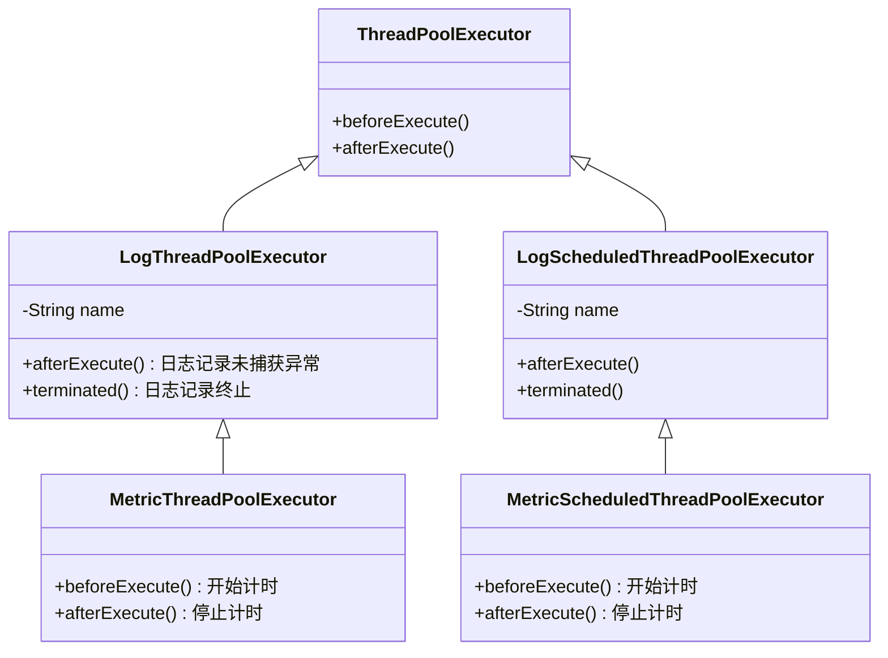
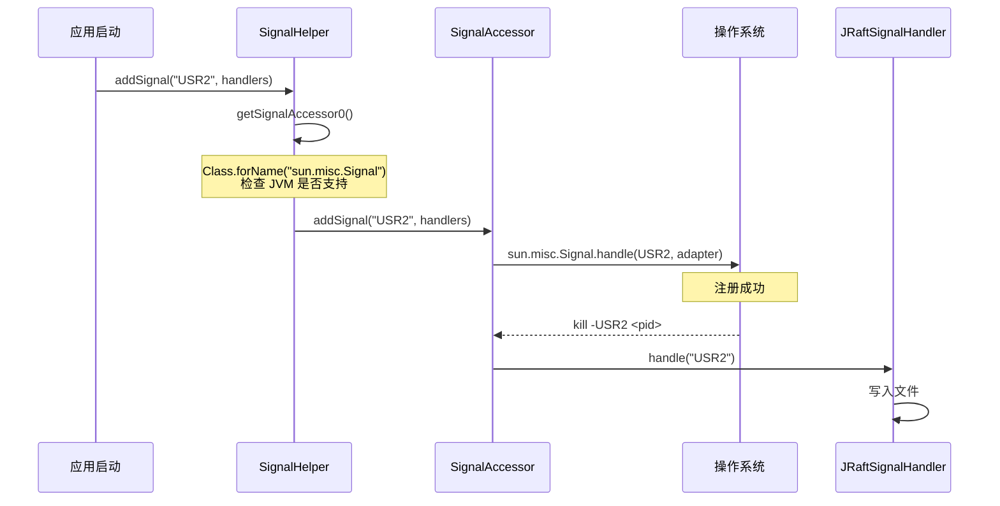

# 12 - Metrics 与可观测性（Metrics & Observability）

## ☕ 想先用人话了解监控？请看通俗解读

> **👉 [点击阅读：用人话聊聊监控（通俗解读完整版）](./通俗解读.md)**
>
> 通俗解读版用"体检报告"的比喻，带你理解 Timer/Counter/Histogram 三种测量工具、Unix Signal 紧急诊断、Disruptor 队列监控和 Prometheus 集成。**建议先读通俗解读版。**

---

> 本章分析 JRaft 的 Metrics 采集、信号处理（Signal）、可观测性基础设施的完整设计，从"如何知道系统运行状态"这个核心问题出发，推导出整个监控体系架构。

---

## 1. 核心问题与设计推导

### 1.1 要解决什么问题？

一个分布式共识系统在生产环境运行时，运维需要回答以下关键问题：

1. **性能监控**：日志复制延迟多少？选举花了多长时间？快照安装需要多久？
2. **吞吐量统计**：每秒处理多少条日志？每秒处理多少次 ReadIndex？
3. **资源监控**：Disruptor 队列是否堆积？线程池是否饱和？内存中有多少日志？
4. **节点状态诊断**：Replicator 的日志滞后多少？节点当前处于什么状态？
5. **运行时诊断**：不重启进程的情况下，如何 dump 当前所有节点状态？

### 1.2 推导出的设计

| 需求 | 需要什么信息 | 推导出的结构 |
|---|---|---|
| 延迟统计（p50/p99/p999） | 操作起止时间 | `Timer`（Codahale Metrics） |
| 计数器（总次数） | 操作次数 | `Counter` |
| 批量大小分布 | 每批大小 | `Histogram` |
| 资源实时状态 | 当前值 | `Gauge`（通过 `MetricSet` 注册） |
| 运行时诊断 | 进程信号 | `JRaftSignalHandler` + SPI 扩展 |
| 开关控制 | 是否启用 | `NodeOptions.enableMetrics` |

---

## 2. 架构总览

```mermaid
classDiagram
    class NodeMetrics {
        -MetricRegistry metrics
        +isEnabled() boolean
        +recordTimes(key, times)
        +recordSize(key, size)
        +recordLatency(key, duration)
        +getMetricRegistry() MetricRegistry
    }
    
    class MetricReporter {
        -MetricRegistry registry
        -PrintStream output
        -String prefix
        +report()
        +forRegistry() Builder
    }
    
    class DisruptorMetricSet {
        -RingBuffer ringBuffer
        +getMetrics() Map
    }
    
    class ThreadPoolMetricSet {
        -ThreadPoolExecutor executor
        +getMetrics() Map
    }
    
    class ReplicatorMetricSet {
        -ReplicatorOptions opts
        -Replicator r
        +getMetrics() Map
    }
    
    class LogsInMemoryMetricSet {
        -SegmentList logsInMemory
        +getMetrics() Map
    }
    
    class MetricThreadPoolExecutor {
        +beforeExecute()
        +afterExecute()
    }
    
    class ThreadPoolMetricRegistry {
        -MetricRegistry metricRegistry$
        -ThreadLocal~Timer.Context~ timerThreadLocal$
    }
    
    class JRaftSignalHandler {
        <<interface>>
        +handle(signalName)
    }
    
    class NodeMetricsSignalHandler {
        +handle(signalName)
    }
    
    class ThreadPoolMetricsSignalHandler {
        +handle(signalName)
    }
    
    class NodeDescribeSignalHandler {
        +handle(signalName)
    }
    
    NodeMetrics --> MetricReporter : 被 reporter 读取
    DisruptorMetricSet ..|> MetricSet
    ThreadPoolMetricSet ..|> MetricSet
    ReplicatorMetricSet ..|> MetricSet
    LogsInMemoryMetricSet ..|> MetricSet
    MetricThreadPoolExecutor --> ThreadPoolMetricRegistry : 写入 Timer
    NodeMetricsSignalHandler ..|> JRaftSignalHandler
    ThreadPoolMetricsSignalHandler ..|> JRaftSignalHandler
    NodeDescribeSignalHandler ..|> JRaftSignalHandler
    NodeMetricsSignalHandler --> MetricReporter : 使用
    ThreadPoolMetricsSignalHandler --> MetricReporter : 使用
```



---

## 3. NodeMetrics —— 节点级 Metrics 门面

### 3.1 问题推导

【问题】如何为 JRaft 各组件提供统一的 metrics 记录入口？
【需要什么信息】①是否启用（开关）②底层 MetricRegistry 引用 ③三种记录方式（延迟/计数/直方图）
【推导出的结构】一个轻量级门面类，内部持有 `MetricRegistry`，提供三个 record 方法，所有方法内部先判 null

### 3.2 数据结构分析（`NodeMetrics.java:32-108`）

```java
// NodeMetrics.java 第 32-33 行
public class NodeMetrics {
    private final MetricRegistry metrics;  // 第 33 行：核心字段，null 表示禁用

    public NodeMetrics(final boolean enableMetrics) {  // 第 35 行
        if (enableMetrics) {
            this.metrics = new MetricRegistry();  // 每个 Node 独立的 MetricRegistry
        } else {
            this.metrics = null;  // 禁用时为 null
        }
    }
}
```

> ⚠️ **设计决策**：每个 `Node` 拥有独立的 `MetricRegistry`（不是全局共享的），因此多个 Raft Group 在同一进程中的 metrics 互不干扰。这与 RheaKV 的 `KVMetrics` 使用全局静态 `MetricRegistry` 的设计形成**对比**。

### 3.3 三种记录方式

| 方法 | Codahale 类型 | 用途 | 代码行号 |
|---|---|---|---|
| `recordTimes(key, times)` | `Counter` | 累计计数（如 apply-task-overload-times） | 第 82-85 行 |
| `recordSize(key, size)` | `Histogram` | 分布统计（如 append-logs-count、replicate-entries-bytes） | 第 93-97 行 |
| `recordLatency(key, duration)` | `Timer` | 延迟分布（如 handle-append-entries、request-vote） | 第 105-109 行 |

所有三个方法内部都先检查 `this.metrics != null`，**metrics 未启用时零开销**。

### 3.4 分支穷举

```
recordTimes(key, times):
  □ metrics == null → 不做任何操作（零开销跳过）
  □ metrics != null → metrics.counter(key).inc(times)

recordSize(key, size):
  □ metrics == null → 不做任何操作
  □ metrics != null → metrics.histogram(key).update(size)

recordLatency(key, duration):
  □ metrics == null → 不做任何操作
  □ metrics != null → metrics.timer(key).update(duration, MILLISECONDS)
```

### 3.5 开关配置

```java
// NodeOptions.java 第 144 行
private boolean enableMetrics = false;  // 默认禁用！

// BootstrapOptions.java 第 61 行
private boolean enableMetrics = false;  // 同样默认禁用
```

> ⚠️ **生产踩坑**：`enableMetrics` **默认为 false**！很多用户部署后发现 metrics 全是空的，就是因为没有显式设置 `nodeOptions.setEnableMetrics(true)`。而 RheaKV 的 `KVMetrics` 是**强制启用**的（无开关），设计意图不同。

---

## 4. Metrics 埋点全景图（28 个埋点）

### 4.1 JRaft Core 层埋点（6 个组件，28 个埋点）

#### NodeImpl（10 个埋点）

| metric name | 类型 | 含义 | 代码位置 |
|---|---|---|---|
| `node-lock-blocked` | Timer | 写锁阻塞时间（`LongHeldDetectingReadWriteLock`） | `NodeImpl.java:251` |
| `handle-read-index` | Timer | 处理 ReadIndex 请求延迟 | `NodeImpl.java:1571` |
| `handle-read-index-entries` | Histogram | ReadIndex 请求中的 entries 数量 | `NodeImpl.java:1572` |
| `apply-task-overload-times` | Counter | apply 队列满导致的 overload 次数 | `NodeImpl.java:1691` |
| `handle-heartbeat-requests` | Timer | 处理心跳请求延迟 | `NodeImpl.java:2091` |
| `handle-append-entries` | Timer | 处理 AppendEntries 请求延迟 | `NodeImpl.java:2093` |
| `handle-append-entries-count` | Histogram | AppendEntries 请求中的 entries 数量 | `NodeImpl.java:2097` |
| `request-vote` | Timer | 选举投票延迟 | `NodeImpl.java:2636` |
| `pre-vote` | Timer | 预投票延迟 | `NodeImpl.java:2699` |
| `install-snapshot` | Timer | 安装快照延迟 | `NodeImpl.java:3420` |

#### Replicator（4 个埋点）

| metric name | 类型 | 含义 | 代码位置 |
|---|---|---|---|
| `replicator-<peer>_replicate-inflights-count` | Histogram | 复制器 inflight 请求数量（**带 replicator 前缀**，通过 `name(metricName, ...)` 拼接，可区分每个 Replicator 实例） | `Replicator.java:583` |
| `replicate-entries` | Timer | 日志复制延迟 | `Replicator.java:1411` |
| `replicate-entries-count` | Histogram | 单次复制的 entries 数量 | `Replicator.java:1412` |
| `replicate-entries-bytes` | Histogram | 单次复制的数据字节数 | `Replicator.java:1413` |

#### FSMCallerImpl（4 个埋点）

| metric name | 类型 | 含义 | 代码位置 |
|---|---|---|---|
| (动态: `task.type.metricName()`) | Timer | 各类型任务（COMMITTED/SNAPSHOT_SAVE 等）延迟 | `FSMCallerImpl.java:461` |
| `fsm-commit` | Timer | 状态机 commit 延迟 | `FSMCallerImpl.java:574` |
| `fsm-apply-tasks` | Timer | 状态机 apply 批量任务延迟 | `FSMCallerImpl.java:600` |
| `fsm-apply-tasks-count` | Histogram | 单次 apply 的任务数量 | `FSMCallerImpl.java:601` |

#### LogManagerImpl（5 个埋点）

| metric name | 类型 | 含义 | 代码位置 |
|---|---|---|---|
| `append-logs-count` | Histogram | 单次 append 的日志条数 | `LogManagerImpl.java:440` |
| `append-logs-bytes` | Histogram | 单次 append 的字节数 | `LogManagerImpl.java:447` |
| `append-logs` | Timer | append 操作延迟 | `LogManagerImpl.java:459` |
| `truncate-log-prefix` | Timer | 截断前缀延迟 | `LogManagerImpl.java:558` |
| `truncate-log-suffix` | Timer | 截断后缀延迟 | `LogManagerImpl.java:574` |

#### ReadOnlyServiceImpl（4 个埋点）

| metric name | 类型 | 含义 | 代码位置 |
|---|---|---|---|
| `read-index` | Timer | ReadIndex 完成延迟（成功回调） | `ReadOnlyServiceImpl.java:220` |
| `read-index-overload-times` | Counter | ReadIndex 队列 overload 次数 | `ReadOnlyServiceImpl.java:365` |
| `read-index` | Timer | ReadIndex 完成延迟（Flush 回调） | `ReadOnlyServiceImpl.java:455` |
| `read-index` | Timer | ReadIndex 完成延迟（超时/异常回调） | `ReadOnlyServiceImpl.java:469` |

#### LocalRaftMetaStorage（1 个埋点）

| metric name | 类型 | 含义 | 代码位置 |
|---|---|---|---|
| `save-raft-meta` | Timer | 保存 Raft 元数据延迟 | `LocalRaftMetaStorage.java:130` |

### 4.2 📌 面试常考：为什么有的用 Timer，有的用 Histogram？

- **Timer** = 既记录次数又记录时间分布，适合"延迟"类指标（能看到 p50/p99/p999）
- **Histogram** = 只记录值的分布，适合"大小"类指标（如 entries 数量、字节数）
- **Counter** = 只记录累计次数，适合"异常/过载"类指标

---

## 5. MetricSet —— 资源级 Gauge 监控

### 5.1 DisruptorMetricSet（`DisruptorMetricSet.java:31-51`）

```java
// DisruptorMetricSet.java 第 31-51 行
public final class DisruptorMetricSet implements MetricSet {
    private final RingBuffer<?> ringBuffer;  // 第 33 行

    @Override
    public Map<String, Metric> getMetrics() {
        final Map<String, Metric> gauges = new HashMap<>();
        gauges.put("buffer-size", (Gauge<Integer>) this.ringBuffer::getBufferSize);        // RingBuffer 总容量
        gauges.put("remaining-capacity", (Gauge<Long>) this.ringBuffer::remainingCapacity); // 剩余可用容量
        return gauges;
    }
}
```

**注册位置**（4 个 Disruptor）：

| 注册名 | 注册位置 | 监控的 Disruptor |
|---|---|---|
| `jraft-node-impl-disruptor` | `NodeImpl.java:1006` | Node 的 apply 队列 |
| `jraft-fsm-caller-disruptor` | `FSMCallerImpl.java:212` | FSMCaller 的 task 队列 |
| `jraft-log-manager-disruptor` | `LogManagerImpl.java:230` | LogManager 的 disk 队列 |
| `jraft-read-only-service-disruptor` | `ReadOnlyServiceImpl.java:297` | ReadOnly 的 readIndex 队列 |

> ⚠️ **生产踩坑**：如果 `remaining-capacity` 持续为 0，说明 Disruptor 已经饱和，任务在排队等待。表现为 apply 延迟急剧增大、ReadIndex 超时。应对措施：①增大 RingBuffer 容量（`raftOptions.setDisruptorBufferSize()`）②排查下游状态机是否有慢操作。

### 5.2 ThreadPoolMetricSet（`ThreadPoolMetricSet.java:31-53`）

```java
// ThreadPoolMetricSet.java 第 31-53 行
public final class ThreadPoolMetricSet implements MetricSet {
    private final ThreadPoolExecutor executor;  // 第 33 行

    @Override
    public Map<String, Metric> getMetrics() {
        final Map<String, Metric> gauges = new HashMap<>();
        gauges.put("pool-size", (Gauge<Integer>) executor::getPoolSize);            // 当前线程数
        gauges.put("queued", (Gauge<Integer>) executor.getQueue()::size);           // 队列积压数
        gauges.put("active", (Gauge<Integer>) executor::getActiveCount);            // 活跃线程数
        gauges.put("completed", (Gauge<Long>) executor::getCompletedTaskCount);     // 已完成任务数
        return gauges;
    }
}
```

**注册位置**（2 处）：

| 注册名 | 注册位置 | 注册到的 Registry |
|---|---|---|
| `raft-rpc-client-thread-pool` | `AbstractClientService.java:121` | `rpcOptions.getMetricRegistry()`（即 Node 的 MetricRegistry，通过 RpcOptions 传递） |
| `raft-utils-closure-thread-pool` | `Utils.java:204`（已 @Deprecated） | 通过参数传入的 `registry` |

### 5.3 ReplicatorMetricSet（`Replicator.java:186-214`）

```java
// Replicator.java 第 186-214 行
private static final class ReplicatorMetricSet implements MetricSet {
    @Override
    public Map<String, Metric> getMetrics() {
        final Map<String, Metric> gauges = new HashMap<>();
        gauges.put("log-lags", ...);                  // 日志滞后量 = lastLogIndex - (nextIndex - 1)
        gauges.put("next-index", ...);                // 当前 nextIndex
        gauges.put("heartbeat-times", ...);           // 心跳发送次数
        gauges.put("install-snapshot-times", ...);    // 快照安装次数
        gauges.put("probe-times", ...);               // 探测次数
        gauges.put("block-times", ...);               // 阻塞次数
        gauges.put("append-entries-times", ...);      // AppendEntries 次数
        gauges.put("consecutive-error-times", ...);   // 连续错误次数
        gauges.put("state", ...);                     // Replicator 状态（ordinal）
        gauges.put("running-state", ...);             // 运行状态（IDLE/BLOCKING/APPENDING/INSTALLING）
        gauges.put("locked", ...);                    // 是否被锁定（-1=无id, 0=未锁, 1=已锁）
        return gauges;
    }
}
```

**11 个 Gauge** 覆盖了 Replicator 的所有关键状态。

> ⚠️ **生产踩坑**：`log-lags` 是监控日志复制是否健康的**最关键指标**。如果某个 Follower 的 `log-lags` 持续增大，可能原因：①网络延迟 ②Follower 磁盘 I/O 慢 ③Follower 在安装快照 ④Leader 发送速率限制。

### 5.4 LogsInMemoryMetricSet（`LogManagerImpl.java:108-123`）

```java
// LogManagerImpl.java 第 108-123 行
private final static class LogsInMemoryMetricSet implements MetricSet {
    final SegmentList<LogEntry> logsInMemory;

    @Override
    public Map<String, Metric> getMetrics() {
        final Map<String, Metric> gauges = new HashMap<>();
        gauges.put("logs-size", (Gauge<Integer>) this.logsInMemory::size);               // 内存中日志条数
        gauges.put("logs-memory-bytes", (Gauge<Long>) this.logsInMemory::estimatedBytes); // 内存中日志估算字节数
        return gauges;
    }
}
```

**注册名**：`jraft-logs-manager-logs-in-memory`（`LogManagerImpl.java:232`）

> ⚠️ **生产踩坑**：`logs-memory-bytes` 是 OOM 的**预警指标**。如果这个值持续增长，说明日志不断追加但没有被 truncate（快照之后才会 truncate prefix）。需要检查快照策略是否合理。

---

## 6. 线程池 Metrics 增强

### 6.1 继承体系



### 6.2 MetricThreadPoolExecutor 计时机制（`MetricThreadPoolExecutor.java:60-81`）

```java
// MetricThreadPoolExecutor.java 第 60-68 行
@Override
protected void beforeExecute(Thread t, Runnable r) {
    super.beforeExecute(t, r);  // 先调父类（LogThreadPoolExecutor 无 beforeExecute 逻辑）
    try {
        ThreadPoolMetricRegistry.timerThreadLocal()
            .set(ThreadPoolMetricRegistry.metricRegistry()
                .timer("threadPool." + getName()).time());  // 开始计时
    } catch (final Throwable ignored) {
        // ignored
    }
}

// MetricThreadPoolExecutor.java 第 70-81 行
@Override
protected void afterExecute(Runnable r, Throwable t) {
    super.afterExecute(r, t);  // 先调父类（LogThreadPoolExecutor 的异常日志记录）
    try {
        final ThreadLocal<Timer.Context> tl = ThreadPoolMetricRegistry.timerThreadLocal();
        final Timer.Context ctx = tl.get();
        if (ctx != null) {
            ctx.stop();     // 停止计时
            tl.remove();    // 清理 ThreadLocal，防止内存泄漏
        }
    } catch (final Throwable ignored) {
        // ignored
    }
}
```

### 6.3 ThreadPoolMetricRegistry —— 全局线程池 MetricRegistry（`ThreadPoolMetricRegistry.java:27-41`）

```java
// ThreadPoolMetricRegistry.java 第 28-30 行
public class ThreadPoolMetricRegistry {
    private static final MetricRegistry             metricRegistry   = new MetricRegistry();  // 全局唯一
    private static final ThreadLocal<Timer.Context> timerThreadLocal = new ThreadLocal<>();    // 跨方法传递计时上下文
}
```

> ⚠️ **设计差异**：`ThreadPoolMetricRegistry` 使用**全局静态** `MetricRegistry`（与 `NodeMetrics` 的每 Node 独立 Registry 不同）。这是因为线程池是进程级资源，不属于某个 Raft Group。

### 6.4 分支穷举

```
MetricThreadPoolExecutor.beforeExecute():
  □ 正常 → timerThreadLocal.set(timer.time())
  □ catch(Throwable) → ignored（静默吞掉，metrics 不影响业务）

MetricThreadPoolExecutor.afterExecute():
  □ ctx != null → ctx.stop() + tl.remove()
  □ ctx == null → 不做操作（可能 beforeExecute 抛异常了）
  □ catch(Throwable) → ignored

LogThreadPoolExecutor.afterExecute():  // 父类，第 78-95 行
  □ t == null && r instanceof Future && f.isDone() → f.get() 检查异步异常
    □ catch(CancellationException) → ignored
    □ catch(ExecutionException) → t = ee.getCause()
    □ catch(InterruptedException) → Thread.currentThread().interrupt()
  □ t == null && !(r instanceof Future) → 不做操作
  □ t != null → LOG.error("Uncaught exception in pool: {}, {}.", name, super.toString(), t)
```

> 📌 **面试常考**：`LogThreadPoolExecutor.afterExecute()` 中为什么要对 `Future` 调用 `f.get()`？因为 `submit()` 提交的任务异常不会传到 `afterExecute` 的 `Throwable t` 参数（`t` 只捕获 `execute()` 直接抛出的异常），必须通过 `Future.get()` 才能拿到。

---

## 7. MetricReporter —— Console 风格报告器

### 7.1 问题推导

【问题】如何将 MetricRegistry 中的所有 metrics 输出到文件/控制台？
【需要什么信息】①MetricRegistry 引用 ②输出目标（PrintStream）③格式化配置（locale/时区/单位）④过滤条件
【推导出的结构】Builder 模式构造 Reporter，同步输出所有类型的 metrics

### 7.2 设计特点（`MetricReporter.java:48-437`）

`MetricReporter` 是 **Fork** 自 `com.codahale.metrics.ConsoleReporter` 的自定义实现，主要改动：

1. **不是 ScheduledReporter**：不自动定时上报，而是按需调用 `report()`
2. **加了 `prefix`**：`prefixedWith("-- " + nodeId)` 使多节点的 metrics 输出可区分
3. **synchronized report()**：线程安全的输出

```java
// MetricReporter.java 第 64-71 行
public void report() {
    synchronized (this) {  // 线程安全
        report(this.registry.getGauges(this.filter),
            this.registry.getCounters(this.filter),
            this.registry.getHistograms(this.filter),
            this.registry.getMeters(this.filter),
            this.registry.getTimers(this.filter));
    }
}
```

### 7.3 输出格式

按 **Gauges → Counters → Histograms → Meters → Timers** 的固定顺序输出。每种类型输出的 attributes：

| 类型 | 输出的 attributes |
|---|---|
| Gauge | value |
| Counter | count |
| Histogram | count, min, max, mean, stddev, median, p75, p95, p98, p99, p999 |
| Meter | count, mean_rate, 1min_rate, 5min_rate, 15min_rate |
| Timer | count, mean_rate + min, max, mean, stddev, median, p75~p999（同时包含 rate 和 duration） |

---

## 8. 信号处理机制（Signal Handler）

### 8.1 问题推导

【问题】如何在不重启进程的情况下获取运行时诊断信息？
【需要什么信息】①进程信号（Unix USR2）②SPI 扩展机制 ③输出目标（文件）
【推导出的结构】`JRaftSignalHandler` 接口 + SPI 注册 + `kill -USR2 <pid>` 触发

### 8.2 接口与 SPI 注册

```java
// JRaftSignalHandler.java 第 24-28 行
@FunctionalInterface
public interface JRaftSignalHandler {
    void handle(final String signalName);
}
```

**SPI 注册文件**：`META-INF/services/com.alipay.sofa.jraft.util.JRaftSignalHandler`

```
com.alipay.sofa.jraft.NodeDescribeSignalHandler
com.alipay.sofa.jraft.NodeMetricsSignalHandler
com.alipay.sofa.jraft.ThreadPoolMetricsSignalHandler
```

### 8.3 SignalHelper 信号注册（`SignalHelper.java:30-115`）



**分支穷举**（`SignalHelper.java:49-54`）：
```
addSignal(signalName, handlers):   // 第 49-54 行
  □ SIGNAL_ACCESSOR == null（不支持 sun.misc.Signal，如 Windows）→ return false
  □ SIGNAL_ACCESSOR != null → SIGNAL_ACCESSOR.addSignal() → return true
  
hasSignal0():   // 第 62-71 行
  □ Class.forName("sun.misc.Signal") 成功 → return true
  □ catch(Throwable) → LOG.warn + return false

SignalHandlerAdapter.handle(signal):   // 第 102-113 行
  □ !this.target.equals(signal)（信号名不匹配）→ return
  □ 正常 → LOG.info + 遍历 handlers，逐个调用 h.handle(signal.getName())
  □ catch(Throwable t) → LOG.error("Fail to handle signal: {}.")
```

### 8.4 三个信号处理器详解

#### ① NodeDescribeSignalHandler（`NodeDescribeSignalHandler.java:39-69`）

- **输出文件**：`node_describe.log.<timestamp>`（目录由 `-Djraft.signal.node.describe.dir` 配置，默认当前目录）
- **输出内容**：遍历 `NodeManager.getInstance().getAllNodes()`，对每个 Node 调用 `node.describe(printer)`
- **用途**：打印节点当前的 term、state、leader、commitIndex 等运行状态

**分支穷举**：
```
handle(signalName):
  □ nodes.isEmpty() → return（无节点，不输出）
  □ 正常 → getOutputFile() → 遍历 nodes → node.describe(printer)
  □ catch(IOException) → LOG.error
```

#### ② NodeMetricsSignalHandler（`NodeMetricsSignalHandler.java:39-78`）

- **输出文件**：`node_metrics.log.<timestamp>`（目录由 `-Djraft.signal.node.metrics.dir` 配置）
- **输出内容**：遍历所有 Node，用 `MetricReporter` 输出每个 Node 的 `MetricRegistry`
- **前缀**：`"-- " + node.getNodeId()`

**分支穷举**：
```
handle(signalName):
  □ nodes.isEmpty() → return
  □ registry == null（该节点 metrics 未启用）→ LOG.warn + continue
  □ 正常 → MetricReporter.forRegistry(registry).outputTo(out).prefixedWith(nodeId).build().report()
  □ catch(IOException) → LOG.error
```

#### ③ ThreadPoolMetricsSignalHandler（`ThreadPoolMetricsSignalHandler.java:38-61`）

- **输出文件**：`thread_pool_metrics.log.<timestamp>`（目录由 `-Djraft.signal.thread.pool.metrics.dir` 配置）
- **输出内容**：`ThreadPoolMetricRegistry.metricRegistry()` 中注册的所有线程池 Timer
- **无前缀**

**分支穷举**：
```
handle(signalName):
  □ 正常 → MetricReporter.forRegistry(...).outputTo(out).build().report()
  □ catch(IOException) → LOG.error
```

### 8.5 FileOutputSignalHandler 基类（`FileOutputSignalHandler.java:32-53`）

```java
// FileOutputSignalHandler.java 第 34-43 行
protected File getOutputFile(final String path, final String baseFileName) throws IOException {
    makeDir(path);  // 确保目录存在
    final String now = new SimpleDateFormat("yyyy-MM-dd_HH-mm-ss").format(new Date());
    final String fileName = baseFileName + "." + now;  // 带时间戳的文件名
    final File file = Paths.get(path, fileName).toFile();
    if (!file.exists() && !file.createNewFile()) {
        throw new IOException("Fail to create file: " + file);
    }
    return file;
}
```

> ⚠️ **生产踩坑**：每次 `kill -USR2` 都会生成一个**新文件**（带时间戳），不会覆盖旧文件。频繁调用会积累大量小文件，需要定期清理。

---

## 9. RheaKV Metrics 体系

### 9.1 KVMetrics —— 全局静态 Registry（`KVMetrics.java:34-121`）

与 `NodeMetrics` 的对比：

| 特性 | NodeMetrics | KVMetrics |
|---|---|---|
| 作用域 | 每 Node 独立 | 全局静态（进程级） |
| 开关 | `enableMetrics` | **无开关，强制启用** |
| 使用方式 | 实例方法 `recordXxx()` | 静态方法 `meter()/timer()/counter()/histogram()` |
| 底层库 | Codahale Metrics | Codahale Metrics |
| name 分隔符 | `.`（MetricRegistry 默认） | `_`（自定义 `name()` 方法） |

### 9.2 KVMetricNames 常量定义（`KVMetricNames.java:26-43`）

| 常量名 | 值 | 用途 |
|---|---|---|
| `STATE_MACHINE_APPLY_QPS` | `rhea-st-apply-qps` | 状态机 apply 的 QPS |
| `STATE_MACHINE_BATCH_WRITE` | `rhea-st-batch-write` | 批量写入的 batch 大小分布 |
| `RPC_REQUEST_HANDLE_TIMER` | `rhea-rpc-request-timer` | RPC 请求处理耗时 |
| `DB_TIMER` | `rhea-db-timer` | 底层 DB 操作耗时 |
| `REGION_KEYS_READ` | `rhea-region-keys-read` | Region 读取 key 数 |
| `REGION_KEYS_WRITTEN` | `rhea-region-keys-written` | Region 写入 key 数 |
| `REGION_BYTES_READ` | `rhea-region-bytes-read` | Region 读取字节数 |
| `REGION_BYTES_WRITTEN` | `rhea-region-bytes-written` | Region 写入字节数 |
| `SEND_BATCHING` | `send_batching` | 客户端批量发送统计 |

### 9.3 RheaKV 信号处理器

RheaKV 有自己的信号处理器 `RheaKVMetricsSignalHandler`（`RheaKVMetricsSignalHandler.java:38-62`），使用 `KVMetrics.metricRegistry()` 输出 metrics，前缀为 `"-- rheakv"`。输出文件名为 `rheakv_metrics.log.<timestamp>`，目录由 `-Drheakv.signal.metrics.dir` 配置。

### 9.4 RheaKV 的自动上报

```java
// StoreEngine.java 第 572 行
this.kvMetricsReporter = Slf4jReporter.forRegistry(KVMetrics.metricRegistry()) //
    .outputTo(...)
    ...;
```

RheaKV 使用 `Slf4jReporter`（Codahale 自带的 SLF4J Reporter）自动定时上报到日志，而 JRaft Core 层没有自动上报机制，只能通过信号触发。

---

## 10. 三级 MetricRegistry 总览

```mermaid
flowchart TD
    subgraph "JRaft Core 层"
        NM["NodeMetrics.metrics<br/>(每 Node 独立)"]
        TPR["ThreadPoolMetricRegistry.metricRegistry<br/>(全局静态)"]
    end
    
    subgraph "RheaKV 层"
        KVM["KVMetrics.metricRegistry<br/>(全局静态)"]
    end
    
    NM -->|"注册"| D1["jraft-node-impl-disruptor<br/>(DisruptorMetricSet)"]
    NM -->|"注册"| D2["jraft-fsm-caller-disruptor<br/>(DisruptorMetricSet)"]
    NM -->|"注册"| D3["jraft-log-manager-disruptor<br/>(DisruptorMetricSet)"]
    NM -->|"注册"| D4["jraft-read-only-service-disruptor<br/>(DisruptorMetricSet)"]
    NM -->|"注册"| D5["jraft-logs-manager-logs-in-memory<br/>(LogsInMemoryMetricSet)"]
    NM -->|"注册"| D6["replicator-<peer><br/>(ReplicatorMetricSet)"]
    NM -->|"注册"| D7["raft-rpc-client-thread-pool<br/>(ThreadPoolMetricSet)"]
    NM -->|"recordXxx()"| D8["28 个业务埋点<br/>(Counter/Histogram/Timer)"]
    
    TPR -->|"timer()"| T1["threadPool.<name><br/>(MetricThreadPoolExecutor)"]
    TPR -->|"timer()"| T2["scheduledThreadPool.<name><br/>(MetricScheduledThreadPoolExecutor)"]
    
    KVM -->|"meter/timer/counter/histogram"| K1["rhea-* 系列<br/>(9 种 metrics)"]
    
    style NM fill:#f9f,stroke:#333
    style TPR fill:#9ff,stroke:#333
    style KVM fill:#ff9,stroke:#333
```



---

## 11. 核心不变式

| # | 不变式 | 保证机制 |
|---|---|---|
| 1 | `NodeMetrics` 的三个 record 方法在 `metrics == null` 时**零开销** | 每个方法内部 null 检查（`NodeMetrics.java:82/93/105`） |
| 2 | `MetricReporter.report()` 是**线程安全**的 | `synchronized(this)` 块（`MetricReporter.java:64-71`） |
| 3 | `MetricThreadPoolExecutor` 的 metrics 异常**不影响业务** | `catch(Throwable ignored)`（`MetricThreadPoolExecutor.java:67/80`） |
| 4 | 信号处理器每次生成**新文件**（不覆盖） | `fileName = baseFileName + "." + timestamp`（`FileOutputSignalHandler.java:37-38`） |
| 5 | RheaKV 的 `KVMetrics` **强制启用**（无开关） | 全局静态 `MetricRegistry`，无 null 检查（`KVMetrics.java:36`） |

---

## 12. 生产最佳实践

### 12.1 开启 Metrics

```java
NodeOptions opts = new NodeOptions();
opts.setEnableMetrics(true);  // 必须显式开启！默认 false
```

### 12.2 信号触发

```bash
# 输出节点 metrics
kill -USR2 <pid>

# 输出文件在以下位置（可通过 JVM 参数配置）：
# -Djraft.signal.node.metrics.dir=/path/to/dir
# -Djraft.signal.node.describe.dir=/path/to/dir
# -Djraft.signal.thread.pool.metrics.dir=/path/to/dir
```

### 12.3 关键告警阈值建议

| 指标 | 告警阈值 | 原因 |
|---|---|---|
| `handle-append-entries` p99 | > 100ms | Follower 处理 AppendEntries 过慢 |
| `replicate-entries` p99 | > 200ms | 日志复制延迟大，影响 commit |
| `log-lags` | > 10000 | Follower 日志严重滞后 |
| `remaining-capacity` | = 0 | Disruptor 饱和 |
| `apply-task-overload-times` | > 0 | 任务队列溢出 |
| `queued`（线程池） | > 1000 | 线程池积压 |
| `logs-memory-bytes` | > 500MB | 内存日志过多，OOM 风险 |

### 12.4 自定义 Reporter 集成

```java
// Prometheus 集成示例
NodeMetrics nodeMetrics = node.getNodeMetrics();
if (nodeMetrics.isEnabled()) {
    MetricRegistry registry = nodeMetrics.getMetricRegistry();
    // 使用 io.prometheus.client.dropwizard.DropwizardExports
    CollectorRegistry.defaultRegistry.register(new DropwizardExports(registry));
}
```

---

## 13. 横向对比总结

| 维度 | NodeMetrics (JRaft Core) | KVMetrics (RheaKV) | ThreadPoolMetricRegistry |
|---|---|---|---|
| 作用域 | 每 Node | 全局 | 全局 |
| 开关 | `enableMetrics=false`（默认禁用） | **强制启用** | **强制启用** |
| Registry 类型 | 实例字段 | 静态字段 | 静态字段 |
| 记录方式 | `recordXxx()` 方法 | 静态 `meter()/timer()` 等 | beforeExecute/afterExecute 钩子 |
| 输出方式 | 信号 → `MetricReporter` | `Slf4jReporter`（自动定时）| 信号 → `MetricReporter` |
| 总埋点数 | 28 个 | 9 种 prefix × N 个 Region | 每线程池 1 个 Timer |
