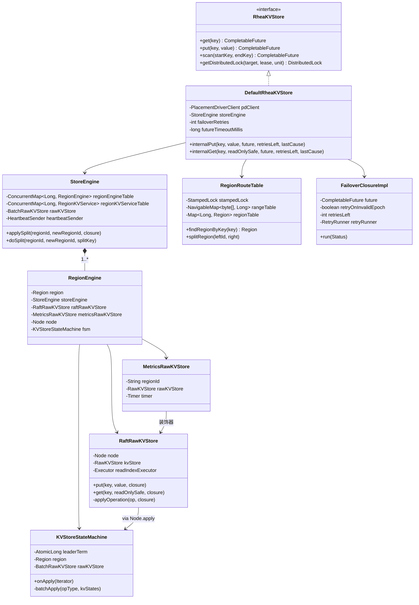
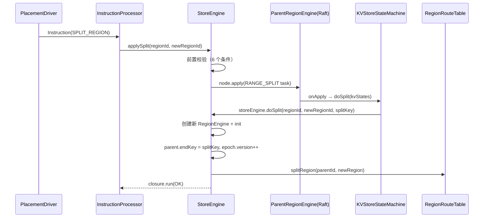
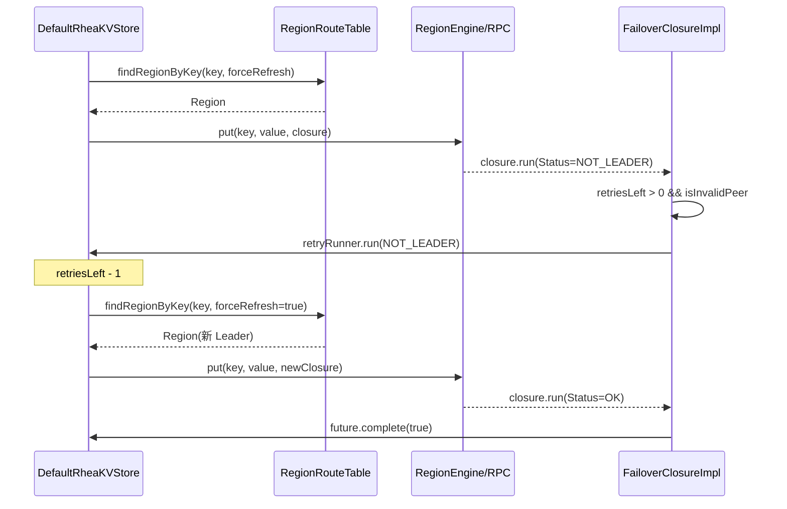

# 13 - RheaKV：基于 JRaft 的分布式 KV 存储深度分析

## ☕ 想先用人话了解 RheaKV？请看通俗解读

> **👉 [点击阅读：用人话聊聊 RheaKV（通俗解读完整版）](./通俗解读.md)**
>
> 通俗解读版用"图书馆分楼层"的比喻，带你理解 Region 分片、路由表、自动分裂、Scatter-Gather 批量操作和故障转移。**建议先读通俗解读版。**

---

## 1. 核心问题与设计推导

### 1.1 问题

如何在 JRaft（单 Raft Group）之上构建一个**支持水平扩展的分布式 KV 存储**？

### 1.2 推导过程

| 问题 | 需要什么 | 推导出的结构 |
|---|---|---|
| 数据量超过单机容量怎么办？ | 将数据按 key range 分片 | `Region`（[startKey, endKey)） |
| 每个分片如何保证一致性？ | 每个分片一个独立 Raft Group | `RegionEngine`（包含 NodeImpl） |
| 一个节点管理多个分片怎么办？ | 一个进程托管多个 RegionEngine | `StoreEngine`（ConcurrentMap<Long, RegionEngine>） |
| 客户端如何知道 key 在哪个分片？ | 按 startKey 排序的路由表 | `RegionRouteTable`（TreeMap<byte[], Long>） |
| 分片元数据谁来管理？ | 中心化元数据服务 | `PlacementDriver`（基于 JRaft 的 PD 集群） |
| 分片过大怎么办？ | 自动分裂 | `applySplit()` + `doSplit()` + `RANGE_SPLIT` 操作 |
| 请求失败怎么办？ | 客户端自动重试 + 故障转移 | `FailoverClosureImpl` + `RetryRunner` |

---

## 2. 架构总览

### 2.1 分层架构类图



### 2.2 存储层链路（核心装饰器模式）

```
RegionKVService
    → MetricsRawKVStore（计时 + 统计）
        → RaftRawKVStore（提交 Raft 日志 / ReadIndex）
            → KVStoreStateMachine.onApply()
                → BatchRawKVStore（RocksRawKVStore / MemoryRawKVStore）
```

---

## 3. Region 数据结构（`Region.java:43-145`）

### 3.1 问题推导

**【问题】** 如何表示一个数据分片？→ **【需要什么信息】** 分片 ID、key 范围、版本号（分裂时递增）、Raft 成员列表 → **【推导出的结构】** Region

```java
// Region.java 第 43-55 行
public class Region implements Copiable<Region>, Serializable {
    private long              id;            // 第 51 行：region id
    private byte[]            startKey;      // 第 53 行：[startKey, endKey) 左闭右开
    private byte[]            endKey;        // 第 54 行：null 表示无上界
    private RegionEpoch       regionEpoch;   // 第 55 行：版本号（confVer + version）
    private List<Peer>        peers;         // 第 56 行：该 Region 的所有 Raft 副本
}
```

**关键设计**：
- `endKey == null` 表示覆盖到 key 空间的最大值（`Region.java:54`）
- `equals()` 只比较 `id` 和 `regionEpoch`，不比较 key range（`Region.java:127-132`）
- `copy()` 是**深拷贝**（包括 RegionEpoch 和 peers 列表）（`Region.java:108-121`）

### 3.2 RegionEpoch

```java
// RegionEpoch 有两个版本号：
//   confVer：配置变更版本号（成员变更时递增）
//   version：数据变更版本号（分裂时递增）
```

---

## 4. RegionRouteTable 路由表（`RegionRouteTable.java:93-338`）

### 4.1 问题推导

**【问题】** 客户端怎么快速找到 key 所在的 Region？→ **【需要什么信息】** 所有 Region 的 startKey，按字节序排列 → **【推导出的结构】** `TreeMap<byte[], Long>`（有序映射，支持 `floorEntry` 查找最近的左边界）

```java
// RegionRouteTable.java 第 97-99 行
private final StampedLock                stampedLock  = new StampedLock();       // 第 97 行：乐观读锁
private final NavigableMap<byte[], Long> rangeTable   = new TreeMap<>(keyBytesComparator);  // 第 98 行：startKey → regionId
private final Map<Long, Region>          regionTable  = Maps.newHashMap();       // 第 99 行：regionId → Region
```

### 4.2 为什么用 startKey 而不用 endKey？

源码注释（`RegionRouteTable.java:82-88`）说得很清楚：
> 分裂时只需要**新增一条记录**（新 Region 的 startKey），原 Region 的记录不需要修改。如果用 endKey，分裂时需要修改原 Region 的 endKey，增加复杂度。

### 4.3 关键方法分支穷举

```
findRegionByKey(key):   // 第 188-194 行（公共方法，内部调用 findRegionByKeyWithoutLock 第 196-203 行）
  □ 获取 readLock
  □ floorEntry(key) == null → reportFail + throw RouteTableException
  □ floorEntry(key) != null → return regionTable.get(entry.getValue())
  □ finally → unlockRead

getRegionById(regionId):   // 第 101-114 行
  □ tryOptimisticRead 成功（validate 通过） → return safeCopy(region)
  □ tryOptimisticRead 失败（validate 不通过） → readLock → return safeCopy(region)

splitRegion(leftId, right):   // 第 132-157 行
  □ 前置校验（5 个 Requires.requireTrue/requireNonNull）
  □ 正常 → leftEpoch.version++ + left.setEndKey(rightStartKey) + regionTable.put(rightId, right.copy()) + rangeTable.put(rightStartKey, rightId)

findRegionsByKeyRange(startKey, endKey):   // 第 253-275 行
  □ endKey == null → rangeTable.tailMap(realStartKey, false)
  □ endKey != null → rangeTable.subMap(realStartKey, false, endKey, true)
  □ headEntry == null → reportFail + throw RouteTableException
  □ 正常 → headEntry + subRegionMap.values() 组合为 regionList

findStartKeyOfNextRegion(key):   // 第 280-295 行
  □ tryOptimisticRead 成功 → return rangeTable.higherKey(key)
  □ tryOptimisticRead 失败 → readLock → return rangeTable.higherKey(key)
```

### 4.4 并发设计：StampedLock

- **读操作**（`findRegionByKey`、`findRegionsByKeyRange`）：使用 `readLock`（因为内部可能抛出异常，乐观读不安全）
- **写操作**（`addOrUpdateRegion`、`splitRegion`、`removeRegion`）：使用 `writeLock`
- **`getRegionById`**：使用 `tryOptimisticRead`，因为只读单条记录，乐观读成功率极高

---

## 5. RaftRawKVStore —— 读写路径分析（`RaftRawKVStore.java:47-393`）

### 5.1 写路径

```java
// RaftRawKVStore.java 第 377-387 行
private void applyOperation(final KVOperation op, final KVStoreClosure closure) {
    if (!isLeader()) {                           // 第 378 行：非 Leader → 立即返回错误
        closure.setError(Errors.NOT_LEADER);
        closure.run(new Status(RaftError.EPERM, "Not leader"));
        return;
    }
    final Task task = new Task();
    task.setData(ByteBuffer.wrap(Serializers.getDefault().writeObject(op)));  // 第 384 行：序列化
    task.setDone(new KVClosureAdapter(closure, op));                          // 第 385 行：包装回调
    this.node.apply(task);                                                     // 第 386 行：提交 Raft
}
```

**分支穷举**（`applyOperation`，`RaftRawKVStore.java:377-387`）：
```
applyOperation(op, closure):
  □ !isLeader() → closure.setError(NOT_LEADER) + closure.run(EPERM)
  □ isLeader() → 序列化 op → Task.setDone(KVClosureAdapter) → node.apply(task)
```

### 5.2 读路径（ReadIndex 优化）

```java
// RaftRawKVStore.java 第 68-94 行
public void get(final byte[] key, final boolean readOnlySafe, final KVStoreClosure closure) {
    if (!readOnlySafe) {                                    // 第 69 行：不要求线性一致
        this.kvStore.get(key, false, closure);              // 直接读本地
        return;
    }
    this.node.readIndex(BytesUtil.EMPTY_BYTES, new ReadIndexClosure() {   // 第 74 行：ReadIndex
        @Override
        public void run(final Status status, final long index, final byte[] reqCtx) {
            if (status.isOk()) {                             // 第 78 行：ReadIndex 成功
                RaftRawKVStore.this.kvStore.get(key, true, closure);
                return;
            }
            // ReadIndex 失败
            RaftRawKVStore.this.readIndexExecutor.execute(() -> {
                if (isLeader()) {                            // 第 83 行：Leader → 降级为走状态机
                    applyOperation(KVOperation.createGet(key), closure);
                } else {                                     // 第 88 行：Follower → 返回错误让客户端重试
                    new KVClosureAdapter(closure, null).run(status);
                }
            });
        }
    });
}
```

**分支穷举**（`get(key, readOnlySafe, closure)`，`RaftRawKVStore.java:68-94`）：
```
get(key, readOnlySafe, closure):
  □ !readOnlySafe → kvStore.get(key, false, closure)  // 直接读本地，无一致性保证
  □ readOnlySafe → node.readIndex()
    □ ReadIndex 成功（status.isOk()）→ kvStore.get(key, true, closure)
    □ ReadIndex 失败 + isLeader() → applyOperation(GET, closure)  // 降级为走 Raft 状态机
    □ ReadIndex 失败 + !isLeader() → KVClosureAdapter.run(status)  // 返回错误，客户端重试到 Leader
```

---

## 6. KVStoreStateMachine —— 批量状态机（`KVStoreStateMachine.java:59-386`）

> **注意**：下面的行号标注基于源码实际行号。类声明在第 59 行，但字段因构造函数等占位导致偏移。

### 6.1 问题推导

**【问题】** Raft 日志一条条 apply 太慢怎么办？→ **【推导】** 将相同类型的操作攒成一批（`KVStateOutputList`），调用底层存储的 batch API → **【结构】** `batchApply(opByte, kvStates)`

### 6.2 数据结构

```java
// KVStoreStateMachine.java 第 59-82 行
private final AtomicLong          leaderTerm = new AtomicLong(-1L);  // 第 63 行：-1 表示非 Leader
private final Serializer          serializer = Serializers.getDefault();
private final Region              region;
private final StoreEngine         storeEngine;
private final BatchRawKVStore<?>  rawKVStore;
private final KVStoreSnapshotFile storeSnapshotFile;
private final Meter               applyMeter;           // 第 71 行：apply QPS metrics
private final Histogram           batchWriteHistogram;   // 第 72 行：batch size metrics
```

### 6.3 onApply 分支穷举（`KVStoreStateMachine.java:84-125`）

```
onApply(Iterator it):
  while it.hasNext():
    □ done != null（Leader 节点）→ kvOp = done.getOperation()  // 不需要反序列化
    □ done == null（Follower 节点）→
      □ buf.hasArray() → serializer.readObject(buf.array())
      □ !buf.hasArray() → serializer.readObject(buf)
      □ kvOp.isReadOp()（Follower 忽略读操作）→ index++ + continue
      □ catch(Throwable) → index++ + throw StoreCodecException
    □ first != null && !first.isSameOp(kvOp)（操作类型切换）→ batchApplyAndRecycle 前一批 + 新建 kvStates
    □ 正常 → kvStates.add(KVState.of(kvOp, done))
  □ kvStates 非空 → batchApplyAndRecycle 最后一批
  □ catch(Throwable) → it.setErrorAndRollback(index - applied, ESTATEMACHINE)
  □ finally → applyMeter.mark(applied)
```

### 6.4 batchApply 支持的 22 种操作类型

```java
// KVStoreStateMachine.java 第 163-228 行（batchApply 方法）
switch (opType) {
    case PUT:              → rawKVStore.batchPut(kvStates)
    case PUT_IF_ABSENT:    → rawKVStore.batchPutIfAbsent(kvStates)
    case PUT_LIST:         → rawKVStore.batchPutList(kvStates)
    case DELETE:           → rawKVStore.batchDelete(kvStates)
    case DELETE_RANGE:     → rawKVStore.batchDeleteRange(kvStates)
    case DELETE_LIST:      → rawKVStore.batchDeleteList(kvStates)
    case GET_SEQUENCE:     → rawKVStore.batchGetSequence(kvStates)
    case NODE_EXECUTE:     → rawKVStore.batchNodeExecute(kvStates, isLeader())
    case KEY_LOCK:         → rawKVStore.batchTryLockWith(kvStates)
    case KEY_LOCK_RELEASE: → rawKVStore.batchReleaseLockWith(kvStates)
    case GET:              → rawKVStore.batchGet(kvStates)
    case MULTI_GET:        → rawKVStore.batchMultiGet(kvStates)
    case CONTAINS_KEY:     → rawKVStore.batchContainsKey(kvStates)
    case SCAN:             → rawKVStore.batchScan(kvStates)
    case REVERSE_SCAN:     → rawKVStore.batchReverseScan(kvStates)
    case GET_PUT:          → rawKVStore.batchGetAndPut(kvStates)
    case COMPARE_PUT:      → rawKVStore.batchCompareAndPut(kvStates)
    case COMPARE_PUT_ALL:  → rawKVStore.batchCompareAndPutAll(kvStates)
    case MERGE:            → rawKVStore.batchMerge(kvStates)
    case RESET_SEQUENCE:   → rawKVStore.batchResetSequence(kvStates)
    case RANGE_SPLIT:      → doSplit(kvStates)
    default:               → throw IllegalKVOperationException
}
```

### 6.5 Snapshot 分支穷举

```
onSnapshotLoad(reader):   // 第 263-268 行
  □ isLeader() → LOG.warn + return false  // Leader 不应该加载 snapshot
  □ !isLeader() → storeSnapshotFile.load(reader, region.copy())
```

---

## 7. StoreEngine —— Region 分裂（`StoreEngine.java:74-736`）

### 7.1 applySplit 分支穷举（`StoreEngine.java:462-510`）

这是分裂的**前置校验 + 提交阶段**：

```
applySplit(regionId, newRegionId, closure):
  □ regionEngineTable.containsKey(newRegionId) → closure.setError(CONFLICT_REGION_ID) + closure.run(-1)
  □ !splitting.compareAndSet(false, true) → closure.setError(SERVER_BUSY) + closure.run(-1)
  □ parentEngine == null → closure.setError(NO_REGION_FOUND) + closure.run(-1) + splitting.set(false)
  □ !parentEngine.isLeader() → closure.setError(NOT_LEADER) + closure.run(-1) + splitting.set(false)
  □ approximateKeys < leastKeysOnSplit → closure.setError(TOO_SMALL_TO_SPLIT) + closure.run(-1) + splitting.set(false)
  □ splitKey == null → closure.setError(STORAGE_ERROR) + closure.run(-1) + splitting.set(false)
  □ 正常 → 封装 KVOperation.createRangeSplit → parentEngine.getNode().apply(task)
```

### 7.2 doSplit 执行阶段（`StoreEngine.java:513-554`）

```
doSplit(regionId, newRegionId, splitKey):
  □ 正常 → 创建新 RegionEngine → init(rOpts)
    → 更新 parent region.endKey = splitKey
    → parent epoch.version + 1
    → regionEngineTable.put(newRegionId, engine)
    → registerRegionKVService(new DefaultRegionKVService(engine))
    → pdClient.getRegionRouteTable().splitRegion(pRegion.getId(), newRegion)
  □ engine.init() 失败 → throw Errors.REGION_ENGINE_FAIL.exception()
  □ finally → splitting.set(false)  // 重要：无论成功失败都要释放 splitting 标志
```

### 7.3 分裂时序图



---

## 8. 故障转移 Failover（`FailoverClosureImpl.java:42-107`）

### 8.1 问题推导

**【问题】** 客户端请求失败（Leader 切换、Region 分裂、节点不可达）怎么办？→ **【推导】** 用 Closure 包装用户 Future，失败时根据错误类型自动重试 → **【结构】** `FailoverClosureImpl` + `RetryRunner`

### 8.2 数据结构

```java
// FailoverClosureImpl.java 第 42-53 行
public final class FailoverClosureImpl<T> extends BaseKVStoreClosure implements FailoverClosure<T> {
    private final CompletableFuture<T> future;           // 第 47 行：用户 Future
    private final boolean              retryOnInvalidEpoch;  // 第 48 行：是否重试 epoch 错误
    private final int                  retriesLeft;      // 第 49 行：剩余重试次数
    private final RetryRunner          retryRunner;      // 第 50 行：重试逻辑
}
```

### 8.3 run() 分支穷举（`FailoverClosureImpl.java:64-82`）

```
run(Status status):
  □ status.isOk() → success(getData())  // future.complete(data)
  □ retriesLeft > 0 && (isInvalidPeer(error) || (retryOnInvalidEpoch && isInvalidEpoch(error)))
    → LOG.warn + retryRunner.run(error)  // 递归重试，retriesLeft - 1
  □ retriesLeft <= 0 → LOG.error + failure(error)  // future.completeExceptionally
  □ retriesLeft > 0 && 其他错误类型 → failure(error)  // 不重试
```

### 8.4 重试触发的错误类型

| 错误类型 | 含义 | 重试策略 |
|---|---|---|
| `NOT_LEADER` | 当前节点不是 Leader | `isInvalidPeer` → 刷新路由表后重试 |
| `NO_REGION_FOUND` | Region 不存在 | `isInvalidPeer` → 刷新路由表后重试 |
| `LEADER_NOT_AVAILABLE` | Leader 不可用 | `isInvalidPeer` → 刷新路由表后重试 |
| `INVALID_REGION_EPOCH` | Region epoch 不匹配（已分裂） | `isInvalidEpoch` → 刷新路由表后重试 |

### 8.5 客户端写请求完整路径（以 put 为例）

```java
// DefaultRheaKVStore.java 第 1012-1035 行
private void internalPut(final byte[] key, final byte[] value,
                         final CompletableFuture<Boolean> future,
                         final int retriesLeft, final Errors lastCause) {
    // 1. 根据 key 找 Region（如果 lastCause 是 InvalidEpoch，强制刷新路由表）
    final Region region = this.pdClient.findRegionByKey(key, ErrorsHelper.isInvalidEpoch(lastCause));
    // 2. 尝试本地调用（如果 RegionEngine 在本机）
    final RegionEngine regionEngine = getRegionEngine(region.getId(), true);
    // 3. 构建重试 Runner
    final RetryRunner retryRunner = retryCause -> internalPut(key, value, future, retriesLeft - 1, retryCause);
    // 4. 构建 FailoverClosure
    final FailoverClosure<Boolean> closure = new FailoverClosureImpl<>(future, retriesLeft, retryRunner);
    if (regionEngine != null) {
        // 本地调用（同进程）
        if (ensureOnValidEpoch(region, regionEngine, closure)) {
            getRawKVStore(regionEngine).put(key, value, closure);
        }
    } else {
        // 远程 RPC 调用
        final PutRequest request = new PutRequest();
        request.setKey(key);
        request.setValue(value);
        request.setRegionId(region.getId());
        request.setRegionEpoch(region.getRegionEpoch());
        this.rheaKVRpcService.callAsyncWithRpc(request, closure, lastCause);
    }
}
```

**分支穷举**（`internalPut`，`DefaultRheaKVStore.java:1012-1035`）：
```
internalPut(key, value, future, retriesLeft, lastCause):
  □ regionEngine != null（本地有对应 RegionEngine）
    □ ensureOnValidEpoch 失败 → closure.failure(INVALID_REGION_EPOCH)
    □ ensureOnValidEpoch 成功 → getRawKVStore(regionEngine).put(key, value, closure)
  □ regionEngine == null（远程节点）→ rheaKVRpcService.callAsyncWithRpc(PutRequest, closure, lastCause)
```

### 8.6 故障转移时序图



---

## 9. 分布式锁（`DefaultDistributedLock.java:38-144`）

### 9.1 问题推导

**【问题】** 如何在 RheaKV 上实现分布式锁？→ **【需要什么信息】** 锁的 key、持有者 ID、租约时间、fencing token → **【推导出的结构】** `Acquirer`（请求者） + `Owner`（持有者）

### 9.2 Acquirer 数据结构（`DistributedLock.java:196-240`）

```java
public static class Acquirer implements Serializable {
    private final String      id;               // 第 203 行：全局唯一 ID（UniqueIdUtil 生成）
    private final long        leaseMillis;       // 第 204 行：租约时间
    private volatile long     lockingTimestamp;  // 第 207 行：加锁时间戳（由 Lock Server 设置）
    private volatile long     fencingToken;      // 第 212 行：fencing token（单调递增）
    private volatile byte[]   context;           // 第 214 行：锁请求上下文
}
```

### 9.3 Owner 数据结构（`DistributedLock.java:253-296`）

```java
public static class Owner implements Serializable {
    private final String      id;               // 持有者 ID
    private final long        deadlineMillis;   // 锁过期绝对时间
    private final long        remainingMillis;  // < 0 表示加锁成功
    private final long        fencingToken;     // fencing token
    private final long        acquires;         // 可重入计数
    private final byte[]      context;          // 持有者上下文
    private final boolean     success;          // 操作是否成功
}
```

### 9.4 tryLock 分支穷举（`DefaultDistributedLock.java:78-106`）

```
internalTryLock(ctx):
  □ owner.isSuccess() == false → updateOwner + return owner（加锁失败）
  □ owner.isSuccess() == true → updateOwnerAndAcquirer（更新 fencing token）
    □ watchdog == null → return owner（不续期）
    □ watchdog != null && watchdogFuture == null
      □ synchronized(this) → double-check watchdogFuture == null
        → scheduleKeepingLease(watchdog, key, acquirer, period=(leaseMillis/3)*2)
    □ watchdog != null && watchdogFuture != null → return owner
```

### 9.5 unlock 分支穷举（`DefaultDistributedLock.java:57-76`）

```
unlock():
  □ releaseLockWith(internalKey, acquirer).get() → 获取 owner（第 61 行）
  □ updateOwner(owner)（第 62 行）
  □ !owner.isSameAcquirer(acquirer) → throw InvalidLockAcquirerException（第 63 行）
  □ owner.getAcquires() <= 0 → tryCancelScheduling()（停止续期，第 69 行）
  □ catch(InvalidLockAcquirerException) → LOG.error + ThrowUtil.throwException
  □ catch(Throwable) → LOG.error + tryCancelScheduling + ThrowUtil.throwException
```

### 9.6 Watchdog 续期机制

```java
// DefaultDistributedLock.java 第 108-131 行
// 续期周期 = (leaseMillis / 3) * 2（即租约的 2/3 时间续期一次）
// 续期方式 = rheaKVStore.tryLockWith(key, keepLease=true, acquirer)
// 续期失败 → tryCancelScheduling()（停止续期 + cancel watchdogFuture）
```

**续期的 3 种失败场景**：
1. `throwable != null`（RPC 异常）→ `tryCancelScheduling`
2. `!result.isSuccess()`（锁已被抢占）→ `tryCancelScheduling`
3. `catch(Throwable)`（未知异常）→ `tryCancelScheduling`

---

## 10. HeartbeatSender —— 心跳与调度（`HeartbeatSender.java:61-308`）

### 10.1 两种心跳

| 心跳类型 | 发送间隔 | 内容 | 响应处理 |
|---|---|---|---|
| StoreHeartbeat | `storeHeartbeatIntervalSeconds` | StoreStats（磁盘、Region 数等） | 无指令处理 |
| RegionHeartbeat | `regionHeartbeatIntervalSeconds` | 每个 Leader Region 的 RegionStats | 处理 PD 下发的 `List<Instruction>` |

### 10.2 RegionHeartbeat 分支穷举（`HeartbeatSender.java:167-219`）

```
sendRegionHeartbeat(nextDelay, lastTime, forceRefreshLeader):
  □ regionIdList.isEmpty()（没有 Leader Region）→ 调度下次心跳 + LOG.info
  □ regionIdList 非空 → 收集每个 Leader Region 的 stats
    → RPC 发送 RegionHeartbeatRequest
      □ status.isOk() → instructionProcessor.process(instructions)
      □ !status.isOk() && isInvalidPeer → forceRefresh 下次心跳
    → 调度下次心跳
```

### 10.3 InstructionProcessor 指令处理（`InstructionProcessor.java:47-146`）

```
process(instructions):
  for each instruction:
    □ checkInstruction 失败（null / region == null）→ continue
    □ processSplit(instruction)
      □ rangeSplit == null → return false
      □ newRegionId == null → LOG.error + return false
      □ engine == null → LOG.error + return false
      □ !region.equals(engine.getRegion())（指令过期）→ LOG.warn + return false
      □ 正常 → storeEngine.applySplit() → future.get(20, SECONDS)
        □ status.isOk() → LOG.info
        □ !status.isOk() → LOG.warn
      □ catch(Throwable) → LOG.error + return false
    □ processTransferLeader(instruction)
      □ transferLeader == null → return false
      □ toEndpoint == null → LOG.error + return false
      □ engine == null → LOG.error + return false
      □ !region.equals(engine.getRegion()) → LOG.warn + return false
      □ 正常 → engine.transferLeadershipTo(toEndpoint)
      □ catch(Throwable) → LOG.error + return false
```

---

## 11. KVOperation —— 操作编码（`KVOperation.java:34-424`）

### 11.1 全部 22 种操作类型

| 字节值 | 操作名 | 描述 | 是否读操作 |
|---|---|---|---|
| 0x01 | PUT | 单条写入 | ❌ |
| 0x02 | PUT_IF_ABSENT | 不存在则写入 | ❌ |
| 0x03 | DELETE | 单条删除 | ❌ |
| 0x04 | PUT_LIST | 批量写入 | ❌ |
| 0x05 | DELETE_RANGE | 范围删除 | ❌ |
| 0x06 | GET_SEQUENCE | 获取序列号 | ❌（step>0 是写操作） |
| 0x07 | NODE_EXECUTE | 自定义操作 | ❌ |
| 0x08 | KEY_LOCK | 加锁 | ❌ |
| 0x09 | KEY_LOCK_RELEASE | 解锁 | ❌ |
| 0x0a | GET | 单条读取 | ✅ |
| 0x0b | MULTI_GET | 批量读取 | ✅ |
| 0x0c | SCAN | 范围扫描 | ✅ |
| 0x0d | GET_PUT | 读后写 | ❌ |
| 0x0e | MERGE | 合并写入 | ❌ |
| 0x0f | RESET_SEQUENCE | 重置序列号 | ❌ |
| 0x10 | RANGE_SPLIT | 分裂操作 | ❌ |
| 0x11 | COMPARE_PUT | CAS 写入 | ❌ |
| 0x12 | DELETE_LIST | 批量删除 | ❌ |
| 0x13 | CONTAINS_KEY | 判断 key 存在 | ✅ |
| 0x14 | REVERSE_SCAN | 反向扫描 | ✅ |
| 0x15 | COMPARE_PUT_ALL | 批量 CAS | ❌ |

### 11.2 isReadOp 判断（`KVOperation.java:289-291`）

```java
public boolean isReadOp() {
    return GET == this.op || MULTI_GET == this.op || SCAN == this.op
           || CONTAINS_KEY == this.op || REVERSE_SCAN == this.op;
}
```

Follower 的 `onApply` 中会跳过读操作（`KVStoreStateMachine.java:102-106`），因为 Follower 不需要处理读请求。

---

## 12. MetricsRawKVStore —— 操作级别 Metrics（`MetricsRawKVStore.java:51-278`）

### 12.1 设计

`MetricsRawKVStore` 是 `RawKVStore` 的**装饰器**，在每个操作前后加入计时和统计：

```java
// MetricsRawKVStore.java 第 51-55 行
public class MetricsRawKVStore implements RawKVStore {
    private final String     regionId;      // 第 53 行
    private final RawKVStore rawKVStore;     // 第 54 行：被装饰的 store
    private final Timer      timer;          // 第 55 行：rpc_request_handle_timer
}
```

每个操作通过 `metricsAdapter()` 包装 closure（`MetricsRawKVStore.java:269-272`），在回调时记录：
- `Timer`：每个操作的耗时
- `Meter`：每种操作的 QPS
- `Histogram`：key 数量和写入字节数

---

## 13. 核心不变式

| # | 不变式 | 保证机制 |
|---|---|---|
| 1 | **Region 不重叠且覆盖全部 key 空间** | `splitRegion()` 中 `left.endKey = rightStartKey`（`RegionRouteTable.java:149`） |
| 2 | **Region Epoch 单调递增** | 分裂时 `version++`（`StoreEngine.java:538`），成员变更时 `confVer++` |
| 3 | **写操作必须经过 Raft** | `applyOperation()` 中 `node.apply(task)`（`RaftRawKVStore.java:386`） |
| 4 | **分裂操作串行化** | `splitting = AtomicBoolean`，`compareAndSet(false, true)`（`StoreEngine.java:468`），finally 中 `set(false)`（`StoreEngine.java:553`） |
| 5 | **FailoverClosure 重试次数有限** | `retriesLeft` 每次 -1，直到 0 时停止重试（`FailoverClosureImpl.java:75`） |
| 6 | **分布式锁用 fencing token 防脑裂** | 每次成功加锁 token 递增（`DistributedLock.Owner:268`），业务方持 token 写入数据可防止过期锁的写入 |

---

## 14. StoreEngine 初始化流程（`StoreEngine.java:113-192`）

```
init(StoreEngineOptions opts):
  □ already started → return true
  1. 初始化 Region 配置（regionEngineOptionsList）
    □ rOptsList == null || isEmpty → 创建默认 Region(-1)
    □ 逐个设置 raftGroupId、serverAddress、initialServerList、nodeOptions
  2. 获取 Store 元数据（pdClient.getStoreMetadata）
    □ store == null || regions.isEmpty → return false
  3. 初始化线程池（readIndexExecutor、raftStateTrigger、snapshotExecutor）
  4. 初始化 RPC 线程池（useSharedRpcExecutor 控制是否共享）
  5. 初始化 Metrics Reporter
  6. 初始化 RPC Server
    □ rpcServer.init 失败 → return false
  7. 初始化存储引擎
    □ StorageType.RocksDB → initRocksDB()
    □ StorageType.Memory → initMemoryDB()
    □ 其他 → throw UnsupportedOperationException
  8. 初始化所有 RegionEngine
    □ 任一 engine.init 失败 → return false
  9. 初始化心跳发送器（仅 RemotePlacementDriverClient 模式）
    □ heartbeatSender.init 失败 → return false
  10. started = true
```

---

## 15. 横向对比

| 维度 | RheaKV | TiKV | etcd |
|---|---|---|---|
| 数据分片 | Region（key range） | Region（key range） | 无（单 Raft Group） |
| 共识协议 | JRaft | Raft（Rust） | Raft（Go） |
| 存储引擎 | RocksDB / Memory | RocksDB | BoltDB |
| 自动分裂 | ✅ PD 触发 | ✅ PD 触发 | ❌ |
| 分布式锁 | ✅ CAS + Fencing Token | ❌ | ✅ Lease |
| 一致性读 | ReadIndex + 降级走状态机 | ReadIndex / LeaseRead | LinearizableRead |

---

## 16. 面试高频考点 📌

1. **RheaKV 的读操作怎么保证线性一致？**
   - `readOnlySafe=true` → ReadIndex；ReadIndex 失败且是 Leader → 降级走 Raft 状态机（`RaftRawKVStore.java:78-92`）
2. **Region 分裂的完整流程是什么？**
   - PD 下发指令 → `applySplit()`（6 项前置校验）→ 提交 RANGE_SPLIT Raft 日志 → `KVStoreStateMachine.doSplit()` → `StoreEngine.doSplit()`（创建新 RegionEngine + 更新路由表）
3. **FailoverClosure 的重试机制是怎样的？**
   - `InvalidPeer`（NOT_LEADER 等）：刷新路由表后重试；`InvalidEpoch`（Region 分裂）：强制刷新路由表后重试；重试次数 = `failoverRetries`，每次 -1
4. **分布式锁如何防止脑裂？**
   - Fencing Token：每次加锁成功后 token 单调递增，业务方写入数据时携带 token，存储层可据此拒绝过期锁的写入
5. **KVStoreStateMachine 为什么要批量 apply？**
   - 相同类型操作攒成一批调用底层 batch API，减少 RocksDB WriteBatch 次数，提升吞吐

---

## 17. 生产踩坑 ⚠️

1. **Region 分裂风暴**：`leastKeysOnSplit` 设置过小，PD 频繁触发分裂 → 建议设置合理阈值（`StoreEngine.java:495`）
2. **路由表缓存过期**：客户端 `RegionRouteTable` 缓存过旧，大量请求打到旧 Leader → 建议设置合理的 `failoverRetries`，利用 `isInvalidEpoch` 自动刷新
3. **分布式锁未设超时**：`lease=0` 时锁永远不过期 → 建议必须设置合理的 `lease`（`DistributedLock.java:65` 要求 `lease >= 0`）
4. **Watchdog 线程泄露**：`watchdog`（ScheduledExecutorService）的生命周期由用户管理（`DefaultRheaKVStore.getDistributedLock()`），忘记 shutdown 会导致线程泄露
5. **Follower 忽略读操作**：如果写操作被误标为 `isReadOp()`，Follower 上该操作会被跳过，数据不一致（`KVStoreStateMachine.java:102-106`）
6. **分裂期间 splitting 标志泄露**：如果 `doSplit()` 内 `engine.init()` 抛出非 Throwable 异常（理论上不会），`finally` 块中 `splitting.set(false)` 无法执行 → 实际上 `finally` 保证了一定执行
