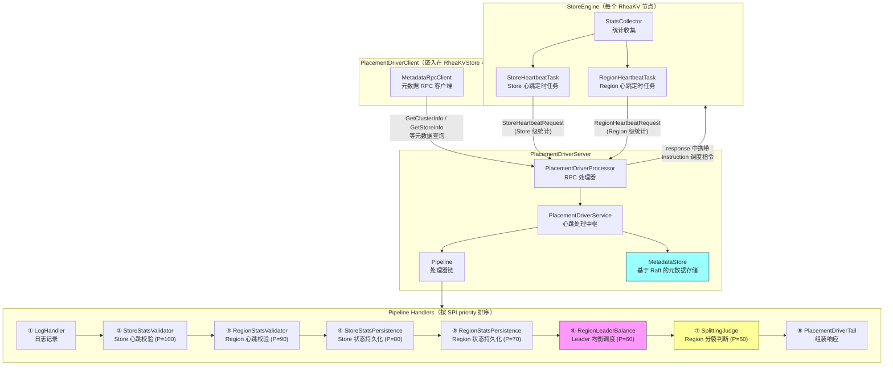
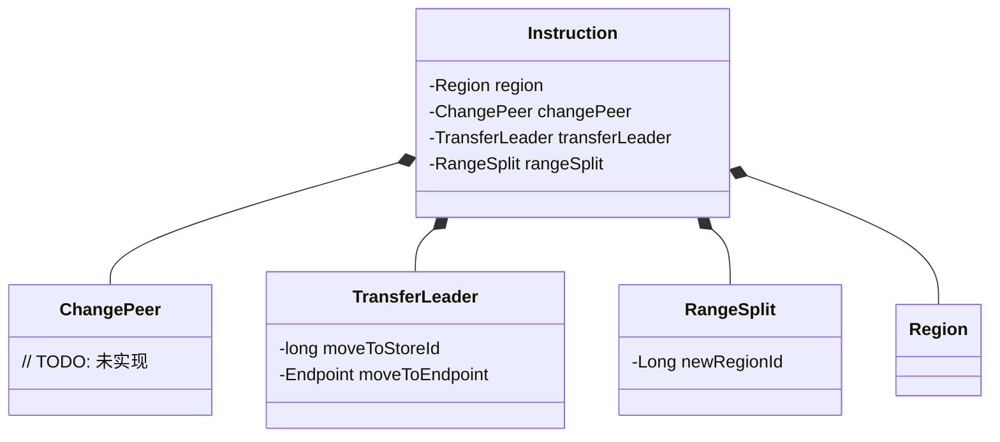
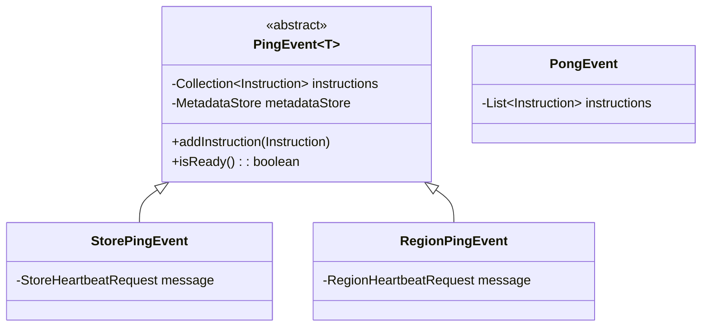
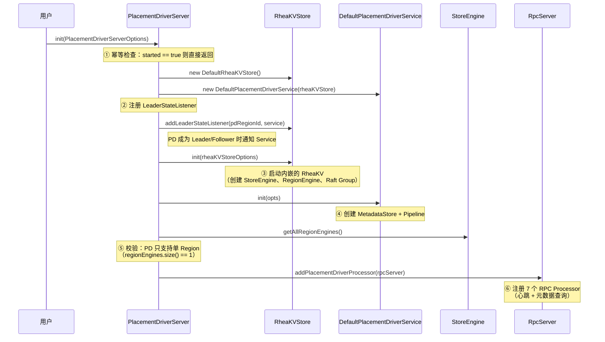
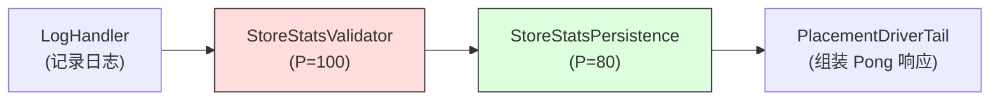
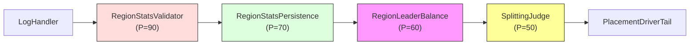
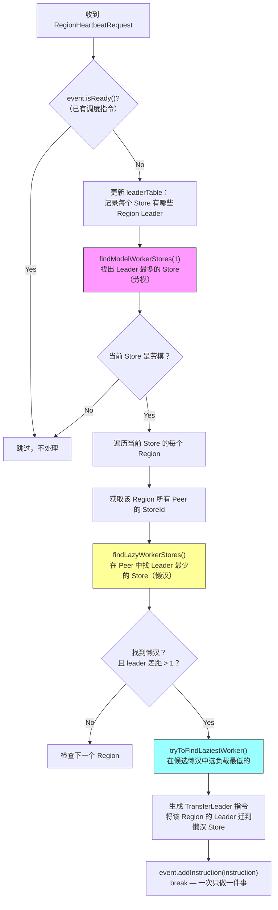
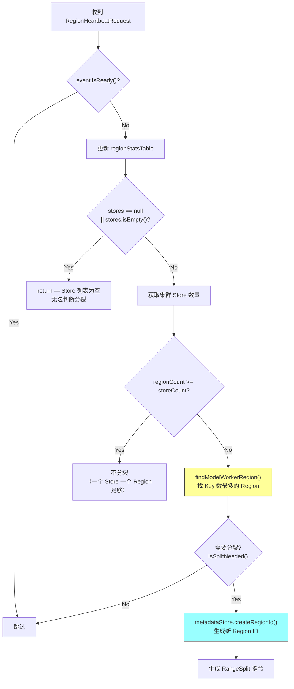

# S7：RheaKV Placement Driver — 调度中心源码分析

> **核心问题**：分布式 KV 存储的多个 Region 由谁来管理？Region 负载不均怎么调度？Region 数据量过大怎么自动分裂？PD 自身如何保证高可用？
>
> **涉及源码文件**：`PlacementDriverServer.java`（272 行）、`DefaultPlacementDriverService.java`（360 行）、`DefaultMetadataStore.java`（303 行）、`ClusterStatsManager.java`（169 行）、`PlacementDriverProcessor.java`（108 行）、`MetadataKeyHelper.java`（95 行）+ 8 个 Pipeline Handler（~500 行）
>
> **分析对象**：~1,800 行源码，构成 RheaKV 的**调度大脑**

---

## 目录

1. [问题推导：为什么需要 Placement Driver？](#1-问题推导为什么需要-placement-driver)
2. [整体架构](#2-整体架构)
3. [核心数据结构](#3-核心数据结构)
4. [PlacementDriverServer 启动流程](#4-placementdriverserver-启动流程)
5. [PlacementDriverService — 心跳处理中枢](#5-placementdriverservice--心跳处理中枢)
6. [Pipeline 处理器链 — 调度决策引擎](#6-pipeline-处理器链--调度决策引擎)
7. [RegionLeaderBalanceHandler — Leader 均衡算法](#7-regionleaderbalancehandler--leader-均衡算法)
8. [SplittingJudgeByApproximateKeysHandler — Region 自动分裂](#8-splittingjudgebyapproximatekeyshandler--region-自动分裂)
9. [DefaultMetadataStore — 基于 Raft 的元数据存储](#9-defaultmetadatastore--基于-raft-的元数据存储)
10. [ClusterStatsManager — 集群状态统计](#10-clusterstatsmanager--集群状态统计)
11. [与 TiKV PD 的横向对比](#11-与-tikv-pd-的横向对比)
12. [面试高频考点 📌](#12-面试高频考点-)
13. [生产踩坑 ⚠️](#13-生产踩坑-️)

---

## 1. 问题推导：为什么需要 Placement Driver？

### 【问题】

RheaKV 是一个多 Region 的分布式 KV 存储。当数据量增长时：
- **谁来管理 Region 的元数据？**（哪些 Region 在哪些 Store 上？）
- **Region 的 Leader 分布不均怎么办？**（某个 Store 上 Leader 太多，负载过高）
- **Region 的数据量过大怎么办？**（需要自动分裂成多个小 Region）
- **新 Store 加入集群后如何被发现？**

### 【需要什么信息】

1. **集群拓扑**：哪些 Store 在线？每个 Store 有哪些 Region？
2. **负载统计**：每个 Store 的 Leader 数量、读写量、磁盘容量
3. **Region 状态**：每个 Region 的 Key 数量、Leader 所在位置、Epoch 版本
4. **调度指令**：Transfer Leader、Range Split 等操作

### 【推导出的结构】

需要一个**中心化的调度服务**：
- **被动收集**：不主动探测，而是等待各 Store 定期上报心跳（Pull 模型）
- **存储元数据**：用一个可靠的存储记录集群拓扑和统计信息
- **决策引擎**：根据收集到的统计信息，决定是否需要 Transfer Leader 或 Split Region
- **下发指令**：在心跳响应中携带调度指令（PingPong 模型）
- **自身高可用**：PD 自己也是一个 Raft Group，保证单点故障不影响调度

> 📌 **面试常考**：PD 是"被动收集 + 响应式下发"的设计，而不是"主动推送"。这和 TiKV 的 PD 设计理念一致。

---

## 2. 整体架构

### 2.1 源码中的架构图

`PlacementDriverServer.java` 中的 ASCII Art 已经精确描述了整体架构。我们用 Mermaid 重绘：



### 2.2 核心设计原则

| 原则 | 实现方式 |
|------|---------|
| **被动收集** | PD 不主动探测，所有信息由 Store 心跳上报 |
| **PingPong 模型** | 心跳请求（Ping）→ 心跳响应（Pong）中携带调度指令 |
| **Pipeline 架构** | 心跳处理通过 Handler 链完成，可通过 SPI 扩展 |
| **自身高可用** | PD 内嵌一个 RheaKVStore（单 Region Raft Group），元数据存储在自身的 Raft 日志中 |
| **Leader Only** | 所有请求只由 PD Leader 处理，非 Leader 返回 `NOT_LEADER` 错误 |

---

## 3. 核心数据结构

### 3.1 数据结构推导

**【问题】** PD 需要存储和管理哪些数据？

**【需要什么信息】**
- 集群中有哪些 Store？→ 需要 `clusterId → Set<storeId>` 的索引
- 每个 Store 的详细信息？→ 需要 `storeId → Store` 的映射
- 每个 Store 的运行状态？→ 需要 `storeId → StoreStats` 的映射
- 每个 Region 的运行状态？→ 需要 `regionId → (Region, RegionStats)` 的映射
- StoreId / RegionId 如何全局唯一？→ 需要序列号生成器

**【推导出的结构】**

```
PD 元数据 Key 设计（存储在 RheaKV 自身中）：
├── pd_cluster-{clusterId}                     → "storeId1,storeId2,..."（集群索引）
├── pd_store_id_map-{clusterId}-{endpoint}     → storeId（Endpoint → StoreId 映射）
├── pd_store_id_seq-{clusterId}                → 自增序列（Store ID 生成器）
├── pd_store_info-{clusterId}-{storeId}        → Store 对象序列化（Store 详细信息）
├── pd_store_stats-{clusterId}-{storeId}       → StoreStats 对象序列化（Store 运行状态）
├── pd_region_stats-{clusterId}-{regionId}     → Pair<Region, RegionStats> 序列化（Region 状态）
└── pd_region_id_seq-{clusterId}               → 自增序列（Region ID 生成器）
```

> 📌 **关键设计**：PD 的元数据存储在 PD 自身的 RheaKV 中！PD 本身就是一个单 Region 的 RheaKV 节点，用自己来存储集群的元数据。这是一种**自举（Bootstrap）**设计。

### 3.2 调度指令（Instruction）



PD 通过心跳响应下发三种调度指令：
1. **TransferLeader** — 将某个 Region 的 Leader 迁移到指定 Store（已实现 ✅）
2. **RangeSplit** — 将某个 Region 按 Key 范围分裂为两个 Region（已实现 ✅）
3. **ChangePeer** — 增减 Region 的副本成员（TODO，未实现 ❌）

### 3.3 Pipeline 事件模型



**`isReady()` 的语义**：一旦某个 Handler 往 PingEvent 中添加了 Instruction，后续 Handler 的 `readMessage()` 会检查 `event.isReady()`，如果已有指令则**跳过处理**。这意味着 **Pipeline 中同时只会产生一条调度指令**（"Only do one thing at a time" 原则）。

---

## 4. PlacementDriverServer 启动流程

### 4.1 核心字段

```java
public class PlacementDriverServer implements Lifecycle<PlacementDriverServerOptions> {
    private final ThreadPoolExecutor pdExecutor;       // PD RPC 处理线程池
    private PlacementDriverService   placementDriverService;  // 心跳处理服务
    private RheaKVStore              rheaKVStore;       // 内嵌的 RheaKV 存储（自举）
    private RegionEngine             regionEngine;      // PD 的单 Region 引擎
    private boolean                  started;
}
```

### 4.2 init() 启动时序



### 4.3 注册的 7 个 RPC Processor

| # | 请求类型 | 处理方法 | 说明 |
|---|---------|---------|------|
| 1 | `RegionHeartbeatRequest` | `handleRegionHeartbeatRequest` | Region Leader 上报心跳（含 RegionStats）|
| 2 | `StoreHeartbeatRequest` | `handleStoreHeartbeatRequest` | Store 上报心跳（含 StoreStats）|
| 3 | `GetClusterInfoRequest` | `handleGetClusterInfoRequest` | 查询集群拓扑 |
| 4 | `GetStoreIdRequest` | `handleGetStoreIdRequest` | 根据 Endpoint 获取/创建 StoreId |
| 5 | `GetStoreInfoRequest` | `handleGetStoreInfoRequest` | 查询 Store 详细信息 |
| 6 | `SetStoreInfoRequest` | `handleSetStoreInfoRequest` | 更新 Store 信息 |
| 7 | `CreateRegionIdRequest` | `handleCreateRegionIdRequest` | 创建全局唯一 RegionId |

所有 Processor 共享同一个 `pdExecutor` 线程池：
- 核心线程数 = `max(cpus * 4, 32)`
- 最大线程数 = 核心线程数 * 4
- 工作队列 = `ArrayBlockingQueue(4096)`
- 拒绝策略 = `CallerRunsPolicyWithReport`

### 4.4 PD 的自举（Bootstrap）设计

PD 的**核心巧妙之处**在于：**PD 自身就是一个 RheaKV 节点**。

```
PlacementDriverServer
  └── RheaKVStore（DefaultRheaKVStore）
        └── StoreEngine
              └── RegionEngine（单个 Region，覆盖全 Key 范围）
                    └── Raft Group（保证 PD 元数据的高可用）
```

这意味着：
1. PD 的元数据（Store 信息、Region 状态等）存储在自己的 RocksDB 中
2. PD 通过 Raft 共识保证元数据的一致性和高可用
3. PD Leader 切换时，新 Leader 自动拥有完整的元数据
4. **约束**：PD 只支持单 Region（`regionEngines.size() > 1` 会抛异常）

> ⚠️ **与 TiKV PD 的区别**：TiKV 的 PD 使用 etcd 存储元数据；RheaKV 的 PD 用自身的 RheaKV 存储元数据（自举）。

---

## 5. PlacementDriverService — 心跳处理中枢

### 5.1 核心字段

```java
public class DefaultPlacementDriverService implements PlacementDriverService, LeaderStateListener {
    private final RheaKVStore rheaKVStore;     // 内嵌存储引用
    private MetadataStore     metadataStore;    // 元数据存储
    private HandlerInvoker    pipelineInvoker;  // Pipeline 线程调度器
    private Pipeline          pipeline;         // 心跳处理管道
    private volatile boolean  isLeader;         // 当前节点是否为 PD Leader
}
```

**关键设计**：`isLeader` 是 `volatile` 的，通过 `LeaderStateListener` 回调更新。**只有 PD Leader 才处理心跳请求**，非 Leader 直接返回 `NOT_LEADER` 错误。

### 5.2 Leader 状态回调

```java
// PD 成为 Leader 时
public void onLeaderStart(final long leaderTerm) {
    this.isLeader = true;
    invalidLocalCache();   // 清空本地缓存，强制从 RheaKV 重新读取
}

// PD 失去 Leader 时
public void onLeaderStop(final long leaderTerm) {
    this.isLeader = false;
    invalidLocalCache();
}
```

> ⚠️ **为什么要 invalidLocalCache？** Leader 切换时，新 Leader 的本地缓存可能是旧的。`ClusterStatsManager.invalidCache()` + `metadataStore.invalidCache()` 确保从 Raft 日志中获取最新状态。

### 5.3 Store 心跳处理流程

```java
public void handleStoreHeartbeatRequest(StoreHeartbeatRequest request, ...) {
    // ① 非 Leader 快速拒绝
    if (!this.isLeader) {
        response.setError(Errors.NOT_LEADER);
        closure.sendResponse(response);
        return;
    }
    try {
        // ② 封装为 StorePingEvent，投入 Pipeline
        final StorePingEvent storePingEvent = new StorePingEvent(request, this.metadataStore);
        final PipelineFuture<Object> future = this.pipeline.invoke(storePingEvent);
        // ③ Pipeline 完成后发送响应
        future.whenComplete((ignored, throwable) -> {
            if (throwable != null) {
                LOG.error("Failed to handle: {}.", request);
                response.setError(Errors.forException(throwable));
            }
            closure.sendResponse(response);
        });
    } catch (final Throwable t) {
        // ④ pipeline.invoke() 本身抛出异常（非 Future 异步异常）
        LOG.error("Failed to handle: {}.", request);
        response.setError(Errors.forException(t));
        closure.sendResponse(response);
    }
}
```

Store 心跳的 Pipeline 路径：`LogHandler → StoreStatsValidator → StoreStatsPersistence → Tail`

> 📌 **注意**：Store 心跳**不走** `RegionStatsValidator`、`RegionLeaderBalance`、`SplittingJudge` 这三个 Handler，因为这三个只处理 `RegionPingEvent`。Pipeline 中的每个 Handler 通过泛型 `InboundHandlerAdapter<T>` 自动做类型过滤。

### 5.4 Region 心跳处理流程

```java
public void handleRegionHeartbeatRequest(RegionHeartbeatRequest request, ...) {
    // ① 非 Leader 快速拒绝
    if (!this.isLeader) {
        response.setError(Errors.NOT_LEADER);
        closure.sendResponse(response);
        return;
    }
    try {
        // ② 封装为 RegionPingEvent，投入 Pipeline
        final RegionPingEvent regionPingEvent = new RegionPingEvent(request, this.metadataStore);
        final PipelineFuture<List<Instruction>> future = this.pipeline.invoke(regionPingEvent);
        // ③ Pipeline 完成后，response 中携带调度指令
        future.whenComplete((instructions, throwable) -> {
            if (throwable == null) {
                response.setValue(instructions);  // 调度指令在响应中返回！
            } else {
                LOG.error("Failed to handle: {}.", request);
                response.setError(Errors.forException(throwable));
            }
            closure.sendResponse(response);
        });
    } catch (final Throwable t) {
        // ④ pipeline.invoke() 本身抛出异常（非 Future 异步异常）
        LOG.error("Failed to handle: {}.", request);
        response.setError(Errors.forException(t));
        closure.sendResponse(response);
    }
}
```

Region 心跳的 Pipeline 路径：`LogHandler → RegionStatsValidator → RegionStatsPersistence → RegionLeaderBalance → SplittingJudge → Tail`

**与 Store 心跳的关键区别**：Region 心跳的响应中**可能携带调度指令**（`List<Instruction>`），Store 心跳不携带。

### 5.5 Pipeline 初始化

```java
protected void initPipeline(final Pipeline pipeline) {
    // ① 通过 SPI 加载并排序所有 Handler
    final List<Handler> sortedHandlers = JRaftServiceLoader.load(Handler.class).sort();
    
    // 排序后的默认顺序（按 @SPI priority 降序）：
    // 1. storeStatsValidator    (P=100)
    // 2. regionStatsValidator   (P=90)
    // 3. storeStatsPersistence  (P=80)
    // 4. regionStatsPersistence (P=70)
    // 5. regionLeaderBalance    (P=60)
    // 6. splittingJudgeByApproximateKeys (P=50)
    
    for (final Handler h : sortedHandlers) {
        pipeline.addLast(h);
    }
    
    // ② 手动添加首尾 Handler
    pipeline.addFirst(this.pipelineInvoker, "logHandler", new LogHandler());  // 首
    pipeline.addLast("placementDriverTail", new PlacementDriverTailHandler()); // 尾
}
```

完整的 Pipeline 处理链：

```
LogHandler → StoreStatsValidator(100) → RegionStatsValidator(90) →
StoreStatsPersistence(80) → RegionStatsPersistence(70) →
RegionLeaderBalance(60) → SplittingJudge(50) → PlacementDriverTailHandler
```

> 📌 **SPI 可扩展**：用户可以通过在 `META-INF/services/com.alipay.sofa.jraft.rhea.util.pipeline.Handler` 中注册自定义 Handler，插入到 Pipeline 中。priority 越大越靠前执行。

---

## 6. Pipeline 处理器链 — 调度决策引擎

### 6.1 Store 心跳 Pipeline

Store 心跳只经过两类 Handler（通过泛型 `InboundHandlerAdapter<StorePingEvent>` 匹配）：



#### StoreStatsValidator（priority=100）

校验 Store 心跳数据的有效性：

| 校验项 | 条件 | 异常 |
|--------|------|------|
| StoreStats 为空 | `storeStats == null` | `INVALID_STORE_STATS` |
| TimeInterval 为空 | `interval == null` | `INVALID_STORE_STATS` |
| 心跳过期 | `interval.endTimestamp < currentInterval.endTimestamp` | `STORE_HEARTBEAT_OUT_OF_DATE` |
| 新数据（无历史） | `currentStoreStats == null` | **直接通过**（不抛异常）|

#### StoreStatsPersistenceHandler（priority=80）

将 StoreStats **同步持久化**到 RheaKV：

```java
metadataStore.updateStoreStats(request.getClusterId(), request.getStats()).get(); // sync
```

> ⚠️ **注意 `.get()` 阻塞调用**：这里是同步等待 Raft 写入完成。如果 Raft 写入慢，会阻塞 Pipeline 线程。

### 6.2 Region 心跳 Pipeline

Region 心跳经过 6 个 Handler（通过泛型 `InboundHandlerAdapter<RegionPingEvent>` 匹配）：



#### RegionStatsValidator（priority=90）

校验 Region 心跳数据的有效性（对每个 Region 逐一校验）：

| 校验项 | 条件 | 异常 |
|--------|------|------|
| regionStatsList 为空 | `regionStatsList == null || isEmpty` | `INVALID_REGION_STATS` |
| Region 为空 | `region == null` | `INVALID_REGION_STATS` |
| RegionEpoch 为空 | `regionEpoch == null` | `INVALID_REGION_STATS` |
| RegionStats 为空 | `regionStats == null` | `INVALID_REGION_STATS` |
| Epoch 过期 | `regionEpoch < currentRegion.regionEpoch` | `REGION_HEARTBEAT_OUT_OF_DATE` |
| TimeInterval 为空 | `interval == null` | `INVALID_REGION_STATS` |
| 时间戳过期 | `endTimestamp < currentInterval.endTimestamp` | `REGION_HEARTBEAT_OUT_OF_DATE` |
| 新数据（无历史） | `currentRegionInfo == null` | **直接通过** |

> 📌 **RegionEpoch 的重要性**：RegionEpoch 包含 `confVer`（配置版本）和 `version`（数据版本）。当 Region 发生 Split 或 ChangePeer 后，Epoch 会递增。PD 通过 Epoch 判断心跳数据是否过期，防止处理来自旧 Leader 的过期心跳。

#### RegionStatsPersistenceHandler（priority=70）

将所有 Region 的统计数据**批量同步持久化**到 RheaKV：

```java
metadataStore.batchUpdateRegionStats(request.getClusterId(), request.getRegionStatsList()).get(); // sync
```

#### PlacementDriverTailHandler — 尾处理器

将 PingEvent 中积累的 `instructions` 封装为 `PongEvent` 输出：

```java
public void handleInbound(HandlerContext ctx, InboundMessageEvent<?> event) throws Exception {
    if (isAcceptable(event)) {
        PingEvent<?> ping = (PingEvent<?>) event;
        // 将 Inbound 转为 Outbound，携带调度指令
        ctx.pipeline().fireOutbound(new PongEvent(ping.getInvokeId(), 
            Lists.newArrayList(ping.getInstructions())));
    }
}
```

---

## 7. RegionLeaderBalanceHandler — Leader 均衡算法

这是 PD 最核心的调度逻辑之一，负责**平衡各 Store 上的 Region Leader 数量**。

### 7.1 算法流程



### 7.2 劳模（Model Worker）选择

```java
// ClusterStatsManager.findModelWorkerStores(above=1)
// 找出 Leader 数量最多的 Store 集合
final Map.Entry<Long, Set<Long>> modelWorker = Collections.max(values, 
    (o1, o2) -> Integer.compare(o1.getValue().size(), o2.getValue().size()));
final int maxLeaderCount = modelWorker.getValue().size();
if (maxLeaderCount <= above) {
    return Pair.of(Collections.emptySet(), maxLeaderCount);  // 没有超载的 Store
}
```

- `above = 1`：只有 Leader 数量 > 1 的 Store 才算"劳模"
- 返回所有 Leader 数量等于最大值的 Store 集合

### 7.3 懒汉（Lazy Worker）选择

```java
// ClusterStatsManager.findLazyWorkerStores(storeCandidates)
// 在候选 Store 中，找出 Leader 数量最少的
final Map.Entry<Long, Set<Long>> lazyWorker = Collections.min(values, ...);
final int minLeaderCount = lazyWorker.getValue().size();
// 返回所有 Leader 数量 ≤ minLeaderCount 的候选 Store
```

**关键约束**：`modelWorkerLeaders - worker.getValue() <= 1` 时不迁移。即**只有 Leader 差距 > 1 时才触发均衡**，避免频繁来回迁移（乒乓效应）。

### 7.4 最懒懒汉（Laziest Worker）— 多维度打分

当有多个候选懒汉时，通过**多维度比较**选出负载最低的：

```java
// tryToFindLaziestWorker() — 比较优先级（从高到低）
Collections.min(storeStatsList, (o1, o2) -> {
    // 1. isBusy — 忙的排后面
    int val = Boolean.compare(s1.isBusy(), s2.isBusy());
    // 2. regionCount — Region 少的优先
    val = Integer.compare(s1.getRegionCount(), s2.getRegionCount());
    // 3. bytesWritten — 写入量少的优先
    val = Long.compare(s1.getBytesWritten(), s2.getBytesWritten());
    // 4. bytesRead — 读取量少的优先
    val = Long.compare(s1.getBytesRead(), s2.getBytesRead());
    // 5. keysWritten — 写 Key 数少的优先
    val = Long.compare(s1.getKeysWritten(), s2.getKeysWritten());
    // 6. keysRead — 读 Key 数少的优先
    val = Long.compare(s1.getKeysRead(), s2.getKeysRead());
    // 7. available — 可用空间大的优先（注意取反）
    val = Long.compare(-s1.getAvailable(), -s2.getAvailable());
});
```

> ⚠️ **生产踩坑**：代码中有 `// TODO check timeInterval` 的注释，说明**没有校验 StoreStats 的时效性**。如果某个 Store 长时间没有上报心跳，其 StoreStats 可能是过期的，但仍然会被用于打分，可能导致错误的调度决策。

### 7.5 "一次只做一件事" 原则

```java
event.addInstruction(instruction);
break; // Only do one thing at a time
```

一次心跳处理**最多只生成一条调度指令**。这是分布式调度的黄金原则——避免状态冲突。

---

## 8. SplittingJudgeByApproximateKeysHandler — Region 自动分裂

### 8.1 算法流程



### 8.2 分裂条件（isSplitNeeded）

**分支穷举清单**：

| # | 条件 | 结果 |
|---|------|------|
| □ | `modelWorker == null` | `return false`（没有找到劳模 Region，无需分裂）|
| □ | `request.getLeastKeysOnSplit() > modelApproximateKeys` | `return false`（Key 数未超过阈值）|
| □ | 遍历 regionStatsList，`modelRegion.equals(p.getKey())` 匹配 | `return true`（劳模 Region 属于当前上报者，触发分裂）|
| □ | 遍历结束无匹配 | `return false`（劳模 Region 不属于当前上报者）|

三个条件**同时满足**才触发分裂：

1. **劳模 Region 存在**：`modelWorker != null`
   - `findModelWorkerRegion()` 可能在 `regionStatsTable` 为空时返回 null

2. **Key 数超过阈值**：`request.getLeastKeysOnSplit() <= modelApproximateKeys`
   - `leastKeysOnSplit` 由上报心跳的 Store 在 `RegionHeartbeatRequest` 中携带
   - `modelApproximateKeys` 是 Key 数最多的 Region 的 approximateKeys

3. **劳模 Region 属于当前心跳上报者**：`modelRegion.equals(p.getKey())`
   - 只有上报心跳的 Store 自己管理的 Region 才会被指令分裂

### 8.3 "一个 Store 一个 Region" 的兜底策略

```java
if (clusterStatsManager.regionSize() >= stores.size()) {
    return; // one store one region is perfect
}
```

> 📌 **设计意图**：RheaKV 的分裂策略非常保守——如果 Region 数量已经 ≥ Store 数量，就不再分裂。这是因为 RheaKV 的 Region 分裂后会分布到不同 Store，分裂过多反而增加跨节点通信开销。

---

## 9. DefaultMetadataStore — 基于 Raft 的元数据存储

### 9.1 核心字段

```java
public class DefaultMetadataStore implements MetadataStore {
    private final ConcurrentMap<String, LongSequence> storeSequenceMap;     // Store ID 序列生成器缓存
    private final ConcurrentMap<String, LongSequence> regionSequenceMap;    // Region ID 序列生成器缓存
    private final ConcurrentMap<Long, Set<Long>>      clusterStoreIdsCache; // 集群 → Store IDs 缓存
    private final Serializer                          serializer;           // 序列化器
    private final RheaKVStore                         rheaKVStore;          // 底层存储
}
```

### 9.2 Key 设计（MetadataKeyHelper）

| Key 格式 | Value 类型 | 用途 |
|----------|-----------|------|
| `pd_cluster-{clusterId}` | `"storeId1,storeId2,..."` | 集群中所有 Store ID 索引 |
| `pd_store_id_map-{clusterId}-{endpoint}` | `long (8 bytes)` | Endpoint → StoreId 映射 |
| `pd_store_id_seq-{clusterId}` | `Sequence` | Store ID 自增序列 |
| `pd_store_info-{clusterId}-{storeId}` | `Store 序列化` | Store 详细信息 |
| `pd_store_stats-{clusterId}-{storeId}` | `StoreStats 序列化` | Store 运行状态 |
| `pd_region_stats-{clusterId}-{regionId}` | `Pair<Region, RegionStats> 序列化` | Region 运行状态 |
| `pd_region_id_seq-{clusterId}` | `Sequence` | Region ID 自增序列 |

### 9.3 Store ID 的全局唯一生成

```java
public Long getOrCreateStoreId(final long clusterId, final Endpoint endpoint) {
    // ① 先查缓存
    final byte[] bytesVal = this.rheaKVStore.bGet(storeIdKey);
    if (bytesVal != null) {
        return Bits.getLong(bytesVal, 0);  // 已存在，直接返回
    }
    
    // ② 不存在，通过 Sequence 生成新 ID
    final long newStoreId = storeSequence.next();  // 基于 RheaKV 的分布式序列
    
    // ③ CAS 写入（putIfAbsent），防止并发创建重复 ID
    final byte[] oldBytesVal = this.rheaKVStore.bPutIfAbsent(storeIdKey, newBytesVal);
    if (oldBytesVal != null) {
        return Bits.getLong(oldBytesVal, 0);  // 被其他节点抢先创建了
    }
    return newStoreId;
}
```

> 📌 **LongSequence 批量预取**：`bGetSequence(storeSeqKey, 32)` 一次预取 32 个 ID，减少 Raft 写入次数。

### 9.4 集群索引的合并更新

当新 Store 注册时，通过 `merge` 操作将 storeId 追加到集群索引中：

```java
private CompletableFuture<Boolean> mergeClusterIndex(final long clusterId, final long storeId) {
    final String key = MetadataKeyHelper.getClusterInfoKey(clusterId);
    // merge 操作：将 storeId 追加到 "storeId1,storeId2,..." 字符串中
    final CompletableFuture<Boolean> future = this.rheaKVStore.merge(key, String.valueOf(storeId));
    future.whenComplete((ignored, throwable) -> {
        clusterStoreIdsCache.clear();  // 清空缓存
    });
    return future;
}
```

---

## 10. ClusterStatsManager — 集群状态统计

### 10.1 核心字段

```java
public final class ClusterStatsManager {
    // 全局单例表：clusterId → ClusterStatsManager
    private static final ConcurrentMap<Long, ClusterStatsManager> clusterStatsManagerTable;
    
    private final long clusterId;
    // Map<StoreId, Set<RegionId>> — 每个 Store 管理哪些 Region 的 Leader
    private final ConcurrentMap<Long, Set<Long>> leaderTable;
    // Map<RegionId, Pair<Region, RegionStats>> — 每个 Region 的最新状态
    private final ConcurrentMap<Long, Pair<Region, RegionStats>> regionStatsTable;
}
```

### 10.2 Leader 归属更新

```java
public void addOrUpdateLeader(final long storeId, final long regionId) {
    // ① 将 regionId 添加到 storeId 的 Leader 集合中
    regionTable.add(regionId);
    // ② 从其他所有 Store 的 Leader 集合中移除该 regionId
    for (entry : this.leaderTable.entrySet()) {
        if (storeId != entry.getKey()) {
            entry.getValue().remove(regionId);  // 一个 Region 只有一个 Leader
        }
    }
}
```

> 📌 **这是一个纯内存数据结构**，不持久化。Leader 切换后（`invalidCache`）会被清空，需要等待心跳重新上报后才能重建。

### 10.3 劳模 Region 查找

```java
public Pair<Region, RegionStats> findModelWorkerRegion() {
    return Collections.max(this.regionStatsTable.values(), (o1, o2) -> {
        return Long.compare(o1.getValue().getApproximateKeys(), o2.getValue().getApproximateKeys());
    });
}
```

返回 **Key 数量最多的 Region**，作为分裂的候选对象。

---

## 11. 与 TiKV PD 的横向对比

| 维度 | RheaKV PD | TiKV PD |
|------|-----------|---------|
| **元数据存储** | 自身 RheaKV（自举） | etcd（独立存储） |
| **高可用** | 单 Region Raft Group | etcd 集群 |
| **心跳类型** | Store 心跳 + Region 心跳 | Store 心跳 + Region 心跳 |
| **调度策略** | Leader 均衡 + Key 数分裂 | Leader/Region 均衡 + 热点调度 + 合并 |
| **调度指令** | TransferLeader + RangeSplit（ChangePeer TODO） | TransferLeader + AddPeer/RemovePeer + Merge + Split |
| **Pipeline 架构** | SPI 可扩展的 Handler 链 | 内置 Scheduler 调度器 |
| **调度粒度** | 一次心跳最多一条指令 | 一次心跳可多条指令 |
| **分裂判断** | Key 数量 + "Region 数 ≥ Store 数" 兜底 | Key 数量 / 大小 / 热点 |
| **代码量** | ~1,800 行 | ~100,000+ 行 |
| **成熟度** | 轻量级，适合中小规模 | 生产级，支持超大规模 |

> 📌 **核心差异**：RheaKV PD 的调度策略远比 TiKV PD 简单。TiKV PD 有热点调度、Region 合并、标签感知等高级功能，RheaKV PD 只实现了最基础的 Leader 均衡和 Key 数分裂。

---

## 12. 面试高频考点 📌

### 考点 1：PD 如何保证自身高可用？

PD 自身就是一个 RheaKV 节点（单 Region Raft Group）。元数据存储在自身的 Raft 日志中，通过 Raft 共识保证一致性。PD Leader 切换时，新 Leader 自动拥有完整元数据。

### 考点 2：PD 是主动推送还是被动收集？

**被动收集**。PD 不主动探测任何 Store，所有信息由 Store 通过心跳上报。调度指令也不是主动推送，而是在心跳响应中携带（PingPong 模型）。

### 考点 3：Region 分裂的判断条件是什么？

两个条件同时满足：① Region 的 approximateKeys 超过 `leastKeysOnSplit` 阈值；② 当前 Region 数量 < Store 数量。分裂只有在 Region 数量不足以覆盖所有 Store 时才触发。

### 考点 4：Leader 均衡的策略是什么？

找出 Leader 数量最多的 Store（劳模），在其管理的 Region 中找一个可以迁移的，将其 Leader 迁移到 Leader 数量最少的 Store（懒汉）。**约束**：Leader 差距 ≤ 1 时不迁移，避免乒乓效应。多个候选懒汉时，通过 busy/regionCount/bytesWritten/bytesRead/available 等多维度打分选出最优目标。

### 考点 5：为什么一次心跳最多只产生一条调度指令？

这是分布式调度的**"Only do one thing at a time"** 原则。同时执行多个调度操作（如同时 TransferLeader 和 Split）可能导致状态冲突，因为调度操作的执行需要时间，中间状态可能不一致。逐步调整比一步到位更安全。

### 考点 6：PD 的元数据 Key 是怎么设计的？

使用 `pd_` 前缀 + 类型 + 分隔符 + clusterId + 分隔符 + 业务 ID 的层级结构。例如 `pd_store_info-1-100` 表示集群 1 中 Store 100 的信息。这种设计使得同类数据可以通过前缀扫描批量获取。

---

## 13. 生产踩坑 ⚠️

### 踩坑 1：PD 只支持单 Region

```java
if (regionEngines.size() > 1) {
    throw new IllegalArgumentException("Only support single region for [PlacementDriverServer]");
}
```

**现象**：PD 配置了多个 Region 后启动失败。
**原因**：PD 的自举设计要求只使用一个 Region 存储元数据。
**解决**：PD 的 RheaKVStoreOptions 不要配置多 Region。

### 踩坑 2：StoreStats 时效性未校验

`RegionLeaderBalanceHandler.tryToFindLaziestWorker()` 中有 `// TODO check timeInterval` 注释。

**现象**：某个 Store 宕机后很长时间才被感知，期间 PD 仍然可能将 Leader 迁到该 Store。
**原因**：代码中没有检查 StoreStats 的上报时间，过期的 Stats 仍然参与打分。
**规避**：确保 Store 的心跳间隔足够短，及时感知 Store 下线。

### 踩坑 3：Pipeline Handler 的 `.get()` 同步阻塞

`StoreStatsPersistenceHandler` 和 `RegionStatsPersistenceHandler` 中都使用了 `.get()` 同步等待 Raft 写入：

```java
metadataStore.updateStoreStats(...).get(); // sync
```

**现象**：高频心跳场景下，Pipeline 线程被 Raft 写入延迟阻塞，导致心跳处理积压。
**原因**：同步等待 Raft 共识完成，如果 PD 集群网络延迟大，每次写入可能需要几十毫秒。
**规避**：适当增大 Pipeline 线程池（`pipelineCorePoolSize`），或考虑改为异步写入。

### 踩坑 4：Leader 切换时 ClusterStatsManager 缓存清空

```java
public void onLeaderStart(final long leaderTerm) {
    this.isLeader = true;
    invalidLocalCache();  // 清空 ClusterStatsManager + MetadataStore 缓存
}
```

**现象**：PD Leader 切换后，短时间内不会产生任何调度指令。
**原因**：`ClusterStatsManager.leaderTable` 和 `regionStatsTable` 被清空，需要等待所有 Store 的心跳重新上报后才能重建。
**影响**：心跳周期内（通常 10-30 秒），PD 处于"调度空窗期"。这是正确的保守行为——宁可不调度，也不要基于过期数据做错误决策。

### 踩坑 5：分裂策略过于保守

```java
if (clusterStatsManager.regionSize() >= stores.size()) {
    return; // one store one region is perfect
}
```

**现象**：3 个 Store 的集群中，已有 3 个 Region，即使某个 Region 的 Key 数量极大也不再分裂。
**原因**：RheaKV 的分裂策略以 "Region 数 ≥ Store 数" 作为兜底，不再继续分裂。
**规避**：如果需要更细粒度的分裂，可以自定义一个 Handler 替换 `SplittingJudgeByApproximateKeysHandler`。

---

> **总结**：RheaKV PD 是一个**轻量级的调度中心**，核心代码不到 2000 行，但五脏俱全：
> - **自举设计**：用自身的 RheaKV 存储元数据，通过 Raft 保证高可用
> - **PingPong 模型**：被动收集心跳，在响应中携带调度指令
> - **Pipeline 架构**：通过 SPI 可扩展的 Handler 链实现调度决策
> - **两大调度策略**：Leader 均衡（`RegionLeaderBalanceHandler`）+ Key 数分裂（`SplittingJudgeByApproximateKeysHandler`）
> - **保守原则**：一次只做一件事，避免状态冲突
