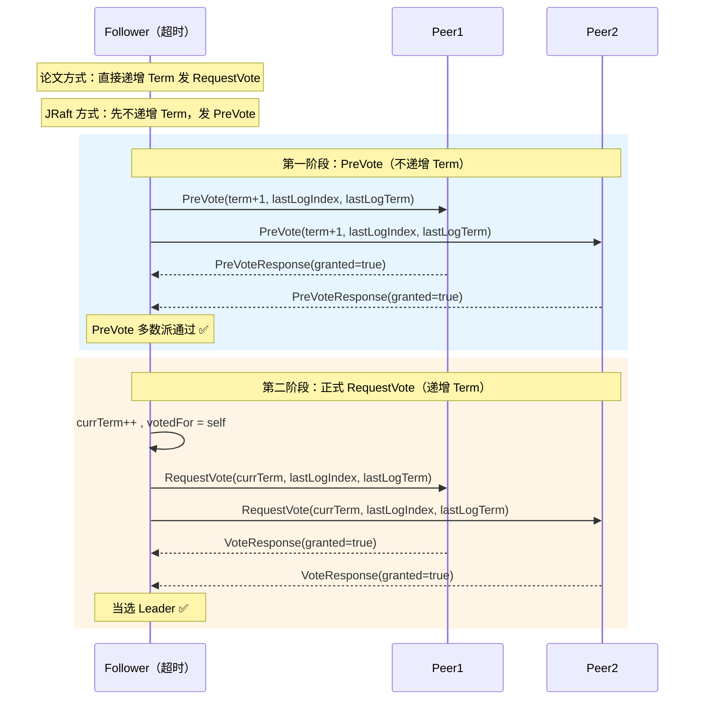
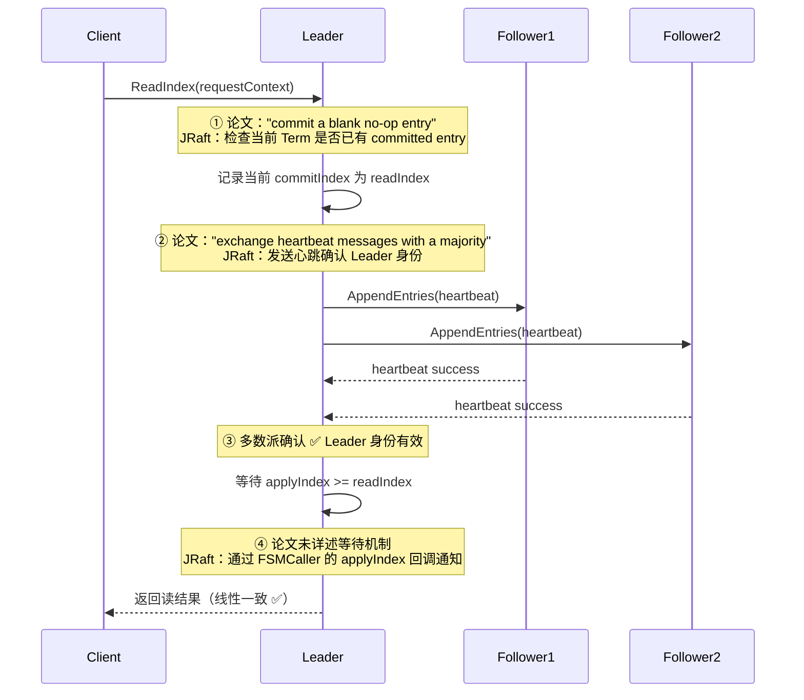

# Raft 论文 × JRaft 实现 — 对照解读

## ☕ 想先用人话了解"论文 vs 实现"？请看通俗解读

> **👉 [点击阅读：用人话聊聊 Raft 论文 vs JRaft 实现（通俗解读完整版）](./通俗解读.md)**
>
> 通俗解读版用"菜谱 vs 真正的菜"的比喻，逐章对比 Raft 论文和 JRaft 实现的差异——选举、日志复制、成员变更、线性一致读、快照，以及论文完全没提但 JRaft 必须处理的并发控制、性能优化和可观测性。**建议先读通俗解读版。**

这篇文档适合你在读完所有源码之后，**回过头来做一次系统性的对照**——"我学的这些东西，哪些是 Raft 协议本身的要求，哪些是 JRaft 工程团队的创造？"这个问题搞清楚了，你就真正理解了"算法设计"和"工程实现"之间的距离。

> 📌 面试小贴士：面试官经常会问"Raft 论文和你看的实现有什么区别？"——你只要说出 PreVote、Pipeline、Disruptor 异步化这三个点，就已经比 90% 的候选人强了。

好，让我们打开论文，一节一节对照着看 👇

---

> **本文目标**：逐章解读 Raft 论文 *"In Search of an Understandable Consensus Algorithm (Extended Version)"*，并与 SOFAJRaft 源码进行 **逐条对照**，明确哪些是"严格遵循论文"、哪些是"工程扩展"、哪些是"超越论文"。
>
> **论文来源**：Diego Ongaro & John Ousterhout, Stanford University, 2014
>
> **适合读者**：已阅读过 JRaft 源码学习文档（01~14 + S1~S16），希望建立"算法设计 → 工程实现"完整知识体系的开发者

---

## 目录

1. [导读：论文结构与 JRaft 文档的映射关系](#1-导读论文结构与-jraft-文档的映射关系)
2. [§5.1 Raft Basics — 三角色 + Term + 两种 RPC](#2-51-raft-basics--三角色--term--两种-rpc)
3. [§5.2 Leader Election — 选举机制](#3-52-leader-election--选举机制)
4. [§5.3 Log Replication — 日志复制](#4-53-log-replication--日志复制)
5. [§5.4 Safety — 安全性保证](#5-54-safety--安全性保证)
6. [§6 Cluster Membership Changes — 成员变更](#6-6-cluster-membership-changes--成员变更)
7. [§7 Log Compaction — 日志压缩（快照）](#7-7-log-compaction--日志压缩快照)
8. [§8 Client Interaction — 客户端交互与线性一致读](#8-8-client-interaction--客户端交互与线性一致读)
9. [JRaft 超越论文的工程扩展总结](#9-jraft-超越论文的工程扩展总结)
10. [论文五大安全性属性在 JRaft 中的实现验证](#10-论文五大安全性属性在-jraft-中的实现验证)
11. [面试高频：论文 vs 实现 对比题 📌](#11-面试高频论文-vs-实现-对比题-)

---

## 1. 导读：论文结构与 JRaft 文档的映射关系

### 1.1 论文章节 → JRaft 文档 对照表

| 论文章节 | 核心内容 | 对应 JRaft 文档 | 对照重点 |
|----------|---------|----------------|---------|
| §5.1 Raft Basics | 三角色、Term、两种 RPC | [01-Overview](../01-overview/README.md) | 角色定义、Term 管理 |
| §5.2 Leader Election | 选举触发、投票规则、随机超时 | [03-Leader-Election](../03-leader-election/README.md) + [S4-Transfer-Leadership](../03-leader-election/S4-Transfer-Leadership.md) | **PreVote 扩展**、优先级选举 |
| §5.3 Log Replication | AppendEntries、nextIndex 回退 | [04-Log-Replication](../04-log-replication/README.md) | **Pipeline 模式**、批量优化 |
| §5.4 Safety | 选举限制、提交规则、安全性证明 | 03 + 04 联合 | Commitment 规则验证 |
| §6 Membership Changes | Joint Consensus | [09-Membership-Change](../09-membership-change/README.md) + [S5-Learner](../09-membership-change/S5-Learner.md) | **单步变更** vs 论文 Joint Consensus |
| §7 Log Compaction | 快照机制、InstallSnapshot RPC | [06-Snapshot](../06-snapshot/README.md) + [S10-Remote-File-Copier](../06-snapshot/S10-Remote-File-Copier.md) | 分块传输、限流 |
| §8 Client Interaction | 线性化语义、ReadIndex | [08-ReadIndex](../08-read-index/README.md) | **ReadIndex + LeaseRead 扩展** |
| — | （论文未涉及） | [S4-Transfer-Leadership](../03-leader-election/S4-Transfer-Leadership.md) | JRaft 独有：主动让渡领导权 |
| — | （论文未涉及） | [S5-Learner](../09-membership-change/S5-Learner.md) | JRaft 独有：只读副本角色 |

### 1.2 阅读方式建议

```
推荐阅读路径：

论文 §5.1 → 本文第 2 章 → 已有文档 01-Overview    ← 建立基础概念
论文 §5.2 → 本文第 3 章 → 已有文档 03-Election     ← 重点：PreVote 扩展
论文 §5.3 → 本文第 4 章 → 已有文档 04-Replication   ← 重点：Pipeline 优化
论文 §5.4 → 本文第 5 章                              ← 安全性证明理解
论文 §6   → 本文第 6 章 → 已有文档 09-Membership    ← 重点：单步 vs Joint
论文 §7   → 本文第 7 章 → 已有文档 06-Snapshot      ← 工程实现细节
论文 §8   → 本文第 8 章 → 已有文档 08-ReadIndex     ← 重点：ReadIndex 扩展
```

---

## 2. §5.1 Raft Basics — 三角色 + Term + 两种 RPC

### 2.1 论文原文精华

论文定义了 Raft 的三个核心概念：

**三种角色**：
- **Leader**：处理所有客户端请求，将日志复制到 Follower
- **Follower**：被动响应 Leader 和 Candidate 的 RPC
- **Candidate**：选举期间的临时角色

**Term（任期）**：
- 时间被划分为连续的 Term，每个 Term 以选举开始
- Term 是 Raft 的**逻辑时钟**，用于检测过期信息
- **核心规则**：如果发现对方 Term > 自己的 Term，立即更新为对方的 Term 并转为 Follower

**两种基本 RPC**：
- `RequestVote` — Candidate 发起选举
- `AppendEntries` — Leader 复制日志 + 心跳

**持久化状态（Figure 2）**：

| 状态 | 说明 | 持久化？ |
|------|------|---------|
| `currentTerm` | 当前任期号（单调递增） | ✅ 必须持久化 |
| `votedFor` | 当前 Term 投票给谁（或 null） | ✅ 必须持久化 |
| `log[]` | 日志条目数组 | ✅ 必须持久化 |
| `commitIndex` | 已知已提交的最高日志索引 | ❌ 易失性 |
| `lastApplied` | 已应用到状态机的最高日志索引 | ❌ 易失性 |
| `nextIndex[]` | Leader 专属：每个 Follower 的下一条待发送索引 | ❌ 易失性（选举后重置） |
| `matchIndex[]` | Leader 专属：每个 Follower 已复制的最高索引 | ❌ 易失性（选举后重置） |

### 2.2 JRaft 对照

#### ✅ 严格遵循

| 论文定义 | JRaft 实现 | 说明 |
|----------|-----------|------|
| 三种角色 | `NodeImpl.state` = `STATE_LEADER / STATE_FOLLOWER / STATE_CANDIDATE` | 完全一致 |
| Term 逻辑时钟 | `NodeImpl.currTerm`（`long` 类型） | 完全一致，单调递增 |
| Term 更新规则 | `NodeImpl.checkStepDown()` — 收到更大 Term 时 stepDown | 完全一致 |
| `currentTerm` 持久化 | `RaftMetaStorage.setTermAndVotedFor()` | 通过 `LocalRaftMetaStorage` 持久化到文件 |
| `votedFor` 持久化 | 同上，与 currentTerm 原子写入 | 完全一致 |
| `log[]` 持久化 | `LogStorage`（RocksDB / BDB / SegmentLog） | 完全一致 |
| `commitIndex` 易失性 | `BallotBox.lastCommittedIndex` | 内存中维护，重启后从日志恢复 |
| `lastApplied` 易失性 | `FSMCallerImpl.lastAppliedIndex` | 内存中维护 |
| `nextIndex[]` | `Replicator.nextIndex` | 每个 Replicator 维护一个 |
| `matchIndex[]` | `BallotBox` 中通过投票箱间接实现 | 非直接字段，通过 Ballot 统计 |

#### 🔧 工程扩展

| 论文未提及 | JRaft 新增 | 说明 |
|-----------|-----------|------|
| 只有 3 种角色 | 新增 **Learner** 角色 | 只接收日志不参与投票的只读副本（详见 S5） |
| — | 新增 **STATE_TRANSFERRING** 状态 | Transfer Leadership 期间的过渡状态（详见 S4） |
| — | 新增 **STATE_ERROR** 状态 | 节点发生不可恢复错误时的终态 |

#### 📌 面试考点：JRaft 的 `matchIndex` 实现

论文中 Leader 维护一个显式的 `matchIndex[]` 数组。JRaft **没有直接维护 `matchIndex[]` 数组**，而是通过 **BallotBox（投票箱）** 间接实现：

```
论文方式：matchIndex[i] = 5  → 表示 server i 已复制到 index 5
                                → 遍历 matchIndex[] 找到多数派已复制的最大 index → commitIndex

JRaft 方式：BallotBox 中每个 pendingIndex 位置维护一个 Ballot（投票计数器）
           → Replicator 成功复制后调用 ballotBox.commitAt(index)
           → Ballot 收到多数派确认后自动推进 lastCommittedIndex
```

**等价性**：两种方式的**语义完全等价**——都是判断"某个 index 是否被多数派确认"。JRaft 的 BallotBox 方式更高效，因为：
1. 不需要每次遍历所有 `matchIndex` 找中位数
2. 天然支持配置变更时的 **新旧配置双 Quorum 投票**

### 2.3 论文 Figure 2 完整对照：Rules for Servers

论文 Figure 2 定义了三种角色的行为规则。逐条验证 JRaft 的实现：

**All Servers 规则**：

| 论文规则 | JRaft 实现 | 位置 |
|----------|-----------|------|
| `commitIndex > lastApplied` → apply `log[lastApplied]` | `FSMCallerImpl.doCommitted()` — 遍历 `[lastApplied+1, committedIndex]` 逐条 apply | `FSMCallerImpl.java` |
| 收到 `term T > currentTerm` → 更新 term，转为 Follower | `NodeImpl.checkStepDown()` — 比较 term，调用 `stepDown()` | `NodeImpl.java` |

**Followers 规则**：

| 论文规则 | JRaft 实现 |
|----------|-----------|
| 响应 Candidate 和 Leader 的 RPC | `NodeImpl.handleAppendEntriesRequest()` / `handleRequestVoteRequest()` |
| 选举超时无心跳 → 转为 Candidate | `NodeImpl.handleElectionTimeout()` → 但 JRaft 先走 **PreVote** |

**Candidates 规则**：

| 论文规则 | JRaft 实现 | 差异 |
|----------|-----------|------|
| 递增 currentTerm | `NodeImpl.electSelf()` → `currTerm++` | ✅ 一致 |
| 给自己投票 | `NodeImpl.electSelf()` → `votedFor = serverId` | ✅ 一致 |
| 重置选举计时器 | `electionTimer.restart()` | ✅ 一致 |
| 发送 RequestVote 给所有其他 server | `NodeImpl.electSelf()` → 遍历 peers 发送 | ✅ 一致 |
| 多数派投票 → 成为 Leader | `NodeImpl.handleRequestVoteResponse()` → `becomeLeader()` | ✅ 一致 |
| 收到新 Leader 的 AppendEntries → 转为 Follower | `NodeImpl.handleAppendEntriesRequest()` → `stepDown()` | ✅ 一致 |
| 选举超时 → 重新选举 | `handleElectionTimeout()` 重新触发 | ✅ 一致 |

**Leaders 规则**：

| 论文规则 | JRaft 实现 | 差异 |
|----------|-----------|------|
| 当选后发空心跳 | `becomeLeader()` → 启动所有 Replicator → 立即发心跳 | ✅ 一致 |
| 收到客户端命令 → append 到本地日志 | `NodeImpl.apply()` → `LogManager.appendEntries()` | ✅ 一致 |
| `lastLogIndex ≥ nextIndex` → 发 AppendEntries | `Replicator.sendEntries()` | ✅ 一致 |
| 成功 → 更新 nextIndex, matchIndex | `Replicator.onAppendEntriesReturned()` → 更新 nextIndex + `BallotBox.commitAt()` | matchIndex 通过 BallotBox 间接更新 |
| 失败 → 递减 nextIndex 重试 | `Replicator.onAppendEntriesReturned()` → `nextIndex--` → 重发 | ✅ 一致 |
| 多数派 matchIndex ≥ N 且 `log[N].term == currentTerm` → commitIndex = N | `BallotBox.commitAt()` → 检查 Ballot grant 数量 → 推进 `lastCommittedIndex` | **commitment 规则完全一致** |

---

## 3. §5.2 Leader Election — 选举机制

### 3.1 论文原文精华

**选举触发**：Follower 在 `electionTimeout` 内未收到 Leader 心跳 → 转为 Candidate 发起选举。

**投票规则**：
- 每个 server 在每个 term 最多投一票（first-come-first-served）
- 多数派投票 → 赢得选举
- 收到当前 term 的 Leader 的 AppendEntries → 承认 Leader，退回 Follower
- 选举超时无人赢 → 重新选举

**随机超时**：选举超时从固定区间随机选取（论文建议 150-300ms），避免活锁（split vote）。

**时序约束**：`broadcastTime ≪ electionTimeout ≪ MTBF`

### 3.2 JRaft 对照

#### ✅ 严格遵循

| 论文定义 | JRaft 实现 |
|----------|-----------|
| Follower 超时转 Candidate | `NodeImpl.handleElectionTimeout()` |
| 每 term 最多一票 | `votedFor` 持久化 + 检查（`NodeImpl.handleRequestVoteRequest()`） |
| 多数派赢得选举 | `Ballot.grant()` → Quorum 计数 |
| 随机超时 | `adjustElectionTimeout()` = `electionTimeoutMs + random(0, maxElectionDelayMs)` |

#### 🚀 JRaft 超越论文：PreVote 机制

**论文的问题**：一个网络分区中的节点会不断递增 Term 发起选举。当网络恢复后，这个节点的高 Term 会迫使 Leader stepDown，导致**不必要的选举风暴**。

**JRaft 的解决方案**——PreVote（两阶段选举）：



**PreVote 的关键规则**（`NodeImpl.handlePreVoteRequest()`）：
1. 如果 Candidate 不在当前集群配置中 → **拒绝 PreVote**
2. 如果当前节点已有 Leader 且 Leader 的租约尚未过期 → **拒绝 PreVote**
3. 如果 Candidate 的 Term < 当前节点的 currTerm → **拒绝 PreVote**
4. 如果 Candidate 的日志不够新（`requestLastLogId < lastLogId`）→ **不授权**（granted = false）
5. PreVote 不改变任何持久化状态（不更新 term，不更新 votedFor）

**为什么 PreVote 能解决选举风暴**：
- 分区节点发起 PreVote 时不递增 Term
- 正常节点因为有 Leader 租约，会拒绝 PreVote → 分区节点无法通过 PreVote 阶段
- 因此分区节点的 Term **不会无限增长**，网络恢复后不会干扰正常集群

> ⚠️ **PreVote 源自 Raft 论文作者的博士论文（§9.6），不在公开的论文正文中。** 这是 JRaft 和 etcd/raft 等主流实现都采用的优化。

#### 🚀 JRaft 超越论文：选举优先级（Election Priority）

论文中所有节点平等竞选。JRaft 新增了 **优先级选举** 机制：

| 优先级值 | 含义 |
|---------|------|
| `-1`（Disabled） | 禁用优先级，所有节点平等（等价于论文行为） |
| `0`（NotElected） | 永远不参与选举 |
| `> 0` | 数值越大优先级越高 |

**实现原理**：
1. 节点发起选举前，检查自己的优先级是否为当前集群中最高的
2. 如果不是 → `handleElectionTimeout()` 中会通过 `priorityDecayal` 机制逐步降低目标优先级
3. 当目标优先级降到自身优先级以下时 → 允许发起选举

> 📌 **使用场景**：跨机房部署时，希望 Leader 尽量在主机房，可以给主机房节点设更高优先级。

#### 🚀 JRaft 超越论文：Transfer Leadership

论文没有定义"主动将领导权让渡给指定节点"的机制。JRaft 实现了 **Transfer Leadership**（详见 S4 文档）：

```
Leader → StopAcceptingNewRequests → 将目标节点日志追平 → 
发送 TimeoutNowRequest 给目标节点 → 目标节点立即发起选举（跳过 PreVote）→ 
目标节点当选新 Leader
```

---

## 4. §5.3 Log Replication — 日志复制

### 4.1 论文原文精华

**日志结构**：
- 每个日志条目 = `(index, term, command)`
- index 从 1 开始，连续递增

**AppendEntries RPC**：
- Leader 通过 AppendEntries RPC 将日志复制到 Follower
- 每次 RPC 携带 `prevLogIndex` + `prevLogTerm` 做**一致性检查**
- Follower 发现不一致 → 拒绝 → Leader 递减 `nextIndex` 重试

**日志匹配属性（Log Matching Property）**：
1. 如果两个日志条目的 index 和 term 相同，则它们存储相同的命令
2. 如果两个日志条目的 index 和 term 相同，则它们之前的所有条目也完全相同

**提交规则**：Leader 将日志复制到多数派后，该日志被视为 committed。Leader 通过 `leaderCommit` 字段通知 Follower。

### 4.2 JRaft 对照

#### ✅ 严格遵循

| 论文定义 | JRaft 实现 | 说明 |
|----------|-----------|------|
| 日志条目 = (index, term, command) | `LogEntry`：`LogId(index, term)` + `data` + `type` | 额外增加了 `type` 字段区分普通日志和配置变更日志 |
| `prevLogIndex/prevLogTerm` 一致性检查 | `NodeImpl.handleAppendEntriesRequest()` → `logManager.getTermAt(prevLogIndex)` | 完全一致 |
| 冲突覆盖 | `logManager.appendEntries()` → 检测冲突 → truncate 后 append | 完全一致 |
| `nextIndex` 回退 | `Replicator.onAppendEntriesReturned()` → 失败时 `nextIndex--` | 完全一致 |
| `leaderCommit` 推进 Follower commitIndex | `NodeImpl.handleAppendEntriesRequest()` → `ballotBox.setLastCommittedIndex(min(leaderCommit, lastNewEntry))` | 完全一致 |

#### 🚀 JRaft 超越论文：Pipeline 复制模式

**论文方式（逐个确认）**：

```
Leader → AppendEntries(1) → 等响应 → AppendEntries(2) → 等响应 → ...
```

**JRaft Pipeline 方式（并发发送）**：

```
Leader → AppendEntries(1) → AppendEntries(2) → AppendEntries(3) → ...
         ← Response(1) ← Response(2) ← Response(3) ← ...
```

Pipeline 模式允许 Leader **不等上一个 AppendEntries 响应就发送下一个**，通过 `maxReplicatorInflightMsgs`（默认 256）控制最大 in-flight 请求数。

**性能提升**：在高延迟网络（如跨机房场景，RTT > 10ms）下，Pipeline 可以将吞吐量提升 **数十倍**。

> 📌 论文中提到 "servers retry RPCs if they do not receive a response in a timely manner, and they issue RPCs in parallel for best performance"，这暗示了并行发送的可能性，但没有具体定义 Pipeline 机制。

#### 🚀 JRaft 超越论文：批量优化

论文中 AppendEntries 可以携带多个条目（"may send more than one for efficiency"），但没有详细定义批量策略。JRaft 实现了多层批量优化：

| 批量层 | 参数 | 默认值 | 说明 |
|--------|------|--------|------|
| Apply 批量 | `applyBatch` | 32 | Node 的 Disruptor 中批量收集任务 |
| 日志写入批量 | `maxAppendBufferSize` | 256KB | LogManager 的 Disruptor 中批量 flush |
| 复制批量（条目数） | `maxEntriesSize` | 1024 | 单次 AppendEntries 最大条目数 |
| 复制批量（字节数） | `maxBodySize` | 512KB | 单次 AppendEntries 最大字节数 |

#### 🚀 JRaft 超越论文：nextIndex 快速回退

论文方式：`nextIndex` 每次减 1，直到找到匹配点。在日志差距大时非常慢。

论文也提到了一种优化：Follower 拒绝时返回冲突 term 的第一个 index，让 Leader 直接跳过整个 term。

JRaft 的方式：Follower 在拒绝 AppendEntries 时返回 `lastLogIndex`，Leader 的回退采用**两分支策略**：
- 如果 `response.lastLogIndex + 1 < nextIndex`（Follower 日志比 Leader 预期的少很多）→ 直接 `nextIndex = response.lastLogIndex + 1`（**快速跳过**）
- 否则（Follower 日志和 Leader 差距不大，可能是 Term 不匹配）→ `nextIndex--`（**逐个回退**）

快速跳过可以在日志差距巨大时一步到位，而逐个回退用于处理日志条目 Term 冲突的场景。

---

## 5. §5.4 Safety — 安全性保证

### 5.1 论文原文精华

论文定义了 **五大安全性属性**（Figure 3）：

| # | 属性 | 定义 |
|---|------|------|
| 1 | **Election Safety** | 一个 Term 内最多选出一个 Leader |
| 2 | **Leader Append-Only** | Leader 永远不会覆盖或删除自己的日志，只追加 |
| 3 | **Log Matching** | 如果两个日志条目的 index 和 term 相同，则之前的所有条目也相同 |
| 4 | **Leader Completeness** | 如果一个日志条目在某个 term 被 committed，那么更高 term 的 Leader 一定包含该条目 |
| 5 | **State Machine Safety** | 如果一个 server 已在某个 index 应用了日志，其他 server 不会在同一 index 应用不同的日志 |

#### §5.4.1 选举限制（Election Restriction）

**核心规则**：RequestVote RPC 包含 Candidate 的日志信息（`lastLogIndex`, `lastLogTerm`），投票者**只投给日志至少和自己一样新的 Candidate**。

**"至少一样新"的判断**：
1. 比较最后一条日志的 **term**：term 大的更新
2. term 相同则比较 **index**：index 大的更新

这确保了 **Leader Completeness**：任何被 committed 的日志条目，一定存在于所有后续 Leader 中。

#### §5.4.2 提交旧 Term 的日志

**关键规则**：Leader **不能通过计数副本数来提交旧 Term 的日志**。只有当前 Term 的日志可以通过多数派确认来提交。旧 Term 的日志只能在当前 Term 日志被提交后"间接提交"。

论文 Figure 8 用一个经典的 5 节点场景证明了为什么需要这个规则。

### 5.2 JRaft 对照

#### ✅ 严格遵循

| 论文规则 | JRaft 实现 | 说明 |
|----------|-----------|------|
| Election Restriction | `NodeImpl.handleRequestVoteRequest()` → `LogId.compareTo(lastLogId)` | 比较 `(lastLogTerm, lastLogIndex)`，完全一致 |
| 不提交旧 Term 日志 | `BallotBox.commitAt()` → 只推进不回退 + `becomeLeader()` 时不主动提交旧日志 | 通过当前 Term 的配置日志间接提交 |
| Leader 当选后提交 noop | `NodeImpl.becomeLeader()` → **始终**调用 `confCtx.flush()` 提交一个 **配置变更日志** | JRaft 用配置日志代替论文的 noop（见下文） |

#### 📌 论文的 noop vs JRaft 的配置日志

论文 §8 提到："each leader commit a blank no-op entry into the log at the start of its term"。

JRaft 的做法略有不同：**新 Leader 当选后，提交一个当前配置的日志条目**（`ENTRY_TYPE_CONFIGURATION`），而不是空的 noop。这个配置日志起到了两个作用：
1. **与论文 noop 等价**：确认当前 Term 的 commitIndex，间接提交旧日志
2. **额外功能**：确保集群配置在新 Leader 的日志中有最新记录

> 📌 **面试考点**：为什么新 Leader 需要提交一个 noop？
> 答：新 Leader 不知道哪些旧 Term 的日志已被 committed。通过提交一个当前 Term 的条目（达到多数派确认），可以间接确认所有之前的日志都已 committed（Log Matching Property 保证）。

---

## 6. §6 Cluster Membership Changes — 成员变更

### 6.1 论文原文精华

**核心问题**：直接从旧配置切到新配置是不安全的——不同节点在不同时刻切换配置，可能导致同一 Term 出现两个 Leader（Figure 10）。

**论文方案：Joint Consensus（联合共识）**

两阶段方式：
1. **阶段一**：Leader 将 `C_old,new`（新旧联合配置）作为日志条目写入，此后所有决策需要**同时获得新旧两个配置的多数派**
2. **阶段二**：`C_old,new` 被提交后，Leader 写入 `C_new`（新配置），此后只需新配置的多数派

```
C_old → C_old,new（需要 C_old 和 C_new 双多数派）→ C_new（只需 C_new 多数派）
```

**三个附加问题**：
1. **新节点追赶**：新节点加入前先作为 non-voting member 追赶日志
2. **Leader 不在新配置中**：Leader 在 `C_new` 提交后 stepDown
3. **被移除节点干扰**：被移除的节点超时后发起选举，通过 PreVote（或论文中的 "disregard RequestVote when believing a leader exists"）解决

### 6.2 JRaft 对照

#### ⚡ 核心发现：JRaft 同时支持 Joint Consensus 和单步变更

通过源码验证，JRaft 的 `ConfigurationCtx` **实际实现了 Joint Consensus 的两阶段机制**：

```java
// ConfigurationCtx.flush() — 决定走单步还是两阶段
void flush(Configuration conf, Configuration oldConf) {
    if (oldConf == null || oldConf.isEmpty()) {
        this.stage = Stage.STAGE_STABLE;   // 直接稳定（无旧配置 → 无需 Joint）
    } else {
        this.stage = Stage.STAGE_JOINT;    // 进入 Joint 阶段（新旧双 Quorum）
    }
    this.node.unsafeApplyConfiguration(conf, oldConf, true);
}

// ConfigurationCtx.nextStage() — 两阶段推进
STAGE_JOINT → 提交 C_old,new 后 → STAGE_STABLE → 提交 C_new 后 → 完成
```

| API | 模式 | 说明 |
|-----|------|------|
| `addPeer()` / `removePeer()` | **单步变更** | 一次只加/减一个节点，通过 `unsafeRegisterConfChange` 内部走 Joint |
| `changePeers(newConf)` | **Joint Consensus** | 一次变更多个节点，显式经历 `STAGE_JOINT → STAGE_STABLE` |

| 维度 | 论文（Joint Consensus） | JRaft（实际实现） |
|------|----------------------|------------------|
| **变更方式** | 两阶段：C_old,new → C_new | ✅ 相同：STAGE_JOINT → STAGE_STABLE |
| **安全约束** | 需要新旧双 Quorum | ✅ `unsafeApplyConfiguration` 传入 oldConf 时使用双 Quorum |
| **API 层面** | 只有 changePeers | 提供了便捷的 `addPeer/removePeer`（底层仍走 Joint） |
| **复杂度** | 高 | JRaft 用 `ConfigurationCtx` 状态机管理两阶段，对用户透明 |

> 📌 **面试常考**：JRaft 的成员变更是单步还是 Joint Consensus？
> 答：**两者都支持**。底层通过 `ConfigurationCtx` 实现了 Joint Consensus 两阶段机制（STAGE_JOINT → STAGE_STABLE）。对外提供了 `addPeer/removePeer`（单步便捷 API，底层仍走 Joint）和 `changePeers`（批量变更，显式 Joint Consensus）。

#### ✅ 遵循论文的部分

| 论文规则 | JRaft 实现 |
|----------|-----------|
| 新节点先作为 non-voting member 追赶 | JRaft 的 **Learner 角色**（S5）实现了类似功能 |
| `catchupMargin` 追赶判断 | `NodeOptions.catchupMargin = 1000`，新节点日志差距 < 1000 才认为已追上 |
| 被移除节点的干扰防护 | PreVote 机制 + Leader 租约检查 |
| 配置变更日志与普通日志一样复制 | `LogEntry.type = ENTRY_TYPE_CONFIGURATION` 走相同的复制流程 |

#### 🚀 JRaft 超越论文：Learner 角色

论文中提到"new servers join the cluster as non-voting members"，但这只是配置变更过程中的临时状态。

JRaft 将其提升为**一等公民角色**——Learner：
- 可以长期存在，作为只读副本
- 接收日志但不参与投票
- 可用于跨机房灾备、读扩展
- 通过 `addLearners()` / `removeLearners()` 管理

---

## 7. §7 Log Compaction — 日志压缩（快照）

### 7.1 论文原文精华

**快照机制**：
- 每个 server **独立做快照**，将已 committed 的状态机状态写入稳定存储
- 快照包含元数据：`lastIncludedIndex`、`lastIncludedTerm`
- 快照完成后可以删除 `lastIncludedIndex` 之前的所有日志

**InstallSnapshot RPC**：
- 当 Leader 已经删除了 Follower 需要的日志时 → 发送快照
- 快照分块传输（chunk）
- Follower 收到完整快照后：
  - 如果快照覆盖了已有日志 → 全部丢弃
  - 如果快照是已有日志的前缀 → 只删前缀，保留后续

**设计选择**：
- 论文选择了**每个 server 独立快照**，而非 Leader 统一做快照分发（后者浪费带宽、增加 Leader 复杂度）
- 建议使用 copy-on-write（如 Linux fork）避免快照阻塞正常操作

### 7.2 JRaft 对照

#### ✅ 严格遵循

| 论文定义 | JRaft 实现 | 说明 |
|----------|-----------|------|
| 每个 server 独立快照 | `SnapshotExecutorImpl.doSnapshot()` — 每个节点独立触发 | ✅ 完全一致 |
| `lastIncludedIndex/Term` | `SnapshotMeta.lastIncludedIndex/lastIncludedTerm` | ✅ 完全一致 |
| 快照完成后删旧日志 | `LogManager.setSnapshot()` → `truncatePrefix()` | ✅ 完全一致 |
| InstallSnapshot 分块 | `CopySession` — 按 `maxByteCountPerRpc`（128KB）分块传输 | ✅ 分块机制一致 |
| Follower 收到快照后的处理 | `SnapshotExecutorImpl.installSnapshot()` → 比较日志前缀 | ✅ 一致 |

#### 🚀 JRaft 超越论文

| 工程扩展 | 说明 | 详见 |
|---------|------|------|
| **快照限流** | `SnapshotThrottle` 控制快照传输速率，防止打满网络带宽 | S10 |
| **远程文件拷贝** | `RemoteFileCopier` 实现完整的远程文件拷贝服务 | S10 |
| **快照定时触发** | `snapshotIntervalSecs`（默认 3600s）定时触发 + `snapshotLogIndexMargin` 防止空闲期频繁快照 | S16 |
| **filterBeforeCopyRemote** | 快照文件去重：比对文件名+checksum，跳过重复文件 | NodeOptions |
| **snapshotTempUri** | 快照临时目录：先写入临时目录，完成后原子移动到正式目录 | NodeOptions |
| **配置保存** | 论文提到快照中保存最新配置，JRaft 通过 `SnapshotMeta.peers/learners` 实现 | SnapshotMeta |

---

## 8. §8 Client Interaction — 客户端交互与线性一致读

### 8.1 论文原文精华

**客户端请求路由**：
- 客户端将所有请求发给 Leader
- 如果连到非 Leader → 该 server 告知客户端 Leader 地址

**幂等性保证**：
- 客户端给每个命令分配唯一序列号
- 状态机记录每个客户端的最新处理序列号和响应
- 重复请求直接返回已记录的响应

**线性一致读**：
- 只读请求不需要写日志，但直接从 Leader 读**可能返回过期数据**（Leader 可能已被取代）
- 论文给出两种方案：
  1. **Quorum Read**：Leader 在处理读请求前，与多数派交换心跳确认自己仍是 Leader
  2. **Lease-based Read**：基于心跳租约判断自己仍是 Leader（依赖时钟，不完全安全）

**noop 日志**：Leader 当选后提交一个空的 noop 日志条目，确保知道当前 commitIndex。

### 8.2 JRaft 对照

#### ✅ 严格遵循

| 论文定义 | JRaft 实现 | 说明 |
|----------|-----------|------|
| 客户端请求发给 Leader | `Node.apply()` 只有 Leader 处理，Follower 返回 `NOT_LEADER` | ✅ 一致 |
| Leader 地址通知 | `NOT_LEADER` 响应中包含 `leaderId` | ✅ 一致 |
| Quorum Read | **ReadIndex**：Leader 记录当前 commitIndex → 向多数派发心跳确认 → 等 applyIndex ≥ commitIndex → 返回读结果 | ✅ 论文 Quorum Read 的精确实现 |

#### 🚀 JRaft 超越论文

| 工程扩展 | 说明 |
|---------|------|
| **ReadIndex 完整协议** | 论文只提了一句 "exchange heartbeat messages with a majority"，JRaft 实现了完整的 ReadIndex 协议：`ReadOnlyServiceImpl` + `ReadIndexHeartbeatResponseClosure` |
| **LeaseRead** | 论文提到 "leader could rely on the heartbeat mechanism to provide a form of lease"，JRaft 完整实现了 `ReadOnlyOption.ReadOnlyLeaseBased` 模式 |
| **Leader 租约时间精确控制** | `leaderLeaseTimeRatio`（默认 90%）— 租约 = `electionTimeout * 90%`，留 10% 容错空间 |
| **Follower 转发读请求** | 论文让 Follower 直接告诉客户端 Leader 地址。JRaft 可选让 Follower **转发** ReadIndex 请求到 Leader |
| **maxReadIndexLag** | 当 Follower 的 applyIndex 落后 Leader 的 commitIndex 超过阈值时，ReadIndex 快速失败，防止等待过久 |

#### 📌 ReadIndex 完整流程（论文 vs JRaft 对照）



**ReadOnlyLeaseBased 模式**（论文仅一句话提及，JRaft 完整实现）：

```
跳过步骤②③：不发心跳确认，直接检查 Leader 租约是否有效
有效条件：当前时间 - 最后一次收到多数派心跳响应的时间 < leaderLeaseTimeout
```

> ⚠️ **Trade-off**：LeaseRead 依赖时钟精度。如果发生时钟跳变（NTP 调整、VM 迁移），可能返回过期数据。论文说 "this would rely on timing for safety"，因此论文没有推荐这种方式。
>
> ⚠️ **降级机制**：JRaft 在 `readLeader()` 中检查 Leader 租约是否有效，如果**租约过期**，会自动将 `ReadOnlyLeaseBased` 降级为 `ReadOnlySafe`（即回退到 Quorum 确认模式），保证安全性。

---

## 9. JRaft 超越论文的工程扩展总结

以下汇总了 JRaft 相对于 Raft 论文的**全部工程扩展**：

| # | 扩展功能 | 论文状态 | JRaft 实现 | 价值 |
|---|---------|---------|-----------|------|
| 1 | **PreVote** | 博士论文 §9.6，非公开论文 | `NodeImpl.handlePreVoteRequest()` | 防止网络分区导致的选举风暴 |
| 2 | **Election Priority** | 无 | `ElectionPriority` + 优先级衰减 | 指定 Leader 偏好节点 |
| 3 | **Transfer Leadership** | 无 | `NodeImpl.handleTransferLeadershipRequest()` | 主动让渡领导权（运维必备） |
| 4 | **Learner 角色** | 仅作为临时状态提及 | 一等公民角色，长期存在 | 只读副本、跨机房灾备 |
| 5 | **Pipeline 复制** | 暗示并行，未具体定义 | `Replicator` Pipeline 模式 | 高延迟网络吞吐量提升数十倍 |
| 6 | **批量优化** | "may send more than one" | 4 层批量：apply/log/entries/body | 减少 RPC 次数和 fsync 次数 |
| 7 | **ReadIndex 协议** | 一句话提及 | `ReadOnlyServiceImpl` 完整实现 | 线性一致读不写日志 |
| 8 | **LeaseRead** | 一句话提及，不推荐 | `ReadOnlyOption.ReadOnlyLeaseBased` | 单节点读零网络开销 |
| 9 | **快照限流** | 无 | `SnapshotThrottle` | 防止快照传输打满带宽 |
| 10 | **快照文件去重** | 无 | `filterBeforeCopyRemote` | 减少重复文件传输 |
| 11 | **成员变更** | 论文用 Joint Consensus | Joint Consensus 两阶段实现 + 便捷单步 API | 底层遵循论文，API 层简化 |
| 12 | **Disruptor 异步框架** | 无（论文不涉及实现细节） | 3 个 Disruptor 串联 | 高性能异步流水线 |
| 13 | **多种日志存储引擎** | 无 | RocksDB / BDB / SegmentLog | SPI 可扩展的存储层 |
| 14 | **Multi-Raft Group** | 无 | 共享定时器池 + 线程池复用 | 单进程运行多个 Raft 组 |
| 15 | **Metrics 可观测性** | 无 | 全链路 Metrics 埋点 | 生产环境监控必备 |

---

## 10. 论文五大安全性属性在 JRaft 中的实现验证

### 属性 1：Election Safety — 一个 Term 最多一个 Leader

| 保障机制 | JRaft 实现 |
|---------|-----------|
| 每 term 最多一票 | `votedFor` 持久化到 `LocalRaftMetaStorage`，重启后不会重复投票 |
| 多数派才能当选 | `Ballot.grant()` 必须获得 `quorum = N/2 + 1` 票 |
| Term 更大的 Leader 会让旧 Leader stepDown | `checkStepDown()` — 发现更大 Term 立即退位 |

### 属性 2：Leader Append-Only — Leader 只追加不覆盖

| 保障机制 | JRaft 实现 |
|---------|-----------|
| Leader 的 `logManager.appendEntries()` 只追加 | Leader 路径中没有 truncate 操作 |
| truncate 只在 Follower 路径中发生 | `NodeImpl.handleAppendEntriesRequest()` 中处理冲突时 truncate |

### 属性 3：Log Matching — 相同 (index, term) = 相同之前所有日志

| 保障机制 | JRaft 实现 |
|---------|-----------|
| AppendEntries 一致性检查 | `prevLogIndex/prevLogTerm` 比对 → 不匹配则拒绝 |
| 冲突覆盖 | 发现冲突 → 从冲突点 truncate → 用 Leader 日志覆盖 |

### 属性 4：Leader Completeness — committed 日志一定在后续 Leader 中

| 保障机制 | JRaft 实现 |
|---------|-----------|
| Election Restriction | `handleRequestVoteRequest()` → 投票前检查 Candidate 日志是否 ≥ 自己 |
| 不提交旧 Term 日志 | `BallotBox` 只通过当前 Term 日志的多数派确认来推进 commitIndex |

### 属性 5：State Machine Safety — 同一 index 不会 apply 不同日志

| 保障机制 | JRaft 实现 |
|---------|-----------|
| 顺序 apply | `FSMCallerImpl.doCommitted()` 从 `lastApplied+1` 到 `committedIndex` 顺序 apply |
| commitIndex 单调递增 | `BallotBox.lastCommittedIndex` 只增不减 |
| Log Matching + Leader Completeness | 前四条属性共同保证第五条 |

---

## 11. 面试高频：论文 vs 实现 对比题 📌

### 题 1：JRaft 实现了论文中的 Joint Consensus 吗？

**答**：**是的**。JRaft 的 `ConfigurationCtx` 内部实现了 Joint Consensus 的两阶段机制（`STAGE_JOINT → STAGE_STABLE`）。对外提供了两层 API：`addPeer/removePeer`（单步便捷 API，底层仍走 Joint）和 `changePeers`（批量变更，显式 Joint Consensus）。与论文的区别在于 JRaft 额外提供了更便捷的单步变更 API。

### 题 2：PreVote 是论文中定义的吗？

**答**：不在公开论文正文中，但在 Raft 论文作者 Diego Ongaro 的**博士论文**（§9.6 "Preventing disruptions when a server rejoins the cluster"）中提出。JRaft、etcd/raft、TiKV/raft 等主流实现都采用了 PreVote。

### 题 3：论文的 Quorum Read 和 JRaft 的 ReadIndex 是什么关系？

**答**：ReadIndex 是 Quorum Read 的**精确工程实现**。论文说 "leader exchange heartbeat messages with a majority before responding to read-only requests"，JRaft 的 `ReadOnlyServiceImpl` 实现了完整的 ReadIndex 协议：记录 commitIndex → 发心跳确认 Leader 身份 → 等 applyIndex 追上 → 返回。

### 题 4：论文说 Leader 当选后提交 noop，JRaft 提交了什么？

**答**：JRaft 提交了一个**配置变更日志**（`ENTRY_TYPE_CONFIGURATION`），记录当前集群配置。这个日志起到了 noop 的作用（确认 commitIndex），同时还有额外功能（在新 Leader 日志中固化最新配置）。

### 题 5：Pipeline 是论文定义的吗？

**答**：论文提到 "they issue RPCs in parallel for best performance"，暗示了并行发送的可能性，但没有定义具体的 Pipeline 机制。JRaft 的 Pipeline 模式是**工程优化**：允许 Leader 在不等上一个 AppendEntries 响应的情况下发送下一个，通过 `maxReplicatorInflightMsgs`（默认 256）控制窗口大小。

### 题 6：论文的五大安全性属性中，最容易被工程实现违反的是哪个？

**答**：**Leader Completeness**。常见的违反场景：
1. 提交旧 Term 日志（如果不遵循"只通过当前 Term 日志提交"规则）
2. 选举不检查 Candidate 日志完整性（如果 Election Restriction 实现有 bug）
3. 持久化不完整（如果 fsync 不彻底，重启后丢失 voted 信息，可能违反 Election Safety → 间接违反 Leader Completeness）

### 题 7：论文的 InstallSnapshot 和 JRaft 有什么区别？

**答**：论文定义了基于 offset + chunk 的分块传输协议。JRaft 的实现更丰富：
- **限流**：`SnapshotThrottle` 控制传输速率
- **文件去重**：`filterBeforeCopyRemote` 跳过已有文件
- **远程文件服务**：`RemoteFileCopier` 实现独立的文件传输层
- **临时目录**：快照先写入 `snapshotTempUri`，完成后原子切换

### 题 8：Raft 论文最核心的设计理念是什么？JRaft 是否遵循了？

**答**：论文最核心的理念是 **Understandability（可理解性）**——通过两个技术实现：
1. **问题分解**：将共识问题拆分为 Leader 选举、日志复制、安全性三个独立子问题
2. **减少状态空间**：日志不允许有空洞、限制日志不一致的方式

JRaft **严格遵循了这一理念**：
- 架构上严格按"选举 → 复制 → 状态机"分层
- 代码上 `NodeImpl`（选举+协调）、`Replicator`（复制）、`FSMCaller`（状态机）职责分明
- 但工程扩展（PreVote、Pipeline、ReadIndex）不可避免地增加了复杂度

---

> **总结**：Raft 论文定义了分布式共识的**最小完备规范**，JRaft 在此基础上做了**15 项工程扩展**，将"可运行的正确算法"升级为"可生产部署的高性能系统"。论文是"做对的事"，JRaft 是"把事做好"。