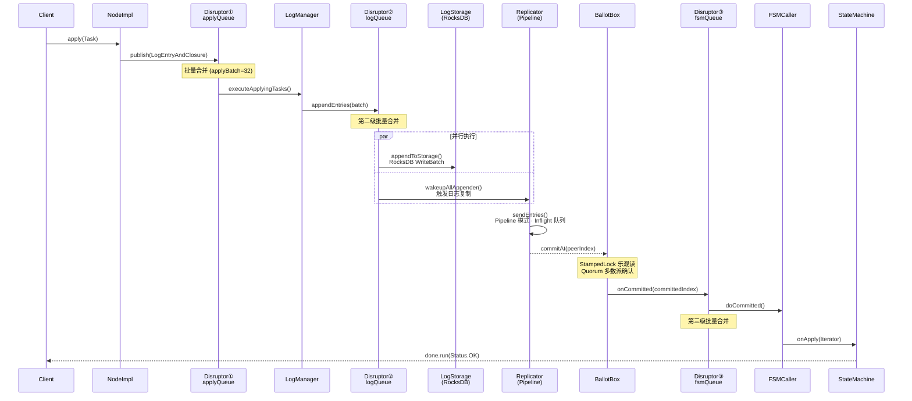
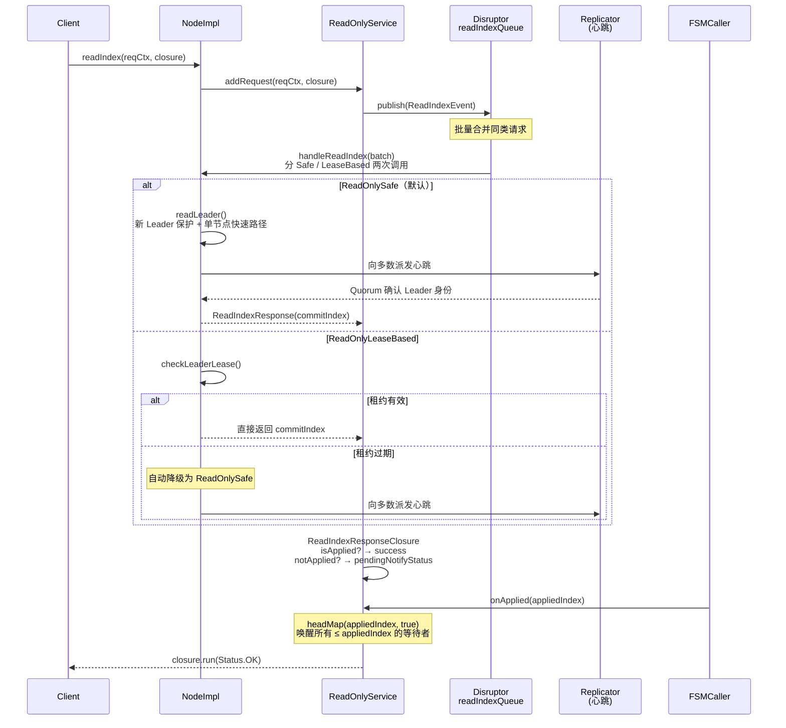
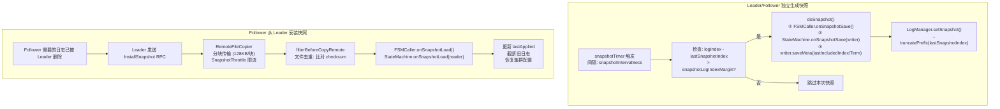
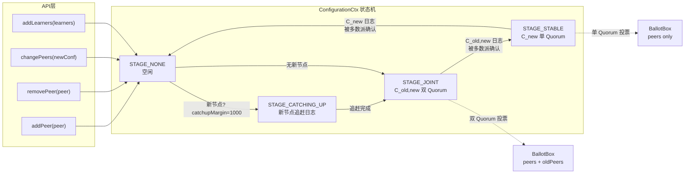
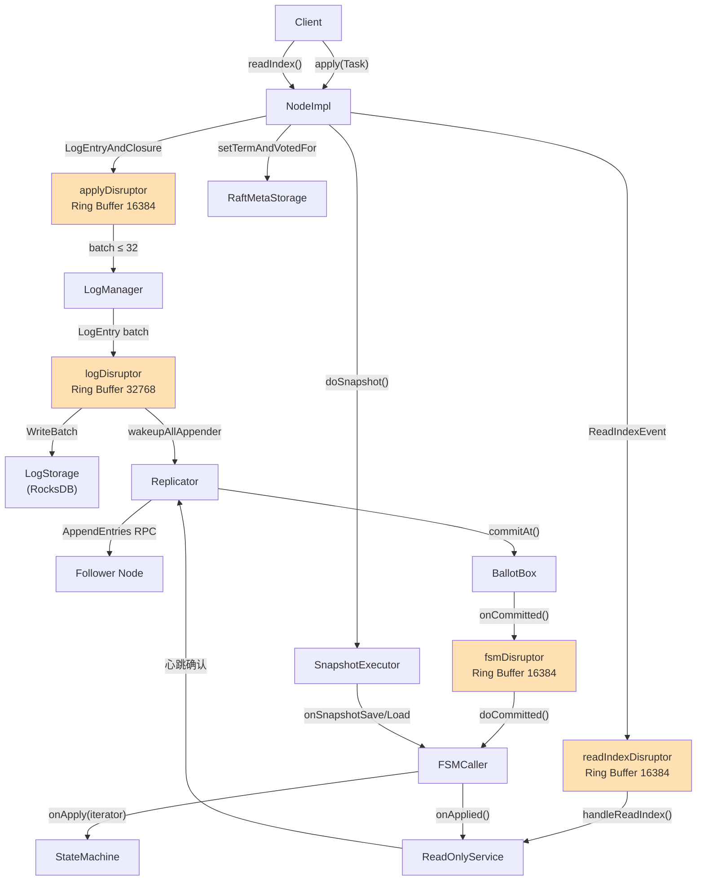
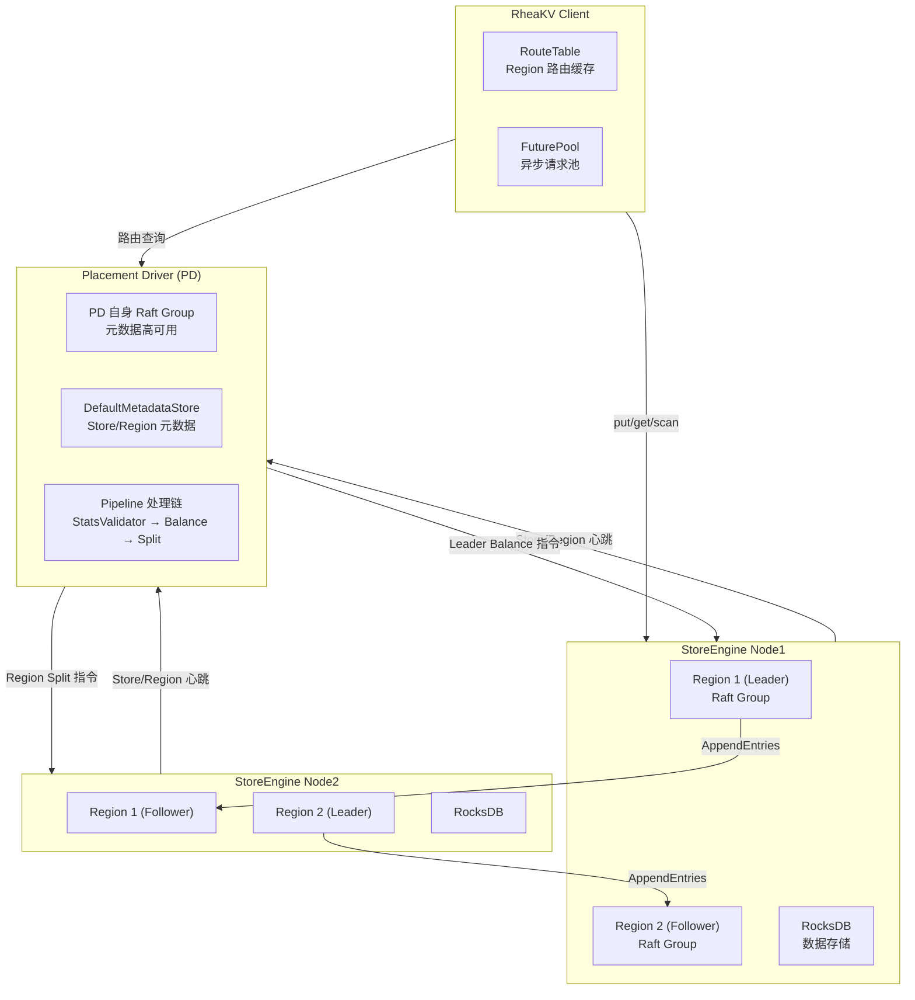
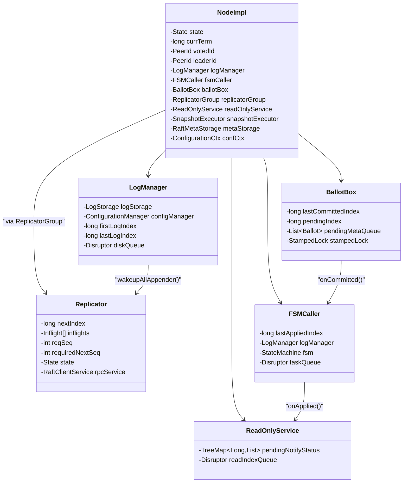
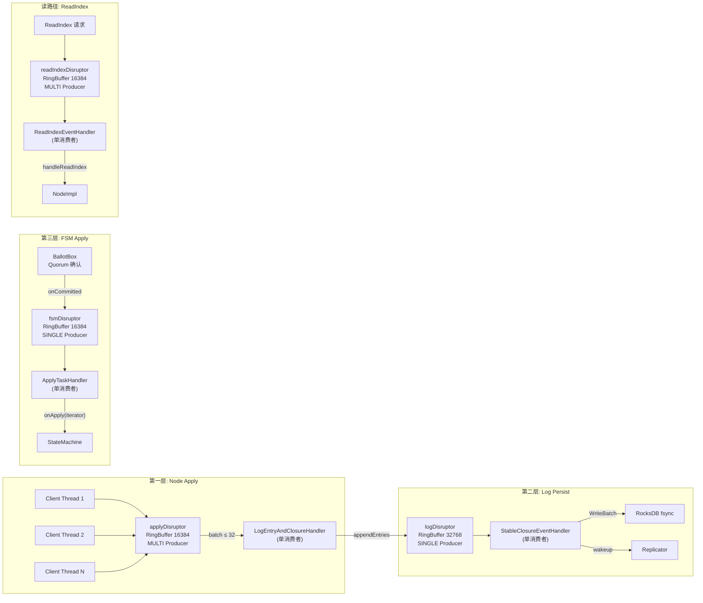

# JRaft 架构全景图 — 37 篇文档的终极串联

> **定位**：本文是 S1-S21 + 01-15 全部 37 篇源码学习文档的**架构总览图**。
> 用 Mermaid 图把所有组件、数据流、关键路径串联到一张地图上，方便回顾和面试前速查。
>
> **配套文档**：[面试 20 题](./FINAL-Interview-20.md)

---

## 目录

1. [组件全景架构图](#1-组件全景架构图)
2. [写路径全链路图（Node.apply → StateMachine.onApply）](#2-写路径全链路图)
3. [读路径全链路图（Node.readIndex → ReadIndexClosure）](#3-读路径全链路图)
4. [Leader 选举流程图（PreVote → BecomeLeader）](#4-leader-选举流程图)
5. [快照生成与安装流程图](#5-快照生成与安装流程图)
6. [成员变更流程图（Joint Consensus 两阶段）](#6-成员变更流程图)
7. [模块间数据流关系总图](#7-模块间数据流关系总图)
8. [RheaKV 分布式 KV 架构图](#8-rheakv-分布式-kv-架构图)
9. [关键数据结构关系图](#9-关键数据结构关系图)
10. [三层 Disruptor 流水线图](#10-三层-disruptor-流水线图)
11. [37 篇文档索引速查表](#11-37-篇文档索引速查表)

---

## 1. 组件全景架构图

```mermaid
flowchart TD
    subgraph 用户层["用户层 API"]
        CLIENT["Client<br/>Node.apply(Task) / Node.readIndex()"]
        RGS["RaftGroupService<br/>启动入口，管理 Node 生命周期"]
    end

    subgraph 核心节点["NodeImpl — 核心大脑 (145KB)"]
        direction TB
        STATE["State 状态机<br/>9 种状态 · 23 处转换<br/>📖 S20"]
        LOCK["LongHeldDetectingReadWriteLock<br/>读写锁 + 死锁检测<br/>📖 S20"]
        TIMER["定时器组 (4个)<br/>electionTimer · voteTimer<br/>stepDownTimer · snapshotTimer<br/>📖 S12"]
        CONF["ConfigurationCtx<br/>成员变更状态机<br/>📖 09"]
    end

    subgraph 选举层["选举层 📖 03 + S4"]
        PREVOTE["PreVote<br/>两阶段预投票"]
        VOTE["Ballot<br/>投票计数器"]
        PRIORITY["Election Priority<br/>优先级选举 + 衰减"]
        TRANSFER["Transfer Leadership<br/>TimeoutNow 主动让渡"]
    end

    subgraph 日志层["日志层 📖 04 + 05"]
        LM["LogManager<br/>Disruptor 异步 · 内存+持久化<br/>📖 04"]
        LS_ROCKS["RocksDBLogStorage<br/>旧版日志引擎<br/>📖 05"]
        LS_SEG["RocksDBSegmentLogStorage<br/>新版：索引与数据分离<br/>📖 S1"]
        LS_BDB["BDBLogStorage<br/>BerkeleyDB 扩展<br/>📖 S15"]
        CODEC["LogEntry Codec<br/>V1(手工) / V2(Protobuf)<br/>AutoDetectDecoder<br/>📖 S3"]
        LM --> LS_ROCKS
        LM --> LS_SEG
        LM --> LS_BDB
        LM --> CODEC
    end

    subgraph 复制层["复制层 📖 04 + S17 + S18"]
        RG["ReplicatorGroup<br/>管理所有 Follower 的 Replicator"]
        REP["Replicator<br/>Pipeline 模式 · Inflight 队列<br/>三层流控 · 序号系统<br/>📖 S18"]
        FOL["Follower RPC 处理<br/>handleAppendEntries<br/>handleRequestVote<br/>📖 S17"]
        RG --> REP
    end

    subgraph 投票箱["投票箱 📖 04"]
        BB["BallotBox<br/>StampedLock 乐观读<br/>Quorum 多数派确认"]
    end

    subgraph 状态机层["状态机层 📖 07"]
        FSM["FSMCaller<br/>Disruptor 异步驱动<br/>IteratorImpl 批量 apply"]
        SM["StateMachine (用户实现)<br/>onApply · onSnapshotSave<br/>onSnapshotLoad · onLeaderStart"]
        FSM --> SM
    end

    subgraph 快照层["快照层 📖 06 + S10"]
        SE["SnapshotExecutor<br/>快照调度器"]
        SS["SnapshotStorage<br/>LocalSnapshotStorage"]
        RFC["RemoteFileCopier<br/>分块传输 · 重试<br/>📖 S10"]
        THROTTLE["SnapshotThrottle<br/>令牌桶限流"]
        SE --> SS
        SE --> RFC
        RFC --> THROTTLE
    end

    subgraph 读服务层["读服务层 📖 08 + S21"]
        ROS["ReadOnlyService<br/>Disruptor 异步"]
        RI_SAFE["ReadOnlySafe<br/>Quorum 心跳确认"]
        RI_LEASE["ReadOnlyLeaseBased<br/>Leader 租约 · 自动降级"]
        ROS --> RI_SAFE
        ROS --> RI_LEASE
    end

    subgraph 元数据层["元数据层 📖 S2"]
        META["LocalRaftMetaStorage<br/>Protobuf 序列化<br/>term + votedFor 持久化"]
    end

    subgraph RPC层["RPC 层 📖 10 + S6 + S13"]
        RPC_BOLT["Bolt RPC<br/>默认实现 · 自定义协议<br/>📖 10"]
        RPC_GRPC["gRPC RPC<br/>SPI 扩展 · HTTP/2<br/>📖 S6"]
        PROTO["Protobuf 协议<br/>7 个 .proto 文件<br/>📖 S13"]
        RPC_BOLT --> PROTO
        RPC_GRPC --> PROTO
    end

    subgraph SPI层["SPI 扩展层 📖 S11"]
        SPI["JRaftServiceFactory<br/>+ JRaftServiceLoader<br/>可插拔组件工厂"]
    end

    subgraph 并发基础设施["并发基础设施 📖 11 + S12"]
        DISRUPTOR["Disruptor<br/>3 个 Ring Buffer"]
        HWT["HashedWheelTimer<br/>O(1) 定时器<br/>📖 S12"]
        METRICS["Metrics 可观测<br/>📖 12"]
    end

    subgraph 配置层["配置层 📖 S16"]
        OPTS["NodeOptions + RaftOptions<br/>60+ 配置项"]
    end

    %% 连接关系
    CLIENT --> 核心节点
    RGS --> 核心节点

    核心节点 --> 选举层
    核心节点 --> 日志层
    核心节点 --> 复制层
    核心节点 --> 投票箱
    核心节点 --> 状态机层
    核心节点 --> 快照层
    核心节点 --> 读服务层
    核心节点 --> 元数据层
    核心节点 --> RPC层

    SPI层 -.->|创建| 日志层
    SPI层 -.->|创建| 元数据层
    SPI层 -.->|创建| 快照层
    SPI层 -.->|创建| RPC层

    并发基础设施 -.->|底层支撑| 核心节点
    配置层 -.->|参数注入| 核心节点
```



---

## 2. 写路径全链路图

> 详见 📖 [S14-E2E-Write-Path](./00-e2e-write-path/S14-E2E-Write-Path.md)



**写路径关键数字**：
- **3 次 Disruptor**：`applyQueue` → `logQueue` → `fsmQueue`
- **3 级批量合并**：Node 层 32 条 → LogManager 层按 Buffer → FSMCaller 层合并 committed 区间
- **2 次磁盘 I/O**：日志写 RocksDB + fsync（关键路径），快照写磁盘（异步路径）

---

## 3. 读路径全链路图

> 详见 📖 [S21-E2E-Read-Path](./00-e2e-read-path/S21-E2E-Read-Path.md)



**读路径关键数字**：
- **1 次 Disruptor**：`readIndexQueue`（vs 写路径 3 次）
- **0 次磁盘 I/O**：ReadIndex 不写日志（vs 写路径 2 次）
- **1 次网络 RTT**（Safe 模式心跳确认）/ **0 次网络 RTT**（Lease 模式）

---

## 4. Leader 选举流程图

> 详见 📖 [03-Leader-Election](./03-leader-election/README.md) + [S4-Transfer-Leadership](./03-leader-election/S4-Transfer-Leadership.md)

```mermaid
stateDiagram-v2
    [*] --> FOLLOWER : init() → stepDown()

    state FOLLOWER {
        [*] --> WaitHeartbeat
        WaitHeartbeat --> CheckTimeout : electionTimer 超时
        CheckTimeout --> WaitHeartbeat : Leader 仍有效
        CheckTimeout --> CheckPriority : Leader 失效
        CheckPriority --> WaitHeartbeat : 优先级不够(跳过)
        CheckPriority --> PreVote : 优先级OK / 衰减后OK
    }

    state PreVote {
        [*] --> SendPreVote : term+1(不持久化)
        SendPreVote --> PreVoteGranted : 多数派授权
        SendPreVote --> PreVoteFailed : 被拒绝
        PreVoteFailed --> FOLLOWER : stepDown
    }

    PreVoteGranted --> CANDIDATE : electSelf()

    state CANDIDATE {
        [*] --> IncrTerm : currTerm++
        IncrTerm --> SendVote : 发 RequestVote
        SendVote --> Persist : metaStorage.setTermAndVotedFor()
        Persist --> CountVotes : 统计 Ballot
    }

    CountVotes --> LEADER : voteCtx.isGranted()
    CountVotes --> FOLLOWER : 收到更高 term / voteTimer 超时

    state LEADER {
        [*] --> InitReplicators : 为每个 Peer 启动 Replicator
        InitReplicators --> CommitNoop : confCtx.flush()(配置日志)
        CommitNoop --> StartStepDownTimer : 定期检查多数派
        StartStepDownTimer --> Serving : 正常服务
    }

    LEADER --> TRANSFERRING : transferLeadershipTo()
    TRANSFERRING --> FOLLOWER : TimeoutNow 发送 / 超时

    LEADER --> FOLLOWER : stepDown(更高 term)
```

---

## 5. 快照生成与安装流程图

> 详见 📖 [06-Snapshot](./06-snapshot/README.md) + [S10-Remote-File-Copier](./06-snapshot/S10-Remote-File-Copier.md)



---

## 6. 成员变更流程图

> 详见 📖 [09-Membership-Change](./09-membership-change/README.md) + [S5-Learner](./09-membership-change/S5-Learner.md)



---

## 7. 模块间数据流关系总图



---

## 8. RheaKV 分布式 KV 架构图

> 详见 📖 [13-RheaKV](./13-rheakv-advanced/README.md) + [S7-Placement-Driver](./14-rheakv-pd/S7-Placement-Driver.md)



---

## 9. 关键数据结构关系图



---

## 10. 三层 Disruptor 流水线图



---

## 11. 37 篇文档索引速查表

| # | 文档 | 核心主题 | 关键类 | 路径 |
|---|------|---------|--------|------|
| 01 | Overview | 全局架构、组件一览 | `NodeImpl` | `01-overview/README.md` |
| 02 | Node Lifecycle | init() 14 步、状态机 | `NodeImpl.init()` | `02-node-lifecycle/README.md` |
| 03 | Leader Election | PreVote、投票、becomeLeader | `Ballot`, `NodeImpl` | `03-leader-election/README.md` |
| 04 | Log Replication | Replicator、BallotBox、Pipeline | `Replicator`, `BallotBox` | `04-log-replication/README.md` |
| 05 | Log Storage | RocksDB 日志存储 | `RocksDBLogStorage` | `05-log-storage/README.md` |
| 06 | Snapshot | 快照生成/安装 | `SnapshotExecutorImpl` | `06-snapshot/README.md` |
| 07 | State Machine | FSMCaller、IteratorImpl | `FSMCallerImpl` | `07-state-machine/README.md` |
| 08 | ReadIndex | 线性一致读 Safe/Lease | `ReadOnlyServiceImpl` | `08-read-index/README.md` |
| 09 | Membership | Joint Consensus、addPeer | `ConfigurationCtx` | `09-membership-change/README.md` |
| 10 | RPC Layer | Bolt RPC 实现 | `BoltRaftRpcFactory` | `10-rpc-layer/README.md` |
| 11 | Concurrency | Disruptor、MPSC 队列 | `Disruptor` | `11-concurrency-infra/README.md` |
| 12 | Metrics | 全链路可观测性 | `NodeMetrics` | `12-metrics-observability/README.md` |
| 13 | RheaKV | 分布式 KV 存储 | `RheaKVStore` | `13-rheakv-advanced/README.md` |
| S1 | SegmentLog | 新一代日志引擎 | `RocksDBSegmentLogStorage` | `05b-segment-log-storage/S1` |
| S2 | MetaStorage | term/votedFor 持久化 | `LocalRaftMetaStorage` | `02-node-lifecycle/S2` |
| S3 | LogEntry Codec | V1/V2 编解码 | `V2Encoder/Decoder` | `05-log-storage/S3` |
| S4 | Transfer Leadership | 主动让渡 | `NodeImpl.transferLeadershipTo` | `03-leader-election/S4` |
| S5 | Learner | 只读副本角色 | `Configuration.learners` | `09-membership-change/S5` |
| S6 | gRPC | gRPC vs Bolt 对比 | `GrpcClient/GrpcServer` | `10-rpc-layer/S6` |
| S7 | Placement Driver | PD 调度中心 | `PlacementDriverServer` | `14-rheakv-pd/S7` |
| S8 | Bootstrap | 集群引导 | `NodeImpl.bootstrap()` | `02-node-lifecycle/S8` |
| S9 | Shutdown | 优雅停机 | `NodeImpl.shutdown()` | `02-node-lifecycle/S9` |
| S10 | Remote File Copier | 远程快照拷贝 | `RemoteFileCopier` | `06-snapshot/S10` |
| S11 | SPI | 可插拔工厂体系 | `JRaftServiceLoader` | `02-node-lifecycle/S11` |
| S12 | HashedWheelTimer | 时间轮实现 | `HashedWheelTimer` | `11-concurrency-infra/S12` |
| S13 | Protobuf Protocol | 消息结构定义 | `raft.proto` | `10-rpc-layer/S13` |
| S14 | E2E Write Path | 端到端写入链路 | 横跨 6 个组件 | `00-e2e-write-path/S14` |
| S15 | BDB LogStorage | BerkeleyDB 日志存储 | `BDBLogStorage` | `05-log-storage/S15` |
| S16 | Configuration Guide | 60+ 配置项全解 | `NodeOptions/RaftOptions` | `01-overview/S16` |
| S17 | Follower RPC | Follower 端 RPC 处理 | `NodeImpl.handle*Request` | `04-log-replication/S17` |
| S18 | Replicator Pipeline | Inflight/序号/流控 | `Replicator` | `04-log-replication/S18` |
| S19 | Multi-Raft Group | 多 Raft 组架构 | `NodeManager/RouteTable` | `09-membership-change/S19` |
| S20 | NodeImpl StateMachine | 9 状态 23 转换 | `NodeImpl.state` | `02-node-lifecycle/S20` |
| S21 | E2E Read Path | 端到端读取链路 | `ReadOnlyServiceImpl` | `00-e2e-read-path/S21` |
| — | Raft Paper vs JRaft | 论文对照 | — | `15-raft-paper-vs-jraft/` |

---

> **下一篇**：[面试 20 题 →](./FINAL-Interview-20.md)
